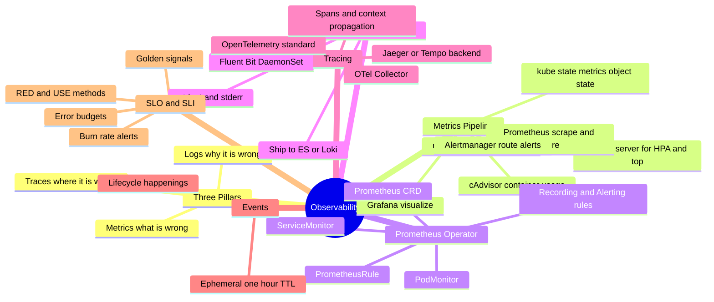
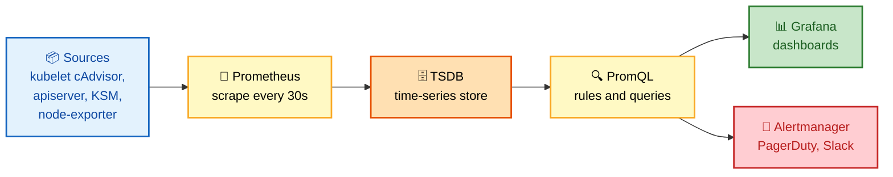
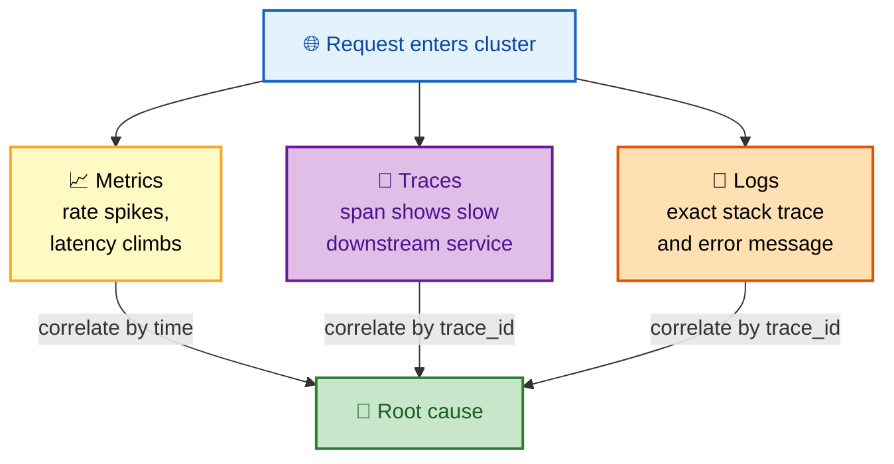
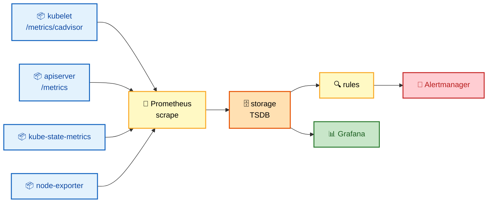

# Section 14: Observability

Observability in Kubernetes means understanding the state of your cluster and applications **from the outside** — without attaching a debugger. You reason about what a system is doing purely from the signals it emits.

The **three pillars** (metrics, logs, traces) combine with Kubernetes-specific **Events** and **audit logs** to give you full visibility. Interviewers probe this to see whether you can *diagnose a production incident* from telemetry alone, not just recite tool names.

> 🧠 **The mental model:** *Metrics* tell you **something is wrong** (a graph spikes). *Traces* tell you **where** it's wrong (which service in the request path). *Logs* tell you **why** it's wrong (the exact error). You need all three.

## Subtopic Index

- [Metrics Architecture](#metrics-architecture)
- [Prometheus Operator](#prometheus-operator)
- [kube-state-metrics](#kube-state-metrics)
- [cAdvisor Metrics](#cadvisor-metrics)
- [Recording Rules and Alerting Rules](#recording-rules-and-alerting-rules)
- [Logging Architecture](#logging-architecture)
- [Fluent Bit and Log Aggregation](#fluent-bit-and-log-aggregation)
- [Distributed Tracing with OpenTelemetry](#distributed-tracing-with-opentelemetry)
- [Grafana Dashboards](#grafana-dashboards)
- [SLOs and Error Budgets on Kubernetes](#slos-and-error-budgets-on-kubernetes)
- [Kubernetes Events](#kubernetes-events)
- [Debugging Toolkit](#debugging-toolkit)

---

## 🗺️ Visual Overview

**Mind map — the whole section at a glance** (skim first, revisit last):



**The metrics pipeline — scrape → store → query → alert** (highest-value flow):



**The three pillars — how logs, metrics, and traces work together:**



> 🧠 **Memory hooks (mnemonics):**
> - **Three pillars — "M-T-L = What / Where / Why":** **M**etrics say *something* broke, **T**races say *where*, **L**ogs say *why*.
> - **RED (for services):** **R**ate, **E**rrors, **D**uration — "how much traffic, how much failing, how slow."
> - **USE (for resources):** **U**tilization, **S**aturation, **E**rrors — "how busy, how backed-up, how broken."
> - **Golden signals (Google SRE):** **L**atency, **T**raffic, **E**rrors, **S**aturation → *"Let The Engineers Sleep."*
> - **Who exports what:** *cAdvisor = usage* (CPU/mem it's *using*), *kube-state-metrics = state* (what it *should be*). "Usage vs Should-be."
> - **Working set wins:** Kubernetes evicts and `kubectl top` reports on **working_set_bytes**, not RSS.

---

## Metrics Architecture

> 🎯 **Interview weight: High** — the foundation of every "how would you monitor this?" question. Know the two paths cold.

**In one line:** Kubernetes exposes metrics through **two independent paths** — the lightweight **metrics-server** (for HPA/VPA/`kubectl top`) and **Prometheus scraping** (raw time-series from every component).

**The two paths — don't confuse them:**

| | metrics-server | Prometheus |
|---|---|---|
| Purpose | Feed HPA/VPA and `kubectl top` | Full observability, dashboards, alerts |
| Data | Only live CPU/memory (no history) | All time-series, retained for weeks |
| API | Kubernetes Metrics API (aggregated) | Its own TSDB + PromQL |
| Storage | In-memory, ephemeral | On-disk, durable |

**Where the raw numbers come from:**

- **kubelet** → container metrics at `/metrics/cadvisor` (cAdvisor) and node stats at `/stats/summary`.
- **apiserver** → its own metrics at `/metrics`.
- **kube-state-metrics** → Kubernetes *object state* (desired replicas, pod phase, etc.).
- **node-exporter** → OS-level metrics (CPU, memory, disk, network) per node.

Prometheus **scrapes** all these endpoints and stores the time-series. **Grafana** visualizes it. **Alertmanager** routes alerts from Prometheus rules to PagerDuty, Slack, etc.

> 🔍 **The scrape flow (colorized):**



Original layout (same information, text form):

```
Pods/Nodes                Prometheus
  kubelet /metrics/cadvisor → scrape → storage → rules → Alertmanager
  apiserver /metrics        →                          → Grafana
  kube-state-metrics        →
  node-exporter             →
```

### Key commands
```bash
# Check metrics-server is working (for kubectl top)
kubectl top nodes
kubectl top pods -A --sort-by=memory

# Check if Prometheus scrape targets are healthy
kubectl port-forward -n monitoring svc/prometheus 9090:9090 &
# Then: http://localhost:9090/targets

# Raw metrics from kubelet
curl -sk https://$(kubectl get node <node> -o jsonpath='{.status.addresses[?(@.type=="InternalIP")].address}'):10250/metrics/cadvisor \
  --cacert /etc/kubernetes/pki/ca.crt --cert ... --key ... | grep container_cpu_usage | head -10

# Metrics from apiserver
kubectl get --raw='/metrics' | grep apiserver_request_duration_seconds | head -10
```

---

## Prometheus Operator

> 🎯 **Interview weight: High** — the standard way Prometheus is run on Kubernetes today. Know the CRDs.

**In one line:** The Prometheus Operator turns Prometheus configuration into **Kubernetes-native CRDs**, so you declare *what to scrape* with labels instead of editing a monolithic config file.

Installed via the **kube-prometheus-stack** Helm chart, it manages Prometheus instances through these CRDs:

| CRD | What it defines |
|---|---|
| **Prometheus** | A Prometheus cluster instance: retention, storage, replication |
| **ServiceMonitor** | Which **Services** to scrape (by label), interval, path, TLS |
| **PodMonitor** | Scrapes **pods directly** when no Service exists |
| **PrometheusRule** | Alerting and recording rules |
| **Alertmanager** | The Alertmanager cluster and its routing config |

ServiceMonitor example:
```yaml
apiVersion: monitoring.coreos.com/v1
kind: ServiceMonitor
metadata:
  name: payments-metrics
  namespace: monitoring
  labels:
    release: prometheus    # must match Prometheus's serviceMonitorSelector
spec:
  selector:
    matchLabels:
      app: payments
  namespaceSelector:
    matchNames: [production]
  endpoints:
  - port: metrics          # named port in the Service
    interval: 30s
    path: /metrics
```

The Prometheus Operator controller watches ServiceMonitor objects and generates Prometheus scrape config automatically — **no manual config file edits**.

> ⚠️ **Most common gotcha:** the ServiceMonitor's `labels` must match the Prometheus instance's `serviceMonitorSelector` (here `release: prometheus`). If they don't match, the target is silently ignored — no error, just missing metrics.

### Key commands
```bash
# Check ServiceMonitors
kubectl get servicemonitor -A
kubectl describe servicemonitor payments-metrics -n monitoring

# Check Prometheus targets from Prometheus pod (for debugging scrape issues)
kubectl port-forward -n monitoring deploy/prometheus-kube-prometheus-prometheus 9090:9090 &

# Check PrometheusRules
kubectl get prometheusrule -A
kubectl describe prometheusrule -n monitoring kubernetes-apps

# Reload Prometheus config (happens automatically via operator, but force with:)
kubectl rollout restart deploy/prometheus-kube-prometheus-prometheus -n monitoring
```

---

## kube-state-metrics

> 🎯 **Interview weight: High** — the classic "cAdvisor vs kube-state-metrics" distinction is a favorite filter question.

**In one line:** kube-state-metrics (KSM) exports Kubernetes **object state** as Prometheus metrics — what objects *should* look like, not how much resource they're *using*.

> 🧠 **The key distinction:** KSM does **NOT** export resource usage (that's cAdvisor). It exports object *properties*: Deployment desired/available replicas, Pod phase, Job completion, ConfigMap count, etc. Remember: **cAdvisor = usage, KSM = state.**

Key metrics:

| Metric | What it tells you |
|---|---|
| `kube_deployment_status_replicas_available` | Available replicas per Deployment |
| `kube_pod_status_phase` | Pending/Running/Failed/Succeeded per pod |
| `kube_pod_container_status_restarts_total` | Restart count per container |
| `kube_job_status_succeeded` | Successful job completions |
| `kube_node_status_condition` | Node conditions (Ready, DiskPressure, etc.) |
| `kube_persistentvolumeclaim_status_phase` | PVC bound/pending/lost |

These metrics power dashboards and alerts for **desired-vs-actual state mismatches** (e.g., "3 replicas wanted, 1 available").

### Key commands
```bash
# Check KSM is running
kubectl -n monitoring get pods -l app.kubernetes.io/name=kube-state-metrics

# Query directly
kubectl port-forward -n monitoring svc/kube-state-metrics 8080:8080 &
curl -s http://localhost:8080/metrics | grep kube_deployment_status

# Useful alert query: pods not running
kubectl get --raw='/metrics' 2>/dev/null | grep 'kube_pod_status_phase{phase="Failed"}'
```

---

## cAdvisor Metrics

> 🎯 **Interview weight: High** — working-set vs RSS and CPU throttling come up constantly in troubleshooting rounds.

**In one line:** cAdvisor runs **inside the kubelet** and collects container resource usage by reading directly from **cgroups**.

Key metrics:

| Metric | Meaning |
|---|---|
| `container_cpu_usage_seconds_total` | Cumulative CPU usage (use `rate()` for per-second) |
| `container_cpu_cfs_throttled_seconds_total` | CPU throttling time (**high = limits too low**) |
| `container_memory_rss` | Actual RSS memory usage |
| `container_memory_working_set_bytes` | Memory used (**what limits compare against**) |
| `container_oom_events_total` | OOM kill events |
| `container_network_transmit/receive_bytes_total` | Network traffic per container |

> ⚠️ **Critical distinction — working set vs RSS:** **`container_memory_working_set_bytes`** is what Kubernetes uses for **eviction decisions** and what `kubectl top` shows — *not* `container_memory_rss`. Working set = RSS + file-backed pages that aren't reclaimable.

> 🔍 **CPU throttling is a critical latency signal.** Compute the throttled fraction:
> ```
> rate(container_cpu_cfs_throttled_seconds_total[5m]) / rate(container_cpu_cfs_periods_total[5m])
> ```
> **>25% is worth investigating** — throttling directly adds request latency even when average CPU looks fine.

---

## Recording Rules and Alerting Rules

> 🎯 **Interview weight: Medium** — know *why* recording rules exist (speed) and *when* alerts fire (`for:` duration).

**In one line:** **Recording rules** pre-compute expensive queries into new time-series (fast dashboards); **alerting rules** fire Alertmanager when a condition holds for a sustained window.

**Recording rules** pre-compute expensive queries into new time-series, making dashboards fast:
```yaml
- record: job:container_cpu_usage:rate5m
  expr: sum by (job) (rate(container_cpu_usage_seconds_total[5m]))
```

**Alerting rules** fire Alertmanager when conditions are met. The **`for:`** clause is key — it requires the condition to hold *continuously* for that duration before firing, which suppresses flapping:
```yaml
- alert: PodCrashLooping
  expr: rate(kube_pod_container_status_restarts_total[15m]) > 0
  for: 5m
  labels:
    severity: warning
  annotations:
    summary: "Pod {{ $labels.namespace }}/{{ $labels.pod }} is crash looping"
    description: "Container {{ $labels.container }} has restarted {{ $value | humanize }} times in 15m"

- alert: HighCPUThrottling
  expr: |
    sum by (namespace, pod, container) (
      rate(container_cpu_cfs_throttled_seconds_total[5m])
    ) /
    sum by (namespace, pod, container) (
      rate(container_cpu_cfs_periods_total[5m])
    ) > 0.50
  for: 10m
  labels:
    severity: warning
```

---

## Logging Architecture

> 🎯 **Interview weight: High** — "how do logs flow from a container to a searchable store?" is a near-guaranteed question.

**In one line:** Containers write to **stdout/stderr**, the kubelet persists those to JSON files on the node, and a **log-agent DaemonSet** ships them to a central store — aggregation is *not* built into Kubernetes.

**The log path, step by step:**

- Container logs go to **stdout/stderr**.
- The **kubelet** captures them via the runtime's log driver and writes them to `/var/log/pods/<ns>_<pod>_<uid>/<container>/<restart>.log` in JSON format.
- **`kubectl logs`** reads these files via the kubelet API.

> 💡 **Aggregation is your job.** Kubernetes has no central log store. You deploy a **log agent DaemonSet** (Fluent Bit, Fluentd, Vector) that tails these files and ships them to Elasticsearch/OpenSearch, CloudWatch Logs, or Loki.

**Log rotation** is handled by the kubelet: `containerLogMaxSize` (default **10Mi**) and `containerLogMaxFiles` (default **5**) cap per-container log size.

> ⚠️ **Structured logging (JSON lines) is essential** for searchability. Every log record should include: `timestamp`, `level`, `trace_id` (to correlate with traces), `service` name, and request ID.

### Key commands
```bash
# Read logs (multiple containers, follow, since)
kubectl logs <pod> -c <container> --previous --tail=100
kubectl logs -l app=payments -n production --tail=50 --max-log-requests=10
kubectl logs <pod> --since=1h

# Check kubelet log rotation config
cat /var/lib/kubelet/config.yaml | grep -E 'containerLog|logRotate'

# Direct log file on node (bypasses kubelet proxy)
ls /var/log/pods/<namespace>_<pod>_<uid>/
tail -f /var/log/pods/production_payments-xxx/app/0.log | python3 -m json.tool
```

---

## Fluent Bit and Log Aggregation

> 🎯 **Interview weight: Medium** — know the DaemonSet + metadata-enrichment + backpressure story.

**In one line:** Fluent Bit is a **lightweight** log forwarder that runs as a **DaemonSet**, tails node log files, enriches them with Kubernetes metadata, and ships to an output backend.

**What each stage does:**

- **Runs as a DaemonSet** — one instance per node.
- **Tails** `/var/log/pods/` (or symlinked `/var/log/containers/`).
- **Enriches** logs with Kubernetes metadata (pod name, namespace, labels) pulled from the API.
- **Ships** to an output plugin (CloudWatch, Elasticsearch, Loki, etc.).

```yaml
# Fluent Bit ConfigMap (simplified)
[INPUT]
    Name              tail
    Path              /var/log/pods/*/*/*.log
    Parser            cri                          # CRI log format parser
    Tag               kube.*
    Refresh_Interval  5
    Mem_Buf_Limit     50MB
    Skip_Long_Lines   On

[FILTER]
    Name              kubernetes
    Match             kube.*
    Kube_URL          https://kubernetes.default.svc:443
    Merge_Log         On                            # merge JSON log payload
    K8S-Logging.Exclude Off

[OUTPUT]
    Name              cloudwatch_logs
    Match             kube.*
    region            us-east-1
    log_group_name    /eks/cluster-name/containers
    log_stream_prefix pods/
    auto_create_group On
```

Key tuning: `Mem_Buf_Limit` prevents unbounded memory growth during output backpressure. `Skip_Long_Lines` prevents one oversized log line from blocking the pipeline. Fluent Bit uses a `backpressure` mechanism — when output is slow, it pauses input to avoid memory overflow.

> ⚠️ **Backpressure is the memory-safety trick to remember:** when the output (ES/Loki) slows down, Fluent Bit **pauses input** rather than buffering unbounded — so a slow backend can't OOM the log agent.

---

## Distributed Tracing with OpenTelemetry

> 🎯 **Interview weight: Medium** — know spans, context propagation, and trace-log correlation.

**In one line:** OpenTelemetry (OTel) is the CNCF standard that stitches per-service **spans** into a single end-to-end **trace** by propagating context across service calls.

An OTel-instrumented application creates **spans** for each operation and propagates context (the **W3C TraceContext** header) across service calls. This builds a complete trace showing a request's entire path through all microservices.

**Two pieces to know:**

- **OTel Collector** — a daemon (DaemonSet or centralized Deployment) that receives spans, processes/samples them, and exports to a backend (Jaeger, Grafana Tempo, Zipkin, Datadog).
- **Auto-instrumentation** — for Java, Node.js, Python, and .NET, OTel agents instrument apps **without code changes** by injecting an agent via the OTel Operator's `Instrumentation` CRD:

```yaml
apiVersion: opentelemetry.io/v1alpha1
kind: Instrumentation
metadata:
  name: java-auto-instrument
  namespace: production
spec:
  exporter:
    endpoint: http://otel-collector.monitoring:4317
  java:
    image: ghcr.io/open-telemetry/opentelemetry-operator/autoinstrumentation-java:latest
```

The OTel Operator injects an init container that copies the agent and patches the pod's JVM args. No application code changes needed.

**Trace-log correlation**: include `trace_id` and `span_id` in structured log entries. When an error appears in logs, use the `trace_id` to pull the full request trace from Tempo/Jaeger.

> 💡 **The correlation payoff:** a shared `trace_id` in both logs and traces is what lets you jump from *"this log line errored"* straight to *"here's the full request path that caused it"* — the single most useful debugging move in a microservices outage.

---

## Grafana Dashboards

> 🎯 **Interview weight: High** — RED and USE methods are core SRE vocabulary interviewers expect.

**In one line:** Grafana visualizes metrics (Prometheus), logs (Loki), and traces (Tempo); the **USE** method describes *resources* and the **RED** method describes *services*.

**USE method** — for every *resource* (CPU, memory, disk), track **U**tilization, **S**aturation, **E**rrors:
- CPU: utilization (`rate(container_cpu_usage_seconds_total)`), saturation (throttled %), errors.
- Memory: utilization (`container_memory_working_set_bytes / container_spec_memory_limit_bytes`), saturation (OOM kills), errors.
- Disk: utilization (bytes used/total), saturation (iops queue depth), errors.

**RED method** (per service):
- Rate: `rate(http_requests_total[5m])`
- Error rate: `rate(http_requests_total{status=~"5.."}[5m]) / rate(http_requests_total[5m])`
- Duration: `histogram_quantile(0.99, rate(http_request_duration_seconds_bucket[5m]))`

**Kubernetes control plane dashboard**: apiserver latency, etcd fsync, scheduler throughput, controller-manager reconcile rate.

**Node dashboard**: node CPU/memory/disk pressure, kubelet pod sync latency, PLEG relist duration.

> 🧠 **RED vs USE in one breath:** **RED = the caller's view** (how the *service* looks to clients); **USE = the operator's view** (how the *resource* looks underneath). Services get RED, resources get USE.

---

## SLOs and Error Budgets on Kubernetes

> 🎯 **Interview weight: High** — SLO/error-budget/burn-rate reasoning is a senior-level differentiator.

**In one line:** An **SLO** turns reliability into a number (e.g., 99.9% success); the **error budget** is the allowed failure (0.1%), and **burn-rate alerts** page you when you're spending it too fast.

An SLO (Service Level Objective) for a Kubernetes service typically measures **availability** (% of successful requests) and **latency** (% of requests under a threshold).

**Prometheus recording rule for SLO availability**:
```yaml
# Good events: non-5xx responses
- record: namespace_job:http_requests_total:sum_rate
  expr: sum(rate(http_requests_total[5m])) by (namespace, job)
- record: namespace_job:http_requests_errors:sum_rate
  expr: sum(rate(http_requests_total{code=~"5.."}[5m])) by (namespace, job)

# Error rate
- record: namespace_job:error_rate
  expr: namespace_job:http_requests_errors:sum_rate / namespace_job:http_requests_total:sum_rate
```

**Multi-window burn-rate alert** (fires when error budget is burning fast):
```yaml
- alert: ErrorBudgetBurning
  expr: |
    (
      job:slo_errors_per_request:ratio_rate1h{job="payments"} > (14.4 * 0.001)
      and
      job:slo_errors_per_request:ratio_rate5m{job="payments"} > (14.4 * 0.001)
    )
    or
    (
      job:slo_errors_per_request:ratio_rate6h{job="payments"} > (6 * 0.001)
      and
      job:slo_errors_per_request:ratio_rate30m{job="payments"} > (6 * 0.001)
    )
  labels:
    severity: critical
```

This is the Google SRE book's burn-rate alerting: pages immediately when the budget is burning 14.4x too fast (short window confirms it's real), and pages later when burning 6x too fast over a longer window.

> 🧠 **Why two windows?** The **long window** (1h/6h) decides *whether* to alert (is the budget really burning?); the **short window** (5m/30m) confirms the problem is *still happening right now* — so you don't page on an incident that already resolved. Fast burn → page now; slow burn → page eventually.

---

## Kubernetes Events

> 🎯 **Interview weight: Medium** — know that Events are ephemeral and distinct from logs/audit logs.

**In one line:** Events are Kubernetes objects that record **lifecycle happenings** (scheduling, image-pull failures, probe failures, scaling) — and they **expire after ~1 hour**.

> ⚠️ **Events are ephemeral** — the default TTL is **1 hour**. If you need history, you must export them; by the time you investigate, the Event may already be gone.

**Three things are easy to confuse — keep them straight:**

| Signal | Source | Records |
|---|---|---|
| **Events** | Kubernetes control plane | Lifecycle actions (schedule, pull, probe, scale) |
| **Application logs** | Container stdout/stderr | What the app printed |
| **Audit logs** | apiserver | Every API call (who did what) |

```bash
# Recent events (most useful for debugging)
kubectl get events -n <namespace> --sort-by='.lastTimestamp'

# Events for a specific object
kubectl get events --field-selector involvedObject.name=<pod-name>

# Events for all objects across the cluster (sorted by time)
kubectl get events -A --sort-by='.lastTimestamp' | tail -30

# Filter for warnings only
kubectl get events -A --field-selector type=Warning
```

For persistent event storage: deploy an **event exporter** (kubernetes-event-exporter) that forwards events to Elasticsearch or CloudWatch for historical querying and alerting on event patterns.

---

## Debugging Toolkit

> 🎯 **Interview weight: High** — a live "how would you debug this pod/node?" is a common practical round.

**In one line:** A layered set of tools — from `kubectl debug` (ephemeral containers) down to `crictl` (runtime) — lets you inspect a workload at every level without rebuilding its image.

> 💡 **Pick the right layer:** `kubectl exec`/`debug` for the **pod**, `crictl` for the **container runtime** on a node, `etcdctl` for **cluster state**, `port-forward` to reach an **internal service** from your laptop.

**kubectl debug** (ephemeral containers):
```bash
# Add busybox debug container sharing pod namespaces
kubectl debug -it <pod> --image=busybox --target=<container>

# Debug a node issue by running a pod with host access
kubectl debug node/<node> -it --image=ubuntu -- bash
# Inside: nsenter --target 1 --mount --uts --net --ipc -- bash
```

**kubectl exec** for quick checks:
```bash
kubectl exec <pod> -- netstat -tlnp
kubectl exec <pod> -- cat /proc/1/net/tcp
kubectl exec <pod> -- df -h
```

**crictl** for runtime debugging on nodes:
```bash
crictl ps -a                          # all containers
crictl logs <container-id>            # container logs
crictl inspect <container-id>         # full container config
crictl stats                          # container resource usage
crictl pull <image>                   # test image pull
```

**etcdctl** for cluster state issues (Section 4).

**Port-forward** for debugging internal services:
```bash
kubectl port-forward svc/my-service 8080:80 -n production
# Now: curl http://localhost:8080/health
```

---

## Interview Questions

### Conceptual / Internals (8 questions)

**1. What is the difference between container_memory_rss and container_memory_working_set_bytes, and which does Kubernetes use for eviction?**
`container_memory_rss` is the Resident Set Size — bytes currently in physical RAM. `container_memory_working_set_bytes` = RSS + active file-backed pages (pages the kernel won't reclaim under pressure). Kubernetes uses **working_set_bytes** for: (1) `kubectl top pod` output; (2) kubelet eviction decisions; (3) comparing against memory limits. A pod can appear healthy by RSS but be close to its limit by working_set due to large active file cache. A pod is OOMKilled when `working_set_bytes > limits.memory`, not when RSS > limits.

**2. Explain CPU throttling and how to detect it with metrics.**
CPU throttling occurs when a container exhausts its CFS quota (`cpu.cfs_quota_us`) in a period. The process is suspended until the next period. Detection: `rate(container_cpu_cfs_throttled_seconds_total[5m]) / rate(container_cpu_cfs_periods_total[5m])` gives the throttled fraction. >25% indicates the CPU limit is too restrictive. The container may use only 30% CPU on average but spike to 200% for 100ms on each request — the spike consumes the quota, causing p99 latency spikes even at low average utilization.

**3. Why are Prometheus recording rules important for SLO dashboards?**
Recording rules pre-compute expensive aggregation queries (summing across thousands of pod metrics) and store them as new, low-cardinality time-series. Without recording rules, a Grafana dashboard querying 30 days of data with a complex aggregation would time out or be very slow — each render requires scanning all raw time-series. With recording rules, the pre-aggregated series is trivially fast to query. They also ensure consistency: every alert and dashboard uses the same calculation, not slightly-different ad-hoc queries.

**4. How does the Prometheus Operator translate a ServiceMonitor into Prometheus scrape config?**
The Prometheus Operator controller watches ServiceMonitor objects. When it finds one, it: (1) resolves the Service matching the `selector` in the listed namespaces; (2) for each matching Service, reads its ports and generates a scrape_config job with the Service's endpoints (via the Kubernetes SD `endpoints` role); (3) adds the job to the in-memory Prometheus configuration; (4) calls the Prometheus HTTP reload endpoint. Prometheus starts scraping the new targets. No manual config file edits. No Prometheus restart needed.

**5. What is multi-window burn-rate alerting and why is it better than threshold alerts?**
A simple error-rate threshold (`error_rate > 1%`) fires for any sustained 1% error rate — including tiny traffic volumes where 1 error = 1% rate, and it doesn't distinguish a brief spike from sustained degradation. Burn-rate alerting calculates how fast the error budget is being consumed relative to the budget's total duration. A burn rate of 14.4 means the error budget would be exhausted in 1/14.4 of the remaining time. Multi-window (short + long) requires BOTH a short window (1h/5m) AND a long window (6h/30m) to confirm the burn is sustained, not a transient spike. This dramatically reduces false positives while maintaining sensitivity to genuine degradation.

**6. Explain how OpenTelemetry context propagation works across service boundaries.**
An OTel-instrumented service creates a root span for incoming requests and injects the trace context into outgoing HTTP/gRPC calls via standard headers: `traceparent: 00-<trace-id>-<span-id>-<flags>` (W3C TraceContext). When service B receives the request, its OTel instrumentation extracts the context, creating a child span linked to service A's span via the parent span ID. All spans share the same `trace_id`. The collector receives spans from multiple services and the trace backend (Tempo, Jaeger) can reconstruct the full request path across all services using the shared `trace_id`.

**7. How does Fluent Bit handle backpressure when the output (CloudWatch/Elasticsearch) is slow?**
Fluent Bit uses a `backpressure` mechanism: when the output plugin's buffer is full (output is slow), it pauses all input plugins. This prevents unbounded memory growth by signaling inputs to stop reading. The `Mem_Buf_Limit` setting caps the in-memory buffer; once reached, new log lines are dropped (with a warning). For critical logs, use `storage.type filesystem` to buffer on disk instead of dropping. The input's `Refresh_Interval` and output retry settings control how long before forced drops occur.

**8. A pod has been OOMKilled three times in 30 minutes but kubectl top shows only 200Mi usage against a 512Mi limit. Explain the discrepancy.**
`kubectl top` shows the current snapshot of `container_memory_working_set_bytes`. The pod spiked above 512Mi (triggering OOMKill), fell back to 200Mi (as memory was freed on kill/restart), and kubectl top now shows the post-kill low value. The OOM kill happened at a peak, not the current moment. To diagnose the peak: check `kube_pod_container_status_last_terminated_reason{reason="OOMKilled"}` in Prometheus, `kubectl describe pod <pod> | grep OOMKilled`, and `container_memory_working_set_bytes` over time in Grafana. The application has a memory spike/leak that exceeds the limit briefly — fix: increase the limit or find and fix the memory spike source.

### Scenario Questions (6 questions)

**9. An alert fires: "Payment service error rate > 1% for 5 minutes." Walk through your investigation.**
First, understand scope: `kubectl get pods -l app=payments -n production`. Any pods CrashLooping? If yes → root cause is pod failure. If not: check recent deploys (`kubectl rollout history deployment/payments`). Was there a recent deployment? Check logs: `kubectl logs -l app=payments -n production --since=10m | grep -i error`. Check traces: find failing requests in Jaeger/Tempo by trace ID from logs. Check downstream dependencies: database latency, cache hit rate. Check infra: node conditions, disk/memory pressure. Create a timeline of events.

**10. CoreDNS pods are consuming 8 CPUs across the cluster. What is causing this and how do you diagnose and fix?**
High CPU usually means high query rate. Steps: (1) Check query rate: `rate(coredns_dns_requests_total[5m])` per pod. (2) Check NXDOMAIN rate — if high: ndots storm from application pods. (3) Enable `log` plugin temporarily to see which pods generate the most queries. (4) Check cache hit rate: low hit rate → many unique queries bypass cache. Fix: add NodeLocal DNSCache, set `ndots: 1` on heavy-query pods, increase cache TTL, scale CoreDNS replicas.

**11. The SLO dashboard shows 99.85% availability for payments, against a 99.9% SLO. Calculate the error budget status and recommend action.**
Available error budget: `1 - 0.999 = 0.001` (0.1%). Current error rate: `1 - 0.9985 = 0.0015` (0.15%). Over 30 days, budget allowed: `30d × 0.001 = 43.2 minutes`. Actual errors: `30d × 0.0015 / 0.001 = 1.5× budget consumed = -50% deficit`. The error budget is exhausted (negative). Action: freeze non-essential feature deployments, focus engineering effort on reliability. Investigate top error sources in the 30-day window. Consider increasing the SLO window (weekly instead of monthly) if the issue is recent.

**12. Traces show high latency in a service but metrics show normal CPU/memory. What else do you check?**
Metrics only show resource usage — not contention or I/O. Check: (1) Database query time in traces (most common): slow queries, missing indexes. (2) External API latency: downstream services slow. (3) Network latency: cross-AZ traffic, DNS lookup time. (4) Lock contention: thread pool exhaustion (check JVM thread pool metrics, connection pool saturation). (5) GC pauses: JVM full GC causing request stalls (check `jvm_gc_pause_seconds` metric). (6) Synchronous I/O blocking a thread pool: CPU is idle but threads are blocked on disk/network.

### FAANG Deep Dive (6 questions)

**13. How does Prometheus scraping work for pods that don't have a Service (bare pod scraping)?**
ServiceMonitors discover scrape targets via the Kubernetes Endpoints/EndpointSlice API — they require a Service. PodMonitors directly discover pods via pod labels. The Prometheus Operator generates a scrape_config using the `kubernetes_sd_configs` with `role: pod`. Prometheus calls the Kubernetes API to list pods matching the selector, extracts the pod IP and the configured `containerPort`, and adds them as scrape targets. Unlike endpoints-based discovery, pod scraping bypasses Services entirely — useful for pods that don't expose a Service (batch jobs, short-lived pods) or when you need per-pod metrics without Service load balancing.

**14. How does OpenTelemetry's tail-based sampling work and why is it important for high-throughput services?**
Head-based sampling decides at the start of a trace whether to record it — efficient but misses rare errors since you don't know the outcome upfront. Tail-based sampling collects ALL spans from ALL services into a collector buffer (100K+ spans), waits for the trace to complete, evaluates the complete trace (error occurred? high latency?), and samples based on the full picture — keeping 100% of error traces and slow traces, and sampling healthy-fast traces at 1%. The OTel Collector's tail-sampling processor implements this with configurable policies. The challenge: all spans for a trace must reach the same collector instance (requires consistent hashing on trace_id for multi-collector setups).

**15. Explain how Grafana Loki achieves scalable log querying without full-text indexing.**
Loki indexes only log labels (stream metadata: namespace, pod, container), not log content. Log lines are stored compressed in chunks by label set. A query specifies a label matcher (fast index lookup to find streams) then a filter (grep across compressed log content). This makes Loki very cheap to operate — small indexes, cheap storage — but slower for ad-hoc content searches than Elasticsearch. Optimized for Kubernetes where you naturally query by pod/namespace/service labels first. LogQL (Loki's query language) supports label-based stream selection + regex filtering + metric queries over log content.

**16. How would you detect and alert on a node that is experiencing CPU steal time from a hypervisor?**
CPU steal time (`node_cpu_seconds_total{mode="steal"}`) is exposed by node-exporter reading from `/proc/stat`. It's nonzero when the VM's hypervisor allocated CPU time to another VM instead of this one. Alert: `rate(node_cpu_seconds_total{mode="steal"}[5m]) > 0.10` (>10% steal). Correlate with high application latency — steal time directly adds latency to all processes. Response: report to cloud provider (noisy neighbor), move pods to a new node (drain and cordon the affected node), or use dedicated/isolated EC2 instances for latency-sensitive workloads.

---

## Hands-On Labs

### Lab 1: Prometheus Operator Setup
Deploy kube-prometheus-stack. Create a ServiceMonitor for a demo app. Write a PrometheusRule alerting on restart count > 3. Verify the alert fires.

### Lab 2: Distributed Tracing
Deploy the OTel Operator. Apply an Instrumentation CR to auto-instrument a Java app. Generate traffic and view traces in Grafana Tempo. Correlate a trace with a log entry by trace_id.

### Lab 3: SLO Dashboard
Write recording rules for request rate and error rate. Build a Grafana dashboard showing 30-day SLO compliance. Configure a burn-rate alert.

---

## Production Incidents

### Incident 1: Silent Memory Leak Found Only by Trending
A service's memory usage grew by 2Mi per hour — imperceptible in spot checks. `kubectl top` always showed it "healthy." After 3 weeks, pods OOMKilled. Grafana trend showed linear growth. **Prevention**: monitor `rate(container_memory_working_set_bytes[1h])` — alert on sustained positive slope.

### Incident 2: Missing Traces Made Incident 10x Longer
A payment failure affected 0.1% of requests. The team spent 4 hours debugging because they had no distributed traces. Logs showed errors but not which upstream call caused them. **Prevention**: deploy OTel before an incident; ensure trace IDs are in logs; set up trace-based alerting on p99 latency.
