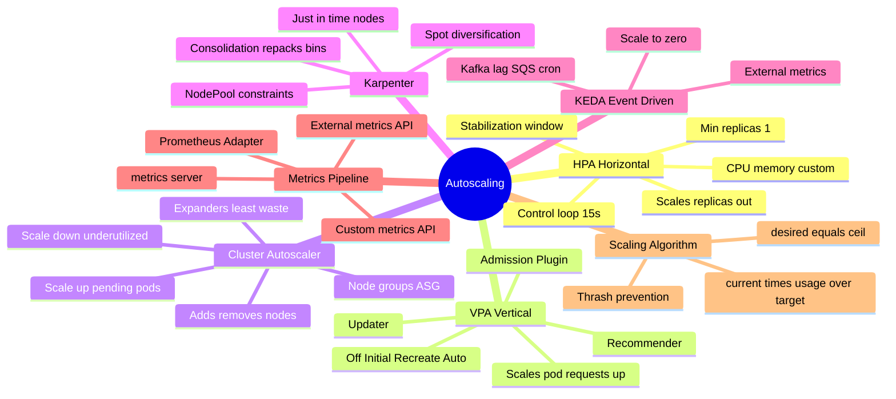
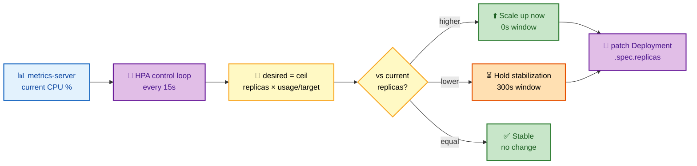
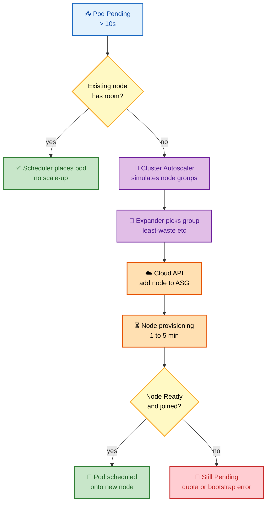
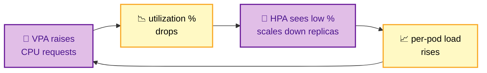

# Section 15: Scaling

Kubernetes scaling spans **three independent dimensions**, and interviewers love to test whether you can keep them straight:

- **Out (more pods)** — the **HPA** adds/removes replicas.
- **Up (bigger pods)** — the **VPA** raises/lowers each pod's CPU/memory requests.
- **Wider cluster (more nodes)** — the **Cluster Autoscaler** and **Karpenter** add/remove nodes so pending pods have somewhere to land.

Understanding their **algorithms, limitations, and interactions** — especially the ways HPA and VPA *fight* each other — is a frequent FAANG interview topic.

## Subtopic Index

- [HPA — Horizontal Pod Autoscaler](#hpa--horizontal-pod-autoscaler)
- [HPA Metrics Pipeline](#hpa-metrics-pipeline)
- [Custom and External Metrics](#custom-and-external-metrics)
- [KEDA](#keda)
- [VPA — Vertical Pod Autoscaler](#vpa--vertical-pod-autoscaler)
- [Cluster Autoscaler](#cluster-autoscaler)
- [Karpenter](#karpenter)
- [HPA and VPA Interaction](#hpa-and-vpa-interaction)

---

## 🗺️ Visual Overview

**Mind map — the whole section at a glance** (skim this first, revisit it last):



**HPA control loop — how a metric becomes a replica count** (the single highest-value diagram here):



**Cluster Autoscaler scale-up decision — how a Pending pod summons a node:**



> 🧠 **Memory hooks (mnemonics):**
> - **HPA formula:** *"Ceiling of the Ratio"* → `desired = ceil(current × usage ÷ target)`. If you're at 2× the target utilization, you double the pods.
> - **HPA vs VPA vs CA:** *"Wider, Taller, More"* → HPA makes the app **wider** (more replicas), VPA makes pods **taller** (bigger requests), CA/Karpenter adds **more** nodes.
> - **Up fast, down slow:** scale-**up** uses a **0s** window (react instantly to a surge); scale-**down** uses a **300s** window (don't yank capacity on a dip).
> - **Only KEDA hits zero:** HPA's floor is `minReplicas ≥ 1`; **KEDA** is the only one that scales to **0** and back up on an event.
> - **Karpenter vs CA:** *"Karpenter Consolidates, CA Empties"* → Karpenter actively **repacks** bins; CA only removes **fully empty** nodes.

---

## HPA — Horizontal Pod Autoscaler

> 🎯 **Interview weight: High** — the HPA algorithm, stabilization windows, and the memory-scaling trap are near-guaranteed questions.

**In one line:** A control loop that reads a metric every ~15s and sets replica count to `ceil(currentReplicas × currentMetric ÷ targetMetric)`, scaling up fast and down slow.

The HPA controller runs a control loop (default every 15 seconds) that computes the desired replica count from observed metrics and adjusts the target Deployment/ReplicaSet/StatefulSet.

**Algorithm**:
```
desiredReplicas = ceil(currentReplicas × (currentMetricValue / desiredMetricValue))
```
For `targetCPUUtilizationPercentage: 50` with 4 pods at 80% average CPU:
`ceil(4 × (80 / 50)) = ceil(6.4) = 7 pods`

> 🔍 **Read the formula intuitively:** the ratio `currentMetric ÷ desiredMetric` is *"how many times over budget am I?"* — being at 160% of target means you need 1.6× the pods, rounded up. The `ceil` guarantees you never under-provision by a fraction.

The HPA applies a **stabilization window** to prevent thrashing. Scale-up and scale-down are deliberately asymmetric:

| Direction | Config field | Default | Rationale |
|-----------|-------------|---------|-----------|
| **Scale up** | `scaleUp.stabilizationWindowSeconds` | **0s** | React instantly to a traffic surge |
| **Scale down** | `scaleDown.stabilizationWindowSeconds` | **300s** | Hold for 5 min so a brief dip doesn't yank capacity |

`scaleDown` holds the decision until the metric has *consistently* stayed low for the full window, so a momentary dip won't strip capacity you'll need again in seconds.

> ⚠️ **Classic gotcha:** if HPA seems "slow to scale down," that's the **300s stabilization window working as designed** — not a bug. Conversely, aggressive scale-down that causes a thundering herd usually means the window was set *too short*.

```yaml
apiVersion: autoscaling/v2
kind: HorizontalPodAutoscaler
metadata:
  name: payments-hpa
spec:
  scaleTargetRef:
    apiVersion: apps/v1
    kind: Deployment
    name: payments
  minReplicas: 3
  maxReplicas: 50
  metrics:
  - type: Resource
    resource:
      name: cpu
      target:
        type: Utilization
        averageUtilization: 60
  - type: Resource
    resource:
      name: memory
      target:
        type: AverageValue
        averageValue: 512Mi
  behavior:
    scaleDown:
      stabilizationWindowSeconds: 300
      policies:
      - type: Pods
        value: 4              # scale down max 4 pods per minute
        periodSeconds: 60
    scaleUp:
      stabilizationWindowSeconds: 0
      policies:
      - type: Percent
        value: 100            # double pods per 60s during surge
        periodSeconds: 60
```

### Key commands
```bash
kubectl get hpa -A
kubectl describe hpa payments-hpa
# Shows current metrics, desired replicas, last scale event

# Watch HPA decisions
kubectl get hpa payments-hpa -w

# Check current metrics from HPA perspective
kubectl get hpa payments-hpa -o jsonpath='{.status.currentMetrics}'
```

---

## HPA Metrics Pipeline

> 🎯 **Interview weight: High** — "the HPA shows `UNKNOWN` — why?" traces straight back to this pipeline.

**In one line:** The HPA never scrapes pods directly — it reads three separate aggregated APIs (resource, custom, external), each backed by a different provider.

The HPA reads metrics through **Kubernetes API aggregation**. There are three distinct metric APIs, each with its own backend:

| Metric type | API group | Backing provider | Example |
|-------------|-----------|------------------|---------|
| **Resource** | `metrics.k8s.io/v1beta1` | metrics-server | `cpu`, `memory` |
| **Custom** | `custom.metrics.k8s.io/v1beta1` | Prometheus Adapter | requests/s, connections |
| **External** | `external.metrics.k8s.io/v1beta1` | KEDA, cloud adapters | queue depth, DB rows |

- **Resource metrics** (`cpu`, `memory`): via `metrics.k8s.io/v1beta1` (metrics-server). The HPA calls `GET /apis/metrics.k8s.io/v1beta1/namespaces/<ns>/pods/<name>` to get current CPU/memory usage.

- **Custom metrics** (`Pods` or `Object` type): via `custom.metrics.k8s.io/v1beta1`. A **Prometheus Adapter** bridges Prometheus queries to this API. Configure the adapter to map Prometheus metric names to Kubernetes metric names.

- **External metrics** (queue depth, DB connection count): via `external.metrics.k8s.io/v1beta1`. KEDA uses this path.

> ⚠️ **Dependency you must state in interviews:** **metrics-server** must be running for *any* CPU/memory HPA. For custom metrics you additionally need **Prometheus Adapter** or **KEDA**. No metrics-server → HPA reports `UNKNOWN`.

---

## Custom and External Metrics

> 🎯 **Interview weight: Medium** — expect a "scale on requests/second, not CPU" design question.

**In one line:** The Prometheus Adapter turns a Prometheus query into a first-class Kubernetes custom metric the HPA can target.

**Prometheus Adapter** exposes Prometheus metrics as Kubernetes custom metrics:

```yaml
# prometheus-adapter ConfigMap rules
rules:
- seriesQuery: 'http_requests_total{namespace!="",pod!=""}'
  resources:
    overrides:
      namespace: {resource: "namespace"}
      pod: {resource: "pod"}
  name:
    matches: "^http_requests_total$"
    as: "http_requests_per_second"
  metricsQuery: 'sum(rate(<<.Series>>{<<.LabelMatchers>>}[2m])) by (<<.GroupBy>>)'
```

Then HPA uses it:
```yaml
metrics:
- type: Pods
  pods:
    metric:
      name: http_requests_per_second
    target:
      type: AverageValue
      averageValue: "1000"    # 1000 req/s per pod target
```

---

## KEDA

> 🎯 **Interview weight: High** — "why can KEDA scale to zero but HPA can't?" is a signature question.

**In one line:** KEDA drives autoscaling from *external event sources* (Kafka lag, queue depth, cron) and is the only option that scales all the way to **zero**.

KEDA (Kubernetes Event-Driven Autoscaling) scales deployments based on external event sources (Kafka lag, SQS queue depth, database row count, cron) by exposing them as Kubernetes external metrics consumed by HPA.

```yaml
apiVersion: keda.sh/v1alpha1
kind: ScaledObject
metadata:
  name: kafka-consumer-scaler
spec:
  scaleTargetRef:
    name: kafka-consumer
  minReplicaCount: 0          # scale to zero!
  maxReplicaCount: 100
  triggers:
  - type: kafka
    metadata:
      bootstrapServers: kafka:9092
      consumerGroup: my-consumer
      topic: orders
      lagThreshold: "50"       # scale when lag > 50 per partition
  - type: cron
    metadata:
      timezone: America/New_York
      start: "0 8 * * *"       # pre-scale at 8am
      end: "0 20 * * *"
      desiredReplicas: "20"
```

KEDA's **scale to zero** is a key differentiator — HPA minimum is 1. KEDA can set min=0, completely removing pods when there's no work, then spinning them up when events arrive.

> 💡 **The mechanism to name:** below `minReplicaCount: 0`, KEDA's own controller polls the event source directly (not pod metrics) and handles the **0 → 1** activation. Once at least one pod runs, it hands scaling back to a normal HPA it created under the hood. This sidesteps the chicken-and-egg problem: a Deployment at 0 replicas has no pods to emit metrics.

### Key commands
```bash
kubectl get scaledobject -A
kubectl describe scaledobject kafka-consumer-scaler
kubectl get hpa -A  # KEDA creates an HPA under the hood
```

---

## VPA — Vertical Pod Autoscaler

> 🎯 **Interview weight: Medium** — know the three components, the update modes, and *why VPA needs to evict pods*.

**In one line:** VPA right-sizes pod CPU/memory **requests** (not replica count) using usage histograms, and must **restart** pods to apply them — the mirror image of HPA.

VPA adjusts pod resource requests (not replicas) based on observed usage. It has three components:

**Recommender**: watches pod metrics, builds histograms of CPU/memory usage, and stores recommendations in VPA status.

**Updater**: checks running pods against recommendations. If a pod's requests are far from recommendations and `updateMode != Off`, it evicts the pod so the Admission Plugin can set new requests on restart.

**Admission Plugin** (VPA Admission Controller): intercepts pod creation, reads VPA recommendation, and patches the pod's resource requests. This is the only place where new requests are applied without pod restart.

> 🧠 **Trace the loop:** **Recommender** observes → **Updater** evicts a drifted pod → **Admission Plugin** patches new requests as the pod is recreated. Because requests are immutable on a running pod, the eviction/restart is *unavoidable* in `Auto`/`Recreate` mode — that's VPA's biggest operational cost.

**Update modes:**

| Mode | Sets requests at creation? | Evicts running pods? | Use case |
|------|:--:|:--:|----------|
| `Off` | ❌ | ❌ | Right-sizing analysis only (read-only recommendations) |
| `Initial` | ✅ | ❌ | Set once at pod creation, never disrupt |
| `Recreate` | ✅ | ✅ | Evict pods that drift far from recommendation |
| `Auto` | ✅ | ✅ | Same as `Recreate` currently |

VPA recommendation includes: `target` (recommended), `lowerBound` (minimum), `upperBound` (maximum), and `uncappedTarget` (recommendation without resource policy limits).

```yaml
apiVersion: autoscaling.k8s.io/v1
kind: VerticalPodAutoscaler
metadata:
  name: payments-vpa
spec:
  targetRef:
    apiVersion: apps/v1
    kind: Deployment
    name: payments
  updatePolicy:
    updateMode: "Off"           # recommendation only, no automatic eviction
  resourcePolicy:
    containerPolicies:
    - containerName: app
      maxAllowed:
        cpu: "4"                # cap recommendations
        memory: 4Gi
      minAllowed:
        cpu: 100m
        memory: 128Mi
```

### Key commands
```bash
kubectl get vpa -A
kubectl describe vpa payments-vpa
# Look at: Recommendation.Target and Recommendation.UncappedTarget

# Check if VPA is evicting pods
kubectl get events -A | grep EvictedByVPA
```

---

## Cluster Autoscaler

> 🎯 **Interview weight: High** — scale-up/scale-down triggers, expanders, and eviction safety checks are core cluster-ops questions.

**In one line:** CA adds nodes when pods can't schedule and removes underutilized nodes — but only within **pre-defined node groups**, and it never repacks existing nodes.

Cluster Autoscaler (CA) adds and removes nodes to match pending pod demand. It runs as a single-replica Deployment in `kube-system`.

**Scale-up trigger**: a pod stays Pending for > 10s because no existing node has sufficient resources. CA simulates scheduling the pod on each node group, finds which group can accommodate it, and requests the cloud provider API to add a node.

**Scale-down trigger**: a node is underutilized (`node_allocatable_utilization < 0.5` for 10+ minutes, configurable). CA checks if all pods on the node can be evicted and scheduled elsewhere (respecting PodDisruptionBudgets, anti-affinity, and the `cluster-autoscaler.kubernetes.io/safe-to-evict: "false"` annotation). If safe, it drains the node and requests termination.

**Expanders** decide which node group to scale up when multiple groups could accommodate the pod:

| Expander | Selection strategy |
|----------|-------------------|
| `random` | Picks a qualifying node group at random |
| `least-waste` | Minimizes leftover unallocatable CPU+memory after placement |
| `priority` | Follows an explicit priority order from a ConfigMap |
| `price` | Cost-based (cloud-provider dependent) |
| `grpc` | Delegates the choice to an external gRPC service |

> ⚠️ **CA limitations to call out:** it operates only on **pre-defined node groups (ASGs)**, must wait for node provisioning (**1–5 minutes**), and does **no bin-packing** optimization on new nodes. These three gaps are exactly what Karpenter was built to close.

### Key commands
```bash
kubectl -n kube-system get pods -l app=cluster-autoscaler
kubectl -n kube-system logs -l app=cluster-autoscaler | grep -E 'scale-up|scale-down|error' | tail -30
kubectl get nodes -o custom-columns=NAME:.metadata.name,AGE:.metadata.creationTimestamp,UNSCHEDULABLE:.spec.unschedulable
kubectl get --raw /metrics | grep cluster_autoscaler
```

---

## Karpenter

> 🎯 **Interview weight: High** — Karpenter vs Cluster Autoscaler, consolidation, and Spot diversification are hot FAANG/cloud topics.

**In one line:** A just-in-time provisioner that skips node groups entirely — it picks the *optimal, cheapest* instance for pending pods directly via the cloud API, and actively **consolidates** to shrink cost over time.

Karpenter is a just-in-time node provisioner that directly calls the cloud API (EC2) to launch optimal nodes for pending pods, bypassing the pre-defined node-group model.

**How it works**: Karpenter watches for unschedulable pods, groups them into batches (16s batching window), evaluates all possible node types that could fit the pods (using the scheduler's simulation), selects the lowest-cost option (considering Spot pricing, instance family, AZ), and launches the node directly via EC2 RunInstances API. When the node is ready (typically 60–90s), the pending pods are scheduled.

**Consolidation**: periodically, Karpenter simulates moving all pods off underutilized nodes. If successful (respecting PDBs, affinities), it disrupts those nodes (drains and terminates), replacing N small nodes with M smaller/fewer nodes. This actively minimizes cost, unlike CA which only removes fully empty nodes.

> 🔍 **Karpenter vs Cluster Autoscaler — the comparison to have ready:**

| Aspect | Cluster Autoscaler | Karpenter |
|--------|-------------------|-----------|
| Node model | Fixed node groups / ASGs | Flexible `NodePool` constraints |
| Instance choice | Whatever the ASG defines | Best fit from *hundreds* of types |
| Scale-down | Only **fully empty** nodes | Active **consolidation** (repacks bins) |
| Provisioning speed | 1–5 min | ~60–90s |
| Cost optimization | Expander at scale-up only | Continuous (Spot + right-size) |

**NodePool**: replaces node groups with flexible constraint-based provisioning:
```yaml
apiVersion: karpenter.sh/v1
kind: NodePool
metadata:
  name: default
spec:
  template:
    spec:
      requirements:
      - key: karpenter.k8s.aws/instance-category
        operator: In
        values: [c, m, r]       # allow c/m/r families
      - key: karpenter.k8s.aws/instance-generation
        operator: Gt
        values: ["2"]
      - key: kubernetes.io/arch
        operator: In
        values: [amd64, arm64]
      - key: karpenter.sh/capacity-type
        operator: In
        values: [spot, on-demand]
  disruption:
    consolidationPolicy: WhenUnderutilized
    consolidateAfter: 30s
  limits:
    cpu: 1000                   # total CPU cap across Karpenter nodes
```

### Key commands
```bash
kubectl get nodeclaims        # nodes provisioned by Karpenter
kubectl get nodepools
kubectl describe nodeclaim <name>
kubectl -n kube-system logs -l app.kubernetes.io/name=karpenter | grep -E 'launched|disrupted|error' | tail -20

# Force consolidation check
kubectl annotate nodepool default karpenter.sh/do-not-consolidate-

# Check what Karpenter would do (dry-run mode)
kubectl get events -A | grep karpenter | tail -20
```

---

## HPA and VPA Interaction

> 🎯 **Interview weight: High** — "can you run HPA and VPA together?" is a favorite trap; the answer is *"not on the same metric."*

**In one line:** HPA and VPA on the **same resource** oscillate against each other — keep their metrics **disjoint**, or run VPA in `Off` mode for recommendations only.

Running HPA on CPU and VPA on CPU simultaneously causes them to fight: VPA increases requests (pushing CPU utilization down), HPA sees low utilization and scales down replicas, VPA sees higher per-pod load and increases requests again — oscillation.



> ⚠️ **The oscillation loop above never settles** — this is why the docs forbid HPA + VPA on the same resource metric.

**Safe combinations**:

| HPA target | VPA target / mode | Safe? | Why |
|------------|-------------------|:-----:|-----|
| CPU | `Off` (recommendations only) | ✅ | VPA just advises; you right-size manually |
| Custom (RPS, queue) | Memory | ✅ | Disjoint metrics don't interfere |
| Custom metrics | All resources | ✅ | VPA isn't touching HPA's scaling signal |
| CPU | CPU (`Auto`) | ❌ | Direct oscillation (the loop above) |

- VPA mode `Off` (recommendations only) + HPA on CPU: use VPA recommendations to manually right-size requests, then HPA handles replica count.
- VPA on memory + HPA on custom metrics (queue depth, RPS): disjoint metric types don't conflict.
- HPA on custom metrics + VPA on all resources: works if VPA isn't fighting HPA's scaling decisions.

> 💡 **Goldilocks pattern:** runs VPA in `Off` mode on all workloads and exposes recommendations via a Kubernetes dashboard/admission. Engineers use recommendations to update manifests — you get VPA's *analysis* without its automatic *disruption*.

---

## Interview Questions

### Conceptual / Internals (8 questions)

**1. Walk through the HPA algorithm for CPU scaling from metric collection to pod count change.**
The HPA controller reads the current metric from `metrics.k8s.io/v1beta1` (metrics-server). For CPU utilization: sum of all pod CPU usage / sum of all pod CPU requests = current utilization %. Desired replicas = ceil(current_replicas × (current_utilization / target_utilization)). Scale-up immediately if computed replicas > current. Scale-down only if computed replicas < current AND the stabilization window (default 300s) has elapsed with consistently lower values AND the scale policy allows it (e.g., max 4 pods per 60s). The HPA patches the `Deployment.spec.replicas` field, which the Deployment controller then reconciles.

**2. What is the risk of HPA on memory and how should you handle it?**
Memory is not compressible — you can't throttle it. When a pod uses more memory than expected, the kubelet OOMKills it rather than throttling. HPA on memory-utilization can cause oscillation: memory spikes → HPA scales out → memory is distributed across more pods → per-pod memory drops → HPA scales back → memory spikes again. Additionally, HPA can't respond faster than its 15s scrape interval + stabilization window, while OOM kills happen instantly. Better approach: use VPA for memory right-sizing, and use HPA only on CPU or custom business metrics (requests/s, queue depth). Set memory limits high enough to prevent OOMKilled under normal load.

**3. Explain Karpenter's consolidation algorithm.**
Karpenter's consolidator runs periodically (every 30s or after disruption budget). It builds a simulation: for each node, can all pods on this node be scheduled onto other existing nodes or onto a smaller replacement node? Simulation respects PodDisruptionBudgets, pod affinity, taints, node selectors, and resource requirements. If all pods can be moved: Karpenter issues a Disruption to the node (cordons, drains via PDB-safe evictions, then terminates). If a single node replacement is cheaper than the original: Karpenter launches the smaller node, migrates pods, terminates the old node. The result: bins are packed more efficiently over time. Unlike CA which only terminates fully empty nodes.

**4. Why can KEDA scale to zero and HPA cannot?**
HPA's minimum replicas is 1 — the Kubernetes HPA spec enforces `minReplicas >= 1`. KEDA creates a special ScaledObject that bypasses this by directly managing the Deployment's replica count and setting it to 0 when no events are pending. KEDA's controller (not HPA) handles the 0→1 scale-up when events arrive, then hands control back to the HPA (which KEDA creates internally). This is because HPA would set replicas to `minReplicas=0` but Kubernetes HPA doesn't support 0 (a Deployment with 0 replicas has no pods to report metrics from, creating a chicken-and-egg problem — KEDA solves this by polling the external event source directly rather than measuring pod metrics).

**5. How does CA decide to scale down a specific node? What prevents it from evicting stateful workloads?**
CA scales down a node by: verifying all its pods can be moved (simulating scheduling on other nodes), checking PDBs (respects `minAvailable`/`maxUnavailable`), checking the `cluster-autoscaler.kubernetes.io/safe-to-evict: "false"` annotation (used by local storage, mirrors, etc.), and verifying no pods have local storage (emptyDir, hostPath). StatefulSet pods are protected by PDBs. Pods with `restartPolicy: Never` (finished Jobs) are safe to evict. `kube-system` pods may block scale-down unless annotated safe-to-evict. If any check fails, the node is not scaled down.

**6. A HPA shows `UNKNOWN` for current metrics. What are the causes?**
`UNKNOWN` means the HPA couldn't fetch the current metric. Causes: (1) metrics-server not running or unhealthy — `kubectl top pods` fails. (2) Pod has no resource `requests` set — CPU utilization is undefined if requests=0 (HPA uses `usage/requests`). (3) Custom metric provider (Prometheus Adapter, KEDA) is unavailable. (4) Pods are not yet running (newly created Deployment). (5) ServiceMonitor not targeting the pods correctly — custom metric query returns empty. Fix: check metrics-server, ensure resource requests are set for all containers, verify the metric API endpoint.

**7. What is the difference between Cluster Autoscaler expanders and how does `least-waste` work?**
Expanders select which node group (ASG) to scale up when multiple groups could accommodate pending pods. `random`: picks randomly. `least-waste`: evaluates each node group, simulates placing the pod on a node from that group, and picks the group whose nodes would have the least wasted (unallocatable) CPU+memory after the pod is placed. This minimizes resource fragmentation. `priority`: operator defines a priority ordering in a ConfigMap. `price`: uses cost information from the cloud provider (not all providers support it). `grpc`: delegates the decision to an external gRPC service.

**8. How does VPA's Recommender build its recommendations?**
The Recommender watches pod metrics (from metrics-server or Prometheus) continuously. For each container, it maintains a histogram of CPU and memory usage samples over time (sliding window, decaying older samples). It computes percentile-based recommendations: `target` CPU = 90th percentile of observed CPU usage × safety factor; `target` memory = 90th percentile of peak memory × safety factor. The histogram decay ensures old usage patterns don't permanently bias recommendations — useful for seasonal workloads. The `lowerBound` and `upperBound` in the recommendation account for statistical uncertainty in the histogram.

### Scenario Questions (6 questions)

**9. During a flash sale, pods scale to maxReplicas before traffic peaks. 30% of requests fail. What failed in your scaling strategy?**
HPA responds to observed metrics with a 15-30s lag (scrape + stabilization). By the time HPA sees high load, requests are already failing. Solutions: (1) **Scheduled pre-scaling**: `kubectl scale deployment payments --replicas=50` before the sale; or KEDA cron trigger. (2) **Predictive scaling**: use `karpenter.sh` or CA's `--scale-up-from-zero` with pre-provisioned warm nodes. (3) **Faster HPA**: reduce `--horizontal-pod-autoscaler-sync-period` (default 15s). (4) **Adequate buffer**: set target utilization lower (50% instead of 80%) so headroom exists. (5) **Node capacity**: if nodes are the bottleneck, pre-scale nodes before the event.

**10. Karpenter is launching new nodes but pods still pending after 10 minutes. Diagnose.**
Steps: (1) Check NodeClaims: `kubectl get nodeclaims` — are nodes being provisioned? (2) Check Karpenter logs: `kubectl -n kube-system logs -l app.kubernetes.io/name=karpenter | grep error`. (3) If node claims exist but nodes don't join: cloud API error (IAM, subnet, capacity), bootstrap script failure. (4) Check EC2 console for the new instances — are they launching? Error states? (5) Check NodePool requirements — are the pending pods' requirements too restrictive for the NodePool to satisfy? (6) Check node join logs: `journalctl -u kubelet` on the new node via SSM/EC2 connect. (7) Quota: check EC2 instance limits.

**11. VPA is recommending 4 CPUs for a pod that requests 500m and has a 1-CPU limit. What happens when VPA Updater acts on this?**
VPA updates requests to the recommendation. But the pod's limits must be >= requests. If VPA sets `requests.cpu=4` but `limits.cpu=1`, the Pod spec would be invalid (requests > limits). VPA handles this by also updating the limit proportionally if `limits.cpu / requests.cpu` ratio can be maintained. If the new request exceeds the limit, VPA sets limit = recommendation (or the `maxAllowed` in the resource policy). The pod is evicted by the Updater and recreated with new requests/limits by the Admission Plugin. If the new requests exceed node allocatable, the pod stays Pending until a large enough node is available — which is why `maxAllowed` in VPA is important.

### FAANG Deep Dive (6 questions)

**12. How would you implement autoscaling for a WebSocket service where connection count (not CPU) is the correct scaling metric?**
WebSockets maintain persistent connections — CPU may be low even with thousands of active connections. Correct metric: active WebSocket connections per pod or connection queue depth. Approach: (1) Instrument the WebSocket server to expose `websocket_connections_active` as a Prometheus metric. (2) Configure Prometheus Adapter to expose it as a custom metric `websocket_connections_per_pod`. (3) Configure HPA with `type: Pods, metric.name: websocket_connections_per_pod, target.averageValue: 500`. (4) HPA scales replicas to keep each pod at ~500 connections. (5) Tune stabilization window down for scale-up (connect storms) and up for scale-down (don't disconnect clients during scale-down — set 600s stabilization + PDB to minimize disruption).

**13. Design a cost-aware autoscaling strategy for a batch workload that needs to complete within a deadline but minimizes cost.**
The batch job needs N total units of work completed within D hours. Cost-aware approach: (1) **Initial burst with Spot**: launch the maximum parallel workers using Spot (cheapest). Karpenter NodePool with `capacity-type: spot` and `consolidation: WhenEmpty`. (2) **KEDA ScaledJob**: scale based on job queue depth (SQS/Kafka) — each new message launches a pod. (3) **Deadline enforcement**: if estimated completion time > D, switch from Spot to On-Demand (increase reliability). KEDA external metrics can include a deadline trigger. (4) **Fallback**: On-Demand with lower parallelism if Spot capacity unavailable. (5) **Cost tracking**: label all batch pods with `workload-type: batch` for cost allocation. Total cost = (Spot cost × Spot workers × time) + (OD cost × OD workers × time).

**14. Explain how Karpenter implements instance diversification for Spot to minimize interruption rate.**
Karpenter uses capacity-optimized diversification by default — it selects instance types where AWS has the most available Spot capacity, based on real-time capacity signals from the EC2 Spot API. When launching a node, Karpenter considers all instance types matching the NodePool requirements (potentially hundreds of types), then calls EC2 `CreateFleet` with `AllocationStrategy: capacity-optimized-prioritized`. EC2 selects the instance type with the most spare capacity, minimizing interruption probability. Additionally, Karpenter spreads across AZs using topology constraints. The NodePool can specify many instance families and sizes — broader diversity means more fallback options if one pool runs out of capacity.

---

## Hands-On Labs

### Lab 1: HPA with Custom Metrics
Deploy Prometheus Adapter. Create a custom metric from request rate. Configure HPA to scale based on requests/second. Generate load with k6 and watch scaling.

### Lab 2: KEDA Scale-to-Zero
Install KEDA. Deploy a consumer that processes from a queue (use a fake queue or Redis list). Scale replicas to 0 when queue is empty, observe scale-up when messages arrive.

### Lab 3: Karpenter Consolidation
Deploy Karpenter. Deploy many small pods. Observe Karpenter launch nodes. Delete 80% of pods. Observe Karpenter consolidate to fewer nodes.

---

## Production Incidents

### Incident 1: HPA Scale-Down Caused Thundering Herd
HPA scaled down from 50 to 10 pods during low traffic. When a traffic spike arrived 2 minutes later, 10 pods couldn't handle the load. HPA took 5 minutes to scale back up. **Prevention**: set conservative `minReplicas` (match expected baseline traffic); use `scaleDown.stabilizationWindowSeconds: 600`; pre-scale before known events.

### Incident 2: Karpenter Consolidation Disrupted Production StatefulSet
Karpenter consolidated nodes, evicting pods from an under-utilized node. A StatefulSet pod was evicted and PVC attachment to the new node took 5 minutes. **Prevention**: add `karpenter.sh/do-not-disrupt: "true"` to StatefulSet pods; configure PodDisruptionBudget to protect quorum-critical pods.
