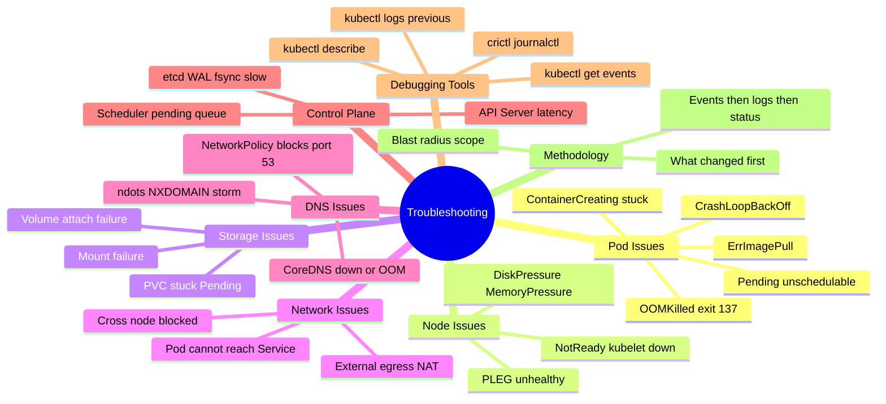
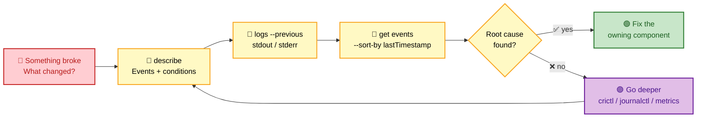
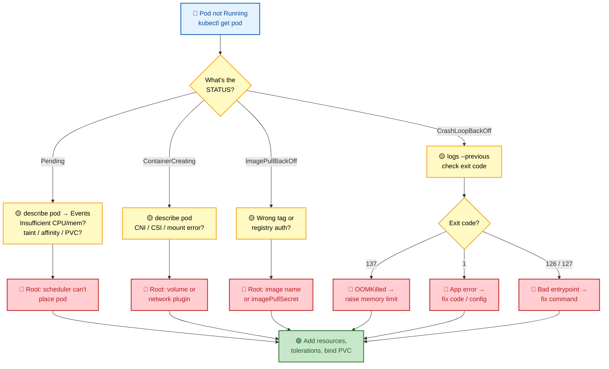
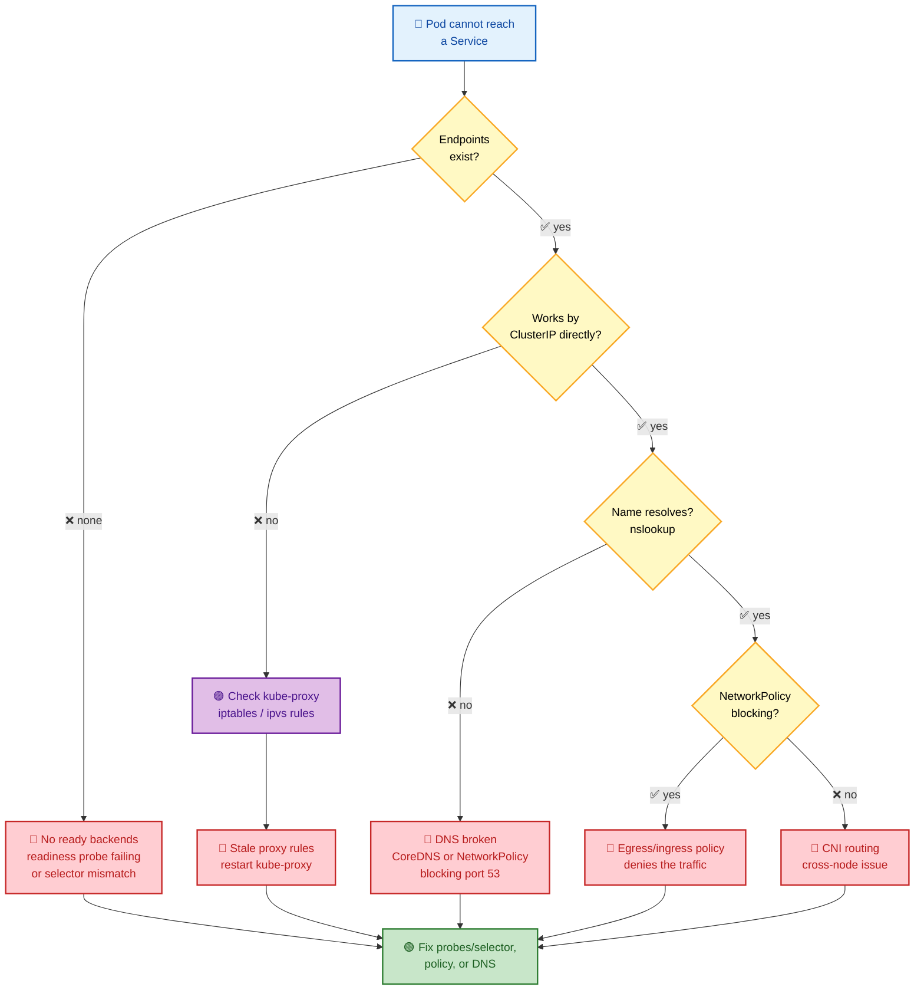

# Section 17: Troubleshooting

Systematic troubleshooting in Kubernetes is a game of **narrowing scope**: figure out *which component owns which part of the lifecycle*, then aim targeted commands at that component until the root cause surfaces.

This section walks through the common failure classes — pods that won't start, nodes that go `NotReady`, storage that won't mount, networks that drop packets, DNS that resolves nowhere — each with a **step-by-step investigation flow** you can reproduce under interview pressure.

> 🎯 **Why interviewers love this section:** troubleshooting questions reveal whether you *actually operate* clusters or just memorize YAML. The candidate who says *"describe → logs → events, then check what changed"* beats the one who guesses.

## Subtopic Index

- [Troubleshooting Framework](#troubleshooting-framework)
- [Pod Issues](#pod-issues)
- [Node Issues](#node-issues)
- [Storage Issues](#storage-issues)
- [Network Issues](#network-issues)
- [DNS Issues](#dns-issues)
- [Scheduler Issues](#scheduler-issues)
- [API Server Issues](#api-server-issues)
- [etcd Issues](#etcd-issues)
- [Performance Issues](#performance-issues)

---

## 🗺️ Visual Overview

**Mind map — every failure class at a glance** (skim this first, revisit it last):



**The universal triage order — memorize this three-step reflex** (the single highest-value habit in this section):



**Decision tree — a Pod is not starting → which state → which fix:**



**Decision tree — a Service is unreachable → endpoints → policy → DNS:**



> 🧠 **Memory hooks (mnemonics):**
> - **Triage order:** *"Describe, Log, Event"* → **D-L-E** = `describe` → `logs --previous` → `get events`. Always in that order.
> - **First question, always:** *"What changed?"* — deploy, config, cert rotation, or infra event. 90% of failures trace to a recent change.
> - **Exit codes:** *"137 = memory, 1 = my app, 127 = command not found."* (137 = 128+9 SIGKILL/OOM; 126/127 = bad/missing entrypoint.)
> - **Service unreachable ladder:** *"Endpoints → Proxy → DNS → Policy"* — check them **in that order**, cheapest first.
> - **Blast radius:** *"One pod, one node, one namespace, or the whole cluster?"* — scope before you dig.

---

## Troubleshooting Framework

> 🎯 **Interview weight: High** — this is the meta-skill every troubleshooting question is really testing. State the method out loud *before* you type any command.

**In one line:** Start from *"what changed?"*, scope the **blast radius**, then walk **Events → Logs → Status** until the owning component reveals the root cause.

Always start with: **What changed?** Most failures happen at or shortly after a deployment, configuration change, cert rotation, or infrastructure event.

**Narrowing approach**:

1. Identify the **blast radius** (one pod? one node? one namespace? cluster-wide?).
2. Check **Events first** — they summarize what Kubernetes observed.
3. Check **logs next** — container stdout/stderr + component logs.
4. Check **status/conditions** on the affected object.
5. **Cross-reference** with recent changes (Git history, deploy history, cloud events).

> 💡 **Why Events before logs:** Events are Kubernetes' own narration of what it *tried to do* (schedule, pull, mount, probe). Logs only tell you what the app did *after* it started — useless if the container never ran.

```bash
# First commands for any mystery failure
kubectl get events -n <namespace> --sort-by='.lastTimestamp' | tail -30
kubectl describe <resource> <name> -n <namespace>
kubectl get pods -n <namespace> -o wide     # reveals node, IP, age, restarts
```

---

## Pod Issues

> 🎯 **Interview weight: High** — the most common real-world failure class and the most frequent live-debug prompt. Know each state's *symptom → cause → command* cold.

**In one line:** A pod's `STATUS` tells you *which stage failed* — scheduling (`Pending`), setup (`ContainerCreating`/`ImagePullBackOff`), or runtime (`CrashLoopBackOff`/`OOMKilled`) — so read the status first, then aim.

**Quick reference — pod state → likely cause → first move:**

| STATUS | What it means | Most common root cause | First command |
|--------|---------------|------------------------|---------------|
| **Pending** | Not yet scheduled | Insufficient resources, taint, PVC unbound | `kubectl describe pod` → Events |
| **ContainerCreating** | Scheduled, setup stuck | CNI / CSI / volume mount error | `kubectl describe pod` + `journalctl -u kubelet` |
| **ImagePullBackOff** | Can't fetch image | Wrong tag / registry auth | `kubectl describe pod` → Events |
| **CrashLoopBackOff** | Starts then dies, repeatedly | App crash, bad config, probe fail | `kubectl logs --previous` |
| **OOMKilled** (exit 137) | Killed for exceeding memory | Limit too low / memory leak | `kubectl top pod` + describe |

### CrashLoopBackOff
**Symptom**: pod restarts repeatedly, backoff increasing.
**Causes**: application crash, bad entrypoint, missing env/secret/configmap, failing probe.
```bash
kubectl logs <pod> --previous              # previous container's logs
kubectl describe pod <pod> | grep -A5 "Last State:"
kubectl get pod <pod> -o jsonpath='{.status.containerStatuses[*].state.terminated}'
```

> 🔍 **Decode the exit code — it's the fastest clue:**

| Exit code | Meaning | Typical fix |
|-----------|---------|-------------|
| **137** | OOMKilled or SIGKILL (128 + 9) | Raise memory limit / fix leak |
| **139** | SIGSEGV — segfault | App/native library bug |
| **1** | Generic application error | Read the logs, fix config/code |
| **126** | Command found but not executable | Fix file permissions / entrypoint |
| **127** | Command not found | Fix the entrypoint path/image |

### OOMKilled
```bash
kubectl describe pod <pod> | grep OOMKilled
kubectl top pod <pod>
# Check cgroup memory.events on the node
cat /sys/fs/cgroup/kubepods/burstable/pod<uid>/<container>/memory.events
```

> ⚠️ **Fix:** increase memory limits; fix the memory leak; use cgroups v2 `memory.oom.group` to kill all containers in the cgroup together (avoids a half-dead pod).

### ErrImagePull / ImagePullBackOff
```bash
kubectl describe pod <pod> | grep -A5 Events
# "Failed to pull image": wrong image name, tag, or registry auth
kubectl get secret -n <namespace> | grep docker    # imagePullSecrets
crictl pull <image>  # test on the node
```

> 💡 **`ImagePullBackOff` is the retry-backoff state that follows repeated `ErrImagePull`.** Same root causes: typo in tag, private registry without an `imagePullSecret`, or a rate-limited public registry.

### ContainerCreating (stuck)
```bash
kubectl describe pod <pod>   # look for CNI, CSI, or runtime errors
journalctl -u kubelet | grep -E 'error|cni|volume' | tail -30
kubectl get volumeattachment  # stuck PVC attachment?
```

> 🔍 **Stuck in `ContainerCreating` almost always means storage or network**, not the app — the container image never even ran. Look at the kubelet, CNI, and CSI, not the container logs.

---

## Node Issues

> 🎯 **Interview weight: High** — a single sick node can take down dozens of pods. Knowing the kubelet ↔ runtime ↔ disk relationship separates operators from users.

**In one line:** A node goes `NotReady` when the **kubelet stops posting healthy status** — usually because the kubelet, the container runtime, or the disk underneath them is failing.

> 🧠 **Mental model:** the kubelet renews a **Lease** every few seconds. If the control plane stops seeing that renewal (kubelet dead, runtime hung, disk full, network partition), the node is marked `NotReady` after the grace period and pods eventually get evicted.

### Node NotReady
```bash
kubectl describe node <node> | grep -A20 Conditions
kubectl -n kube-node-lease get lease <node> -o yaml   # check renewTime

# On the node:
systemctl status kubelet
journalctl -u kubelet | tail -50
systemctl status containerd
crictl info
df -h /var/lib/containerd    # disk pressure?
df -i /var/lib/kubelet       # inode exhaustion?
```

> 🔍 **Don't forget inodes.** `df -h` can show plenty of free space while `df -i` shows 100% inode usage — millions of tiny files (logs, layers) exhaust inodes and break the kubelet just as hard as a full disk.

### DiskPressure / MemoryPressure
```bash
df -h && df -i                           # check both space and inodes
free -h                                   # memory available
crictl images | awk '{sum+=$3} END {print sum}' # image disk usage
crictl rmi --prune                        # remove unused images (safe)
```

> ⚠️ **`DiskPressure` triggers eviction.** When it fires, the kubelet starts garbage-collecting images and **evicting pods** to reclaim space — so a full disk cascades into pod churn across the node.

### PLEG Unhealthy
```bash
journalctl -u kubelet | grep "PLEG is not healthy"
crictl ps -a | wc -l                     # too many containers?
systemctl restart containerd             # restart runtime if stuck
```

> 💡 **PLEG = Pod Lifecycle Event Generator.** It relists containers from the runtime on a timer. If the runtime (`containerd`) is slow or hung, PLEG can't complete its relist in time, the kubelet reports *"PLEG is not healthy"*, and the whole node flips `NotReady` — even though pods may still be running.

---

## Storage Issues

> 🎯 **Interview weight: Medium** — less frequent than pods/networking, but `PVC Pending` and stuck attachments are classic "pod won't start" root causes worth knowing.

**In one line:** Storage failures live in three stages — **provision** (`PVC Pending`), **attach** (`VolumeAttachment`), and **mount** (`ContainerCreating`) — so identify which stage is stuck before touching anything.

> 🔍 **The `WaitForFirstConsumer` gotcha:** with that binding mode, a `PVC` stays `Pending` *by design* until a pod that uses it is scheduled. It's not broken — it's waiting for the scheduler to pick a zone.

### PVC Stuck Pending
```bash
kubectl describe pvc <name>              # Events show reason
kubectl get sc                           # StorageClass exists?
kubectl get storageclass <sc> -o yaml | grep volumeBindingMode
# If WaitForFirstConsumer: need pod to be scheduled first
kubectl -n kube-system logs -l app=ebs-csi-controller -c csi-provisioner | tail -30
```

### Volume Attachment Failure
```bash
kubectl get volumeattachment | grep <pv-name>
kubectl describe volumeattachment <name>
# Stuck attachment from dead node:
kubectl delete volumeattachment <name>   # force cleanup
```

> ⚠️ **A single volume can only attach to one node** (for `ReadWriteOnce`). When a node dies uncleanly, its `VolumeAttachment` lingers and blocks the pod from rescheduling elsewhere — deleting the stale attachment unblocks it.

### Volume Mount Failure (pod stuck ContainerCreating)
```bash
kubectl describe pod <pod> | grep -i "mount\|volume\|attach"
journalctl -u kubelet | grep -E 'NodePublish|NodeStage|error' | tail -20
ls /var/lib/kubelet/pods/<uid>/volumes/  # check mount paths
dmesg | grep "I/O error"                # disk errors?
```

---

## Network Issues

> 🎯 **Interview weight: High** — connectivity debugging is a favorite because it forces you to reason across Services, kube-proxy, NetworkPolicy, CNI, and NAT in one flow.

**In one line:** Isolate the layer by **testing by IP to remove DNS**, then walk **endpoints → kube-proxy rules → NetworkPolicy → CNI routing** until packets stop flowing.

> 🧠 **Golden move:** *"curl the ClusterIP directly."* If the IP works but the name doesn't, it's **DNS**. If the IP fails too, it's **endpoints, proxy rules, policy, or CNI** — never guess, bisect.

### Pod Can't Reach Service
```bash
# 1. Verify service and endpoints exist
kubectl get svc <name> -n <ns>
kubectl get endpointslice -l kubernetes.io/service-name=<name> -n <ns>

# 2. Try by IP to separate DNS from connectivity
kubectl exec <pod> -- curl -v http://<cluster-ip>:<port>

# 3. Check kube-proxy rules
SVC_IP=$(kubectl get svc <name> -o jsonpath='{.spec.clusterIP}')
iptables-save | grep $SVC_IP             # or: ipvsadm -Ln | grep $SVC_IP

# 4. NetworkPolicy blocking?
kubectl get netpol -n <ns>
kubectl exec <pod> -- nc -zv <pod-ip> <port>   # direct pod IP
```

> 🔍 **No endpoints = no backends.** An empty `EndpointSlice` means no pod matched the Service selector *and passed its readiness probe*. That's the #1 cause of "Service unreachable" — the Service is fine, it just points at nothing ready.

### Pod Can't Reach External IPs
```bash
kubectl exec <pod> -- curl https://1.1.1.1
kubectl exec <pod> -- ping 1.1.1.1     # NAT working?
# Check node's NAT/masquerade rule
iptables -t nat -L POSTROUTING -n | grep MASQUERADE
# No route to host? Check node network
ip route show                           # on the node
```

> 💡 **Egress relies on `MASQUERADE`.** Pod IPs aren't routable outside the cluster, so the node NATs pod traffic to its own IP on the way out. A missing/misconfigured masquerade rule breaks all external connectivity while intra-cluster traffic still works.

---

## DNS Issues

> 🎯 **Interview weight: High** — DNS is the *"it's always DNS"* meme for a reason. CoreDNS OOM and NetworkPolicy blocking port 53 are extremely common outages.

**In one line:** DNS breaks when **CoreDNS is down/OOM**, a **NetworkPolicy blocks UDP/TCP 53**, or a high **`ndots`** value turns every lookup into an NXDOMAIN storm.

> ⚠️ **The silent DNS killer:** a namespace-scoped default-deny `NetworkPolicy` that forgets to allow egress to `kube-system` on **port 53** — pods can't resolve *anything*, but every other check looks healthy.

```bash
# 1. Basic DNS test
kubectl exec <pod> -- nslookup kubernetes.default

# 2. CoreDNS running?
kubectl -n kube-system get pods -l k8s-app=kube-dns
kubectl -n kube-system logs -l k8s-app=kube-dns | tail -20

# 3. NetworkPolicy blocking DNS egress?
kubectl get netpol -n <pod-namespace>

# 4. ndots causing NXDOMAIN storm?
kubectl exec <pod> -- cat /etc/resolv.conf
kubectl -n kube-system top pod -l k8s-app=kube-dns   # CoreDNS CPU high?
```

> 🔍 **`ndots:5` explained:** with the default `ndots:5`, any name with fewer than 5 dots is first tried against every search domain (`.svc.cluster.local`, `.cluster.local`, …) before the real lookup — turning one external query into 4–5 failed lookups. High CoreDNS CPU + NXDOMAIN spam = suspect `ndots`.

---

## Scheduler Issues

> 🎯 **Interview weight: Medium** — mostly surfaces as "why is my pod Pending?", which the scheduler's Events answer directly.

**In one line:** If pods sit `Pending` with **scheduler Events**, the scheduler *tried and failed* to place them (resources/taints/affinity); if there are **no Events at all**, the scheduler isn't even looking (wrong `schedulerName`, scheduler down, or all nodes cordoned).

> 💡 **Events vs no-Events is the fork.** `describe pod` showing *"0/5 nodes available: insufficient cpu"* = scheduler is working, cluster is full. **Zero** scheduling Events = the pod never reached the scheduler.

```bash
# Check scheduler is running
kubectl -n kube-system get pods -l component=kube-scheduler

# Pending pods and why
kubectl get pods -A --field-selector=status.phase=Pending
kubectl describe pod <pending-pod> | grep -A20 Events
# Look for: Insufficient cpu/memory, taint, affinity, unbound PVC, quota

# Scheduler queue depths
kubectl get --raw='/metrics' | grep scheduler_pending_pods

# Scheduler leader
kubectl -n kube-system get lease kube-scheduler -o yaml
```

---

## API Server Issues

> 🎯 **Interview weight: High** — the apiserver is the front door to the cluster; when it's slow, *everything* is slow. Senior interviews probe whether you can find the true root cause (usually etcd or a webhook).

**In one line:** apiserver latency almost always traces to **something downstream** — slow **etcd**, a slow **admission webhook**, or **APF throttling** — so read the metrics to find which phase is bleeding.

> 🔍 **Two most common root causes, in order:** (1) **etcd** latency (every write waits on it), (2) a **slow/broad admission webhook** (one bad webhook can make all pod creates crawl). Check those before blaming the apiserver itself.

```bash
# Health checks
kubectl get --raw='/healthz'
kubectl get --raw='/readyz?verbose'
kubectl get --raw='/livez?verbose'

# Latency metrics
kubectl get --raw='/metrics' | grep 'apiserver_request_duration_seconds' | grep 'le="1"'

# etcd latency (often root cause)
kubectl get --raw='/metrics' | grep 'etcd_request_duration_seconds'

# Webhook latency (second most common root cause)
kubectl get --raw='/metrics' | grep 'apiserver_admission_webhook_admission_duration'

# API Priority and Fairness (throttling)
kubectl get --raw='/metrics' | grep 'apiserver_flowcontrol_current_inqueue_requests'

# Self-managed: check apiserver logs
kubectl -n kube-system logs kube-apiserver-<node> | grep -E 'error|timeout|slow' | tail -30
```

> ⚠️ **APF (API Priority and Fairness) returns HTTP 429** when queues fill. Low-priority clients (user `kubectl`, secondary controllers) get throttled first — so a burst of LISTs can look like "the apiserver is broken" when it's actually protecting itself.

---

## etcd Issues

> 🎯 **Interview weight: High** — etcd is the cluster's single source of truth; its disk latency and quorum are the scariest, highest-signal senior topics.

**In one line:** etcd health is dominated by **disk write latency** (`wal_fsync` p99 must stay low) and **quorum** — slow disks cause false leader elections, and losing quorum freezes all writes.

> 🧠 **The one metric to memorize:** `etcd_disk_wal_fsync_duration_seconds` **p99 > 10ms = trouble.** etcd fsyncs every write to the WAL before acking; a slow disk (HDD, throttled cloud volume) stalls the entire control plane.

```bash
export ETCDCTL_API=3
export ETCDCTL_ENDPOINTS=https://127.0.0.1:2379
export ETCDCTL_CACERT=/etc/kubernetes/pki/etcd/ca.crt
export ETCDCTL_CERT=/etc/kubernetes/pki/etcd/server.crt
export ETCDCTL_KEY=/etc/kubernetes/pki/etcd/server.key

# Cluster health
etcdctl endpoint health --cluster --write-out=table
etcdctl endpoint status --cluster --write-out=table

# WAL fsync latency (most important metric)
etcdctl endpoint status --write-out=json | python3 -m json.tool | grep -E 'dbSize|leader'
# Via Prometheus: etcd_disk_wal_fsync_duration_seconds p99 > 10ms = problem

# DB size (compaction needed?)
etcdctl endpoint status --write-out=table   # check DB SIZE column

# Quorum lost: check member list
etcdctl member list

# Leader election logs
journalctl -u etcd | grep -E 'elected|leader|term' | tail -20
```

> ⚠️ **Quorum math:** a cluster of `N` members tolerates `(N-1)/2` failures. A 3-node etcd survives 1 loss; a 5-node survives 2. Lose quorum and etcd goes **read-only** — no pod, no deployment, no anything gets written until quorum is restored.

---

## Performance Issues

> 🎯 **Interview weight: Medium** — performance debugging tests whether you can bisect a request path layer by layer instead of blaming one component.

**In one line:** Trace latency **layer by layer** (LB → Ingress → Service → Pod → DB) and check the usual suspects — **CPU throttling**, **memory pressure**, and **disk I/O** — with `top`, metrics, and `iostat`.

> 💡 **CPU throttling is the sneaky one.** A pod at its CPU **limit** gets throttled by CFS even while node CPU looks idle — `container_cpu_cfs_throttled_seconds` climbing means the limit is too low, not the node.

### High Latency
Identify the layer: LB → Ingress → Service → Pod → Database.
```bash
kubectl exec <pod> -- curl -w "@curl-format.txt" http://backend-service/api  # timing breakdown
# curl-format.txt: "%{time_namelookup} %{time_connect} %{time_appconnect} %{time_pretransfer} %{time_starttransfer} %{time_total}"

# CPU throttling?
kubectl top pod <pod>
kubectl get --raw='/metrics' | grep container_cpu_cfs_throttled   # on metrics-server exposed

# Memory pressure?
kubectl top node
```

> 🔍 **Read the `curl -w` breakdown like a map:** a big `time_namelookup` = DNS is slow; a big `time_connect` = TCP/network; a big `time_starttransfer` = the backend app is slow to first byte. Each field points at a different layer.

### High Memory Usage
```bash
kubectl top pod -A --sort-by=memory | head -20
kubectl describe node <node> | grep -A20 "Allocated resources:"
# Eviction threshold approaching?
kubectl describe node <node> | grep -A5 Conditions
```

### Slow Node
```bash
# Check node conditions
kubectl describe node <node>
# High iowait?
iostat -x 1 5
# High CPU steal?
top -b -n1 | grep Cpu
# Disk full?
df -h && df -i
```

> ⚠️ **High CPU `steal`** (visible in `top`) on a cloud VM means the hypervisor is giving your vCPUs to *other* tenants — the node is slow through no fault of your workload. Escalate to a bigger/dedicated instance rather than tuning the app.

---

## Interview Questions

### Conceptual / Internals (8 questions)

**1. A pod is Pending. How do you diagnose and what are the 5 most common root causes?**
`kubectl describe pod <name>` → Events. Common causes: (1) Insufficient node resources (CPU/memory requests too high). (2) Taint not tolerated (node has taint, pod has no matching toleration). (3) Node affinity/selector mismatch (pod requires a label that no node has). (4) PVC unbound (WaitForFirstConsumer — no pod scheduled yet, OR provisioner error). (5) Namespace ResourceQuota exceeded (admission denied but Events say "exceeded quota"). Also check: wrong schedulerName, all nodes cordoned, topology spread constraint unsatisfiable.

**2. Walk through debugging a CrashLoopBackOff container where logs are empty.**
Empty logs means the process crashed before writing anything (or wrote to stderr but it's not captured). Steps: (1) `kubectl describe pod` — check last exit code. 139=SIGSEGV, 137=SIGKILL/OOM, 126=not executable. (2) Override entrypoint to `sleep 3600` to keep the container alive: `kubectl set image deployment/myapp myapp=myapp:v1 && kubectl patch deployment myapp --type=json -p='[{"op":"replace","path":"/spec/template/spec/containers/0/command","value":["sleep","3600"]}]'`. (3) Exec in and try running the original command manually. (4) Check the image on a local machine. (5) If exit 137: memory limit too low.

**3. How do you debug a connection that works between pods on the same node but fails cross-node?**
Same-node works → kube-proxy rules are fine (no DNAT issue). Cross-node fails → CNI routing issue. Debug: (1) `kubectl exec <pod-node-1> -- ping <pod-ip-node-2>` — if ping fails, routing/CNI is broken. (2) `ip route get <pod-ip>` on node-1 — shows which interface handles it. (3) `tcpdump -i <cni-interface> host <pod-ip>` on node-1 — do packets leave node-1? (4) `tcpdump -i <cni-interface> host <pod-ip>` on node-2 — do packets arrive? If they leave but don't arrive: routing table issue, security group blocking, or encapsulation mismatch.

**4. An Ingress route returns 502. How do you identify whether it's the Ingress controller or the backend?**
502 = bad gateway — the Ingress controller reached the backend but got an error response (or the backend closed the connection). (1) Bypass Ingress: `kubectl exec <ingress-pod> -- curl http://<backend-service>:<port>/<path>` — if this fails, it's the backend. (2) Check Ingress controller access logs: `kubectl logs <ingress-pod> | grep 502`. The log shows the backend IP/port and the error (connection refused, timeout, etc.). (3) Check if the backend pod is running and ready: `kubectl get pod -l app=backend`. (4) Check if the Service endpoints exist: `kubectl get endpoints <backend-service>`.

**5. etcd is reporting high disk latency. What do you check and what are your immediate actions?**
Check `etcd_disk_wal_fsync_duration_seconds` p99. If >10ms: (1) Check the disk: `iostat -x 1 sda` — is it the etcd disk? High `%util` and `await` = I/O bound. (2) What else uses the disk? `iotop -b -n1 | head -20`. (3) Is it an HDD? Move to SSD immediately. (4) Is it a cloud disk being throttled? Check cloud provider metrics for I/O credit balance (EBS burst credits). Immediate actions: reduce load on etcd disk (separate WAL directory to a faster disk, stop non-critical writes), increase election timeout to prevent false leader elections while investigating.

**6. How do you diagnose high apiserver latency?**
Check which phase is slow: (1) Admission webhook latency: `apiserver_admission_webhook_admission_duration_seconds` — if a webhook is slow, it shows here. (2) etcd latency: `etcd_request_duration_seconds` — slow etcd propagates to all writes. (3) APF throttling: `apiserver_flowcontrol_current_inqueue_requests` — high queue means throttled. (4) Watch fan-out: `apiserver_watch_cache_capacity_*` — too many watchers. (5) CPU saturation on apiserver pods. Narrow: a single slow webhook can make all pod creates slow (if the webhook rule is broad).

**7. A node shows MemoryPressure but free memory looks fine. Explain.**
The kubelet's eviction threshold compares `memory.available` (from `/proc/meminfo`) against the hard threshold. Linux counts as "available" only MemFree + reclaimable buffers/cache. If a workload has created many hugetlb mappings, large mmap regions, or if the cgroup memory accounting differs from the system view, the kubelet may see pressure before `free -h` shows it. Also: the kubelet uses `--eviction-hard=memory.available<100Mi` and `--system-reserved` calculations. Verify with `kubectl describe node <node> | grep -A10 Conditions` and check both `MemAvailable` in `/proc/meminfo` AND the cgroup accounting.

**8. You're paged: cluster is completely unreachable (kubectl times out). What do you do first?**
(1) Check if the apiserver is up: `curl -sk https://<control-plane-ip>:6443/healthz`. If no response: apiserver is down. (2) Check cloud provider — is the control plane healthy (for managed clusters)? Check cloud console/status page. (3) For self-managed: SSH to a control plane node. Check apiserver, etcd, and kubelet status. (4) If etcd quorum lost: follow the etcd recovery runbook. (5) If apiserver OOMKilled: increase memory on control plane nodes. (6) If cert expired: renew certs with kubeadm. (7) Log the timeline for postmortem. Do not blindly restart components without understanding the cause.

### Scenario Questions (6 questions)

**9. Intermittent 5xx errors on a service that correlates with deployments. Diagnose.**
During rolling updates, the old pods are removed before all iptables rules update everywhere. Check: (1) Do errors correlate with specific pod IP removals? (use `kubectl get events | grep endpoint`). (2) Is there a preStop sleep? `kubectl get pod <pod> -o yaml | grep preStop`. (3) Is the app handling SIGTERM gracefully? `kubectl logs <pod> --previous | grep -i shutdown`. (4) Is the readiness probe gate too permissive (pod marked ready before actually ready)? Fix sequence: add `preStop: sleep 10`, ensure graceful shutdown in app, tune readiness probe.

**10. A Job ran successfully in staging but fails with "OOMKilled" in production. Memory limits are identical. Debug.**
Check: (1) Same data volume? Production may have larger payloads. (2) Same JVM/runtime settings? JVM may use more memory in production (more loaded classes, larger heap, GC overhead). (3) Any sidecar containers in production consuming memory? `kubectl get pod <job-pod> -o jsonpath='{.spec.containers[*].name}'`. (4) Are the node's `--system-reserved` and `--kube-reserved` different? More reserved = less allocatable memory. (5) Is the node under pressure from other workloads? `kubectl describe node <node> | grep -A20 "Allocated resources:"`. Diagnosis: increase limits by 2x, monitor with Grafana.

**11. kubectl apply works but pods don't start. No events visible.**
No events from the scheduler = scheduler isn't trying to schedule the pod. Reasons: (1) Wrong `schedulerName` in the pod spec. (2) Namespace ResourceQuota reached — admission rejected the pod but it's showing in the list (check `kubectl get pod <pod> -o yaml | grep status`). Actually Pending means it was admitted but not scheduled. (3) All nodes are cordoned. (4) Scheduler is down. Check: `kubectl -n kube-system get pods -l component=kube-scheduler`.

### FAANG Deep Dive (6 questions)

**12. Design a systematic troubleshooting methodology for unknown latency degradation in a microservices cluster.**
Layer-by-layer elimination: (1) **Is it all services or one?** Check error budget dashboards. One service → isolated issue. All services → infrastructure issue. (2) **Infrastructure**: node CPU/memory/disk pressure, network saturation, DNS latency, etcd latency. (3) **Control plane**: apiserver latency causing slow endpoint updates, slowing kube-proxy propagation. (4) **Service specific**: distributed traces to find slow span; RED metrics (rate/error/duration) to identify the bottleneck service; resource metrics (CPU throttling?) for that service. (5) **Database**: slow query logs, connection pool saturation. (6) **External dependencies**: third-party API latency (correlate with trace timing). Instrument: OTel traces mandatory, SLO dashboards, USE metrics per node.

**13. A large cluster has intermittent API call failures that correlate with controller-manager restarts. Explain the mechanism.**
When the controller-manager restarts, it loses all informer caches. On startup, it issues LIST requests for every resource type it watches (Deployments, ReplicaSets, Pods, etc.). In a large cluster, this is thousands of LIST calls simultaneously — a thundering herd on the apiserver. Simultaneously, the apiserver's etcd watches may expire (if the restart triggered a watch cache flush). etcd also sees a burst of LIST queries. APF (API Priority and Fairness) queues the excess requests. Low-priority clients (user kubectl, other controllers) receive 429 responses. The burst lasts 30–60 seconds as caches fill. Fix: increase apiserver APF concurrency for `workload-high` priority level; ensure controller restarts are infrequent; use startup probes on the controller so it's ready before accepting workloads.

**14. Explain how you would diagnose a cluster where pods are being OOMKilled but node memory appears plentiful.**
The disconnection between container OOMKills and node memory is explained by cgroup-level memory limits, not node-level limits. The pod's memory limit (enforced by the cgroup) can be exceeded even when the node has free memory. Scenarios: (1) Memory limit set too low for the workload. Metrics: `container_memory_working_set_bytes` approaching `container_spec_memory_limit_bytes` before kill. (2) Memory fragmentation: RSS is lower than working_set because of fragmented page allocations. (3) JVM off-heap allocations (direct buffers, thread stacks) not counted in `Xmx`. (4) Multiple containers in a pod competing for the pod-level cgroup limit. Diagnose: graph `container_memory_working_set_bytes / container_spec_memory_limit_bytes` over time. Look for steady growth (leak) vs spikes (burst).

---

## Production Incidents Summary

The top-10 Kubernetes production issues by frequency:

1. **CrashLoopBackOff** — app crash, bad config, probe failure
2. **Pending pods** — resource exhaustion, taints, PVC issues
3. **DNS failures** — CoreDNS OOM, NetworkPolicy blocking port 53
4. **Service unreachable** — kube-proxy rules stale, no endpoints
5. **Node NotReady** — kubelet/runtime failure, disk pressure
6. **OOMKilled** — memory limit too low, memory leak
7. **Rolling update stuck** — readiness probe failing on new pods
8. **Certificate expiration** — apiserver/etcd/kubelet certs
9. **etcd disk pressure** — WAL fsync slow, compaction needed
10. **Ingress 502/503** — backend unhealthy, misconfigured route

For each: use the framework (Events → Logs → Status → What changed) to systematically isolate the layer.
