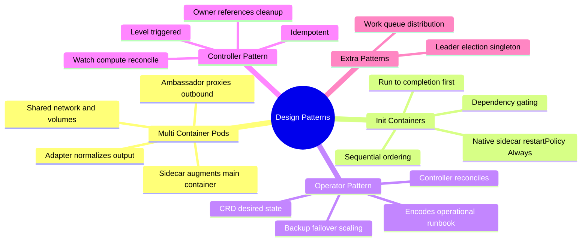
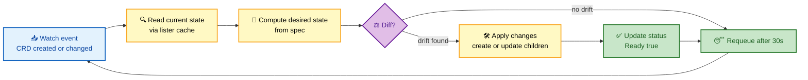

# Section 18: Kubernetes Design Patterns

Design patterns in Kubernetes are reusable architectural solutions to common problems. Understanding when and why to apply each pattern is a core FAANG interview skill.

## Subtopic Index

- [Sidecar Pattern](#sidecar-pattern)
- [Adapter Pattern](#adapter-pattern)
- [Ambassador Pattern](#ambassador-pattern)
- [Init Container Pattern](#init-container-pattern)
- [Operator Pattern](#operator-pattern)
- [Controller Pattern](#controller-pattern)

---

## 🗺️ Visual Overview

**Mind map — the whole section at a glance** (skim this first, revisit it last):



**Multi-container pod patterns — where each helper sits relative to the app** (the highest-value comparison in this section):

```mermaid
flowchart TB
    subgraph Sidecar["🚗 Sidecar — augments"]
        SA["📦 App writes logs"] --> SB["🛠️ Log shipper<br/>tails shared volume"]
    end
    subgraph Ambassador["🧭 Ambassador — outbound proxy"]
        AA["📦 App → localhost:6379"] --> AB["🛠️ Proxy<br/>routes to real Redis"]
        AB --> AC["🌐 External service"]
    end
    subgraph Adapter["🔌 Adapter — normalizes output"]
        DA["📦 App exposes odd format"] --> DB["🛠️ Adapter<br/>re-exposes /metrics"]
        DB --> DC["📊 Prometheus scrapes"]
    end
    class SA,AA,DA start;
    class SB,AB,DB proc;
    class AC,DC,DB good;
    classDef start fill:#e3f2fd,stroke:#1565c0,color:#0d47a1,stroke-width:2px;
    classDef proc fill:#fff9c4,stroke:#f9a825,color:#000,stroke-width:2px;
    classDef good fill:#c8e6c9,stroke:#2e7d32,color:#1b5e20,stroke-width:2px;
    classDef bad fill:#ffcdd2,stroke:#c62828,color:#b71c1c,stroke-width:2px;
    classDef ctrl fill:#e1bee7,stroke:#6a1b9a,color:#4a148c,stroke-width:2px;
    classDef store fill:#ffe0b2,stroke:#e65100,color:#000,stroke-width:2px;
```



**The operator reconcile loop — the heart of the Operator & Controller patterns:**



> 🧠 **Memory hooks (mnemonics):**
> - **Three multi-container helpers — "SAA: Side-Amb-Adapt":** **S**idecar *augments* (log shipper alongside), **A**mbassador *proxies out* (app talks to localhost, proxy talks to the world), **A**dapter *normalizes out* (weird format in, standard `/metrics` out).
> - **Direction trick:** Ambassador faces **out**bound (**Amb**assador = **A**way), Adapter faces the **A**udience consuming your output. Sidecar just rides **A**longside.
> - **Init vs sidecar:** Init containers *run and die* before the app; native sidecars (`restartPolicy: Always`) *run and live* alongside it.
> - **Operator = CRD + Controller + Runbook:** the CRD is the *desire*, the controller is the *muscle*, the encoded runbook is the *brain*.
> - **Reconcile mantra — "Read, Compute, Reconcile, Repeat":** always read current state (level-triggered), never trust the event (edge).

---

## Sidecar Pattern

> 🎯 **Interview weight: High** — the most-asked multi-container pattern; service mesh and logging both build on it.

**In one line:** A **sidecar** is a helper container in the same pod that *augments* the primary container without touching its code, sharing its network, volumes, and (optionally) process namespace.

A sidecar is a secondary container in the same pod that augments the primary container without modifying it. Both share the same **network namespace** (localhost), **process namespace** (if enabled), and **mounted volumes**.

**Classic use cases:**

- **Service mesh proxy** (Istio/Envoy): intercepts all network traffic for mTLS, load balancing, tracing. The app has zero networking code changes.
- **Log shipper** (Fluent Bit): tails log files from a shared volume and ships to a central store. The app writes logs to a file; the sidecar handles shipping.
- **Secret syncer**: syncs secrets from Vault into the pod's volume at startup and on rotation. App reads from a file path; the sidecar handles Vault authentication.
- **Metrics collector**: scrapes app metrics on localhost and exposes them in a different format.

```yaml
containers:
- name: app
  image: my-app:v1
  volumeMounts:
  - name: logs
    mountPath: /var/log/app
- name: log-shipper         # sidecar: shares volume, not changing app
  image: fluent/fluent-bit
  volumeMounts:
  - name: logs
    mountPath: /var/log/app
    readOnly: true
volumes:
- name: logs
  emptyDir: {}
```

> 🔍 **Native sidecars (k8s 1.29+):** `restartPolicy: Always` in `initContainers` makes them sidecars — they start **before** app containers, stay running throughout the pod lifecycle, and restart independently. This beats using regular containers as sidecars because native sidecars are **guaranteed to start before** the app and **terminate after** it (time to flush data).

> ⚠️ **Trade-offs:** sidecars add resource usage, increase pod complexity, create startup-ordering challenges, and can mask the real resource consumption of the primary workload. Each sidecar may add **50–200MB** memory. For a cluster with 10,000 pods and 2 sidecars each, that's **1–4TB** of sidecar memory cluster-wide.

---

## Adapter Pattern

> 🎯 **Interview weight: Medium** — commonly paired with "Adapter vs Ambassador" as a trap question.

**In one line:** The **adapter** transforms what *leaves* the primary container — converting its output into a standardized interface (e.g., a proper Prometheus `/metrics`) without changing the app.

The adapter converts the interface of a container into a standardized interface expected by the rest of the system — **without modifying** the primary container.

**Use cases:**

- Normalizing metrics from a legacy app that exposes them in a non-Prometheus format. The adapter sidecar scrapes the legacy format and re-exposes as `/metrics`.
- Converting a legacy logging format (syslog, CEF) to JSON structured logs.
- Protocol translation: app speaks gRPC; adapter translates to REST for external consumers.

```yaml
containers:
- name: legacy-app
  image: legacy-metrics-app:v1
  # Exposes metrics at /metrics/v2 in proprietary format
- name: metrics-adapter
  image: custom-metrics-converter:v1
  ports:
  - containerPort: 9090    # standard Prometheus port
  # Reads from legacy-app via localhost, exposes Prometheus format
```

> 💡 **Key insight:** the adapter **decouples** the primary workload from the monitoring/observability infrastructure. You can upgrade the adapter without changing the primary app, and vice versa.

---

## Ambassador Pattern

> 🎯 **Interview weight: Medium** — the "outbound" half of the Adapter/Ambassador comparison.

**In one line:** The **ambassador** is a proxy sidecar that handles the primary container's *outbound* connections — the app just talks to `localhost`, and the ambassador figures out where the real service lives.

The ambassador is a proxy sidecar that handles communication to external services on behalf of the primary container — **simplifying the app's networking code**.

**Use cases:**

- **Service discovery abstraction:** the app always connects to `localhost:5432`; the ambassador routes to the correct database instance (primary vs replica, different environments).
- Adding **retry and circuit-breaking** logic transparently.
- **TLS termination/origination:** app speaks plaintext; ambassador handles TLS.
- **Multi-cloud routing:** ambassador directs traffic to AWS, Azure, or on-prem based on availability.

```yaml
containers:
- name: app
  image: my-app:v1
  # Connects to localhost:6379 for Redis
- name: redis-ambassador
  image: haproxy:latest
  # Routes localhost:6379 to the correct Redis cluster/replica
  # Handles connection pooling, failover
```

> 💡 **Why it matters:** the ambassador makes the primary container **portable** — it doesn't need to know cluster topology, service discovery details, or infrastructure-specific routing.

> 🧠 **Sidecar vs Ambassador vs Adapter — the trap table:**
>
> | Pattern | Direction | What it does | Example |
> |---|---|---|---|
> | **Sidecar** | Alongside | Augments the app with extra behavior | Log shipper, Envoy mesh proxy |
> | **Ambassador** | Outbound proxy | App → `localhost`, proxy → real service | Redis/DB routing, TLS origination |
> | **Adapter** | Output normalizer | Converts app output to a standard format | Legacy metrics → Prometheus `/metrics` |
>
> Note: **Ambassador** and **Adapter** are both *specializations* of the general **Sidecar** shape — all three are extra containers in one pod.

---

## Init Container Pattern

> 🎯 **Interview weight: High** — the go-to answer for "wait for a dependency" and "run migrations once" questions.

**In one line:** **Init containers** run to completion *before* any app container starts, giving you a simple, ordered way to prepare the environment or gate on dependencies.

Init containers run to completion before any app container starts. They prepare the environment, check dependencies, or perform one-time setup.

**Use cases:**

- **Wait for dependency:** wait for a database to be ready before starting the app that needs it.
- **Configuration injection:** download config from an external source and write to a shared volume.
- **Database migration:** run migrations once before the app starts.
- **Security setup:** fetch secrets from Vault and write to shared memory volume.

```yaml
initContainers:
- name: wait-for-db
  image: busybox
  command: ['sh', '-c', 'until nc -z postgres 5432; do sleep 2; done']
- name: run-migrations
  image: my-app:v1
  command: ["/app/migrate", "--up"]
  env:
  - name: DB_URL
    valueFrom:
      secretKeyRef: {name: db-creds, key: url}
containers:
- name: app
  image: my-app:v1
  # App starts only after migrations complete
```

> 🔍 **Ordering guarantee:** Init containers run **sequentially**. If any init container fails (non-zero exit), the pod's init phase fails and the kubelet retries with backoff. App containers don't start until **ALL** init containers succeed — a simple dependency-sequencing mechanism.

---

## Operator Pattern

> 🎯 **Interview weight: High** — the "how do you manage stateful apps declaratively?" flagship pattern.

**In one line:** An **operator** = a **CRD** (desired state) + a **controller** (reconcile logic) that encodes the operational runbook a human would otherwise follow by hand.

An operator extends Kubernetes to manage complex stateful applications using the same declarative model as built-in resources.

**The pattern:** create a **CRD** that represents the desired state of the application, then write a **controller** that watches the CRD and reconciles the actual state to match. The operator "knows" the application-specific operational procedures (backup, restore, failover, scaling) that a human operator would otherwise perform manually.

```yaml
# CRD-based desired state
apiVersion: postgres.example.com/v1
kind: PostgresCluster
metadata:
  name: prod-db
spec:
  instances: 3
  version: "15.2"
  storage:
    size: 100Gi
    storageClass: fast-ssd
  backup:
    schedule: "0 2 * * *"
    retentionPolicy: "7d"
```

The PostgreSQL operator controller reads this CRD, creates StatefulSets with the right image, configures replication, provisions PVCs, sets up backup CronJobs, monitors health, and handles failover — **all automatically**.

> 💡 **Popular operators:** Prometheus Operator, CloudNativePG, Strimzi (Kafka), cert-manager, External Secrets Operator, ArgoCD.

> ⚠️ **When to build an operator:** when an app requires domain-specific operational knowledge that can be automated — not just simple deployment. If it's just "deploy this Deployment," use **Helm/Kustomize**. If it requires "detect primary failure and promote replica," write an **operator**.

---

## Controller Pattern

> 🎯 **Interview weight: High** — the foundation of Kubernetes extensibility; expect a reconcile-loop deep dive.

**In one line:** A **controller** watches objects, computes the desired state of dependent objects, and reconciles them — the level-triggered loop that powers every operator and built-in resource.

The controller pattern is the foundation of Kubernetes extensibility. A controller watches one or more Kubernetes objects, computes the desired state of dependent objects, and reconciles them.

```go
func (r *MyReconciler) Reconcile(ctx context.Context, req ctrl.Request) (ctrl.Result, error) {
    // 1. Fetch the watched object
    var myObj MyCustomResource
    if err := r.Get(ctx, req.NamespacedName, &myObj); err != nil {
        return ctrl.Result{}, client.IgnoreNotFound(err)
    }
    
    // 2. Check if being deleted (finalizer cleanup)
    if !myObj.DeletionTimestamp.IsZero() {
        return r.handleDeletion(ctx, &myObj)
    }
    
    // 3. Ensure owned resources exist and match desired state
    if err := r.reconcileDeployment(ctx, &myObj); err != nil {
        return ctrl.Result{}, err
    }
    
    // 4. Update status
    myObj.Status.Ready = true
    return ctrl.Result{RequeueAfter: 30 * time.Second}, r.Status().Update(ctx, &myObj)
}
```

**Key controller design principles:**

- **Idempotent:** running reconcile multiple times must produce the same result.
- **Level-triggered:** always read current state; don't rely on the specific event that triggered.
- **Handle not-found:** the object may have been deleted before reconcile runs.
- **Use server-side apply** for updates to avoid field ownership conflicts.
- **Set owner references** on created objects so garbage collection handles cleanup.

> 🧠 **The reconcile mantra:** *read current → compute desired → apply the diff → requeue.* Because Kubernetes guarantees **at-least-once** (not exactly-once) event delivery, only a **level-triggered, idempotent** loop stays correct after restarts and duplicate events.

---

## Interview Questions

### Conceptual / Internals (8 questions)

**1. When is a sidecar pattern appropriate vs when should you reject it?**
Appropriate: when you need to augment behavior without changing the primary workload (service mesh proxying, log shipping, metrics adaptation, secret management). The primary workload is often owned by a different team or is a third-party image. Reject: when the primary workload CAN be modified and the separation adds no value. Adding a sidecar for something that belongs in the application (business logic, caching) adds complexity and resource overhead for no benefit. Also reject when startup ordering matters critically (use native sidecars in 1.29+ or init containers). Each sidecar adds pod scheduling complexity, resource overhead, and failure surface.

**2. How does a native sidecar (restartPolicy: Always in initContainers) differ from a regular sidecar container?**
Regular sidecar containers: start in parallel with the main app container. No defined startup ordering. If the sidecar is the only unhealthy container, the pod may still show Ready. On termination, all containers receive SIGTERM together. Native sidecar (k8s 1.29+): starts as an init container with `restartPolicy: Always`, so it starts before app containers and is guaranteed to be running before the app starts. It remains running throughout the pod lifecycle. On termination, it's stopped AFTER app containers exit (giving it time to flush data). If it crashes, it restarts independently (like a regular container) without restarting the app container. This is the correct model for a log shipper or Vault secret syncer.

**3. What is the difference between the Adapter and Ambassador patterns?**
Both are sidecar containers but serve different purposes. **Adapter**: transforms an outbound interface — the primary container's output is converted to a different format for external consumers (metrics format conversion, log format normalization). **Ambassador**: transforms an inbound connection — the primary container connects to `localhost:X`; the ambassador forwards it externally (service discovery, TLS handling, load balancing). Adapter faces inward (modifying what leaves the primary container). Ambassador faces outward (proxying the primary container's outbound connections).

**4. Why does an operator use a CRD instead of just a ConfigMap for its configuration?**
A CRD provides: (1) Schema validation — invalid configurations are rejected at admission time. (2) API versioning — you can evolve the API with stable/beta versions. (3) RBAC — you can grant permissions specifically to the CRD without granting ConfigMap access. (4) Status subresource — controllers can report status without conflating it with spec. (5) Watch semantics — informers can watch CRD instances just like any Kubernetes resource. (6) Discovery — `kubectl get myresource` works naturally. A ConfigMap provides none of these — no schema, no versioning, no dedicated RBAC, no status separation.

**5. Explain the reconciliation loop and why it must be idempotent.**
The reconciler reads current state, computes desired state, and applies changes. It's triggered by events (object creation, update) but also re-runs periodically (resync) and after failures. If reconcile is NOT idempotent — e.g., it always creates a new child resource without checking if it exists — each reconcile call creates a duplicate. Kubernetes guarantees at-least-once delivery of events, not exactly-once. A reconciler restart re-queues all objects. Idempotency means: `apply(apply(x)) = apply(x)`. Pattern: always read current state first, compare to desired, only create/update if there's a diff. Use `server-side apply` for patches to avoid ownership conflicts.

**6. How do init containers help with the database-not-ready problem and why is readiness probes an incomplete solution alone?**
A readiness probe gates traffic routing — it removes the pod from Service endpoints if the app fails its probe. But if the app fails to start because the database isn't ready yet, it crashes (CrashLoopBackOff) and readiness never passes. An init container that waits for the database (`until nc -z postgres 5432; do sleep 2; done`) prevents the app container from starting until the database is available. The pod stays in Init:0/1 status, which is visible in Events, and the backoff doesn't apply (init containers don't trigger CrashLoopBackOff). Once the database is ready, the init container exits, the app starts fresh, and connects successfully on the first attempt.

**7. How would you implement a custom resource that automatically creates a namespace and associated RBAC when an Application CRD is created?**
Create an `Application` CRD. Write a controller that watches `Application` objects. In reconcile: (1) Create a `Namespace` named `<application.spec.team>-<application.metadata.name>` with ownerReference pointing to the Application. (2) Create a `ServiceAccount`, `Role` (with appropriate rules), and `RoleBinding` in the new namespace, also with ownerReference. (3) Set the Application's status conditions to reflect success. On deletion: ownerReferences enable cascade deletion — the Namespace and all its contents are garbage-collected when the Application is deleted. Use `foreground` cascade deletion to ensure all children are removed before the Application disappears from API.

**8. When should you use the operator pattern vs Helm vs Kustomize?**
Helm/Kustomize: for applications that need parameterized deployment but no ongoing operational automation. A Deployment + Service + Ingress configured from values = Helm. Multiple environments with different values = Kustomize. No runtime intelligence needed. Operator: when the application has complex stateful lifecycle requirements: failover procedures, backup/restore automation, scaling with data redistribution, upgrade procedures with specific ordering. A PostgreSQL operator knows how to do primary election; Helm doesn't. The rule: if a human operator needs to follow a runbook to manage the application, consider encoding the runbook as a controller. If a `helm upgrade` is sufficient, use Helm.

### Scenario Questions (6 questions)

**9. An application team wants to add mutual TLS to their service without changing application code. How do you implement this?**
Use a service mesh sidecar (Istio). The injection webhook automatically adds an Envoy proxy sidecar to each pod in labeled namespaces (`istio-injection: enabled`). The proxy intercepts all inbound/outbound traffic at the network namespace level (via iptables rules added by an init container). Istio issues each proxy an X.509 certificate (SPIFFE SVID) from its mesh CA. Envoy enforces mTLS between all services in the mesh. The application code speaks plaintext to `localhost`; everything on the network is mTLS. Apply `PeerAuthentication` with `STRICT` mode to enforce that no plaintext is accepted.

**10. You need to deploy a database operator. What are the key controllers you'd implement?**
(1) **Cluster controller**: watches `PostgresCluster` CRDs, creates StatefulSet (pods), Headless Service, Services (primary/replica). Handles HA configuration. (2) **Backup controller**: watches `PostgresBackup` CRDs, creates Jobs that execute `pg_dump` or `pg_basebackup`. Manages backup lifecycle. (3) **Restore controller**: watches `PostgresRestore` CRDs, creates Jobs that restore from backup. (4) **Failover controller**: monitors health endpoints on cluster members, promotes a replica to primary if the primary fails, updates Service selectors. (5) **Upgrade controller**: handles version upgrades with appropriate ordering (replicas first, then primary, with health checks at each step).

### FAANG Deep Dive (6 questions)

**11. How does controller-runtime implement the reconciliation loop, and how does it ensure a reconciler is only called once per object at a time?**
controller-runtime uses a `workqueue.RateLimitingInterface` per controller. When an informer event fires (object create/update), the event handler calls `q.Add(key)` where key is `namespace/name`. The work queue deduplicates — if the same key is added twice before a worker processes it, it's queued only once. Workers call `q.Get()` which returns a key and marks it as "in-flight." If a second event arrives for the same key while it's in-flight, it's re-queued for after `Done()` is called. This ensures one reconcile call per key at a time. The reconciler calls `ctrl.Result{RequeueAfter: duration}` to request future reconciliation, or `ctrl.Result{Requeue: true}` for immediate retry.

**12. How would you implement a controller that manages thousands of CRs with minimal API server load?**
(1) Use SharedIndexInformer (one watch per resource type regardless of how many CRs). (2) Use listers for reads (local cache, no API call). (3) Use server-side apply for writes (idempotent, no read-before-write). (4) Implement a rate limiter on the work queue to prevent API storms on failure. (5) Use `MetadataInformer` for resources where you only need to react to existence, not read full spec. (6) Use watch predicates to filter events at the informer level (only enqueue if a specific field changed). (7) Batch status updates — collect status for 1s before writing (reduces API calls from N status updates to 1 batched update per interval). (8) Use field selectors to scope informers to only relevant objects if the CRDs span many unrelated use cases.

---

## Hands-On Labs

### Lab 1: Build a Sidecar Log Shipper
Create a pod with an app writing to a log file and a Fluent Bit sidecar reading from a shared volume and printing to stdout. Verify log correlation.

### Lab 2: Write a Simple Controller
Using controller-runtime, write a controller that creates a ConfigMap when a new Namespace is created, containing the namespace creation time and labels. Deploy with RBAC.

### Lab 3: Explore the Operator Pattern
Install an operator (e.g., Prometheus Operator). Create a Prometheus CRD instance. Observe the operator creating StatefulSets and Services. Modify the CRD and watch reconciliation.
