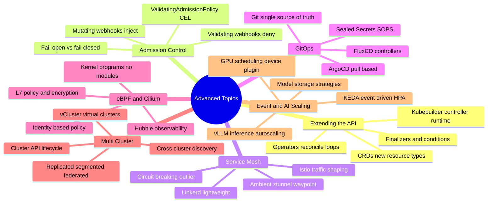
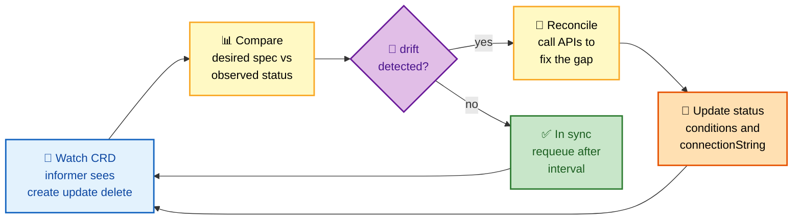
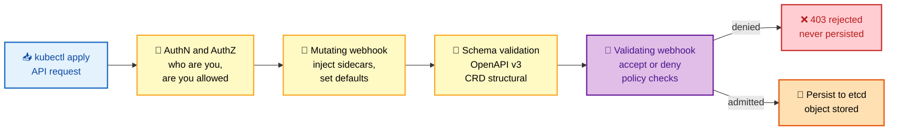
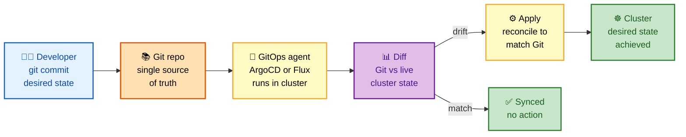

# Section 19: Advanced Topics

This section covers the ecosystem tools and architectural concepts that appear most frequently in senior-level Kubernetes interviews: Operators, CRDs, admission webhooks, service meshes, GitOps, eBPF, multi-cluster, and AI/LLM workloads.

## Subtopic Index

- [Operators and CRDs](#operators-and-crds)
- [Admission Webhooks](#admission-webhooks)
- [Service Mesh Deep Dive](#service-mesh-deep-dive)
- [GitOps — ArgoCD and FluxCD](#gitops--argocd-and-fluxcd)
- [eBPF in Kubernetes](#ebpf-in-kubernetes)
- [Cilium](#cilium)
- [Multi-Cluster Federation](#multi-cluster-federation)
- [KEDA](#keda)
- [AI/LLM Workloads on Kubernetes](#aillm-workloads-on-kubernetes)

---

## 🗺️ Visual Overview

**Mind map — the whole section at a glance** (skim this first, revisit it last):



**Operator reconciliation loop — the pattern behind every controller:**



**Admission chain — where webhooks sit in the request path:**



**GitOps pull model — why it's more secure than push CI/CD:**



> 🧠 **Memory hooks (mnemonics):**
> - **CRD vs Operator:** the **CRD is the noun** (a new API type), the **Operator is the verb** (the loop that acts on it). Noun without verb = inert data.
> - **Admission order:** *"Mutate before you Validate"* — you change first, then judge. Mutating always runs before validating.
> - **Fail closed vs open:** `failurePolicy: Fail` = **F**ort (locked, secure, brittle); `Ignore` = **I**nn (open, available, permissive).
> - **GitOps arrow:** in GitOps the arrow points **INTO** the cluster (pull), not **AT** it (push) — that flipped arrow is the whole security win.
> - **eBPF trio:** *"See, Secure, Speed"* → Hubble **sees**, Tetragon **secures**, Cilium datapath **speeds**.

---

## Operators and CRDs

> 🎯 **Interview weight: High** — the flagship "how do you extend Kubernetes" question; operators appear in almost every senior platform interview.

**In one line:** A **CRD** teaches the API server a new resource type, and an **Operator** is the control loop that continuously drives that resource's real-world state toward its spec — codifying an expert human's runbook.

**Custom Resource Definition (CRD)**: extends the Kubernetes API with new resource types. The CRD schema (OpenAPI v3) validates objects at admission. Resources are stored in **etcd**. All standard Kubernetes features work out of the box: **RBAC, watching, listing, labeling**.

**Custom Controller (Operator)**: watches CRDs and reconciles cluster state. It implements domain-specific operational logic that would otherwise require **human intervention** — the codified knowledge of an experienced operator.

> 🔍 **The mental model:** a CRD is a *new kind of Lego brick*; the Operator is the *robot that assembles and repairs* structures made from that brick, 24/7.

**The operator maturity model** (Operator Framework) — each level does everything below it, plus more:

| Level | Capability | What it automates |
|-------|-----------|-------------------|
| 1 | **Basic Install** | Automated installation and configuration |
| 2 | **Seamless Upgrades** | Patch and minor version upgrades |
| 3 | **Full Lifecycle** | App lifecycle — backup, failure recovery |
| 4 | **Deep Insights** | Metrics, alerts, log processing, workload analysis |
| 5 | **Auto Pilot** | Horizontal/vertical scaling, config tuning, anomaly detection |

**Kubebuilder / controller-runtime**: the Go framework for building operators. It generates scaffolding, CRD manifests, RBAC, and webhook configuration. The reconciliation loop is built on **informers** and **work queues**.

**Production considerations:**

- Use **`server-side apply`** in controllers to avoid field ownership conflicts.
- Implement **`Conditions`** in status for observability.
- Use **finalizers** for cleanup on deletion.
- Implement **conversion webhooks** for CRD version migration.

> ⚠️ **Common trap:** forgetting a finalizer means dependent cloud resources (databases, load balancers) leak when the custom resource is deleted — the CRD vanishes but the real-world object lingers and keeps billing.

---

## Admission Webhooks

> 🎯 **Interview weight: High** — the "how do you enforce policy across the whole cluster" question; the fail-open/fail-closed trade-off is a classic senior gotcha.

**In one line:** Admission webhooks are the last checkpoint before an object hits etcd — **mutating** ones *change* the request, **validating** ones *approve or reject* it, and misconfiguring their failure policy can take down the entire cluster.

Admission webhooks intercept **all API requests after auth but before persistence**. They're the most powerful Kubernetes extension point, used for policy enforcement, mutation, and validation.

**The two flavors — and one CEL-based alternative:**

| Type | Can it change objects? | When it runs | Typical use cases |
|------|-----------------------|--------------|-------------------|
| **MutatingAdmissionWebhook** | ✅ Yes | **Before** validation | Inject sidecars, set defaults, normalize labels, pin image tags to digests |
| **ValidatingAdmissionWebhook** | ❌ Accept/deny only | **After** mutation | Require labels, limit image registries, block privileged containers |
| **ValidatingAdmissionPolicy** (GA 1.30) | ❌ Accept/deny only | In-process (CEL) | Simple rules with **zero availability dependency** — no external server |

> 💡 **Why order matters:** mutation runs first so that validation judges the *final* object (including injected sidecars), not the original request.

```yaml
# Webhook fails open vs fails closed
webhooks:
- name: sidecar-injector.example.com
  failurePolicy: Fail        # fails closed: block if webhook unavailable
  # vs
  failurePolicy: Ignore      # fails open: allow if webhook unavailable

  # Narrow scope to reduce blast radius
  namespaceSelector:
    matchLabels:
      inject-sidecar: "true"
  objectSelector:
    matchExpressions:
    - key: skip-injection
      operator: DoesNotExist

  timeoutSeconds: 5           # fail fast; slow webhook = cluster lag
  sideEffects: None           # required for dry-run support
```

⚠️ **Common pitfalls** — each one is a real outage story:

- **Broad rules + `failurePolicy: Fail`** = a single webhook failure takes down the cluster.
- **Slow webhook** = every API call is slow (the apiserver waits for the webhook response).
- **TLS cert expiration** = all matching API calls fail immediately.
- **Not idempotent** = the reinvocation policy causes double mutations (e.g., two sidecars).

---

## Service Mesh Deep Dive

> 🎯 **Interview weight: Medium** — expect to explain what a mesh buys you, sidecar vs sidecarless (ambient), and Istio vs Linkerd trade-offs.

**In one line:** A service mesh lifts **mTLS, retries, circuit breaking, and observability out of application code** and into proxies — traditionally a per-pod sidecar, now increasingly a per-node component (ambient).

Service meshes solve the **"too much networking code in every microservice"** problem. They move mTLS, load balancing, retries, circuit breaking, and observability from application code into sidecar proxies.

**Istio architecture** (covered in Section 10). Key advanced concepts:

**Traffic shaping**: a `VirtualService` allows sophisticated routing — for example, route beta testers to `v2` while everyone else gets a 90/10 canary split:
```yaml
spec:
  http:
  - match:
    - headers:
        x-user-group:
          exact: beta-testers
    route:
    - destination:
        host: payments
        subset: v2
      weight: 100
  - route:
    - destination:
        host: payments
        subset: v1
      weight: 90
    - destination:
        host: payments
        subset: v2
      weight: 10
```

**Circuit breaking** (DestinationRule):
```yaml
trafficPolicy:
  outlierDetection:
    consecutive5xxErrors: 5
    interval: 10s
    baseEjectionTime: 30s
    maxEjectionPercent: 50
```
After 5 consecutive 5xx errors in 10s, the endpoint is ejected from the load-balancing pool for 30s.

> 🧠 **Circuit breaking = a fuse box for services:** one failing endpoint gets "tripped" out of the pool so it can't drag down the whole call path, then is re-tried after a cooldown.

**Ambient mesh** eliminates sidecars by using a per-node **ztunnel** for L4 and a per-namespace **waypoint proxy** for L7. Reduces resource usage by **~60%** (no per-pod sidecar containers).

**Sidecar vs Ambient vs Linkerd — the comparison interviewers want:**

| Dimension | Istio sidecar | Istio ambient | Linkerd |
|-----------|--------------|---------------|---------|
| **Proxy placement** | Per-pod Envoy | Per-node ztunnel + per-ns waypoint | Per-pod micro-proxy |
| **Resource cost** | 50–200MB per pod | ~60% lower | Lowest (Rust micro-proxy) |
| **Latency overhead** | ~5ms | Low (L4 only via ztunnel) | ~3ms |
| **Feature richness** | Highest (full xDS) | Growing | Simpler, less advanced |
| **Ops complexity** | High (xDS) | Medium | Low |

**Linkerd** is lighter-weight than Istio: it uses a **Rust-based micro-proxy** (linkerd2-proxy), ~3ms latency overhead vs Istio's ~5ms. No xDS complexity; simpler operations. Less feature-rich (no advanced traffic management).

---

## GitOps — ArgoCD and FluxCD

> 🎯 **Interview weight: High** — GitOps is the default delivery model for modern platforms; the pull-vs-push security argument is asked constantly.

**In one line:** GitOps makes **Git the single source of truth**, and an in-cluster agent (ArgoCD or Flux) continuously **pulls** and reconciles the cluster to match it — so nothing outside the cluster ever needs write access.

GitOps uses Git as the single source of truth for desired state. A GitOps agent (ArgoCD, Flux) continuously reconciles the cluster to match the Git repository state.

**Pull-based model**: the cluster agent pulls from Git and applies changes. **No inbound network access from CI to cluster** — significantly reduces attack surface.

**ArgoCD vs FluxCD — pick based on team style:**

| Aspect | ArgoCD | FluxCD |
|--------|--------|--------|
| **Primary interface** | UI-centric | CLI / GitOps-native |
| **Architecture** | Monolithic app controller | Composable controllers (source, kustomize, helm) |
| **Fleet management** | ApplicationSet | Per-cluster Flux + hub model |
| **Image automation** | Via Argo Image Updater | Built-in (auto-commit new tags) |
| **Progressive delivery** | Argo Rollouts | Flagger |
| **Multi-tenancy** | RBAC + projects | Kustomization + SA impersonation |

**Key patterns:**

- **App of Apps**: one ArgoCD Application manages a set of child Applications. Useful for fleet bootstrapping.
- **ApplicationSet**: generates multiple ArgoCD Applications from a template + generator (Git directory, cluster list, JSON data).
- **Sync waves**: `argocd.argoproj.io/sync-wave: "-1"` runs before wave 0; used to apply **CRDs before the workloads** that use them.
- **SSO + RBAC**: ArgoCD integrates with OIDC for user authentication; RBAC controls which users can sync which apps.

> ⚠️ **Secrets in GitOps — never commit plaintext.** Three safe options:
> - **Sealed Secrets** — encrypt before commit; only the cluster holds the private key.
> - **SOPS** — age/KMS-encrypted files committed to Git.
> - **External Secrets** — pull from Vault at runtime; nothing sensitive is committed.

---

## eBPF in Kubernetes

> 🎯 **Interview weight: Medium** — increasingly common; know what eBPF is, the four use cases, and why the verifier makes it safe.

**In one line:** eBPF runs **sandboxed programs inside the Linux kernel** (no kernel modules), unlocking near-zero-overhead networking, observability, security, and profiling for Kubernetes.

**eBPF** (extended Berkeley Packet Filter) allows safe custom programs to run in the Linux kernel **without kernel modules**. In Kubernetes, eBPF enables four big capabilities:

| Use case | Tool | What eBPF unlocks |
|----------|------|-------------------|
| **Observability** | Hubble (Cilium) | Capture every L3/L4/L7 packet with full flow metadata — **no sidecar** |
| **Security** | Tetragon, Falco | kprobes detect malicious syscalls; Tetragon can `SIGKILL` **in-kernel** before the syscall completes |
| **Networking** | Cilium | Replaces iptables with BPF maps for **O(1)** Service lookups; XDP for early-drop DDoS mitigation |
| **Profiling** | Parca | eBPF perf events sample CPU at kernel level with **no app changes** |

**Key eBPF concepts:** the **BPF verifier** (safety guarantees), **BPF map types** (hash, array, ring buffer), **BPF helper functions**, **attachment points** (kprobe, tracepoint, TC, XDP), and **JIT compilation**.

> 🔍 **Why it's safe:** the verifier statically proves every program terminates and touches only valid memory *before* the kernel loads it — a crash-in-kernel is structurally impossible for accepted programs.

---

## Cilium

> 🎯 **Interview weight: Medium** — the reference eBPF CNI; identity-based policy vs IP-based is the key differentiator to articulate.

**In one line:** Cilium is the leading **eBPF-based CNI and security platform** — it replaces kube-proxy, enforces **identity-based** (not IP-based) network policy, adds L7 rules, and ships Hubble for zero-instrumentation observability.

Cilium is the leading eBPF-based Kubernetes network and security platform. Key features:

- **kube-proxy replacement**: BPF maps for Service load balancing (**O(1)** vs O(n) iptables).
- **Identity-based NetworkPolicy**: policy based on pod labels/identity, not IPs. Policies **survive pod restarts** without rule updates.
- **L7 policy**: HTTP path, method, gRPC service — not just L3/L4.
- **Hubble**: distributed observability — flow logs, DNS queries, HTTP status codes — all without application changes.
- **Transparent encryption**: WireGuard or IPsec for all pod-to-pod traffic, managed by Cilium.
- **Egress gateway**: assign stable IPs to groups of pods for external services that require IP whitelisting.

> 🧠 **Identity, not IP:** Cilium tags each pod with a numeric *identity* derived from its labels. When a pod restarts with a new IP but the same labels, policy is unchanged — no rule churn, unlike standard IP-based NetworkPolicy.

```bash
# Check Cilium status
cilium status
cilium endpoint list

# Watch network flows
hubble observe --follow
hubble observe --namespace production --verdict DROPPED

# L7 Policy example
apiVersion: cilium.io/v2
kind: CiliumNetworkPolicy
metadata:
  name: allow-get-only
spec:
  endpointSelector:
    matchLabels: {app: payments}
  ingress:
  - fromEndpoints:
    - matchLabels: {app: frontend}
    toPorts:
    - ports:
      - port: "8080"
        protocol: TCP
      rules:
        http:
        - method: GET      # only allow GET, not POST/DELETE
          path: /api/.*
```

---

## Multi-Cluster Federation

> 🎯 **Interview weight: Medium** — expect to compare the three patterns and place Cluster API vs vCluster correctly.

**In one line:** Multi-cluster runs several independent control planes coordinated by a management layer — chosen for **HA, isolation, or scale** — with Cluster API managing real clusters and vCluster providing cheap virtual ones.

Multi-cluster architectures run multiple independent Kubernetes clusters, each with its own control plane, but coordinated by a management layer.

**The three patterns:**

| Pattern | Layout | Why choose it |
|---------|--------|---------------|
| **Replicated** | Same workloads in many clusters | HA and low latency; each cluster independent |
| **Segmented** | Different workloads per cluster | Isolation — compliance, blast radius (payments vs data science) |
| **Federated** | Meta-control plane over many clusters | Manage many clusters as one logical unit (Cluster API, vCluster fleet) |

**Multi-cluster tooling:**

- **Cluster API (CAPI)**: Kubernetes-native cluster **lifecycle** management (provision, upgrade, scale worker nodes). Provider plugins for AWS, Azure, GCP, vSphere.
- **ArgoCD ApplicationSet**: deploy applications to many clusters from one ArgoCD instance.
- **Flux multi-cluster**: each cluster has its own Flux installation; a "hub" cluster manages "tenant" cluster configurations.
- **vCluster**: virtual clusters that share a host cluster's nodes/network/storage but have **isolated control planes**. Cheap multi-tenancy or per-team clusters.

**Cross-cluster service discovery** — three options:

- **DNS** — global DNS that resolves to the nearest cluster's ClusterIP.
- **Service mesh federation** — Istio multi-cluster with a shared root CA.
- **Gateway pattern** — route cross-cluster traffic through a central gateway.

> 💡 **CAPI vs vCluster in one breath:** CAPI provisions *real* clusters (it calls cloud APIs to make VMs); vCluster carves *virtual* clusters *inside* an existing one (it shares the host's nodes). Real vs virtual is the whole distinction.

---

## KEDA

> 🎯 **Interview weight: Medium** — the go-to answer for event-driven and scale-to-zero autoscaling; pairs naturally with Karpenter questions.

**In one line:** KEDA extends the standard HPA to **scale on external events** (queue depth, stream lag, custom metrics) and uniquely **scales to zero** when there's no work.

KEDA (Kubernetes Event-Driven Autoscaling) extends Kubernetes HPA to scale based on external events. Covered in detail in Section 15. Key additional concepts:

- **ScaledJob** for batch: scales Jobs based on queue depth, launching one job per N queue messages, scaling down when the queue is empty.
- **KEDA external scaler**: write a custom gRPC scaler to expose any metric as an external scaling trigger. Useful for proprietary monitoring systems.
- **KEDA + Spot**: KEDA scales out replicas based on events; Karpenter provisions Spot nodes. Combined, you get **cost-optimized event-driven scaling** where both the application layer and compute layer respond to demand.

> 🧠 **HPA vs KEDA:** HPA reacts to what's *already inside* the cluster (CPU/memory of running pods); KEDA reacts to what's *waiting outside* (messages in a queue) — which is what lets it scale from zero.

---

## AI/LLM Workloads on Kubernetes

> 🎯 **Interview weight: High** — the fastest-growing interview topic; GPU scheduling, model storage, and inference autoscaling are the three pillars to master.

**In one line:** Running LLMs on Kubernetes is a story of **scarce GPUs, huge models, and throughput-bound inference** — you schedule GPUs via the device plugin, stage multi-GB models cleverly, and autoscale on GPU/queue metrics, not CPU.

Running AI/ML and LLM inference on Kubernetes presents unique challenges: **GPU scheduling, model storage, inference server autoscaling.**

**GPU scheduling**: use `resources.limits: {nvidia.com/gpu: "1"}` with the **NVIDIA Device Plugin DaemonSet**. The device plugin advertises GPU capacity to the kubelet; Kubernetes schedules pods to nodes with available GPUs. For fractional GPU (multiple inference pods per GPU), use **NVIDIA MPS or time-slicing**.

**Karpenter for GPU nodes**: on-demand vs Spot GPU instances. Spot GPU prices are **70–80% lower** but have higher interruption rates.

| Workload | Recommended | Why |
|----------|-------------|-----|
| **Batch training** | Spot + checkpointing | Tolerates interruptions; huge cost savings |
| **Real-time inference** | On-Demand | Interruptions break live user requests |

**Model storage**: models (10–100GB) need fast, shared access. Options:

- PVC backed by EFS/Azure Files (shared NFS, slow but simple).
- Init container pulls model to node-local storage (`emptyDir: {medium: ""}`).
- Model registry → object store → sidecar pulls on startup.
- Custom CSI driver that mounts the model as a read-only volume from object store.

**Inference autoscaling**: standard CPU/memory HPA **doesn't work well for LLMs** — the bottleneck is **GPU memory and token throughput**. Use KEDA with custom metrics like `gpu_memory_used_fraction` or `inference_queue_depth`. Scale from 0 with KEDA when no requests arrive (an idle GPU = wasted money).

> ⚠️ **The core LLM autoscaling trap:** scaling on CPU makes you scale *too late* — the GPU is already saturated while CPU looks idle. Always scale on GPU/throughput signals.

**vLLM on Kubernetes**: deploy vLLM (OpenAI-compatible inference server) as a Deployment with GPU affinity:
```yaml
resources:
  limits:
    nvidia.com/gpu: "1"
    memory: 32Gi
  requests:
    nvidia.com/gpu: "1"
    memory: 32Gi
env:
- name: MODEL_PATH
  value: /models/llama-3-8b
volumeMounts:
- name: models
  mountPath: /models
  readOnly: true
```

---

## Interview Questions

### Conceptual / Internals (8 questions)

**1. What is the difference between Cluster API and vanilla kubeadm for provisioning clusters?**
kubeadm is a node-level tool — it configures a single node to be part of a Kubernetes cluster (generates certs, installs static pods, etc.). It doesn't manage cloud infrastructure. Cluster API (CAPI) is a Kubernetes-native management layer for cluster lifecycle. You create `Cluster`, `MachineDeployment`, and provider-specific `AWSMachineTemplate` objects in a management cluster. CAPI controllers call cloud APIs to provision VMs, then use kubeadm (or another bootstrapper) to configure them into a cluster. CAPI provides declarative, GitOps-compatible cluster lifecycle management with support for upgrades, scaling, and multi-cloud.

**2. Why is GitOps more secure than push-based CI/CD for Kubernetes deployments?**
Push-based: the CI server needs network access and credentials (KUBECONFIG or service account token) to call the Kubernetes API. If the CI server is compromised, the attacker has cluster access. Pull-based (GitOps): the cluster agent has Git read access and cluster write access, but no external entity calls into the cluster. The attack surface is: (1) the Git repository (protected by OIDC + branch protection), (2) the GitOps agent itself (runs in-cluster, minimal RBAC). A compromised CI server can't deploy to the cluster — it can only commit to Git. An adversary must compromise both Git AND the cluster to achieve deployment.

**3. How does Cilium's identity-based NetworkPolicy differ from Kubernetes standard NetworkPolicy?**
Kubernetes NetworkPolicy: enforced by the CNI, policy rules match on IP addresses and port numbers. When a pod restarts with a new IP, all policy rules must be updated. IP-based policy creates churn. Cilium NetworkPolicy: rules match on security identity — a numeric value derived from the pod's label set. When a pod restarts with the same labels, its identity is unchanged — policy rules need no update. Additionally, Cilium supports L7 rules (HTTP method/path, gRPC service) which are impossible with standard NetworkPolicy. Cilium's Hubble uses identities to annotate flow logs with service names, making them human-readable.

**4. Explain vCluster and when you'd use it instead of a real cluster.**
vCluster creates a lightweight virtual Kubernetes cluster running inside a namespace of a host (real) cluster. The virtual cluster has its own apiserver and etcd (lightweight k3s/k0s) but shares the host cluster's nodes, networking, and storage. Pods scheduled in the vCluster appear in the host cluster's namespace with mangled names. Use cases: (1) **Multi-tenancy**: give teams isolated cluster-level access (CRDs, RBAC, cluster-admin) without the cost of separate real clusters. (2) **CI**: spin up ephemeral test clusters per PR, deleted after testing. (3) **Development**: developers get full cluster-admin in their vCluster without affecting others. Trade-offs: vCluster adds API call overhead (host-cluster apiserver + vCluster apiserver), and some features (LoadBalancer Services, Node labels) require host-cluster integration.

**5. How does ArgoCD ApplicationSet enable fleet management?**
ApplicationSet uses generators to create many ArgoCD Application objects from a template. The Git directory generator creates one Application per directory in a Git repo — useful for environment directories (staging/production/dr). The cluster generator creates one Application per registered ArgoCD cluster — useful for deploying an add-on to every cluster. The matrix generator combines two generators — e.g., cluster × environment. ApplicationSet eliminates the N-copy-paste problem: you define one ApplicationSet, and ArgoCD creates and manages N Application objects automatically. When you add a new cluster to ArgoCD, the cluster generator automatically creates the Application for the new cluster.

**6. How would you implement zero-downtime LLM model updates (replacing a 70B parameter model)?**
Key challenges: (1) Model is large (140GB for 70B at float16) — can't download during prod traffic. (2) GPU memory is the bottleneck — can't run two models simultaneously on same node (unless using larger GPU or model parallelism). Strategy: (1) Pre-stage the new model: init container or a separate pre-loading job downloads the new model to a node-local path before the rollout begins. (2) Use a separate node pool for the new model: Karpenter launches new GPU nodes with the new model pre-loaded, while old nodes continue serving. (3) Switch traffic: HTTPRoute weights route 5% to new, validate quality (perplexity, latency), then 100%. (4) Terminate old nodes: after traffic shift, drain old nodes and let Karpenter terminate them.

**7. Explain how eBPF's verifier ensures safety of kernel BPF programs.**
The BPF verifier performs static analysis on the BPF bytecode before loading it into the kernel. It: (1) Traces all possible execution paths through the program. (2) Ensures every path terminates (no loops that can run forever — bounded loops only). (3) Verifies that every memory access is within bounds (no buffer overflows, no NULL pointer dereferences). (4) Checks that registers are initialized before use. (5) Enforces type safety on helper function arguments. The verification is a constraint-solving problem; for complex programs it can be computationally expensive and may reject valid programs that the verifier can't prove safe. The verifier makes BPF programs safe to run in kernel context without kernel crashes.

**8. How does Istio ambient mesh eliminate sidecars while preserving mTLS?**
Ambient mesh uses two components: (1) **ztunnel** (per-node): handles L4 traffic. A Rust-based minimal proxy that handles TCP tunnel establishment and mTLS between ztunnels on different nodes. Each pod's traffic is redirected to the node's ztunnel via iptables rules (similar to sidecar, but at the host namespace level). (2) **waypoint proxy** (per-namespace or per-service): an Envoy-based proxy that handles L7 — HTTP routing, retries, circuit breaking. Only deployed when L7 features are needed. Without waypoints, only L4/mTLS is available (ztunnel only). The key difference from sidecar: no per-pod memory overhead for Envoy (ztunnel is ~100KB vs Envoy's 50-200MB). Mutual TLS still occurs — ztunnel-to-ztunnel connections use HBONE (HTTP-based overlay tunneling) over mTLS.

### Scenario Questions (6 questions)

**9. Your team needs to build a platform where developers can request databases as code. Design the operator.**
Architecture: `DatabaseInstance` CRD. Controller with reconcile loop: (1) Creates a Secret with credentials (using random password generator). (2) Creates a StatefulSet with the appropriate DB image and PVC. (3) Creates a Headless Service for stable DNS. (4) Creates a ClusterIP Service for client access. (5) Updates `DatabaseInstance.status.connectionString`. Lifecycle: deletion triggers cleanup (PVC protected by finalizer, admin decision whether to delete PVC). Backup: watches for `DatabaseBackup` CRDs that trigger backup Jobs. The developer creates a `DatabaseInstance` YAML in their app's Git repo; the GitOps agent applies it; the operator provisions the database. No human operator intervention.

**10. ArgoCD is showing an application as OutOfSync even though you just synced. Debug.**
Causes: (1) Helm rendering is non-deterministic (templating with random secrets, timestamps) — each render produces different output. Fix: use `--set` with explicit values. (2) A controller is mutating the object after sync (e.g., adding labels/annotations, setting defaults). ArgoCD diffs the desired state (from Git) vs live state (from cluster). Fix: configure `ignoreDifferences` for those fields. (3) Server-side defaulting: the apiserver adds default values that aren't in the manifest. Fix: use `managedNamespaceMetadata` or ignore the defaulted fields. (4) Pruning not enabled: orphaned resources not managed by ArgoCD are counted as OutOfSync. Enable prune.

### FAANG Deep Dive (6 questions)

**11. How would you design a multi-tenant LLM inference platform where each tenant gets isolated resources but shares the underlying GPU infrastructure?**
Architecture: (1) **vCluster per tenant**: each tenant has their own virtual Kubernetes cluster (isolated API, RBAC, namespaces). Models and inference Deployments live in the vCluster. (2) **Shared GPU node pool**: host cluster has GPU nodes with Karpenter. vCluster pods appear in the host cluster's namespace; host cluster schedules them to GPU nodes. (3) **Resource quotas**: host cluster namespace-level ResourceQuota limits total GPU usage per tenant. (4) **Network isolation**: Cilium NetworkPolicy in host cluster prevents cross-tenant pod communication. (5) **Model caching**: shared read-only PVC (EFS) for common models; tenant-specific PVCs for custom models. (6) **Cost attribution**: labels on all resources for showback/chargeback via Kubecost.

**12. Describe how you would build a safe, self-service cluster provisioning system using Cluster API.**
Management cluster (separate from tenant clusters): (1) Install Cluster API + provider (CAPA for AWS). (2) Create `ClusterTemplate` ConfigMaps defining approved cluster configurations. (3) Build a self-service API (a CRD `ClusterRequest`) that developers submit. (4) A controller validates requests (team quota, allowed regions, approved instance types), creates `Cluster`+`MachineDeployment` objects from templates. (5) ArgoCD ApplicationSet deploys standard add-ons (ingress, monitoring, Falco) to each new cluster. (6) Cluster lifecycle events (upgrade, scale, delete) require PR approval via policy-as-code. (7) Cluster RBAC is bootstrapped via ArgoCD: team namespace admin is configured automatically. The developer experience: submit a PR with a `ClusterRequest` manifest; PR approval triggers provisioning; cluster is ready in 15 minutes.

---

## Hands-On Labs

### Lab 1: ArgoCD GitOps Setup
Install ArgoCD. Create a Git repo with a simple app manifest. Configure ArgoCD Application pointing to the repo. Make a change to the manifest, observe ArgoCD detecting drift and syncing.

### Lab 2: Cilium L7 NetworkPolicy
Install Cilium in a kind cluster. Deploy two services. Apply a CiliumNetworkPolicy allowing only GET requests. Verify POST is blocked.

### Lab 3: Operator with Kubebuilder
Use Kubebuilder to scaffold a controller. Implement a `ConfigSync` CRD that syncs ConfigMaps from a "source" namespace to target namespaces. Test with a simulated namespace creation.
