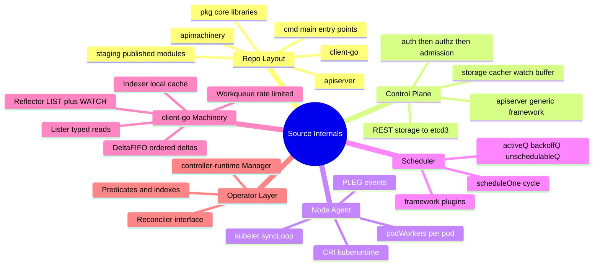
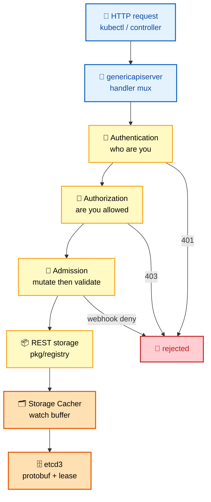
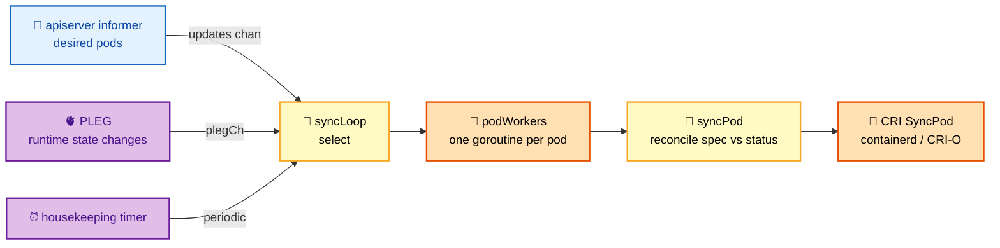
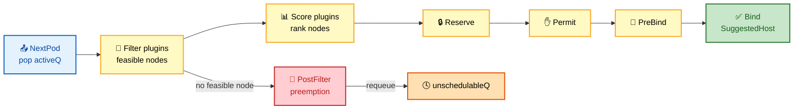
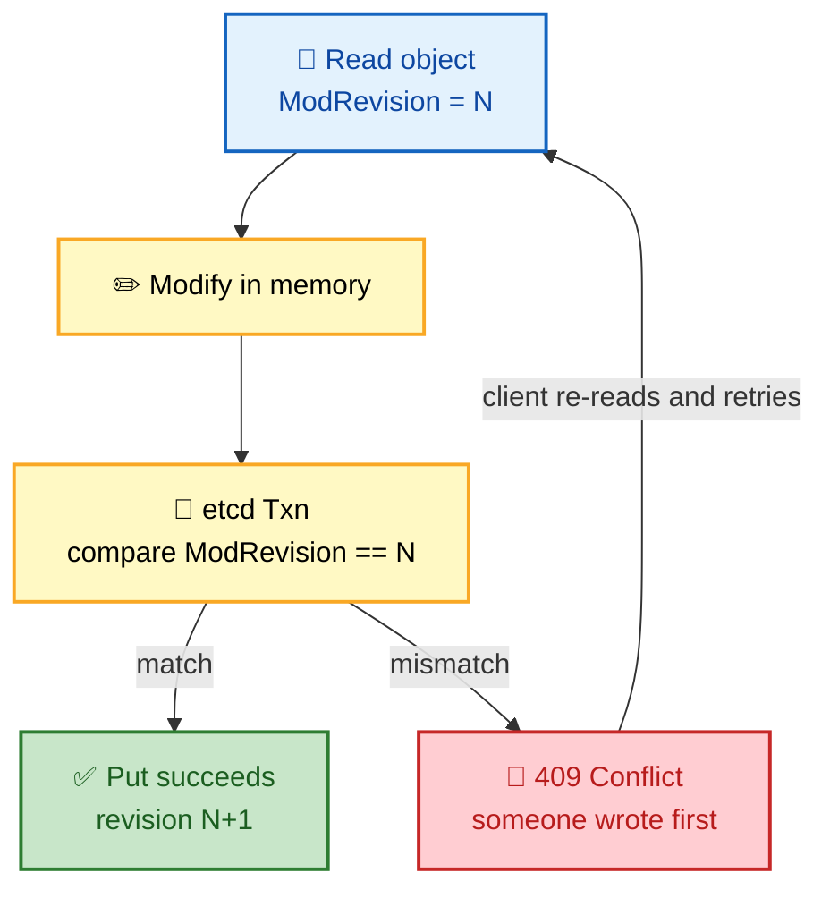
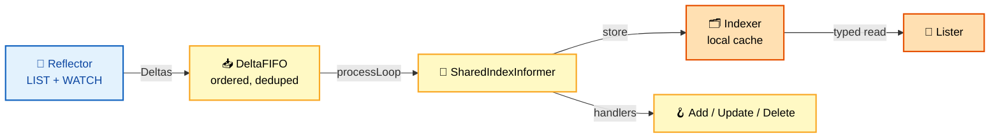
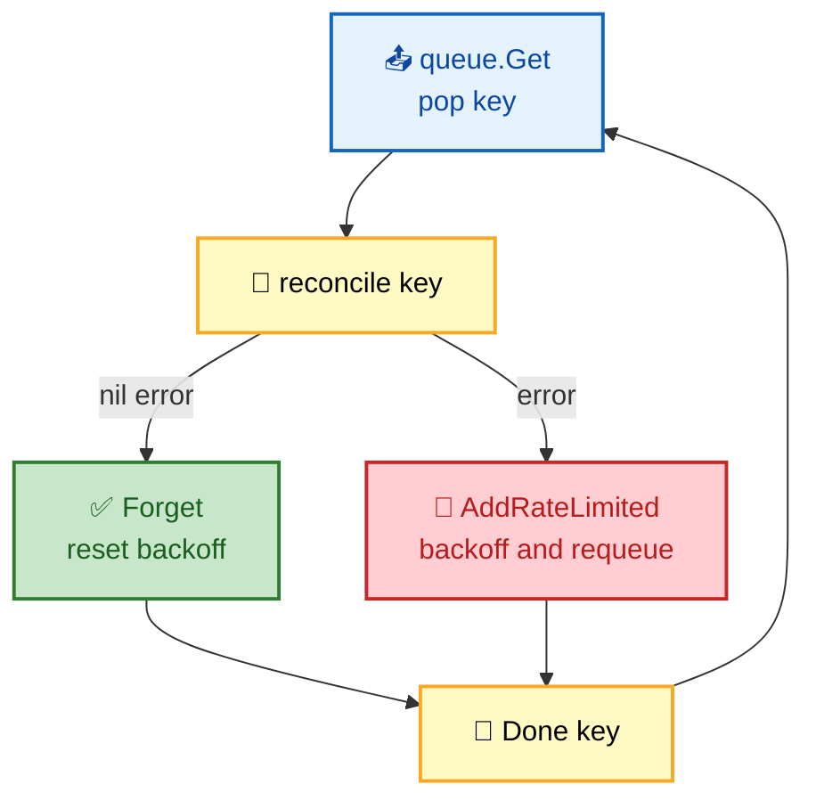

# Section 20: Kubernetes Source Code & Internals

Understanding Kubernetes source code structure is required for **staff/principal engineer interviews**. You don't need to have memorized the source, but you need to explain **how components work at the implementation level** — the request path through the apiserver, the kubelet sync loop, and above all the **client-go informer machinery** (Reflector → DeltaFIFO → Indexer → Lister) that every controller in the ecosystem is built on.

This section walks the real Go packages by path so you can open the tree and follow along, not just recite architecture diagrams.

## Subtopic Index

- [Repository Structure](#repository-structure)
- [kube-apiserver Internals](#kube-apiserver-internals)
- [kubelet Source Walk-through](#kubelet-source-walk-through)
- [Scheduler Source](#scheduler-source)
- [controller-manager Source](#controller-manager-source)
- [etcd Interaction](#etcd-interaction)
- [Informers — client-go](#informers--client-go)
- [Work Queues](#work-queues)
- [DeltaFIFO](#deltafifo)
- [controller-runtime](#controller-runtime)

---

## 🗺️ Visual Overview

**Mind map — the whole section at a glance** (skim this first, revisit it last):



**The client-go informer architecture — the single most important diagram in this section:**

```mermaid
flowchart LR
    ETCD["🗄️ etcd<br/>source of truth"] -->|"LIST + WATCH"| REF["👀 Reflector<br/>streams events"]
    REF -->|"push Deltas"| FIFO["📥 DeltaFIFO<br/>ordered, deduped<br/>per key"]
    FIFO -->|"processLoop pops"| INF["🔁 SharedIndexInformer"]
    INF -->|"update store"| IDX["🗂️ Indexer<br/>local in-memory cache"]
    INF -->|"fan out events"| HAND["🪝 Event Handlers<br/>Add / Update / Delete"]
    IDX -->|"typed cache reads"| LIST["📖 Lister<br/>no network call"]
    HAND -->|"enqueue key"| WQ["⚙️ Workqueue<br/>rate-limited"]
    WQ -->|"Get key"| REC["🧠 Reconciler<br/>your controller"]
    LIST -.->|"read desired state"| REC
    classDef start fill:#e3f2fd,stroke:#1565c0,color:#0d47a1,stroke-width:2px;
    classDef proc fill:#fff9c4,stroke:#f9a825,color:#000,stroke-width:2px;
    classDef good fill:#c8e6c9,stroke:#2e7d32,color:#1b5e20,stroke-width:2px;
    classDef ctrl fill:#e1bee7,stroke:#6a1b9a,color:#4a148c,stroke-width:2px;
    classDef store fill:#ffe0b2,stroke:#e65100,color:#000,stroke-width:2px;
    class ETCD,REF start;
    class FIFO,INF,HAND proc;
    class IDX,LIST,WQ store;
    class REC ctrl;
```



**The write path — from your `kubectl apply` to bytes in etcd:**



> 🧠 **Memory hooks (mnemonics):**
> - **Informer pipeline:** *"Really Fast Indexers Like Watching"* → **R**eflector → **F**IFO (Delta) → **I**ndexer → **L**ister → (event handlers) → **W**orkqueue.
> - **Apiserver request order:** *"Authn, Authz, Admit, Ache in the Store"* → **Authn → Authz → Admission → REST storage → etcd**. (First three are the "gauntlet"; last two persist.)
> - **Repo tree:** **cmd** = doors (main), **pkg** = the house (core logic), **staging** = the shop (published modules like client-go).
> - **DeltaFIFO is a *deduping* queue:** same key's rapid events collapse into an *ordered list of deltas* — never lose order, never double-process a key.
> - **Lister = free reads:** a Lister call is a *cache hit*, not an API call. "List local, Watch remote."

---

## Repository Structure

> 🎯 **Interview weight: Medium** — you should be able to point to *where* code lives; nobody expects line numbers.

**In one line:** The kube repo splits into `cmd/` (entry points), `pkg/` (core logic), and `staging/` (the reusable modules like **client-go** that get published as standalone Go modules).

```
kubernetes/
├── cmd/               # main() entry points
│   ├── kube-apiserver/
│   ├── kube-controller-manager/
│   ├── kube-scheduler/
│   └── kubelet/
├── pkg/               # core library packages
│   ├── api/           # internal API types
│   ├── apis/          # versioned API types
│   ├── controller/    # built-in controllers
│   ├── kubelet/       # kubelet logic
│   ├── scheduler/     # scheduler algorithm
│   └── registry/      # REST storage handlers
├── staging/           # published as separate Go modules
│   └── src/
│       ├── k8s.io/api/            # versioned API types
│       ├── k8s.io/client-go/      # Go client + informers
│       ├── k8s.io/apiserver/      # generic apiserver framework
│       └── k8s.io/controller-manager/
├── vendor/            # dependencies
└── test/              # e2e, integration tests
```

Key repos you should know:
- `k8s.io/client-go`: informers, listers, work queues, dynamic client
- `k8s.io/controller-runtime`: high-level reconciler framework (used by operators)
- `k8s.io/apimachinery`: API type system, serialization, versioning
- `k8s.io/apiserver`: generic apiserver framework (auth, admission, storage)

> 🔍 **The three top-level directories, decoded:**
>
> | Directory | Holds | Mental model |
> |-----------|-------|--------------|
> | `cmd/` | `main()` for each binary (apiserver, scheduler, kubelet…) | The **front doors** — thin, just wiring |
> | `pkg/` | Core logic: controllers, kubelet, scheduler, registry | The **house** — where behavior lives |
> | `staging/src/k8s.io/*` | Code published as **separate Go modules** | The **shop** — reusable by anyone (client-go, apimachinery) |
>
> 💡 **Interview tip:** `staging/` is a common gotcha. Those packages are *developed inside* the main repo but *published* as independent modules (`k8s.io/client-go`, etc.) via a sync bot. That's why your `go.mod` imports `k8s.io/client-go` even though the code lives under `staging/`.

---

## kube-apiserver Internals

> 🎯 **Interview weight: High** — the request path (authn → authz → admission → storage) and the **watch cache** are staff-level favorites.

**In one line:** The apiserver is a thin resource-specific layer on top of the **generic apiserver framework** (`k8s.io/apiserver`); every request runs a fixed gauntlet of filters before hitting REST storage and etcd.

The apiserver is built on the generic apiserver framework (`k8s.io/apiserver`). Request handling path:

```
HTTP request
  → genericapiserver.Handler (mux)
  → authentication filters (pkg/auth/authenticator)
  → authorization filters (pkg/auth/authorizer)
  → admission (pkg/admission/plugin/*)
  → REST storage handler (pkg/registry/*)
  → etcd storage (pkg/storage/etcd3)
```

**Same path as a colorful flow** (blue = entry, yellow = filters, orange = storage):

```mermaid
flowchart LR
    H["📨 HTTP request"] --> M["🔀 Handler mux<br/>genericapiserver"]
    M --> AN["🔐 Authentication<br/>pkg/auth/authenticator"]
    AN --> AZ["🛂 Authorization<br/>pkg/auth/authorizer"]
    AZ --> AD["🧪 Admission<br/>pkg/admission/plugin"]
    AD --> R["📦 REST storage<br/>pkg/registry"]
    R --> S["🗄️ etcd3 storage<br/>pkg/storage/etcd3"]
    classDef start fill:#e3f2fd,stroke:#1565c0,color:#0d47a1,stroke-width:2px;
    classDef proc fill:#fff9c4,stroke:#f9a825,color:#000,stroke-width:2px;
    classDef store fill:#ffe0b2,stroke:#e65100,color:#000,stroke-width:2px;
    class H,M start;
    class AN,AZ,AD proc;
    class R,S store;
```



**API registration** — each resource type registers a REST storage implementation that handles GET/LIST/CREATE/UPDATE/DELETE. The generic registry (`pkg/registry/generic`) provides the default implementation backed by etcd.

**Watch implementation** — `pkg/storage/cacher/cacher.go`:

- The **Cacher** wraps the etcd storage with an **in-memory watch cache**.
- It maintains `watchCache` (a circular buffer of watch events) and `watchCacheInterval` (controls cache size).
- `NewCacherFromConfig` creates the cacher and starts a **background reflector** pulling events from etcd.

> 🧠 **Why the watch cache exists:** thousands of clients all watching Pods must **not** each hit etcd. The Cacher pulls once from etcd and fans out to every watcher from memory — this is what makes large clusters survivable.

**Informers in apiserver** — the apiserver uses its *own* informers to populate admission controllers and built-in controllers (GC, namespace lifecycle). See `pkg/controller/informerFactory`.

```bash
# Read the kube-apiserver main
cat cmd/kube-apiserver/apiserver.go

# Core storage path
cat pkg/registry/core/pod/storage/storage.go

# Watch cache
cat staging/src/k8s.io/apiserver/pkg/storage/cacher/cacher.go
```

---

## kubelet Source Walk-through

> 🎯 **Interview weight: High** — the `syncLoop` and its three event sources are the canonical "explain how the kubelet works" answer.

**In one line:** The kubelet is an event-driven loop (`syncLoop`) that reconciles **desired pods** (from the apiserver) against **actual containers** (from the CRI runtime), one goroutine per pod.

Entry point: `cmd/kubelet/kubelet.go` → `app.NewKubeletCommand()` → `run()` → `RunKubelet()`.

**Key packages:**

| Package | Responsibility |
|---------|----------------|
| `pkg/kubelet/kubelet.go` | main kubelet struct and `syncLoop` |
| `pkg/kubelet/pod_workers.go` | per-pod goroutines (`podWorkers`) |
| `pkg/kubelet/kuberuntime/` | CRI calls (RunPodSandbox, CreateContainer, etc.) |
| `pkg/kubelet/pleg/` | PLEG implementation |
| `pkg/kubelet/volumemanager/` | CSI volume lifecycle |
| `pkg/kubelet/prober/` | liveness/readiness/startup probe execution |

**Main sync loop** (`kubelet.go:syncLoop`) — three input channels feed it:

```go
func (kl *Kubelet) syncLoop(updates <-chan kubetypes.PodUpdate, handler SyncHandler) {
    // main loop runs every syncFrequency seconds + event-driven
    for {
        select {
        case update := <-updates:         // pod changes from informer
            handler.HandlePodUpdates(...)
        case event := <-kl.plegCh:       // PLEG events from runtime
            handler.HandlePodSyncs(...)
        case <-housekeepingTimer.C:       // periodic cleanup
            handler.HandlePodCleanups(...)
        }
    }
}
```

**The three event sources, visualized** (blue = desired-state watch, purple = runtime signals, yellow = timer):



**Pod sync** (`syncPod` in `kubelet.go`): pulls together desired pod spec, current runtime status, and volume/secret/configmap state. Calls `kl.containerRuntime.SyncPod()` which issues the appropriate CRI calls.

> 💡 **Interview tip:** If asked "how does the kubelet know a container crashed?" — the answer is **PLEG** (Pod Lifecycle Event Generator) relists runtime state and pushes an event onto `plegCh`, waking the sync loop for that pod.

---

## Scheduler Source

> 🎯 **Interview weight: High** — `scheduleOne` and the plugin framework extension points come up constantly.

**In one line:** The scheduler pops one pod at a time (`scheduleOne`), runs it through **Filter → Score** plugins over a node snapshot, then **Reserve → Permit → PreBind → Bind**.

Entry: `cmd/kube-scheduler/main.go` → `scheduler.New()` → `sched.Run()`.

**Key packages:**

| Package | Responsibility |
|---------|----------------|
| `pkg/scheduler/scheduler.go` | main scheduler loop |
| `pkg/scheduler/framework/` | plugin interfaces |
| `pkg/scheduler/framework/plugins/` | built-in plugins (NodeResourcesFit, TaintToleration, etc.) |
| `pkg/scheduler/internal/queue/` | activeQ, backoffQ, unschedulableQ |

**Scheduling cycle** (`scheduler.go:scheduleOne`):

```go
func (sched *Scheduler) scheduleOne(ctx context.Context) {
    pod := sched.NextPod()                    // pop from activeQ
    schedResult, err := sched.Algorithm.Schedule(ctx, ..., pod)
    // schedResult contains: SuggestedHost, EvaluatedNodes, FeasibleNodes
    if err != nil {
        sched.handleSchedulingFailure(...)     // PostFilter (preemption)
        return
    }
    // Reserve, Permit, PreBind, Bind
    err = sched.bind(ctx, ..., pod, schedResult.SuggestedHost, ...)
}
```

**The scheduling cycle as a flow** (yellow = compute, green = bound, red = failed → preemption):



**Scheduling framework plugins**: defined in `pkg/scheduler/framework/types.go`. Each plugin registers at specific extension points. The plugin registry (`pkg/scheduler/framework/runtime/framework.go`) calls plugins in order.

---

## controller-manager Source

> 🎯 **Interview weight: High** — the **watch cache → workqueue → reconcile** loop is *the* controller pattern; know it cold.

**In one line:** The controller-manager runs dozens of built-in controllers as goroutines; each one waits for its informer cache to sync, then drains a workqueue via a reconcile function (illustrated here by the Deployment controller).

Entry: `cmd/kube-controller-manager/main.go` → `app.NewControllerManagerCommand()`.

Controllers are registered in `cmd/kube-controller-manager/app/controllermanager.go` in the `NewControllerInitializers()` map. Each controller is started as a goroutine.

**Deployment controller** (`pkg/controller/deployment/deployment_controller.go`):

```go
func (dc *DeploymentController) Run(ctx context.Context, workers int) {
    defer dc.queue.ShutDown()
    // Wait for caches to sync
    if !cache.WaitForNamedCacheSync("deployment", ctx.Done(),
        dc.dLister.HasSynced, dc.rsLister.HasSynced, dc.podLister.HasSynced) {
        return
    }
    // Start workers
    for i := 0; i < workers; i++ {
        go wait.UntilWithContext(ctx, dc.worker, time.Second)
    }
    <-ctx.Done()
}
```

The reconcile logic in `syncDeployment`:

1. Get all ReplicaSets for the deployment.
2. Compute the new RS (create if doesn't exist).
3. Scale up new RS, scale down old RS (rollout logic).
4. Cleanup old RSes beyond `revisionHistoryLimit`.
5. Update Deployment status.

> ⚠️ **The universal gotcha:** a controller **must** call `WaitForCacheSync` before processing. Reconciling against a half-populated cache makes the controller "see" objects as missing and take destructive action (e.g., recreating resources that already exist).

> 🧠 **Every built-in controller is the same shape:** *informer fills cache → event handler enqueues key → worker pops key → reconcile → requeue-on-error*. Learn it once here, recognize it everywhere.

---

## etcd Interaction

> 🎯 **Interview weight: High** — **optimistic concurrency** (resourceVersion → 409 Conflict) is a top-tier internals question.

**In one line:** The apiserver serializes objects (protobuf preferred) under `/registry/<group>/<resource>/<ns>/<name>` keys and uses etcd **compare-and-swap transactions** so two writers can't clobber each other.

The apiserver communicates with etcd via `k8s.io/apiserver/pkg/storage/etcd3`. Key path:

```
REST handler → store.Create(obj) → Cacher.Create() → storage.Create()
  → etcd client (go.etcd.io/etcd/client/v3)
  → etcd.Put(key, encryptedValue, lease)
```

Objects are serialized as protobuf (preferred) or JSON. Kubernetes keys in etcd follow `/<group>/<resource>/<namespace>/<name>` convention (with the `/registry` prefix).

**Optimistic concurrency** — the apiserver uses etcd transactions:

```go
// Simplified UpdateWithTTL
txn := client.Txn(ctx).If(
    clientv3.Compare(clientv3.ModRevision(key), "=", currentRevision),
).Then(
    clientv3.OpPut(key, newValue),
).Else(
    clientv3.OpGet(key),
)
```

If the ModRevision doesn't match (another writer updated between our read and write), the txn fails and the apiserver returns **409 Conflict**.

**The compare-and-swap decision, visualized** (green = committed, red = conflict → retry):



> 💡 **Interview tip:** This is why controllers use `RetryOnConflict` — a 409 isn't an error, it's "you raced, re-read `resourceVersion` and try again." `resourceVersion` *is* etcd's `ModRevision` bubbling up through the API.

---

## Informers — client-go

> 🎯 **Interview weight: Critical** — this is the single most important package in the section. Every controller, operator, and kubectl watch is built on it.

**In one line:** An informer keeps a **local, always-current cache** of a resource by doing one LIST+WATCH (via the **Reflector**), feeding events through **DeltaFIFO** into an **Indexer**, and firing your event handlers — so your controller reads from RAM, not the API.

`k8s.io/client-go/tools/cache` is the most important package for controller writers.

**The four moving parts:**

| Component | File | Job |
|-----------|------|-----|
| **Reflector** | `cache/reflector.go` | LIST then WATCH; on `410 Gone`, relist |
| **DeltaFIFO** | `cache/delta_fifo.go` | Ordered, per-key deduped queue of `Delta`s |
| **SharedIndexInformer** | `cache/shared_informer.go` | Pop deltas → update Indexer → call handlers |
| **Lister** | generated per type | Type-safe **cache reads** (no network) |

**Reflector** (`cache/reflector.go`): implements LIST+WATCH. On start it lists the resource and stores objects in DeltaFIFO, then watches and streams events into DeltaFIFO. On `410 Gone` it relists.

**DeltaFIFO** (`cache/delta_fifo.go`): a FIFO queue of `Delta` structs. Each delta has a type (Added/Updated/Deleted/Replaced/Sync) and an object. **Deduplicates by key** — multiple events for the same object are merged into a list of deltas for that key.

**SharedIndexInformer** (`cache/shared_informer.go`): pops from DeltaFIFO (via `processLoop`), updates the Indexer store, and calls event handlers. `AddEventHandler` registers multiple handlers — **all** receive each event.

**Lister** (generated per resource type): reads from the Indexer with type safety. `PodLister.Pods(namespace).Get(name)` → **no network call**, just a cache read.

**The flow through the four parts:**



```go
// Complete informer setup pattern
factory := informers.NewSharedInformerFactory(client, 30*time.Second)
deployInformer := factory.Apps().V1().Deployments()
deployInformer.Informer().AddEventHandler(cache.ResourceEventHandlerFuncs{
    AddFunc: func(obj interface{}) { queue.Add(key(obj)) },
    UpdateFunc: func(_, obj interface{}) { queue.Add(key(obj)) },
    DeleteFunc: func(obj interface{}) {
        tombstone, ok := obj.(cache.DeletedFinalStateUnknown)
        if ok { queue.Add(key(tombstone.Obj)) }
    },
})
factory.Start(stopCh)
if !cache.WaitForCacheSync(stopCh, deployInformer.Informer().HasSynced) {
    panic("cache sync failed")
}
```

> 🧠 **"Shared" is the key word:** a `SharedInformerFactory` gives every controller in your process **one** informer per resource type — a single LIST+WATCH shared by all handlers — instead of N separate watches hammering the apiserver.

---

## Work Queues

> 🎯 **Interview weight: High** — the **Get → reconcile → AddRateLimited/Forget → Done** cycle and per-item backoff are must-knows.

**In one line:** A workqueue decouples "an event happened" from "process it," giving controllers **per-item rate limiting, exponential backoff on failure, and a guarantee that a key is never processed by two workers at once**.

`k8s.io/client-go/util/workqueue` provides the work queue used by all Kubernetes controllers.

Key interface: `RateLimitingInterface`. **Three rate limiters:**

| Rate limiter | Behavior |
|--------------|----------|
| `BucketRateLimiter` | Token bucket for **overall** rate limiting |
| `ItemExponentialFailureRateLimiter` | **Per-item** exponential backoff — delay doubles each `AddRateLimited(key)` (5ms → 10ms → 20ms… max 1000s) |
| `ItemFastSlowRateLimiter` | Fast for first N failures, slow after |

Standard pattern:

```go
for {
    item, quit := queue.Get()
    if quit { return }
    
    if err := reconcile(item.(string)); err != nil {
        queue.AddRateLimited(item)  // retry with backoff
    } else {
        queue.Forget(item)          // reset backoff counter
    }
    queue.Done(item)
}
```

`Done(item)` marks the item as processed. If a new event arrived for the same key **while it was being processed**, `Done()` triggers it to be re-delivered.

**The worker loop, visualized** (green = success path, red = retry path):



> ⚠️ **`Forget` vs `Done` confusion** is a classic trap: **`Forget`** resets the *backoff counter* for a key; **`Done`** marks the item *no longer in-flight*. You almost always call `Done` (in every path), but only `Forget` on success.

---

## DeltaFIFO

> 🎯 **Interview weight: High** — correct **event ordering** and tombstone handling are staff-level correctness questions.

**In one line:** DeltaFIFO is the ordered, deduping queue *between* the Reflector and the Indexer that guarantees a controller sees an object's events **in the order they happened** — never a delete before its add.

DeltaFIFO is the queue between the Reflector (watch stream) and the Indexer (cache). It's critical to understand because it determines **event delivery semantics**.

**Key properties:**

- **FIFO**: events are processed in the order they were received.
- **Deduplication by key**: if the same key has multiple pending events, they're combined into a list of deltas (in order).
- **Delta types**: `Added`, `Updated`, `Deleted`, `Replaced` (from LIST), `Sync` (from resync).

A **`Sync`** event is generated periodically (resync) for every object in the cache. This ensures the reconciler sees all objects regularly, even if no real events occurred — it allows **recovery from missed events**.

When a controller receives `cache.Tombstone` objects in `DeleteFunc`: this happens when the object was deleted **while the informer was disconnected**. The cache detects it during relist and sends a `DeletedFinalStateUnknown` — the controller should handle it by extracting the object from the tombstone.

> 🔍 **The five delta types, decoded:**
>
> | Delta | Source | Meaning |
> |-------|--------|---------|
> | `Added` | WATCH | new object appeared |
> | `Updated` | WATCH | existing object changed |
> | `Deleted` | WATCH | object removed |
> | `Replaced` | LIST | full relist snapshot (post 410) |
> | `Sync` | resync timer | periodic re-delivery for reconciliation |

> 🧠 **Why ordering matters:** without DeltaFIFO's ordered per-key list, a rapid *delete → re-add* could be processed out of order, and the controller would wrongly conclude the object is gone. The ordered delta list is what makes controllers **correct**, not just eventually-consistent.

---

## controller-runtime

> 🎯 **Interview weight: High** — nearly every modern operator is written with it; know Manager, Reconciler, predicates, and field indexes.

**In one line:** `controller-runtime` wraps client-go into a batteries-included operator SDK: you implement a single `Reconcile(ctx, Request)` method and the **Manager** handles caches, leader election, and event wiring.

`sigs.k8s.io/controller-runtime` is the operator SDK framework. It wraps client-go and provides a higher-level reconciler interface.

**Key components:**

| Component | Role |
|-----------|------|
| **Manager** | Orchestrates controllers, informers, webhooks; handles leader election + cache sync |
| **Reconciler** | The interface you implement: `Reconcile(ctx, Request) (Result, error)` |
| **Client** | Reads from cache (Get, List) or writes to apiserver (Create, Update, Delete, Patch) |
| **Builder** | Fluent API for wiring controllers to watch specific resources |

```go
// Controller setup with controller-runtime
ctrl.NewControllerManagedBy(mgr).
    For(&appsv1.Deployment{}).      // watch Deployments, trigger reconcile
    Owns(&appsv1.ReplicaSet{}).     // also trigger on owned ReplicaSet changes
    WithEventFilter(predicate.GenerationChangedPredicate{}). // only on spec changes
    Complete(&DeploymentReconciler{})
```

**Predicates** — filter which events trigger reconciliation:

- `GenerationChangedPredicate`: only triggers when `metadata.generation` changes (**spec** changed, not status).
- `ResourceVersionChangedPredicate`: triggers on **any** change.
- Custom predicates: filter by specific labels or fields.

**Index fields** — custom indices on the Indexer for fast lookups:

```go
mgr.GetFieldIndexer().IndexField(ctx, &v1.Pod{}, "spec.nodeName", func(obj client.Object) []string {
    return []string{obj.(*v1.Pod).Spec.NodeName}
})
// Later: client.List(ctx, &podList, client.MatchingFields{"spec.nodeName": "node-1"})
```

> 💡 **Interview tip:** When asked "how do you avoid a hot-loop of reconciles?" — reach for a **predicate**. `GenerationChangedPredicate` skips status-only updates so your controller's own status writes don't retrigger it.

---

## Interview Questions

### Conceptual / Internals (8 questions)

**1. What is DeltaFIFO and why is it important for controller correctness?**
DeltaFIFO is the queue between the Reflector (which streams watch events) and the Indexer (the local cache). It stores events as `Delta` objects: each delta has a type (Added/Updated/Deleted/Replaced/Sync) and the object. Deduplication by key ensures that multiple rapid updates to the same object are accumulated as a list of deltas for that key, processed in order when a worker is available. This is critical for correctness: a controller that processes stale events (e.g., delete then re-add, processed in the wrong order) would incorrectly see the object as deleted. DeltaFIFO's ordered delta list ensures the controller sees the correct sequence.

**2. How does client-go's work queue prevent concurrent reconciliation of the same object?**
The work queue uses an internal `processing` set. When `Get()` returns a key to a worker, it's added to `processing`. If a new event for the same key arrives while it's in `processing`, the key is placed in the `dirty` set (not the main queue). When `Done(key)` is called, if the key is in `dirty`, it's moved to the main queue. This ensures at most one goroutine reconciles a given key at a time. Multiple workers can process different keys simultaneously, but the same key is never processed by two goroutines concurrently.

**3. Explain the difference between `Reconcile` returning an error vs returning `Result{Requeue: true}`.**
Returning an `error`: the item is requeued with exponential backoff (managed by `ItemExponentialFailureRateLimiter`). First failure retries after 5ms, doubling each time up to 1000 seconds. Intended for transient errors (API unavailable, network timeout). Returning `Result{Requeue: true}`: the item is requeued immediately (or after `RequeueAfter` duration) without incrementing the failure counter. Intended for normal polling or "not done yet" states. Returning `Result{}` with no error: item is forgotten (backoff counter reset) and not requeued unless a new watch event arrives.

**4. How does controller-runtime's Manager handle leader election for controllers?**
Manager creates a Kubernetes `Lease` resource for leader election using `controller-runtime/pkg/leaderelection`. All manager replicas compete for the lease. Only the leader activates controllers and starts informer caches. Standbys run health checks but don't process any objects. If the leader crashes or fails to renew within `leaseDurationSeconds`, a standby acquires the lease. The new leader starts informers (LIST+WATCH) and begins processing. The Lease acquisition is done by the manager before calling `mgr.Start()` — so controllers only start on the leader.

**5. What is a watch bookmark event and why was it introduced?**
A BOOKMARK event is a special watch event with no object change — it just carries the current `resourceVersion`. Before bookmarks: a watcher that receives no events for a long time can fall behind the watch cache's minimum revision. On reconnect, it requests from its last seen revision, which may be before the cache's compaction point, causing a 410 Gone and requiring a full relist. With bookmarks: the apiserver periodically sends BOOKMARK events even when there are no object changes. The client advances its `resourceVersion` without a relist. This reduces the frequency of 410 Gone events and full relisters, reducing load spikes on the apiserver after reconnects.

**6. How does the scheduler's node snapshot prevent concurrent scheduling from over-committing nodes?**
The scheduler takes a snapshot of node state (capacity, allocated resources, pod list) at the start of each scheduling cycle. Filtering and scoring use this immutable snapshot — no locking needed for parallel execution. The snapshot is stale by design (consistent snapshot at one point in time). After selecting a node and entering the `Reserve` phase, the scheduler updates the **live cache** (not the snapshot) under a mutex: it adds the pod to the node's in-flight allocations. The next scheduling cycle's snapshot includes these reserved resources. If binding fails (Unreserve), the live cache is updated back. This prevents two concurrent scheduling cycles from both placing pods on a node without accounting for each other's decisions.

**7. Explain how the apiserver's storage cacher prevents excessive etcd reads during watch reconnects.**
The storage cacher maintains an in-memory ring buffer (default configurable size, e.g., 100 events per resource type) of recent watch events. When a client reconnects and requests a watch starting at revision N: if N is within the cached window, events are served from memory — no etcd scan. If N is below the cached window (cache overflow), the server returns 410 Gone and the client must relist. The cacher uses a `watchCacheInterval` to determine how many events to keep. A larger cache reduces 410 frequency at the cost of memory. The cacher also serves LIST requests from its in-memory snapshot when `resourceVersion=0`, avoiding etcd reads for the majority of LIST operations.

**8. How does the Garbage Collector controller detect orphaned objects and clean them up?**
The GC controller in controller-manager maintains a directed graph of all Kubernetes objects and their ownerReferences. It periodically re-syncs by listing all objects with owner references. An object is orphaned if: its `ownerReference` points to a non-existent owner UID. The GC sends delete requests for orphaned objects. For foreground deletion: the GC first deletes all children with `blockOwnerDeletion: true`, then removes the finalizer from the owner. For background deletion: the owner is deleted immediately; GC asynchronously deletes children. The GC uses informers on all resource types to detect changes, and a work queue to process deletions. It must handle the race between creating a child and registering the owner to avoid falsely GCing legitimately-owned objects.

### Scenario Questions (6 questions)

**9. You're writing a controller that needs to watch pods across all namespaces but only act on pods owned by your CRD. How do you implement this efficiently?**
Use a filtered informer with a label selector that matches pods owned by your CRD (if your CRD sets a known label on owned pods). Alternatively: use `controller-runtime`'s `Owns()` to watch owned pods — the controller is only triggered when an owned pod changes. Use a custom index on the pod lister: `mgr.GetFieldIndexer().IndexField(ctx, &v1.Pod{}, "metadata.ownerReferences.controller-uid", ...)`. Then query: `client.List(ctx, &pods, client.MatchingFields{"owner-uid": myObj.UID})`. This avoids a full cluster-wide pod watch — only pods with a specific owner UID are indexed and listed.

**10. How would you implement status conditions in a controller to accurately reflect the operational state?**
Use the standard conditions pattern: `Type`, `Status` (True/False/Unknown), `Reason` (camelCase code), `Message` (human-readable), `LastTransitionTime`. Update `LastTransitionTime` only when `Status` changes (not on every reconcile). Use a helper to set conditions without spurious updates:
```go
func setCondition(conditions []metav1.Condition, c metav1.Condition) []metav1.Condition {
    for i, existing := range conditions {
        if existing.Type == c.Type {
            if existing.Status == c.Status { return conditions }  // no change
            conditions[i] = c
            return conditions
        }
    }
    return append(conditions, c)
}
```
Write status via `r.Status().Update(ctx, obj)` (the status subresource) — not via `r.Update()` which would conflict with spec writers.

### FAANG Deep Dive (6 questions)

**11. Trace the complete code path from a pod Watch event arriving in the apiserver to the kubelet starting the container.**
(1) etcd fires a watch event → apiserver storage cacher receives it via background reflector → cacher updates its watchCache ring buffer → fans out to all registered watchers. (2) The kubelet's informer (via Reflector in client-go) receives the MODIFIED event from apiserver → stores in DeltaFIFO → processLoop pops the delta → updates the Indexer → calls the registered event handler → adds the pod key to podWorkers. (3) podWorkers goroutine for this pod dequeues the work → calls kubelet.syncPod() → kubelet.kuberuntime.SyncPod() → detects container needs to be started → calls criClient.RunPodSandbox() (gRPC to containerd) → criClient.CreateContainer() → criClient.StartContainer() → containerd creates OCI bundle → runc execve's the entrypoint. (4) kubelet PLEG detects container state change → kubelet updates pod status → patches pod/status via apiserver.

**12. How does controller-runtime implement server-side apply for controller-managed resources?**
controller-runtime's `client.Apply()` method uses server-side apply under the hood. It sends a PATCH request with content type `application/apply-patch+yaml` and the `fieldManager` header set to the controller's name. The patch body is the desired object state (typically only the fields the controller manages). The apiserver merges this with the live object using field ownership — the controller "takes ownership" of the fields it specifies. If another manager owns a field, the controller receives a 409 Conflict. With `ForceOwnership: true`, the controller forcibly takes ownership. SSA with `Patch()`: `r.Patch(ctx, obj, client.Apply, client.FieldOwner("my-controller"))`. Benefits: idempotent (sending the same patch twice has no effect), no read-before-write needed for non-owned fields, prevents controllers from stomping on each other's fields.

---

## Hands-On: Code Reading Exercise

Read these files in the Kubernetes source tree (clone `github.com/kubernetes/kubernetes`):

1. `pkg/kubelet/kubelet.go` lines 1-100: understand the kubelet struct fields.
2. `pkg/scheduler/framework/types.go`: read the plugin interfaces (Filter, Score, etc.).
3. `staging/src/k8s.io/client-go/tools/cache/delta_fifo.go`: read `Add()` and `Pop()`.
4. `pkg/controller/deployment/deployment_controller.go`: read `syncDeployment()`.
5. `staging/src/k8s.io/client-go/util/workqueue/rate_limiting_queue.go`: read `AddRateLimited()`.
