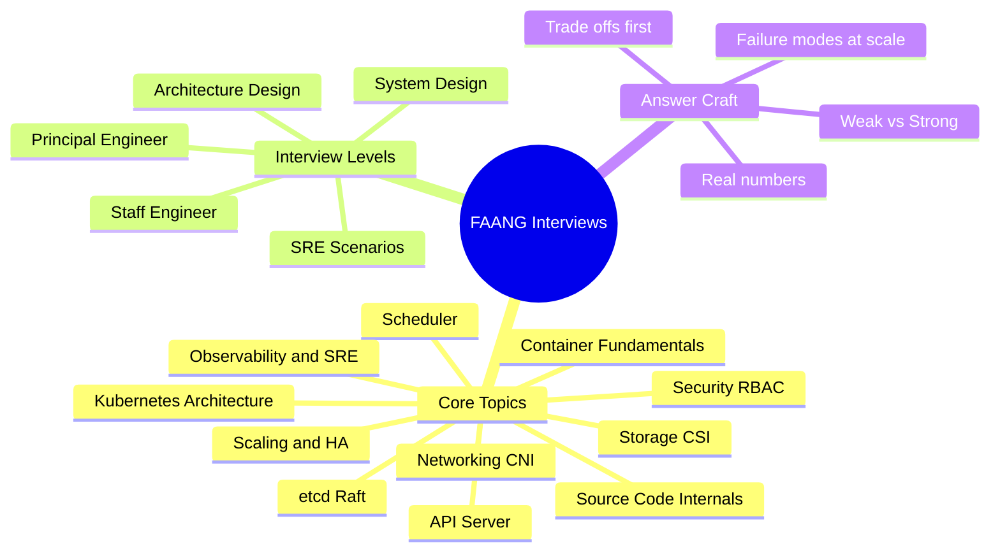
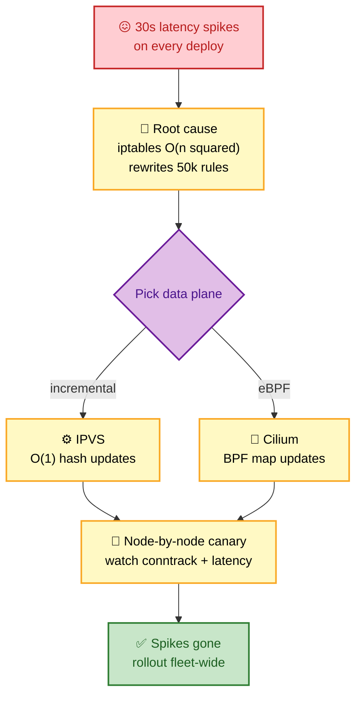
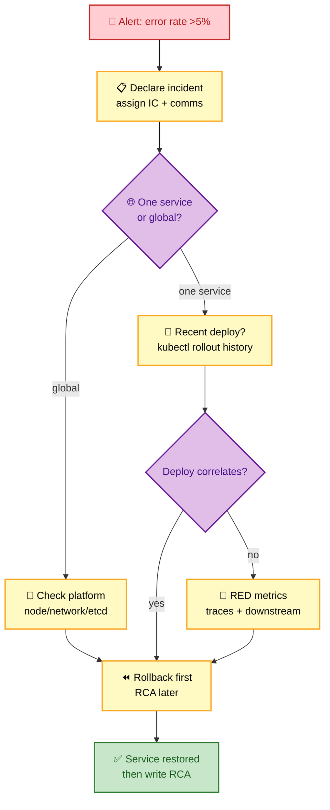
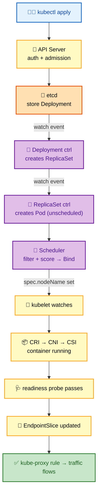
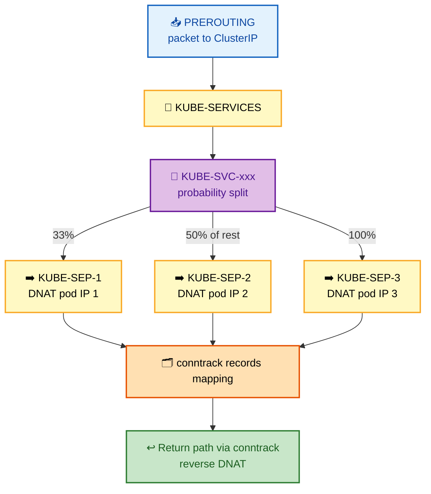
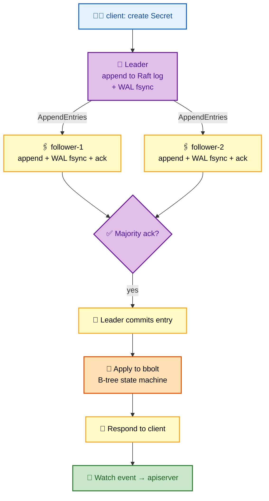
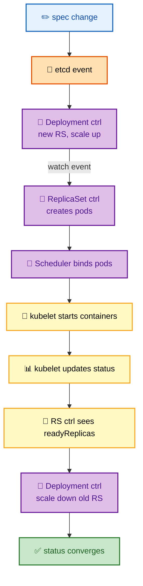
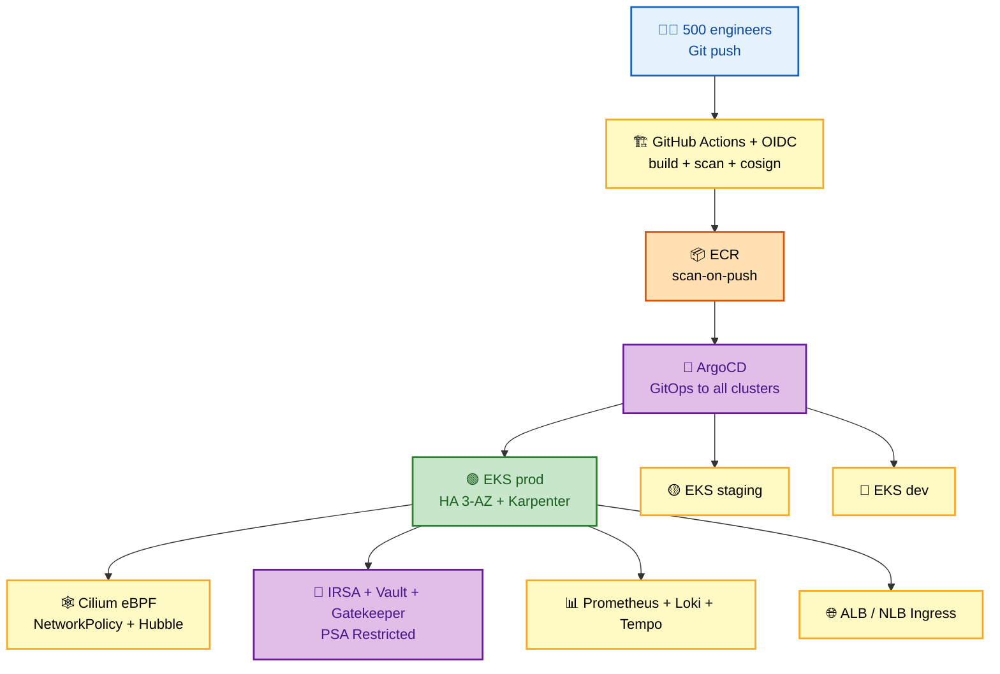

# Section 22: FAANG Interview Preparation

Comprehensive interview question bank for senior Kubernetes positions at Google, Meta, Amazon, Netflix, Apple, Uber, Airbnb, and similar companies. Organized by role level and topic.

## Subtopic Index

- [Top 200 Interview Questions — Quick Reference](#top-200-interview-questions--quick-reference)
- [Staff Engineer Deep-Dive Questions](#staff-engineer-deep-dive-questions)
- [Principal Engineer Questions](#principal-engineer-questions)
- [SRE Scenarios](#sre-scenarios)
- [Architecture Design Questions](#architecture-design-questions)
- [Whiteboard Exercises](#whiteboard-exercises)
- [System Design Interviews](#system-design-interviews)
- [Strong vs Weak Answers](#strong-vs-weak-answers)

---

## 🗺️ Visual Overview

**Mind map — every theme this question bank covers** (skim first, revisit before the interview):

**The one request flow you will be asked to draw** — `kubectl apply` to a Ready pod (highest-value diagram):

```mermaid
flowchart LR
    A["🧑‍💻 kubectl apply"] --> B["🚪 API Server<br/>auth + admission"]
    B --> C["💾 etcd<br/>persist desired state"]
    C --> D["🔁 Controllers<br/>Deployment then ReplicaSet"]
    D --> E["🧠 Scheduler<br/>filter then score"]
    E --> F["🤖 kubelet<br/>CRI + CNI + CSI"]
    F --> G["✅ Pod Ready<br/>EndpointSlice updated"]
    class A start
    class B proc
    class C store
    class D proc
    class E ctrl
    class F proc
    class G good
    classDef start fill:#e3f2fd,stroke:#1565c0,color:#0d47a1,stroke-width:2px;
    classDef proc fill:#fff9c4,stroke:#f9a825,color:#000,stroke-width:2px;
    classDef good fill:#c8e6c9,stroke:#2e7d32,color:#1b5e20,stroke-width:2px;
    classDef bad fill:#ffcdd2,stroke:#c62828,color:#b71c1c,stroke-width:2px;
    classDef ctrl fill:#e1bee7,stroke:#6a1b9a,color:#4a148c,stroke-width:2px;
    classDef store fill:#ffe0b2,stroke:#e65100,color:#000,stroke-width:2px;
```

> 🧠 **Memory hooks (mnemonics for tackling K8s interviews):**
> - **Answer framework — "WRAP":** **W**eigh trade-offs → **R**eal numbers → **A**ssume scale → **P**rove it with failure modes. Never give a bare definition.
> - **Request flow — "API Eats Cold Salmon Kindly":** **A**PI server → **E**tcd → **C**ontrollers → **S**cheduler → **K**ubelet.
> - **etcd quorum rule:** odd members only — **3 tolerates 1, 5 tolerates 2**, never 2 or 4.
> - **Debugging under pressure — "Scope before you Scope-creep":** confirm *one service or global?* before touching anything.
> - **System design — "R-C-A":** always open with **R**equirements → **C**apacity estimation → **A**rchitecture. Never jump straight to YAML.

> 💡 **Interview tip:** The 200 questions below are a *recall drill*. The sections after them (Staff → Strong vs Weak) are where you win offers — they test how you *reason*, not what you memorized.

---

## Top 200 Interview Questions — Quick Reference

### Container Fundamentals (1–20)
1. What is a container? How does it differ from a VM at the kernel level?
2. Explain Linux namespaces. Which does Kubernetes use?
3. Walk through what happens when `docker run nginx` executes.
4. How do cgroups enforce resource limits?
5. What is OverlayFS copy-on-write?
6. Explain OCI image and runtime specifications.
7. What is containerd? How does it differ from runc?
8. What is the CRI and why was it created?
9. Why was dockershim removed from Kubernetes?
10. What is PID 1 in a container and why does it matter?
11. How do you properly handle SIGTERM in a containerized application?
12. What is a user namespace and how does it improve security?
13. Explain cgroups v2 benefits over v1.
14. What is a container image layer? How are they stored?
15. How does OverlayFS create a container's root filesystem?
16. What happens when a container writes to a file from its base image?
17. What is the `pause` container in Kubernetes and why does it exist?
18. How does containerd's shim architecture enable daemon-free container survival?
19. Explain the difference between `runAsNonRoot` and a user namespace.
20. What is PLEG and when does it become unhealthy?

### Kubernetes Architecture (21–40)
21. Explain the Kubernetes desired state model.
22. Why does Kubernetes use reconciliation loops instead of imperative commands?
23. What components are on the control plane vs data plane?
24. How does a StaticPod bootstrap the control plane?
25. Explain the interaction between scheduler, controller-manager, and kubelet.
26. What is a watch in Kubernetes? How does it work internally?
27. How does resource version provide optimistic concurrency?
28. What is a Shared Informer? Why is sharing important?
29. Explain DeltaFIFO and why it exists.
30. How does level-triggered reconciliation differ from edge-triggered?
31. What is the difference between `spec.generation` and `status.observedGeneration`?
32. Explain owner references and garbage collection.
33. What happens when the apiserver is unavailable for 5 minutes?
34. What is static stability in Kubernetes?
35. How does leader election work for kube-scheduler?
36. What is cloud-controller-manager and why was it separated?
37. Explain how finalizers block object deletion.
38. How do admission webhooks fit in the request lifecycle?
39. What is API Priority and Fairness?
40. Explain the difference between foreground and background cascading deletion.

### API Server (41–60)
41. Trace a `kubectl apply` from the client to etcd, naming every processing stage.
42. What is the admission controller chain order?
43. Why does mutating admission run before validating admission?
44. Explain server-side apply and field managers.
45. What are the differences between authentication and authorization in Kubernetes?
46. How does OIDC authentication work with the apiserver?
47. What is the TokenReview API?
48. Explain the watch cache in the apiserver.
49. How does the apiserver serve LIST requests without hitting etcd every time?
50. What causes a 410 Gone on a watch and how does the client recover?
51. What is API aggregation and when would you use it over a CRD?
52. What is a FlowSchema in APF?
53. How does the apiserver handle certificate rotation for its own serving cert?
54. Explain the request timeout mechanism in the apiserver.
55. What is the aggregation layer and how does it proxy requests?
56. How are API versions converted in the apiserver?
57. What is selective informer caching?
58. Explain the watch bookmark mechanism.
59. How does the apiserver's serialization pipeline work?
60. What is the `--max-requests-inflight` flag and what replaced it?

### etcd (61–75)
61. Explain Raft leader election.
62. What is the write path in etcd?
63. How does etcd achieve linearizable reads?
64. What happens when etcd loses quorum?
65. What is compaction and why is it needed?
66. How does defragmentation differ from compaction?
67. What is the WAL and what role does fsync play?
68. Why do slow disks destabilize etcd?
69. How does the apiserver use etcd transactions for optimistic concurrency?
70. Explain etcd MVCC.
71. How do you take and restore an etcd backup?
72. What is `etcd_disk_wal_fsync_duration_seconds` and what should its p99 be?
73. How many etcd members should a production cluster have and why not 2 or 4?
74. Explain the pre-vote mechanism in etcd.
75. What key format does Kubernetes use in etcd?

### Scheduler (76–90)
76. Explain the scheduling framework and its extension points.
77. How do the three scheduler queues work?
78. What is the difference between filtering and scoring?
79. Explain pod affinity vs topology spread constraints performance-wise.
80. How does the scheduler prevent over-commitment when scheduling concurrently?
81. What is gang scheduling and how do you implement it?
82. How does preemption work?
83. What is a scheduler extender and when would you use one?
84. Explain `requiredDuringScheduling` vs `preferredDuringScheduling`.
85. What node affinity fields remain after a pod is running?
86. How does `WaitForFirstConsumer` interact with the scheduler's VolumeBinding plugin?
87. What causes a pod to be in `unschedulableQ` vs `backoffQ`?
88. How does `percentageOfNodesToScore` improve scheduler throughput?
89. What is kube-scheduler's node snapshot and why is it taken at cycle start?
90. Explain the `Permit` extension point.

### Networking (91–110)
91. Explain the three Kubernetes network model rules.
92. What does a CNI plugin do at the kernel level?
93. Explain VXLAN encapsulation in Flannel.
94. How does Calico BGP mode work?
95. Trace a packet from pod A to pod B on a different node.
96. Trace a packet from a pod to a ClusterIP Service.
97. Explain the iptables KUBE-SERVICES chain.
98. How does IPVS differ from iptables for Service routing?
99. What is a conntrack entry and what happens when the table is full?
100. Explain Cilium's identity-based policy.
101. How does XDP provide early packet drop?
102. What is eBPF and how does the verifier ensure safety?
103. Explain `externalTrafficPolicy: Local` vs `Cluster`.
104. What is EndpointSlice and why was it created?
105. Explain the ndots:5 DNS lookup multiplication problem.
106. How does CoreDNS avoid API calls on every DNS query?
107. What is NodeLocal DNSCache?
108. Explain Gateway API's role separation model.
109. What causes 502 vs 503 from an NGINX Ingress?
110. How does mTLS work in Istio?

### Storage (111–125)
111. Explain the full lifecycle of a PVC from creation to pod mounting.
112. What is `WaitForFirstConsumer` and what problem does it solve?
113. Explain the CSI gRPC call sequence for mounting a new volume.
114. What is the difference between NodeStageVolume and NodePublishVolume?
115. Why does `ReadWriteOnce` not mean single-pod?
116. What is `ReadWriteOncePod` and when was it added?
117. How does etcd envelope encryption protect secrets at rest?
118. What is Velero and how does it implement application-consistent backup?
119. Explain reclaim policies.
120. How does fsGroup work and what is its performance impact?
121. What are the differences between Retain, Delete, and Recycle?
122. How do volume snapshots work?
123. Why can volume expansion get stuck in `FileSystemResizePending`?
124. What is a VolumeAttachment object?
125. Explain CSI ephemeral volumes.

### Security (126–145)
126. Explain the Kubernetes authentication chain.
127. How does RBAC policy evaluation work?
128. What is the Node authorizer and why can't a kubelet read other nodes' secrets?
129. Explain projected service account tokens.
130. What is the difference between `runAsNonRoot` and a user namespace?
131. Explain seccomp and how it filters syscalls.
132. What are Pod Security Standards?
133. How does OPA/Gatekeeper differ from Kyverno?
134. What is IRSA and how does it work?
135. Explain cosign keyless signing.
136. What is a SPIFFE SVID?
137. How does Istio implement mTLS without application changes?
138. Explain the Kubernetes threat model.
139. What is the confused deputy problem in cloud IAM?
140. How does etcd encryption at rest protect against what threat?
141. Explain the data perimeter concept.
142. What is Falco and how does it detect threats?
143. What does `allowPrivilegeEscalation: false` prevent at the kernel level?
144. How do you audit and clean up excessive RBAC permissions?
145. What is break-glass access and how should it be implemented?

### Observability / SRE (146–165)
146. Explain the difference between `container_memory_rss` and `container_memory_working_set_bytes`.
147. What is CPU throttling and how do you detect it?
148. Explain multi-window burn-rate alerting.
149. How does the Prometheus Operator translate ServiceMonitor to scrape config?
150. What is the difference between SLI, SLO, and SLA?
151. How does OpenTelemetry context propagation work across services?
152. What is tail-based sampling and why is it important for error tracing?
153. How does Loki index logs without full-text indexing?
154. What is `kube_pod_container_status_restarts_total` and how do you alert on it?
155. Explain the RED method and the USE method.
156. How would you detect a memory leak using Prometheus?
157. What is Hubble in Cilium?
158. How does kubectl debug work internally?
159. What is a recording rule and when should you use one?
160. Explain error budget burn rate calculations.
161. How do you correlate traces with logs?
162. What is Parca and how does eBPF enable continuous profiling?
163. What metrics should you monitor on an etcd cluster?
164. What is the difference between metrics-server and Prometheus for HPA?
165. How do you detect if a Kubernetes upgrade degraded performance?

### Scaling / HA (166–180)
166. Explain the HPA control loop and scaling algorithm.
167. Why is HPA on memory risky?
168. How does VPA recommend resource changes?
169. What is KEDA's scale-to-zero mechanism?
170. How does Cluster Autoscaler decide which node group to scale?
171. How does Karpenter differ from Cluster Autoscaler?
172. Explain Karpenter consolidation.
173. How many control plane nodes for HA and why not 2?
174. What is static stability in Kubernetes HA design?
175. Explain multi-AZ capacity planning for AZ-loss tolerance.
176. What is RTO vs RPO and how do they apply to Kubernetes?
177. How does a PDB interact with kubectl drain?
178. Explain the zone eviction rate limiting in the node lifecycle controller.
179. What is a game day and why is it necessary?
180. How do you achieve 99.99% availability with Kubernetes?

### Advanced / Source Code (181–200)
181. Explain DeltaFIFO's delta merging behavior.
182. How does controller-runtime implement leader election?
183. What is server-side apply and how does it track field ownership?
184. How do conversion webhooks handle CRD versioning?
185. Explain the difference between error return vs `Result{Requeue: true}` in a reconciler.
186. How does the watch cache prevent etcd overload during a relist storm?
187. What is the scheduling framework's `Reserve` phase for?
188. Explain the node snapshot's role in concurrent scheduling correctness.
189. How does Cilium's BPF verifier ensure kernel safety?
190. What is the Raft pre-vote mechanism?
191. How does etcd's MVCC B-tree implement range scans for watch?
192. Explain the etcd transaction used for Kubernetes optimistic concurrency.
193. How does the kubelet's podWorkers avoid concurrent reconciliation of the same pod?
194. What is the `leaseDuration`, `renewDeadline`, and `retryPeriod` in leader election?
195. How does ArgoCD detect drift between Git and live cluster state?
196. What is Kyverno's `verify-image` rule doing at the admission level?
197. How does PLEG's relist algorithm cause O(n²) degradation?
198. What is the `bookmarks` feature in watch and why does it reduce relist frequency?
199. Explain how Karpenter's bin-packing algorithm selects instance types.
200. What is the BPF map type used by Cilium for Service load balancing and why O(1)?

---

## Staff Engineer Deep-Dive Questions

Staff-level questions require explaining *why* a decision was made, the trade-offs, and the failure modes at scale.

> 💡 **Interview tip:** For every Staff answer, structure your reply as **Requirements → Design → Trade-offs → Scale/failure modes**. Naming *what breaks at scale* is what separates Staff from Senior.

**SE-1. Design a multi-tenant Kubernetes platform for 500 engineering teams.**

*Expected answer elements:*
- **Isolation:** vCluster or namespace-based isolation, RBAC with namespace admin
- **Guardrails:** ResourceQuota per team, NetworkPolicy default-deny, Kyverno/OPA policies
- **Compute:** Karpenter node pools per team type
- **Operations:** cost showback via labels, ArgoCD ApplicationSet for fleet management
- **Self-service:** self-service API (Backstage), break-glass procedures

**SE-2. You have a 5000-node cluster where iptables kube-proxy is causing 30-second latency spikes during deployments. Explain the root cause and your migration plan.**

*Expected:*
- **Root cause:** O(n²) `iptables-restore` at scale — each Service endpoint change rewrites all 50,000 rules
- **Fix:** migrate to IPVS (incremental O(1) updates) or Cilium eBPF (BPF map updates)
- **Risks:** migration risks (kube-proxy restart)
- **Rollout:** rollout plan using node-by-node canary

**SE-3. How would you design a zero-trust networking architecture for Kubernetes?**

*Expected:*
- **Network:** default-deny NetworkPolicy, Cilium L7 policy
- **Identity/mTLS:** Istio mTLS with STRICT PeerAuthentication, SPIFFE/SPIRE identity, workload identity (IRSA/Workload Identity), no long-lived credentials
- **Admission:** admission policy blocking hostNetwork/hostPID
- **Runtime:** runtime security (Falco), mutual TLS to external services

**SE-4. Design a disaster recovery strategy for a Kubernetes cluster with 99.9% RPO.**

*Expected:*
- **Budget:** 99.9% RPO = 43.2 minutes/month max data loss
- **Backups:** etcd backup every 5 minutes (S3 cross-region); Velero PV snapshots every 5 minutes
- **Rebuild:** GitOps for fast cluster rebuilding; active-passive with pre-provisioned standby
- **Validation:** tested game days quarterly; automate failover trigger

**SE-5. Walk through writing a production-grade Kubernetes operator. What patterns and failure modes must you handle?**

*Expected:*
- **Reconciler:** idempotent reconciler, server-side apply, finalizers for cleanup, conditions in status
- **Versioning:** CRD versioning with conversion webhooks
- **Lifecycle:** leader election in Manager, graceful shutdown
- **Reliability:** metrics/tracing in the operator, error handling with exponential backoff, test with envtest

---

## Principal Engineer Questions

Principal questions require influencing organization-level decisions and thinking about multi-year scale.

> 💡 **Interview tip:** Principal answers are judged on **blast radius, org change management, and multi-year sequencing** — not on picking the "right" tool. Talk about *how you de-risk a 2-year migration*, not just the end state.

**PE-1. Your organization wants to move from a 10-cluster model to a 500-cluster model for team isolation. What technical decisions need to be made?**

*Expected:*
- **Lifecycle:** Cluster API for lifecycle management
- **Fleet:** GitOps fleet management (Argo ApplicationSet), cluster versioning strategy
- **Cross-cutting:** centralized observability (Prometheus federation), centralized security policy (Kyverno), cross-cluster service discovery, cost attribution across clusters
- **Networking:** network isolation vs connectivity
- **Alternative:** vCluster as alternative to full clusters for dev environments

**PE-2. Design the observability stack for a platform where each team deploys independently. What are the scalability constraints?**

*Expected:*
- **Metrics:** per-team Prometheus instances vs centralized; recording rules to reduce cardinality; Prometheus federation or Thanos for multi-cluster
- **Logs:** Loki for logs with per-team label streams
- **Traces:** distributed tracing with sampling (tail-based for error traces)
- **Self-serve:** SLO-as-code; self-serve dashboarding via Grafana data sources
- **Constraint:** cost of high-cardinality metrics

**PE-3. A large org wants to migrate 10,000 services from VMs to Kubernetes. What are the highest-risk aspects and how do you sequence the migration?**

*Expected:*
- **Assessment:** assessment phase (stateful vs stateless, legacy protocols, security requirements)
- **Standards:** containerization standards (12-factor, health checks, resource limits)
- **Platform:** platform bootstrapping (golden path)
- **Sequencing:** migration waves (stateless first, then stateful), DNS transition, traffic cutover strategy, rollback per service
- **People:** organizational change management

---

## SRE Scenarios

> 💡 **Interview tip:** In SRE scenarios, **mitigate before you diagnose**. Say "rollback first, RCA later" out loud — interviewers are checking whether you protect users before your curiosity.

**SRE-1. At 3 AM, an alert fires: "payment service error rate >5%." Walk through your investigation.**

**Strong answer:**
- **Structure:** structured incident command (Declare, Assign IC, Communicate)
- **Scope first:** one service or global?
- **Recent change:** recent deploy? `kubectl rollout history`
- **Signal:** error type from traces/logs; database or downstream issue? resource exhaustion? check RED metrics
- **Hypothesis:** narrow by correlating with deploy timeline
- **Mitigate:** rollback first, investigate later. RCA after service restored.

**SRE-2. You need to plan for Black Friday traffic: 100x normal load for 6 hours. What do you do?**

**Strong answer:**
- **Model:** capacity model from load test data
- **Pre-scale:** pre-scale 3 days before (schedule HPA min, Karpenter NodePool CPU limit increase)
- **Test:** load test in staging at 100x; pre-warm caches; database connection pool sizing
- **Protect:** circuit breakers configured
- **People + plan:** on-call schedule; rollback plan; communicate schedule to all teams; post-event retro

**SRE-3. Design an error budget policy for a team with a 99.9% SLO.**

**Strong answer:**
- **Budget:** 43.2 minutes/month error budget
- **Policy tiers:**
  - `>50%` remaining → ship features freely
  - `25–50%` → CI gate requires SLO analysis
  - `0–25%` → freeze feature deploys, only reliability work
  - `0%` → escalate to leadership, incident review
- **Measure:** Prometheus recording rules for SLO compliance
- **Cadence:** weekly SLO review, monthly error budget report

---

## Architecture Design Questions

> 💡 **Interview tip:** Name the component **and the reason** — "ArgoCD *because* GitOps gives auditable, revertible deploys." A list of tools without rationale reads as buzzword bingo.

**AD-1. Design a global platform to run 10,000 microservices across 5 regions.**

*Components:*
- **Clusters:** Cluster API for 5 regional clusters
- **Delivery:** ArgoCD multi-cluster (hub-spoke)
- **Routing/state:** Global Accelerator for routing, DynamoDB Global Tables for shared state, Kafka MirrorMaker for event streaming
- **Observability:** centralized Prometheus with Thanos
- **Networking/secrets/policy:** per-region Cilium for networking, HashiCorp Vault for secrets, OPA for unified policy

**AD-2. Design a CI/CD platform that can deploy 1,000 services/hour with zero-downtime.**

*Components:*
- **Build:** GitHub Actions with OIDC for push, per-service pipelines (not monorepo), KEDA for build runner autoscaling
- **Delivery:** ArgoCD for GitOps delivery, Argo Rollouts for canary with Prometheus analysis, blue-green for breaking changes
- **Supply chain:** Harbor for image registry with scanning, Kyverno for image signing verification
- **Feedback:** notification system for deploy status

**AD-3. Design a multi-tenant LLM inference platform on Kubernetes.**

*Components:*
- **Isolation:** vCluster per tenant for isolation, Cilium for tenant isolation
- **Compute:** GPU node pools with Karpenter (Spot + On-Demand), KEDA for scale-to-zero
- **Serving:** vLLM/TGI for inference
- **Storage:** model storage on EFS (shared) + per-tenant PVCs
- **Ops/guardrails:** Prometheus with per-tenant RBAC, cost metering via tenant labels, inference guardrails via admission

---

## Whiteboard Exercises

> 💡 **Interview tip:** Narrate as you draw. Say each arrow's *trigger* ("the watch event fires, so...") — whiteboard scoring rewards showing you understand the event-driven flow, not just the boxes.

**WB-1. Draw the complete request flow from `kubectl apply deployment.yaml` to the first pod being Ready.**

Draw: kubectl → apiserver (auth, admission, etcd) → watch event → Deployment controller → ReplicaSet controller → Pod (unscheduled) → Scheduler → Binding → kubelet watches → CRI → CNI → CSI → container running → readiness probe passes → EndpointSlice updated → kube-proxy rule updated → traffic flows.

**WB-2. Draw the iptables chain for a ClusterIP Service with 3 endpoints.**

Draw: PREROUTING → KUBE-SERVICES → KUBE-SVC-xxx [33% → KUBE-SEP-1, 50% of rest → KUBE-SEP-2, 100% → KUBE-SEP-3] → DNAT to pod IP. Show conntrack recording the mapping. Show return path via conntrack.

**WB-3. Draw the etcd Raft write path for a Secret creation.**

Draw: client → leader (AppendEntries to log + WAL fsync) → followers (AppendEntries, WAL fsync, acknowledge) → leader (commit after majority) → apply to bbolt state machine → respond to client → watch event to apiserver.

**WB-4. Draw the Kubernetes control loops for a Deployment rollout.**

Draw: spec change → etcd event → Deployment controller (creates new RS, scales up) → watch event → ReplicaSet controller (creates pods) → Scheduler (binds pods) → kubelet (starts containers) → kubelet updates status → RS controller sees readyReplicas → Deployment controller scales down old RS → status converges.

---

## System Design Interviews

### Design a production-grade EKS platform for a 500-person engineering org

> 💡 **Interview tip:** Drive the interview through the funnel **Requirements → Capacity → Architecture → Scale → Security → Cost → Failure**. Explicitly ask clarifying questions first — jumping to architecture is the most common failure.

**Requirements clarification**: team count, service count, compliance requirements (SOC2?), cost sensitivity, multi-region requirement.

**Capacity estimation**: 500 engineers × 5 services/team avg = 2,500 services; peak load = 10x average; 99.9% SLO target.

**Architecture**:
- AWS account structure: management, tooling, prod, staging, dev accounts
- EKS clusters: prod (HA, 3 AZ), staging, dev (smaller)
- Karpenter for node provisioning (Spot + On-Demand mix)
- IRSA for all workload identity; no static AWS credentials
- Cilium for networking (eBPF, NetworkPolicy, Hubble)
- ArgoCD for GitOps deployment to all clusters
- kube-prometheus-stack + Loki + Tempo for observability
- ECR with scan-on-push + cosign verification
- Vault for secrets (External Secrets Operator)
- OPA Gatekeeper for policy enforcement
- AWS LBC for Ingress (ALB) + NLB for TCP services

**Scaling strategy**: Karpenter JIT provisioning, HPA on CPU+RPS, KEDA for event-driven services.

**Security**: PSA Restricted, mTLS via Cilium, Falco runtime monitoring, VPC flow logs, CloudTrail, GuardDuty.

**Cost**: Spot for stateless (70% savings), compute Savings Plans, cross-AZ traffic reduction via topology hints, cost showback via Kubecost.

**Failure handling**: multi-AZ worker nodes, 3-replica control plane, PDB on all critical services, etcd backup every 5 min, game days quarterly.

**Security**: PSA Restricted, mTLS via Cilium, Falco runtime monitoring, VPC flow logs, CloudTrail, GuardDuty.

**Cost**: Spot for stateless (70% savings), compute Savings Plans, cross-AZ traffic reduction via topology hints, cost showback via Kubecost.

**Failure handling**: multi-AZ worker nodes, 3-replica control plane, PDB on all critical services, etcd backup every 5 min, game days quarterly.

---

## Strong vs Weak Answers

> 💡 **Interview tip:** The gap between weak and strong is always **naming the internal mechanism, the exact API/field, and the failure mode**. Weak answers describe *what*; strong answers describe *how it works under the hood and when it breaks*.

### "How does a pod get scheduled?"

**Weak answer**: "The scheduler looks at available resources and picks a node."

**Strong answer**: "The scheduler's pending pod is dequeued from the activeQ (priority-ordered heap). A snapshot of all nodes and their allocated resources is taken at the start of the scheduling cycle.

- **Filter phase** runs all filter plugins in parallel goroutines per node — NodeResourcesFit checks if the node has sufficient allocatable CPU/memory for the pod's requests; TaintToleration checks the pod's tolerations against node taints; VolumeBinding checks PVC zone constraints; etc. Nodes failing any filter are eliminated.
- **Score phase:** feasible nodes are scored by Score plugins (LeastAllocated, PodTopologySpread, etc.) — each assigns 0-100 and scores are weighted and summed. The highest-scoring node wins.
- **Reserve** tentatively claims resources in the live cache. **Permit** can delay binding. **PreBind** handles side effects.
- **Bind** issues `POST /api/v1/pods/<name>/binding` which sets `spec.nodeName`. The kubelet on that node watches for the pod assignment."

### "What is an HPA?"

**Weak answer**: "HPA scales pods up and down based on CPU."

**Strong answer**: "The HPA is a control loop (default 15s period) that reads metrics and adjusts replicas:

- **Metric sources:** resource metrics from `metrics.k8s.io/v1beta1` (metrics-server), custom metrics from `custom.metrics.k8s.io/v1beta1` (Prometheus Adapter), or external metrics from `external.metrics.k8s.io/v1beta1` (KEDA).
- **Algorithm:** `desiredReplicas = ceil(currentReplicas × currentMetric / desiredMetric)`.
- **Scale timing:** scale-up is immediate (stabilizationWindowSeconds: 0 by default); scale-down uses a stabilization window (default 300s) and can be rate-limited by policies (`scaleDown.policies: [{type: Pods, value: 4, periodSeconds: 60}]`).
- **Bounds & conflicts:** HPA cannot scale below `minReplicas` (minimum 1 — KEDA extends this to 0 via a separate mechanism). Running HPA on CPU and VPA on CPU simultaneously causes oscillation — a known conflict.
- **Mechanism:** HPA patches `Deployment.spec.replicas` which the Deployment controller then reconciles."

### "Explain etcd."

**Weak answer**: "etcd is the Kubernetes database."

**Strong answer**: "etcd is a distributed key-value store using the Raft consensus protocol. In Kubernetes, it's the only stateful component — all cluster state is stored here; all other components are stateless.

- **Write path:** a client sends a `Put` to the leader; the leader appends to its Raft log, calls `fdatasync` on the WAL, sends `AppendEntries` to followers; after a majority acknowledge (each also fsyncing their WAL), the entry is committed; the leader applies it to the bbolt B-tree state machine and responds to the client.
- **Reads:** linearizable by default — the leader verifies its lease is current before serving.
- **Performance:** `fdatasync` on the WAL is the single most performance-critical operation — any p99 >10ms indicates disk pressure that will cascade to apiserver latency and eventually Raft leader elections.
- **Quorum:** a 3-member cluster tolerates 1 failure; a 5-member cluster tolerates 2.
- **Concurrency:** the apiserver uses etcd transactions for optimistic concurrency: `Txn(If modRevision == expected, Then Put(newValue))` — a mismatch returns 409 which the apiserver translates to a 409 Conflict for clients."
