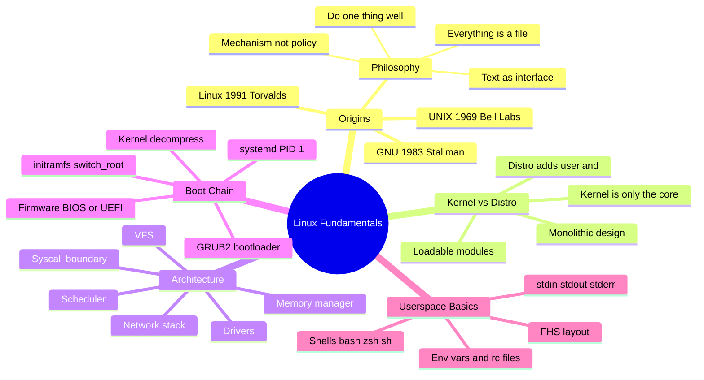
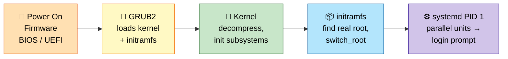
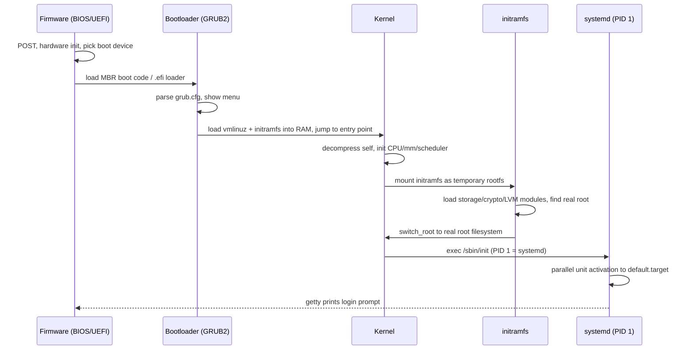

# Section 1: Linux Fundamentals & History

This section builds the foundation every later section depends on: where Linux came from, how a
kernel differs from a distribution, how the system architecture is organized, and — critically —
exactly what happens between pressing the power button and getting a login prompt. Interviewers use
this ground truth to test whether you actually understand the machine or just memorize commands.
Everything here is phrased so you can trace a real boot, not just recite definitions.

## Subtopic Index
- [History of UNIX and Linux](#history-of-unix-and-linux)
- [GNU/Linux Philosophy](#gnulinux-philosophy)
- [Kernel vs Distribution](#kernel-vs-distribution)
- [Monolithic vs Microkernel Design](#monolithic-vs-microkernel-design)
- [Linux Kernel Architecture Overview](#linux-kernel-architecture-overview)
- [Boot Process Overview (firmware to userspace)](#boot-process-overview-firmware-to-userspace)
- [BIOS/UEFI](#biosuefi)
- [Bootloaders (GRUB2)](#bootloaders-grub2)
- [initramfs / initrd](#initramfs--initrd)
- [Kernel Initialization](#kernel-initialization)
- [init systems (SysVinit, Upstart, systemd)](#init-systems-sysvinit-upstart-systemd)
- [Runlevels vs systemd Targets](#runlevels-vs-systemd-targets)
- [Linux Filesystem Hierarchy Standard (FHS)](#linux-filesystem-hierarchy-standard-fhs)
- [Standard Streams (stdin/stdout/stderr)](#standard-streams-stdinstdoutstderr)
- [Shells (bash, zsh, sh) and Shell Internals](#shells-bash-zsh-sh-and-shell-internals)
- [Environment Variables and Shell Initialization Files](#environment-variables-and-shell-initialization-files)

---

## 🗺️ Visual Overview

**Mind map — the whole section at a glance** (skim this first, revisit it last):



**The boot chain — memorize this five-link flow** (highest-value diagram in the section):



> 🧠 **Memory hooks (mnemonics):**
> - **Boot order:** *"Firm Grubs Kill Insects Systematically"* → **F**irmware → **G**RUB → **K**ernel → **I**nitramfs → **S**ystemd.
> - **UNIX philosophy:** *"Every Dog Makes Tracks"* → **E**verything-is-a-file, **D**o-one-thing-well, **M**echanism-not-policy, **T**ext-interface.
> - **GNU/Linux split:** GNU brought the *body* (shell, libc, coreutils); Linus brought the *heart* (the kernel).
> - **BIOS vs UEFI:** BIOS reads a tiny 512-byte **sector**; UEFI reads a whole **file** off a FAT partition. "Sector = old, File = new."

---

## History of UNIX and Linux

> 🎯 **Interview weight: Low** — know the lineage and the "why GNU/Linux" story; don't memorize dates.

**In one line:** Linux is a 1991 kernel that filled the one missing piece of GNU's already-complete free UNIX clone — which is why the whole OS inherits 50 years of UNIX design DNA.

**The problem it solved:** UNIX proved a small, portable, multi-user OS could work — but by the 1980s it was locked behind restrictive AT&T licensing. The free-software world had everything *except* a working kernel. Linus supplied the kernel; GNU supplied the rest.

**The timeline that matters:**

| Year | Event | Why it matters |
|------|-------|----------------|
| 1969 | Thompson & Ritchie build UNIX at Bell Labs | Origin of "everything is a file", pipes, `fork`/`exec` |
| ~1972 | UNIX rewritten in C | First portable OS — why it runs on any CPU |
| 1977+ | BSD forks from UNIX | Free/open lineage → FreeBSD, OpenBSD, macOS Darwin |
| 1983 | Stallman starts GNU | Builds free libc, gcc, coreutils, bash — but no finished kernel |
| 1991 | Torvalds posts Linux for the 386 | The missing kernel; "just a hobby, won't be big" |

**Why it's called GNU/Linux:** the kernel is Linux; nearly all the userland (compiler, shell, coreutils, libc) came from GNU. A kernel alone can't boot you to a shell — you also need init, libc, coreutils, and a shell, which is exactly what a *distribution* packages.

> 💡 **Interview tip:** When asked "why does Linux keep this odd legacy behavior?", the answer is usually *"it inherited it from UNIX, and changing it would break decades of software."*

### Key commands
```
uname -a                 # kernel name, version, build date, architecture
cat /proc/version        # kernel version string + compiler used to build it
cat /etc/os-release       # distribution identity (ID, VERSION_ID, PRETTY_NAME)
lsb_release -a            # distro info via LSB tooling (if installed)
```

## GNU/Linux Philosophy

> 🎯 **Interview weight: Medium** — great for "why is Linux designed this way?" questions.

**In one line:** A handful of UNIX design maxims explain almost every "why is Linux like this?" question.

The four tenets to internalize:

- **Everything is a file.** Devices (`/dev/sda`), kernel state (`/proc/self/status`), tunables (`/sys/.../mtu`), and pipes are all file-like objects you `open()`/`read()`/`write()`/`ioctl()`. This is why generic tools (`cat`, `dd`, redirection) work uniformly across wildly different subsystems.
- **Do one thing well.** `grep` filters, `sort` sorts, `wc` counts. You compose small tools with pipes instead of building monoliths. (An anonymous pipe is just a pair of file descriptors over a kernel ring buffer — a syscall-level fundamental worth knowing cold.)
- **Mechanism, not policy.** The kernel provides primitives (namespaces, cgroups, scheduling classes) and stays agnostic about *how* they're used. Policy (which init, which runtime, which package manager) lives in userspace — which is why one kernel fragments into hundreds of distros.
- **Text as a universal interface.** Configs, logs, and output are plain text so tools built decades apart still interoperate. (Now being challenged by binary formats like `journald` logs and `systemd` JSON output.)

> 💡 **Interview tip:** Asked to justify a design ("why is `/proc` text files, not an API?"), tie it back to one of these principles — don't just recite internals.

### Key commands
```
man hier                 # manual page describing the filesystem hierarchy philosophy
ls -l /dev | head        # devices exposed as files
cat /proc/cpuinfo        # kernel state exposed as a readable text file
```

## Kernel vs Distribution

> 🎯 **Interview weight: Medium** — a classic early filter question.

**In one line:** "Linux" is *only* the kernel; a "distribution" is that kernel plus a curated userland packaged as a shippable product.

**The distinction:**

| | Kernel ("Linux") | Distribution (Ubuntu, Fedora, RHEL…) |
|---|---|---|
| What it is | Scheduler, memory manager, drivers, filesystems, network stack | Kernel + libc + coreutils + init + package manager + shell |
| Privilege | Runs in kernel-mode (ring 0), full hardware access | Mostly userspace |
| Who ships it | kernel.org / Linus | Canonical, Red Hat, Debian, etc. |

**Why two distros with the same kernel behave differently** — it's all userland/policy choices:

- Security model: SELinux (Fedora/RHEL) vs AppArmor (Ubuntu/SUSE)
- Default filesystem: ext4 vs Btrfs vs XFS
- Different `systemd` unit defaults and `sysctl` defaults
- Patch cadence: Debian stable freezes for years and backports fixes; Fedora ships bleeding-edge every 6 months

> 🔍 **Under the hood:** RHEL backports security/driver fixes into an *old* kernel version number instead of tracking upstream. That's why `uname -r` on RHEL looks ancient yet contains recent CVE fixes — a deliberate "kernel ABI stability" trade-off.

> 💡 **Interview tip:** Always separate **kernel behavior** (true on any distro with that kernel/config) from **distro policy** (true only because of packaging). Example: cgroup v2 is a kernel feature, but *enabling it by default* was a distro/systemd decision.

### Key commands
```
cat /etc/os-release        # distro identity
uname -r                   # exact kernel release string (may include distro patch suffix)
rpm -q kernel / dpkg -l | grep linux-image   # installed kernel package + its distro-specific version
zcat /proc/config.gz 2>/dev/null | head      # kernel build config, if exposed by the distro
```

## Monolithic vs Microkernel Design

> 🎯 **Interview weight: Medium** — expect a compare/contrast and "why did Linux choose this?"

**In one line:** Linux is **monolithic** — scheduler, memory, filesystems, network, and drivers all run in one privileged address space, chosen for speed at the cost of fault isolation.

**The two ends of the spectrum:**

| | Monolithic (Linux) | Microkernel (Minix, QNX, seL4, Hurd) |
|---|---|---|
| What runs in ring 0 | Everything: scheduler, mm, FS, net, drivers | Bare minimum: IPC, scheduling, basic memory |
| Drivers/FS/net | In-kernel, full privilege | Userspace servers over message passing |
| Blast radius | A driver bug can panic the whole machine | A driver crash is isolated |
| Performance | Fast — no IPC per I/O | Slower — message-passing per operation |

**Why Linus chose monolithic:** performance and simplicity. A microkernel pays message-passing IPC cost between the FS "server" and disk "server" on *every* I/O. Monolithic avoids that — accepting weaker fault isolation.

**How Linux gets modularity without becoming a microkernel:**

- **Loadable Kernel Modules (LKMs)** — drivers/filesystems compiled separately and loaded at runtime (`insmod`/`modprobe`/`rmmod`). Monolithic speed, pluggable maintenance. (A buggy module can still panic the box — it runs in kernel space.)
- **FUSE** — filesystems as userspace daemons proxied via `/dev/fuse`; trades some speed for microkernel-like isolation.
- **DPDK / io_uring** — reduce kernel involvement per operation (for performance, not isolation).

> 💡 **Interview tip:** Be ready to contrast against seL4/QNX (safety-critical, *provable* isolation) and explain why cloud still picks Linux: ecosystem, driver support, raw performance — despite a panic taking down a whole VM/host.

### Key commands
```
lsmod                      # list currently loaded kernel modules (monolithic kernel's pluggable parts)
modinfo <module>           # description, license, params of a kernel module
dmesg | grep -i panic      # look for kernel panic traces in the kernel ring buffer
cat /proc/modules          # same data as lsmod, machine-parseable
```

## Linux Kernel Architecture Overview

> 🎯 **Interview weight: High** — being able to draw this from memory is a strong signal.

**In one line:** The kernel is a set of subsystems behind one stable boundary — the syscall interface — with pseudo-filesystems (`/proc`, `/sys`) exposing internal state to userspace.

**The syscall boundary:** userspace traps into ring 0 via a `syscall` instruction (`int 0x80` historically), the kernel looks up the number in the syscall table (`arch/x86/entry/syscalls/syscall_64.tbl`), and dispatches to the handler.

**The major subsystems:**

| Subsystem | Source dir | Responsibility |
|-----------|-----------|----------------|
| Scheduler | `kernel/sched/` | Which runnable task gets the CPU next (CFS) |
| Memory manager | `mm/` | Virtual memory, page tables, page cache, OOM killer |
| VFS | `fs/` | Uniform file API over ext4/XFS/Btrfs/NFS/tmpfs |
| Network stack | `net/` | Device driver up through sockets |
| Device drivers | `drivers/` | Largest fraction of kernel source; talks to hardware |

**Cross-cutting mechanisms** that touch all of the above:

- **Interrupts** — *top halves* do minimal work in interrupt context; *bottom halves* (softirqs, tasklets, workqueues) defer the rest to a safer context.
- **Locking** — spinlocks, mutexes, RCU keep multi-core access to shared structures consistent.
- **Module loader** — drivers/filesystems added at runtime.

> 🔍 **Under the hood:** State is exposed not just via syscalls but via pseudo-filesystems — `/proc` (process/kernel runtime state) and `/sys` (device/driver model, mirroring the kernel's `kobject` tree). That's how `ps`, `top`, and `systemd` introspect and tune the kernel without new syscalls.

```
 ┌─────────────────────────── userspace ───────────────────────────┐
 │  bash, systemd, sshd, containers, applications                   │
 └───────────────────────────┬───────────────────────────────────────┘
                              │ syscalls (open, read, write, fork, socket…)
 ┌───────────────────────────▼───────────────────────────────────────┐
 │                         LINUX KERNEL                              │
 │  ┌───────────┐ ┌────────────┐ ┌───────┐ ┌─────────┐ ┌──────────┐  │
 │  │ Scheduler │ │ Memory Mgmt│ │  VFS  │ │ Network │ │ Drivers  │  │
 │  │  (CFS)    │ │ (mm/, TLB, │ │(fs/)  │ │ (net/)  │ │(drivers/)│  │
 │  │           │ │ page cache)│ │       │ │         │ │          │  │
 │  └───────────┘ └────────────┘ └───────┘ └─────────┘ └──────────┘  │
 │        interrupts / softirqs / workqueues / locking (RCU, spin)   │
 └───────────────────────────┬───────────────────────────────────────┘
                              │ hardware access (MMIO, DMA, IRQ)
 ┌───────────────────────────▼───────────────────────────────────────┐
 │                       Physical Hardware                           │
 └─────────────────────────────────────────────────────────────────────┘
```

### Key commands
```
cat /proc/interrupts        # interrupt counts per CPU per device — spot IRQ imbalance
cat /proc/softirqs          # deferred bottom-half work counts
ls /sys/class/               # sysfs device/driver model tree
cat /proc/kallsyms | wc -l  # exported kernel symbol table size (sanity check on kernel build)
```

## Boot Process Overview (firmware to userspace)

> 🎯 **Interview weight: High** — narrating power-on → login prompt end-to-end is a top-value answer.

**In one line:** Firmware → bootloader → kernel → initramfs → `systemd` (PID 1) → login prompt — five hand-offs, each solving one problem for the next.

**The five stages:**

1. **Firmware (BIOS/UEFI)** runs POST (checks CPU, RAM, buses), then picks a boot device.
   - *Legacy BIOS/MBR:* reads the first 512-byte sector (MBR) — 446 bytes of code that can't read filesystems, so it chain-loads a second stage.
   - *Modern UEFI/GPT:* firmware itself reads the FAT32 EFI System Partition (ESP) and loads a `.efi` binary directly — faster, more flexible, multiple NVRAM boot entries.
2. **GRUB2** reads `grub.cfg`, shows a menu, loads `vmlinuz` + initramfs into RAM, jumps to the kernel with a command line.
3. **Kernel** decompresses itself, inits CPU/memory/scheduler, brings up early console, mounts the initramfs as a temporary RAM root.
4. **initramfs** loads the modules needed to *see the real root* (NVMe driver, LVM/RAID, LUKS decrypt), then `switch_root`s onto the real disk.
5. **systemd (PID 1)** activates units in parallel by dependency graph until it reaches the default target; `getty` prints the login prompt.



### Key commands
```
systemd-analyze                    # total boot time split: firmware, loader, kernel, userspace
systemd-analyze blame              # which unit took longest to start
systemd-analyze critical-chain     # dependency chain that determined total boot time
dmesg | less                       # full kernel boot log, ring buffer from kernel init onward
journalctl -b                      # full boot log for current boot (kernel + userspace merged)
cat /proc/cmdline                  # exact kernel command line passed by the bootloader
```

## BIOS/UEFI

> 🎯 **Interview weight: Medium** — know the BIOS vs UEFI differences and Secure Boot's chain of trust.

**In one line:** BIOS is legacy 16-bit firmware that can barely load a bootloader; UEFI is a full pre-OS environment that understands filesystems, runs `.efi` binaries, and enforces Secure Boot.

| | Legacy BIOS | UEFI |
|---|---|---|
| Mode | 16-bit real mode | 32/64-bit |
| Partitioning | MBR (max 2TB) | GPT (huge disks) |
| Boots by | Running MBR sector code | Loading `.efi` off the FAT ESP |
| Boot entries | Baked into boot sector | NVRAM variables (`efibootmgr`) |
| Security | None | Secure Boot (signed binaries) |
| Speed | Slower (real-mode emulation) | Faster (parallel device init) |

**Secure Boot chain of trust** (a supply-chain interview favorite):

- Firmware holds trusted keys (`db`) and a revocation list (`dbx`).
- It refuses to run any `.efi` not signed by a trusted key.
- Distros ship a **shim** signed by Microsoft's UEFI CA → shim verifies GRUB → GRUB verifies the kernel.
- A self-compiled unsigned kernel won't boot unless you enroll your own **Machine Owner Key (MOK)**.

> ⚠️ **Gotcha:** A corrupted EFI boot entry or an unmounted/reformatted ESP after a firmware update leaves a machine that "won't boot" even though the OS on disk is perfectly intact.

### Key commands
```
efibootmgr -v                 # list UEFI boot entries stored in NVRAM
mokutil --sb-state            # check whether Secure Boot is enabled
ls /boot/efi/EFI/              # inspect the EFI System Partition contents
dmesg | grep -i efi           # kernel messages about EFI runtime services
```

## Bootloaders (GRUB2)

> 🎯 **Interview weight: Medium** — know its staged design and the rescue-shell recovery path.

**In one line:** GRUB2 locates the kernel + initramfs, shows a boot menu, and hands off with the right kernel command line.

**Staged design (why it can boot from almost any filesystem):**

- `boot.img` — tiny 512-byte MBR stub; its only job is to load `core.img`.
- `core.img` — embeds filesystem drivers so GRUB can read its modules/config directly off ext4/XFS/Btrfs (no separate raw boot partition needed — the big win over GRUB Legacy).
- On UEFI: ships as a signed `grubx64.efi` on the ESP, loaded directly by firmware — no MBR stage.

**Config is generated, not hand-edited:**

- Edit `/etc/default/grub` (default kernel, timeout, params like `quiet`/`console=`) and drop rules in `/etc/grub.d/`.
- Run `grub2-mkconfig` / `update-grub` to regenerate `grub.cfg` by scanning `/boot` and other OSes (`os-prober`).

> 💡 **Interview tip:** If `grub.cfg` is missing/corrupt, GRUB drops to a **rescue shell**. You manually type `linux` / `initrd` / `boot` to boot once, then fix config from the running system. This is *the* standard recovery path after a bad kernel update.

### Key commands
```
grub2-mkconfig -o /boot/grub2/grub.cfg   # regenerate GRUB config from installed kernels/os-prober
update-grub                              # Debian/Ubuntu equivalent wrapper
grub2-install /dev/sda                   # (re)install GRUB boot code onto a BIOS disk's MBR
cat /etc/default/grub                    # top-level GRUB options (timeout, default kernel params)
```

## initramfs / initrd

> 🎯 **Interview weight: Medium** — know *why* it exists (the chicken-and-egg problem) and `switch_root`.

**In one line:** A small compressed cpio archive loaded into RAM that provides just enough drivers/tools to find and mount the *real* root filesystem.

> 🧠 **Mental model:** The kernel needs a driver to read the root disk — but that driver lives *on* the root disk. initramfs breaks the chicken-and-egg deadlock by shipping those drivers in RAM.

**Why it's needed:** the root device might require an NVMe driver, LVM/RAID assembly, LUKS decryption, or an iSCSI initiator. Compiling *every* possible driver into the kernel would bloat it enormously, so they ship in initramfs and load based on detected hardware.

**initramfs vs initrd:**

| | initrd (old) | initramfs (modern) |
|---|---|---|
| Format | ext2 image in a ramdisk block device | cpio archive extracted into tmpfs |
| Memory | Fixed-size, not reclaimable | tmpfs pages are reclaimable |

**How it runs at boot:** its `/init` is the kernel's first userspace process. It mounts `/proc`, `/sys`, `/dev` (devtmpfs), lets `udev` load needed modules, assembles RAID/LVM/LUKS, finds the real root, then `switch_root`s — unmounting the old root, making the new root `/`, and `exec`ing systemd as PID 1.

> ⚠️ **Gotcha:** An initramfs is built for *specific* hardware (`dracut` on RHEL, `update-initramfs` on Debian). Cloning a disk image to different hardware often requires rebuilding it, or the clone won't boot.

### Key commands
```
lsinitrd /boot/initramfs-$(uname -r).img     # (RHEL/dracut) inspect initramfs contents
dracut --list-modules                        # list dracut modules available to include
dracut -f                                    # rebuild the initramfs for the current kernel
update-initramfs -u -k all                   # (Debian) rebuild initramfs for all installed kernels
lsinitramfs /boot/initrd.img-$(uname -r)     # (Debian) list initramfs contents
```

## Kernel Initialization

> 🎯 **Interview weight: Medium** — the key payoff is knowing `dmesg` shows every step, so you diagnose boot hangs by the *last* message.

**In one line:** After GRUB jumps in, the kernel decompresses itself and runs `start_kernel()` — a strict, ordered bring-up sequence ending by exec'ing PID 1.

**The ordered sequence (`init/main.c:start_kernel()`):**

1. Decompress the kernel body (`vmlinuz` = compressed `vmlinux`) and reach the arch entry point.
2. Init boot CPU + interrupt descriptor table.
3. Early memory management — parse firmware memory map, init the buddy allocator's zones.
4. Init scheduler structures enough to create the first kernel thread.
5. Bring up console/`printk` → boot messages start appearing.
6. Parse the kernel command line.
7. Bring up secondary CPUs (SMP), RCU, timekeeping, slab/slub allocator.
8. Unpack the initramfs cpio into an in-memory rootfs.
9. `kernel_init()` → `run_init_process()` execs `/init` → becomes **PID 1**.

> 🔍 **Under the hood:** Every step emits a timestamped `printk()` visible in `dmesg`. To debug "why does boot hang," find the *last* message before the freeze — it names the stalled subsystem/driver. This whole span is the "kernel" slice in `systemd-analyze`.

### Key commands
```
dmesg -T                       # kernel boot log with human-readable timestamps
dmesg | grep -i "Kernel command line"   # confirm exact parameters the kernel booted with
cat /proc/cmdline              # same, from a running system
systemd-analyze time           # firmware + loader + kernel + userspace time breakdown
```

## init systems (SysVinit, Upstart, systemd)

> 🎯 **Interview weight: High** — know PID 1's duties and why systemd replaced SysVinit.

**In one line:** PID 1 is the first userspace process, ancestor of all others, responsible for starting services, reaping orphaned zombies, and driving shutdown.

**The evolution:**

| Init system | Model | Strength | Weakness |
|-------------|-------|----------|----------|
| **SysVinit** | Numbered runlevels, serial shell scripts in `/etc/rcN.d/` | Simple, transparent | Slow (fully serial); fragile (order encoded in filenames; one hang blocks all) |
| **Upstart** (Ubuntu) | Event-based ("start when network up") | Some parallelism | Never universal; overtaken |
| **systemd** | Dependency graph of units | Parallel, fast, feature-rich | Scope creep / monolithic |

**Why systemd won — it models everything as a graph of units** (services, sockets, mounts, devices, timers, targets) with explicit relations (`Requires=`, `Wants=`, `After=`, `Before=`, `Conflicts=`) and starts everything the graph allows *in parallel*.

**What systemd absorbed under one project:**

- Service supervision + automatic restart
- **Socket activation** — start a service lazily on first connection, not eagerly at boot
- **cgroup-based process tracking** — `systemctl stop` reliably kills *every* process a service spawned
- Structured logging (`journald`) and device/hotplug management (`udevd`)

> 💡 **Interview tip:** A mature answer names both sides of the systemd debate — operational wins (fast boot, reliable process tracking, unified logging) *and* criticisms (a monolith controlling many formerly-swappable components, larger blast radius).

### Key commands
```
ps -p 1 -o comm=          # confirm what PID 1 actually is on this system
systemctl list-units --type=service --state=running   # active services
systemctl status <unit>   # unit state, recent log lines, cgroup member processes
systemctl list-dependencies <unit>   # dependency tree for a unit
```

## Runlevels vs systemd Targets

> 🎯 **Interview weight: Medium** — know the mapping and `isolate`/`get-default` equivalents.

**In one line:** Runlevels were a single mutually-exclusive number; systemd targets are named, composable sync points in the unit dependency graph.

| Concept | SysVinit runlevel | systemd target |
|---------|-------------------|----------------|
| Multi-user text | 3 | `multi-user.target` |
| Graphical | 5 | `graphical.target` |
| Single-user/rescue | 1 | `rescue.target` |
| Halt / reboot | 0 / 6 | `poweroff.target` / `reboot.target` |
| State model | Exactly one at a time | Multiple targets active at once |

**Why targets are better:** they're just grouping units, so you can define a custom sync point (e.g., `network-online.target`) without renumbering an entire scheme, and systemd starts everything concurrently instead of walking a sorted directory.

**Command mapping (old → new):**

- `/etc/inittab` `initdefault` → `systemctl get-default` / `set-default`
- `telinit N` → `systemctl isolate <target>` (e.g., `systemctl isolate rescue.target` — no reboot needed)

> 🔍 **Under the hood:** Legacy names still work — `runlevel3.target` is literally a symlink alias to `multi-user.target`, and `runlevel` maps the current target back to a number.

### Key commands
```
systemctl get-default             # current default target (replaces old initdefault runlevel)
systemctl set-default multi-user.target   # change default target persistently
systemctl isolate rescue.target   # switch running system to rescue target immediately
runlevel                          # legacy compatibility: shows previous/current runlevel number
systemctl list-units --type=target --all   # all targets and whether they're active
```

## Linux Filesystem Hierarchy Standard (FHS)

> 🎯 **Interview weight: Medium** — know *why* directories are split, not just their names.

**In one line:** A standardized directory layout so software and tooling can rely on where things live across any distro.

**The directories that matter:**

| Path | Holds | Note |
|------|-------|------|
| `/bin` `/sbin` | Essential user/system binaries | Now usually symlinked into `/usr` ("UsrMerge") |
| `/etc` | Host-specific config | Config only, never binaries |
| `/var` | Growing runtime data | Logs, caches, spools, databases |
| `/tmp` | Temp storage | World-writable, often `tmpfs`, cleared on reboot |
| `/usr` | Bulk of installed software | Historically shareable/read-only |
| `/opt` | Self-contained 3rd-party bundles | Doesn't scatter across the tree |
| `/home` / `/root` | User data / root's home | `/root` outside `/home` so it works if `/home` is unmounted |
| `/boot` | Kernel, initramfs, bootloader | Often its own partition (available pre-LVM/crypto) |
| `/dev` | Device nodes | Populated dynamically by `devtmpfs`/`udev` |
| `/proc` `/sys` | Kernel/process state | Pseudo-filesystems — not real disk files |

> 🧠 **Mental model:** The `/usr` (read-only, shareable) vs `/var` (writable, local) split *is* container image design. A container image is essentially a read-only `/usr`-like layer, with `/var`, `/tmp`, `/etc` as the mutable parts.

### Key commands
```
man hier                  # FHS reference manual page
df -h                     # see which directories are separate mounted filesystems
mount | column -t         # full mount table with filesystem types and options
findmnt --real            # tree view of real (non-pseudo) mounted filesystems
```

## Standard Streams (stdin/stdout/stderr)

> 🎯 **Interview weight: High** — redirection/pipes via `dup2()` is a favorite "explain how the shell works" question.

**In one line:** Every process starts with three pre-opened file descriptors — fd 0 (stdin), fd 1 (stdout), fd 2 (stderr) — ordinary fds inherited across `fork()`/`execve()`.

**How redirection actually works** (`command > file`):

1. `fork()` a child.
2. In the child, `open()` the file.
3. `dup2()` the new fd onto fd 1 — now fd 1 aliases the file.
4. `execve()` the program — it just writes to fd 1, never knowing it was redirected.

**How pipes work** (`cmd1 | cmd2`): the shell calls `pipe()`, forks both, `dup2()`s the write end onto cmd1's fd 1 and the read end onto cmd2's fd 0, then execs both.

> 🔍 **Under the hood:** The pipe is a fixed-size kernel ring buffer (default 64KB, tunable via `fcntl(F_SETPIPE_SZ)`) that handles backpressure automatically — `write()` blocks when full, `read()` blocks when empty (EOF when the write end closes).

> ⚠️ **Gotcha:** `command > out.log 2>&1` is order-sensitive — file first, *then* `2>&1` makes stderr a second alias of wherever fd 1 now points. Reverse the order and stderr still goes to the terminal. This is also why error text on stdout breaks `command | jq`.

### Key commands
```
ls -l /proc/self/fd            # shows what stdin/stdout/stderr currently point at for a shell
command 2>&1 1>/dev/null       # redirect stderr to where stdout WAS pointing, discard stdout
command > out.log 2>&1         # redirect both stdout and stderr into the same file
strace -e trace=dup2,open,pipe -f cmd1 | cmd2   # observe fd plumbing for a pipeline live
```

## Shells (bash, zsh, sh) and Shell Internals

> 🎯 **Interview weight: High** — the parse → expand → fork → exec loop and why builtins don't fork.

**In one line:** A shell is a userspace program that reads a command line, parses/expands it, then `fork()`+`execve()`s the result — wiring up pipes/redirects first and `wait()`ing after.

**The three shells:**

| Shell | Role |
|-------|------|
| `sh` | POSIX baseline; usually `dash` (or bash in POSIX mode). Fast, small attack surface → used for `/bin/sh` scripts |
| `bash` | Default interactive/scripting shell; adds arrays, `[[ ]]`, `<(cmd)`, brace expansion, `readline` |
| `zsh` | Superset for interactive use — richer globbing, completion, plugins (oh-my-zsh); macOS default |

**Expansion order (get this wrong → filename-with-spaces bugs):**

> brace → tilde → parameter/variable → command substitution → arithmetic → word splitting → glob/pathname → quote removal

**Command resolution order:** builtins → functions → `$PATH` search → fork+exec external binary.

> 💡 **Interview tip:** Builtins like `cd`, `export`, `read` deliberately do **not** fork — they must mutate the shell's *own* process state. You can't `cd` in a child and affect the parent.

> 🔍 **Under the hood:** Job control (`&`, `fg`, `bg`, `Ctrl-Z`) uses process groups + `tcsetpgrp()` to hand the terminal between the shell and the foreground job. That's why `Ctrl-C` (SIGINT) hits only the foreground group, not the shell or background jobs.

### Key commands
```
echo $0                       # which shell is actually running this script/session
type -a command                # resolution order: builtin, function, alias, or which $PATH binary
strace -f -e trace=execve bash -c 'echo hi | cat'   # observe fork/exec for a simple pipeline
ps -o pid,ppid,pgid,sid,tty,comm -t $(tty)   # process group/session structure for job control
```

## Environment Variables and Shell Initialization Files

> 🎯 **Interview weight: Medium** — the bash init-file load order and "why didn't my script change my shell?"

**In one line:** Env vars are per-process key-value strings inherited by children at fork — they flow *downward only*, never back up to the parent.

> 🧠 **Mental model:** Environment is inherited like DNA at birth (fork). A child can mutate its own copy, but the parent never sees the change. That's why `export FOO=bar` in a script doesn't affect the calling shell — `source`/`.` the script to run it *in* the current shell instead.

**Bash init-file load order (commonly misremembered):**

| Shell type | Files read |
|-----------|-----------|
| Interactive **login** | `/etc/profile` → first of `~/.bash_profile`, `~/.bash_login`, `~/.profile` (only one) |
| Interactive **non-login** (new tab) | `/etc/bash.bashrc` → `~/.bashrc` |
| **Non-interactive** (script) | Neither — only `$BASH_ENV` if set |

> 💡 **Interview tip:** This is why `~/.bash_profile` conventionally just sources `~/.bashrc` — so both login and non-login shells converge on the same PATH/aliases.

> ⚠️ **Gotcha:** PATH mutations and cloud/K8s CLI setup placed in the wrong file silently fail in non-interactive contexts like **cron** and **CI**, which never source `.bashrc`.

Zsh's parallel chain: `/etc/zshenv` → `~/.zshenv` → (login) `/etc/zprofile` → `~/.zprofile` → (interactive) `/etc/zshrc` → `~/.zshrc` → (login) `/etc/zlogin` → `~/.zlogin`.

### Key commands
```
env                              # print current process's full environment
printenv PATH                    # print a single variable
export FOO=bar                   # set and mark for inheritance by child processes
cat /proc/$$/environ | tr '\0' '\n'   # raw environment of the current shell process, from the kernel
bash -x -c 'echo hi'              # trace shell execution to debug init-file/expansion behavior
```

---

### Interview Questions

**Conceptual/Internals (8)**

1. **What is the practical difference between the Linux kernel and a Linux distribution?**
   The kernel is the single privileged program managing CPU scheduling, memory, drivers, filesystems,
   and networking, built from a single upstream source tree at kernel.org. A distribution takes that
   kernel and bundles a complete userland around it — libc, init system, package manager, shells,
   default configuration/security posture — turning it into an installable, supportable product. Two
   distros can run the identical kernel version yet behave completely differently due to userland and
   default configuration choices.

2. **Why is Linux described as a monolithic kernel, and what's the practical consequence?**
   All core subsystems — scheduler, memory manager, VFS, network stack, and device drivers — execute
   in a single shared privileged address space rather than as isolated userspace servers exchanging
   messages (as in a microkernel). The consequence is performance (no IPC overhead per operation) at
   the cost of fault isolation: a buggy driver can corrupt kernel memory and crash the entire system,
   which is why kernel modules, though loadable at runtime for flexibility, still run with full kernel
   privilege and are not a substitute for real isolation.

3. **Walk through what happens between pressing the power button and getting a login prompt.**
   Firmware (BIOS/UEFI) runs POST, selects a boot device, and loads a bootloader (GRUB2) either from
   an MBR boot sector (BIOS) or directly as a signed `.efi` binary off the ESP (UEFI). GRUB reads its
   config, loads the selected kernel image and initramfs into RAM, and jumps to the kernel entry point.
   The kernel decompresses itself, initializes core subsystems (scheduler, memory zones, RCU), mounts
   the initramfs, and execs `/init`, which loads drivers needed for the real root device, assembles
   LVM/RAID/LUKS if configured, and performs `switch_root` onto the real filesystem. The kernel then
   execs the real init (systemd as PID 1), which parallel-starts units by dependency graph until
   reaching the default target, at which point getty presents a login prompt.

4. **Why does Linux need an initramfs at all — why not just build every driver into the kernel?**
   The kernel needs modules (storage controller drivers, RAID/LVM assembly tools, LUKS decryption) to
   even *find and mount* the real root filesystem, but statically compiling every possible driver for
   every possible hardware configuration into one kernel image would be enormous and impractical to
   distribute generically. initramfs solves this by shipping only the drivers/tools relevant to the
   detected hardware in a small RAM-resident image loaded alongside the kernel, used only to bridge the
   gap until the real root filesystem is mounted.

5. **Explain the order of Bash initialization file loading for login vs non-login interactive shells,
   and why this matters operationally.**
   A login shell reads `/etc/profile` then the first existing one of `~/.bash_profile`,
   `~/.bash_login`, `~/.profile`. A non-login interactive shell instead reads `/etc/bash.bashrc` then
   `~/.bashrc`. A non-interactive shell (running a script) reads neither by default, only `$BASH_ENV`
   if set. This matters because PATH/tooling setup placed only in `.bashrc` silently never runs for
   cron jobs, CI runners, or non-interactive SSH commands, which is a very common source of "works in
   my terminal but not in the pipeline" bugs.

6. **How does the shell implement a pipe like `cmd1 | cmd2` at the syscall level?**
   The shell calls `pipe()` to get a connected read/write file descriptor pair, forks twice, in the
   first child `dup2()`s the pipe's write end onto fd 1 before `execve`-ing cmd1, and in the second
   child `dup2()`s the pipe's read end onto fd 0 before `execve`-ing cmd2, closing the original pipe
   descriptors in both children first. The kernel-backed pipe ring buffer provides automatic
   backpressure: writes block when the buffer is full, reads block on an empty buffer while the write
   end remains open.

7. **What's the difference between BIOS/MBR and UEFI/GPT booting?**
   BIOS is 16-bit real-mode firmware limited to reading a 512-byte MBR boot sector with a 4-entry
   partition table and no native filesystem understanding, so it always needs a staged bootloader.
   UEFI is a full pre-OS execution environment that natively understands GPT partitioning and the
   FAT-formatted EFI System Partition, loading `.efi` executables directly with boot entries stored in
   NVRAM rather than a boot sector, and additionally supports Secure Boot signature verification of the
   entire boot chain.

8. **What replaced SysVinit's runlevels in systemd, and why is that a better model?**
   systemd targets replace numbered runlevels as named synchronization points in a unit dependency
   graph, where units declare relationships (`Wants=`, `Requires=`, `After=`) rather than relying on a
   hardcoded numeric filename order. This enables systemd to start independent units in parallel
   rather than SysVinit's strictly serial script execution, cutting boot time significantly, while
   `runlevelN.target` aliases preserve backward compatibility for tooling that still expects numeric
   runlevels.

**Scenario/Troubleshooting (6)**

9. **A server won't boot after a kernel update — it drops to a GRUB rescue prompt saying "file not
   found." How do you recover, and what likely caused it?**
   At the GRUB rescue prompt, manually set the root device (`set root=(hdX,Y)`) and load the kernel and
   initramfs by hand (`linux /vmlinuz-... root=...`, `initrd /initrd.img-...`, `boot`) to get the
   system running once. The root cause is typically a stale or unregenerated `grub.cfg` that doesn't
   reference the newly installed kernel/initramfs, or `/boot` being on a separate partition that
   changed device ordering; the permanent fix is booting successfully once, then running
   `grub2-mkconfig`/`update-grub` to regenerate the config against the currently installed kernels.

10. **Boot hangs for a long time with no error, eventually reaching a login prompt. How do you find
    the cause?**
    Use `systemd-analyze blame` and `systemd-analyze critical-chain` to identify which unit consumed
    the most time and where it sits in the dependency chain; cross-reference with `journalctl -b` for
    that unit's log output around the stall. Common culprits are a `network-online.target` dependency
    waiting on a DHCP timeout, a filesystem check (`fsck`) on an unclean shutdown, or a service with a
    long `TimeoutStartSec` waiting on an unreachable remote dependency.

11. **After enabling UEFI Secure Boot, a custom-compiled kernel or out-of-tree driver module fails to
    load. Why, and how do you fix it?**
    Secure Boot refuses to execute or load anything not signed by a key in the firmware's trusted
    database, and self-compiled kernels/modules are unsigned by default. The fix is either to disable
    Secure Boot (acceptable for a lab/dev machine, not production), or to generate your own signing
    key, enroll it into the firmware as a Machine Owner Key (MOK) via `mokutil --import`, and sign the
    kernel/module with that key before loading.

12. **A production host's environment variable set in `.bashrc` isn't visible to a cron job or systemd
    service running the "same" command. Why?**
    Cron jobs and systemd services do not spawn login or interactive shells, so `.bashrc`/
    `.bash_profile` are never sourced — only `$BASH_ENV` (rarely set) applies to non-interactive
    shells, and systemd services don't invoke a shell's rc files at all unless explicitly wrapped in
    one. The fix is defining the variable where the non-interactive context will actually read it: an
    `Environment=`/`EnvironmentFile=` directive in the systemd unit, or an explicit `PATH=`/variable
    line in the crontab itself.

13. **`switch_root` from the initramfs fails, and the boot drops to an emergency shell/dracut prompt
    complaining it can't find the root device. What's the general diagnosis path?**
    From the dracut/emergency shell, inspect `dmesg` for storage controller/driver detection errors and
    check whether the expected root device node exists under `/dev` (e.g., is `/dev/mapper/...` or
    `/dev/nvme0n1p2` present); this usually indicates either a missing driver module in the initramfs
    (fixed by rebuilding it with `dracut -f`/`update-initramfs`) after changing storage hardware/RAID/
    LVM layout, or an incorrect `root=` kernel parameter no longer matching the actual device/UUID.

14. **A container image boots fine standalone but a script that "worked in bash" behaves differently
    when the image's default shell is `dash`/`sh`. Why?**
    `sh` is often a symlink to a minimal POSIX-only shell (`dash`) lacking bash-only features — arrays,
    `[[ ]]`, process substitution, `local` in some historical shells — so a script relying on
    bashisms while declaring `#!/bin/sh` silently breaks in a stricter POSIX shell. The fix is either
    using `#!/bin/bash` explicitly and ensuring bash is actually installed in the image, or rewriting
    the script to be strictly POSIX-compliant if minimal image size matters.

**FAANG-level Deep Dive (6)**

15. **Explain exactly how `switch_root` differs from `pivot_root`, and why initramfs moved to the
    former.**
    `pivot_root` swaps the old and new root filesystems, keeping the old one mounted (now accessible
    at a specified directory) so it can be explicitly unmounted afterward — appropriate when the old
    root is a real, persistent filesystem you might still need. `switch_root` is simpler and tailored
    for tmpfs-based initramfs: it moves the new root to `/`, recursively deletes everything from the
    old (RAM-backed, disposable) root to free the memory immediately, and then execs the new init — it
    doesn't bother preserving the old root since a tmpfs initramfs has nothing worth keeping.

16. **Why can a self-signed/unsigned kernel driver still load with Secure Boot enabled if lockdown
    mode isn't also active — what's the relationship between Secure Boot and kernel lockdown?**
    Secure Boot alone only verifies the boot chain up through the kernel image itself; without kernel
    lockdown enabled, a running (verified) kernel can still be told to load unsigned modules, access
    `/dev/mem`, or have its runtime state altered via mechanisms that would otherwise bypass the trust
    established at boot. Kernel lockdown is a separate, additional restriction mode — automatically
    enabled by most distros when Secure Boot is on — that closes these residual bypass paths (module
    signature enforcement, disabling kexec of unsigned images, blocking raw memory/IO access) so that
    the guarantees established at boot persist through the running system's lifetime.

17. **Describe precisely how a syscall transitions the CPU from user mode to kernel mode on x86_64,
    and why `syscall`/`sysret` replaced the older `int 0x80` mechanism.**
    `int 0x80` triggers a software interrupt, which is relatively slow because it goes through the full
    interrupt descriptor table (IDT) lookup and involves more microarchitectural overhead per
    transition. The `syscall`/`sysret` instruction pair (and `sysenter`/`sysexit` on some older/32-bit
    designs) is a purpose-built, much faster fast-path mechanism using dedicated Model-Specific
    Registers (MSRs) to directly store the target kernel entry point and stack, skipping the general
    interrupt dispatch machinery entirely — modern x86_64 Linux uses `syscall` almost exclusively for
    64-bit binaries, falling back to `int 0x80`/`sysenter` compatibility paths only for legacy 32-bit
    binaries.

18. **Why is Linux's monolithic design able to achieve near-microkernel modularity via loadable kernel
    modules without paying microkernel IPC costs — and what's the actual isolation trade-off being
    made?**
    A loadable kernel module is dynamically linked into the running kernel's own address space and
    symbol table at `insmod`/`modprobe` time, so once loaded it calls other kernel functions directly
    (ordinary function calls) rather than through message-passing IPC, giving it identical performance
    to code compiled statically into the kernel. The trade-off is that this module also inherits full
    kernel privilege and shares the same fault domain — an out-of-bounds write in a buggy driver module
    can corrupt scheduler or memory-manager data structures belonging to an entirely unrelated
    subsystem, something a microkernel's per-server address-space isolation would contain to that one
    server crashing/restarting instead of panicking the whole machine.

19. **When systemd parallelizes unit startup, how does it actually determine which units are "ready"
    for dependents to proceed, given services aren't all equally instantaneous to start?**
    systemd uses each unit's declared `Type=` to know how to detect readiness rather than assuming
    "process forked = ready": `Type=simple` considers the unit started as soon as the main process is
    executed, `Type=forking` waits for the original process to exit (assuming it forked a daemon and
    the parent exiting signals successful daemonization), `Type=notify` waits for the service to
    explicitly call `sd_notify(READY=1)` over a private socket once it has actually finished
    initializing, and `Type=oneshot` waits for the process to fully exit before considering the unit
    "active" (or "activating" until then), which is what lets accurate dependency ordering exist
    despite wildly different startup semantics across services.

20. **Why does UEFI's boot entry mechanism (NVRAM variables) make dual-boot and disk-cloning scenarios
    behave differently than legacy BIOS/MBR did?**
    BIOS/MBR boot order is essentially "read the MBR of whichever disk the firmware boot order picks,"
    so a cloned disk with the same MBR boot code works identically on new hardware with no extra
    registration step. UEFI boot entries are firmware-resident NVRAM variables pointing at a specific
    ESP partition GUID and `.efi` file path on a *specific* disk as enumerated by that particular
    machine's firmware; cloning a disk to new hardware carries no NVRAM entries with it; the new
    machine's firmware must have a boot entry created for it (`efibootmgr --create`) or it will not
    know the cloned ESP is bootable at all, even though the files are physically present and correct.

### Hands-On Labs

**Lab 1: Build and boot a custom initramfs**
- Objective: Understand exactly what initramfs contains and does by constructing a minimal one by hand.
- Setup: A disposable VM (QEMU/VirtualBox) with a distro installed, root access.
- Tasks: Extract the existing initramfs with `lsinitrd`/`lsinitramfs`; write a trivial replacement
  `/init` script (mount `/proc`,`/sys`,`/dev`, print a message, `switch_root` onto the real root);
  repackage it as a cpio archive (`find . | cpio -o -H newc | gzip`); point GRUB at the new image for
  one boot entry and boot it.
- Expected outcome: You can see your custom `/init` script's print statements in the console log
  before the real root filesystem takes over, proving you understand the handoff mechanism.

**Lab 2: Modify GRUB kernel parameters and verify**
- Objective: Confirm the full path from GRUB config to a running kernel's parsed command line.
- Setup: A VM with GRUB2.
- Tasks: Add a custom parameter (e.g., `mylabel=test123`) to `GRUB_CMDLINE_LINUX` in
  `/etc/default/grub`; regenerate config with `grub2-mkconfig`/`update-grub`; reboot; confirm the
  parameter appears in `/proc/cmdline`.
- Expected outcome: You can trace a config change through GRUB regeneration to a live kernel value.

**Lab 3: Boot timing analysis and optimization**
- Objective: Use systemd's own tooling to find and explain your system's slowest boot component.
- Setup: Any systemd-based Linux VM or machine you can reboot freely.
- Tasks: Run `systemd-analyze`, `systemd-analyze blame`, and `systemd-analyze critical-chain`; disable
  or reorder (with `After=`) the slowest non-essential unit; reboot and compare timings.
- Expected outcome: A measurable, explained reduction in boot time with before/after `systemd-analyze`
  output.

**Lab 4: Shell initialization file tracing**
- Objective: Empirically verify Bash's login vs non-login initialization file order.
- Setup: Any Linux shell access.
- Tasks: Add a unique `echo "loaded: <filename>"` line to each of `/etc/profile`, `~/.bash_profile`,
  `~/.bashrc`; open a new login shell (`ssh` or `bash --login`), a new non-login interactive shell
  (a new terminal tab), and a non-interactive script; observe which echo lines print in each case.
- Expected outcome: A concrete, first-hand table matching the documented loading order.

**Lab 5: Recover from a broken bootloader**
- Objective: Practice the real recovery workflow for a "GRUB rescue>" unbootable state.
- Setup: A disposable VM; intentionally corrupt/rename `grub.cfg`.
- Tasks: Reboot into the GRUB rescue prompt; manually locate the boot partition, set `root`, and issue
  `linux`/`initrd`/`boot` commands to boot once; from the running system, regenerate `grub.cfg`
  permanently.
- Expected outcome: Confidence performing manual GRUB recovery under interview/on-call pressure.

### Production Incidents

**Incident 1: Fleet-wide unbootable hosts after a kernel security patch**
- Symptom: After an automated patch rollout, several hosts fail to come back up post-reboot, stuck at
  a GRUB menu or dropping to an initramfs emergency shell.
- Investigation: Serial/console access shows `dmesg` reporting the new kernel can't find the root
  device; comparing package versions reveals the initramfs regeneration step was skipped or failed
  silently during the patch job for a subset of hosts using a custom LVM-on-encrypted-root layout.
- Root cause: The patch automation updated the kernel package but the post-install hook that rebuilds
  initramfs (`dracut`/`update-initramfs`) failed non-fatally on a subset of hosts due to a disk-space
  check, leaving an initramfs that didn't include the LUKS module needed for the new kernel ABI.
- Recovery: Boot affected hosts from rescue media, chroot in, manually rebuild the initramfs, confirm
  successful boot before returning to service.
- Prevention: Make initramfs regeneration failures fatal (block the patch job) rather than warnings,
  and add a boot-verification step (serial console health check) as a required gate before marking a
  patched host healthy in the fleet orchestrator.

**Incident 2: Cron-driven backup script silently stopped working after a "harmless" shell change**
- Symptom: Nightly backups silently stop uploading for two weeks; no alerts fired because the cron job
  still "ran" (exit code from a truncated pipeline looked successful).
- Investigation: The backup script assumed environment variables (cloud credentials path, PATH
  additions for a CLI tool) set in `.bashrc`; an unrelated change to the default login shell of the
  service account broke the assumption that cron invoked an interactive shell.
- Root cause: Cron never sources `.bashrc`/`.bash_profile`; the script had always "worked" only because
  the CLI tool happened to also exist at a path already in cron's minimal default `PATH`, until an
  unrelated system update moved that binary, and the credential env var was genuinely missing the
  entire time, failing silently because of a missing `set -e`/`pipefail`.
- Recovery: Move all required environment/PATH setup into the crontab entry itself (or an
  `EnvironmentFile=` if converted to a systemd timer), add explicit credential-presence checks that
  fail loudly.
- Prevention: Standardize on systemd timers with explicit `Environment=` for anything security/
  backup-critical, and require `set -euo pipefail` plus real alerting (not just cron's own email-on-
  failure, which is frequently misconfigured or unmonitored) for all scheduled jobs.

**Incident 3: Secure Boot rollout breaks a custom out-of-tree kernel module fleet-wide**
- Symptom: After enabling UEFI Secure Boot as a security hardening initiative, hosts running a
  proprietary/out-of-tree storage driver module start failing to load that module at boot, degrading
  storage performance to a fallback path.
- Investigation: `dmesg` shows "module verification failed" style errors; the module was built and
  signed as part of the normal DKMS process, but the signing key used was never enrolled into the
  fleet's UEFI firmware as a trusted MOK on the affected hardware generation.
- Root cause: The MOK enrollment step was scripted for one hardware generation's firmware update
  workflow but silently skipped on a newer hardware generation with a different firmware update tool,
  so the signing key existed on disk but was never actually trusted by firmware.
- Recovery: Temporarily disable Secure Boot enforcement (`security override`) on affected hosts to
  restore driver function, then properly enroll the MOK key via the correct workflow for the new
  hardware generation and re-enable enforcement.
- Prevention: Add an explicit post-firmware-update verification check (`mokutil --list-enrolled`)
  to the hardware provisioning pipeline so a missing MOK enrollment fails the provisioning job instead
  of silently degrading a production host later.
