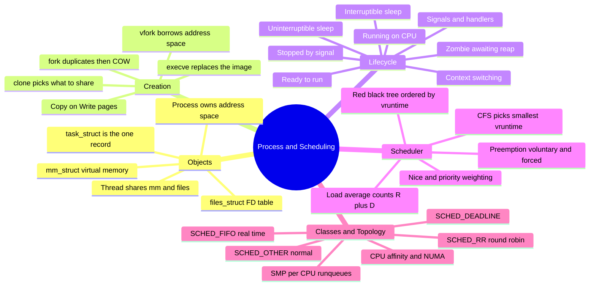
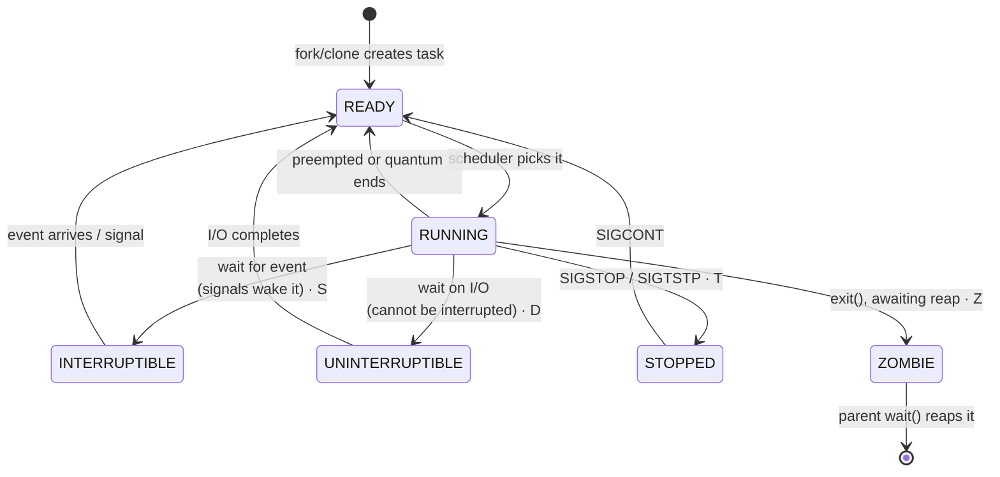
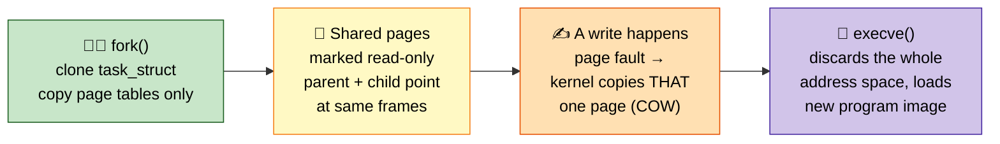
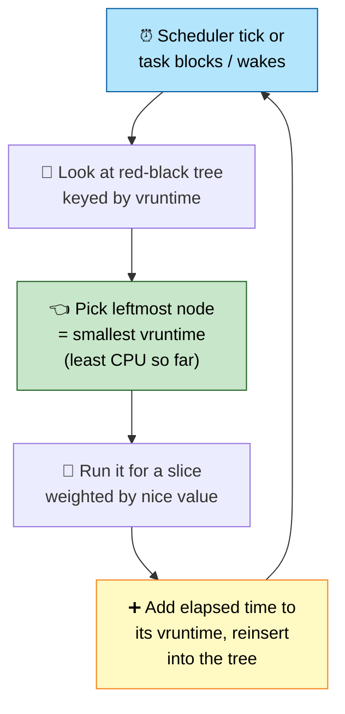

# Section 2: Process Management & Scheduling

This section covers how Linux represents, creates, schedules, and terminates processes and threads —
the kernel data structures and algorithms behind `fork()`, the Completely Fair Scheduler, signals, and
everything you need to reason about CPU-bound performance and "why is this process stuck" incidents.

## Subtopic Index
- [Processes vs Threads](#processes-vs-threads)
- [`task_struct` internals](#task_struct-internals)
- [Process Creation: fork(), vfork(), clone(), execve()](#process-creation-fork-vfork-clone-execve)
- [Copy-on-Write (COW)](#copy-on-write-cow)
- [Process States and State Transitions](#process-states-and-state-transitions)
- [Zombie and Orphan Processes](#zombie-and-orphan-processes)
- [Process Termination and Reaping (wait/waitpid)](#process-termination-and-reaping-waitwaitpid)
- [Process Groups and Sessions](#process-groups-and-sessions)
- [Signals and Signal Handling](#signals-and-signal-handling)
- [Signal Masking and Pending Signals](#signal-masking-and-pending-signals)
- [Context Switching](#context-switching)
- [Linux CPU Scheduler (CFS)](#linux-cpu-scheduler-cfs)
- [Scheduling Classes (SCHED_OTHER, SCHED_FIFO, SCHED_RR, SCHED_DEADLINE)](#scheduling-classes-sched_other-sched_fifo-sched_rr-sched_deadline)
- [Nice Values and Priorities](#nice-values-and-priorities)
- [Load Average vs CPU Utilization](#load-average-vs-cpu-utilization)
- [Preemption (voluntary/involuntary)](#preemption-voluntaryinvoluntary)
- [SMP and Multi-core Scheduling](#smp-and-multi-core-scheduling)
- [CPU Affinity and NUMA-aware Scheduling](#cpu-affinity-and-numa-aware-scheduling)
- [Real-Time Scheduling](#real-time-scheduling)

---

## 🗺️ Visual Overview

**Mind map — the whole section at a glance** (skim this first, revisit it last):



**Process state machine — the six letters `ps` shows you** (learn every arrow):



**fork → COW → exec — why a heavy process forks cheaply** (highest-value creation diagram):



**CFS pick loop — the scheduler's one core rule** (always run the most-starved task):



> 🧠 **Memory hooks (mnemonics):**
> - **Process states `R S D T Z`:** *"Really Sleepy Dogs Take Zzz"* → **R**unning, **S**leep-interruptible, **D**isk-sleep-uninterruptible, **T**-stopped, **Z**ombie. The scary one is **D** (uninterruptible) — stuck on I/O, `kill -9` won't touch it.
> - **CFS in four words:** *"Always pick smallest vruntime."* Fairness = whoever has run *least* runs *next*; nice value just changes how fast your vruntime clock ticks.
> - **fork vs exec:** *"fork makes a twin, exec becomes a stranger."* fork = one process → two identical; exec = same PID, brand-new program.
> - **Load average vs CPU%:** load average counts tasks in **R + D** (want-to-run *and* stuck-on-I/O), so load can be high while CPU% is low — that's an **I/O** wait, not a CPU shortage.
> - **Real-time beats normal:** *"FIFO and RR always cut the line."* `SCHED_FIFO`/`SCHED_RR` (classes 1–99) preempt every `SCHED_OTHER` task, no matter how nice.

---

## Processes vs Threads

> 🎯 **Interview weight: High** — the "a thread is just a `task_struct` sharing an `mm_struct`" insight unlocks half of this whole section.

**In one line:** On Linux a process and a thread are the *same* kernel object (**`task_struct`**); "thread" just means one created with `clone()` flags that share memory, file descriptors, and signal handlers instead of copying them.

**The textbook distinction:**

| | Process | Thread |
|---|---|---|
| Owns | Virtual address space, FD table, signal handlers, security context (UID/GID, caps) | Only a private stack, register set, and thread-local state (TLS) |
| Shares with siblings | Nothing (isolated) | Everything above except its private bits |
| Isolation | MMU enforces separate page tables per `mm_struct` | None — shares fate inside one address space |

**The kernel reality:** there is no first-class "process" object distinct from a "thread" object. Both are a **`task_struct`**. What userspace calls a thread is simply a `task_struct` created via `clone()` with flags telling the kernel to *share* the parent's:

- memory descriptor (`mm_struct`)
- file descriptor table (`files_struct`)
- signal handlers

This is why `ps -eLf` and `top -H` show individual threads as separate schedulable entities with their own kernel-assigned thread ID (the `LWP` column, or `gettid()`), while `getpid()` still returns the shared, group-level PID that all threads of one process report.

> 🧠 **Mental model:** glibc's pthreads is built entirely on `clone()` with the right flags (`CLONE_VM|CLONE_FS|CLONE_FILES|CLONE_SIGHAND|...`). There is **no separate "thread scheduler"** — CFS treats every `task_struct` as an independently schedulable unit, whether or not it shares an address space. That's why CPU-bound multi-threaded programs scale near-linearly across cores: each thread genuinely runs on a separate core via real hardware parallelism, not cooperative userspace switching.

> 💡 **Interview tip:** The distinction to hold onto — threads are cheap to create and communicate through shared memory with no syscall overhead, but they **share fate**: one thread's stray write can corrupt another thread's data (no memory protection between them). A bug in one *process* can't directly corrupt another's memory because the MMU enforces separate page tables per `mm_struct`.

### Key commands
```
ps -eLf                      # list threads (LWP column) alongside process PID
top -H -p <pid>               # per-thread CPU usage within one process
cat /proc/<pid>/status | grep Threads    # thread count for a process
ls /proc/<pid>/task/          # one directory per thread, each with its own stack/stat info
```

## `task_struct` internals

> 🎯 **Interview weight: High** — being able to name the key fields and what they point at is a strong "I actually know the kernel" signal.

**In one line:** **`task_struct`** (in `include/linux/sched.h`) is the kernel's single, complete bookkeeping record for every schedulable entity — one instance per process *and* per thread.

**The key fields worth knowing cold:**

| Field | Holds | Why it matters |
|-------|-------|----------------|
| `pid` / `tgid` | Kernel-internal thread ID / userspace "thread group ID" | `getpid()` returns `tgid`; threads share `tgid` but each has a unique `pid` — the real mechanism behind processes-vs-threads |
| `state` / `__state` | Current scheduling state | running, interruptible sleep, uninterruptible sleep, stopped, zombie |
| `mm` | Pointer to `mm_struct` (virtual address space) | Shared between threads of one process, unique per process |
| `files` | Pointer to `files_struct` (open FD table) | Shared or private depending on clone flags |
| `sched_entity` / `sched_class` | Scheduler bookkeeping | `vruntime` + which scheduling class governs this task |
| `signal` / `sighand` | Pending signals, blocked mask, handlers | Signal delivery state |
| `cred` | Real/effective/saved UID+GID, capability sets | Consulted on every permission check |
| `real_parent` / `parent` / `children` / `sibling` | Process-hierarchy links | Drive reparenting on exit and `wait()` semantics |
| `cgroups` | This task's cgroup membership across hierarchies | How cgroup limits/accounting get enforced per task at schedule/charge time |

**How the kernel finds tasks:**

- All `task_struct`s are linked into a circular doubly-linked list (the "task list") — this is what `ps`/`/proc` enumeration walks.
- They're additionally indexed by PID in a radix tree (`pid_hash`) for O(1)-ish lookup during syscalls like `kill()`.

> 🧠 **Mental model:** `task_struct` is the *single* unifying representation for both processes and threads. That one fact explains why `/proc/<pid>/task/<tid>/` exists for every thread, each with its own `stat`/`status`/`stack` — because each thread genuinely *is* a distinct `task_struct` with distinct scheduling and signal-delivery state.

### Key commands
```
cat /proc/<pid>/status         # human-readable dump of key task_struct-derived fields
cat /proc/<pid>/stat            # raw scheduling stats (state, priority, utime, stime, etc.)
cat /proc/<pid>/sched            # scheduler-specific fields (vruntime, nr_switches, etc.)
crash> struct task_struct <addr> # (crash utility, kernel debugging) dump the actual struct from a core/live kernel
```

## Process Creation: fork(), vfork(), clone(), execve()

> 🎯 **Interview weight: High** — the fork/exec idiom and the `clone()` flag model are foundational and come up constantly.

**In one line:** `fork()`, `vfork()`, and pthreads are all thin wrappers over one general syscall, **`clone()`**, which chooses what to share vs copy; `execve()` is separate — it *replaces* a process image rather than creating one.

**The four primitives:**

| Call | What it does | Sharing model |
|------|--------------|---------------|
| `fork()` | Duplicate the caller into a near-identical child (differs only in PID, PPID, return value) | Copies nothing explicitly — full duplication, then **COW** |
| `vfork()` | Suspend parent, child borrows parent's address space directly | Shares everything; child must only `execve()`/`_exit()` immediately — largely obsolete |
| `clone()` | The real syscall under both — explicit flag bitmask picks what to share | Caller chooses precisely (see flags below) |
| `execve()` | Replace the current process image with a new program | Not creation at all — same PID, new program |

**`fork()` in detail:** creates a new `task_struct` that's an almost-exact duplicate — same code, data, open FDs, signal handlers — with execution resuming *twice* (returns `0` in the child, the child's PID in the parent). It historically copied the whole address space physically; modern Linux implements it via `clone()` with copy-on-write, so cost is proportional to page-table entries, not memory content.

**`vfork()`:** a pre-COW optimization — no copying, not even page tables — under the strict contract that the child only calls `execve()` or `_exit()`. Violating it corrupts the parent, so it's essentially obsolete now that COW `fork()` is cheap (still seen in latency-critical old code or busybox-style shells).

**`clone()` flags** — the knobs that build everything:

| Flag | Effect |
|------|--------|
| `CLONE_VM` | Share the address space instead of copying it |
| `CLONE_FILES` | Share the file descriptor table |
| `CLONE_FS` | Share filesystem info (cwd, umask) |
| `CLONE_SIGHAND` | Share signal handler tables |
| `CLONE_NEWPID` / `CLONE_NEWNET` / ... | Namespace isolation used by container runtimes |

- **pthreads** passes nearly every "share" flag.
- **`fork()`** passes none (full duplication, then COW).
- **Container runtimes** pass namespace flags to build isolated execution contexts.

> 🧠 **Mental model:** `execve()` doesn't create a process — it *replaces* the caller's entire program image (code, data, stack, heap) with a new one loaded from disk, preserving PID, open FDs (unless `close-on-exec`), and process group/session. The classic "fork, then exec" idiom is exactly this: `fork()` cheaply gets a new PID/`task_struct`, then the child immediately `execve()`s the target program — at which point the COW pages inherited from the parent are simply discarded.

### Key commands
        fork()                          execve()
Parent ────────► Child (COW copy of      Child ────────► Child now runs a
   task_struct     parent's task_struct,   task_struct     completely different
   PID=100         same code/data via       PID=101         program image loaded
                   shared, marked           (same PID,      from disk; old code/
                   read-only pages)         PPID unchanged) data/heap discarded
```

### Key commands
```
strace -f -e trace=clone,fork,vfork,execve <cmd>   # observe exact syscalls used for a given program
cat /proc/<pid>/status | grep -E 'Threads|State'    # sanity check process vs thread relationships
ltrace -f <cmd>                                     # library-call level trace (glibc wrappers)
```

## Copy-on-Write (COW)

> 🎯 **Interview weight: High** — the canonical "why is `fork()` cheap?" question; also underpins shared libraries and `mmap`.

**In one line:** **COW** makes `fork()` cheap by duplicating only page tables and marking pages read-only — the actual page copy is deferred until (and only for) the pages a process actually writes.

**What happens on `fork()`:**

- Duplicate only the parent's **page tables**, not the physical pages.
- Mark every mapped page in *both* parent and child as read-only.
- Increment a reference count on each physical page frame — both processes now point at the *same* physical pages.

**What happens on the first write (the COW fault):**

1. The write to a read-only shared page triggers a page fault.
2. The fault handler recognizes it as a COW fault (via the page's refcount and a VMA flag marking it as *should-be* writable).
3. It allocates a brand-new physical page and copies the original contents into it.
4. It updates *only the faulting process's* page-table entry to point at the new private page (now writable).
5. It decrements the refcount on the original shared page — the other process's mapping is untouched and keeps sharing.

**Why this is so cheap:**

- Cost of `fork()` ≈ number of page-table entries to duplicate (further reduced by huge pages shrinking table size), **not** the size of the address space's *content*.
- Cost of later writes is deferred and paid only for pages actually modified.
- The common `fork()`-then-`execve()` pattern barely touches any inherited pages before discarding them — making COW's deferred copy essentially free there.

> 🔍 **Under the hood:** COW is the same mechanism behind `mmap(MAP_PRIVATE)` file mappings — multiple processes mapping a file read-only share physical pages until one writes, then that one gets a private copy. It's exactly how shared-library code pages (`.so` files) are mapped identically and *once* across every process using them, while each process's writable data segment stays private.

### Key commands
```
cat /proc/<pid>/smaps | grep -A2 Private   # distinguish private vs shared page counts per mapping
perf stat -e page-faults ./program          # count total page faults, including COW faults, for a workload
cat /proc/vmstat | grep -i cow              # (kernel version dependent) COW-related fault counters
```

## Process States and State Transitions

> 🎯 **Interview weight: High** — the `R`/`S`/`D`/`T`/`Z` states (especially `D`) drive real production incidents.

**In one line:** Every `task_struct` carries a scheduling state, and the scheduler plus various wakeup mechanisms drive transitions between them.

**The states:**

| State | Name | Meaning |
|-------|------|---------|
| `R` | TASK_RUNNING | Executing on a CPU *or* on the run queue ready to run — `ps`/`top` don't distinguish the two |
| `S` | TASK_INTERRUPTIBLE | Sleeping on an event (I/O, mutex, timer, socket data), **can** be woken early by a signal — the overwhelmingly common state |
| `D` | TASK_UNINTERRUPTIBLE | Sleeping on I/O where interrupting is unsafe — **cannot** be killed even with `SIGKILL` while it persists |
| `T` / `t` | TASK_STOPPED / TASK_TRACED | Suspended by `SIGSTOP`/`SIGTSTP`, or traced by a debugger via `ptrace()` |
| `Z` | EXIT_ZOMBIE | Terminated, resources released, but `task_struct` kept to hold exit status until the parent `wait()`s |

> ⚠️ **Gotcha:** `D` state is the single biggest source of "why won't this die?" incidents. A task in uninterruptible sleep (typically block-device or NFS I/O) can't be `kill -9`'d, and it **inflates load average** even while the CPU sits completely idle. Long-lived `D`-state processes are the classic symptom of a failing disk, an overloaded storage backend, or a hung NFS mount.

**What drives the transitions:**

- The scheduler moves tasks across the R ↔ runnable/running boundary.
- Wakeup functions (called from interrupt handlers or other processes) move S/D → R when the awaited event occurs — e.g., a disk interrupt handler calling `wake_up()` on tasks blocked on that I/O.
- Signal delivery and `wait()` reaping handle the T/Z transitions.

```
                     scheduled off CPU (voluntary or involuntary)
        ┌────────────────────────────────────────────┐
        ▼                                              │
   ┌─────────┐   blocks on I/O/lock/signal wait   ┌────┴────┐
   │ RUNNING │ ───────────────────────────────────▶│ S or D  │
   │ (R)     │◀─────────────────────────────────── │ sleeping│
   └─────────┘   event occurs, task woken up        └─────────┘
        │                                                │
        │ SIGSTOP                    process exits ──────┘
        ▼                                    │
   ┌─────────┐                                ▼
   │ STOPPED │                          ┌───────────┐   parent calls wait()
   │ (T)     │                          │  ZOMBIE   │──────────────────────▶ task_struct freed
   └─────────┘                          │  (Z)      │
```

### Key commands
```
ps -eo pid,stat,comm            # STAT column shows current state (R/S/D/T/Z + modifiers like <,N,s,l,+)
ps -eo pid,stat,comm | grep ' D' # find all uninterruptible-sleep processes — classic I/O-stall symptom
cat /proc/<pid>/stat | awk '{print $3}'   # raw state character for one process
watch -n1 'ps -eo stat= | sort | uniq -c'  # live histogram of all process states on the system
```

## Zombie and Orphan Processes

> 🎯 **Interview weight: Medium** — zombie/orphan mechanics and the subreaper concept are common container-era questions.

**In one line:** A **zombie** is a dead process still holding a slot for its exit status until the parent `wait()`s; an **orphan** is a still-*running* process whose parent died and which gets reparented to the nearest subreaper.

**Zombies:**

- A process that called `exit()` (or was killed) but whose exit status hasn't been collected via `wait()`/`waitpid()`.
- The kernel keeps a minimal `task_struct` — no memory, no FDs, just PID, exit status, and resource-usage accounting — so the parent can always learn how the child exited.
- A few zombies are harmless (tiny kernel memory each). The failure mode is a parent that spawns thousands of children and never reaps them — eventually exhausting the PID space or hitting process-count `ulimit`s.
- Zombies **cannot** be killed with `SIGKILL` (they aren't running anything). The real fix is fixing or killing the *parent*, which triggers reparenting.

**Orphans:**

- A still-running process whose original parent died before it did.
- On Linux, orphans are reparented **not necessarily to PID 1** (old UNIX folklore) but to the nearest "subreaper" ancestor — by default `init` (PID 1, systemd).
- A process can mark itself a subreaper via `prctl(PR_SET_CHILD_SUBREAPER)` so orphaned grandchildren reparent to *it* instead of escaping to PID 1. Container runtimes and process supervisors use this to own reaping of their descendants.

> 🧠 **Mental model:** Reparenting is why a zombie's parent dying doesn't strand it forever — once reparented (to init or a subreaper), the new parent is expected to periodically `wait()` on its children and clear out any zombies handed to it.

### Key commands
```
ps -eo pid,ppid,stat,comm | grep 'Z'      # find zombie processes (STAT shows Z)
ps -o pid,ppid,stat,comm -p <ppid>         # inspect a suspected buggy parent not reaping children
pstree -p <ppid>                           # visualize the process tree to spot orphans/zombies
kill -0 <ppid>                             # check if the parent of a zombie is even still alive
```

## Process Termination and Reaping (wait/waitpid)

> 🎯 **Interview weight: Medium** — the `SIGCHLD` + `waitpid(WNOHANG)` loop is the root of most container/supervisor zombie bugs.

**In one line:** On exit the kernel tears down almost everything but deliberately keeps the `task_struct` in zombie state until the parent retrieves the exit status via `wait()`/`waitpid()`.

**What `do_exit()` releases:**

- Closes all open FDs (decrementing refcounts, actually closing underlying resources if unshared).
- Tears down VM mappings and decrements the `mm_struct` reference (freed only once every sharing thread has exited).
- Detaches from IPC/semaphore resources.
- Reparents any still-living children to the nearest subreaper.
- **Does NOT** free the `task_struct` itself — held as a zombie to preserve exit status (`WIFEXITED`/`WEXITSTATUS`, or `WIFSIGNALED`/`WTERMSIG`).

**Retrieving the status:**

| Call | Behavior |
|------|----------|
| `wait()` | Blocks until *any* child changes state; returns that child's PID and status |
| `waitpid(pid, &status, options)` | Wait on a specific child; supports `WNOHANG` (non-blocking poll), `WUNTRACED`/`WCONTINUED` (also notified on stop/continue) |

Once `wait()`/`waitpid()` retrieves the status, the kernel finally frees the `task_struct` entirely.

> ⚠️ **Gotcha:** A well-behaved supervisor (systemd, a shell, a container PID 1) **must** register a `SIGCHLD` handler (or use `waitid()`/`signalfd`) and call `waitpid(..., WNOHANG)` **in a loop** — because multiple children can exit in a tight window and standard signals are *not queued*. Missing this loop is the single most common cause of zombie accumulation in custom supervisors or minimal container `ENTRYPOINT` scripts. This is exactly the bug that `tini`/`dumb-init` exist to fix when running a container without a full init system as PID 1.

### Key commands
```
strace -f -e trace=wait4,waitid <cmd>    # observe reaping behavior of a supervisor process live
ps -eo pid,ppid,stat,comm | grep defunct  # "defunct" is what some ps output calls zombies
echo $?                                    # shell builtin: last foreground command's exit status
```

## Process Groups and Sessions

> 🎯 **Interview weight: Medium** — explains job control, `Ctrl-C`, `nohup`, and why daemons call `setsid()`.

**In one line:** Process groups and sessions are how the kernel organizes related processes so signals (especially from terminal keys) and terminal ownership can be managed collectively.

**The hierarchy:**

| Level | ID | Typical membership | Purpose |
|-------|----|--------------------|---------|
| Process group | PGID | All processes in one shell pipeline (`cmd1 \| cmd2 \| cmd3`) | Send one signal to the whole pipeline (`Ctrl-C` → `SIGINT` to the entire foreground group) |
| Session | SID | One or more process groups, created via `setsid()` at login | Associated with at most one controlling terminal |

**Foreground vs background:**

- Within a session, exactly one process group is the *foreground* group for the controlling terminal (tracked via `tcsetpgrp()`/`tcgetpgrp()`).
- Only the foreground group receives terminal-generated signals like `SIGINT` (Ctrl-C) or `SIGTSTP` (Ctrl-Z).
- Background groups keep running unaffected by keystrokes — this *is* the mechanism behind shell job control (`bg`, `fg`, `&`).

> 🔍 **Under the hood:** When the controlling terminal closes or disconnects (e.g., an SSH drop), the kernel sends `SIGHUP` to the session's foreground group — the traditional reason background jobs die on terminal close. You protect against it with:
> - `nohup` — simply ignores `SIGHUP`
> - `disown` / `setsid` — detaches the job into a new session with no controlling terminal to lose
>
> This is also why `systemd`-managed daemons and properly-daemonized services call `setsid()` early: with no controlling terminal at all, they're immune to this entire signal class.

### Key commands
```
ps -eo pid,ppid,pgid,sid,tty,comm    # see PGID/SID/controlling-tty relationships for every process
setsid command &                     # start a command detached in a brand-new session
nohup command &                      # ignore SIGHUP so command survives terminal disconnect
disown %1                            # detach an already-backgrounded job from the shell's job table
```

## Signals and Signal Handling

> 🎯 **Interview weight: High** — signal semantics, async-signal-safety, and the `SIGTERM`→`SIGKILL` escalation are constant interview and on-call material.

**In one line:** A signal is an asynchronous software notification delivered to a process; each has a default disposition a process can usually override — except `SIGKILL` and `SIGSTOP`, which can never be caught, blocked, or ignored.

**What triggers signals:** Ctrl-C (`SIGINT`), divide-by-zero / bad pointer (`SIGFPE`, `SIGSEGV`), timer expiry (`SIGALRM`), child state change (`SIGCHLD`), termination requests (`SIGTERM`, `SIGKILL`).

**Default dispositions & overriding:**

- Each signal defaults to one of: terminate, terminate-and-core-dump, stop, continue, or ignore.
- A process overrides most via `sigaction()` (modern, POSIX-standard). The older `signal()` has portability quirks around disposition reset and is discouraged in new code.
- **`SIGKILL` (9)** and **`SIGSTOP` (19)** are special-cased and uncatchable — a deliberate guarantee that there's always a way to unconditionally terminate or pause any process, no matter how broken its handler code.

> 🔍 **Under the hood:** When a signal is delivered to a process running in userspace, the kernel interrupts it (immediately if running, or on next schedule), saves the user-mode register state, and jumps to the handler (usually on the same stack). When the handler returns, a `sigreturn()` trampoline restores the saved registers so the interrupted code resumes exactly where it left off. This is why handlers must call only **async-signal-safe** functions (a POSIX subset excluding most of `stdio` and `malloc`) — the handler can interrupt *any* point, including mid-non-reentrant-call.

**Multi-threaded delivery:** a signal goes to exactly one thread (kernel-chosen, though a thread can request/block specific signals via `pthread_sigmask`), except truly process-directed signals targeting the whole thread group.

> 💡 **Interview tip:** Distinguish the termination signals by *intent*:
>
> | Signal | Intent | Catchable? |
> |--------|--------|-----------|
> | `SIGTERM` | Request graceful shutdown (flush state, clean up) | Yes |
> | `SIGKILL` | Unconditional immediate kill, used after `SIGTERM` times out | No |
> | `SIGHUP` | Historically "terminal disconnected"; by convention repurposed as "reload config" | Yes |
>
> The `SIGTERM`-then-`SIGKILL`-after-timeout escalation is exactly how `systemctl stop` and Kubernetes pod termination work.

### Key commands
```
kill -l                          # list all signal names/numbers
kill -TERM <pid>                  # request graceful termination
kill -KILL <pid>                  # unconditional, uncatchable termination
kill -HUP <pid>                   # commonly used to ask a daemon to reload config
trap 'echo caught' TERM           # (shell) register a handler for a signal in a script
strace -e trace=rt_sigaction,kill <cmd>   # observe a program registering handlers / sending signals
```

## Signal Masking and Pending Signals

> 🎯 **Interview weight: Medium** — blocking vs ignoring, non-queuing of standard signals, and `signalfd()` are solid "do you really know signals?" probes.

**In one line:** Each thread has a signal *mask* of blocked signals; a blocked signal isn't discarded (unlike `SIG_IGN`) — it's held **pending** and delivered once unblocked.

**Blocking vs ignoring:**

- The mask is set via `sigprocmask()` (single-threaded) or `pthread_sigmask()` (per-thread).
- *Ignoring* (`SIG_IGN`) permanently discards a signal.
- *Blocking* holds it pending — the kernel remembers it occurred (per-task pending bitmask, plus a real-time queue for `SIGRTMIN`+ signals) and delivers it when the thread unblocks it.

> ⚠️ **Gotcha:** Standard signals (1–31) are **not queued**. If `SIGCHLD` arrives three times while blocked, only one pending indication survives. That's exactly why `SIGCHLD` handlers must call `waitpid(..., WNOHANG)` *in a loop* until "no more children" rather than assuming one signal = one child exit. Real-time signals (`SIGRTMIN` and above) *do* queue multiple instances.

**Why block signals at all:** it's a standard technique for correct concurrent code — a critical section that must not be interrupted mid-update (e.g., a data structure a handler also touches) blocks the relevant signal for its duration, then unblocks it, at which point the kernel delivers any pending occurrence immediately.

> 🧠 **Mental model:** `signalfd()` is the modern, event-loop-friendly pattern: instead of an async handler (with all its async-signal-safety restrictions), you *block* the signals with `sigprocmask()` and create a file descriptor via `signalfd()` that becomes readable when one is pending — letting you handle signals **synchronously** through the same `epoll()`/`select()` loop as network I/O, avoiding the hazards of true async handlers entirely.

### Key commands
```
cat /proc/<pid>/status | grep -E 'SigPnd|SigBlk|SigIgn|SigCgt'   # pending/blocked/ignored/caught signal masks (hex bitmasks)
strace -e trace=rt_sigprocmask <cmd>     # observe a program blocking/unblocking signals live
```

## Context Switching

> 🎯 **Interview weight: High** — the *hidden* cost (cold cache/TLB, not register save) and the thread-vs-process difference are classic deep-dive questions.

**In one line:** A context switch stops one task and resumes another on the same core; its real cost is dominated not by saving registers but by the cold cache and TLB left behind after an address-space change.

**What `schedule()` (in `kernel/sched/core.c`) must do:**

1. Save the outgoing task's CPU register state (general-purpose regs, PC, stack pointer, and on x86 potentially FPU/SSE/AVX state if used) into its `task_struct`/`thread_struct`.
2. Switch the memory-management context *if* the new task has a different `mm_struct` — load a new value into the **CR3** register (x86) to point at the new page tables.
3. Restore the incoming task's saved register state.
4. Update scheduler bookkeeping (run-queue membership, statistics).

> 🔍 **Under the hood:** Loading CR3 invalidates address-space-specific TLB entries unless the CPU supports **tagged TLBs** (PCID on modern x86, ASID on ARM) to avoid a full flush. But the biggest hidden cost isn't the register save/restore (a handful of instructions) — it's the *indirect* cost of a **cold cache and TLB** after an address-space change. The incoming task's working set is likely no longer in L1/L2, so it pays a burst of cache misses re-warming its data.

That's why context-switch-heavy workloads — excessive threading, thrashing between too many runnable processes, or synchronous request/response patterns causing constant blocking/waking — show up as high **system** CPU time with lower effective throughput even though the CPU looks busy.

> 🧠 **Mental model:** A switch *between two threads of the same process* is cheaper because `CLONE_VM`-shared threads share one `mm_struct` — no CR3 reload, no address-space TLB invalidation, only register state and scheduler metadata. One more concrete reason threads beat processes for tightly-coupled concurrent work.

**Voluntary vs involuntary switches** (both counted in `/proc/<pid>/status`):

| Type | Trigger | Counter |
|------|---------|---------|
| Voluntary | Task blocks on I/O or a lock and calls `schedule()` itself | `voluntary_ctxt_switches` |
| Involuntary | Scheduler preempts a still-runnable task (slice expired or higher-priority task woke) | `nonvoluntary_ctxt_switches` |

> 💡 **Interview tip:** A high *involuntary* count relative to voluntary signals **CPU contention** — more runnable work than available cores.

### Key commands
```
cat /proc/<pid>/status | grep ctxt_switches   # voluntary vs involuntary switch counts for one process
vmstat 1                                       # 'cs' column: total context switches per second, system-wide
pidstat -w 1                                    # per-process context-switch rate over time
perf stat -e context-switches,cpu-migrations ./program   # low-level counters for a specific workload
```

## Linux CPU Scheduler (CFS)

> 🎯 **Interview weight: High** — the flagship scheduler topic; be able to explain `vruntime` + red-black tree + EEVDF from memory.

**In one line:** The **Completely Fair Scheduler** (`kernel/sched/fair.c`) approximates an idealized perfectly-fair CPU by always running the runnable task that has consumed the least weighted CPU time so far.

**The core idea:** model an ideal CPU that could give every runnable task an infinitely thin, perfectly equal slice simultaneously — then approximate it on a real, one-task-at-a-time CPU.

**How it tracks fairness — `vruntime`:**

- **`vruntime`** ("virtual runtime") tracks how much CPU time a task has *effectively* consumed, **weighted by nice/priority**.
- A lower nice value (higher priority) accrues `vruntime` *more slowly* for the same real CPU time — so it earns the right to run more often.

**How it picks the next task:**

- All runnable tasks on a CPU's run queue live in a **red-black tree keyed by `vruntime`**.
- `pick_next_task()` is essentially "run the task with the smallest `vruntime`" — the leftmost node, cached for O(1) access.
- A task that ran recently has a larger `vruntime` and sinks rightward, making room for longer-waiting tasks (smaller `vruntime`). This emergent behavior *is* the "completely fair" property — no fixed per-task time slice.

**Slice length is dynamic:** a task's "ideal" slice = a target scheduling-latency period divided proportionally among runnable tasks (more tasks → shorter slices, keeping responsiveness bounded). It's preempted early if a newly-woken task has a substantially smaller `vruntime`.

> 🔍 **Under the hood:** Since Linux 6.6, CFS is being replaced by **EEVDF** (Earliest Eligible Virtual Deadline First), a more principled fairness algorithm fixing some of CFS's latency-under-load edge cases. The `vruntime`/red-black-tree model remains the right foundation for the pre-6.6 scheduler most production kernels still run — and EEVDF questions are an increasingly common "have you kept up?" FAANG probe.

```
Run queue (per-CPU) modeled as a red-black tree keyed by vruntime:

                (task C, vruntime=120)
               /                      \
   (task A, vruntime=80)        (task E, vruntime=200)
                        \
                (task B, vruntime=95)

pick_next_task() → leftmost node → task A (smallest vruntime = least CPU consumed so far, relatively)
```

### Key commands
```
cat /proc/sys/kernel/sched_latency_ns        # target scheduling latency period (tunable)
cat /proc/<pid>/sched                         # se.vruntime, nr_switches, and other CFS internals for a task
chrt -p <pid>                                  # show current scheduling policy/priority for a process
schedtool -v -n 0 <pid>                        # (older tool) inspect/adjust scheduling parameters
```

## Scheduling Classes (SCHED_OTHER, SCHED_FIFO, SCHED_RR, SCHED_DEADLINE)

> 🎯 **Interview weight: High** — real-time classes preempting CFS, and the DoS risk of `SCHED_FIFO`, are frequent scenario questions.

**In one line:** Linux stacks pluggable "scheduling classes" checked in strict priority order, so a real-time task always preempts a normal one regardless of `vruntime`.

> 🧠 **Mental model:** Every scheduling decision the core asks the highest-priority class first: *"runnable deadline task? no → runnable FIFO/RR task? no → fall through to CFS."* It never even looks at CFS's red-black tree if a real-time class has something runnable.

**The four classes:**

| Class | Model | Notes |
|-------|-------|-------|
| `SCHED_OTHER` (`SCHED_NORMAL`) | Fair (CFS/EEVDF) | Default for the overwhelming majority of processes |
| `SCHED_FIFO` | Real-time, fixed-priority, run-to-completion | Keeps the CPU until it yields, blocks, or a higher/equal-priority RT task wakes — **no time-slicing** within a priority level |
| `SCHED_RR` | Real-time, fixed-priority, time-sliced | Same preemption model as FIFO, but same-priority tasks round-robin with a bounded quantum |
| `SCHED_DEADLINE` | EDF + Constant Bandwidth Server admission control | Declares runtime/period/deadline; kernel schedules by nearest deadline and refuses admission if guarantees become infeasible — *provable* latency bounds |

> ⚠️ **Gotcha:** A buggy infinite loop in a `SCHED_FIFO` task can starve the *entire system*, including kernel housekeeping — unless **RT throttling** (a safety-valve sysctl limiting real-time CPU share) is enabled. That's why `SCHED_FIFO`/`SCHED_RR` require `CAP_SYS_NICE` (or root): an unprivileged process with real-time priority is a straightforward DoS vector.

**Where each fits:** `SCHED_DEADLINE` suits audio/video processing or industrial control loops needing genuine deadline guarantees on general-purpose Linux; `SCHED_FIFO`/`SCHED_RR` for classic fixed-priority real-time work; `SCHED_OTHER` for everything else.

### Key commands
```
chrt -f -p 50 <pid>            # set SCHED_FIFO with priority 50 on an existing process
chrt -r -p 20 <pid>            # set SCHED_RR with priority 20
chrt -d --sched-runtime 1000000 --sched-deadline 10000000 --sched-period 10000000 0 <cmd>   # SCHED_DEADLINE
cat /proc/sys/kernel/sched_rt_runtime_us    # real-time throttling safety valve (vs sched_rt_period_us)
```

## Nice Values and Priorities

> 🎯 **Interview weight: Medium** — nice-to-weight translation and CPU-vs-I/O priority separation are common clarifiers.

**In one line:** The nice value is a `SCHED_OTHER`/CFS-only priority hint from -20 (highest) to +19 (lowest); CFS turns it into a *weight* that scales how fast `vruntime` accrues.

**The nice scale:**

- Range: **-20** (highest priority, least "nice") to **+19** (lowest priority, most "nice").
- Applies **only** within `SCHED_OTHER`/CFS — no effect on real-time classes, which use a separate 1–99 scale that always outranks any CFS task.

**How CFS uses it:**

- The nice value maps to a scheduling **weight** via `sched_prio_to_weight[]`; each nice step ≈ a 10% change in effective CPU share under contention.
- A heavier-weighted (lower nice) task's `vruntime` grows *more slowly* per unit of real CPU time — so it stays the "smallest vruntime" candidate and gets picked more often. Proportional CPU share emerges purely from this weight multiplier, no special-casing.

**Setting it & permissions:**

| Action | Command | Privilege |
|--------|---------|-----------|
| At launch | `nice` | Any user |
| On a running process | `renice` | — |
| Lowering nice (raising priority) | `renice -n -5` | Needs `CAP_SYS_NICE` (≈ root) |
| Raising your own nice (deprioritizing) | `renice -n 10` | Always allowed |

> 💡 **Interview tip:** Don't confuse nice with `ionice`. `ionice` sets **block-layer I/O** scheduling priority/class (best-effort, real-time, idle) *independently* of CPU nice — a CPU-nice-19 process can still be I/O-critical, and vice versa. They're genuinely separate resource-scheduling subsystems (CPU scheduler vs block I/O scheduler).

### Key commands
```
nice -n 10 command              # launch a command with nice value +10 (lower priority)
renice -n -5 -p <pid>            # change nice value of a running process (needs privilege to go negative)
ps -eo pid,ni,pri,comm           # NI (nice) and PRI (kernel-internal priority) columns
ionice -c2 -n7 -p <pid>          # set best-effort I/O class, lowest I/O priority level
```

## Load Average vs CPU Utilization

> 🎯 **Interview weight: High** — the "high load, idle CPU" trap is one of the most-asked Linux diagnostic questions.

**In one line:** Load average counts runnable **and** uninterruptible-I/O (`D`-state) tasks — so it is *not* CPU utilization, and can be high while CPUs sit idle.

**What load average actually is:**

- The three numbers from `uptime`/`w`/`top` are 1-, 5-, and 15-minute exponentially-damped moving averages.
- Linux defines "load" as tasks either running on a CPU **or** in a runnable/uninterruptible state waiting for a resource — crucially **including `D`-state tasks blocked on I/O**, not just CPU-bound `R`-state tasks.
- This is inherited from BSD's original definition: capture "how much demand across *any* resource," not CPU alone.

> ⚠️ **Gotcha — the classic trap:** You can see a load average of 40 on an 8-core box that looks almost entirely CPU-idle in `top`. If 40 processes are all blocked in `D` state on a slow/failing storage backend, they *all* count toward load while consuming zero CPU cycles. Correctly diagnosing it means cross-referencing `ps -eo stat` for a pile of `D`-state processes instead of assuming a CPU bottleneck.

**CPU utilization**, by contrast, is a point-in-time (or interval) measure of how busy CPUs actually are:

| Category | Meaning |
|----------|---------|
| user | Time in userspace code |
| system | Time in kernel code |
| I/O-wait (`%wa`) | CPU idle *specifically because* it's waiting on outstanding I/O — still "idle" for scheduling, but flags an I/O bottleneck |
| steal | On virtualized/cloud hosts: time the hypervisor gave to *other* tenants — CPU capacity you're billed for but not receiving |

> 💡 **Interview tip:** The mature answer to "load average is high, is the system in trouble?" is: *"It depends on **why** — CPU-bound (utilization near 100%, few D-state tasks) or I/O-bound (D-state pileup, `iostat` showing high `await`/`%util`, CPU relatively idle)? The remediation is completely different."*

### Key commands
```
uptime                          # the three load-average numbers
mpstat -P ALL 1                  # per-CPU user/system/iowait/steal breakdown over time
vmstat 1                          # 'r' (runnable) and 'b' (blocked/uninterruptible) queue length columns
ps -eo stat= | sort | uniq -c     # quick histogram distinguishing R-heavy vs D-heavy load
iostat -x 1                       # device-level %util/await to confirm an I/O-bound hypothesis
```

## Preemption (voluntary/involuntary)

> 🎯 **Interview weight: High** — voluntary vs involuntary preemption and the `CONFIG_PREEMPT_*` trade-offs are common scheduler questions.

**In one line:** Preemption is the kernel taking the CPU away from a running task — voluntarily (the task blocks and calls `schedule()` itself) or involuntarily (the timer tick forces it out).

**Voluntary preemption:**

- Happens when a task calls into the kernel in a way that can block — a blocking syscall (`read()` on an empty pipe, waiting on a mutex/futex, sleeping).
- The task calls `schedule()` on its own behalf; the scheduler picks another runnable task; the original moves off-CPU cooperatively.

**Involuntary preemption** — what gives Linux fairness despite badly-behaved or purely CPU-bound programs:

- The timer interrupt fires periodically (the scheduling "tick," historically 100–1000 Hz; `NO_HZ`/tickless configs suppress unnecessary ticks on idle/single-task cores to save power).
- On each tick, the scheduler checks whether the running task exhausted its fair-share slice, or whether a higher-priority/smaller-`vruntime` task became runnable.
- If so, it sets a "need resched" flag; at the next safe opportunity (returning from the interrupt, or the next preemption-safe point) the running task is forcibly switched out even though it never asked to yield.

**Kernel preemption is a build-time choice:**

| Config | Behavior | Best for |
|--------|----------|----------|
| `CONFIG_PREEMPT_NONE` | Preempts only at explicit kernel checkpoints | Servers optimizing raw throughput, cache locality, fewer switches |
| `CONFIG_PREEMPT_VOLUNTARY` | Adds voluntary preemption points | Desktop balance |
| `CONFIG_PREEMPT` / `PREEMPT_RT` | Even code *inside the kernel* can be preempted almost anywhere (except spinlock-held critical sections) | Low-latency / real-time workloads |

> 🧠 **Mental model:** Fully preemptible kernels (`CONFIG_PREEMPT` or the now-largely-upstreamed `PREEMPT_RT`) trade some throughput (added preemption-check overhead) for far better worst-case latency. `CONFIG_PREEMPT_NONE` trades worst-case latency for throughput and cache locality.

### Key commands
```
zcat /proc/config.gz | grep CONFIG_PREEMPT     # which preemption model this kernel was built with
cat /proc/sys/kernel/sched_latency_ns           # target latency guiding involuntary preemption decisions
cat /proc/<pid>/status | grep nonvoluntary_ctxt_switches   # count of involuntary preemptions for a task
```

## SMP and Multi-core Scheduling

> 🎯 **Interview weight: Medium** — per-CPU run queues, load balancing cost, and SMT-aware placement are solid multi-core depth questions.

**In one line:** Linux treats every core as an equal scheduling resource with a **per-CPU run queue**, then periodically load-balances tasks between cores while weighing the cache cost of migration.

**Why per-CPU run queues:** a single global queue would become a lock-contention bottleneck as core counts scale into the dozens/hundreds, so each core has its own run queue.

**Load balancing** (`load_balance()` in `kernel/sched/fair.c`):

- Runs periodically and on events; considers moving tasks from a busier CPU's queue to an idler one.
- Migration isn't free — a moved task loses its warm cache state (L1/L2, maybe L3) and must re-populate its working set on the new core.
- So the balancer weighs migration cost against imbalance severity using **scheduling domains** — Linux models cores into a hierarchy (SMT/hyperthread siblings → cores sharing L2/L3 → NUMA nodes) and prefers migrating within a "cheap" domain over an "expensive" cross-NUMA move.

**SMT / Hyper-Threading awareness:**

- Two logical CPUs on one physical core share nearly all execution resources (ALUs, cache).
- The scheduler spreads independent tasks across *different physical cores first* before doubling up onto SMT siblings — two CPU-bound tasks sharing one physical core contend and run slower than each on a whole core.

> 🔍 **Under the hood:** This SMT-aware placement is also central to security-driven **core scheduling** — grouping only mutually-trusting tasks onto SMT siblings of the same core to mitigate cross-thread side-channel attacks (L1TF/MDS).

### Key commands
```
lscpu                              # CPU topology: sockets, cores per socket, threads per core, NUMA nodes
cat /proc/schedstat                 # per-CPU scheduler statistics including migration counts
cat /sys/devices/system/cpu/cpu0/topology/thread_siblings_list   # SMT sibling mapping for one core
mpstat -P ALL 1                     # confirm actual load distribution across cores in practice
```

## CPU Affinity and NUMA-aware Scheduling

> 🎯 **Interview weight: Medium** — pinning, NUMA locality, and `numactl` vs automatic balancing come up for performance-tuning roles.

**In one line:** CPU affinity pins a task to a subset of CPUs (overriding load-balancing migration); NUMA-aware scheduling additionally keeps a task near the memory it actually uses.

**CPU affinity** (`sched_setaffinity()` / `taskset`) — used for two reasons:

- **Performance:** keeping a latency/cache-sensitive task glued to one core avoids migration-induced cache cold-start (valuable for HFT, audio, busy-polling network I/O threads).
- **Isolation:** dedicating cores to a critical workload, combined with `isolcpus`/`nohz_full` boot params that remove those cores from load balancing and periodic timer-tick housekeeping — minimizing "noisy neighbor" jitter.

**NUMA (Non-Uniform Memory Access):**

| | Local memory | Remote memory |
|---|---|---|
| Attached to | The socket running the task | A *different* socket |
| Path | Direct memory controller | Inter-socket interconnect (Intel QPI/UPI, AMD Infinity Fabric) |
| Cost | Low latency, high bandwidth | Higher latency, lower bandwidth |

**How the scheduler minimizes the penalty:**

- Models NUMA nodes as the outermost (most expensive to cross) scheduling-domain level and strongly prefers keeping a task on the same node as its memory.
- **Automatic NUMA balancing** (`numa_balancing`) periodically unmaps a task's pages, catches the resulting faults to learn which node accesses them, and migrates either the task or the memory toward locality over time.

> 💡 **Interview tip:** For workloads with a known, stable footprint (a database sized to fit one node's local memory), explicit `numactl` binding (CPU *and* memory to a node) usually beats automatic balancing's converge-over-time heuristics — especially for short-lived or bursty workloads that don't run long enough for balancing to pay off.

### Key commands
```
taskset -c 2,3 command            # restrict a command to CPUs 2 and 3
taskset -pc 4-7 <pid>               # change CPU affinity of a running process
numactl --hardware                  # show NUMA node topology and memory sizes
numactl --cpunodebind=0 --membind=0 command   # pin both CPU and memory allocation to NUMA node 0
cat /proc/<pid>/numa_maps           # per-VMA NUMA placement for a running process
```

## Real-Time Scheduling

> 🎯 **Interview weight: Medium** — "real-time = bounded, not fast", `PREEMPT_RT`, and priority inheritance are the depth markers here.

**In one line:** "Real-time" means *predictable, bounded worst-case latency* — not "fast" — and achieving it needs both real-time scheduling *and* a kernel that stays preemptible.

**Scheduling priority alone isn't enough:** the real-time classes (`SCHED_FIFO`, `SCHED_RR`, `SCHED_DEADLINE`) always outrank `SCHED_OTHER`/CFS, guaranteeing a real-time task preempts any normal task the instant it wakes. But a stock (`CONFIG_PREEMPT_NONE`/`VOLUNTARY`) kernel has long non-preemptible sections (holding a spinlock, certain interrupt/softirq handling) where even a `SCHED_FIFO` task cannot preempt — introducing unpredictable latency spikes.

> 🔍 **Under the hood:** The `PREEMPT_RT` patch set (now substantially merged upstream) fixes this by:
> - converting most spinlocks into preemptible sleeping locks,
> - running most interrupt handling in preemptible kernel threads instead of true hardware-interrupt context,
> - generally minimizing the kernel's worst-case non-preemptible windows.
>
> The result: real-time tasks get bounded scheduling *latency*, not just scheduling *priority*.

**Building a genuinely low-latency system** takes coordinated techniques beyond picking `SCHED_FIFO`:

- **CPU isolation** (`isolcpus`, `nohz_full`) — remove scheduler-tick and load-balancing interference on dedicated cores.
- **IRQ affinity tuning** (`/proc/irq/<n>/smp_affinity`) — steer hardware interrupts away from isolated cores.
- **Disable CPU frequency scaling / C-states** — avoid latency spikes when a core wakes from deep sleep.
- **Lock memory pages** (`mlockall()`) — prevent page faults from touching swapped-out/not-yet-faulted pages mid-critical-section.
- **Priority inheritance on mutexes** — a low-priority task holding a lock a high-priority task needs is temporarily boosted to the waiter's priority, preventing **priority inversion** (an unrelated medium-priority task preempting the lock holder and indirectly blocking the high-priority waiter).

> 💡 **Interview tip:** The deep answer names the *full picture* — priority **and** bounded kernel-internal latency **and** controlled interrupt/frequency behavior — not the surface-level "just use `SCHED_FIFO`."

### Key commands
```
uname -v                              # check whether this is a PREEMPT_RT-patched kernel
chrt -f -p 80 <pid>                    # assign SCHED_FIFO priority 80 to a latency-critical process
cyclictest -p 80 -n -m -l 100000       # standard real-time latency measurement/benchmark tool
cat /proc/irq/<n>/smp_affinity_list    # confirm/adjust which CPUs handle a given hardware interrupt
```

---

### Interview Questions

**Conceptual/Internals (8)**

1. **What is the actual kernel-level relationship between a "process" and a "thread"?**
   Both are represented by the identical `task_struct` structure; there is no separate kernel object
   for "thread" versus "process." A thread is simply a `task_struct` created via `clone()` with flags
   telling the kernel to share the parent's `mm_struct` (address space), file descriptor table, and
   signal handlers rather than duplicating them, while all threads of one process share the same
   `tgid` (thread group ID) that `getpid()` reports, even though each has a distinct kernel-internal
   `pid`.

2. **Explain copy-on-write and why it makes `fork()` cheap.**
   `fork()` duplicates only page tables, marking every page read-only and shared between parent and
   child with an incremented reference count, rather than physically copying memory content. A write
   by either process triggers a page fault that allocates a new private physical page, copies the
   content, and remaps only the faulting process's page table entry — deferring (and often entirely
   avoiding, e.g. before an immediate `execve()`) the cost of copying memory that's never actually
   modified.

3. **What is the difference between an S-state and a D-state sleeping process, and why does the
   distinction matter operationally?**
   `S` (interruptible sleep) can be woken early by signal delivery; `D` (uninterruptible sleep) cannot
   be interrupted by a signal — including `SIGKILL` — while it persists, because the kernel considers
   it unsafe to abandon that wait (typically active block-device or NFS I/O). Long-lived `D`-state
   processes are the classic symptom of failing storage or an unresponsive NFS server, and they cannot
   be killed until the underlying I/O either completes or times out.

4. **How does the CFS scheduler decide which task to run next?**
   Every runnable task's `vruntime` (virtual runtime, weighted by nice value/priority) is tracked in a
   per-CPU red-black tree keyed by that value; the scheduler picks the leftmost node — the task with
   the smallest vruntime, meaning it has received proportionally the least CPU time so far — giving an
   emergent "fair" distribution of CPU time without a fixed round-robin schedule.

5. **Why can load average be high while CPUs show mostly idle in `top`?**
   Linux load average counts not just CPU-runnable tasks but also tasks in uninterruptible (`D`) sleep
   waiting on I/O. A pile of processes blocked on a slow disk or hung NFS mount inflates load average
   substantially while consuming essentially zero CPU cycles, which is why load average must always be
   cross-referenced with process state and I/O metrics, not treated as a pure CPU-pressure indicator.

6. **What's the difference between voluntary and involuntary preemption?**
   Voluntary preemption occurs when a task itself calls into the kernel in a way that blocks (a
   syscall that sleeps, waiting on a lock) and calls `schedule()` cooperatively. Involuntary preemption
   is forced by the kernel's timer tick noticing the running task has exhausted its fair-share slice
   or that a more deserving task has become runnable, switching the task out even though it never
   asked to yield the CPU.

7. **Why can't `SIGKILL` and `SIGSTOP` be caught, blocked, or ignored?**
   This is a deliberate kernel design guarantee ensuring there is always an unconditional way to
   terminate or pause any process regardless of how broken, hostile, or buggy its own signal-handling
   code is — without this guarantee, a process could make itself permanently unkillable by installing
   a handler that ignores every termination request.

8. **What happens to a zombie process's parent dying before the parent calls `wait()`?**
   The zombie is reparented to the nearest ancestor marked as a subreaper (via
   `PR_SET_CHILD_SUBREAPER`), or to PID 1/systemd by default if no closer subreaper exists; the new
   parent is then responsible for eventually calling `wait()`/`waitpid()` to collect the zombie's exit
   status and allow the kernel to free its remaining `task_struct`.

**Scenario/Troubleshooting (6)**

9. **A process is stuck in `D` state and `kill -9` does nothing. How do you actually resolve this?**
   You generally cannot force-kill a genuinely uninterruptible-sleep process; you must find and fix the
   underlying I/O stall — check `iostat -x` for a saturated/failing block device, check whether an NFS
   mount is hung (`nfsstat`, checking server reachability), and in the worst case the process only
   clears once the I/O subsystem itself recovers, times out, or (for NFS) the mount is force-unmounted
   with `umount -f`/hard vs soft mount options reconsidered for the future.

10. **A monitoring script notices hundreds of zombie processes accumulating under one long-running
    parent daemon. How do you diagnose and fix it?**
    Confirm with `ps -eo pid,ppid,stat,comm | grep Z` that the zombies share one PPID; the parent
    daemon has a bug where it forks children but never calls `wait()`/`waitpid()` (or doesn't handle
    `SIGCHLD` correctly, missing exits when several arrive close together since standard signals don't
    queue). Short-term, restarting the parent reparents its zombies to init/a subreaper which reaps
    them; the real fix is adding a proper `SIGCHLD` handler doing `waitpid(..., WNOHANG)` in a loop, or
    switching the daemon to run under a real init/supervisor (`tini`, systemd) that handles reaping.

11. **A container's `ENTRYPOINT` runs a shell script that spawns a background process, and that
    process becomes a zombie/orphan mess as the container churns. Why, and what's the standard fix?**
    A shell script used as PID 1 inside a container doesn't have proper signal-forwarding or child-
    reaping behavior — it isn't a real init system. The standard fix is running a minimal init like
    `tini` or `dumb-init` as PID 1 (or using the container runtime's built-in equivalent, e.g. Docker's
    `--init` flag), which correctly reaps zombies and forwards signals to the actual application
    process.

12. **CPU utilization looks low, but a latency-sensitive application still exhibits periodic
    millisecond-scale stalls. What scheduling-related causes would you investigate?**
    Check for involuntary context switches and CPU migrations (`/proc/<pid>/status`,
    `perf stat -e context-switches,cpu-migrations`) possibly caused by other processes/interrupts
    landing on the same cores; check NUMA locality (`numa_maps`) for cross-node memory access latency;
    check for CPU frequency scaling/C-state transitions adding wake-up latency; and consider whether
    the process needs explicit CPU pinning (`taskset`) or isolated cores (`isolcpus`) to eliminate
    scheduler-induced jitter.

13. **A newly-launched batch job unexpectedly starves an important interactive service on the same
    host of CPU. What do you check and how do you fix it?**
    Check the batch job's scheduling class/nice value (`ps -eo pid,cls,ni,comm`) — if it was
    mistakenly launched with an elevated real-time class (`SCHED_FIFO`/`SCHED_RR`) it will always
    preempt normal `SCHED_OTHER` tasks regardless of nice value. The fix is either correcting the
    scheduling class back to `SCHED_OTHER` with an appropriately high (deprioritizing) nice value via
    `renice`, or explicitly reserving/pinning cores for the interactive service using `taskset`/
    `isolcpus` so it's insulated from batch workload contention entirely.

14. **A multi-threaded application shows far worse throughput on a 2-socket NUMA server than a
    single-socket server with fewer total cores. What's the likely explanation and remediation?**
    Threads and the memory they access are likely spread across both NUMA nodes without locality
    awareness, causing frequent remote-memory accesses across the slower inter-socket interconnect.
    Remediation is binding the process (or per-thread, if the workload partitions data) to a single
    NUMA node with `numactl --cpunodebind --membind` when the working set fits in one node's memory, or
    redesigning the application to be NUMA-aware (partitioning data structures per node) if it must
    span multiple nodes.

**FAANG-level Deep Dive (6)**

15. **Explain exactly how CFS computes a task's vruntime accrual rate from its nice value, and why
    this produces proportional CPU sharing without any explicit "give task X 20% of the CPU" logic.**
    CFS looks up a scheduling weight from a fixed table (`sched_prio_to_weight[]`) based on nice value,
    where each nice-value step corresponds to roughly a 10/11 or 11/10 multiplicative weight change.
    vruntime advances as `actual_runtime * (NICE_0_WEIGHT / task_weight)` — a heavier-weighted (lower
    nice) task's vruntime grows more slowly per unit of real CPU time consumed, so it stays the
    "smallest vruntime" (leftmost in the red-black tree) more often and gets picked to run more
    frequently; the proportional CPU share emerges purely from this weighting interacting with the
    "always run smallest vruntime" selection rule, with no explicit percentage-based logic anywhere.

16. **Why does EEVDF (replacing CFS as of Linux 6.6) address a genuine CFS shortcoming, and what's
    the core algorithmic difference?**
    CFS's "run smallest vruntime" rule can let a task that has been waiting build up a very negative
    relative vruntime advantage and then get an unfairly long run before yielding, or conversely can
    make it hard to reason about worst-case latency guarantees for latency-sensitive tasks under heavy
    load, since CFS's fairness is only asymptotically achieved, not deadline-bounded per task. EEVDF
    (Earliest Eligible Virtual Deadline First) assigns each task an explicit virtual deadline derived
    from its weight/slice request and schedules by nearest deadline among *eligible* tasks (those whose
    fair share entitlement has caught up to real time), giving more direct, tunable control over
    latency versus throughput trade-offs per task than CFS's purely emergent vruntime-ordering
    behavior.

17. **Why does a context switch between two threads of the same process cost meaningfully less than a
    switch between two unrelated processes?**
    Threads of the same process share the same `mm_struct`, meaning the CR3 register (pointing at the
    active page table) does not need to be reloaded and the CPU's tagged-TLB entries (PCID on x86)
    remain valid, avoiding the address-space-transition costs entirely. Only the register set and
    scheduler bookkeeping need saving/restoring, whereas a cross-process switch additionally pays for a
    potential TLB/cache-locality disruption from the address-space change, which is the dominant hidden
    cost in most real-world context-switch overhead measurements.

18. **Describe priority inversion and how Linux's real-time subsystem prevents it.**
    Priority inversion occurs when a low-priority task holds a lock that a high-priority task needs,
    and an unrelated medium-priority task preempts the low-priority lock holder (since it outranks it),
    indirectly blocking the high-priority task far longer than the lock's actual critical section
    should require. Linux addresses this with priority-inheritance mutexes (`pthread_mutex` with the
    `PTHREAD_PRIO_INHERIT` protocol, and the kernel's own `rt_mutex` used internally): while a
    high-priority task waits on a lock, the current holder's effective priority is temporarily boosted
    to match, preventing medium-priority tasks from preempting it during the critical section, then
    reverting the boost once the lock is released.

19. **Why does `PREEMPT_RT` require converting most kernel spinlocks into sleeping locks, and what
    trade-off does that impose?**
    A traditional spinlock busy-waits with preemption disabled, which is fine for genuinely
    microsecond-scale critical sections but becomes a source of unbounded worst-case latency for any
    real-time task trying to preempt in when a lower-priority task (or interrupt context) is holding
    one during a longer operation. `PREEMPT_RT` converts most spinlocks (except a small, carefully
    audited set that must remain true spinlocks, like those protecting the scheduler's own core
    run-queue data) into priority-inheriting sleeping mutexes, letting a waiting high-priority task be
    correctly preempted-in via priority inheritance instead of busy-waiting — at the cost of somewhat
    higher average-case overhead and code complexity versus the simpler traditional spinlock model.

20. **Why does automatic NUMA balancing sometimes perform worse than doing nothing for short-lived,
    bursty workloads, and when should you disable it in favor of explicit `numactl` placement?**
    Automatic NUMA balancing works by periodically unmapping pages, deliberately taking page faults to
    observe access patterns, and migrating pages/tasks toward better locality over multiple sampling
    intervals — a process that converges toward good locality this way needs to run long enough to
    amortize the cost of those induced faults and migrations. A short-lived or highly bursty workload
    may finish before convergence completes, paying the full cost of induced faults and migration
    overhead while gaining little to none of the locality benefit, which is why database and HPC
    workloads with well-understood, stable memory footprints typically disable automatic balancing
    (`numa_balancing=0`) and instead pin CPU and memory explicitly and permanently via `numactl` at
    launch time.

### Hands-On Labs

**Lab 1: Observe fork/exec and COW behavior directly**
- Objective: Confirm copy-on-write behavior empirically rather than just conceptually.
- Setup: Any Linux machine with `strace` and a compiler.
- Tasks: Write a small C program that allocates and touches a large buffer, then `fork()`s; in the
  child, modify a few pages of the buffer and sleep; observe `/proc/<child_pid>/smaps` for private vs
  shared page counts before and after the modification; trace with `strace -f` to see the `clone`
  syscall.
- Expected outcome: You can show shared page counts dropping and private/dirty page counts rising
  specifically for the pages the child modified, not the whole buffer.

**Lab 2: Reproduce and diagnose zombie accumulation**
- Objective: Build a deliberately buggy parent that doesn't reap children, then fix it.
- Setup: Any Linux shell/compiler access.
- Tasks: Write a parent program that forks 20 short-lived children and never calls `wait()`; observe
  zombies accumulating with `ps -eo pid,ppid,stat,comm`; add a proper `SIGCHLD` handler calling
  `waitpid(..., WNOHANG)` in a loop and confirm zombies no longer accumulate.
- Expected outcome: A before/after comparison demonstrating the exact fix for zombie leaks.

**Lab 3: Scheduling class and priority experiment**
- Objective: Observe real-time scheduling classes preempting CFS in practice.
- Setup: A disposable VM (real-time priority changes can affect system responsiveness).
- Tasks: Launch several CPU-bound `SCHED_OTHER` loops; launch one additional CPU-bound loop under
  `chrt -f 50`; observe via `top`/`pidstat` that the `SCHED_FIFO` task dominates CPU time versus the
  normal tasks despite equal nice values.
- Expected outcome: Measured, explained CPU-share difference attributable purely to scheduling class.

**Lab 4: Load average vs CPU utilization divergence**
- Objective: Reproduce the classic "high load, idle CPU" scenario safely.
- Setup: A disposable VM with a slow/throttled block device (e.g., a loopback device with `dm-delay`,
  or simply many concurrent `dd` reads from a slow disk).
- Tasks: Launch many processes performing blocking reads against an artificially slow device; observe
  `uptime` load average climbing while `mpstat`/`top` shows CPUs mostly idle; confirm the processes are
  in `D` state with `ps -eo stat`.
- Expected outcome: A concrete demonstration and written explanation of why load average and CPU
  utilization diverge.

**Lab 5: NUMA-aware placement benchmark**
- Objective: Measure the real performance impact of NUMA locality.
- Setup: A multi-socket NUMA machine or NUMA-emulating VM (`qemu -numa node,...`).
- Tasks: Run a memory-bandwidth benchmark (e.g., `stress-ng --vm`) once with no placement control, once
  pinned to a single NUMA node's CPU and memory via `numactl --cpunodebind --membind`, and once
  deliberately cross-bound (CPU on node 0, memory on node 1); compare throughput/latency.
- Expected outcome: Quantified evidence of local vs remote NUMA access performance difference.

### Production Incidents

**Incident 1: Fleet-wide "load average" false alarm during a storage backend degradation**
- Symptom: Automated alerting pages on-call for dozens of hosts reporting load average above 100,
  suggesting massive CPU exhaustion, but application response times are only mildly degraded.
- Investigation: `mpstat` on affected hosts shows CPUs largely idle; `ps -eo stat` shows hundreds of
  application worker processes stuck in `D` state; `iostat -x` reveals a shared network storage backend
  with `await` times spiking into the seconds.
- Root cause: A backend storage array was degraded (a failed drive triggering RAID rebuild I/O
  contention), causing application I/O to queue and workers to block in uninterruptible sleep, which
  inflated load average without corresponding CPU exhaustion.
- Recovery: Engaged storage team to address the degraded array; in the interim, reduced application
  worker concurrency to lower outstanding I/O queue depth against the struggling backend.
- Prevention: Split alerting into separate CPU-utilization and I/O-wait/D-state-count signals instead
  of alerting on raw load average alone, and add storage-layer health metrics to the same dashboard so
  responders see the real bottleneck immediately instead of chasing a CPU red herring.

**Incident 2: A misconfigured deployment tool escalated to real-time priority and froze a production
node**
- Symptom: A production Kubernetes node becomes completely unresponsive over SSH and to its kubelet
  health checks, requiring a hard reboot; no obvious OOM or disk-full condition in the initial triage.
- Investigation: Post-reboot log analysis (`journalctl` from before the freeze) shows a batch data-
  processing job's container was launched with an unintended `--cap-add=SYS_NICE` and application code
  that called `sched_setscheduler(SCHED_FIFO, 99)` on itself, intended for a different, isolated
  benchmarking environment.
- Root cause: A `SCHED_FIFO` priority-99, run-to-completion task with a tight busy-loop bug ran without
  ever yielding, monopolizing a CPU core indefinitely and — because the kernel's real-time throttling
  safety valve had been disabled system-wide for an unrelated latency-tuning experiment — starved even
  kernel housekeeping threads on that core, hanging the whole node.
- Recovery: Hard reboot was required since the node was unresponsive to any control-plane input;
  post-recovery, the offending container's capability grant was removed.
- Prevention: Restrict `CAP_SYS_NICE`/real-time scheduling grants to explicitly approved, isolated
  workloads only, re-enable real-time throttling (`sched_rt_runtime_us`) fleet-wide as a hard safety
  net, and add a node-level watchdog alert specifically for unexpected `SCHED_FIFO`/`SCHED_RR` task
  creation outside approved namespaces.

**Incident 3: NUMA imbalance silently doubled p99 latency after a database host was resized**
- Symptom: After migrating a database to larger, dual-socket instances (more total cores/memory
  expected to improve performance), p99 query latency instead got measurably worse.
- Investigation: `numastat` showed a heavily skewed remote-memory-access ratio; the database process
  had been started without any NUMA-aware configuration and its memory allocations, plus its worker
  threads, were scattered across both sockets by the default scheduler/allocator behavior, with a large
  fraction of memory accesses crossing the inter-socket interconnect.
- Root cause: The database's connection-handling threads were spawned without CPU affinity and the
  buffer pool was allocated before automatic NUMA balancing had converged, freezing in a
  poor-locality state that balancing alone couldn't fully correct under continuous load.
- Recovery: Restarted the database bound to a single NUMA node via `numactl` (sized to fit the working
  set within that node's local memory), immediately restoring and improving on the original single-
  socket latency baseline.
- Prevention: Standardized the database deployment runbook to always explicitly set NUMA CPU/memory
  binding on multi-socket hosts rather than relying on default placement or automatic balancing
  convergence, and added `numastat` remote-access-ratio monitoring to the standard host dashboard.
