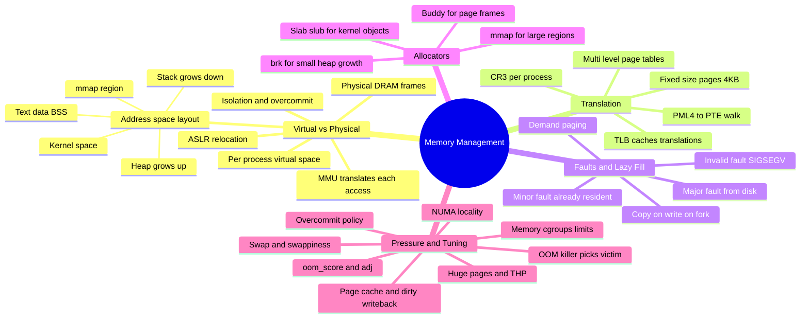
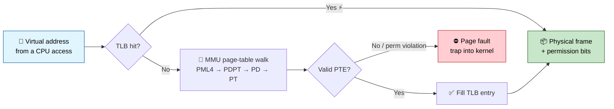
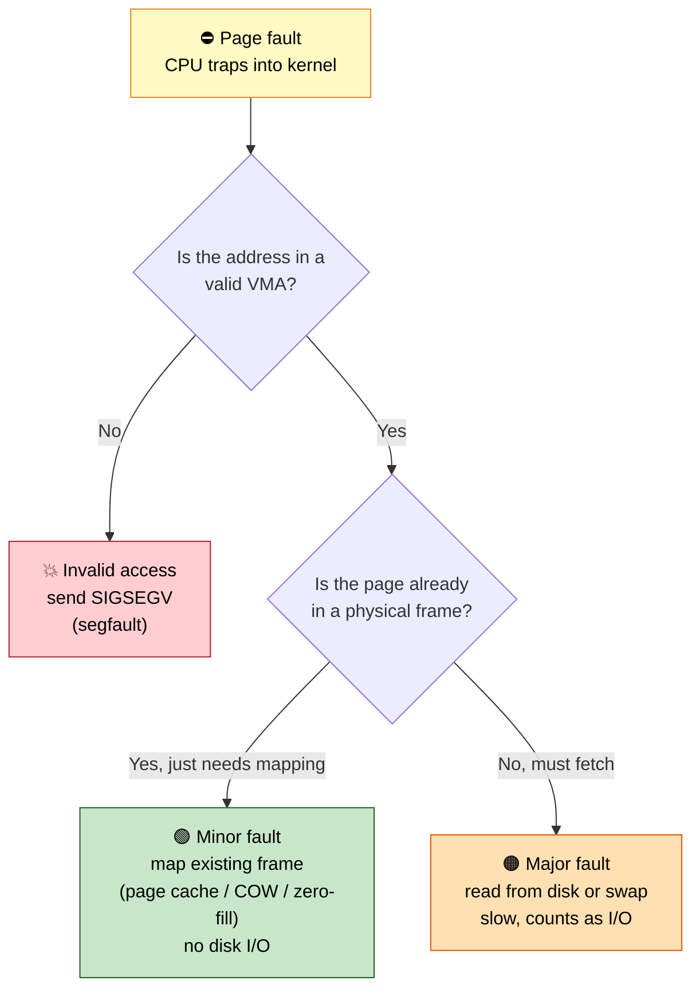
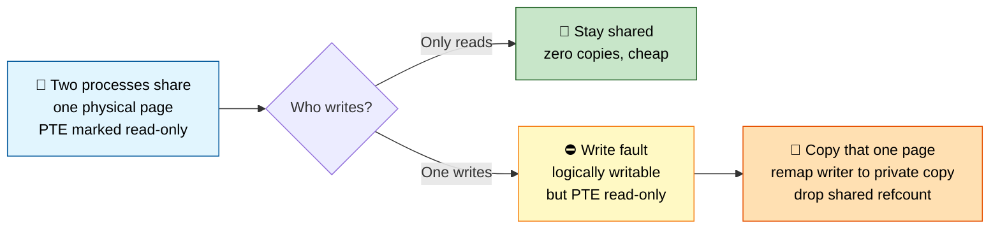
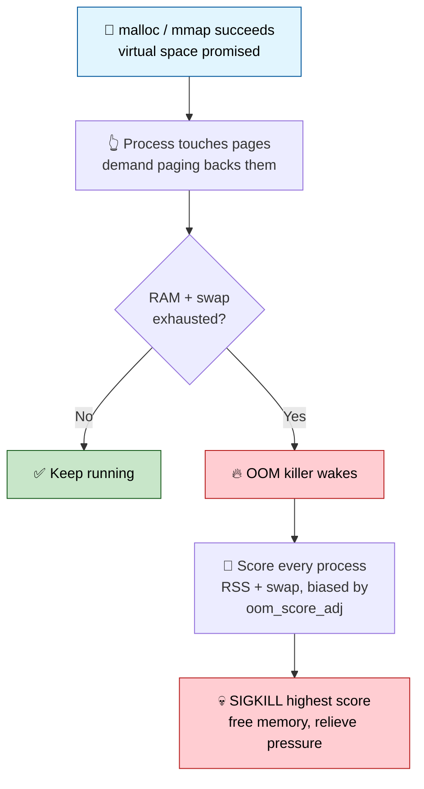

# Section 3: Memory Management

This section covers how Linux manages physical and virtual memory — address space layout, paging,
allocators, the page cache, swap, NUMA, and the OOM killer — the material behind nearly every "why is
memory usage high" or "why did the OOM killer fire" production incident.

## Subtopic Index
- [Physical vs Virtual Memory](#physical-vs-virtual-memory)
- [Virtual Address Space Layout (text, data, heap, stack, mmap region)](#virtual-address-space-layout-text-data-heap-stack-mmap-region)
- [Paging and Page Tables](#paging-and-page-tables)
- [Multi-level Page Tables and TLB](#multi-level-page-tables-and-tlb)
- [Page Fault Handling (minor/major faults)](#page-fault-handling-minormajor-faults)
- [Demand Paging](#demand-paging)
- [Copy-on-Write Pages](#copy-on-write-pages)
- [Buddy Allocator](#buddy-allocator)
- [Slab/Slub/Slob Allocators](#slabslubslob-allocators)
- [Kernel vs User Memory](#kernel-vs-user-memory)
- [mmap() Internals](#mmap-internals)
- [brk() vs mmap() for heap growth](#brk-vs-mmap-for-heap-growth)
- [Memory Overcommit and OOM Killer](#memory-overcommit-and-oom-killer)
- [OOM Score and oom_score_adj](#oom-score-and-oom_score_adj)
- [Swap Space and Swappiness](#swap-space-and-swappiness)
- [Huge Pages (Transparent Huge Pages)](#huge-pages-transparent-huge-pages)
- [Page Cache and Buffer Cache](#page-cache-and-buffer-cache)
- [Dirty Page Writeback](#dirty-page-writeback)
- [NUMA Architecture](#numa-architecture)
- [Memory Cgroups and Limits](#memory-cgroups-and-limits)

---

## 🗺️ Visual Overview

**Mind map — the whole section at a glance** (skim this first, revisit it last):



**Address translation — how one virtual access finds physical DRAM** (highest-value diagram in the section):



**Page fault handling — the three outcomes that matter** (minor vs major vs invalid):



> 🧠 **Memory hooks (mnemonics):**
> - **Minor vs Major fault:** *"Minor = Memory, Major = Media"* → minor faults are satisfied from **RAM** (no I/O); major faults hit **disk/swap** (real I/O). If minor: fast; if major: your latency graph spikes.
> - **Page-table walk depth:** *"Please Program Data Pages"* → **PML4 → PDPT → PD → PT** (4 levels on x86_64, `CR3` points at the top).
> - **Swappiness scale:** *"0 = hoard RAM, 100 = happy to swap."* Low swappiness keeps anonymous pages in RAM; high swappiness pushes them to swap sooner.
> - **OOM score direction:** *"Higher score = first to die."* `oom_score_adj` from **-1000 (immortal)** to **+1000 (kill me first)** — nudge critical daemons negative.
> - **Heap growth split:** *"Small brks, big maps"* → small heap growth uses `brk()`; large allocations go straight to `mmap()`.
> - **Buddy vs Slab:** *"Buddy hands out **pages**, Slab hands out **objects**."* Buddy = power-of-two page frames; slab carves those into fixed-size kernel structs.

---

## Physical vs Virtual Memory

> 🎯 **Interview weight: High** — the foundation every other memory topic builds on.

**In one line:** Every process sees a private, huge, contiguous virtual address space that the MMU translates — page by page, on every access — into the real physical DRAM frames the kernel lazily assigns.

**Physical memory** is the actual DRAM installed in the machine, addressed by physical frame numbers the memory controller understands directly. **Virtual memory** is an abstraction the kernel presents to every process: each process believes it owns a private, contiguous, enormous address space (2^48 or 2^57 bytes on modern x86_64, depending on paging mode), when in reality that space is a sparse set of mappings.

Every memory access is translated into physical frames by the **MMU** (Memory Management Unit), which consults per-process **page tables**. This indirection is what makes three things possible:

- **Isolation** — process A cannot address process B's memory because A's page tables simply have no translation for it. There's no bounds check to bypass; the address literally doesn't resolve to anything in A's context.
- **Overcommitment** — the kernel can promise more virtual address space than physical RAM exists, backing pages with real frames lazily, only when touched.
- **Relocation transparency** — a process's code/data can live at different physical addresses on every run (including deliberately randomized via **ASLR**) without the process's instructions changing, since they only ever reference virtual addresses.

> 🧠 **Mental model:** Virtual addresses are "promises"; physical frames are "reality." The page tables are the ledger mapping promises to reality, and the **TLB** is a fast cache of recent ledger lookups.

The translation happens via hardware page tables, cached in the TLB for performance. Every memory access a CPU core issues passes through this translation invisibly. The kernel's job is to construct and maintain the page tables so translations point at correct, appropriately-protected physical frames — and to handle a **page fault** whenever a virtual address has no valid translation yet or the access violates the entry's permission bits.

### Key commands
```
cat /proc/meminfo              # system-wide physical memory breakdown
free -h                         # human-readable physical + swap summary
cat /proc/<pid>/maps             # this process's virtual address space layout
pmap -x <pid>                    # per-mapping resident/dirty memory for a process
```

## Virtual Address Space Layout (text, data, heap, stack, mmap region)

> 🎯 **Interview weight: High** — you should be able to draw this layout from memory.

**In one line:** A process's address space is a stack of well-defined regions — code at the bottom, stack at the top, heap growing up and stack growing down toward each other — each described by a kernel VMA.

Each region is backed by a **Virtual Memory Area** (`vm_area_struct`, "VMA") describing its permissions and backing source. From low addresses to high:

- **Text segment** — the executable's compiled machine code, mapped read-only and executable directly from the binary on disk, shared read-only across every process running that same binary.
- **Data segment** — initialized global/static variables, mapped read-write (copy-on-write from the binary's data section).
- **BSS segment** — zero-initialized globals, backed by anonymous zero-fill-on-demand pages, not any file content.
- **Heap** — grows *upward* via `brk()`/`sbrk()` (or increasingly `mmap()` for larger allocations) as `malloc()` requests more memory.
- **mmap region** — a large middle region holding shared libraries (`.so` files), anonymous `mmap()` allocations, and explicit file mappings. **ASLR** randomizes its base address, so library addresses differ between runs and processes — a deliberate security mitigation against attacks relying on predictable code addresses.
- **Stack** — grows *downward* from a high address, holding call frames, locals, and return addresses, with a guard region below it that faults (rather than silently corrupting the heap) if the stack grows too large.
- **Kernel space** — beyond user-space entirely; on x86_64 the upper half of the range is reserved for kernel mappings, shared identically across every process's page tables (with protection bits blocking user access).

> 🔍 **Under the hood:** That shared kernel region is exactly what **Meltdown**-style attacks exploited, before **KPTI** (Kernel Page Table Isolation) largely unmapped kernel addresses from user-mode page tables entirely as a mitigation.

```
High addr  ┌───────────────────────┐
           │   Kernel space         │  (shared across all processes, protected from user-mode access)
           ├───────────────────────┤
           │   Stack (grows down)   │  ← function frames, locals, return addrs
           │        ...              │
           │   mmap region           │  ← shared libs, anonymous mmap, file mappings (ASLR-randomized)
           │        ...              │
           │   Heap (grows up)       │  ← malloc()'d memory via brk()/mmap()
           ├───────────────────────┤
           │   BSS (zero-fill)       │  ← uninitialized globals
           │   Data (initialized)    │  ← initialized globals/statics
           │   Text (code, r-x)      │  ← compiled program code, shared read-only
Low addr   └───────────────────────┘
```

### Key commands
```
cat /proc/<pid>/maps            # every VMA: address range, perms, backing file/anon, offset
cat /proc/<pid>/smaps            # per-VMA detail: RSS, PSS, Shared/Private Clean/Dirty
pmap -X <pid>                     # extended per-mapping memory accounting, human-friendly
readelf -l <binary>                # program headers showing how segments are laid out in the ELF file
```

## Paging and Page Tables

> 🎯 **Interview weight: High** — page-table walks and multi-level structure are classic deep-dive material.

**In one line:** Memory is divided into fixed-size pages, and a per-process multi-level page table (walked by the MMU) maps each virtual page to a physical frame plus permission bits.

**Paging** divides both virtual and physical address space into fixed-size chunks called **pages** (4KB is by far the most common on x86_64, with optional larger huge pages covered later). A **page table** is the per-process structure the kernel maintains and the hardware MMU walks to translate a virtual page number into a physical frame number, plus permission bits.

Each page table entry carries permission bits:

- Readable
- Writable
- Executable
- User/supervisor
- Cacheable

Rather than a flat array (enormous and mostly empty for a sparse address space), x86_64 uses a **multi-level, radix-tree-like** structure. A virtual address is split into fields that index successive levels:

| Level | Name | Notes |
|-------|------|-------|
| Top | **PML4** | One per process, pointed to by the `CR3` register |
| 3rd | **PDPT** | Page Directory Pointer Table |
| 2nd | **PD** | Page Directory |
| Leaf | **PT** | Holds the physical frame number for a 4KB page |

For **huge pages**, the walk terminates early at a higher level to directly map a larger contiguous region.

> 🔍 **Under the hood:** On each access the MMU performs a **page table walk** — reads `CR3` to find PML4, indexes in to find PDPT's address, repeats for PD and PT, then reads the physical frame number plus permissions from the PT entry. That's **four sequential memory reads for a single 4KB translation** — prohibitively slow for every access without the **TLB** caching recent translations (see below).

Every process has its own independent set of tables for user-space addresses — which is what provides isolation, since A's tables simply have no valid entries pointing at B's frames. The kernel-space portion is typically shared/kept synchronized across every process's tables, since kernel code and data must be reachable identically regardless of which process is running when a syscall or interrupt occurs.

### Key commands
```
cat /proc/<pid>/status | grep VmPTE     # kernel memory consumed by this process's own page tables
cat /proc/meminfo | grep -i pagetables   # system-wide page-table memory overhead
x86info / cpuid                          # inspect CPU paging mode support (PAE, 4/5-level paging)
```

## Multi-level Page Tables and TLB

> 🎯 **Interview weight: High** — TLB behavior underpins huge pages, context-switch cost, and Meltdown mitigations.

**In one line:** The TLB is a tiny per-core cache of recent virtual→physical translations that saves the CPU from doing a full page-table walk on every memory access.

The **Translation Lookaside Buffer** is a small, extremely fast, per-core hardware cache of recent translations. It exists specifically to avoid paying a full multi-level walk on every access — without it, every load/store would incur the equivalent of four dependent memory reads just to resolve the address.

- **TLB hit** — resolves a translation in effectively zero extra cycles.
- **TLB miss** — forces the hardware page-table walker (or, on some older/RISC architectures, a software-handled trap) to perform the full walk, then caches the result for next time.

Because the TLB is small (tens to a few thousand entries), it holds only a limited number of hot translations. Large, sparse, or randomly-accessed working sets suffer **TLB thrashing** — constant misses as translations are evicted before reuse — a real bottleneck for large in-memory databases or poor-locality workloads. This is precisely the problem **huge pages** solve: each TLB entry covers far more memory (2MB or 1GB instead of 4KB), multiplying the effective reach of the same fixed number of entries.

> 🔍 **Under the hood:** Modern CPUs tag TLB entries per address-space via **PCID** (Process-Context Identifiers, x86) or **ASID** (ARM), letting multiple processes' translations stay resident simultaneously without a full flush on every context switch.

> ⚠️ **Gotcha:** Before PCID existed (or when disabled, as historically required by some Meltdown mitigations), every context switch flushed the *entire* TLB — forcing every memory access after a switch to pay full page-walk cost until the new process's translations repopulated. That's a substantial, measurable overhead on context-switch-heavy workloads.

### Key commands
```
perf stat -e dTLB-load-misses,iTLB-load-misses ./program   # measure TLB miss rates for a workload
cat /proc/cpuinfo | grep pcid                                # confirm PCID hardware support
perf record -e dTLB-load-misses ./program && perf report      # attribute TLB misses to code locations
```

## Page Fault Handling (minor/major faults)

> 🎯 **Interview weight: High** — the minor-vs-major distinction is a near-guaranteed question.

**In one line:** A page fault is a CPU exception the kernel deliberately relies on to lazily fill in memory — minor faults resolve in RAM, major faults require disk I/O and cost orders of magnitude more.

A **page fault** is a CPU exception raised by the MMU whenever a memory access can't be completed by the current page-table state — either no valid translation exists, or the access violates the entry's permission bits (writing a read-only page, executing a non-executable page). Far from always being an error, faults are a core, expected mechanism for lazy memory management.

| | Minor (soft) fault | Major (hard) fault |
|---|---|---|
| Trigger | Address is mapped but has no PTE yet, or the page is already resident (page-cache hit, COW page) | Needed data isn't in RAM at all |
| Disk I/O | None | Yes — reads from a block device |
| Cost | Fast; just updates page tables/refcounts | Orders of magnitude slower |
| Process state | Stays runnable | Blocks in `D`/uninterruptible sleep until I/O completes |
| Examples | Shared file page already cached, COW mapping setup | Uncached mmap'd file page, swapped-out anonymous page |

Minor faults are resolved by the kernel's fault handler (`handle_mm_fault()` → architecture-specific fault entry → `do_fault()`/`do_wp_page()`/etc.), often without ever touching a block device. Major faults involve issuing real I/O, making them a direct, measurable contributor to application-perceived latency.

> 🔍 **Under the hood — the full fault path:**
> 1. The CPU traps into the kernel with the faulting address (`CR2` on x86) and an error code describing the access type.
> 2. The kernel looks up which **VMA** (if any) covers that address.
> 3. If none covers it → genuine invalid access → the process receives `SIGSEGV`.
> 4. If a VMA covers it → the kernel picks the correct resolution (allocate and zero a new anonymous page, fetch a file-backed page from the page cache or issue I/O, perform a copy-on-write duplication, or swap in a page), updates the PTE, and returns.
> 5. The faulting instruction re-executes and now succeeds transparently — the program has no idea a fault occurred.

### Key commands
```
ps -o min_flt,maj_flt -p <pid>       # cumulative minor/major fault counts for a process
/usr/bin/time -v ./program            # major/minor page faults reported for a full run
perf stat -e minor-faults,major-faults ./program   # live fault-rate measurement
strace -e trace=%memory <cmd>          # observe mmap/brk/page-fault-adjacent syscalls
```

## Demand Paging

> 🎯 **Interview weight: High** — explains fast program startup, cheap `mmap()`, and why overcommit works.

**In one line:** Never load a page into RAM until the instant it's actually accessed — everything else stays as cheap VMA bookkeeping.

**Demand paging** is the strategy of never loading a page into physical memory until the very moment it's accessed, rather than eagerly loading an entire program or file up front.

When a process `execve()`s a new binary, the kernel does **not** read the whole executable into memory. It maps the binary's segments as file-backed VMAs and returns almost instantly; only the pages the program actually touches get faulted in on demand, one page at a time, as minor or major faults. This is exactly why:

- Large programs start quickly despite large on-disk size — rarely-executed error paths may never fault in at all.
- The first access to a code/data page is measurably slower than later ones (paying the major-fault cost once, then benefiting from residency and TLB caching).

The same principle applies to `mmap()`ed files generally: mapping a multi-gigabyte file is near-instantaneous because it only establishes VMA bookkeeping, not actual I/O — pages are pulled in lazily exactly as the program reads/writes specific offsets.

> 🧠 **Mental model:** `mmap()` sets up an IOU for memory; the page fault is when the IOU is actually cashed.

Demand paging interacts directly with **memory overcommit**: because pages are backed by physical frames only when touched, the kernel can let a process map far more virtual space than physical RAM exists, betting that not every mapped page is touched simultaneously. That optimism is what overcommit policy (below) governs — and it's what makes the **OOM killer** necessary as a last resort when the bet is wrong and every promised page really is in active use at once.

### Key commands
```
cat /proc/<pid>/smaps_rollup           # total RSS/PSS across all mappings — how much is actually resident
strace -e trace=mmap ./program          # confirm mmap returns quickly regardless of mapped file size
```

## Copy-on-Write Pages

> 🎯 **Interview weight: Medium** — commonly paired with `fork()` questions.

**In one line:** Share physical pages read-only and defer the expensive copy until someone actually writes — then copy just that one page on the resulting fault.

> 📎 **Note:** See Section 2's Copy-on-Write entry for the `fork()`-centric explanation; this entry focuses on COW as a general memory-management mechanism beyond process creation.

**Copy-on-write** is a general pattern applied anywhere the kernel can defer an expensive duplication until it's provably necessary:

- `fork()`'s address-space duplication
- `MAP_PRIVATE` file mappings — multiple processes mapping the same file read-only share physical pages until one writes, at which point only that process gets a private copy
- Some `mmap(MAP_ANONYMOUS)` patterns interacting with `madvise()` hints

The mechanism is always the same: mark the shared page's PTE **read-only** regardless of the mapping's logical writability. Any write traps into the page-fault handler, which recognizes the specific "VMA is logically writable but the PTE is read-only for COW reasons" combination (distinct from a genuine permission violation, which delivers `SIGSEGV`), then:

1. Allocates a new physical page.
2. Copies the original content.
3. Remaps only the faulting process's translation to the new private page.
4. Decrements the shared page's reference count.



> ⚠️ **Gotcha:** COW cuts both ways. Read-heavy shared memory is extremely cheap (visible as high `Shared` byte counts in `/proc/<pid>/smaps`), but a workload that heavily *writes* a large COW-shared region right after `fork()` (common in pre-fork servers that fork *and* immediately mutate big shared structures) pays a burst of copy costs concentrated right after the fork — which can look like a mysterious latency spike immediately following process creation if you don't attribute it to COW resolution.

### Key commands
```
cat /proc/<pid>/smaps | grep -E 'Shared_Clean|Shared_Dirty|Private_Clean|Private_Dirty'   # COW-relevant breakdown
perf record -e page-faults -g ./program && perf report   # attribute COW fault bursts to specific call sites
```

## Buddy Allocator

> 🎯 **Interview weight: Medium** — the canonical answer to "how does the kernel fight external fragmentation?"

**In one line:** The kernel's low-level physical-page allocator hands out power-of-two-sized contiguous page blocks, splitting larger blocks on allocation and coalescing "buddies" on free to keep memory consolidated.

The **buddy allocator** satisfies requests for contiguous runs of physical page frames (`alloc_pages()`). Its defining property is efficient **splitting and coalescing** to combat external fragmentation.

Free memory is tracked in per-zone free lists organized by **order**:

| Order | Block size | Pages |
|-------|-----------|-------|
| 0 | 4KB | 1 |
| 1 | 8KB | 2 |
| 2 | 16KB | 4 |
| … | … | … |
| 10 (typical max) | 4MB | 1024 |

Each order's free list holds only blocks of exactly that size, naturally aligned to their own size boundary.

**Allocation (splitting):** when an order-N request arrives and none is free at that order, the allocator looks at order N+1. If a block is available there, it splits it in half — one half satisfies the request (or is split further if still too large), the other half (the "buddy") goes onto the order-N free list — recursing from higher orders as needed.

**Freeing (coalescing):** when a block is freed, the allocator computes its buddy's address (a simple **XOR** of the block's address with its size, since buddies are always adjacent, size-aligned pairs) and checks whether that buddy is also free. If so, the two merge back into a single block at the next-higher order, recursing upward as long as buddies keep turning out free — actively consolidating free memory into larger contiguous blocks.

> ⚠️ **Gotcha:** The buddy allocator can only hand out power-of-two-sized, physically contiguous blocks. That's perfect for page-sized-and-larger allocations (page cache, huge pages, DMA buffers) but wasteful and slow for the countless small, sub-page kernel object allocations (a few hundred bytes for an inode, a `task_struct`, a packet buffer) — exactly the gap the **slab/slub** allocator, built on top of the buddy allocator, fills.

### Key commands
```
cat /proc/buddyinfo                # free block counts per order, per zone, per NUMA node
cat /proc/pagetypeinfo               # fragmentation detail by migrate type (movable/unmovable/reclaimable)
cat /proc/zoneinfo                   # detailed per-zone memory statistics
```

## Slab/Slub/Slob Allocators

> 🎯 **Interview weight: Medium** — plus a frequent "where did my memory go?" troubleshooting angle.

**In one line:** Sitting on top of the buddy allocator, the slab allocator carves whole pages into pools of same-sized, ready-to-use kernel objects so tiny frequent allocations are near-free.

The **slab allocator** exists to efficiently serve the kernel's enormous volume of small, fixed-size, frequently allocated/freed object types — `task_struct`s, `inode`s, socket buffers, dentries — where going through the buddy allocator's page granularity for every object would waste memory (internal fragmentation) and burn CPU cycles re-initializing complex structures every time.

Instead, the slab allocator:

1. Requests whole pages from the buddy allocator in bulk ("slabs").
2. Carves each slab into an array of same-sized object slots matching a specific **`kmem_cache`** (one cache per object type/size class — hundreds are visible in `/proc/slabinfo`).
3. Maintains free lists of ready-to-use slots, so allocating a `task_struct` is typically just popping a pre-sized, often pre-initialized (constructor callback run once at slab creation, not per-allocation) slot off a free list — dramatically cheaper than a raw buddy allocation plus manual init.

The three implementations:

| Allocator | Meaning | Status |
|-----------|---------|--------|
| **SLAB** | The original queued allocator | Legacy |
| **SLUB** | "The unqueued slab allocator" — simpler, more cache-friendly, removes per-CPU queueing layers and cache-line contention | **Default in modern kernels** |
| **SLOB** | "Simple List Of Blocks" — minimal bookkeeping for severely memory-constrained embedded systems | Rare; virtually no production server uses it |

> 💡 **Interview tip:** If asked to name all three historically-available slab implementations, SLAB/SLUB/SLOB is the answer — but note SLUB is the modern default and SLOB is embedded-only.

> ⚠️ **Gotcha:** Slab memory is directly visible and often a surprisingly large fraction of "used" memory. Heavy filesystem metadata activity (many cached inodes/dentries) can consume gigabytes of reclaimable slab memory that shows up separately from both application RSS and the page cache — a frequent source of "where did my memory go?" confusion when only reading `free -h`'s top-level numbers.

### Key commands
```
cat /proc/slabinfo | sort -k3 -n -r | head    # largest slab caches by total memory consumed
slabtop                                        # live, top-like view of slab cache usage
cat /proc/meminfo | grep -i slab                # total reclaimable + unreclaimable slab memory
```

## Kernel vs User Memory

> 🎯 **Interview weight: Medium** — the Meltdown/KPTI security angle makes it a popular deep-dive.

**In one line:** Every address space is split into user-accessible regions and a kernel-only region mapped into every process (for fast syscalls) but protected from user-mode access — the exact design Meltdown attacked.

Every process's virtual address space splits between:

- A **user-accessible region** — the process's own code, data, heap, stack, and mmap'd regions, subject to normal permission checks.
- A **kernel-only region** — mapped identically (same physical backing) into *every* process's page tables, but protected so user-mode code cannot read, write, or execute it.

That shared kernel mapping exists so a syscall or interrupt doesn't require switching to a separate address space just to run kernel code — avoiding a full TLB flush on every syscall entry/exit. On classic x86_64 Linux, the split reserved the upper portion of the 48-bit canonical range for the kernel, leaving the lower portion for user-space.

> 🔍 **Under the hood — Meltdown & KPTI:** That shared-mapping design is exactly what **Meltdown** exploited — a malicious user process used speculative execution to transiently read kernel memory that was mapped (for performance) into its own page tables, since some CPUs didn't enforce the permission check before speculatively executing dependent instructions whose timing side-effects leaked the data. **KPTI** (Kernel Page Table Isolation) separates user-mode and kernel-mode page tables into two nearly-disjoint sets per process, switching `CR3` (at real, measurable cost, especially for syscall-heavy workloads) on every kernel entry/exit so even a successful speculative read can't reach kernel memory that plainly isn't mapped anymore.

Beyond security, **kernel memory** also refers more broadly to memory the kernel allocates internally:

- Slab caches
- **Kernel stacks** — a small, fixed-size per-thread stack used while executing in kernel mode via syscalls/interrupts, distinct from the much larger user-mode stack
- Page tables themselves

> ⚠️ **Gotcha:** None of this is swappable or visible to the owning process's own memory accounting, which is why kernel memory pressure (too many open files, too many processes, excessive dentry/inode caching) can starve a system even when application-level `top`/`ps` numbers look unremarkable.

### Key commands
```
cat /proc/meminfo | grep -E 'KernelStack|SUnreclaim|PageTables'   # kernel-internal memory consumption
dmesg | grep -i kpti                 # confirm whether KPTI mitigation is active on this kernel/CPU
cat /sys/devices/system/cpu/vulnerabilities/meltdown   # kernel's own assessment of Meltdown exposure/mitigation
```

## mmap() Internals

> 🎯 **Interview weight: High** — underlies malloc, shared libraries, zero-copy IPC, and file I/O trade-offs.

**In one line:** `mmap()` creates a new VMA — file-backed (reads/writes go through the page cache to the file) or anonymous (zero-fill pages) — and is the machinery behind large mallocs, shared libraries, and shared-memory IPC.

`mmap()` establishes a new **VMA** in a process's address space, backed by either:

- **A file** — reads/writes to the region transparently read/write the underlying file through the page cache, visible to other processes mapping the same file and optionally persisted to disk.
- **Anonymous** — backed by nothing but zero-fill-on-demand pages, used directly by application code wanting large allocations and internally by `malloc()` for big requests.

**Shared vs private file mappings:**

| | `MAP_SHARED` | `MAP_PRIVATE` |
|---|---|---|
| Physical pages | All mappers share the same page-cache pages | Each mapper gets a copy-on-write view |
| Writes visible to others | Yes, immediately (a real zero-copy IPC mechanism) | No — private, never written back |
| Persisted to file | Yes (optionally) | No |

`mmap()`'s appeal over `read()`/`write()` for large or randomly-accessed files is that it avoids an explicit copy between kernel page-cache buffers and a userspace buffer — the mapped memory *is* the page cache, accessed directly by CPU load/store once faulted in — at the cost of page-fault overhead per first access to each page.

| Access pattern | Winner | Why |
|----------------|--------|-----|
| Large, random or repeated access (databases mapping data files) | `mmap()` | Zero-copy; amortized fault cost |
| Simple sequential, single-pass | `read()`/`write()` | Predictable batched cost beats fault-per-page overhead |

`mmap()` also underlies **shared-library loading** (the dynamic linker maps each `.so`'s segments), `MAP_ANONYMOUS|MAP_SHARED` memory shared between related processes without a backing file (a common alternative to System V shared memory), and huge-page-backed mappings via `MAP_HUGETLB` or THP promotion — all funneling through the same VMA/page-fault machinery.

### Key commands
```
strace -e trace=mmap,munmap ./program    # observe every mmap/munmap call and its flags/size
cat /proc/<pid>/maps | grep -v '\[' | head   # inspect file-backed mappings for a running process
lsof -p <pid>                              # cross-reference mapped files with open file descriptors
```

## brk() vs mmap() for heap growth

> 🎯 **Interview weight: Medium** — the definitive explanation for "I freed memory but RSS didn't drop."

**In one line:** `malloc()` grows a single contiguous heap via `brk()` for small allocations and switches to independent `mmap()` regions for large ones — which is why freed memory often can't be returned to the OS.

`malloc()`'s underlying allocator (glibc's **ptmalloc2** by default) uses two different kernel mechanisms depending on requested size, and this split explains a lot of surprising memory-retention behavior.

| | `brk()`/`sbrk()` heap | `mmap()` region |
|---|---|---|
| Serves | Small-to-medium allocations | Large allocations (≥128KB in glibc, tunable via `M_MMAP_THRESHOLD`) |
| Structure | One contiguous VMA; moves a "program break" pointer up/down | Independent VMA per allocation |
| Speed | Fast — no new VMA per allocation; allocator subdivides internally | Slightly heavier per-allocation bookkeeping |
| Returnable to kernel | Only by shrinking from the *current top* | Fully via `munmap()` on `free()`, immediately |

**The `brk()` trap:** `brk()` can only shrink the heap from its current top. If a large allocation near the top is freed but a smaller, still-in-use allocation sits above it in address order (a consequence of how the allocator happened to place things, not size order), the freed space in the middle cannot be returned to the kernel — it stays reserved by the process.

> ⚠️ **Gotcha:** This is the classic "I freed memory but `ps`/`top` RSS didn't go down" confusion. Large `mmap()`-backed allocations avoid it entirely, since each has its own VMA that's fully returned on `free()`.

> 💡 **Interview tip:** Fragmentation-prone long-running processes benefit from lowering `M_MMAP_THRESHOLD` (pushing more allocations through the cleanly-returnable `mmap()` path) or periodically calling `malloc_trim()` (explicitly returning safely-returnable brk-heap space to the kernel). This is why RSS can stay stubbornly high long after an application believes it freed the bulk of its memory.

### Key commands
```
strace -e trace=brk,mmap ./program        # observe which mechanism serves which allocation
cat /proc/<pid>/status | grep VmData        # traditional (brk-based) heap size for a process
mallinfo2() / malloc_stats()                # (in-process, via glibc) internal allocator arena stats
```

## Memory Overcommit and OOM Killer

> 🎯 **Interview weight: High** — one of the most common production-incident topics in the whole section.

**In one line:** Linux lets processes allocate more virtual memory than can ever be backed, then invokes the OOM killer as a last resort when actually-touched pages exhaust physical RAM plus swap.

By default Linux allows processes to collectively *request* more virtual memory than RAM plus swap could ever back — **memory overcommit**, controlled by `/proc/sys/vm/overcommit_memory`:

| Mode | Name | Behavior |
|------|------|----------|
| 0 | Heuristic (default) | Rejects clearly-insane requests but generally allows allocations optimistically, on the sound assumption that most processes never touch every allocated byte (thanks to demand paging) |
| 1 | Always overcommit | Never refuses any request regardless of size; used for specialized sparse-matrix/scientific workloads that allocate huge, mostly-unused regions |
| 2 | Strict accounting | Tracks total committed address space against a limit (RAM + swap + configurable overcommit ratio), refusing allocations that would exceed it — trading catchable allocation failures for never triggering the OOM killer due to overcommit |

The consequence of the default heuristic mode: a successful `malloc()`/`mmap()` is **not** a guarantee that memory is available. The real reckoning happens later, when pages are actually *touched* and must be backed by real frames.

When the system genuinely runs out of physical memory *and* swap for actively-used pages, the kernel's **OOM killer** (`__oom_kill_process()` in `mm/oom_kill.c`) is invoked as a last resort: rather than deadlocking the entire system, it selects a victim (see OOM scoring below) and sends it `SIGKILL`, forcibly freeing memory to relieve pressure.

> 🧠 **Mental model:** Overcommit is a bank lending out more money than it holds, betting most depositors won't withdraw at once. The OOM killer is the bank forcibly closing an account when everyone withdraws simultaneously.

This design — optimistic overcommit plus a reactive killer of last resort — trades the certainty of an occasional unexpected kill for much better overall memory utilization in the common case where allocated-but-never-touched memory truly is never touched.



### Key commands
```
cat /proc/sys/vm/overcommit_memory        # current overcommit policy (0/1/2)
cat /proc/meminfo | grep Commit             # CommitLimit and Committed_AS — current overcommit accounting
dmesg | grep -i "killed process"            # OOM killer activity log, with victim PID/name/score
cat /proc/<pid>/oom_score                    # current OOM badness score for a process
```

## OOM Score and oom_score_adj

> 🎯 **Interview weight: High** — directly maps to Kubernetes QoS/eviction behavior.

**In one line:** The OOM killer scores every process by memory footprint and picks the worst; `oom_score_adj` (−1000 to +1000) biases that choice, and it's exactly the knob Kubernetes uses per QoS class.

When the OOM killer must choose a victim, it computes a **badness score** for every eligible process, primarily driven by resident footprint (RSS plus swap usage) relative to total available memory — on the premise that killing the largest consumer relieves the most pressure per kill — while also factoring in process runtime (long-running processes get a slight preference over brand-new ones under some heuristics) and explicit admin overrides.

| Knob | Range | Meaning |
|------|-------|---------|
| `/proc/<pid>/oom_score` | computed | Current badness value; higher = more likely to be killed |
| `/proc/<pid>/oom_score_adj` | −1000 to +1000 | Directly biases the score |

- **`-1000`** — makes a process entirely immune to the OOM killer. Used for system-critical processes like `sshd` or a monitoring agent that must survive to diagnose the very incident that triggered OOM pressure.
- **Positive value** — makes a process a preferred/earlier victim. Applied to best-effort batch jobs or easily-restartable workers that are cheap to lose compared to, say, a stateful primary database.

> 🔍 **Under the hood:** systemd exposes this as the simpler `OOMScoreAdjust=` unit directive. Kubernetes sets `oom_score_adj` automatically by a pod's QoS class — **Guaranteed** pods get the most negative (least-likely-to-be-killed) adjustment; **BestEffort** pods get the most positive. Kubernetes's documented OOM-kill priority ordering isn't a K8s-specific kernel feature at all — it's just Kubernetes correctly using the standard Linux `oom_score_adj` knob.

### Key commands
```
cat /proc/<pid>/oom_score                   # current computed badness score
cat /proc/<pid>/oom_score_adj                 # current adjustment value (-1000 to +1000)
echo -1000 > /proc/<pid>/oom_score_adj         # make a process immune to the OOM killer
choom -p <pid> -n -500                          # (util-linux) friendlier CLI to view/set oom_score_adj
```

## Swap Space and Swappiness

> 🎯 **Interview weight: High** — swappiness tuning and "swap death" are classic ops questions.

**In one line:** Swap holds cold anonymous pages on disk (or compressed RAM) to free physical memory; swappiness biases how eagerly the kernel swaps anonymous pages versus dropping file-cache pages.

**Swap space** is disk (or increasingly, compressed-RAM via **zram/zswap**) storage that holds pages backed by anonymous memory (not file-backed, so they have no other on-disk representation) that haven't been recently used — freeing physical RAM for more actively-used pages.

The kernel's **`kswapd`** background reclaim thread (and direct reclaim invoked synchronously by an allocating process when free memory is critically low) selects "cold" pages via an approximation of LRU:

- Linux maintains active/inactive LRU lists per zone/cgroup.
- Pages move between them based on access patterns detected via the accessed bit and periodic scanning.
- Cold pages are written to swap, their PTEs marked invalid, so any later access triggers a **major page fault** that reads the page back in (swapping in).

**Swappiness** (`/proc/sys/vm/swappiness`, 0–200 on modern kernels, historically capped at 100) biases the kernel's relative preference for reclaiming anonymous pages versus file-backed page-cache pages:

| Swappiness | Behavior | Fits |
|------------|----------|------|
| Low (0–10) | Strongly prefer dropping clean, re-readable file-cache pages; swap anonymous memory only as a last resort | Database/latency-sensitive, memory-resident workloads |
| Higher | Swap anonymous pages more eagerly to preserve a larger file-cache working set | Workloads whose performance depends on file-I/O cache hit rate |

> ⚠️ **Gotcha — swap death:** Swapping to a spinning disk is catastrophic for latency (millisecond I/O vs RAM's nanoseconds — roughly six orders of magnitude). A system that starts **thrashing** (constantly swapping pages back and forth) can spiral into near-total unresponsiveness. Swap on fast NVMe or **zswap/zram** (compressing pages in RAM rather than writing to a device) substantially narrows but doesn't eliminate this cliff — increasingly the preferred config on cloud/container hosts to blunt worst-case pressure without disabling swap (and losing its benefits) entirely.

### Key commands
```
free -h                                # swap total/used at a glance
cat /proc/sys/vm/swappiness              # current swappiness value
sysctl vm.swappiness=10                   # lower swappiness, favoring file-cache retention
swapon --show                              # active swap devices/files and their usage
vmstat 1                                    # 'si'/'so' columns: swap-in/swap-out rate, live
```

## Huge Pages (Transparent Huge Pages)

> 🎯 **Interview weight: High** — the THP-latency trade-off is a signature production-tuning story.

**In one line:** Huge pages (2MB/1GB) make each page-table and TLB entry cover far more memory; Transparent Huge Pages automate this but can cause latency spikes from compaction.

Standard 4KB pages mean a large working set needs proportionally many page-table and TLB entries, raising both page-table memory overhead and TLB miss rates. **Huge pages** (2MB, and 1GB "gigantic" pages where supported) make each entry cover far more memory — a 2MB huge page uses the same single TLB entry as a 4KB page but covers **512×** as much address space, dramatically cutting TLB pressure for databases, large-heap JVMs, and in-memory caches.

| | Explicit HugeTLB | Transparent Huge Pages (THP) |
|---|---|---|
| Reservation | Pre-reserved by admin (`/proc/sys/vm/nr_hugepages`) as a dedicated pool | Automatic; no reservation |
| Application awareness | Required — `mmap(MAP_HUGETLB)` or hugetlbfs mount | None; transparent |
| Availability | Guaranteed (not swappable, not subject to fragmentation failure at request time) | Opportunistic — `khugepaged` promotes contiguous 4KB runs into 2MB pages in the background |
| Risk | Explicit config burden | Promotion may force expensive compaction → latency spikes |

> ⚠️ **Gotcha:** THP's transparency is also its main operational risk. Promoting pages requires finding contiguous physical memory, which under fragmentation forces expensive **memory compaction** (moving unrelated pages around) that introduces unpredictable latency spikes. This has caused enough incidents (especially for Redis and certain MongoDB/PostgreSQL versions) that disabling THP, or setting it to **`madvise`** mode (only promote regions an app opts into via `madvise(MADV_HUGEPAGE)`, rather than blanket "always"), is a very common production tuning recommendation.

> 💡 **Interview tip:** Be ready to justify disabling THP *from first principles* (compaction stalls hurt tail latency), not just recite it as folklore.

### Key commands
```
cat /sys/kernel/mm/transparent_hugepage/enabled     # current THP mode (always/madvise/never)
echo madvise > /sys/kernel/mm/transparent_hugepage/enabled   # restrict THP to explicit opt-in only
cat /proc/meminfo | grep -i huge                     # HugePages_Total/Free/Rsvd and AnonHugePages usage
grep -i thp /proc/vmstat                              # THP fault/collapse/split event counters
```

## Page Cache and Buffer Cache

> 🎯 **Interview weight: High** — "why is memory usage high / what does `available` mean?" is asked constantly.

**In one line:** The page cache transparently keeps file data in RAM and is fully reclaimable — which is why `free -h`'s "available" column, not "free," is the number that actually matters.

The **page cache** is the kernel's transparent, automatic cache of file data in RAM. It's populated whenever a process reads a file (data read from the block device into page-cache pages, then copied — or, for `mmap()`, directly mapped — into the requester) and consulted on every subsequent read of the same offset before issuing new block-device I/O, since a hit is served from RAM at memory speed.

> 🧠 **Mental model:** Page cache "used" memory is not spent — it's a refundable deposit. Clean pages can be dropped instantly because the file can always be re-read.

Under memory pressure, **clean** (unmodified since read from disk) page-cache pages can simply be dropped. This is exactly why `free -h`'s **"available"** column (not "free") is the number that matters for capacity reasoning.

> ⚠️ **Gotcha:** A system showing very little "free" but a large "available" figure (mostly reclaimable page cache) is **not** under memory pressure — a distinction that trips up even experienced engineers reading `free` for the first time.

**Historical buffer cache:** Linux once maintained a conceptually separate "buffer cache" for raw block-device I/O (filesystem metadata, non-file-backed block reads), distinct from the page cache for file content. Since kernel 2.4 these were **unified** — the buffer cache is now effectively the page cache applied to block-device files directly, with `struct buffer_head` used as smaller-granularity bookkeeping layered on top of page-cache pages for metadata I/O rather than a separate pool. So modern `free -h`'s legacy "buffers" column is a small subset, with "cached" representing the bulk.

> ⚠️ **Gotcha — cold cache:** Because the cache is populated lazily, a freshly-booted system or one that just had its cache dropped (`echo 3 > /proc/sys/vm/drop_caches`) shows slower initial file access ("cold cache") until access re-warms it. Always distinguish and report cold- vs warm-cache results when benchmarking, and plan for it after a host reboot in latency-sensitive services.

### Key commands
```
free -h                                    # 'available' column accounts for reclaimable cache correctly
cat /proc/meminfo | grep -E 'Cached|Buffers'   # page cache and buffer-head memory breakdown
vmstat -s | grep -i cache                    # cache-related counters over the system's uptime
echo 1 > /proc/sys/vm/drop_caches             # drop only page cache (2=dentries/inodes, 3=both) — diagnostic use only
```

## Dirty Page Writeback

> 🎯 **Interview weight: Medium** — the `fsync()`-durability angle makes it a strong systems question.

**In one line:** Writes are buffered as "dirty" page-cache pages and flushed asynchronously by kernel threads — so a successful `write()` is not durability; only `fsync()` is.

A **dirty** page is a page-cache page modified in memory but not yet written back to storage. Writes to file-backed memory (via `write()` or a writable `mmap()`) are, by default, buffered entirely in the page cache and marked dirty rather than synchronously flushed — which gives Linux its fast, asynchronous write performance (a `write()` typically returns as soon as data is copied into RAM, long before it's durably on disk).

Dirty pages are written back by kernel writeback threads, triggered by several independent policies working together:

| Trigger | Tunable | Effect |
|---------|---------|--------|
| Periodic timer | `dirty_writeback_centisecs` / `dirty_expire_centisecs` | Flushes pages dirty longer than a max age, bounding potential data loss on a crash |
| Async background threshold | `dirty_background_ratio` (% of memory) | Crossing it triggers background writeback without blocking application writes |
| Hard synchronous threshold | `dirty_ratio` (% of memory) | Crossing it forces subsequent `write()` calls to block until enough dirty pages flush — hard backpressure preventing runaway memory use |

> ⚠️ **Gotcha:** This buffering means a successful `write()` is **not** a durability guarantee. An application requiring genuine durability (a database committing a transaction) must explicitly call `fsync()`/`fdatasync()` (or open with `O_DSYNC`/`O_SYNC`) to force those specific dirty pages to stable storage and confirm before proceeding. This is exactly why write-ahead-log implementations are built around careful `fsync()` placement — and why an ungraceful power loss can lose recently-written-but-not-yet-`fsync()`ed data even though every `write()` appeared to succeed.

### Key commands
```
cat /proc/meminfo | grep -i dirty              # current dirty page count system-wide
cat /proc/sys/vm/dirty_ratio                     # hard write-blocking threshold (% of memory)
cat /proc/sys/vm/dirty_background_ratio           # async background-writeback trigger threshold
sync                                                # force all dirty pages system-wide to be written back now
strace -e trace=fsync,fdatasync ./program            # confirm an application actually forces durability
```

## NUMA Architecture

> 🎯 **Interview weight: Medium** — first-touch surprises are a favorite performance-debugging scenario.

**In one line:** On NUMA systems, memory latency depends on whether a CPU accesses its local node or a remote one, and the default first-touch policy places a page on whichever node first *touches* it.

> 📎 **Note:** See Section 2's NUMA-aware scheduling entry for the CPU-scheduling angle; this entry focuses on the memory-management side.

On a **NUMA** system, physical memory is partitioned across **nodes**, each directly attached to one CPU socket's integrated memory controller. Access latency and bandwidth differ depending on whether a CPU accesses **local** memory (its own node) or **remote** memory (another node, reachable only via a slower inter-socket interconnect).

The allocator is NUMA-aware and defaults to a **first-touch** local-allocation policy: when a process touches a page for the first time, the kernel preferentially allocates the backing frame from the node local to the touching CPU, on the assumption that the same CPU/node is likely to access it again soon.

> ⚠️ **Gotcha — first-touch trap:** If an initialization thread on node 0 allocates and zeroes a large buffer before worker threads on node 1 actually use it, that memory ends up permanently node-0-local, and every subsequent access from node-1 workers pays the remote penalty for the buffer's entire lifetime unless explicitly migrated. This is a very common, easy-to-miss source of NUMA performance degradation in multi-threaded apps that don't control which thread performs the first touch.

`numactl` lets you override the default policy explicitly:

| Option | Effect |
|--------|--------|
| `--membind` | Bind allocations to a specific node regardless of first-touch |
| `--preferred` | Prefer a node but don't hard-fail if it's exhausted |
| `--interleave` | Round-robin allocations across nodes for workloads that access a large shared structure evenly |

`numastat` reports the running tally of local vs remote (`numa_hit`/`numa_miss`/`other_node`) allocations, letting you empirically confirm whether NUMA locality assumptions actually held rather than guessing from topology alone.

### Key commands
```
numactl --hardware                       # NUMA node count, CPU membership, memory size per node
numastat -p <pid>                          # per-process local vs remote memory access breakdown
numactl --membind=0 --cpunodebind=0 command   # force strict node-0-only CPU and memory placement
cat /sys/devices/system/node/node0/meminfo   # detailed memory stats for one specific NUMA node
```

## Memory Cgroups and Limits

> 🎯 **Interview weight: High** — this *is* how container memory limits work.

**In one line:** A memory cgroup accounts and limits memory for a group of processes as one unit — exactly the mechanism behind Docker/Kubernetes memory limits and container-scoped OOM kills.

The **memory cgroup** controller (`memory` in cgroups v1, unified under cgroup v2's single hierarchy) tracks and limits memory usage for an arbitrary group of processes as a single accounting unit. This is the exact mechanism behind container memory limits (`docker run -m`, Kubernetes pod `resources.limits.memory`) — a container is, at its memory-accounting core, just a cgroup with a `memory.max` (v2) / `memory.limit_in_bytes` (v1) limit applied to its namespaced processes.

When usage approaches the limit, the kernel first attempts reclaim **scoped to that cgroup's own pages** (dropping its reclaimable page-cache pages, or swapping out its anonymous pages if swap is available) before considering the OOM killer.

> 🔍 **Under the hood:** cgroup-scoped OOM kills are also scoped — exceeding a cgroup's limit triggers the kernel to kill a process *within that cgroup* (same badness scoring, but restricted to cgroup membership) rather than the whole host's process list. That's exactly why one noisy/leaking container can be killed without taking down unrelated containers or host system processes — as long as limits are configured correctly.

**Soft vs hard limits (cgroup v2):**

| Limit | Type | Behavior on crossing |
|-------|------|---------------------|
| `memory.high` | Soft | Doesn't kill; aggressively throttles allocation rate (forcing synchronous reclaim onto the offending processes) as early backpressure |
| `memory.max` | Hard | Triggers cgroup-scoped OOM kill |

`memory.high` gives well-behaved applications a chance to respond to memory pressure gracefully before hitting a hard, kill-triggering limit — increasingly used by orchestrators to differentiate "soft" resource requests from "hard" limits with genuinely different, kernel-enforced backing behavior rather than a purely scheduler-level convention.

### Key commands
```
cat /sys/fs/cgroup/<path>/memory.max          # (cgroup v2) hard memory limit for a cgroup
cat /sys/fs/cgroup/<path>/memory.current       # current memory usage for a cgroup
cat /sys/fs/cgroup/<path>/memory.events         # oom_kill, high, max event counters for a cgroup
systemd-cgtop                                    # live top-like view of cgroup resource usage, including memory
```

---

### Interview Questions

**Conceptual/Internals (8)**

1. **What is the difference between a minor and major page fault, and why does the distinction
   matter for performance?**
   A minor fault is resolved without new disk I/O — the page is already resident in memory for some
   other reason (page cache hit, COW resolution) and only page-table bookkeeping needs updating. A
   major fault requires reading data from a block device (an uncached file page, or a swapped-out
   anonymous page), which blocks the process in uninterruptible sleep and costs orders of magnitude
   more time, making major-fault rate a direct, measurable contributor to application latency.

2. **Explain memory overcommit and why the OOM killer exists.**
   Linux's default overcommit policy allows processes to allocate more virtual memory than physical
   RAM plus swap could ever back, on the premise that demand paging means most allocated memory is
   never actually touched. When usage estimates turn out wrong and the system genuinely runs out of
   physical memory to back actively-used pages, the OOM killer selects and kills a victim process
   (scored primarily by memory footprint, adjustable via `oom_score_adj`) as a last resort to relieve
   pressure rather than deadlocking the whole system.

3. **Why is `free -h`'s "available" column more meaningful than its "free" column?**
   Page cache and other reclaimable memory (like clean, unused slab entries) show as "used" from a
   naive perspective but can be dropped instantly under pressure without any data loss since the
   underlying files can simply be re-read. "Available" accounts for this reclaimable memory, giving an
   accurate picture of memory truly usable by new allocations, whereas "free" alone dramatically
   understates real capacity on a healthy, well-cached system.

4. **How does the buddy allocator prevent external fragmentation?**
   It organizes free physical memory into power-of-two-sized blocks per order; allocation splits a
   larger free block in half when a smaller one isn't available, and freeing checks whether the
   freed block's "buddy" (its size-aligned adjacent counterpart) is also free, coalescing them back
   into a larger block recursively — actively consolidating free memory into larger contiguous chunks
   rather than leaving many small fragments scattered across address space.

5. **What problem do huge pages solve, and what's the trade-off with Transparent Huge Pages
   specifically?**
   Huge pages (2MB/1GB) reduce TLB and page-table pressure for large working sets by making each
   translation cover far more memory than a standard 4KB page. THP automates this transparently via
   background promotion (`khugepaged`), but promotion requires finding/creating physically contiguous
   memory, sometimes forcing expensive memory compaction that introduces latency spikes — a well-known
   trade-off that leads many latency-sensitive production databases to disable or restrict THP to
   `madvise`-only mode.

6. **Why does `malloc()`/`free()` not always return memory to the OS immediately, even after
   `free()` is called?**
   Small/medium allocations are served from a single contiguous heap region grown via `brk()`; `brk()`
   can only shrink from the current top of that region, so memory freed in the middle (behind other
   still-live allocations at higher addresses) cannot be returned to the kernel until everything above
   it is also freed. Large allocations instead go through `mmap()`, which can be `munmap()`'d and fully
   returned immediately and independently upon `free()`.

7. **What is copy-on-write and where does it apply beyond `fork()`?**
   COW defers duplicating memory until a write actually occurs, achieved by marking shared pages
   read-only and handling the resulting page fault on write by allocating a private copy for just the
   faulting process. Beyond `fork()`, it applies to `MAP_PRIVATE` file mappings (multiple processes
   sharing read-only pages of the same file until one writes) and other scenarios where the kernel can
   safely share physical pages optimistically.

8. **Explain how NUMA first-touch allocation works and why it can cause unexpected performance
   problems.**
   The kernel allocates the physical backing for a newly-touched virtual page from the NUMA node local
   to whichever CPU performed that first touch, assuming future accesses will come from the same
   locality. If an initialization thread on one node touches memory that worker threads on a different
   node will actually use, that memory remains permanently remote to those workers, causing ongoing
   cross-node access latency unless explicitly rebound or migrated.

**Scenario/Troubleshooting (6)**

9. **The OOM killer fired and killed an unexpected process on a host running several services. How
   do you determine why that specific process was chosen, and how do you prevent it recurring for a
   critical service?**
   Check `dmesg`/`journalctl` for the OOM kill log entry (shows victim PID, name, and computed badness
   score) and cross-reference each candidate process's `/proc/<pid>/oom_score` at the time. To protect
   a critical process going forward, set a strongly negative `oom_score_adj` (or the equivalent
   systemd `OOMScoreAdjust=`) so it is deprioritized as a kill target, while addressing the underlying
   memory pressure (right-sizing limits, fixing a leak) rather than relying on adjustment alone.

10. **A container is killed with an OOM error even though `free -h` on the host shows plenty of
    available memory. Why?**
    The container is almost certainly memory-limited via a cgroup (`memory.max`), and cgroup-scoped
    memory pressure triggers an OOM kill independent of host-wide memory availability — the container
    exceeded its own limit even though the host as a whole has ample free/reclaimable memory. Check
    `memory.events`/`memory.current` for that specific cgroup rather than host-wide `free -h`.

11. **After enabling Transparent Huge Pages fleet-wide, a latency-sensitive service starts showing
    periodic latency spikes it didn't have before. What's the likely cause and remediation?**
    THP's background promotion (`khugepaged`) can trigger memory compaction to assemble the
    contiguous physical memory needed for a 2MB huge page, and compaction can introduce unpredictable
    latency for the process being compacted around. Remediation is setting THP to `madvise` mode (only
    promote regions the application explicitly opts into) or disabling THP entirely for that
    workload, which is a common, well-documented tuning step for latency-sensitive databases.

12. **A long-running process's RSS keeps growing over days even though the application team insists
    it isn't leaking. How do you determine whether this is a real leak or expected behavior?**
    Inspect `/proc/<pid>/smaps` over time to distinguish page-cache-backed (file-mmap) growth from
    genuine anonymous/heap growth, check whether the allocator is retaining freed-but-unreturned
    `brk()`-heap memory (try `malloc_trim()` and observe whether RSS drops), and compare against actual
    live-object counts inside the application (heap profiler) rather than trusting RSS alone, since
    RSS reflects the allocator's retained memory, not strictly live application data.

13. **A database host was resized to a machine with more total cores and memory, but throughput
    dropped. NUMA is suspected — how do you confirm and fix it?**
    Run `numastat -p <pid>` for the database process and look for a high `numa_miss`/`other_node`
    ratio, confirming cross-node memory access is prevalent. Fix by restarting the process bound to a
    single NUMA node (`numactl --cpunodebind --membind`) if the working set fits within one node's
    memory, or by making the application NUMA-aware (partitioning data/threads per node) if it
    legitimately needs to span multiple nodes.

14. **An application performing bulk writes suddenly experiences a burst of `write()` calls blocking
    far longer than usual. What's a likely memory-subsystem explanation?**
    The dirty page ratio has likely crossed `vm.dirty_ratio` (the hard write-blocking threshold),
    forcing subsequent `write()` calls to block synchronously until enough dirty pages are flushed to
    storage — a backpressure mechanism kicking in because the application is generating dirty pages
    faster than the underlying storage can absorb writeback. Remediation includes tuning
    `dirty_ratio`/`dirty_background_ratio` more conservatively, spreading writes more evenly, or
    addressing an underlying storage throughput bottleneck.

**FAANG-level Deep Dive (6)**

15. **Trace, at the hardware and kernel level, exactly what happens when a process accesses a
    virtual address whose page table entry marks it not-present.**
    The MMU's page-table walk finds a not-present entry (or no entry at all at some level) and raises
    a page-fault exception, trapping into the kernel with the faulting address in CR2 and an error
    code describing the access type. The kernel's fault handler (`handle_mm_fault()`) looks up the
    VMA covering that address; if none exists, it delivers `SIGSEGV`. If a VMA exists, it determines
    the correct resolution — zero-fill a new anonymous page, fetch a file-backed page from cache or
    issue I/O, perform a COW duplication, or swap in a page — installs the resulting physical frame
    into the page table entry with correct permissions, and returns, causing the CPU to
    transparently re-execute the faulting instruction, which now succeeds.

16. **Why does KPTI (Kernel Page Table Isolation) impose a measurable performance cost specifically
    on syscall-heavy workloads, and what is it actually protecting against?**
    Before KPTI, kernel-space mappings were present (though permission-protected) in every process's
    page tables to avoid a full TLB flush on every kernel entry/exit. Meltdown exploited CPU
    speculative execution to transiently bypass that permission check and read kernel memory via
    timing side channels. KPTI's fix is to maintain almost entirely separate page table sets for user
    and kernel mode, requiring a CR3 reload (and associated TLB impact even with PCID tagging
    mitigating some of it) on every syscall/interrupt entry and exit — a cost paid proportionally to
    how frequently a workload crosses the user/kernel boundary, which is why syscall-heavy applications
    (many small I/O operations) see a larger relative slowdown than CPU-bound, syscall-light workloads.

17. **Explain precisely why `mmap(MAP_SHARED)` provides zero-copy IPC between processes, contrasting
    it with a pipe-based IPC mechanism.**
    A `MAP_SHARED` mapping of the same file (or shared memory object) by multiple processes results in
    their respective page table entries pointing at the exact same physical page-cache frames — a
    write by one process is a direct in-place modification of memory another process's own page table
    already resolves to, requiring no data movement or syscall at all for the actual data transfer
    (only initial setup and synchronization primitives like a futex or semaphore). A pipe, by
    contrast, requires the kernel to copy data from the writer's buffer into a kernel-internal pipe
    buffer, and again from that buffer into the reader's buffer on `read()` — genuine data copying on
    both ends, which `mmap(MAP_SHARED)` entirely avoids for the transfer itself.

18. **Why can a cgroup-scoped OOM kill happen even when `memory.max` accounting appears to have
    headroom at the moment of the kill, from an operator's perspective checking metrics a few
    seconds later?**
    Memory accounting and enforcement happen synchronously at allocation/charge time inside the
    kernel, not at whatever cadence an external monitoring/metrics scrape samples `memory.current`.
    A workload can spike its actual page allocations well past the limit in a burst faster than any
    external polling interval can observe, triggering an immediate cgroup-scoped reclaim-then-OOM
    sequence that resolves (killing a process, freeing its memory) before the next metrics sample even
    fires, which is why relying solely on periodic metrics scrapes to "catch" transient memory spikes
    before an OOM kill is fundamentally unreliable — `memory.events`' `oom_kill` counter, not a
    point-in-time usage graph, is the authoritative signal.

19. **Describe how first-touch NUMA policy interacts with copy-on-write pages after `fork()` on a
    NUMA system, and why this can produce surprising node placement for a forked worker process.**
    Copy-on-write means a forked child initially shares its parent's exact physical pages (whichever
    NUMA node they were originally allocated on), regardless of which NUMA node the child process's
    threads subsequently run on. Only when the child actually writes to (and thus COW-faults) a page
    does a *new* physical page get allocated, and that new allocation follows first-touch policy based
    on the *writing* CPU's node — meaning a forked worker pinned to a different NUMA node than its
    parent can end up with a "checkerboard" mix of pages: still-shared, unmodified pages remaining on
    the parent's original node (now remote to the child), and freshly COW-duplicated pages correctly
    local to the child's own node, a subtlety that purely static topology analysis without
    fork-timing awareness will miss.

20. **Why does `vm.overcommit_memory=2` (strict accounting) not simply eliminate the possibility of
    an OOM kill occurring?**
    Strict accounting only governs whether new allocation *requests* (`malloc`/`mmap` calls
    themselves) are permitted based on total committed address space against a computed limit — it
    prevents the *promise* of memory from exceeding what could theoretically be backed. It does not
    change what happens once already-committed, previously-successful allocations are actually
    *touched* and require real physical backing simultaneously; if legitimate, already-approved usage
    still exceeds available physical memory plus swap at that moment (e.g., swap becomes unavailable,
    or accounting didn't anticipate transient kernel-internal memory needs), the OOM killer can still
    be invoked — strict overcommit accounting reduces but does not categorically eliminate OOM risk.

### Hands-On Labs

**Lab 1: Observe RSS growth from mmap'd pages via smaps**
- Objective: Directly observe demand paging and RSS growth as pages are touched.
- Setup: A small C program and `strace`/`/proc` access.
- Tasks: `mmap()` a large anonymous region without touching it; check `/proc/<pid>/smaps_rollup` RSS
  (should be near zero); touch pages incrementally in a loop with sleeps between batches; observe RSS
  growing proportionally to pages actually touched, not the mapping's total size.
- Expected outcome: A clear, measured demonstration that `mmap()` size and RSS are independent until
  pages are faulted in.

**Lab 2: Trigger and observe the OOM killer safely in a cgroup**
- Objective: Reproduce a controlled OOM kill and interpret the resulting logs/scores.
- Setup: A disposable VM or container with cgroup v2 access.
- Tasks: Create a cgroup with a small `memory.max`; run a program inside it that allocates and touches
  memory past the limit; observe the kill in `dmesg` and `memory.events`; repeat with `oom_score_adj`
  set to protect one of two competing processes and confirm the other is killed instead.
- Expected outcome: A documented before/after showing how `oom_score_adj` changes victim selection.

**Lab 3: Measure THP's compaction-induced latency impact**
- Objective: Quantify the trade-off THP introduces for a latency-sensitive workload.
- Setup: A VM where you can toggle `/sys/kernel/mm/transparent_hugepage/enabled`.
- Tasks: Run a latency-measuring benchmark (e.g., `redis-benchmark` or a custom p99 latency test)
  under THP=always, THP=madvise, and THP=never; compare p50/p99 latency distributions across all three.
- Expected outcome: Quantified evidence supporting (or refuting, on your specific hardware/kernel) the
  common "disable THP for latency-sensitive databases" recommendation.

**Lab 4: Dirty page writeback backpressure**
- Objective: Reproduce `dirty_ratio`-triggered write blocking.
- Setup: A VM with a deliberately slow backing store (e.g., a loopback device with `dm-delay`, or a
  slow USB/network drive).
- Tasks: Lower `vm.dirty_ratio`/`vm.dirty_background_ratio` to small values; run a sustained
  sequential write workload (`dd` or `fio`) and measure `write()` call latency via `strace -T`; compare
  against default dirty ratio values.
- Expected outcome: Demonstrated correlation between dirty ratio thresholds and write-call blocking
  latency.

**Lab 5: NUMA first-touch and migration experiment**
- Objective: Empirically observe first-touch NUMA placement and its correction via `numactl`.
- Setup: A multi-node NUMA machine or emulated NUMA VM.
- Tasks: Allocate and touch a large buffer from a thread pinned to node 0; spawn worker threads pinned
  to node 1 accessing that same buffer; measure access latency/throughput; repeat with the buffer
  allocated via `numactl --interleave=all` or touched first from node-1-pinned threads instead.
- Expected outcome: Quantified performance difference attributable purely to first-touch placement.

### Production Incidents

**Incident 1: Cascading OOM kills across a shared host due to missing cgroup limits**
- Symptom: A single misbehaving batch job on a shared multi-tenant host triggers the OOM killer, which
  kills an unrelated critical service instead of the batch job itself.
- Investigation: `dmesg` shows the OOM killer selected the critical service based on badness score;
  neither process had cgroup-scoped memory limits configured, so the OOM killer considered the entire
  host's process list rather than being contained to the offending batch job's own resource group.
- Root cause: Workloads were run without per-workload cgroup memory limits, meaning a runaway batch
  job's memory growth pressured the whole host rather than being capped and killed within its own
  isolated accounting scope.
- Recovery: Restarted the killed critical service; immediately applied a `memory.max` limit to the
  batch job's cgroup to contain future incidents.
- Prevention: Mandate cgroup memory limits (or container resource limits, which are the same
  mechanism) for every workload on shared hosts, and set a strongly negative `oom_score_adj` for
  identified critical system services as defense in depth.

**Incident 2: Latency regression traced to Transparent Huge Page compaction stalls**
- Symptom: A latency-sensitive in-memory cache service begins exhibiting periodic multi-hundred-
  millisecond p99 latency spikes correlated with no obvious CPU or network anomaly.
- Investigation: `perf record` during a spike shows time spent in kernel memory-compaction code paths;
  `/sys/kernel/mm/transparent_hugepage/enabled` shows `always` mode active, and
  `/proc/vmstat`'s `thp_collapse_alloc`/`compact_stall` counters correlate directly with the observed
  latency spike timestamps.
- Root cause: THP's background `khugepaged` promotion was triggering memory compaction under
  moderate memory fragmentation, stalling the cache process's memory accesses during compaction windows.
- Recovery: Set THP to `madvise` mode fleet-wide for this workload class, immediately eliminating the
  correlated latency spikes.
- Prevention: Standardize THP=madvise (or disabled) as the default posture for all latency-sensitive
  production services, and add `compact_stall`/THP fault counters to the standard host dashboard so
  future regressions are caught proactively rather than via customer-facing latency complaints.

**Incident 3: Silent data loss after a power failure due to missing fsync in a custom write path**
- Symptom: After an unplanned datacenter power event, a subset of recently "successfully written"
  records are missing entirely from a custom-built storage service upon restart.
- Investigation: Code review of the write path shows records were written via buffered `write()` calls
  with no `fsync()`/`fdatasync()` call anywhere before acknowledging the write as successful to
  callers; the missing records correspond exactly to data that was still resident as dirty pages in
  the page cache, never yet flushed to disk, at the moment power was lost.
- Root cause: The application incorrectly treated a successful `write()` syscall return as a
  durability guarantee, when it only guarantees the data reached the page cache, not stable storage.
- Recovery: Restored from the last consistent backup/replica; accepted the narrow window of lost
  writes as unrecoverable for this incident.
- Prevention: Added explicit `fsync()`/`fdatasync()` calls (or `O_DSYNC` opens) at every point the
  application acknowledges a write as durable, and added a periodic chaos-testing procedure that
  simulates power loss against a test instance to catch future durability regressions before
  production.
