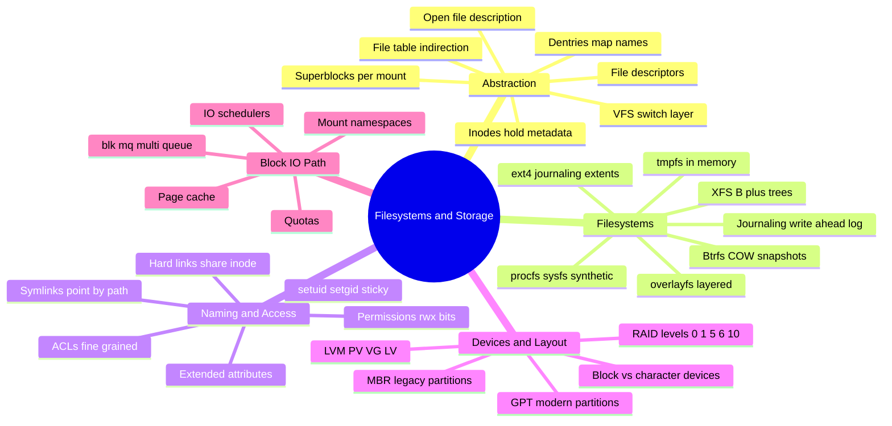
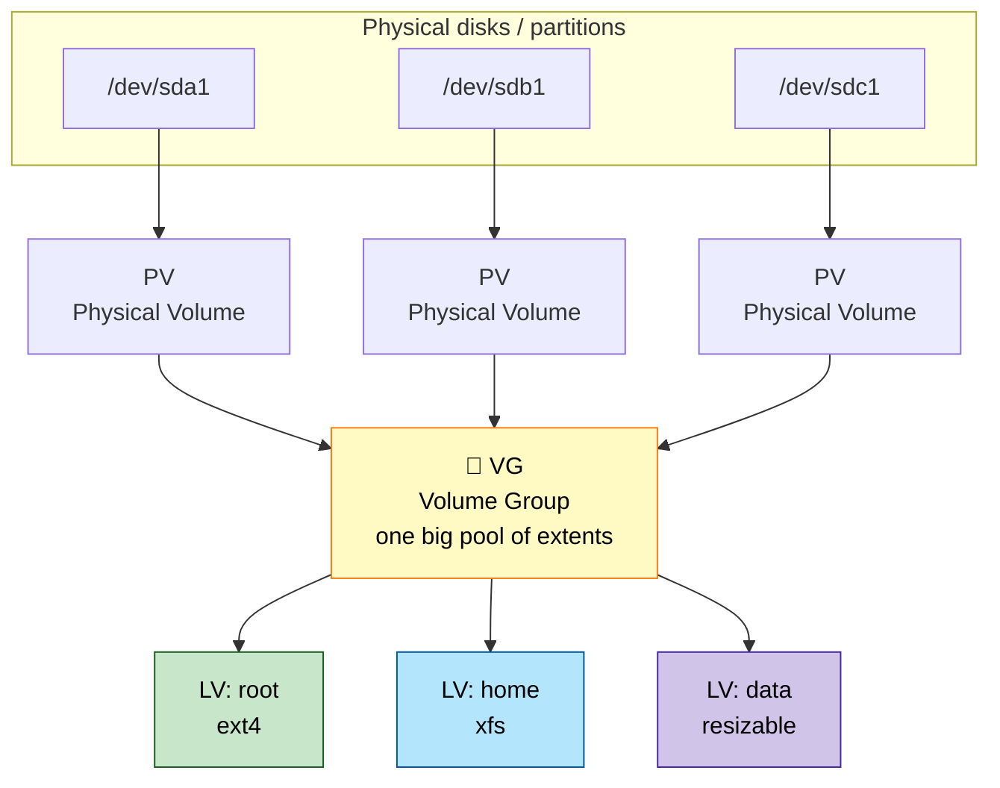
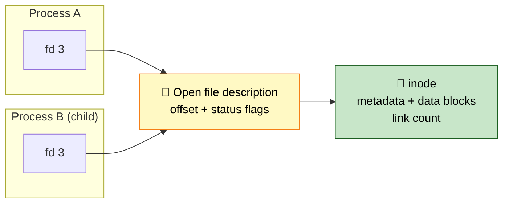
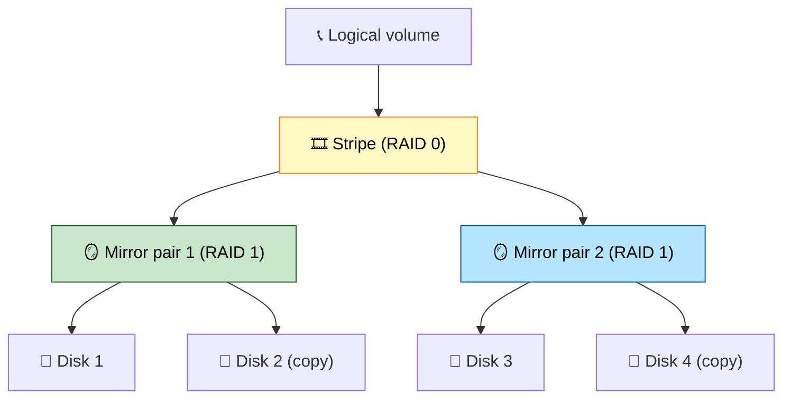
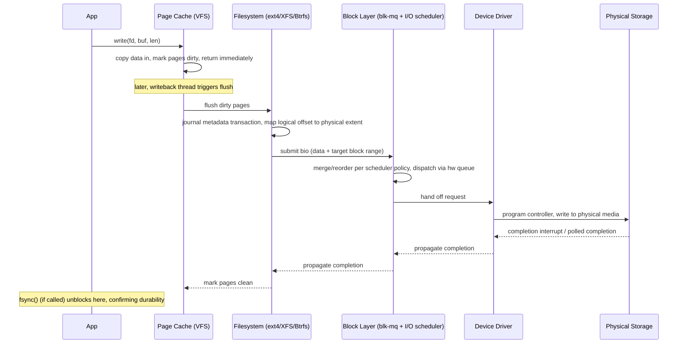

# Section 4: Filesystems & Storage

This section covers how Linux organizes data on disk — the VFS abstraction layer, concrete
filesystems (ext4, XFS, Btrfs), the block I/O path from syscall to physical media, LVM, RAID, and
storage troubleshooting. This is core material for any "disk full," "slow I/O," or "corrupted
filesystem" production scenario.

## Subtopic Index
- [VFS (Virtual Filesystem Switch) Layer](#vfs-virtual-filesystem-switch-layer)
- [Inodes, Dentries, Superblocks](#inodes-dentries-superblocks)
- [File Descriptors and File Table](#file-descriptors-and-file-table)
- [ext4 Architecture (journaling, extents)](#ext4-architecture-journaling-extents)
- [XFS Architecture](#xfs-architecture)
- [Btrfs Architecture (COW, snapshots)](#btrfs-architecture-cow-snapshots)
- [tmpfs, overlayfs, procfs, sysfs, devtmpfs](#tmpfs-overlayfs-procfs-sysfs-devtmpfs)
- [Journaling and Write-Ahead Logging](#journaling-and-write-ahead-logging)
- [Hard Links vs Symbolic Links](#hard-links-vs-symbolic-links)
- [File Permissions, Ownership, setuid/setgid/sticky bit](#file-permissions-ownership-setuidsetgidsticky-bit)
- [Access Control Lists (ACLs)](#access-control-lists-acls)
- [Extended Attributes (xattrs)](#extended-attributes-xattrs)
- [Block Devices vs Character Devices](#block-devices-vs-character-devices)
- [Partitioning (MBR vs GPT)](#partitioning-mbr-vs-gpt)
- [LVM (Physical Volumes, Volume Groups, Logical Volumes)](#lvm-physical-volumes-volume-groups-logical-volumes)
- [RAID Levels (0,1,5,6,10) software and hardware](#raid-levels-0156-10-software-and-hardware)
- [I/O Schedulers (noop, deadline, cfq, bfq, mq-deadline)](#io-schedulers-noop-deadline-cfq-bfq-mq-deadline)
- [Block Layer / multi-queue block layer (blk-mq)](#block-layer--multi-queue-block-layer-blk-mq)
- [Disk I/O Path (syscall to physical disk)](#disk-io-path-syscall-to-physical-disk)
- [Filesystem Mounting and Namespaces](#filesystem-mounting-and-namespaces)
- [Quotas](#quotas)

---

## 🗺️ Visual Overview

**Mind map — the whole section at a glance** (skim this first, revisit it last):



**The read() I/O path — how one syscall reaches spinning rust or flash** (highest-value diagram in the section):

```mermaid
flowchart LR
    A["📞 read() syscall<br/>userspace"] --> B["🔀 VFS<br/>generic dispatch"]
    B --> C["🗂️ Page cache<br/>hit → return fast"]
    C -->|miss| D["📁 Filesystem<br/>ext4 / XFS / Btrfs<br/>map file → blocks"]
    D --> E["🧱 Block layer<br/>build bio requests"]
    E --> F["🎛️ blk-mq<br/>per-CPU queues<br/>+ I/O scheduler"]
    F --> G["💾 Device driver<br/>NVMe / SATA / SCSI"]
    G --> H["🌀 Physical media<br/>disk or SSD"]
    style A fill:#ffe0b2,stroke:#e65100,color:#000
    style B fill:#fff9c4,stroke:#f57f17,color:#000
    style C fill:#c8e6c9,stroke:#1b5e20,color:#000
    style D fill:#b3e5fc,stroke:#01579b,color:#000
    style E fill:#d1c4e9,stroke:#4527a0,color:#000
    style F fill:#f8bbd0,stroke:#880e4f,color:#000
    style G fill:#c5cae9,stroke:#1a237e,color:#000
    style H fill:#dcedc8,stroke:#33691e,color:#000
```



**The LVM stack — physical disks become flexible logical volumes** (memorize the PV → VG → LV ladder):



**The fd indirection chain — why `fork` shares offsets and delete-while-open works:**



> 🧠 **Memory hooks (mnemonics):**
> - **LVM ladder (bottom → top):** *"Please Very Little"* → **P**V (physical volume) → **V**G (volume group) → **L**V (logical volume). Disks feed PVs, PVs pool into a VG, the VG is carved into LVs.
> - **Permission bits `rwx = 4-2-1`:** **r**ead=**4**, **w**rite=**2**, e**x**ecute=**1**. Add them up: `7`=rwx, `6`=rw-, `5`=r-x. So `chmod 755` = "owner all, group+others read+run."
> - **Special bits `4-2-1` again (one row up):** **setuid**=4000, **setgid**=2000, **sticky**=1000. "Same 4-2-1, just shifted left a column."
> - **RAID at a glance:** **0** = *zero* redundancy (stripe, speed); **1** = *one* twin (mirror); **5** = *single* parity (survive 1 disk); **6** = *six > five*, double parity (survive 2); **10** = *"one-and-zero"* mirror-then-stripe.
> - **Hard vs symlink:** a **hard link** is a *second name for the same inode* (dies only when the last name goes); a **symlink** is a *sticky note with a path on it* (breaks if the target moves). "Hard = same soul, Soft = signpost."
> - **inode holds everything but the name:** *"The inode knows what, the dentry knows who."*

---

## VFS (Virtual Filesystem Switch) Layer

> 🎯 **Interview weight: High** — the abstraction that makes "everything is a file" real; expect to explain how one syscall reaches dozens of filesystems.

**In one line:** **VFS** is the kernel's abstraction layer that lets every concrete filesystem present one uniform interface, so generic syscalls work identically no matter what backs a path.

The **Virtual Filesystem Switch** lets ext4, XFS, Btrfs, NFS, tmpfs, procfs, and dozens more present a uniform interface to the kernel and userspace. That's why `open`, `read`, `write`, `stat`, `mkdir`, and `rename` behave identically regardless of what's actually backing a given path.

Internally, VFS defines a small set of abstract object types:

| Object | Scope | Holds |
|--------|-------|-------|
| `struct super_block` | One per mounted filesystem instance | Filesystem-wide state |
| `struct inode` | One per filesystem object (file, dir, symlink, device node) | Metadata + data pointers |
| `struct dentry` | One per directory entry | Links a name to an inode, forming the hierarchy |
| `struct file` | One per open file | Runtime state including the current read/write offset |

Each concrete filesystem must implement a fixed set of operation tables — `super_operations`, `inode_operations`, `file_operations`, `address_space_operations` — that VFS calls through generic function pointers. VFS never needs to know how ext4 stores extents versus how XFS uses B+ trees.

> 🧠 **Mental model:** VFS is a plug interface. Filesystems are the plugs. `cat somefile.txt` works the same on an ext4 partition, an NFS share, a FUSE userspace filesystem, or `/proc` — which isn't backed by a real disk at all, synthesizing content on the fly from kernel data structures rather than reading blocks.

**Path resolution** (`namei()`) is one of VFS's most performance-critical jobs. Resolving `/var/log/app/current.log` walks the dentry cache component by component, calling into each filesystem's `lookup()` operation only on a cache miss.

> 🔍 **Under the hood:** That walk happens on essentially every file-related syscall the whole system issues, which makes dentry/inode cache efficiency a first-order performance concern for any I/O-heavy workload.

### Key commands
```
mount | column -t                 # every mounted filesystem and its VFS-visible type
cat /proc/filesystems              # filesystem types this kernel currently supports
stat -f /some/path                  # VFS-level filesystem statistics for the mount containing a path
cat /proc/<pid>/mountinfo            # detailed per-process view of the mount namespace
```

## Inodes, Dentries, Superblocks

> 🎯 **Interview weight: High** — the trio behind hard links, cheap renames, and `df` vs `du` mysteries.

**In one line:** An **inode** holds a file's metadata and data pointers but *not* its name; **dentries** map names to inodes; a **superblock** describes one mounted filesystem as a whole.

**The inode** (`struct inode` in VFS, backed by a filesystem-specific on-disk form) is the fundamental object for one filesystem entity — regular file, directory, symlink, device node, or named pipe. It holds everything about that entity *except its name*:

- File size
- Permissions
- Ownership (UID/GID)
- Timestamps (access / modify / change)
- Link count
- Pointers to data blocks (direct, or via extents/B-trees depending on the filesystem)

> 🧠 **Mental model:** A name is *not* part of an inode. Names live entirely in directory entries. Two consequences fall right out of this:
> - **Hard links work** — multiple directory entries, even in different directories, point at the same inode, sharing all metadata and data, distinguished only by an incremented link count.
> - **Rename is cheap** — it updates a directory entry's name/parent pointer, never touching the inode or its data, as long as the rename stays within one filesystem.

**The dentry** (directory entry) is VFS's in-memory object linking a name string to its inode and parent directory. The **dentry cache ("dcache")** keeps recently-resolved path components in memory to avoid re-walking on-disk directory structures on every repeated lookup.

> 🔍 **Under the hood:** A *negative dentry* (caching that a name does **not** exist) is as valuable as a positive one. Library/config search paths repeatedly probe several candidate locations that don't exist — without negative dentries, every miss would re-hit the underlying filesystem.

**The superblock** represents one mounted filesystem instance as a whole — its type, size, block size, free-space accounting, and a pointer to the root inode/dentry from which the entire mounted tree hangs. Every mount allocates and populates one.

### Key commands
```
stat <file>                        # full inode metadata: size, perms, owner, timestamps, inode number, link count
ls -i <file>                        # show just the inode number
df -i                                 # inode usage/availability per mounted filesystem (can run out separately from space!)
cat /proc/sys/fs/dentry-state         # dentry cache statistics
```

## File Descriptors and File Table

> 🎯 **Interview weight: High** — the two-level indirection behind `fork()` sharing, `dup2()` redirection, and delete-while-open.

**In one line:** A **file descriptor** is a per-process integer indexing a table whose entries point not at inodes directly but at kernel-wide **open file descriptions**, and that extra hop explains most UNIX file quirks.

**The indirection chain** is the whole story here:

```
per-process fd table  →  shared open file description  →  inode
```

A file descriptor is a small non-negative integer, unique per process, indexing into that process's private fd table (`files_struct`). Each entry points at a kernel-wide open file description (`struct file`), which holds:

- The current file offset
- The status flags the file was opened with (`O_APPEND`, `O_NONBLOCK`)
- A reference to the underlying inode

**When descriptors share one open file description** (and therefore share an offset):

| Situation | Result |
|-----------|--------|
| After `fork()` | Parent and child share offsets for inherited fds — one process's `read()` advances the position seen by the other |
| After `dup()` / `dup2()` | A second fd deliberately refers to the same description — exactly how shell redirection `2>&1` works |
| Two independent `open()` of the same path | **Separate** descriptions, **independent** offsets, same underlying inode |

> ⚠️ **Gotcha:** Two unrelated processes writing via independent `open()` calls interleave unpredictably (each has its own offset). A `fork()`ed child sharing its parent's already-open append-log fd shares the offset and avoids that interleaving.

**Delete-while-open:** the inode is freed only once *every* open file description referencing it is closed. So `unlink()`ing a file a process still has open removes the directory entry immediately, but the inode and its data blocks persist until the last fd closes.

> 💡 **Interview tip:** This is exactly why `df` (free space) and `du` (sum of sizes reachable by walking the tree) disagree after a delete-while-open — the space is used but no longer reachable by name.

```
Process A fd table        Process B fd table
   fd 3 ──┐                   fd 5 ──┐
          ▼                          ▼
    open file description    open file description   (independent offsets)
          │                          │
          ▼                          ▼
        inode (shared) ◄─────────────┘
          │
          ▼
     data blocks on disk
```

### Key commands
```
ls -l /proc/<pid>/fd/               # every open file descriptor for a process and what it points at
lsof -p <pid>                         # same information plus filesystem/socket/pipe detail, cross-process
lsof +L1                               # find open files with a link count of 0 — deleted-but-still-open files
cat /proc/sys/fs/file-nr               # system-wide open file handle count vs limit
```

## ext4 Architecture (journaling, extents)

> 🎯 **Interview weight: High** — the default filesystem on most Linux boxes; extents and journal modes come up constantly.

**In one line:** **ext4** is the general-purpose default that added **extents**, bigger size limits, and better journaling on top of the proven ext2/ext3 lineage.

**On-disk layout** divides the volume into **block groups**, each carrying its own:

- Inode table
- Block/inode bitmaps (tracking free/used blocks and inodes within that group)
- A backup copy of critical superblock metadata (resilience against localized corruption)

Data blocks are allocated preferring locality within the same block group as their inode and parent directory, minimizing seek distance on spinning media (harmless, if less relevant, on SSDs).

**Extents — the headline improvement over ext2/ext3.** The old indirect-block scheme stored a fixed number of direct block pointers in the inode plus single/double/triple indirect blocks for larger files, requiring extra block reads just to locate data.

> 🧠 **Mental model:** An **extent** is a compact descriptor — *"starting logical block, length, starting physical block"* — that describes a large contiguous run in one small entry. A mostly-sequential file needs only a handful of extents instead of thousands of pointers, cutting both metadata size and the number of metadata reads to map it.

**Journal modes** (see [Journaling](#journaling-and-write-ahead-logging) below):

| Mode | What's journaled | Trade-off |
|------|------------------|-----------|
| `ordered` (default) | Metadata only; data written to final location *before* the metadata commits | Balanced crash consistency vs overhead |
| `journal` | Metadata **and** file data | Strongest consistency, meaningfully slower |
| `writeback` | Metadata only, no ordering vs data writes | Fastest, weakest — a crash can leave stale/garbage data in a file whose metadata says it grew (structure still consistent) |

> 🔍 **Under the hood:** ext4 also supports **delayed allocation** — it defers picking physical blocks until data actually flushes from the page cache rather than at `write()` time, so it can make better contiguity decisions once the true final size and I/O pattern are known.

### Key commands
```
dumpe2fs -h /dev/sdX1                 # ext4 superblock summary: features, journal mode, block group layout
tune2fs -l /dev/sdX1                    # similar summary via tune2fs, plus tunable parameters
filefrag -v <file>                       # show a file's extent map and fragmentation level
e2fsck -f /dev/sdX1                       # offline filesystem check/repair (unmount first)
```

## XFS Architecture

> 🎯 **Interview weight: High** — the RHEL default; B+ trees, allocation groups, and "can't shrink" are classic talking points.

**In one line:** **XFS** is a high-performance, highly parallel filesystem built almost entirely on **B+ trees** and **allocation groups**, favored for large files and high-throughput workloads — but it can only grow, never shrink.

**B+ trees everywhere.** XFS's defining choice is pervasive B+ trees for nearly every metadata structure:

- **Free space** — tracked by two B+ trees, indexed by both extent size and starting offset (fast best-fit/first-fit lookups)
- **Directories** — B+ trees beyond a small inline size, giving consistently fast lookups even at millions of entries (a genuine ext4 weakness at extreme scale)
- **Extent maps** — upgrade from a compact inline array to a full B+ tree once a file is large or heavily fragmented

**Allocation groups** partition the filesystem (conceptually like ext4's block groups) but are designed explicitly for parallelism. Each group can be allocated-into and journaled somewhat independently, so operations on different groups proceed with less lock contention — a major reason XFS scales well on high-core-count systems with many concurrent I/O threads.

**The log (journal)** records metadata operations only (never file data, similar in spirit to ext4's default `ordered` mode) in a logically sequential log fully separate from the allocation groups. Recovery replays this log to restore metadata consistency without a full filesystem scan.

> ⚠️ **Gotcha:** XFS can be grown online (`xfs_growfs`) but **never shrunk** — reducing an XFS filesystem or its block device requires backup/recreate/restore. Size XFS volumes generously up front; ext4 and Btrfs *can* shrink.

> 💡 **Interview tip:** Frame it as a workload choice — XFS excels at large-file, high-throughput, highly parallel I/O (databases, media, big data); ext4 is a slightly more flexible general-purpose default for mixed workloads and smaller volumes.

### Key commands
```
xfs_info /mount/point                # XFS filesystem geometry: allocation groups, block size, log size
xfs_repair -n /dev/sdX1                # check (dry-run) an unmounted XFS filesystem for corruption
xfs_growfs /mount/point                 # grow an XFS filesystem online (no shrink equivalent exists)
xfs_db -c "freesp -s" /dev/sdX1          # (offline) inspect free-space fragmentation detail
```

## Btrfs Architecture (COW, snapshots)

> 🎯 **Interview weight: High** — copy-on-write, instant snapshots, and checksumming are frequent compare/contrast material against ext4/XFS.

**In one line:** **Btrfs** is a copy-on-write filesystem where *everything* is a B-tree and no block is ever overwritten in place — making snapshots, checksums, and rollback cheap, at some performance cost.

**COW everywhere.** Every modification writes the changed block to a *new* location, then updates the tree pointing at it (also via COW, propagating up to a new tree root) rather than mutating in place.

> 🧠 **Mental model:** This replaces journaling for crash consistency. A crash mid-write simply leaves the old, still-fully-consistent tree root as the valid state — the new blocks just never get pointed to by a committed root. No journal replay at all.

**Why snapshots are instant:** a snapshot is just a new reference to an existing tree root, sharing all underlying blocks until either side modifies something (at which point COW diverges only the changed blocks, exactly like COW memory pages). Snapshotting a multi-terabyte subvolume is a constant-time metadata operation, not a data copy.

**Native features that fall out of this design:**

- **Subvolumes** — independently mountable/snapshottable namespaces within one filesystem (commonly separating `/`, `/home`, and package-managed paths so a root rollback needn't touch `/home`'s history)
- **Multi-device support** — built-in software-RAID-like redundancy/striping without a separate LVM/mdadm layer
- **Transparent compression** — per-file or filesystem-wide, trading CPU for less I/O and space
- **Checksumming** of both data and metadata — catches silent corruption traditional filesystems never detect, auto-repairing from a redundant copy if configured

> ⚠️ **Gotcha:** Btrfs's **RAID5/6** has a long-documented "write hole" reliability history and is broadly **not recommended for production**. Its RAID0/1/10 modes are considered solid.

> ⚠️ **Gotcha:** COW-everywhere hurts databases doing lots of small random overwrites, where COW fragmentation degrades performance unless `nodatacow` is set for those files. Expect higher operational complexity than ext4/XFS.

### Key commands
```
btrfs subvolume create /path/to/subvol      # create a new subvolume
btrfs subvolume snapshot /src /dest           # instant, space-efficient COW snapshot
btrfs filesystem df /mount/point               # per-allocation-profile space usage (data/metadata/system)
btrfs scrub start /mount/point                  # verify checksums across the filesystem, repair from redundancy if found
```

## tmpfs, overlayfs, procfs, sysfs, devtmpfs

> 🎯 **Interview weight: Medium** — overlayfs underpins container images; the rest explain where `/proc`, `/sys`, and `/dev` come from.

**In one line:** These special-purpose filesystems don't back persistent on-disk storage — each solves a distinct problem within the VFS framework.

| Filesystem | Backed by | Purpose |
|------------|-----------|---------|
| `tmpfs` | Volatile memory (RAM + swap) | `/tmp`, `/dev/shm` (POSIX shared memory), initramfs backing store — contents vanish on unmount/reboot |
| `overlayfs` | Union of lower + upper dirs | Merges a read-only lower tree with a writable upper tree — the mechanism behind container image layers |
| `procfs` (`/proc`) | Synthetic (no disk) | Live process/kernel state generated on read (`/proc/<pid>/...`, `/proc/meminfo`) |
| `sysfs` (`/sys`) | Synthetic (no disk) | Mirrors the kernel's device/driver object model (`kobject`/`kset`); write to tune live parameters |
| `devtmpfs` (`/dev`) | Kernel-populated | Device nodes created dynamically as hardware is detected |

**overlayfs in detail** — the one that matters most:

- Reads are satisfied from **upper** if present, otherwise from **lower**.
- Any write triggers **copy-up**: the file is copied from lower into upper first, then modified there, leaving lower untouched.

> 🧠 **Mental model:** Each container image layer is a read-only lower directory, stacked many layers deep, with a thin writable upper layer for the running container's changes. Many containers share the same base image blocks on disk without duplication, each with an independent writable view.

> 🔍 **Under the hood:** `procfs` and `sysfs` are generated on-the-fly by kernel code when read — they're a tool-friendly presentation of internal kernel data structures, not files on a device. `devtmpfs` replaced the old static `/dev`; the kernel populates it, and `udev` in userspace adds symlinks, permissions, and naming policy on top.

### Key commands
```
mount -t tmpfs -o size=512m tmpfs /mnt/ram   # create a size-limited RAM-backed filesystem
mount | grep overlay                          # inspect active overlayfs mounts (very common for containers)
cat /proc/mounts                               # authoritative live list of mounted filesystems for this process's namespace
udevadm info /dev/sda                          # inspect udev-managed device metadata for a devtmpfs node
```

## Journaling and Write-Ahead Logging

> 🎯 **Interview weight: High** — the crash-consistency mechanism; know precisely what it does and does *not* protect.

**In one line:** **Journaling** writes a compact record of *intended* changes to a dedicated journal *before* applying them to scattered on-disk structures — the same write-ahead-logging principle databases use, applied to filesystem metadata.

**The problem it solves:** a single logical operation touches multiple scattered structures. Creating a file updates a directory entry, an inode, and a free-inode bitmap — potentially three unrelated disk locations. A crash partway through leaves the filesystem inconsistent.

**How the journal fixes it:**

1. The whole change is written as one **sequential journal transaction** (fast — one contiguous append, not three scattered seeks).
2. Only after that transaction is safely committed does the filesystem **checkpoint** the changes to their real on-disk locations, at its own pace.
3. If a crash occurs before checkpointing, the committed transaction is simply **replayed** on next mount.


> 🧠 **Mental model:** The atomicity is all-or-nothing. Either the whole transaction committed to the journal (and gets replayed/completed) or it didn't (and never happened). You never get a directory entry pointing at an inode that was never allocated.

> ⚠️ **Gotcha:** Journaling protects filesystem **metadata** consistency, *not* file **data** durability — unless the mode explicitly journals data (ext4 `data=journal`, at real performance cost). A journaling filesystem prevents corruption after a crash, but an application still must call `fsync()` to guarantee its own recently-written data survives; anything left in the page cache can still be lost.

### Key commands
```
dumpe2fs -h /dev/sdX1 | grep -i journal    # ext4 journal size/mode/features
tune2fs -O ^has_journal /dev/sdX1            # (dangerous, offline only) disable ext4 journaling
xfs_logprint /dev/sdX1                        # inspect XFS log contents (diagnostic tool)
mount | grep data=                            # confirm current ext4 data journaling mode from mount options
```

## Hard Links vs Symbolic Links

> 🎯 **Interview weight: High** — a near-guaranteed question; the inode-vs-path distinction is the whole answer.

**In one line:** A **hard link** is another name for the same inode; a **symbolic link** is a tiny separate file whose content is a path the kernel re-resolves.

| | Hard link | Symbolic link (symlink) |
|---|---|---|
| What it is | An extra directory entry pointing at an existing inode | A separate file whose content is a path string |
| Own inode? | No — shares the target's inode | Yes — its own (tiny) inode |
| Cross filesystem? | **No** — inode numbers are only meaningful within one filesystem | **Yes** |
| Point at a directory? | **No** (on most filesystems) — would create cycles | **Yes** |
| Point at nonexistent path? | N/A | **Yes** — a "dangling" symlink |
| "Original" vs "link"? | No distinction — both are equally valid names for one inode | The symlink is clearly distinct from its target |

**Hard links** share the same data, permissions, ownership, and timestamps, with the inode's link count incremented per link. The data and inode are freed only once every hard link *and* every open fd referencing it is gone.

> 🧠 **Mental model:** This is the same mechanism behind delete-while-open safety — `rm`ing a file a process still has open just removes one directory entry and decrements the link count; the inode and data persist until the last reference (link or open fd) disappears.

**Symlinks** are transparently dereferenced during path resolution. Because a symlink is just an independent inode holding a path string, deleting it never affects its target. A dangling symlink resolves fine as an object but fails when something tries to open/traverse through it.

> ⚠️ **Gotcha:** The semantics are reversed. Deleting a symlink leaves the target untouched. For hard links there is no separate "target" at all — only multiple equally-valid names sharing one inode.

### Key commands
```
ln original.txt hardlink.txt        # create a hard link (same inode, same filesystem required)
ln -s /path/to/target link.txt        # create a symbolic link (separate inode, cross-filesystem OK)
ls -li                                  # show inode numbers to confirm which files share one (hard-linked)
stat hardlink.txt | grep Links           # confirm the link count for a file's inode
readlink -f link.txt                      # fully resolve a symlink chain to its final target path
```

## File Permissions, Ownership, setuid/setgid/sticky bit

> 🎯 **Interview weight: High** — permission bits and the three special bits are security-critical everyday knowledge.

**In one line:** Every inode carries owner UID, owner GID, and 9 rwx bits, plus three special bits (**setuid**, **setgid**, **sticky**) that change execution and directory behavior.

**The basics:** the 9-bit field splits into three groups (owner, group, other), each encoding read/write/execute. The kernel checks these on every relevant syscall (`open`, `exec`, `mkdir`) against the process's *effective* UID/GID — not necessarily its real/login UID, a distinction that matters enormously for setuid.

**The three special bits:**

| Bit | On an executable | On a directory |
|-----|------------------|----------------|
| **setuid** | Runs with effective UID = file's *owner* (e.g. `/usr/bin/passwd` briefly gains root to edit `/etc/shadow`) | (no effect) |
| **setgid** | Runs with effective GID = file's *group* | New files/subdirs inherit the directory's group, not the creator's primary group — keeps a shared team dir consistent without manual `chgrp` |
| **sticky** | (obsolete — once kept text segments in swap) | A user may only delete/rename files *they own*, even if directory perms would otherwise allow deleting anything — `/tmp` is the canonical case |

> 🧠 **Mental model:** `/tmp` is world-writable (so any user can create files) but sticky (so users can't delete or tamper with each other's files despite that shared write access).

> 💡 **Interview tip:** The `passwd` example is the go-to setuid answer — an unprivileged user runs a root-owned program that briefly holds root privilege *specifically* to modify a file it alone is trusted to touch, with the program responsible for restricting exactly what that privilege does.

### Key commands
```
chmod u+s /path/to/binary          # set the setuid bit
chmod g+s /path/to/directory        # set the setgid bit (inherit group on new files, for directories)
chmod +t /path/to/directory          # set the sticky bit (restrict deletion to file owner)
find / -perm -4000 -type f 2>/dev/null   # audit: find all setuid binaries on the system
```

## Access Control Lists (ACLs)

> 🎯 **Interview weight: Medium** — the escape hatch when owner/group/other isn't expressive enough; the `+` in `ls -l` is a common troubleshooting clue.

**In one line:** **POSIX ACLs** attach an arbitrary list of named-user and named-group permission entries to a file, going beyond the single-owner / single-group limit of traditional bits.

**Why they exist:** traditional permissions express exactly one user (owner) and one group. Granting read to three specific extra users *and* write to one extra group on the same file simply can't be done without workarounds like creating a dedicated group per combination.

**How ACLs are checked** — in a defined precedence order:

1. Owner
2. Any matching named-user ACL entry
3. Owning group and any named-group ACL entries, combined and capped by a **mask** entry (the ceiling on what any named entry can grant)
4. Other

**Default ACLs** can be set on a directory to be inherited automatically by every new file and subdirectory — extending the setgid-directory inheritance idea to a full arbitrary ACL, not just group ownership. Useful for shared project directories needing a consistent nuanced policy applied automatically.

> 💡 **Interview tip:** Filesystems need the `acl` mount option (ext4/XFS enable it by default). `ls -l` appends a trailing `+` to the permission string when a file carries ACLs — that's your signal to run `getfacl` instead of trusting the plain rwx display, and it's a frequent source of "why can this user access this file when the bits say no?" confusion.

### Key commands
```
getfacl <file>                      # show full ACL entries for a file
setfacl -m u:alice:rwx <file>         # grant a specific additional user rwx access
setfacl -d -m g:devteam:rx <dir>       # set a default ACL, inherited by new files created in a directory
ls -l <file>                            # trailing '+' after permission bits hints at ACL presence
```

## Extended Attributes (xattrs)

> 🎯 **Interview weight: Medium** — how SELinux labels and ACLs are actually stored; a real backup/migration pitfall.

**In one line:** **Extended attributes** are arbitrary name/value metadata pairs attached to an inode beyond the fixed metadata, giving subsystems a generic extension point without changing the on-disk inode format.

**Namespaces** (by prefix convention):

| Namespace | Used by | Example |
|-----------|---------|---------|
| `user.*` | Arbitrary application use | Store a checksum, source URL, or MIME type on a downloaded file |
| `security.*` | Security modules | SELinux stores its per-file label as `security.selinux` |
| `system.*` | Kernel-level metadata | POSIX ACLs live as `system.posix_acl_access` / `system.posix_acl_default` |
| `trusted.*` | Processes with `CAP_SYS_ADMIN` | Low-level system tooling |

> 🔍 **Under the hood:** SELinux enforces mandatory access control per-file using the `security.selinux` xattr — the label lives as filesystem metadata, not in a separate database. An ACL is likewise implemented under the hood as a `system.*` xattr.

**Support and limits:** not every filesystem supports xattrs, and those that do may cap size (ext4 historically limited xattrs to one filesystem block unless a larger-xattr feature is enabled; XFS and Btrfs are more generous).

> ⚠️ **Gotcha:** Most copy/archive tools do **not** preserve xattrs by default. Copying SELinux-labeled files without `cp --preserve=xattr` or `tar --xattrs` silently drops the security labels/ACLs — a common and security-relevant migration/backup pitfall.

### Key commands
```
getfattr -d <file>                  # list all user-namespace extended attributes on a file
setfattr -n user.mycustomattr -v myvalue <file>   # set a custom xattr
getfattr -n security.selinux <file>   # inspect the SELinux security context stored as an xattr
cp --preserve=xattr src dst            # explicitly preserve xattrs across a copy (not default in all tools)
```

## Block Devices vs Character Devices

> 🎯 **Interview weight: Medium** — the `b` vs `c` in `ls -l /dev`, and where major/minor numbers come from.

**In one line:** Every `/dev` node is either a **block device** (random-access, block-addressed storage through the block layer) or a **character device** (stream-oriented, no block seeking).

| | Block device (`b`) | Character device (`c`) |
|---|---|---|
| Access model | Random-access in fixed-size blocks | Sequential stream |
| Examples | Disks, SSDs, RAID arrays, LVM LVs | Terminals, serial ports, `/dev/null`, `/dev/zero`, `/dev/urandom`, most sensors/GPIO/USB |
| Goes through | The block layer — page-cache buffering, I/O scheduling/merging, mountable filesystems | Driver directly; seeking generally not meaningful |
| Can seek? | Yes — any block, any order | Usually no (some drivers allow limited seeking) |

**Major and minor numbers** identify the device:

- **Major** — which driver handles the node (see `/proc/devices` mapping majors to driver names)
- **Minor** — which specific device/partition that driver manages (e.g. `/dev/sda` = major 8 minor 0, `/dev/sda1` = major 8 minor 1)

> 🔍 **Under the hood:** Nodes were historically created by hand with `mknod` from a fixed major/minor registry. Today `devtmpfs` + `udev` create and remove them dynamically as hardware is detected, with `udev` layering naming/symlink policy on top (predictable NIC names, `/dev/disk/by-uuid/...` symlinks).

### Key commands
```
ls -l /dev/sda /dev/tty1              # note the leading 'b' (block) vs 'c' (character) in the permission column
cat /proc/devices                       # major number to driver-name mapping, split into block and character sections
udevadm info -q all -n /dev/sda          # full udev-managed metadata for a block device node
lsblk                                     # tree view of block devices, partitions, and their mount points
```

## Partitioning (MBR vs GPT)

> 🎯 **Interview weight: Medium** — the 2TiB limit and 4-primary-partition trivia are common; GPT is the modern default.

**In one line:** A partition table divides a block device into independently formattable regions; **MBR** is the legacy 512-byte scheme with hard limits, **GPT** is the modern 64-bit successor.

| | MBR (Master Boot Record) | GPT (GUID Partition Table) |
|---|---|---|
| Table location | First 512-byte sector | Header near start + **backup copy at end of disk** |
| Partition limit | 4 primary (more via awkward extended/logical scheme) | 128 natively, no primary/extended distinction |
| Addressing | 32-bit sectors → **2TiB cap** | 64-bit LBA → enormous disks |
| Integrity | None | CRC32 checksums; corrupted primary table auto-detected and repaired from backup |
| Partition identity | Ordering + type byte | Globally unique GUID per partition |

**Why the MBR limits are hard, not tunable:** the 4-primary limit is purely the 512-byte table space constraint, and the 2TiB cap is a direct consequence of 32-bit sector counts × 512-byte sectors — capacity beyond that is simply unreachable regardless of the real disk size.

> 🔍 **Under the hood:** GPT disks carry a **"protective MBR"** in the very first sector — a single entry marking the whole disk as an unknown type — specifically so old MBR-only tools don't mistake the disk for uninitialized and overwrite the real GPT structures that follow.

> 💡 **Interview tip:** GPT is the default for any disk over 2TB or any UEFI system; MBR survives mainly for legacy BIOS-only systems and very old small media. GPT is usable even without UEFI boot.

### Key commands
```
parted /dev/sdX print                # show partition table (works for both MBR and GPT)
gdisk /dev/sdX                          # GPT-specific partitioning tool
fdisk -l /dev/sdX                        # list partitions; modern fdisk supports both MBR and GPT
sgdisk --backup=table.bak /dev/sdX        # backup a GPT partition table for disaster recovery
```

## LVM (Physical Volumes, Volume Groups, Logical Volumes)

> 🎯 **Interview weight: High** — online resize and snapshots are everyday ops skills; the PV/VG/LV hierarchy is a guaranteed question.

**In one line:** **LVM** inserts a flexible layer between raw devices and filesystems, so volumes can span disks, grow online, and be snapshotted — solving the rigidity of formatting straight onto a fixed partition.

**The three-layer hierarchy:**

| Layer | What it is |
|-------|-----------|
| **Physical Volume (PV)** | A raw device/partition initialized for LVM (gets an LVM metadata header) |
| **Volume Group (VG)** | A pool aggregating one or more PVs, divided into fixed-size **Physical Extents** (PEs, commonly 4MB — LVM's allocation unit) |
| **Logical Volume (LV)** | Carved from a VG's extents; appears as an ordinary block device (`/dev/vgname/lvname`) you format and mount |

**Why it beats a plain partition:** an LV's size isn't tied to any single disk's boundaries. It can span multiple PVs within its VG and grow online — `lvextend` then immediately `resize2fs`/`xfs_growfs` — without unmounting, as long as the VG has free extents (add a new PV with `vgextend` first if it's full).

**LVM snapshots** allocate a separate LV that initially shares all the origin's blocks, using copy-on-write:

> 🧠 **Mental model:** When the origin is modified, the *original* block content is copied into the snapshot's reserved space *before* being overwritten in the origin. This is the **inverse** of Btrfs (where new writes go to new locations and old blocks are preserved naturally).

> ⚠️ **Gotcha:** A traditional LVM snapshot's reserved space is a fixed allocation set at creation. If divergence exceeds it before the snapshot is removed, the snapshot is invalidated/dropped. Size it in advance based on expected write volume.

> 💡 **Interview tip:** The flexibility (online resize, spanning disks, consistent-backup snapshots) costs a modest layer of indirection — almost always worth it for any server whose storage will grow or be reorganized.

### Key commands
```
pvcreate /dev/sdb1                    # initialize a device/partition as an LVM physical volume
vgcreate myvg /dev/sdb1 /dev/sdc1        # create a volume group spanning two physical volumes
lvcreate -L 50G -n mylv myvg               # create a 50GB logical volume within a volume group
lvextend -L +20G -r /dev/myvg/mylv          # grow a logical volume AND its filesystem online (-r)
lvcreate -s -L 5G -n snap /dev/myvg/mylv     # create a copy-on-write snapshot of a logical volume
```

## RAID Levels (0,1,5,6,10) software and hardware

> 🎯 **Interview weight: High** — the level trade-offs and RAID5's write penalty are staple storage questions.

**In one line:** **RAID** combines multiple drives into one logical unit for performance, redundancy, or both — the level chosen decides which you get and at what capacity cost.

**Hardware vs software:**

- **Hardware** — a dedicated controller card with its own processor and often battery-backed cache; the OS just sees one logical disk.
- **Software** — the kernel's `md` driver (managed via `mdadm`), or a filesystem's built-in RAID (Btrfs/ZFS).

**The levels:**

| Level | Layout | Redundancy | Capacity cost | Notes |
|-------|--------|-----------|---------------|-------|
| **RAID 0** | Striping, no redundancy | None — any disk loss destroys all data | 0% | Multiplicative throughput; every disk holds a fragment of every file |
| **RAID 1** | Mirroring | Survives N-1 of N | 50%+ (usable = one disk) | Reads parallelize across mirrors |
| **RAID 5** | Striping + 1 distributed parity | Tolerates 1 failure | 1 disk | XOR parity rotated per stripe; **write penalty** (read-modify-write) |
| **RAID 6** | Striping + 2 independent parities | Tolerates 2 failures | 2 disks | Favored for large drives where rebuild windows are long |
| **RAID 10** | Striped mirrors | Multiple, if not both in one pair | 50% | Best write performance of the redundant levels — no parity math |

> ⚠️ **Gotcha — the RAID 5 write penalty:** a partial-stripe write must read the old data *and* old parity, compute new parity, then write both. This "read-modify-write" is a real, well-documented cost for small random writes.

**RAID 10 — mirror first, then stripe across the mirrors:**



> 🧠 **Mental model:** RAID 6 exists because on very large modern drives, a single-disk rebuild can take long enough that a *second* failure during that window becomes realistic — which RAID 5 cannot survive.

> 💡 **Interview tip:** RAID 10 is the common pick for write-intensive databases — strong redundancy plus the best write performance among redundant levels, if you can afford the 50% capacity overhead.

### Key commands
```
mdadm --create /dev/md0 --level=5 --raid-devices=4 /dev/sd[bcde]1   # create a software RAID5 array
cat /proc/mdstat                     # live status of all software RAID arrays, including rebuild progress
mdadm --detail /dev/md0                # detailed array configuration and per-disk state
mdadm --manage /dev/md0 --fail /dev/sdb1   # simulate/mark a disk as failed for testing recovery
```

## I/O Schedulers (noop, deadline, cfq, bfq, mq-deadline)

> 🎯 **Interview weight: Medium** — picking the right scheduler per device type (especially `none` for NVMe) is a practical tuning skill.

**In one line:** An **I/O scheduler** sits in the block layer between filesystems and the device driver, deciding the order pending requests are dispatched to optimize for the media and for fairness.

| Scheduler | Behavior | Best for |
|-----------|----------|----------|
| `noop` / `none` | No reordering beyond simple request merging | SSDs/NVMe — the device's own controller schedules; host reordering just adds latency |
| `deadline` / `mq-deadline` | Mostly-sequential for throughput, but jumps ahead to service any request nearing its deadline | Solid general-purpose for spinning disks and many SSDs |
| `cfq` (retired) | Per-process fair share via round-robin queues | Single-queue era — replaced by `bfq` |
| `bfq` | CFQ's successor — proportional, cgroup-aware fairness with better latency | Interactive/desktop mixed workloads |

> ⚠️ **Gotcha:** `deadline` prevents **starvation** — a classic problem with naive seek-minimizing schedulers where requests far from the disk head could wait indefinitely as closer requests keep arriving.

> 💡 **Interview tip:** The right choice is workload- and device-dependent:
> - **Fast NVMe** → `none` (let the device's internal queueing do the work).
> - **SATA/SAS SSDs or spinning disks on servers** → `mq-deadline` (deadline-bounded fairness, low overhead).
> - **Desktop/interactive** → `bfq` (responsiveness under mixed background/foreground load).

### Key commands
```
cat /sys/block/sdX/queue/scheduler        # current scheduler and other available options for a device
echo mq-deadline > /sys/block/sdX/queue/scheduler   # change the active I/O scheduler live
iostat -x 1                                  # per-device throughput/latency to evaluate scheduler effectiveness
fio --name=test --ioengine=libaio --rw=randread --size=1G   # benchmark I/O under different scheduler settings
```

## Block Layer / multi-queue block layer (blk-mq)

> 🎯 **Interview weight: High** — why NVMe needed a new block layer is a strong systems-depth signal.

**In one line:** **blk-mq** is the multi-queue block-layer redesign that replaced the single lock-bound request queue, letting per-CPU queues feed a device's native hardware queues — the change that lets NVMe actually deliver millions of IOPS.

**What the block layer does:** it sits between filesystems/block consumers and storage drivers, representing I/O as `struct bio` (a scatter-gather list of pages plus a target block range), merging/reordering per the active scheduler, and handing requests to the driver.

**Why the legacy single-queue design broke:**

- One request queue per device, protected by a **single lock**.
- Fine for spinning disks doing a few hundred IOPS — the lock was never the bottleneck.
- Catastrophic for NVMe SSDs doing millions of IOPS across dozens of cores: *every* submission and completion from *every* core had to serialize through that one lock, making the block layer itself the bottleneck.

**What blk-mq does instead** (the sole block layer in current kernels):

- Per-CPU (or per-CPU-group) **software submission queues** feeding a smaller number of **hardware dispatch queues**.
- Those hardware queues map directly onto the storage controller's native multi-queue support.
- Completions are handled on (or near) the same core that issued the request — preserving cache locality, minimizing cross-core synchronization.

> 🧠 **Mental model:** NVMe was *designed* around thousands of independent hardware queues specifically to eliminate this class of software bottleneck. blk-mq's per-CPU architecture is the host-side design that matches it — without it, the single-queue lock would dominate long before any NVMe device's own hardware limits were reached, no matter how fast the flash.

### Key commands
```
cat /sys/block/nvme0n1/queue/nr_hw_queues     # number of hardware dispatch queues in use (blk-mq)
cat /sys/block/sdX/queue/scheduler               # confirm blk-mq schedulers are active (none/mq-deadline/bfq)
fio --numjobs=8 --iodepth=32 ...                   # benchmark parallel per-core submission scaling
perf stat -e block:block_rq_issue ./workload         # low-level block-layer request issuance tracing
```

## Disk I/O Path (syscall to physical disk)

> 🎯 **Interview weight: High** — narrating a `write()` end-to-end ties the whole section together and is a strong signal.

**In one line:** A buffered `write()` returns after copying data into the page cache; the real disk write happens later, asynchronously, threading through filesystem → block layer → driver → hardware.

**The path, step by step:**

1. **App calls `write(fd, buf, len)`.** The kernel copies data from the userspace buffer into the **page cache** (allocating dirty pages for the target offset if not resident) and, for a buffered write, returns immediately. No disk write has happened yet.
2. **Writeback threads flush.** Triggered by dirty-page thresholds and periodic timers (Section 3), kernel writeback eventually flushes the dirty pages.
3. **Filesystem maps and journals.** ext4/XFS/Btrfs translates the logical file offset into a physical block/extent using its on-disk metadata (extent trees, B+ trees, or indirect blocks), and if journaling, first writes a compact metadata journal transaction.
4. **`bio` submitted to the block layer.** The filesystem builds one or more `bio` structures (data + target physical range); blk-mq queues and the I/O scheduler decide dispatch order, merging adjacent requests.
5. **Driver programs the hardware.** NVMe, SCSI/SATA, or a software layer (LVM / `md` RAID, which may further translate/replicate across underlying devices) hands off to the controller — for NVMe, literally submitting an entry into a hardware submission queue the SSD polls.
6. **Media performs the write.** An SSD updates NAND cells via its wear-leveling translation layer (opaque to the OS); a spinning disk seeks and writes a sector.
7. **Completion propagates back up.** An interrupt (or polled completion queue entry for high-performance NVMe) signals the driver, which propagates completion up through the block layer and filesystem, waking any process waiting on that I/O.

> 🧠 **Mental model:** The only point where durability is actually guaranteed is a synchronous/`O_DIRECT` write or an `fsync()` — that's what waits for previously-buffered writes to truly reach stable storage.



### Key commands
```
strace -T -e trace=write,fsync ./program   # measure per-syscall time including any blocking fsync
iostat -x 1                                    # device-level throughput/latency/queue-depth over time
blktrace -d /dev/sdX -o - | blkparse             # full block-layer request lifecycle tracing
cat /sys/block/sdX/stat                          # raw cumulative block-device I/O statistics
```

## Filesystem Mounting and Namespaces

> 🎯 **Interview weight: Medium** — mount namespaces and bind mounts are the primitives containers are built on.

**In one line:** **Mounting** attaches a filesystem at a point in the directory tree; **mount namespaces** give each process an independent view of what's mounted — the primitive containers rely on.

**Mount namespaces** (`CLONE_NEWNS`): before namespaces there was one global mount table shared by every process. Namespaces let different processes see entirely independent sets of mounts, which is exactly how a container gets its own private root filesystem view (typically an overlayfs stack) with the host's real layout invisible unless explicitly bind-mounted in.

**Bind mounts** (`mount --bind`) are a distinct, simpler operation than mounting a new filesystem — they make an already-mounted directory tree (or even a single file) visible at a second location, creating *no* new filesystem instance. Both paths refer to the same underlying inodes, so changes through either are immediately visible through the other.

**Mount propagation** controls whether a mount/unmount in one namespace replicates into others:

| Setting | Behavior |
|---------|----------|
| `shared` | Propagates both ways — a new mount appears in all peer namespaces |
| `private` | Propagates nothing |
| `slave` | Receives propagation from its master, but doesn't propagate back |
| `unbindable` | Cannot be bind-mounted |

> 🧠 **Mental model:** Propagation is how a container runtime decides, per-mount, whether a volume mounted inside a container also becomes visible on the host (or vice versa) — fine-grained rather than all-or-nothing.

> 🔍 **Under the hood:** Mount options (`ro`, `noexec`, `nosuid`, `noatime`) are enforced per mount point in the VFS layer regardless of what the underlying filesystem would permit — e.g. mount a user-upload filesystem `noexec` to block execution of anything placed there, purely as a mount-time policy on top of the filesystem's own bits.

### Key commands
```
mount --bind /src /dst                 # make an existing directory tree visible at a second location too
mount --make-private /mnt/foo            # stop mount events under this mount point from propagating elsewhere
cat /proc/<pid>/mountinfo                 # detailed view of this process's mount namespace, including propagation
unshare --mount bash                       # start a new shell in a fresh, independent mount namespace
```

## Quotas

> 🎯 **Interview weight: Low** — useful for multi-tenant storage governance; contrast with cgroup limits is the interesting angle.

**In one line:** **Filesystem quotas** cap how much space and/or how many inodes a user, group, or project may consume on a given filesystem — independent of permission bits (which control *who* writes, not *how much*).

**Scope and enforcement:**

- Tracked **per-filesystem**, requiring the `usrquota`/`grpquota` mount options (XFS has native `uquota`/`gquota`/`pquota`).
- XFS also supports **project quotas** — grouping arbitrary directory subtrees under one quota regardless of which user/group owns individual files, useful for capping a whole application's or tenant's footprint spread across many owners.

**Two thresholds:**

| Limit | Behavior |
|-------|----------|
| **Soft** | Can be temporarily exceeded for a grace period; after that the kernel refuses further writes until usage drops back under it — a warning without immediately breaking work |
| **Hard** | Can never be exceeded — an attempt to write past it fails immediately with `EDQUOT` |

> 🔍 **Under the hood:** Accounting is maintained by the kernel as writes occur, not computed retroactively — which is why quotas must be enabled and an initial `quotacheck` pass run first, to give the kernel an accurate starting baseline before it tracks incremental changes.

> 🧠 **Mental model:** Quotas and cgroup limits are *complementary*, not overlapping. Quotas cap persistent storage per user/group/project on a filesystem, regardless of which process writes. Cgroup limits cap resource usage per process group/container, regardless of which UID owns the files. Multi-tenant hosting often needs both.

### Key commands
```
quotacheck -cug /mount/point          # initialize quota accounting files for users and groups
edquota -u alice                        # interactively set/edit a user's soft/hard quota limits
repquota -a                              # report current quota usage for all users on all quota-enabled filesystems
xfs_quota -x -c 'report -h' /mount/point   # XFS-native quota reporting, including project quotas
```

---

### Interview Questions

**Conceptual/Internals (8)**

1. **What problem does the VFS layer solve, and how does it achieve filesystem independence?**
   VFS provides a uniform set of abstract objects (superblock, inode, dentry, file) and operation
   tables that every concrete filesystem must implement, letting generic syscalls like `open`/`read`/
   `write` work identically regardless of the underlying filesystem type. Concrete filesystems plug in
   by implementing the required operation callbacks; VFS calls through function pointers without
   needing any filesystem-specific knowledge itself.

2. **Why does deleting an open file not immediately free its disk space?**
   `unlink()` only removes a directory entry and decrements the target inode's link count; the inode
   and its data blocks are only actually freed once every hard link and every open file descriptor
   referencing that inode are gone. A process holding the file open when it's "deleted" keeps the
   inode and data alive until it closes its file descriptor, which is why `df` and `du` can disagree
   in this scenario.

3. **Explain journaling's consistency guarantee, and what it does NOT protect against.**
   Journaling writes a compact record of an intended filesystem metadata change to a sequential
   journal area before applying it to scattered on-disk structures, so a crash either sees the full
   transaction committed (replayed on next mount) or not committed at all (never happened) —
   preventing metadata inconsistency. It generally does not guarantee file *data* durability unless
   the journal mode explicitly covers data (a real performance cost); applications must still call
   `fsync()` for data durability guarantees.

4. **What is the fundamental architectural difference between ext4 and Btrfs regarding crash
   consistency?**
   ext4 uses traditional write-ahead journaling: changes are logged then applied in place, requiring
   journal replay after a crash. Btrfs is copy-on-write everywhere: modifications are always written
   to new locations with tree structures updated via COW up to a new root, so a crash simply leaves
   the previous, still-fully-valid root as the current state with no replay needed at all.

5. **Why can't hard links cross filesystem boundaries or (generally) point at directories?**
   A hard link references an inode number directly, which is only meaningful within the inode table of
   the specific filesystem it belongs to, so it cannot reference an inode on a different filesystem.
   Hard links to directories are disallowed on most filesystems to prevent cycles in the directory
   tree, which would break tools (like `find`, backup software) that assume a strict tree structure.

6. **What is blk-mq and why did it replace the legacy single-queue block layer?**
   blk-mq is the multi-queue block layer redesign using per-CPU software submission queues feeding
   hardware dispatch queues mapped onto a device's native multi-queue support (as NVMe was designed
   for). It replaced the legacy single request-queue-per-device design (protected by one lock) because
   that single lock became a severe scalability bottleneck once NVMe SSDs capable of millions of IOPS
   across many cores emerged, well before the storage media itself would otherwise be the limiting
   factor.

7. **What's the practical difference between MBR and GPT partitioning?**
   MBR stores its partition table in a 512-byte boot sector, supports only 4 primary partitions
   directly (requiring an awkward extended/logical scheme for more), and is capped at 2TiB addressable
   disk size due to 32-bit sector addressing. GPT uses 64-bit addressing (supporting far larger disks),
   natively supports up to 128 partitions, stores a checksummed backup table at the end of the disk for
   resilience, and is required for disks larger than 2TB or systems booting via UEFI.

8. **How does an LVM snapshot work, and why must its size be planned in advance?**
   An LVM snapshot initially shares all data blocks with its origin logical volume; when the origin is
   modified, the *original* content of the changed block is copied into the snapshot's own reserved
   space before being overwritten in the origin, preserving the snapshot's point-in-time view. Because
   this copy-out space is a fixed allocation set at creation time, if divergence between origin and
   snapshot exceeds that reserved size, the snapshot is invalidated/dropped, making correct sizing
   based on expected write volume and snapshot lifetime essential.

**Scenario/Troubleshooting (6)**

9. **`df` shows a filesystem is 100% full, but `du -sh` on the mount point reports far less data
    actually present. What's the most likely explanation and how do you find the culprit?**
    A process is very likely holding open file descriptors to deleted files, whose inodes and data
    blocks persist (invisible to `du`'s directory-tree walk since the directory entries are gone) until
    those descriptors are closed. Use `lsof +L1` to find open files with a link count of zero, then
    identify and safely restart/signal the owning process to release them.

10. **A filesystem reports plenty of free space via `df` but applications still fail to create new
    files with "No space left on device." What else should you check?**
    Check inode exhaustion with `df -i` — a filesystem can run out of free inodes (each consuming a
    small fixed metadata allocation, common on filesystems with huge numbers of tiny files) well before
    running out of raw block space, and `df`'s default space-based view alone will not reveal this.

11. **After enabling Transparent overlayfs-based container storage, disk usage grows much faster than
    expected across many containers built from the same base image. What should you verify?**
    Confirm the container runtime's storage driver is genuinely using shared, read-only lower layers
    (each base image layer stored and referenced once, not duplicated per container) — a misconfigured
    storage driver, an unsupported backing filesystem for overlayfs's expected semantics, or images not
    actually sharing common base layers (rebuilt inconsistently) can all cause unexpected duplication
    that a correctly functioning overlayfs layer-sharing setup would otherwise avoid.

12. **An application performing sequential writes to an NVMe-backed volume performs unexpectedly
    worse under a `bfq` I/O scheduler than expected. What would you check/try?**
    Confirm the active scheduler with `cat /sys/block/<dev>/queue/scheduler`; `bfq`'s additional
    fairness/latency bookkeeping overhead is generally unnecessary and can reduce achievable throughput
    on fast NVMe media whose own internal controller already handles scheduling efficiently. Switching
    to `none` (or `mq-deadline` if some fairness/deadline bounding is still desired) is the standard
    remediation for high-throughput NVMe workloads.

13. **A RAID5 array shows degraded performance for weeks after a single disk failure and replacement,
    even after the rebuild completes according to `mdadm --detail`. What should you investigate?**
    Confirm the rebuild genuinely completed (`cat /proc/mdstat` showing no ongoing resync/recovery);
    if complete, investigate whether the replacement disk has a different (slower) performance profile
    than the original array members, or whether RAID5's inherent read-modify-write parity penalty for
    the workload's I/O pattern (small random writes) was always the underlying issue independent of the
    rebuild, suggesting RAID10 might be the more appropriate level for that specific workload.

14. **A backup/copy operation of SELinux-labeled files onto a new filesystem results in application
    access denials that weren't present before, despite permission bits looking identical. Why?**
    The backup/copy tool very likely did not preserve extended attributes (`security.selinux` xattr
    holding the SELinux label), which most copy tools do not preserve by default. Re-run the
    copy/restore explicitly preserving xattrs (`cp --preserve=xattr`, `tar --xattrs`, or `restorecon`
    afterward to reapply correct default labels based on policy).

**FAANG-level Deep Dive (6)**

15. **Explain precisely why ext4's extent-based mapping reduces metadata overhead for large files
    compared to the older indirect-block scheme, at the data-structure level.**
    Indirect-block mapping requires the inode to reference individual block pointers (directly, or via
    single/double/triple indirect blocks for larger files), meaning a large contiguous file still
    requires walking and storing an enormous number of individual block pointer entries, each
    requiring its own metadata read to resolve during mapping. Extents instead describe a run of
    logically-and-physically-contiguous blocks as one compact (start, length, physical-start) tuple,
    so a large mostly-contiguous file needs only a handful of extent entries rather than one entry per
    individual block, both shrinking on-disk metadata size and reducing the number of metadata reads
    needed to fully map the file.

16. **Why does Btrfs's copy-on-write design make snapshots essentially instantaneous, while LVM
    snapshots (also technically COW) require pre-allocated reserved space and can be invalidated if
    that space is exhausted?**
    Btrfs is COW at the level of its own filesystem tree structures — a snapshot is just a new
    reference to an existing tree root, and subsequent divergence naturally allocates new blocks
    wherever needed, drawing from the filesystem's ordinary free space pool with no separate
    reservation required. LVM operates one layer below any filesystem, on raw blocks, and its
    snapshot implementation instead preserves *old* block content into a fixed, separately-allocated
    copy-out area whenever the origin is overwritten (the inverse direction of COW compared to Btrfs),
    meaning that reserved area's size is a hard, must-be-estimated-in-advance constraint rather than
    drawing from the same general-purpose free space the origin volume itself uses.

17. **Describe the RAID5 "write hole" problem and why RAID6 does not eliminate it, only reduce its
    practical impact.**
    A RAID5 stripe write that doesn't cover a full stripe requires reading the old data and old parity,
    computing new parity, then writing new data and new parity — if a crash/power-loss occurs between
    writing the new data and writing the new parity, the stripe is left with data and parity that don't
    correspond to each other, and this inconsistency is undetectable by RAID5 alone (it has no way to
    know which of the two writes, if either, actually completed). RAID6's second, independent parity
    block doesn't prevent this same write-ordering hazard from occurring — it can still leave an
    inconsistent stripe after a crash — but does mean the array has enough redundancy to tolerate one
    additional wrong/missing value during reconstruction in some scenarios, meaningfully reducing (not
    eliminating) the odds that a genuinely undetectable, unrecoverable corruption results; the more
    complete fix requires either a dedicated non-volatile write-intent journal (as `mdadm`'s
    `--write-journal` option provides) or a filesystem/RAID design (like Btrfs's or ZFS's) with
    checksums that can positively detect (not just probabilistically reduce the odds of) this class of
    inconsistency after the fact.

18. **Why does blk-mq's per-CPU submission queue design specifically improve NVMe performance more
    than it would have mattered for older SATA/SAS-based spinning disks?**
    NVMe as a hardware/protocol specification was designed from the outset around thousands of
    independent hardware command queues specifically to allow massively parallel, lock-minimal
    submission from many CPU cores simultaneously — a design assumption blk-mq's per-CPU software
    queue architecture directly maps onto, letting each core largely avoid contending with other cores
    for submission/completion handling. Older SATA/SAS protocols and their spinning-disk-era command
    queuing depths were comparatively shallow and the underlying media's own seek-time bottleneck was
    always going to dominate regardless of software-side queue contention, so the legacy single-queue
    block layer's lock contention was rarely the binding constraint for those slower devices in the
    first place.

19. **Why does a `write()` syscall returning successfully not guarantee the underlying filesystem
    metadata is fully consistent on disk yet, even on a fully journaling filesystem?**
    A buffered `write()` only guarantees data has been copied into page-cache pages and marked dirty;
    neither the data nor any associated metadata change (like an extended file size) is necessarily
    written to the journal or checkpointed to final on-disk locations at that point — that happens
    later, asynchronously, via writeback. Only an explicit `fsync()`/`fdatasync()` call (or a
    synchronous mount/open mode) forces both the relevant data and the filesystem's metadata journal
    entry describing it to be durably written and confirmed before returning, which is the only point
    at which a genuine on-disk consistency and durability guarantee for that specific write actually
    exists.

20. **Explain why overlayfs's "copy-up" semantics can produce surprising behavior for large files
    that are only trivially modified inside a container.**
    Any write to a file that currently exists only in a read-only lower layer triggers copy-up: the
    *entire* file is copied from the lower layer into the writable upper layer first, and only then is
    the actual (possibly tiny) modification applied to that upper-layer copy — there is no partial or
    incremental copy-up at the block level in standard overlayfs semantics. This means even a
    single-byte modification to a multi-gigabyte file baked into a container's base image triggers a
    full-file copy operation the first time it's touched, which can be a surprising and measurable
    latency/I/O spike for container workloads that weren't designed with this cost in mind, and is a
    well-known reason to avoid storing very large, occasionally-mutated files directly inside container
    image layers.

### Hands-On Labs

**Lab 1: Extent mapping and fragmentation observation**
- Objective: Directly observe ext4 extent-based mapping and fragmentation.
- Setup: A loopback ext4 filesystem in a VM.
- Tasks: Create a large file with `fallocate`, then a heavily fragmented one by interleaving writes to
  multiple files with `dd`; inspect both with `filefrag -v` and compare extent counts.
- Expected outcome: Demonstrated correlation between write pattern and extent count/fragmentation.

**Lab 2: LVM online resize workflow**
- Objective: Practice the full PV/VG/LV lifecycle including online growth.
- Setup: A VM with two spare virtual disks.
- Tasks: Create PVs on both disks, combine into one VG, create an LV smaller than the VG, format and
  mount it, then grow the LV and filesystem online with `lvextend -r` while a file is being actively
  written to it.
- Expected outcome: A successfully grown, still-mounted, uninterrupted filesystem with verified data
  integrity throughout.

**Lab 3: RAID5 failure and rebuild simulation**
- Objective: Understand RAID5 fault tolerance and rebuild behavior firsthand.
- Setup: A VM with four loopback/virtual disks.
- Tasks: Create a RAID5 array with `mdadm`; write and checksum a test file; mark one disk failed
  (`mdadm --fail`); confirm data is still readable and correct; replace the failed disk and monitor
  rebuild via `/proc/mdstat`; verify data integrity after rebuild completes.
- Expected outcome: A documented, successful single-disk-failure recovery with verified data integrity.

**Lab 4: Btrfs snapshot and rollback**
- Objective: Experience Btrfs's instant, space-efficient snapshotting model.
- Setup: A Btrfs-formatted loopback filesystem.
- Tasks: Create a subvolume, populate it with files, snapshot it, modify the original subvolume
  further, then compare space usage (`btrfs filesystem df`) and roll back by mounting/restoring from
  the snapshot.
- Expected outcome: A demonstrated instant snapshot with measured, minimal additional space
  consumption until divergence occurs.

**Lab 5: I/O scheduler benchmark comparison**
- Objective: Quantify the real throughput/latency impact of different I/O schedulers.
- Setup: A VM or bare-metal host with both a spinning disk (or emulated one) and an NVMe/SSD if
  available.
- Tasks: Run identical `fio` random-read/write benchmarks against the same device under `none`,
  `mq-deadline`, and `bfq`; tabulate throughput and latency percentiles for each.
- Expected outcome: A data-backed recommendation for scheduler choice per device type, matching (or
  informatively contradicting) the general guidance given in this section.

### Production Incidents

**Incident 1: Fleet-wide "disk full" alerts traced to deleted-but-open log files**
- Symptom: Multiple application hosts alert on filesystem-full conditions despite log rotation
  appearing to run successfully and `du` on the log directory showing well under the reported usage.
- Investigation: `lsof +L1` on affected hosts reveals large, unlinked (deleted) log files still held
  open by long-running application processes that hadn't been restarted since their log rotation
  policy renamed/deleted the underlying files out from under them.
- Root cause: The log rotation tool deleted/renamed log files without signaling the application to
  reopen its log handle (missing the standard "copy-truncate" or `SIGHUP`-to-reopen pattern), leaving
  the old, deleted file's space held indefinitely by the still-open file descriptor.
- Recovery: Restarted (or sent the appropriate reopen signal to) the affected application processes,
  immediately reclaiming the held disk space.
- Prevention: Standardized log rotation configuration to always signal applications to reopen their
  log files post-rotation, and added `lsof +L1`-based deleted-open-file monitoring as a proactive
  fleet-wide check.

**Incident 2: Backup restoration broke SELinux enforcement after a filesystem migration**
- Symptom: Immediately after restoring a production filesystem from backup onto new storage,
  numerous services fail to start or access their expected files, with `audit.log` showing SELinux
  denials.
- Investigation: Confirmed the backup tool used did not preserve extended attributes by default,
  stripping `security.selinux` labels from every restored file, causing them to receive generic
  default labels inconsistent with the policy the services expected.
- Root cause: Backup/restore tooling was not configured to preserve xattrs, a requirement easy to miss
  since permission bits and ownership were preserved correctly and looked fine on cursory inspection.
- Recovery: Ran `restorecon -R` across the restored filesystem to reapply correct SELinux labels based
  on the active policy, resolving the denials without needing a second full restore.
- Prevention: Updated the backup/restore runbook and tooling configuration to explicitly preserve
  xattrs, and added a post-restore validation step running `restorecon -Rv` and diffing against
  expected labels before declaring a restore complete.

**Incident 3: RAID5 array suffered undetected data corruption after a power event during a partial
stripe write**
- Symptom: A small number of files on a RAID5-backed volume are found to contain corrupted content
  weeks after an unplanned power loss event, discovered only when an application-level checksum
  validation failed.
- Investigation: Correlating file modification timestamps with the power event's timing, combined with
  understanding of RAID5's write-hole vulnerability, identified that the corrupted files were being
  actively, partially written at the exact moment power was lost, leaving an inconsistent
  data/parity stripe that RAID5 itself had no way to detect after the fact.
- Root cause: The array lacked a write-intent journal or any checksum-based corruption detection, so
  the classic RAID5 write-hole scenario went completely undetected until an unrelated application-level
  integrity check happened to catch it much later.
- Recovery: Restored the specific corrupted files from the most recent good backup; broader array
  integrity was verified via a full `mdadm` array check/scrub.
- Prevention: Migrated critical volumes to RAID6 with a dedicated write-intent journal device, or
  alternatively to a checksumming filesystem (Btrfs/ZFS) capable of positively detecting this class of
  silent corruption, and added periodic `mdadm --action=check` scrub scheduling with alerting on any
  detected mismatch count going forward.
