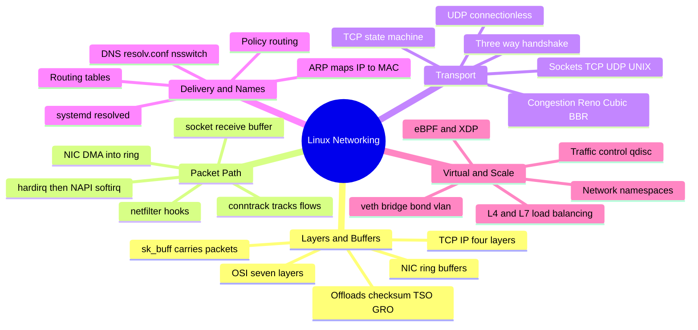
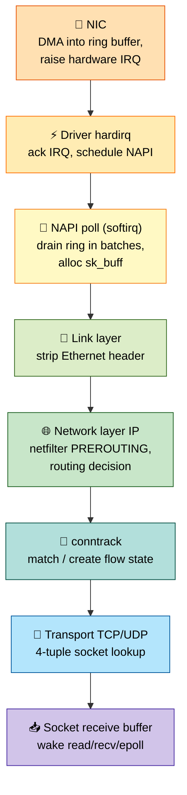
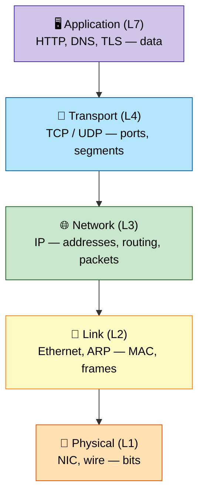
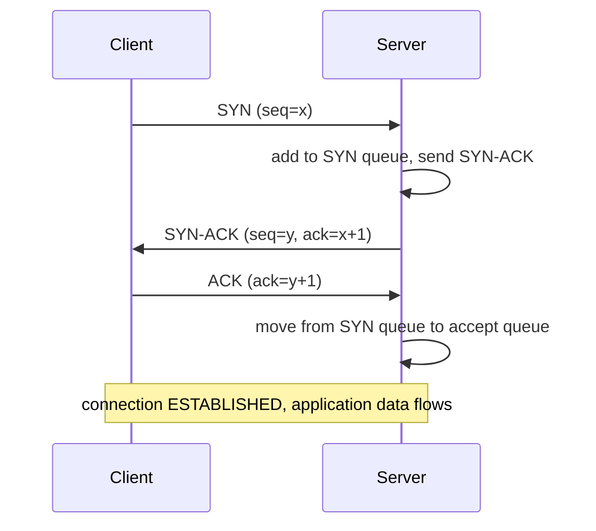

# Section 5: Networking Stack

This section covers the Linux kernel networking stack end-to-end — from a NIC interrupt through
sockets and TCP/IP, network namespaces, netfilter/iptables, and the emerging eBPF/XDP data path. This
is the material behind "why is this connection slow," "why is this packet being dropped," and
container/CNI networking interview questions.

## Subtopic Index
- [Linux Network Stack Overview (NIC to socket)](#linux-network-stack-overview-nic-to-socket)
- [Network Namespaces](#network-namespaces)
- [Netfilter and iptables/nftables](#netfilter-and-iptablesnftables)
- [Conntrack](#conntrack)
- [Sockets (TCP/UDP/UNIX domain sockets)](#sockets-tcpudpunix-domain-sockets)
- [Socket Buffers (sk_buff)](#socket-buffers-sk_buff)
- [TCP/IP Stack Internals (three-way handshake, congestion control)](#tcpip-stack-internals-three-way-handshake-congestion-control)
- [TCP State Machine](#tcp-state-machine)
- [TCP Congestion Control Algorithms (Reno, Cubic, BBR)](#tcp-congestion-control-algorithms-reno-cubic-bbr)
- [UDP Internals](#udp-internals)
- [Routing Tables and Policy Routing](#routing-tables-and-policy-routing)
- [ARP](#arp)
- [Network Interfaces (veth, bridge, bond, vlan, macvlan, ipvlan)](#network-interfaces-veth-bridge-bond-vlan-macvlan-ipvlan)
- [Network Namespaces and virtual ethernet pairs](#network-namespaces-and-virtual-ethernet-pairs)
- [DNS Resolution (resolv.conf, nsswitch, systemd-resolved)](#dns-resolution-resolvconf-nsswitch-systemd-resolved)
- [Network Interface Statistics](#network-interface-statistics)
- [ethtool and NIC offloading (checksum, TSO, GRO)](#ethtool-and-nic-offloading-checksum-tso-gro)
- [eBPF and XDP for networking](#ebpf-and-xdp-for-networking)
- [Traffic Control (tc, qdisc)](#traffic-control-tc-qdisc)
- [Load Balancing at L4/L7](#load-balancing-at-l4l7)

---

## 🗺️ Visual Overview

**Mind map — the whole section at a glance** (skim this first, revisit it last):



**The receive path — memorize this pipeline** (highest-value diagram in the section):



**The TCP layer stack — where each protocol lives** (vertical view, app on top, wire on bottom):



> 🧠 **Memory hooks (mnemonics):**
> - **OSI layers (top→down):** *"All People Seem To Need Data Processing"* → **A**pplication, **P**resentation, **S**ession, **T**ransport, **N**etwork, **D**ata-link, **P**hysical. (Bottom→up flip: *"Please Do Not Throw Sausage Pizza Away."*)
> - **TCP handshake:** *"SYN, SYN-ACK, ACK"* — client knocks (**SYN**), server answers-and-knocks-back (**SYN-ACK**), client confirms (**ACK**). Teardown is the 4-way *"FIN, ACK, FIN, ACK."*
> - **netfilter chain order (RX→TX):** *"Pre In For Out Post"* → **PRE**ROUTING → **IN**PUT → **FOR**WARD → **OUT**PUT → **POST**ROUTING. DNAT lives in PRE, SNAT in POST.
> - **RX path:** *"Nice Drivers Never Skip Lunch, Really"* → **N**IC → **D**river hardirq → **N**API → **s**k_buff → **L**ink → **R**outing/netfilter → socket.
> - **Congestion control:** *"Reno Cures By BBR"* → **Reno** (loss-based classic), **Cubic** (Linux default, loss-based), **BBR** (bandwidth+RTT, model-based). Loss vs. model is the key contrast.

---

## Linux Network Stack Overview (NIC to socket)

> 🎯 **Interview weight: High** — "trace a packet from wire to `recv()`" is one of the most common networking questions.

**In one line:** The stack is a layered pipeline that moves a packet from the physical wire into an application's socket buffer (and back), mirroring OSI/TCP-IP layering with real kernel mechanics at each stage.

**The receive path, step by step:**

- The **NIC** uses DMA to write the packet directly into a pre-allocated **ring buffer** in host memory (no CPU involvement), then raises a hardware interrupt.
- The driver's interrupt handler does minimal work (ack the interrupt, schedule processing) and hands off to **NAPI** (New API).
- **NAPI** switches from interrupt-per-packet to a **poll loop** that drains the ring in batches during a softirq context — the interrupt-to-polling hybrid that lets Linux sustain high packet rates without interrupt overhead dominating the CPU.
- Each dequeued packet is wrapped in an **`sk_buff`** (socket buffer) and handed up the stack.
- The **link layer** strips the Ethernet header.
- The **network layer** (IPv4/IPv6) validates the IP header, consults **netfilter** hooks (PREROUTING) and the routing subsystem to decide local delivery vs forwarding.
- If local, the **transport layer** (TCP/UDP) processes the header, matches the packet to a **socket** via a hash lookup keyed by the 4-tuple (source/dest IP + port), and appends the payload to that socket's receive buffer — waking any process blocked in `read()`/`recv()`/`epoll()`.

> 🧠 **Mental model:** The transmit path is the mirror image, driven by `send()`/`write()`: down through transport and network layers (each prepending its header), through netfilter OUTPUT/POSTROUTING, into the queuing discipline (`qdisc`) layer for shaping, then into the driver's transmit ring for the NIC to put on the wire.

```
   NIC (DMA into ring buffer) → hardirq → NAPI poll (softirq) → sk_buff allocated
        │
        ▼
   Link layer (Ethernet) → Network layer (IP, netfilter PREROUTING/routing decision)
        │
        ▼
   Transport layer (TCP/UDP) → socket lookup (4-tuple hash) → socket receive buffer
        │
        ▼
   Application wakes from read()/recv()/epoll_wait()
```

### Key commands
```
ethtool -S eth0 | grep -i drop      # driver-level packet drop counters
cat /proc/net/softnet_stat            # per-CPU NAPI poll/backlog statistics
ss -s                                  # socket summary across all protocols
tcpdump -i eth0 -nn port 443             # capture packets at the link layer for direct inspection
```

## Network Namespaces

> 🎯 **Interview weight: High** — the foundational primitive behind all container networking.

**In one line:** A network namespace (`CLONE_NEWNET`) gives a process group its own completely independent network stack, so two processes in different namespaces can both bind port 80 without conflict.

Each network namespace has its **own**:

- Set of network interfaces (physical NICs belong to exactly one namespace at a time, but can be moved between them)
- Routing table
- **netfilter**/iptables rule set
- Set of listening sockets and port space
- `/proc/net` view

**Why it matters for containers:** it's the primitive behind every container networking model. A runtime:

- Creates a new network namespace per container (or per **pod** in Kubernetes, where all containers in a pod deliberately *share* one namespace — the "localhost between containers in a pod" property).
- Gives it a **veth pair** (see below) as its sole link to the outside world.
- Assigns it an IP address and sets up routing/NAT rules so the isolated namespace can reach and be reached, despite having no direct physical-interface access.

**Moving interfaces between namespaces:** the default/host namespace (where `init`/PID 1 starts) initially owns every physical interface. `ip link set <iface> netns <pid>` makes an interface exclusively visible inside that namespace and invisible from the original.

> 🔍 **Under the hood:** This is exactly how SR-IOV virtual functions or dedicated physical interfaces are handed directly to a container/VM for near-native performance, bypassing virtual interfaces and NAT entirely.

> 💡 **Interview tip:** A network namespace is a first-class kernel object independent of any process — you can create and manipulate them with `ip netns` tooling with no running container at all, which is invaluable for simulating multiple isolated hosts on one machine.

### Key commands
```
ip netns add mynet                    # create a new, named network namespace
ip netns exec mynet ip addr             # run a command inside a specific network namespace
ip link set veth0 netns mynet            # move an interface into a namespace
lsns -t net                               # list all network namespaces currently in use on the system
```

## Netfilter and iptables/nftables

> 🎯 **Interview weight: High** — NAT, firewalling, and Kubernetes service routing all sit on netfilter hooks.

**In one line:** **netfilter** is the kernel's packet-filtering framework — a set of hook points in the network stack where callbacks inspect/modify/drop/redirect packets; `iptables`/`nftables` are just userspace tools that configure those hooks, not the engine itself.

**The five hook points and where each fires:**

| Hook | Fires when | Natural use |
|------|-----------|-------------|
| `PREROUTING` | Immediately after receive, before routing decision | Destination NAT (**DNAT**) — rewrite dest before routing |
| `INPUT` | Packet routed to a local socket on this host | Host-inbound firewalling |
| `FORWARD` | Packet routed *through* this host to elsewhere | Routers/gateways, container-host routing |
| `OUTPUT` | Packet generated locally by this host | Host-outbound firewalling |
| `POSTROUTING` | Just before a packet leaves the host | Source NAT (**SNAT**)/masquerade — outbound iface/IP now final |

**How `iptables` organizes rules** — chains (one per hook, plus user-defined) within tables:

| Table | Purpose |
|-------|---------|
| `filter` | Basic accept/drop decisions |
| `nat` | Address translation (DNAT/SNAT) |
| `mangle` | Packet header modification |
| `raw` | Connection-tracking exemptions |

Rules are evaluated top-to-bottom until one matches and its target (`ACCEPT`, `DROP`, `REJECT`, `DNAT`, `SNAT`, or a jump to another chain) is applied.

> 🔍 **Under the hood:** **`nftables`** is the modern replacement — it unifies `iptables`/`ip6tables`/`arptables`/`ebtables` into one framework with a more expressive syntax, set/decision-tree lookups (vs iptables' strictly linear per-rule matching), and atomic ruleset replacement. Most distributions now ship `iptables` as a compatibility shim translating to the underlying `nftables` kernel subsystem.

```
Packet arrives → PREROUTING (DNAT here) → routing decision
                                              │
                       ┌──────────────────────┴──────────────────────┐
                       ▼ (destined for this host)                    ▼ (destined elsewhere)
                    INPUT (filter)                                FORWARD (filter)
                       │                                              │
                 local socket                                  POSTROUTING (SNAT here) → out to network
                       │
              locally-generated reply → OUTPUT (filter) → POSTROUTING (SNAT here) → out to network
```

### Key commands
```
iptables -L -n -v --line-numbers      # list all filter-table rules with packet/byte counters
iptables -t nat -L -n -v                # list NAT-table rules (DNAT/SNAT/MASQUERADE)
nft list ruleset                          # list the full nftables ruleset (modern equivalent)
conntrack -L                               # list currently tracked connections (see Conntrack below)
```

## Conntrack

> 🎯 **Interview weight: High** — stateful firewalling, NAT, and a classic production failure mode all live here.

**In one line:** **Conntrack** is the kernel subsystem that tracks state about every network flow, which is what makes stateful firewalling and NAT possible at all.

**What it records per connection:**

- The observed 4-tuple in both original and (if NAT applied) translated direction
- Protocol-specific state (TCP handshake progress; UDP pseudo-state based on timeouts, since UDP is stateless)
- Timers governing how long an idle entry is retained before expiring

**Why stateful firewalling depends on it:** without conntrack, a stateless rule can only match static packet fields (address, port, protocol). It cannot express "allow inbound packets that are part of a connection *this host itself initiated* outbound" — the single most common firewall pattern. `ESTABLISHED,RELATED` matching is a direct consultation of **conntrack** state, not a fresh evaluation of packet fields.

**Why NAT is built entirely on conntrack:** the first packet of a new connection creates an entry recording both the original and translated tuples; every subsequent packet (in either direction) is transparently rewritten per that stored mapping. This is how:

- A home router multiplexes many internal hosts behind one public IP (each tracked as a distinct entry with a unique translated port).
- Kubernetes' iptables/IPVS-mode `kube-proxy` makes a single Service IP load-balance across many backend pod IPs.

> ⚠️ **Gotcha:** Conntrack table exhaustion (`nf_conntrack: table full, dropping packet` in kernel logs) is a real, common production failure on high-churn hosts. Once the table (sized by `nf_conntrack_max`) fills, new connections are silently dropped until entries expire. High-connection-rate hosts (load balancers, NAT gateways, busy K8s nodes) need `nf_conntrack_max` raised and timeouts (`nf_conntrack_tcp_timeout_established` and friends) tuned to expire stale entries faster.

### Key commands
```
conntrack -L                          # list all currently tracked connections
conntrack -L | wc -l                    # quick count, compare against nf_conntrack_max
cat /proc/sys/net/netfilter/nf_conntrack_max   # current max tracked connections
cat /proc/sys/net/netfilter/nf_conntrack_count  # current tracked connection count
```

## Sockets (TCP/UDP/UNIX domain sockets)

> 🎯 **Interview weight: High** — the endpoint abstraction every networked app is built on.

**In one line:** A **socket** is the kernel-provided endpoint for network (and local IPC) communication, created via `socket()` with an address family and a type.

**The two axes that define a socket:**

| Axis | Options |
|------|---------|
| Address family | `AF_INET`/`AF_INET6` (IP networking), `AF_UNIX` (local IPC) |
| Type | `SOCK_STREAM` (connection-oriented, reliable, ordered byte stream — TCP), `SOCK_DGRAM` (connectionless, unreliable, message-oriented — UDP) |

**TCP sockets** require explicit connection setup before data flows — `connect()` (client, performing the three-way handshake) or `bind()`+`listen()`+`accept()` (server) — and the kernel maintains substantial per-connection state (sequence numbers, congestion window, retransmission timers) for the whole lifetime.

**UDP sockets** need no setup: a `sendto()` can transmit a datagram immediately after `bind()` (or even without binding, letting the kernel pick an ephemeral source port), with no guarantee of delivery, ordering, or duplicate suppression. Protocols built on UDP (QUIC, real-time media) must reimplement whatever reliability they need rather than inheriting it.

**UNIX domain sockets** give the same `SOCK_STREAM`/`SOCK_DGRAM` semantics but strictly between processes on the same host, addressed by a filesystem path (or a Linux-specific abstract namespace name not backed by any real path).

> 💡 **Interview tip:** Because UNIX sockets never touch IP/TCP/UDP processing (no checksum, no routing lookup, no TCP state machine), they're meaningfully faster for local IPC. That's why performance-sensitive local IPC (web server ↔ local PHP-FPM/database, container runtime control-plane) prefers UNIX sockets over `localhost` TCP — plus standard filesystem permission bits directly control access.

### Key commands
```
ss -tnp                            # TCP sockets with owning process (needs appropriate privilege)
ss -unp                             # UDP sockets with owning process
ss -xp                               # UNIX domain sockets with owning process
strace -e trace=socket,bind,listen,connect,accept ./program   # observe socket lifecycle syscalls live
```

## Socket Buffers (sk_buff)

> 🎯 **Interview weight: High** — the single data structure that touches every layer; a favorite deep-dive.

**In one line:** **`sk_buff`** ("skb") is the universal structure representing a packet as it moves through every layer of the stack, from wire receipt (or `send()` construction) until delivery to a socket or transmission out an interface.

**Zero-copy header manipulation — the core design idea:** each layer prepends its own header by adjusting internal pointers rather than allocating a new buffer and copying content forward.

- The pointers `head`, `data`, `tail`, `end` mark the boundaries of the allocated buffer and the currently-valid header/payload region within it.
- A single `sk_buff` allocated once at reception keeps the same underlying memory throughout the packet's whole journey.
- Headers are logically "peeled off" (move `data` forward past a consumed header) or "pushed on" (move it backward to prepend) purely through pointer arithmetic.

> 🧠 **Mental model:** Reference-counted cloning (`skb_clone()`) shares the same underlying data buffer across multiple `sk_buff` structs while giving each independent header-pointer state — needed when the same packet is referenced from multiple contexts (e.g. a copy queued for retransmission alongside the original moving up the stack). Only when a clone must modify shared content does `skb_copy()`/`pskb_expand_head()` perform a real copy — conceptually like copy-on-write pages, but as an explicit call rather than a page-fault mechanism.

> 🔍 **Under the hood:** `sk_buff` allocation is performance-critical at high packet rates — the kernel keeps per-CPU caches of pre-allocated skbs to avoid allocator overhead per packet. **GRO** (Generic Receive Offload, below) merges multiple incoming physical packets into one larger `sk_buff` before handing it up the stack, amortizing per-packet processing overhead across a larger payload.

### Key commands
```
cat /proc/net/softnet_stat          # per-CPU packet processing/backlog statistics related to skb handling
perf record -e skb:kfree_skb -a && perf report   # trace where/why skbs are being freed/dropped (kernel tracepoint)
ethtool -S eth0                       # driver-level skb-adjacent statistics (drops, errors)
```

## TCP/IP Stack Internals (three-way handshake, congestion control)

> 🎯 **Interview weight: High** — the three-way handshake and its two queues are foundational, near-guaranteed material.

**In one line:** TCP layers reliable, ordered, connection-oriented byte-stream delivery on top of unreliable IP, and connection setup is the three-way handshake.

**The three-way handshake:**

- **Client → SYN**: carries its initial sequence number (**ISN**, randomized per connection — historically a mitigation against sequence-number-guessing hijacking).
- **Server → SYN-ACK**: acknowledges client ISN+1 and carries the server's own randomized ISN.
- **Client → ACK**: acknowledges server ISN+1; both sides are now `ESTABLISHED` and data can flow.

**The two per-listening-socket queues** (a favorite deep-dive):

| Queue | Holds | Sized by |
|-------|-------|----------|
| SYN queue | Half-open connections (got SYN, sent SYN-ACK, awaiting final ACK) | `net.ipv4.tcp_max_syn_backlog` |
| Accept queue | Fully-established connections awaiting `accept()` | `listen()` backlog + `net.core.somaxconn` |

> ⚠️ **Gotcha:** A **SYN flood** targets exhausting the SYN queue with spoofed, never-completed handshakes. **SYN cookies** defend by encoding the needed connection state into the cryptographically-verifiable sequence number itself, so the kernel avoids maintaining per-half-open-connection state at all.

**How TCP delivers its reliability guarantees:**

- **Sequence numbers** — every byte has an implicit position, so reordered segments are resequenced and gaps detected.
- **Cumulative + selective ACKs** — confirm received data; with the **SACK** extension, specify exactly which non-contiguous ranges arrived, avoiding needless full retransmission.
- **Retransmission timers** — an adaptively-computed **RTO** (based on measured RTT samples and their variance) retransmits unacknowledged data if no ACK arrives in time.

> 🧠 **Mental model:** Congestion control (below) adapts the sending rate to the *network path's* capacity; flow control (the receiver's advertised window) prevents overwhelming the *receiver's buffer*. Distinct concerns that work in concert.



### Key commands
```
ss -tin                              # per-connection TCP internals: RTT, cwnd, retransmits, congestion algo
cat /proc/sys/net/ipv4/tcp_max_syn_backlog   # SYN queue size limit
cat /proc/sys/net/core/somaxconn               # accept queue size limit (system-wide cap)
tcpdump -nn 'tcp[tcpflags] & (tcp-syn|tcp-ack) != 0'   # capture just handshake-relevant segments
```

## TCP State Machine

> 🎯 **Interview weight: High** — so many production issues manifest as connections stuck in an unexpected state.

**In one line:** Every TCP endpoint progresses through a well-defined state machine; naming and reasoning about each state is classic, high-value interview material.

**The states:**

| State | Meaning |
|-------|---------|
| `LISTEN` | Server socket awaiting incoming connections |
| `SYN_SENT` / `SYN_RECEIVED` | Transient handshake-in-progress (client / server) |
| `ESTABLISHED` | Normal, active data transfer |
| `FIN_WAIT_1` → `FIN_WAIT_2` | Active closer sent FIN; FIN then acknowledged |
| `CLOSE_WAIT` | Passive side learned peer wants to close, but hasn't itself called `close()` |
| `LAST_ACK` | Passive side sent its own FIN, awaiting final ACK |
| `TIME_WAIT` | Active closer waiting 2×MSL before `CLOSED` |

> ⚠️ **Gotcha — `CLOSE_WAIT`:** the transition out of it is application-controlled. A large, growing count of sockets stuck in `CLOSE_WAIT` is the classic symptom of an application bug that never calls `close()` after the peer closed — gradually leaking file descriptors.

**Why `TIME_WAIT` exists (2×MSL, ~60s):** two deliberate reasons:

- Ensure the final `ACK` isn't lost — if it were, the peer retransmits its `FIN`, and the connection must still exist (in `TIME_WAIT`) to re-acknowledge it rather than send a confusing reset.
- Ensure old, delayed/duplicate segments have fully drained before the same 4-tuple could be reused for a new connection.

> 💡 **Interview tip:** A large `TIME_WAIT` volume (common on high-churn short-lived-connection servers) can exhaust the local **ephemeral port range** for *new outbound* connections. Standard mitigations: `SO_REUSEADDR` (rebind a listener despite existing `TIME_WAIT`), `net.ipv4.tcp_tw_reuse` (safely reuse a `TIME_WAIT` 4-tuple for a new outbound connection under timestamp conditions), and — most fundamentally — persistent/pooled connections instead of a fresh connection per request.

```
LISTEN ──(recv SYN)──► SYN_RECEIVED ──(recv ACK)──► ESTABLISHED
                                                          │ (active close: send FIN)
                                                          ▼
                                                     FIN_WAIT_1 ──(recv ACK)──► FIN_WAIT_2
                                                          │ (recv FIN, send ACK)
                                                          ▼
                                                     TIME_WAIT ──(2MSL timeout)──► CLOSED

ESTABLISHED ──(recv FIN, send ACK)──► CLOSE_WAIT ──(app calls close(), send FIN)──► LAST_ACK ──(recv ACK)──► CLOSED
```

### Key commands
```
ss -tan state time-wait | wc -l        # count connections currently in TIME_WAIT
ss -tan state close-wait                # find connections stuck in CLOSE_WAIT (app bug symptom)
cat /proc/sys/net/ipv4/tcp_tw_reuse       # confirm TIME_WAIT reuse policy for new outbound connections
netstat -ant | awk '{print $6}' | sort | uniq -c   # quick state histogram (older tool, still common)
```

## TCP Congestion Control Algorithms (Reno, Cubic, BBR)

> 🎯 **Interview weight: High** — the CUBIC-vs-BBR comparison is a frequent senior/FAANG discussion.

**In one line:** Congestion control governs how aggressively a sender ramps its rate and how it reacts to congestion signals — and the three main algorithms disagree fundamentally on what those signals *mean*.

**The three algorithms at a glance:**

| Algorithm | Congestion signal | Behavior | Key trait |
|-----------|-------------------|----------|-----------|
| **Reno/NewReno** | Packet loss | Slow start → additive-increase, multiplicative-decrease (AIMD sawtooth) | Simple; conflates all loss with congestion |
| **CUBIC** (long-standing Linux default) | Packet loss | Cubic growth centered on last-loss window | Fast recovery; RTT-independent growth |
| **BBR** (Google) | Modeled bandwidth + min RTT | Paces to estimated bottleneck rate | Keeps bottleneck queue near-empty; avoids bufferbloat |

**Reno** grows `cwnd` (unacknowledged data allowed in flight) via slow start (roughly doubling per RTT) until a threshold or loss, then switches to linear growth; on loss (duplicate ACKs or RTO) it multiplicatively halves `cwnd`. The classic AIMD sawtooth — bounded but slow to recover full bandwidth, and it wrongly treats *any* loss as congestion (a poor assumption on wireless/satellite links).

**CUBIC** addresses Reno's slow post-loss recovery with a cubic growth function centered on the window at which the last loss occurred: fast growth right after backing off, then leveling as it approaches that point. Its growth is **RTT-independent** (unlike Reno, which unfairly favors low-RTT flows), making it well suited to high-bandwidth, variable-RTT modern internet and data-center conditions.

**BBR** (Bottleneck Bandwidth and Round-trip propagation time) is a different philosophy entirely: rather than reacting to loss, it continuously estimates the path's actual bottleneck bandwidth and minimum RTT and paces sending to match that capacity, keeping the bottleneck queue nearly empty (minimizing "bufferbloat").

> ⚠️ **Gotcha:** BBR generally achieves higher throughput and lower latency on deep-buffered paths, but its fairness when competing against loss-based flows at a shared bottleneck is a genuinely debated topic in networking research.

### Key commands
```
sysctl net.ipv4.tcp_congestion_control            # currently active default algorithm
sysctl net.ipv4.tcp_available_congestion_control    # algorithms compiled/loaded into this kernel
ss -tin | grep -A1 <connection>                       # per-connection algorithm and cwnd/RTT stats live
echo bbr > /proc/sys/net/ipv4/tcp_congestion_control    # change the default algorithm system-wide
```

## UDP Internals

> 🎯 **Interview weight: Medium** — know why minimalism is a feature and where reliability must be rebuilt.

**In one line:** UDP provides minimal, connectionless, best-effort datagram delivery directly over IP — a small header and nothing else; any reliability an app needs must be built on top.

**What UDP does *not* provide** (all pushed to the application if needed):

- Connection state
- Retransmission
- Ordering guarantee
- Congestion control

**Where that minimalism is the right trade-off:**

- **DNS** — a single request/response where TCP's setup overhead would be disproportionate (falls back to TCP for oversized responses).
- **Real-time media/gaming** — a late retransmitted packet is often useless; better to drop and move on than let TCP's in-order delivery block newer data behind a retransmission timer.
- **QUIC/HTTP3** — deliberately reimplements TCP-like reliability and congestion control *inside* UDP payloads to escape TCP's kernel-level head-of-line blocking and the difficulty of deploying new transport protocols through middleboxes that assume only TCP/UDP.

> 🔍 **Under the hood:** A `connect()` on a UDP socket is *not* a handshake — it just fixes a default destination for subsequent `send()`s and filters incoming datagrams to that peer. **Conntrack** must maintain its own timeout-based pseudo-connection tracking for firewall/NAT, since UDP has no explicit open/close signal to hook into.

> ⚠️ **Gotcha:** With no built-in flow/congestion control, a naive UDP sender overwhelms both the receiver's socket buffer (kernel silently drops excess once `net.core.rmem_max`-bounded buffer fills) and any congested path, with no backoff. This is exactly why good UDP-based protocols (QUIC) must reimplement congestion control themselves.

### Key commands
```
ss -unp                              # list UDP sockets with owning processes
cat /proc/net/udp                      # raw kernel view of IPv4 UDP socket table
netstat -su                             # UDP-specific statistics including receive buffer errors/drops
cat /proc/sys/net/core/rmem_max           # maximum socket receive buffer size (relevant to UDP drop behavior)
```

## Routing Tables and Policy Routing

> 🎯 **Interview weight: Medium** — longest-prefix-match and policy routing come up in multi-WAN/VPN/container scenarios.

**In one line:** The routing subsystem picks the outgoing interface and next-hop gateway for every packet by matching its destination against the routing table using **longest-prefix-match**.

**What a basic routing table (`ip route show`) contains:**

- **Directly-connected routes** — added automatically when an interface gets an address in that subnet.
- **Default route** (`0.0.0.0/0`) — the catch-all when nothing more specific matches, typically pointing at a gateway.
- **Static or dynamically-learned routes** (via BGP/OSPF daemons) for specific remote networks.

> 🧠 **Mental model:** Longest-prefix-match means the *most specific* matching route wins, regardless of the order routes were added.

**Policy routing** extends the destination-only model with multiple independent routing tables. `ip rule` entries decide which table applies to a packet — matched not just on destination but potentially on source address, incoming interface, or **fwmark** set by netfilter. It's the mechanism behind:

- "Route traffic from this source subnet out a different gateway than the default"
- Multi-WAN load balancing/failover
- VPN split-tunneling (only specific traffic through the tunnel; everything else via the normal default route)

> 🔍 **Under the hood:** The old per-destination **route cache** was removed from modern kernels in favor of a direct **FIB** (Forwarding Information Base) trie lookup, because the cache became a scalability and security liability (vulnerable to cache-exhaustion DoS from highly-varied destination addresses). Modern route lookups are a trie traversal, not a cache lookup — a subtle distinction from older material that still describes the removed cache as current.

### Key commands
```
ip route show                        # main routing table
ip route get 8.8.8.8                   # show exactly which route/interface would be used for a destination
ip rule show                            # policy routing rules determining which table applies to what traffic
ip route show table 100                  # inspect a specific non-main routing table used by policy routing
```

## ARP

> 🎯 **Interview weight: Medium** — the L3→L2 glue; ARP spoofing is a common security topic.

**In one line:** **ARP** (Address Resolution Protocol) maps an IP address (logical, layer-3) to the MAC address (physical, layer-2) actually needed to deliver a frame on a local Ethernet segment.

**Why it's needed:** IP routing decides *which* next-hop IP to send toward, but the Ethernet frame carrying that packet must be addressed to a specific MAC on the local link. ARP discovers that mapping.

**The resolution flow:**

- A host needs to send to an IP on its local subnet (or to its default gateway's IP for anything beyond) and has no cached mapping.
- It **broadcasts an ARP request** ("who has this IP, tell me") to the whole local segment.
- The IP's owner replies directly with its MAC address.
- The requester caches the mapping (the **ARP cache**, with a limited lifetime) to avoid re-broadcasting for every subsequent packet.

> 🧠 **Mental model:** ARP is purely a local-segment protocol — it never crosses a router. Every router hop performs its own independent ARP (or, for IPv6, Neighbor Discovery Protocol) for the *next* hop specifically, rather than the sender resolving the ultimate destination many networks away.

> ⚠️ **Gotcha — ARP spoofing/poisoning:** ARP has no authentication — any host on the segment can claim any IP by replying to (or unsolicited-ly announcing) a mapping. An attacker tricks other hosts into caching an incorrect IP-to-MAC pointing at the attacker's MAC, enabling man-in-the-middle interception. It's mitigated at the switch level (Dynamic ARP Inspection), not by ARP itself.

### Key commands
```
ip neigh show                        # current ARP (and IPv6 neighbor discovery) cache
arping -I eth0 192.168.1.1              # send an explicit ARP request and measure response
tcpdump -i eth0 arp                       # capture ARP traffic directly for diagnosis
ip neigh flush all                          # clear the ARP/neighbor cache (diagnostic use)
```

## Network Interfaces (veth, bridge, bond, vlan, macvlan, ipvlan)

> 🎯 **Interview weight: High** — essential container-networking material; distinguishing these types is a common ask.

**In one line:** Beyond physical NICs, Linux offers a rich set of virtual interface types, each solving a distinct connectivity/topology problem.

**The interface types:**

| Type | What it is | Primary use |
|------|-----------|-------------|
| **veth** pair | Two connected endpoints — a virtual patch cable; anything into one end appears at the other | Connect a container namespace to the host/bridge |
| **bridge** | A virtual, kernel-implemented L2 switch that learns MAC-to-port and forwards selectively | Docker default bridge, many K8s CNI plugins |
| **bond** | Link aggregation combining multiple physical NICs into one logical iface | Redundancy (active-backup) / throughput (802.3ad/LACP) |
| **VLAN** (802.1Q) | Tags traffic with a VLAN ID | Multiple isolated L2 domains over one cable |
| **macvlan** | Multiple virtual ifaces on one NIC, each with its own MAC | Containers appearing as separate hosts on the LAN |
| **ipvlan** | Shares one MAC across sub-ifaces, distinguishing by IP (L3) | When the switch limits MACs per port |

**More detail on the tricky ones:**

- A **veth pair** is always created as two endpoints; one end lives inside the container's namespace (as its `eth0`), the other stays in the host namespace plugged into a bridge.
- A **bridge** learns MAC-to-port associations by observing traffic and forwards frames only out the correct port rather than broadcasting — exactly how Docker/CNI connect many containers' veth pairs into one shared host-local L2 network.
- A **bond** operates in modes: active-backup (pure failover) or 802.3ad/LACP (genuine load-balanced aggregation, requiring matching switch-side config).

> ⚠️ **Gotcha — macvlan vs ipvlan:** **macvlan** gives each sub-interface a distinct MAC, so each appears as an independent host on the LAN — but the switch must tolerate multiple MACs per port, *and the host itself cannot talk directly to its own macvlan sub-interfaces* (a deliberate kernel restriction). **ipvlan** shares a single MAC across sub-interfaces and distinguishes at L3 — the better choice when infrastructure restricts MACs per switch port (common in some cloud/virtualized environments).

### Key commands
```
ip link add veth0 type veth peer name veth1     # create a connected veth pair
brctl addif br0 eth0  /  ip link set eth0 master br0   # attach an interface to a bridge
cat /proc/net/bonding/bond0                        # bonding driver status and mode
ip link add link eth0 name eth0.100 type vlan id 100   # create a VLAN sub-interface
ip link add link eth0 name macvlan0 type macvlan mode bridge   # create a macvlan interface
```

## Network Namespaces and virtual ethernet pairs

> 🎯 **Interview weight: High** — "how does pod networking actually work?" is a staple; walking this construction is the answer.

**In one line:** Combining network namespaces + veth pairs is exactly how every container networking model achieves per-container isolation while still providing connectivity.

**What a container runtime does, step by step:**

- Creates a new **network namespace** for the container.
- Creates a **veth pair**: one end (say `veth-host`) stays in the host's default namespace; the other (`veth-container`, renamed to `eth0`) moves into the container's namespace.
- Attaches the host-side end to a **bridge** shared by all containers (or, for point-to-point CNI plugins, gives it its own IP with explicit routes instead of a bridge).
- Assigns an IP to the container-side end from the runtime-managed subnet.
- Configures **routing** (a default route in the container pointing at the bridge/gateway) and typically **SNAT/MASQUERADE** rules on the host, so outbound traffic appears to originate from the host's routable IP.

> 🧠 **Mental model:** Kubernetes' "pod gets a real, cluster-routable IP" model (Calico, Cilium, AWS VPC CNI) differs from the default-Docker-bridge picture by making the container IP genuinely routable across the cluster — via a cluster-wide overlay, direct node-to-node routing, or (AWS VPC CNI) literally allocating real VPC-routable IPs to pods — rather than per-host NAT/masquerading. The veth-pair-into-namespace construction stays the same; only the surrounding routing/NAT policy differs.

> 💡 **Interview tip:** When asked "how does pod networking actually work," go beyond "CNI handles it" — describe the veth-pair-into-namespace construction *and* the routing/NAT policy difference between bridge-NAT and cluster-routable-IP models. That distinction is exactly what interviewers probe for.

### Key commands
```
ip netns exec container1 ip addr show eth0     # confirm a container's veth-based eth0 configuration
ip link show type veth                           # list all veth interfaces on the host
bridge link show                                   # show which interfaces are attached to which bridge
iptables -t nat -L POSTROUTING -n -v                # confirm SNAT/MASQUERADE rules for outbound container traffic
```

## DNS Resolution (resolv.conf, nsswitch, systemd-resolved)

> 🎯 **Interview weight: High** — a common source of "it's always DNS" production incidents.

**In one line:** DNS resolution on Linux isn't one mechanism but a configurable chain governed primarily by `/etc/nsswitch.conf` and `/etc/resolv.conf` working together.

**The two files/subsystems:**

- **`/etc/nsswitch.conf`** — its `hosts:` line sets the *order* of name-resolution sources (commonly `files dns`: check `/etc/hosts` first, so local static overrides win, then fall through to DNS). Can include `mdns` (`.local` names) or `nis` in specialized setups.
- **`/etc/resolv.conf`** — configures the actual DNS behavior once the chain reaches the `dns` source:
  - `nameserver` — which resolver(s) to query
  - `search`/`domain` — automatic domain-suffix appending for unqualified names (`myhost` → `myhost.corp.example.com`)
  - `options` — retry counts, timeouts, resolution behavior

**`systemd-resolved`** inserts itself as a local caching/forwarding stub resolver on modern distros:

- `/etc/resolv.conf` is typically a symlink to a stub file listing `127.0.0.53` as the nameserver (a loopback stub listener).
- It queries upstream servers (which may differ per interface — useful for a VPN's internal DNS domain alongside a regular ISP one), caches results, and can validate DNSSEC.

> ⚠️ **Gotcha:** Naively editing `/etc/resolv.conf` on a `systemd-resolved` system either has no effect (it's overwritten) or breaks resolution entirely (if you replace the symlink with a static file). Use `resolvectl` to inspect and change the real config.

> 🔍 **Under the hood:** Applications resolve via glibc's `getaddrinfo()`/`gethostbyname()` (or a runtime equivalent), which consult **NSS** per `nsswitch.conf`'s order. So the DNS behavior an app experiences is the composite of glibc's NSS dispatch, `/etc/hosts` contents, and whichever resolver (systemd-resolved's stub or a directly-configured external one) actually answers.

### Key commands
```
cat /etc/nsswitch.conf | grep hosts       # resolution source order
cat /etc/resolv.conf                        # configured nameservers/search domains (or systemd-resolved stub)
resolvectl status                            # (systemd-resolved) per-interface DNS configuration and stats
getent hosts example.com                      # perform a resolution exactly as NSS/glibc would for an application
dig example.com                                # direct DNS query bypassing NSS/local caching, for comparison
```

## Network Interface Statistics

> 🎯 **Interview weight: Medium** — knowing that drops are tracked at *multiple* layers is a common troubleshooting differentiator.

**In one line:** Every interface maintains cumulative counters the kernel updates as packets are processed, exposed via `/proc/net/dev` (simple summary) and `ethtool -S` (detailed, driver-specific).

**The core generic counters** — the essential starting point for any network troubleshooting:

| Counter | Typically indicates |
|---------|---------------------|
| RX/TX packets, bytes | Baseline traffic volume |
| **errors** (growing) | Hardware/link-layer problem — bad cabling, failing NIC, duplex mismatch |
| **drops** (distinct from errors) | Kernel/driver deliberately discarded packets due to resource exhaustion |

**Where drops actually happen** — they are tracked independently and non-overlappingly at several layers:

| Drop location | Where to look |
|---------------|---------------|
| NIC/driver dropped it before the IP stack | `ethtool -S`; receive ring filling faster than NAPI drains it shows in `/proc/net/softnet_stat`'s backlog-drop column |
| Delivered to IP stack, but socket buffer full | `ss -tnp` — `Recv-Q` growing persistently instead of draining |
| netfilter/iptables explicitly dropped via a rule | `iptables -L -v` per-rule byte/packet counters, or `LOG`/`nflog` targets |

> ⚠️ **Gotcha:** A common interview trap is assuming a single "packet drop counter" exists somewhere that explains all loss. It doesn't — correctly diagnosing loss requires checking each layer systematically rather than any single command in isolation.

### Key commands
```
cat /proc/net/dev                     # basic per-interface RX/TX packet/byte/error/drop counters
ethtool -S eth0                         # detailed, driver-specific interface statistics
cat /proc/net/softnet_stat                # per-CPU NAPI backlog/drop statistics
nstat -az | grep -i drop                    # detailed protocol-layer (IP/TCP/UDP) drop/error counters
```

## ethtool and NIC offloading (checksum, TSO, GRO)

> 🎯 **Interview weight: Medium** — offloads are a real troubleshooting lever, not just a performance knob.

**In one line:** Modern NICs implement protocol-processing logic in hardware to cut CPU load; `ethtool` inspects and controls these offloads.

**The main offload features:**

| Offload | Direction | What it does | Why it saves CPU |
|---------|-----------|--------------|------------------|
| **Checksum offload** | TX + RX | NIC computes/verifies IP/TCP/UDP checksums in silicon | Checksum cost is proportional to payload; done in hardware instead of CPU walking every byte |
| **TSO** (TCP Segmentation Offload) | TX | Kernel hands the NIC one large "superpacket" (up to 64KB); hardware splits it into MTU-sized frames | Fixed per-packet overhead (interrupt, header build, skb alloc) amortized over one large send |
| **GRO** (Generic Receive Offload) | RX | Kernel merges multiple incoming packets of the same TCP stream into one larger `sk_buff` before handing it up | Per-packet processing amortized across a larger effective unit |

> ⚠️ **Gotcha:** **GRO** changes what `tcpdump` or a forwarding decision actually observes vs the packets that arrived on the wire. It must sometimes be disabled for accurate packet-level troubleshooting, or for software routers/forwarders that need to see individual original packets.

> 💡 **Interview tip:** These offloads are overwhelmingly beneficial for typical server traffic, but are frequently disabled on interfaces used for packet capture/analysis, software routing/NAT gateways, or certain virtualization/bridging scenarios where packet merging/splitting interferes with correct forwarding or accurate inspection. That makes `ethtool -K` a genuine troubleshooting tool, not just a tuning one.

### Key commands
```
ethtool -k eth0                       # show current state of all offload features for an interface
ethtool -K eth0 gro off                 # disable GRO (e.g., for accurate packet capture)
ethtool -K eth0 tso off gso off          # disable segmentation offloads (e.g., for software forwarding paths)
ethtool -i eth0                           # driver/firmware version info, useful when offload bugs are suspected
```

## eBPF and XDP for networking

> 🎯 **Interview weight: High** — the modern replacement for iptables-based service routing; a hot topic in Kubernetes/Cilium discussions.

**In one line:** **eBPF** lets verified, sandboxed programs run inside the kernel at network hook points without writing a kernel module, executed by an in-kernel JIT VM with a strict verifier.

**Why eBPF is safe enough to allow custom in-kernel logic:** the verifier ensures the program cannot crash the kernel, loop unboundedly, or access memory outside its permitted bounds — unlike a traditional kernel module, which runs with full, unverified privilege.

**The networking hook points, fastest to most context-rich:**

| Hook | Where it runs | Trade-off |
|------|---------------|-----------|
| **XDP** (eXpress Data Path) | In the NIC driver's receive path, *before* an `sk_buff` is allocated, on raw DMA-ring data | Fastest possible pass/drop/redirect; minimal per-packet overhead; no rich stack context |
| **TC** (traffic control) hooks | After `sk_buff` allocation, partway into the stack | Full access to parsed packet/socket context at moderate cost |
| **Socket-level** | At the socket layer | Influence load balancing / filter / redirect (Cilium's socket-level LB redirects Service-IP traffic straight to a backend pod, skipping a DNAT/conntrack round-trip) |

> 🔍 **Under the hood:** **XDP** runs directly in the NIC driver's receive path before any `sk_buff` exists, operating on raw packet data from the DMA ring — letting it pass/drop/redirect (including bouncing a packet straight back out an interface, or to another CPU's queue) with far lower overhead than anything up the stack. This is why XDP is the technology of choice for line-rate DDoS mitigation and extreme-performance load balancers (Cilium, Meta's Katran) at multi-million-pps rates that iptables cannot sustain.

> 🧠 **Mental model:** The broader eBPF/XDP trend — Cilium replacing iptables-based Kubernetes service routing and NetworkPolicy with eBPF programs — is a direct response to iptables' linear rule-evaluation cost scaling poorly with the large, frequently-changing rule sets a big cluster naturally generates.

### Key commands
```
bpftool prog list                     # list all currently loaded eBPF programs
ip link show eth0                       # confirm an XDP program is attached (shown in link details)
bpftool net show                          # show eBPF programs attached to network hooks (XDP, TC) system-wide
bpftrace -e 'kprobe:tcp_drop { printf("dropped\n"); }'   # ad-hoc tracing example using bpftrace
```

## Traffic Control (tc, qdisc)

> 🎯 **Interview weight: Medium** — the mechanism behind QoS, bandwidth isolation, and `netem` network emulation.

**In one line:** Traffic control governs how outbound packets are queued, scheduled, shaped, and dropped on their way out an interface, via **queueing disciplines ("qdiscs")** sitting between the network stack and the driver's transmit ring.

**The default and the main configurable qdiscs:**

| qdisc | What it does | Use case |
|-------|--------------|----------|
| `pfifo_fast` / `fq_codel` (defaults) | Simple FIFO-with-priority; `fq_codel` adds fair queuing + CoDel | The common case where the link isn't a real bottleneck |
| `tbf` (token bucket filter) | Enforces a hard rate limit | Capping an interface/class's bandwidth |
| `htb` (hierarchical token bucket) | Tree of nested rate limits and priorities | Guaranteed minimum + burst-to-ceiling; QoS in virtualization/containers |
| `fq_codel` | Per-flow fair queuing + active queue management (CoDel) | Combats bufferbloat by dropping/marking when queuing delay grows |

**Beyond rate limiting:** `tc`'s classifier/filter mechanism (`tc filter`, matching packet fields like netfilter, or integrating directly with eBPF programs) sorts different traffic into different qdisc classes with independent shaping policies. That's the mechanism behind:

- Multi-tenant bandwidth isolation (one noisy container/VM can't monopolize a shared host's network capacity).
- Network emulation — `tc qdisc add ... netem` deliberately injects artificial latency, jitter, packet loss, or reordering for realistic degraded-condition testing.

> 🧠 **Mental model:** **`htb`** lets you express "this VM/container gets a guaranteed minimum bandwidth but can burst up to a higher ceiling if spare capacity exists, and multiple classes compete fairly for spare capacity by configured weight" — the standard network-QoS building block.

### Key commands
```
tc qdisc show dev eth0                # current queueing discipline configuration for an interface
tc qdisc add dev eth0 root netem delay 100ms loss 1%   # inject artificial latency/loss for testing
tc class show dev eth0                  # show HTB/hierarchical bandwidth classes, if configured
tc -s qdisc show dev eth0                 # show qdisc statistics including drops, useful for diagnosing shaping issues
```

## Load Balancing at L4/L7

> 🎯 **Interview weight: High** — the L4-vs-L7 trade-off is core system-design material, especially with service meshes.

**In one line:** The layer at which load balancing happens determines both what information it can act on and how much per-connection state and processing overhead it incurs.

**L4 vs L7 at a glance:**

| | Layer 4 (transport) | Layer 7 (application) |
|---|---------------------|------------------------|
| Decides on | Source/dest IP + port, protocol | URL path, headers, hostname, cookies |
| Understands app content | No | Yes (HTTP, gRPC) |
| Data path | Kernel-space (IPVS) or eBPF/XDP; decision once per connection | Full userspace proxy per request (NGINX, Envoy, HAProxy) |
| Cost/gain | Very high throughput, low overhead | Sophisticated routing at higher latency/resource cost |

**L4 load balancing** decides purely on connection-level info without inspecting application content — implementable at very high throughput via **IPVS** (IP Virtual Server, a kernel module implementing LB algorithms directly in the network stack, no userspace proxying of the data path) or eBPF/XDP. After the initial connection decision, all subsequent packets of that connection take the same kernel fast path with essentially no extra per-packet decision-making. Kubernetes' `kube-proxy` in IPVS mode is a direct application of this.

**L7 load balancing** understands the actual protocol and routes on content — enabling canary/blue-green splitting by header, path-based microservice routing, cookie-based session affinity — at the cost of terminating and parsing every request in a userspace proxy sitting in the data path.

> 🧠 **Mental model:** Modern service meshes (Istio/Envoy, Linkerd) push L7 load balancing down to a sidecar proxy alongside *every* service instance — getting L7 sophistication (retries, circuit breaking, fine-grained splitting, mutual TLS) applied consistently to every service-to-service call, at the real cost of an extra proxy hop's latency and resource overhead per call. That trade-off between operational sophistication and raw efficiency is a frequent system-design discussion.

### Key commands
```
ipvsadm -L -n                        # list IPVS load-balancing rules and real-server weights/connections
ss -tnp | grep :443                    # confirm which process is actually terminating L7 connections (proxy vs app)
curl -v -H "Host: canary.example.com" http://lb-ip/    # test L7 host/header-based routing decisions directly
envoy admin (:9901/clusters)            # inspect Envoy's view of backend cluster health/routing (if using a mesh)
```

---

### Interview Questions

**Conceptual/Internals (8)**

1. **Trace a packet's journey from a NIC receiving it to an application reading it via `recv()`.**
   The NIC DMAs the packet into a ring buffer and raises an interrupt; NAPI polling drains the ring in
   a softirq context, wrapping the data in an `sk_buff`. The link layer strips the Ethernet header, the
   IP layer processes the header (consulting netfilter PREROUTING and the routing decision), and if
   locally destined, the transport layer (TCP/UDP) matches the packet to a listening/connected socket
   via a 4-tuple hash lookup and appends the payload to that socket's receive buffer, waking any
   process blocked in `recv()`/`epoll_wait()` on it.

2. **What is the purpose of a network namespace, and how does it relate to container networking?**
   A network namespace gives a process group its own independent network stack — interfaces, routing
   table, netfilter rules, and port space — isolated from the host and other namespaces. Container
   runtimes create one network namespace per container (or per pod in Kubernetes, shared across
   containers in that pod) and connect it to the outside world via a veth pair, which is the
   foundational primitive behind essentially all container networking models.

3. **Explain conntrack's role and why stateful firewalling depends on it.**
   Conntrack tracks the state of every network flow through a host (4-tuple, protocol state, NAT
   translation mapping), which is what allows a stateless-looking rule like "allow established/related
   inbound traffic" to actually work — the kernel checks whether an inbound packet belongs to a
   connection this host itself initiated outbound, rather than evaluating it purely on static packet
   fields. NAT is also built entirely on conntrack, since translated address mappings must be
   remembered and consistently reapplied to every subsequent packet of the same connection.

4. **Why does TCP's `TIME_WAIT` state exist, and why can it become an operational problem?**
   `TIME_WAIT` (lasting roughly 2x maximum segment lifetime) ensures the connection's final ACK isn't
   lost without a mechanism to correctly handle a retransmitted FIN, and ensures old segments from
   the closed connection have fully drained from the network before the same 4-tuple could be reused.
   High-churn, short-lived-connection servers can accumulate enough `TIME_WAIT` sockets to exhaust the
   local ephemeral port range for new outbound connections, typically mitigated via `tcp_tw_reuse`,
   `SO_REUSEADDR`, or switching to persistent/pooled connections.

5. **Compare CUBIC and BBR congestion control at a conceptual level.**
   CUBIC is loss-based: it grows the congestion window aggressively after a loss event using a cubic
   function centered on the previous loss point, treating packet loss as the primary congestion
   signal, with RTT-independent growth behavior favoring fairness across flows with different RTTs.
   BBR instead actively models the path's bottleneck bandwidth and minimum RTT and paces sending to
   match that estimate directly, aiming to avoid filling network buffers (and the resulting queuing
   delay/bufferbloat) that loss-based algorithms implicitly tolerate before backing off.

6. **What's the difference between L4 and L7 load balancing, and what does each cost/gain?**
   L4 load balancing decides purely on connection-level information (IPs/ports/protocol) without
   understanding application content, enabling very high-throughput, low-overhead implementations
   (like kernel-level IPVS) since the decision is made once per connection. L7 load balancing
   understands the application protocol and can route on content (URL path, headers, cookies),
   enabling far more sophisticated policies at the cost of requiring a full userspace proxy to
   terminate and parse every request.

7. **Why does XDP achieve much higher packet-processing performance than a traditional netfilter/
    iptables-based approach?**
    XDP attaches directly in the NIC driver's receive path, operating on raw packet data before an
    `sk_buff` is even allocated, letting it make pass/drop/redirect decisions with minimal per-packet
    overhead. Netfilter/iptables processing happens much further up the already-allocated `sk_buff`
    path, after significant stack processing has already occurred, and its linear rule-evaluation model
    also scales poorly with very large rule sets compared to eBPF's more flexible, efficient
    implementations.

8. **What is the difference between macvlan and ipvlan, and when would you choose one over the
    other?**
    macvlan gives each sub-interface its own distinct MAC address, making it appear as an independently
    addressable host at layer 2, but requires the physical switch to tolerate multiple MACs per port
    and doesn't allow host-to-macvlan-sub-interface communication. ipvlan instead shares one MAC
    address across all sub-interfaces, distinguishing traffic at layer 3 by IP instead, making it the
    better choice when the surrounding network infrastructure restricts the number of MAC addresses
    permitted per switch port.

**Scenario/Troubleshooting (6)**

9. **A load balancer starts refusing new connections under high traffic despite CPU and memory
    headroom. What kernel-level cause should you investigate first?**
    Check `dmesg`/kernel logs for "nf_conntrack: table full" messages and compare
    `nf_conntrack_count` against `nf_conntrack_max` — a high-connection-churn load balancer can exhaust
    the conntrack table well before any CPU/memory limit is reached, silently dropping new connections
    until existing entries expire. Remediation is raising `nf_conntrack_max` and tuning shorter
    established/timeout values appropriately for the actual workload.

10. **An application shows a steadily growing number of sockets in `CLOSE_WAIT`. What does this
    indicate and how do you find the root cause?**
    `CLOSE_WAIT` means the peer has closed its end (sent FIN) but this application hasn't yet called
    `close()` on its own socket — a classic application-level bug where a connection-handling code path
    fails to close a socket after detecting peer closure (often due to an exception path skipping
    cleanup). Use `ss -tan state close-wait` combined with the owning process/thread's stack trace or
    code review of its connection-handling/error paths to find the specific leak.

11. **DNS resolution intermittently fails or is slow only on a specific host, while `/etc/resolv.conf`
    looks correct. What should you check given systemd-resolved is in use?**
    Check `resolvectl status` for the actual per-interface DNS configuration systemd-resolved is using,
    since `/etc/resolv.conf` may just be a stub pointing at `127.0.0.53` and not reflect the real
    upstream servers or their per-interface routing. Also check whether a VPN or additional network
    interface introduced a conflicting or unreachable DNS server into the per-link configuration that
    `resolvectl status` would reveal but a static `/etc/resolv.conf` inspection would not.

12. **After migrating a service to use BBR congestion control, throughput to some clients on high-loss
    networks appears worse than before with CUBIC. What could explain this and how would you
    validate it?**
    BBR is not purely loss-reactive; on genuinely lossy (not congested) links, unrelated loss doesn't
    necessarily trigger the same backoff behavior CUBIC would apply, and depending on BBR version/
    implementation and competing traffic, fairness/interaction with loss-based flows sharing the same
    bottleneck can behave differently than expected. Validate with per-connection `ss -tin` inspection
    comparing cwnd/pacing/retransmit behavior under both algorithms on the same path, and consider
    per-path or per-client-segment algorithm selection if the effect is confirmed and consistent.

13. **A packet capture (`tcpdump`) on a server shows fewer, larger TCP segments than what the client
    claims to have sent. What's the likely explanation?**
    GRO (Generic Receive Offload) is very likely merging multiple physically-received packets of the
    same TCP stream into fewer, larger `sk_buff`s before `tcpdump`'s capture point, showing you the
    post-merge view rather than the original wire-level segments. Disable GRO temporarily
    (`ethtool -K eth0 gro off`) for accurate packet-level capture and analysis.

14. **A newly-deployed container cannot reach the internet, but can successfully ping other
    containers on the same host. What's the systematic troubleshooting sequence?**
    Confirm the container's network namespace has a default route (`ip netns exec <ns> ip route`)
    pointing at the bridge/gateway; confirm the host has IP forwarding enabled
    (`net.ipv4.ip_forward`) and correct SNAT/MASQUERADE rules in the `POSTROUTING` chain for the
    container's subnet; and confirm no netfilter `FORWARD` chain policy is dropping the container's
    outbound traffic by default — same-host container-to-container connectivity working while
    external connectivity fails almost always points at a missing route, missing IP forwarding, or
    missing/incorrect NAT rule rather than a namespace or veth-pair-level problem.

**FAANG-level Deep Dive (6)**

15. **Explain precisely how SYN cookies allow a server to survive a SYN flood without maintaining
    per-half-open-connection state, and what the trade-off is.**
    Instead of storing connection state in the SYN queue when responding with a SYN-ACK, the server
    encodes the necessary state (a hash derived from the connection's 4-tuple, a timestamp, and
    negotiated options) directly into the chosen initial sequence number itself. When the final ACK of
    the handshake arrives, the server can cryptographically reconstruct and validate that encoded state
    from the ACK's acknowledgment number alone, without ever having stored anything in the SYN queue in
    the interim — the trade-off is that some TCP options (like certain window-scaling factors) can't
    be fully preserved in the limited bits available for encoding, slightly degrading connection
    performance for cookie-validated connections compared to a normal handshake.

16. **Why does `sk_buff`'s header-manipulation-via-pointer design avoid data copying between network
    stack layers, and where does this break down?**
    Each layer adjusts the `data` pointer within an already-allocated buffer to logically add/remove
    its own header, rather than allocating a new buffer and copying payload content forward at every
    layer transition, since the underlying memory region is large enough (with reserved headroom) to
    accommodate every layer's header without reallocation. This breaks down when a packet needs
    genuine content modification shared across multiple references (e.g., a cloned `sk_buff` where one
    clone must be independently modified) — at that point `pskb_expand_head()`/`skb_copy()` perform an
    actual data copy, since pointer-only manipulation can no longer safely represent divergent content
    across shared clones.

17. **Why can BBR and loss-based congestion control algorithms (like CUBIC) produce meaningfully
    unfair bandwidth sharing when competing for the same bottleneck link, and what causes this?**
    A loss-based algorithm backs off specifically in response to detected loss, which under BBR's
    behavior (deliberately avoiding filling the bottleneck queue, and thus avoiding triggering the
    loss events a competing loss-based flow depends on as its congestion signal) may occur less
    frequently or less predictably than it would if both flows were loss-based, allowing BBR flows to
    claim a disproportionate share of available bandwidth at a shared, buffer-limited bottleneck —
    this fairness interaction has been an active area of networking research and led to refinements in
    later BBR versions specifically attempting to better coexist with loss-based traffic.

18. **Explain why XDP's "before `sk_buff` allocation" hook point makes certain operations impossible
    or much harder to implement compared to a TC-level or netfilter-level eBPF hook.**
    Because XDP operates on raw packet data straight from the DMA ring buffer before any `sk_buff` is
    allocated, it has no access to the richer, already-parsed context (socket association, connection
    tracking state, full stack-processed metadata) that later hook points take for granted — this is
    precisely why XDP excels at simple, fast pass/drop/redirect decisions based on packet header
    content alone, but is a poor fit for anything requiring deeper stack integration (like consulting
    conntrack state or socket-level policy), which is exactly why systems like Cilium use a
    combination of XDP for simple fast-path filtering/DDoS mitigation and later TC/socket-level eBPF
    hooks for logic that genuinely needs deeper stack context.

19. **Why does moving a physical interface into a different network namespace (rather than using a
    veth pair) sometimes provide better performance for container networking, and what capability is
    lost by doing so?**
    A physical interface moved directly into a container's namespace communicates straight through the
    NIC's own hardware, avoiding the extra processing (bridge forwarding decisions, additional
    `sk_buff` traversal through a veth pair's virtual "wire") that a veth-plus-bridge setup imposes on
    every packet — a meaningful latency/throughput advantage for network-intensive workloads (this is
    the basis of SR-IOV-based container/VM networking). What's lost is the host's own ability to
    simultaneously use or share that specific physical interface (it now belongs exclusively to the
    container's namespace) and any host-side traffic shaping/netfilter policy that depended on
    intercepting traffic on the host's side of a veth pair, which no longer exists in this topology.

20. **Why does `nftables`'s set-based rule evaluation scale better than `iptables`'s linear rule
    evaluation for very large rule sets, and what real-world scenario makes this difference
    material?**
    `iptables` evaluates rules within a chain strictly in order, one at a time, until a match is
    found, meaning worst-case evaluation cost grows linearly with the number of rules in a chain.
    `nftables` supports native set and map data structures (backed by efficient lookup structures like
    hash tables or interval trees) that can express "match any of these thousands of IPs/ports" as a
    single efficient set-membership lookup rather than thousands of sequential individual rules — this
    difference becomes materially important in large Kubernetes clusters, where a naive
    iptables-based `kube-proxy` implementation's Service/endpoint rule count (and therefore per-packet
    evaluation latency) scales linearly with cluster size and Service count, a well-documented
    scalability limitation that motivated both IPVS-mode `kube-proxy` and eBPF-based alternatives like
    Cilium in the first place.

### Hands-On Labs

**Lab 1: Manual container networking from primitives**
- Objective: Build container-style network isolation entirely by hand, without any container runtime.
- Setup: A single Linux VM with root access.
- Tasks: Create a network namespace with `ip netns add`; create a veth pair; move one end into the
  namespace and assign it an IP; attach the other end to a Linux bridge with a host-side IP; enable IP
  forwarding and add a MASQUERADE rule; verify the namespace can reach the internet.
- Expected outcome: A fully working, manually-constructed isolated network namespace with outbound
  connectivity, mirroring exactly what a container runtime automates.

**Lab 2: Observe and induce conntrack table exhaustion safely**
- Objective: Reproduce and diagnose a conntrack exhaustion scenario in a controlled environment.
- Setup: A disposable VM.
- Tasks: Lower `nf_conntrack_max` to a small value; generate many concurrent short-lived connections
  (a simple script opening many sockets); observe `dmesg` reporting "table full" and confirm new
  connections are dropped; raise the limit back and confirm recovery.
- Expected outcome: A first-hand demonstration of the exact failure mode and its remediation.

**Lab 3: TCP state machine and TIME_WAIT observation**
- Objective: Directly observe TCP state transitions and TIME_WAIT accumulation.
- Setup: Any Linux host with `ss`/`netstat` and a simple TCP client/server test tool.
- Tasks: Open and close many short-lived TCP connections rapidly to a local test server; observe the
  resulting `TIME_WAIT` accumulation with `ss -tan state time-wait`; enable `tcp_tw_reuse` and repeat,
  comparing local ephemeral port exhaustion behavior.
- Expected outcome: A measured demonstration of TIME_WAIT accumulation and the effect of the standard
  mitigation.

**Lab 4: Congestion control comparison under emulated network conditions**
- Objective: Compare CUBIC and BBR behavior under controlled latency/loss conditions.
- Setup: Two VMs connected via a link you can shape with `tc netem`.
- Tasks: Configure `tc qdisc ... netem delay 50ms loss 0.5%` on the link; run a sustained transfer
  under CUBIC, then switch to BBR (`sysctl net.ipv4.tcp_congestion_control=bbr`) and repeat; compare
  achieved throughput and `ss -tin` reported cwnd/RTT behavior.
- Expected outcome: Quantified, explained throughput/latency differences between the two algorithms
  under identical emulated network conditions.

**Lab 5: Write and attach a minimal XDP packet counter**
- Objective: Get hands-on experience with the eBPF/XDP networking hook point.
- Setup: A Linux VM with a modern kernel, `clang`/`llvm`, and `bpftool`/`libbpf`.
- Tasks: Write a minimal XDP program that counts packets by source IP into a BPF map; compile and
  attach it to a test interface; generate traffic and read the map's counters; detach and confirm
  normal traffic flow resumes.
- Expected outcome: A working, attached XDP program with verified packet counting, demonstrating the
  full eBPF load/attach/introspect/detach lifecycle.

### Production Incidents

**Incident 1: Load balancer fleet-wide connection drops during a traffic spike**
- Symptom: During a sudden legitimate traffic spike, a fleet of L4 load balancers begins refusing new
  connections despite low CPU and memory utilization.
- Investigation: `dmesg` on affected hosts shows repeated "nf_conntrack: table full, dropping packet"
  messages; `conntrack -L | wc -l` confirms the tracked-connection count is at the configured
  `nf_conntrack_max` ceiling.
- Root cause: `nf_conntrack_max` was left at a legacy default sized for a much smaller expected
  connection-churn rate, never revisited as traffic and connection-per-second rates grew over time.
- Recovery: Raised `nf_conntrack_max` and shortened relevant established-connection timeout values to
  reduce stale entry retention, immediately restoring the ability to accept new connections.
- Prevention: Added `nf_conntrack_count`-to-`nf_conntrack_max` ratio as a standard fleet-wide
  monitored/alerted metric, with capacity planning reviews tied to observed peak connection-per-second
  rates rather than a one-time default value.

**Incident 2: Intermittent packet loss traced to duplex/offload mismatch after a NIC firmware
update**
- Symptom: After a routine NIC firmware update across a rack of hosts, applications report
  intermittent connection resets and elevated retransmission rates specifically on affected hosts.
- Investigation: `ethtool -S` shows a growing count of hardware checksum errors on the updated NICs;
  disabling checksum offload (`ethtool -K eth0 rx off tx off`) immediately eliminates the errors,
  strongly suggesting a firmware regression in the offload implementation itself rather than a genuine
  wiring/switch issue.
- Root cause: The NIC firmware update introduced a bug in its hardware checksum offload logic,
  intermittently computing incorrect checksums that the receiving stack correctly rejected as
  corrupted, manifesting as retransmissions and, under load, connection resets.
- Recovery: Disabled the affected offload feature as an immediate mitigation while a firmware fix was
  sourced from the vendor, then re-enabled it once a corrected firmware version was validated and
  deployed.
- Prevention: Added a post-firmware-update validation step specifically checking offload-related error
  counters under load before considering a firmware rollout complete, rather than relying solely on
  basic connectivity checks.

**Incident 3: Cross-namespace connectivity broken after a routine iptables rule change**
- Symptom: After an automated configuration management run updated firewall rules on Kubernetes worker
  nodes, pod-to-pod connectivity across nodes intermittently fails cluster-wide.
- Investigation: Comparing `iptables -L FORWARD -n -v` before and after the change shows the
  automation inserted a new default-deny rule into the `FORWARD` chain ahead of the CNI plugin's own
  pod-networking rules, since the automation wasn't aware those rules needed to remain first in
  evaluation order.
- Root cause: The configuration management tool assumed ownership of the `FORWARD` chain's rule
  ordering without accounting for the CNI plugin's own dynamically-managed rules, inserting a
  conflicting default-deny rule ahead of them.
- Recovery: Reverted the offending rule change, restoring correct evaluation order and cluster-wide
  pod connectivity.
- Prevention: Established a clear ownership boundary (dedicated custom chains, explicitly jumped to
  from a well-defined, documented point in the base chains) between CNI-managed and general
  host-firewall-managed iptables/nftables rules, with configuration management validated in a
  non-production cluster against the exact CNI plugin in use before any fleet-wide rollout.
