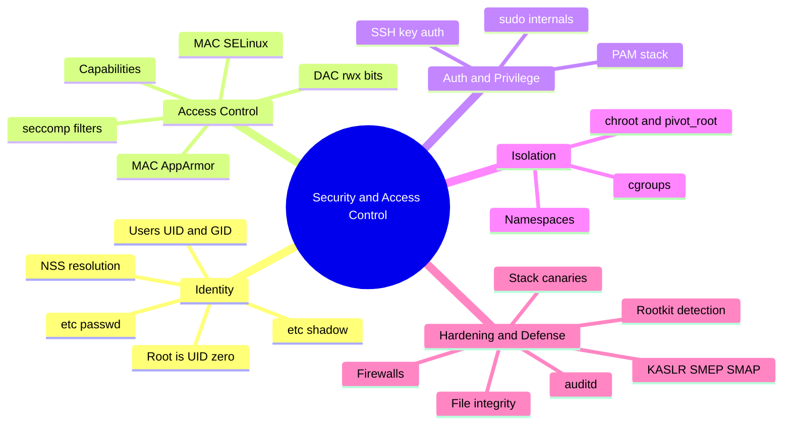
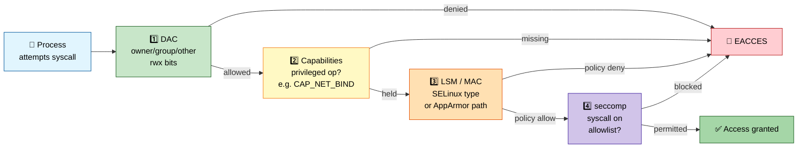
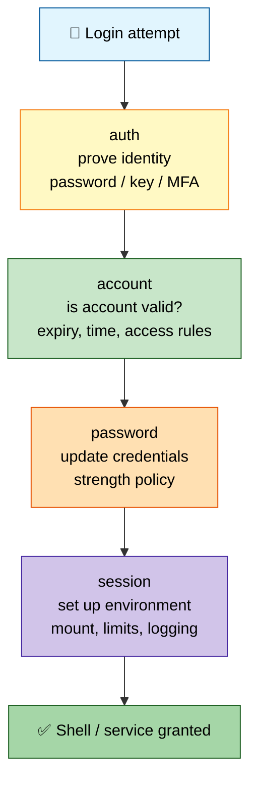
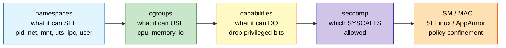
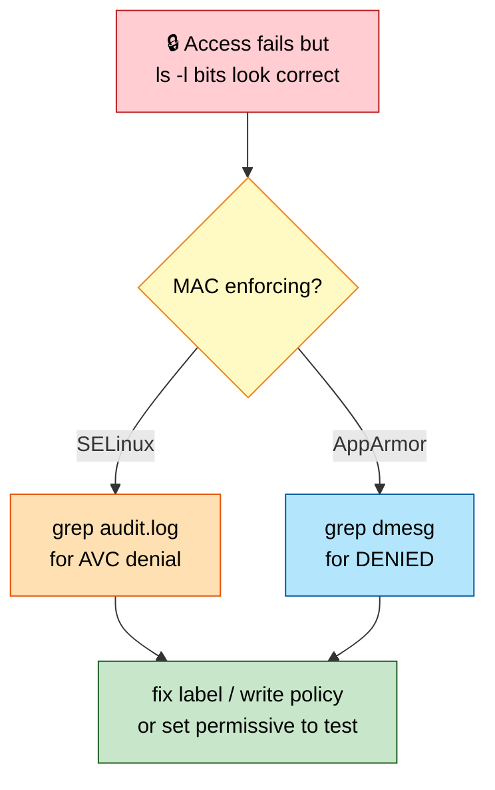
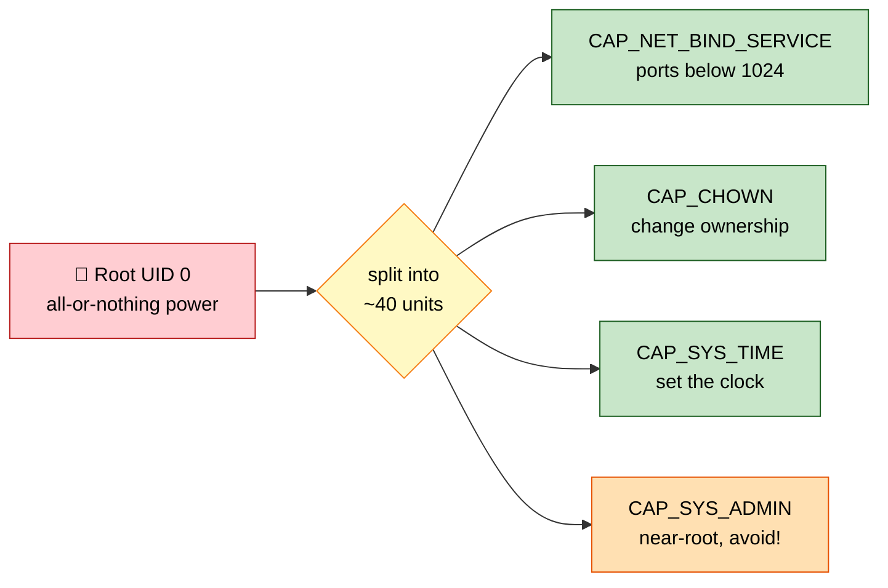

# Section 6: Linux Security & Access Control

This section covers Linux's layered security model — traditional DAC permissions, Mandatory Access
Control (SELinux/AppArmor), capabilities, seccomp, PAM, sudo internals, kernel hardening, and audit —
the material behind hardening, compliance, and "why was this access denied" interview questions.

## Subtopic Index
- [Users, Groups, UID/GID, /etc/passwd, /etc/shadow](#users-groups-uidgid-etcpasswd-etcshadow)
- [Discretionary Access Control (DAC)](#discretionary-access-control-dac)
- [Mandatory Access Control (MAC): SELinux, AppArmor](#mandatory-access-control-mac-selinux-apparmor)
- [Linux Capabilities](#linux-capabilities)
- [seccomp and seccomp-bpf](#seccomp-and-seccomp-bpf)
- [PAM (Pluggable Authentication Modules)](#pam-pluggable-authentication-modules)
- [sudo Internals](#sudo-internals)
- [chroot and pivot_root](#chroot-and-pivot_root)
- [Namespaces as Isolation Primitive (recap in security context)](#namespaces-as-isolation-primitive-recap-in-security-context)
- [cgroups for Resource Isolation](#cgroups-for-resource-isolation)
- [Kernel Hardening (KASLR, SMEP/SMAP, stack canaries)](#kernel-hardening-kaslr-smepsmap-stack-canaries)
- [Audit Framework (auditd)](#audit-framework-auditd)
- [SSH Security and Key-based Authentication](#ssh-security-and-key-based-authentication)
- [Firewalls (iptables/nftables/firewalld)](#firewalls-iptablesnftablesfirewalld)
- [File Integrity Monitoring](#file-integrity-monitoring)
- [Rootkits and Detection](#rootkits-and-detection)

---

## 🗺️ Visual Overview

**Mind map — the whole section at a glance** (skim this first, revisit it last):



**Permission decision path — every access runs this gauntlet** (highest-value diagram in the section):



**PAM stack — the four management groups run in order:**



**Container isolation — no single feature makes a container; it is the sum of these layers:**



> 🧠 **Memory hooks (mnemonics):**
> - **Permission bits:** `rwx = 4-2-1`. Add them: `7 = rwx`, `5 = r-x`, `6 = rw-`. Three digits = **owner, group, other** ("**U-G-O**, from the inside out").
> - **Check order — "DAC then MAC, then seccomp cracks":** DAC bits → Capabilities → LSM/MAC (SELinux/AppArmor) → seccomp. **Both DAC and MAC must pass; either failing denies.**
> - **The 6 namespaces — "Please Name My Users' Isolated Networks":** **P**ID, **N**et, **M**ount, **U**ser, **I**PC, **U**TS (net counted once).
> - **PAM's 4 groups — "Auntie Ate Peas at Supper":** **auth** → **account** → **password** → **session**.
> - **Container = "NoCaps Sees Less":** **N**amespaces (see) + **C**groups (use) + **Cap**abilities (do) + **S**eccomp (syscalls) + **L**SM (policy).
> - **Root ≠ unstoppable:** UID 0 bypasses **DAC**, but **MAC still constrains it**. "Root owns the house, SELinux owns the locks."

---

## Users, Groups, UID/GID, /etc/passwd, /etc/shadow

> 🎯 **Interview weight: High** — identity is the root of every permission decision; expect UID/GID and passwd/shadow questions early.

**In one line:** A process's security identity is a numeric **UID** plus one or more **GIDs**; the kernel only ever checks numbers, while names, hashes, and aging metadata live in userspace files.

**The identity model:** Every Linux process runs with a numeric **UID** (user ID) and one or more **GIDs** (group IDs). The kernel *only* checks numeric IDs for permission decisions — usernames are purely a userspace convenience, resolved via **NSS** (`/etc/passwd` locally, or LDAP/SSSD in enterprise environments) for human readability.

**Where identity data lives:**

| File | Contents | Readability |
|------|----------|-------------|
| `/etc/passwd` | username → UID, primary GID, home dir, login shell | World-readable by design (UIDs/usernames aren't secret; many tools resolve them) |
| `/etc/shadow` | salted, iterated password hash + aging metadata | Root-only (or via setuid `passwd`/`login`/`sshd`) |
| `/etc/group` | group definitions + membership | World-readable |

**Why hashes moved to `/etc/shadow`:** `/etc/passwd` *historically* stored password hashes directly — a serious weakness once the file had to stay world-readable for other purposes. Hashes now live in `/etc/shadow`, storing a salted, iterated hash (commonly **SHA-512-crypt** or, increasingly, **yescrypt**) alongside aging metadata: last change date, minimum/maximum age, warning period, and inactivity/expiration.

**UID conventions to know cold:**

- **UID 0 is always root** — bypasses essentially all **DAC** checks (but *not necessarily* MAC checks — SELinux/AppArmor below can constrain even root).
- **UIDs below ~1000** (distro-specific threshold) are reserved for system/service accounts, usually configured with no valid login shell (`/sbin/nologin` or `/bin/false`) so they can own and run processes/files without being usable for interactive login.

> ⚠️ **Gotcha:** Group membership is captured into a process's **credentials** at authentication time, not re-queried on every access check. A `usermod` group change generally requires a **new login session** to take effect for already-running processes — the secondary DAC "group" bit check uses the groups the process was born with.

### Key commands
```
id                                # current process's UID, GID, and full supplementary group list
getent passwd <user>                # resolve a user via NSS (works with LDAP/SSSD too, not just /etc/passwd)
chage -l <user>                      # password aging policy/status for a user
awk -F: '$3<1000{print $1,$3}' /etc/passwd   # list system/service accounts by UID convention
```

## Discretionary Access Control (DAC)

> 🎯 **Interview weight: High** — the rwx model is table stakes, and *why DAC alone is insufficient* sets up the entire MAC discussion.

**In one line:** **DAC** is the classic UNIX model where a resource's *owner* discretionarily decides who else may access it — powerful, familiar, and fundamentally unable to enforce a system-wide security policy.

**How it works:** A file's owner grants or restricts read/write/execute access to themselves, their group, and everyone else via the classic **rwx** bits (extended by ACLs for finer control, covered in Section 4). The discretion is *entirely* the owner's choice — nothing in the DAC model stops an owner from making their own file world-writable, wise or not.

**DAC's fundamental limitation** (from a hardening perspective):

- A **compromised process** running as a legitimate, unprivileged user can access or modify anything that user is permitted to touch.
- A careless or buggy application can accidentally over-grant access to its own files, with no system-wide policy stopping it.
- The kernel enforces whatever bits exist but has *no independent opinion* about whether those bits represent a sound policy.

**This is exactly the gap MAC closes:** **Mandatory Access Control** adds a second, independent check layered *on top of* (never replacing) DAC, enforced by system policy rather than owner discretion. Even a root process — or a file whose owner mistakenly granted overly broad DAC permissions — stays constrained by rules a system administrator defines centrally and that users/processes cannot override.

> 🧠 **Mental model:** DAC-then-MAC layering means **both checks must pass; either one failing denies access.** Checking `ls -l` bits alone is insufficient on a MAC-enabled system — a DAC-permitted access can still be denied by SELinux/AppArmor. This trips up engineers seeing MAC for the first time.

### Key commands
```
ls -l <file>                     # traditional DAC permission bits
namei -l /path/to/file             # walk and show DAC permissions at every component of a path
stat <file>                         # full DAC metadata: owner, group, mode, in one view
```

## Mandatory Access Control (MAC): SELinux, AppArmor

> 🎯 **Interview weight: High** — SELinux vs AppArmor and "check AVC denials" is a staple of hardening and troubleshooting rounds.

**In one line:** **MAC** enforces a system-wide policy that ordinary users and even root cannot override through DAC changes, implemented on Linux via two distinct, non-interoperable frameworks: **SELinux** and **AppArmor**.

**SELinux** (Security-Enhanced Linux — originally NSA, default on RHEL/Fedora/CentOS) implements **Type Enforcement**:

- Every process runs within a security **domain**; every file/resource carries a security **type** (both stored as a `security.selinux` extended attribute, per Section 4).
- Policy rules explicitly and exhaustively state which domains may perform which operations (read, write, execute, connect…) on which types.
- **Default-deny** — anything not explicitly permitted is denied (a genuine allowlist-only model).
- *Strength:* a compromised process, even root within its confined domain, cannot touch resources its domain's policy never granted — regardless of DAC.
- *Cost:* steep learning curve — writing/troubleshooting policy means understanding domains, types, and a large generated rule set.

**AppArmor** (default on Ubuntu/SUSE) takes a simpler, **path-based** approach:

- Profiles are attached per-binary (not stored as file metadata, avoiding the xattr-preservation pitfalls SELinux labeling hits during backup/restore).
- Each profile explicitly lists the file paths, capabilities, and network operations that program may use.
- Generally easier to read, write, and reason about — but coarser-grained, path-based rather than SELinux's abstract type-based policy.

**Shared traits:** Both support a **permissive/complain mode** (log what *would* be denied without enforcing — essential for developing policy without breaking production) alongside full **enforcing mode**.

> 🔍 **Under the hood:** Both frameworks are frequently the real root cause behind confusing "permission denied" errors on services with entirely correct DAC ownership and mode bits. Checking `audit.log`/`dmesg` for **AVC denial** (SELinux) or **DENIED** (AppArmor) messages is an essential, often-skipped first step whenever DAC looks correct but access still fails.



### Key commands
```
getenforce                          # current SELinux mode (Enforcing/Permissive/Disabled)
ausearch -m avc -ts recent            # find recent SELinux denials from the audit log
sealert -a /var/log/audit/audit.log    # (setroubleshoot) human-readable explanation of SELinux denials
aa-status                              # current AppArmor profile status (enforce/complain per profile)
aa-complain /path/to/profile             # switch an AppArmor profile to complain (log-only) mode
```

## Linux Capabilities

> 🎯 **Interview weight: High** — capabilities are central to container hardening; expect "how do you avoid running as root?"

**In one line:** **Capabilities** decompose root's monolithic all-or-nothing privilege into ~40 independently grantable units, so a binary gets exactly the narrow slice of power it needs.



**The problem they solve:** Traditional UNIX privilege was binary — a process either ran as root (UID 0, bypassing essentially every DAC and many other checks) or as an unprivileged user (fully checked, no special abilities). That forced any program needing even *one* narrow privileged operation (binding to a port below 1024, changing ownership, adjusting the clock) to run fully as root — vastly over-granting privilege.

**The decomposition** — some capabilities worth knowing by name:

| Capability | Grants |
|-----------|--------|
| `CAP_NET_BIND_SERVICE` | Bind to privileged ports (<1024) |
| `CAP_SYS_TIME` | Change the system clock |
| `CAP_CHOWN` | Change file ownership regardless of DAC |
| `CAP_NET_ADMIN` | Network configuration changes |
| `CAP_SYS_ADMIN` | Broad, catch-all — many miscellaneous privileged ops; effectively near-root and a prime container-escape target |

Grants are applied to a specific binary via **file capabilities** (`setcap`, stored as an xattr on the executable) — analogous to the older, cruder setuid-root pattern but far more precisely scoped.

**Capabilities are tracked per-process across several sets:**

- **Permitted** — capabilities the process is *allowed* to use (a ceiling).
- **Effective** — currently active/in-use, checked at the actual point of a privileged operation.
- **Inheritable** — which capabilities survive across `execve()` to a child.
- **Ambient** — enables capabilities to be inherited by unprivileged children in specific controlled scenarios.

> 💡 **Interview tip:** Container runtimes lean heavily on **capability dropping** (`--cap-drop=ALL --cap-add=...`). Docker's default set is already reduced relative to true root, but broader than most app containers need — explicitly reducing to only the handful a workload requires shrinks the attack surface.

### Key commands
```
getcap /path/to/binary               # show capabilities granted to a specific executable
setcap cap_net_bind_service=+ep /path/to/binary   # grant a specific capability to a binary
capsh --print                          # show the current shell/process's full capability sets
cat /proc/<pid>/status | grep Cap        # raw hex-encoded capability sets for a running process
```

## seccomp and seccomp-bpf

> 🎯 **Interview weight: High** — seccomp vs capabilities vs MAC is a classic "layered defense" question.

**In one line:** **seccomp** (secure computing mode) restricts *which syscalls a process may invoke at all*, bounding the damage even after an attacker achieves arbitrary code execution.

**Why it's defense-in-depth:** Even a fully compromised, code-executing process cannot escalate through a syscall its seccomp filter refuses to allow — regardless of what permission checks that syscall would otherwise pass.

**The two modes:**

- **Strict mode** (original) allowed only `read`, `write`, `_exit`, and `sigreturn` — extremely safe but far too restrictive for almost any real application.
- **seccomp-bpf** (used in practice today by Docker, systemd's `SystemCallFilter=`, Chrome's sandbox, most container runtimes) attaches a small, kernel-verified **BPF** program that inspects each attempted syscall's number and arguments and returns a decision.

> 🔍 **Under the hood:** seccomp-bpf's filter is structurally similar in spirit to classic packet-filter BPF — predating and distinct from modern **eBPF**'s general kernel-hook framework, though sharing the same instruction-verification philosophy.

**seccomp-bpf decisions per syscall:** allow · deny with an error · kill the process · trap into a monitoring process for complex policy. This enables a nuanced allowlist (or denylist) of specific syscalls — and even specific argument value patterns — with minimal overhead, since the filter executes directly in-kernel at syscall entry rather than requiring a context switch to a separate monitor for every check.

**Default profiles:** Container runtimes ship one (Docker's default blocks several dozen rarely-needed, higher-risk syscalls — `clone` with dangerous namespace flags, kernel module loading, various obscure/legacy syscalls) to reduce the effective kernel attack surface without needing to predict which specific vulnerability an attacker might exploit.

> 🧠 **Mental model:** Three complementary layers — **capabilities** govern *what a syscall may do* once invoked; **MAC** governs *what resources* a process may access; **seccomp** governs *which syscalls exist at all* as attack surface.

### Key commands
```
docker run --security-opt seccomp=/path/to/profile.json ...   # apply a custom seccomp profile to a container
systemctl show <unit> -p SystemCallFilter                       # check a systemd unit's seccomp syscall filter
strace -f -e trace=seccomp ./program                              # observe seccomp filter installation
cat /proc/<pid>/status | grep Seccomp                               # confirm seccomp mode active for a process (0=off,1=strict,2=filter)
```

## PAM (Pluggable Authentication Modules)

> 🎯 **Interview weight: High** — PAM sits under every login path; misconfiguration is a classic total-lockout incident.

**In one line:** **PAM** decouples authentication *policy* from the applications that authenticate, so admins change or layer auth mechanisms system-wide by editing config rather than modifying every program.

**What PAM separates:** How a user proves identity — and under what additional conditions (time-of-day restrictions, lockout after failed attempts, password complexity) — is decoupled from the applications (`login`, `sshd`, `sudo`, `su`, display managers) that need it.

**How the stack is built:** Each PAM-aware application consults its own file under `/etc/pam.d/` (falling back to `/etc/pam.d/other` if none exists), listing a stack of modules grouped into four **management groups**:

| Group | Responsibility |
|-------|----------------|
| `auth` | Verify identity — password checking, increasingly 2FA/hardware-key modules stacked alongside or instead |
| `account` | Non-auth validity checks — is the account expired, locked, or time-restricted? |
| `password` | Handling password changes; enforcing complexity/history policy |
| `session` | Setup/teardown around a session — mount home dir, set resource limits, write `lastlog`, `pam_systemd` registers with `logind` |

**Control values** tag each entry — `required`, `requisite`, `sufficient`, `optional` — governing how that module's success/failure affects the stack's final decision. This lets sophisticated policies be expressed declaratively (e.g., "succeed if a valid password OR a valid hardware-key challenge is provided, but always still check the account isn't locked regardless").

**Common system-wide policies PAM enforces:**

- `pam_pwquality` — password complexity
- `pam_faillock` / `pam_tally2` — lock after N failed attempts
- `pam_sss` (SSSD-backed LDAP/AD) / `pam_ldap` — centralized authentication
- `pam_time`, `pam_limits` — time-based or per-user `ulimit` restrictions at login

> ⚠️ **Gotcha:** A misconfigured PAM stack (a typo in a module path, an overly strict `requisite` failing unexpectedly) can lock out *every* authentication path at once — including `su`/`sudo` to fix it. This is exactly why PAM changes are conventionally tested in a still-open secondary session before the original session is ever closed.

### Key commands
```
cat /etc/pam.d/sshd                # PAM stack configuration for a specific service
cat /etc/pam.d/common-auth            # (Debian-family) shared auth stack included by multiple services
pamtester login someuser authenticate   # test a PAM stack's authentication path directly, without a real login
faillock --user someuser                 # (pam_faillock) check/reset a user's failed-login lockout status
```

## sudo Internals

> 🎯 **Interview weight: High** — sudoers, setuid, and the audit-trail rationale come up constantly in privilege-escalation questions.

**In one line:** `sudo` is a setuid-root binary that authenticates the *invoking* user, checks `/etc/sudoers` policy, then `execve()`s the requested command as the target user — giving individually attributable privilege escalation.

**Where policy lives:** Rules are in `/etc/sudoers` and `/etc/sudoers.d/` drop-in files (now the preferred way to add rules without editing the main file). Always edit with `visudo`, which parses and syntax-checks before saving — specifically to prevent a broken sudoers file from locking out *all* privilege escalation.

**What happens internally on invocation:**

1. `sudo` is itself **setuid-root** — it runs with effective UID 0 regardless of the invoker's real UID, giving it the kernel privilege to eventually `execve()` the target command.
2. It authenticates the invoking user — by default requiring *their own* password, not the target user's.
3. On success it caches authentication for a configurable timeout (commonly 5 or 15 minutes) via a per-user, per-terminal timestamp file under `/var/run/sudo/` — which is why repeated `sudo` calls within that window don't re-prompt.
4. It consults the parsed sudoers policy to determine whether the requested command, as the requested target user, on this specific host, is permitted for this user or one of their groups.

**Granular scoping:** Rules can specify command paths with specific arguments, target users/groups, and specific hosts (relevant for a shared sudoers file distributed via config management). Modifiers like `NOPASSWD` skip the re-prompt for matching rules — handy for narrowly-scoped automation, but a meaningfully increased risk if applied broadly.

> 💡 **Interview tip:** The real reason `sudo` beats sharing the root password: **every** successful or failed invocation is logged (to syslog/journald, and optionally a full session transcript via `Defaults log_input,log_output`). Each elevation is attributable to a specific user, not "someone who knew the root password."

### Key commands
```
sudo -l                            # list the commands the current user is permitted to run via sudo
visudo                              # safely edit /etc/sudoers with syntax validation before saving
sudo -k                              # invalidate the cached authentication timestamp immediately
journalctl -u sudo / grep sudo /var/log/auth.log   # audit trail of sudo invocations
```

## chroot and pivot_root

> 🎯 **Interview weight: Medium** — foundational to container filesystem isolation and a common "why isn't chroot enough?" question.

**In one line:** `chroot()` changes a process's *apparent* filesystem root (weak, escapable); `pivot_root()` actually swaps the root mount so the old root can be fully unmounted (stronger).

**`chroot()` — the primitive form:** After the call, the process (and children) can no longer reference paths outside the new root via absolute paths, since the kernel resolves `/` itself to the new location for that process. This was the original filesystem-level isolation — historically used to sandbox network-facing daemons (a classic pattern: an FTP or DNS server chrooted into a minimal directory) and still used today as *one* ingredient (with namespaces and cgroups) in container isolation.

> ⚠️ **Gotcha:** `chroot()` alone is a notoriously weak, incomplete security boundary. A root process inside a chroot can often escape it entirely — classic techniques include creating device nodes to access raw disk devices, or calling `chroot()` a second time with directory-traversal tricks. Modern container isolation *never* relies on `chroot()` alone.

**What real isolation adds on top of chroot:**

- **Mount namespaces** — so the process's mount *table* itself is isolated, not just its apparent root.
- **User namespaces** — removing genuine root privilege even if escape were otherwise possible.
- Other namespace/cgroup primitives layered together.

**`pivot_root()` — the robust operation** (used by `switch_root` during the initramfs boot sequence, per Section 1, and internally by some container runtimes): rather than merely changing what path resolves to `/`, it *swaps* the process's current root mount with a new one, moving the **old** root to a specified location where it can then be explicitly unmounted and detached — instead of leaving it inaccessible-but-still-present the way `chroot()` does. That full unmount is what closes off the escape vectors relying on the old root still being mounted somewhere in the mount namespace.

### Key commands
```
chroot /path/to/newroot /bin/bash    # manually chroot into a directory (testing/rescue use)
unshare --mount --pivot-root=/new / bash   # combine a mount namespace with pivot_root for stronger isolation
cat /proc/<pid>/root                   # symlink showing a process's actual chroot'd root, if any
```

## Namespaces as Isolation Primitive (recap in security context)

> 🎯 **Interview weight: High** — the user namespace is *the* security-critical container primitive; expect "is running as root in a container dangerous?"

**In one line:** From a security angle, the **user namespace** is the standout — it can make a process's apparent root privilege genuinely meaningless outside its own namespace.

*(Namespaces themselves are covered in networking/virtualization detail elsewhere; this entry focuses specifically on their role as **security** isolation primitives.)*

**Why the user namespace (`CLONE_NEWUSER`) matters most:** A process can have UID 0 (root) *inside* its own user namespace — able to perform operations that normally require root within that namespace's scope — while being mapped to an entirely unprivileged, ordinary UID on the host outside it, via an explicit UID/GID mapping (`/proc/<pid>/uid_map`) established by whatever privileged process created the namespace.

**This is what makes "rootless containers" possible:** a container process can believe it's root (satisfying apps that hard-require root — binding privileged ports, changing ownership within its own filesystem) while a genuine host-level compromise of that "root" only grants the attacker the underlying unprivileged host UID's actual privileges — dramatically limiting blast radius versus a container running with real host-root.

**The other namespace types** (PID, network, mount, UTS, IPC, cgroup) each independently isolate a specific resource *view* rather than a privilege level.

> ⚠️ **Gotcha:** Reasoning about a container's true security posture requires considering the *full combination* in use, not any single namespace. A container with an isolated PID namespace but **no user namespace** (still running as genuine host root) provides essentially zero meaningful privilege isolation despite the process tree looking isolated.

> 💡 **Interview tip:** User namespace adoption was historically slower than other namespace types due to real compatibility friction with some tooling/filesystems — making it one of the most security-relevant *and* most under-deployed hardening steps available for container workloads.

### Key commands
```
unshare --user --map-root-user bash    # create a user namespace where you appear as root, but aren't on the host
cat /proc/<pid>/uid_map                  # inspect the UID mapping for a process's user namespace
podman run --userns=auto ...               # example of a container runtime defaulting toward rootless/user-namespaced execution
lsns -t user                                # list active user namespaces on the system
```

## cgroups for Resource Isolation

> 🎯 **Interview weight: Medium** — the security angle is availability/DoS protection and fork-bomb containment, a favorite scenario question.

**In one line:** From a security standpoint, **cgroups** aren't about access control — they're about **availability**: hard, kernel-verified ceilings that stop one workload from starving every other.

*(cgroups' resource-*limiting* mechanics are covered in Sections 2/3/9; this entry focuses on their role in the security/isolation model.)*

**The DoS gap they close:** Without resource limits, any single process — malicious, buggy, or just a noisy neighbor in a multi-tenant host — can consume unbounded CPU, memory, PIDs, or I/O bandwidth, degrading or denying service to every other legitimate workload. cgroups enforce hard ceilings per workload that no amount of application-level misbehavior can exceed, regardless of DAC/MAC outcomes for that process.

**The PID controller** deserves special note as a frequently-overlooked hardening measure:

- Without a `pids.max` limit, a **fork-bomb** (a process repeatedly forking itself with no bound) can exhaust the entire system's PID space — denying service to every other process, including the ability to spawn a shell to diagnose or fix it.
- A per-cgroup PID limit contains this to the offending cgroup alone: the rest of the system keeps operating while the runaway cgroup simply fails to fork further once it hits its ceiling.

> 🧠 **Mental model:** Three complementary pillars of container security — **namespaces** (view isolation) + **MAC/capabilities** (permission isolation) + **cgroups** (resource isolation). No single one alone constitutes meaningful isolation; a security review should verify all three are configured, not assume "it's in a container" implies comprehensive isolation.

### Key commands
```
cat /sys/fs/cgroup/<path>/pids.max         # PID limit for a cgroup (fork-bomb containment)
cat /sys/fs/cgroup/<path>/pids.current       # current process count in a cgroup
systemd-run --scope -p PIDsLimit=100 command   # launch a command in a cgroup with an enforced PID limit
```

## Kernel Hardening (KASLR, SMEP/SMAP, stack canaries)

> 🎯 **Interview weight: Medium** — memory-corruption mitigations distinguish depth; know what each one defeats.

**In one line:** Beyond access-control policy, the kernel ships several defense-in-depth mitigations that make inevitable memory-corruption bugs substantially *harder to reliably exploit* rather than assuming they never occur.

**KASLR (Kernel Address Space Layout Randomization):** Randomizes the kernel's own load address at each boot, defeating exploits that depend on a fixed, predictable kernel code/data address to redirect execution toward. Return-oriented programming gadgets, for instance, require knowing exactly where useful instruction sequences live — without the randomized base, an otherwise-working exploit typically fails outright.

> ⚠️ **Gotcha:** Information-disclosure side-channel bugs have historically been used to *defeat* KASLR by leaking the actual randomized base address, then chaining a separate memory-corruption exploit.

**SMEP / SMAP** — CPU-*hardware* features (not purely kernel-software) the kernel enables:

| Feature | Prevents the kernel, while in supervisor mode, from… |
|---------|------------------------------------------------------|
| **SMEP** (Supervisor Mode Execution Prevention) | Executing code located in user-space memory |
| **SMAP** (Supervisor Mode Access Prevention) | Dereferencing data located in user-space memory |

Together they directly close a once-common technique: an attacker plants malicious "kernel-mode" shellcode in ordinary, easily-controlled user-space memory, then redirects a vulnerable kernel code path there. Without SMEP/SMAP the kernel would happily execute or read/write that attacker-controlled memory as if legitimate.

**Stack canaries** — a compiler-inserted mitigation (not kernel-specific, though the kernel is compiled with them too) against classic stack-buffer-overflow attacks:

- A random, secret value is placed on the stack between local variables and the saved return address at function entry.
- It's checked for corruption immediately before the function returns.
- An overflow attempting to overwrite the return address must first overwrite the canary — a mismatch triggers immediate, controlled termination rather than using the corrupted return address, converting a potentially exploitable bug into a reliable crash.

### Key commands
```
cat /proc/sys/kernel/kptr_restrict     # controls whether kernel addresses are hidden from unprivileged /proc reads
dmesg | grep -i "kernel base"            # (if exposed) confirm KASLR randomized load address differs across boots
cat /proc/cpuinfo | grep -o 'smep\|smap'   # confirm CPU/kernel support for SMEP/SMAP
readelf -d <binary> | grep -i stack        # (indirectly) confirm stack-protector related symbols in a compiled binary
```

## Audit Framework (auditd)

> 🎯 **Interview weight: Medium** — compliance and forensics questions lean on auditd; know syscall vs file-watch rules.

**In one line:** The Linux **Audit** subsystem provides fine-grained, kernel-level logging of security-relevant events — a tamper-evident record of *what actually happened* that's distinct from application/syslog logging.

**What it captures and why it's different:** Syscalls matching configured rules, file access to watched paths, and PAM authentication events — kernel-level truth (which syscalls were invoked, by which UID, against which file) rather than whatever an application chose to log about its own higher-level view. When properly configured with immutable log rotation and remote log shipping it's tamper-evident, essential for compliance regimes (PCI-DSS, HIPAA, common criteria) and genuine incident forensics.

**Two main rule categories** (configured via `auditctl`, or persisted in `/etc/audit/rules.d/` to survive reboot):

| Rule type | What it watches | Example |
|-----------|-----------------|---------|
| **Syscall rules** | Specific syscalls, optionally filtered by architecture, arguments, or calling UID/UID-range | Watch every `execve` by UID 0, or every ownership/permission change system-wide |
| **File-watch rules** | A specific path for write/attribute-change access, tagged with a searchable key | `-w /etc/shadow -p wa -k identity` |

**The daemon:** `auditd` receives events from the kernel and writes them to `/var/log/audit/audit.log` in a structured, `ausearch`/`aureport`-queryable format designed for forensic correlation — a single logical action (like a file access denial) often generates several related records that must be correlated by a shared event ID/timestamp to reconstruct the full picture.

> ⚠️ **Gotcha:** A full, unfiltered audit config can generate enormous log volume at significant performance cost. Real-world rule design is a deliberate balance between comprehensively capturing security-relevant events and avoiding overwhelming storage/processing with low-value noise from routine, benign activity.

### Key commands
```
auditctl -w /etc/shadow -p wa -k shadow_changes   # watch a specific file for write/attribute-change access
ausearch -k shadow_changes                          # search audit log for events matching a specific rule key
aureport --auth --summary                            # summarized report of authentication events
ausearch -m avc -ts today                              # search for today's SELinux AVC denial events specifically
```

## SSH Security and Key-based Authentication

> 🎯 **Interview weight: High** — SSH hardening and key-auth asymmetry are near-universal in practical interviews.

**In one line:** Public-key SSH auth's core strength is **asymmetry** — the server verifies you hold the private key without the private key ever being transmitted.

**How key-based auth works:** A user generates a public/private key pair, keeps the private key secret (ideally passphrase-encrypted and/or held in a hardware key/TPM rather than a bare file on disk), and places only the **public** key in the target account's `~/.ssh/authorized_keys`. Authentication is a challenge-response exchange: the server, holding only the public key, verifies the client possesses the corresponding private key (by checking a signature the client computes over server-provided challenge data) — the private key never leaves the client.

**Why it beats passwords:** With password auth the secret itself must be transmitted (even inside an encrypted channel) and is vulnerable to guessing/brute-force/credential-stuffing — a way a sufficiently large private key simply isn't.

**`sshd_config` hardening conventions:**

| Setting | Effect |
|---------|--------|
| `PasswordAuthentication no` | Force key-based auth for all interactive access |
| `PermitRootLogin no` | Force admins to log in as an unprivileged user then `sudo`/`su` — preserving individual accountability |
| `AllowUsers` / `AllowGroups` | Restrict which users/groups may connect at all |

**Jump-host access — two approaches:**

- **Agent forwarding (`ForwardAgent yes`)** lets a private key held only on your local machine authenticate onward from an intermediate jump host without copying the key there. Convenient, but a real risk if the intermediate host is compromised — a malicious root there can, for the session's duration, ask the forwarding agent to sign arbitrary further challenges on your behalf (without ever obtaining the key bytes).
- **`ProxyJump`** (replacing older manual double-hop `ssh`) is the preferred modern alternative: it establishes a direct, end-to-end encrypted tunnel through the jump host without agent forwarding's broader trust extension.

> ⚠️ **Gotcha:** Host key verification (the "authenticity of host … can't be established" prompt, recorded in `~/.ssh/known_hosts`) exists specifically to detect man-in-the-middle attacks. Blindly accepting unknown host keys (`StrictHostKeyChecking no`, sometimes used carelessly in automation) defeats this entirely — pre-provision known, trusted host keys through a secure out-of-band channel where automation needs non-interactive SSH.

### Key commands
```
ssh-keygen -t ed25519 -a 100          # generate a modern, strong key pair (Ed25519, high KDF work factor)
ssh-copy-id user@host                   # securely install a public key into a remote account's authorized_keys
sshd -T | grep -iE 'passwordauth|permitrootlogin'   # confirm effective (post-include-merge) sshd hardening settings
ssh -J bastion-host target-host           # ProxyJump through a bastion without needing agent forwarding
```

## Firewalls (iptables/nftables/firewalld)

> 🎯 **Interview weight: Medium** — host-firewall policy and "firewall vs app auth" come up in hardening discussions.

**In one line:** A host firewall enforces which network traffic is permitted to/from a host — always ultimately via **netfilter** hooks, whether configured through raw `iptables`/`nftables` or a higher-level layer like `firewalld`.

*(The packet-filtering engine itself, netfilter, is covered in networking detail in Section 5; this entry focuses on the operational/security-policy layer built on top.)*

**`firewalld`** — the default higher-level management daemon on many modern distros (RHEL/Fedora/CentOS family):

- Provides a **zone-based** abstraction — predefined trust levels (`public`, `internal`, `trusted`, `dmz`), each with different default policies.
- Offers dynamically reloadable configuration — rule changes apply without dropping established connections, unlike a naive full `iptables-restore` of a new rule set (which briefly clears all state including connection tracking).
- Under the hood still generates and manages the same underlying nftables/iptables rules, organized around a more operationally friendly, service-and-zone-oriented model.

**A well-hardened host firewall follows default-deny:**

- Reject/drop all inbound traffic by default.
- Explicitly allow-list only the specific ports/services genuinely needed (SSH, plus whatever the host's role requires).
- Apply source-address restrictions wherever the legitimate client set is known and bounded — an internal DB server has no reason to accept public-internet connections, and a source-restricted rule closes that exposure regardless of the app's own authentication.

> 🧠 **Mental model:** A firewall is defense-in-depth, **not** a substitute for app-level authentication/authorization. It reduces the *exposed attack surface* (which services are reachable, from where) but does nothing to protect a genuinely vulnerable exposed service from a client it legitimately permits — which is why firewall hardening always pairs with, never replaces, DAC/MAC/capabilities/seccomp.

### Key commands
```
firewall-cmd --list-all               # current firewalld zone configuration and allowed services/ports
firewall-cmd --permanent --add-service=https --zone=public   # persistently allow a service in a zone
firewall-cmd --reload                   # apply persistent changes without dropping existing connections
nft list ruleset                          # inspect the actual underlying nftables rules firewalld manages
```

## File Integrity Monitoring

> 🎯 **Interview weight: Medium** — FIM detects the in-place-binary-tampering that network/process monitoring misses.

**In one line:** **FIM** detects unauthorized changes to critical system files by comparing them against a trusted baseline of cryptographic hashes and metadata.

**How it works:** FIM maintains a trusted baseline of cryptographic hashes (plus permissions, ownership, size, timestamps) for a defined set of monitored paths — binaries, config files, kernel modules — then periodically (or, for sophisticated tools, near-real-time via kernel-level file access hooks) recomputes and compares to surface drift. Tools like **AIDE** (Advanced Intrusion Detection Environment) and **Tripwire** build and store this baseline database, typically run on a schedule (a cron job or systemd timer triggering a scan/diff), with results reviewed by staff or fed into a SIEM for alerting.

> ⚠️ **Gotcha:** The baseline must be stored somewhere the monitored system *cannot* tamper with — ideally read-only or off-host storage. A baseline on the same, potentially-compromised host provides no real guarantee if an attacker with sufficient privilege can simply update it to match their own malicious changes.

**Why FIM catches what other monitoring misses:** It detects a category of compromise that network/process-based monitoring can miss entirely — a rootkit or backdoor that modifies a legitimate system binary *in place* (replacing `/bin/ps` or `/usr/sbin/sshd` with a trojaned version that behaves normally but hides the attacker's processes or provides a hidden backdoor). Such a binary is designed to lie convincingly to whatever's asking — but its cryptographic **hash will not match** the known-good baseline regardless of how it behaves.

> 💡 **Interview tip:** Establishing the baseline itself — at a moment of known-good system state, via a trustworthy, tamper-resistant mechanism — is the single most operationally critical step in making FIM meaningful at all.

### Key commands
```
aide --init                          # build the initial trusted baseline database
aide --check                           # compare current filesystem state against the baseline, report drift
sha256sum /bin/ps /usr/sbin/sshd         # manual, ad-hoc integrity spot-check against known-good hashes
rpm -Va / dpkg --verify <package>          # package-manager-native integrity verification against installed package manifests
```

## Rootkits and Detection

> 🎯 **Interview weight: Medium** — the userspace-vs-kernel rootkit distinction and "why prevention beats detection" show real depth.

**In one line:** A **rootkit** maintains privileged, persistent access while actively *hiding its own presence* — that active concealment, not the malicious capability itself, is what distinguishes it from ordinary malware.

**Userspace rootkits** — detectable, if you cross-check:

- Replace common system binaries (`ps`, `ls`, `netstat`) with trojaned versions that filter their own malicious processes/files/connections out of the output.
- Or use `LD_PRELOAD` to inject a malicious shared library intercepting/filtering common libc calls (`readdir()`, `opendir()`) system-wide.
- Both are detectable via **FIM** (replaced binaries/library won't match known-good hashes) and by cross-checking through independent tools the rootkit didn't anticipate — e.g., comparing `ps` output against a raw `/proc` listing, since a rootkit filtering `ps` often fails to also filter every alternative way of enumerating `/proc`.

**Kernel-level rootkits** — substantially more dangerous:

- Operate as a malicious loadable kernel module (or via kernel-memory-patching) that can lie about *any* information the kernel provides to *any* userspace tool.
- If sufficiently sophisticated, they subvert `/proc` and `/sys` themselves at the source — meaning **no purely userspace-level cross-check can reliably detect them**, since every information source userspace could consult is itself under the compromised kernel's control.

**Detecting a sophisticated kernel rootkit** therefore requires:

- **Offline/out-of-band analysis** — boot from trusted external media and inspect the suspect disk without executing its potentially-compromised kernel, or compare memory/disk state against a trusted baseline from outside the running system.
- **Specialized kernel integrity tooling** — Secure Boot with kernel lockdown (Section 1) prevents unsigned/unauthorized modules from loading in the first place, functioning as *prevention* rather than after-the-fact detection.

> 🧠 **Mental model:** For high-value systems the mature posture emphasizes **prevention** (Secure Boot, kernel lockdown, mandatory module signing, minimized attack surface) far more than reactive rootkit-hunting — because a sufficiently capable kernel-level compromise can, in the worst case, make detection *from within the running system* fundamentally unreliable.

### Key commands
```
rkhunter --check                    # userspace rootkit-hunting tool: known-signature and heuristic checks
chkrootkit                            # alternative userspace rootkit scanner
lsmod                                  # inspect loaded kernel modules for anything unexpected/unsigned
mokutil --list-enrolled                 # confirm which keys are trusted for module signing (prevention layer)
```

---

### Interview Questions

**Conceptual/Internals (8)**

1. **What is the fundamental difference between DAC and MAC, and why does a system need both?**
   DAC lets a resource's owner decide access at their own discretion (traditional rwx bits/ACLs), with
   no independent check on whether that discretion represents sound security policy. MAC layers a
   second, system-policy-enforced check (SELinux/AppArmor) that ordinary users, and even root, cannot
   override through DAC changes alone — both checks must pass for access to be granted, closing the
   gap where a compromised process or careless owner could otherwise over-grant access purely through
   DAC.

2. **Explain Linux capabilities and the problem they solve versus traditional root/non-root.**
   Traditional UNIX privilege was all-or-nothing: any program needing even one privileged operation
   had to run fully as root. Capabilities decompose root's monolithic privilege into ~40 independently
   grantable units (binding privileged ports, changing ownership, adjusting the clock, etc.), letting a
   binary be granted only the narrow privilege it actually needs via file capabilities, substantially
   reducing the blast radius of a compromise compared to full root.

3. **What does seccomp actually restrict, and how does it differ from capabilities?**
   Capabilities govern what a syscall is allowed to *do* once invoked (fine-grained privilege).
   Seccomp instead restricts *which syscalls can be invoked at all*, providing defense-in-depth for the
   scenario where an attacker already has code execution — even with full capabilities, a seccomp
   filter can block an entire syscall from being called, closing off attack surface regardless of what
   that syscall's own permission checks would otherwise allow.

4. **How does public-key SSH authentication avoid ever transmitting the private key, and why is
    that stronger than password authentication?**
   The server holds only the public key and issues a challenge; the client signs it using the private
   key locally and returns the signature, which the server verifies using the public key alone — the
   private key itself never leaves the client. This avoids the fundamental weakness of password
   authentication, where the secret itself (even encrypted in transit) must ultimately be presented and
   is vulnerable to guessing, reuse, and credential-stuffing attacks in a way a sufficiently strong key
   pair isn't.

5. **What is a user namespace, and why is it considered the most security-critical namespace type
    for containers?**
    A user namespace lets a process have UID 0 (root) inside its own namespace while being mapped to an
    unprivileged UID on the host outside it. This is what makes rootless containers possible — a
    genuine host-level compromise of a containerized "root" process only grants the attacker the
    underlying unprivileged host UID's actual privileges, whereas without a user namespace a
    containerized root process really is host root, regardless of how isolated its other namespaces
    appear.

6. **Why do fork bombs require a PID cgroup limit specifically, rather than just CPU/memory limits,
    to be contained?**
    A fork bomb's damage comes from exhausting the finite global PID space, not primarily from CPU or
    memory consumption per process — a CPU or memory limit alone doesn't prevent a process from
    successfully forking enormous numbers of tiny, near-zero-resource children until PIDs are
    exhausted system-wide. A `pids.max` cgroup limit directly caps the number of processes a cgroup
    may create, containing this specific failure mode regardless of how little CPU/memory each
    individual forked process consumes.

7. **What's the difference between SELinux and AppArmor's approach to policy?**
   SELinux implements Type Enforcement: every process runs in a security domain and every resource has
   a type, with policy exhaustively defining allowed domain-to-type interactions in a default-deny
   model, offering fine-grained but complex policy. AppArmor uses simpler, path-based profiles attached
   per-binary listing explicitly allowed paths/capabilities/network operations, generally easier to
   write and reason about but coarser-grained than SELinux's type-based model.

8. **Why is `/etc/shadow` separate from `/etc/passwd`, and what does that separation protect
    against?**
   `/etc/passwd` must remain world-readable since many tools need to resolve UIDs/usernames, but it
   historically also stored password hashes directly, exposing them to any local user for offline
   brute-force attack. Moving hashes into `/etc/shadow`, readable only by root and privileged setuid
   binaries, removes that exposure while preserving the necessary world-readability of the
   non-sensitive user/UID mapping data in `/etc/passwd`.

**Scenario/Troubleshooting (6)**

9. **A service fails to bind to a file/socket despite correct DAC ownership and permission bits.
    What should you check next on a system running SELinux?**
    Check `ausearch -m avc -ts recent` (or `dmesg`) for AVC denial messages — SELinux enforces an
    independent, policy-driven check on top of DAC, so correct ownership/permission bits alone do not
    guarantee access if the process's SELinux domain isn't permitted to interact with that resource's
    type. `sealert` can provide a human-readable explanation and often a suggested policy fix (e.g., a
    `semanage fcontext`/`restorecon` correction) once the specific denial is identified.

10. **After a routine sudoers change, a specific team can no longer run any sudo commands, including
    the ones needed to fix the sudoers file itself. What's the safe recovery process, and how should
    such changes be tested going forward?**
    Recovery requires access via an already-open root session (or single-user/rescue mode) to correct
    the sudoers file directly, since the broken rule blocks the normal sudo path entirely. Going
    forward, sudoers changes should always be made via `visudo` (syntax validation before saving) and
    tested in a still-open secondary session before closing the session used to make the change, so a
    mistake never fully locks out privilege escalation.

11. **A container process explicitly runs as UID 0 inside the container, and a security review flags
    this as high risk. How would you determine whether this is actually a serious problem or a
    non-issue?**
    Check whether the container is running with a user namespace mapping (`podman run --userns=auto`
    or equivalent, and inspect `/proc/<pid>/uid_map` for the actual container process) — if a genuine
    UID mapping is in place, the container's "root" is mapped to an unprivileged host UID and the risk
    is substantially mitigated. If no user namespace is in use, the container process really is host
    root, and the finding is a genuine, serious risk requiring remediation (enabling user namespaces,
    or at minimum dropping capabilities and applying strict seccomp/MAC policy as partial
    compensating controls).

12. **`rpm -Va`/`dpkg --verify` reports a critical system binary's hash no longer matches the
    package manifest, but the file's permissions and ownership look completely normal. What's the
    appropriate immediate response?**
    Treat this as a strong potential rootkit/compromise indicator rather than routine drift — because a
    userspace rootkit specifically aims to look normal to casual inspection (permissions/ownership),
    the hash mismatch from an independent, trusted source (the package manager's own manifest) is far
    more reliable evidence. The appropriate response is isolating the host from the network, preserving
    forensic evidence (ideally via offline/out-of-band analysis rather than continuing to trust the
    potentially-compromised running kernel/userspace), and rebuilding from known-good media rather than
    attempting to "clean" the existing installation in place.

13. **An `sshd_config` audit finds `PermitRootLogin yes` and `PasswordAuthentication yes` still
    enabled on a production host, contrary to organizational policy. What's the remediation and what
    should you verify before applying it?**
    Before changing, confirm every legitimate user/automation account has working key-based
    authentication already configured and tested (to avoid an accidental full lockout), then set
    `PermitRootLogin no` and `PasswordAuthentication no`, reload `sshd`, and verify continued access via
    a still-open secondary session before closing the session used to make the change — the same
    "verify in a second session before closing the first" discipline applies here as with sudoers
    changes, since a mistake in SSH hardening can be just as lockout-prone.

14. **A file integrity monitoring tool reports drift on dozens of files after a routine, approved
    package update. How do you distinguish expected drift from a genuine concern?**
    Cross-reference the flagged files against the package manager's own manifest/changelog for the
    update in question (`rpm -q --changelog`, `dpkg -L`/package changelogs) to confirm the changes
    correspond to files the update legitimately modified. Any drift on files *not* accounted for by
    the approved update (or on files the package manager itself reports as already verified/unmodified)
    warrants deeper investigation as potentially unrelated, unauthorized change.

**FAANG-level Deep Dive (6)**

15. **Explain precisely why SELinux's default-deny Type Enforcement model provides meaningfully
    stronger containment than AppArmor's path-based profiles for a compromised, privilege-escalated
    process.**
    SELinux ties policy to abstract types and domains rather than concrete paths, meaning even if an
    attacker manages to relocate, rename, or hard-link a resource to an unexpected path, its security
    type (stored as a filesystem xattr, tied to the object itself, not derived from its current path)
    still governs access — a path-based system evaluating rules purely against the resource's current
    path can potentially be circumvented by path manipulation tricks that don't change the underlying
    object's semantic type, whereas SELinux's abstraction is specifically designed to be robust against
    this exact class of evasion.

16. **Why does seccomp-bpf's kernel-resident filter execution model impose meaningfully lower
    overhead than an equivalent policy enforced via `ptrace()`-based syscall interception?**
    A `ptrace()`-based approach requires a full context switch to a separate tracing process for every
    single intercepted syscall, which must then inspect the syscall and explicitly permit or deny it
    before the traced process can proceed — a substantial, per-syscall overhead cost. seccomp-bpf's
    filter program executes directly in-kernel at syscall entry, making its allow/deny decision without
    ever leaving kernel context or requiring a separate process round-trip, which is precisely why
    seccomp-bpf-based sandboxing (used by Chrome, container runtimes) remains practical for
    high-syscall-frequency workloads where `ptrace()`-based interception would be prohibitively slow.

17. **Why can a rootkit that only modifies userspace binaries/libraries (not the kernel) still often
    be reliably detected, while a kernel-level rootkit is fundamentally much harder to detect from
    within the running system?**
    A userspace rootkit relies on trojaning specific binaries or intercepting specific library calls,
    and independent verification paths (a package manager's own manifest hash check, direct inspection
    of `/proc` bypassing a trojaned `ps`, or file integrity monitoring against an externally-stored
    baseline) exist that the rootkit's authors may not have anticipated or successfully subverted. A
    kernel-level rootkit can, in principle, control the very mechanisms (`/proc`, `/sys`, even the
    behavior of hash/checksum syscalls themselves) that any userspace-level detection technique would
    need to rely on, meaning every information source available to a userspace check is potentially
    already under the compromised kernel's control — genuine detection at that point requires stepping
    entirely outside the running system's own trust boundary (offline analysis from trusted external
    media).

18. **Explain why SMEP/SMAP specifically target a different exploitation technique than stack
    canaries, and why both are still needed together as complementary mitigations.**
    Stack canaries specifically detect (after the fact, via a check at function return) whether a
    stack-based buffer overflow has corrupted a saved return address, converting an otherwise
    potentially-exploitable overflow into a reliable crash — but they do nothing to prevent an
    already-successful redirection of execution flow via some other memory-corruption technique
    (heap corruption, use-after-free) that doesn't involve overflowing a stack buffer at all. SMEP/SMAP
    instead prevent the kernel from executing/accessing attacker-controlled user-space memory
    regardless of *how* execution flow redirection was achieved, closing off an entire category of
    "plant shellcode in user memory, then redirect kernel execution there" techniques independent of
    the specific memory-corruption bug used to achieve that redirection — the two mitigations operate
    at different points in a typical exploit chain and neither substitutes for the other.

19. **Why does PAM's `sufficient` control value require careful ordering within a module stack to
    avoid accidentally weakening authentication policy?**
    A `sufficient` module, if it succeeds, immediately satisfies the entire stack's authentication
    requirement without necessarily evaluating subsequent modules (subject to no prior `requisite`
    module having already failed) — if a weaker or more permissive authentication method is placed as
    `sufficient` earlier in the stack than a stronger, intended-to-be-mandatory method, a user (or
    attacker) satisfying only the weaker method can bypass the stronger one entirely. Correct stack
    ordering must ensure any `sufficient` module genuinely represents an acceptable, fully-equivalent
    path to authentication on its own, and that mandatory checks (like account-lockout/expiration
    validation) are expressed as `required`, not `sufficient`, so they cannot be bypassed by an earlier
    module's success.

20. **Why is a user namespace mapping alone insufficient to fully secure a "rootless" container, and
    what additional layers are still required for genuinely robust isolation?**
    A user namespace changes what a process's UID 0 actually means in terms of host-level privilege,
    but it does not, by itself, restrict which syscalls are available (seccomp's job), which
    files/resources are accessible under system-wide MAC policy (SELinux/AppArmor's job), or how much
    CPU/memory/PIDs the process may consume (cgroups' job) — a "rootless" container relying on user
    namespace mapping alone but with permissive seccomp, no MAC policy, and no resource limits still
    presents a substantial attack surface and potential for resource-exhaustion denial-of-service
    against its host, even though a genuine host-root privilege escalation specifically is meaningfully
    harder to achieve. Robust container isolation requires all of namespaces, cgroups, capabilities,
    seccomp, and MAC policy configured together, not any single mechanism treated as sufficient on its
    own.

### Hands-On Labs

**Lab 1: Write and enforce a custom SELinux/AppArmor policy**
- Objective: Experience MAC policy authoring and enforcement firsthand.
- Setup: A VM with SELinux (RHEL/Fedora-family) or AppArmor (Ubuntu) available.
- Tasks: Write a minimal custom profile/policy module restricting a test binary to only its own
  working directory; test in permissive/complain mode first, reviewing generated denial logs; switch
  to enforcing mode and confirm the restriction is actually applied.
- Expected outcome: A working, enforced custom MAC policy with a documented before/after access test.

**Lab 2: Capability-drop a privileged binary**
- Objective: Replace a setuid-root pattern with narrowly-scoped Linux capabilities.
- Setup: Any Linux host with a compiler.
- Tasks: Write a small program that binds to a privileged port (<1024) as an unprivileged user, first
  observing it fail with `EACCES`; grant it `CAP_NET_BIND_SERVICE` via `setcap` instead of making it
  setuid-root; confirm it now succeeds while `id`/`whoami` inside the program still report the
  unprivileged user.
- Expected outcome: A demonstrated, narrowly-scoped privilege grant achieving the same functional
  outcome as setuid-root without the broad privilege exposure.

**Lab 3: Build and test a seccomp filter**
- Objective: Directly experience syscall-level sandboxing.
- Setup: A Linux VM with `libseccomp` (or Docker for a simpler custom-profile test).
- Tasks: Write a seccomp-bpf filter (or a Docker `--security-opt seccomp=...json` profile) that blocks
  a specific syscall (e.g., `ptrace` or `mount`); run a test program/container attempting that syscall
  and confirm it's denied/killed as configured, while other normal syscalls continue to work.
- Expected outcome: A working, verified seccomp filter with a clear before/after demonstration.

**Lab 4: Rootless container user namespace verification**
- Objective: Confirm and understand user namespace UID mapping in practice.
- Setup: A host with `podman` or `unshare` available.
- Tasks: Launch a rootless container (or `unshare --user --map-root-user`) appearing as root inside;
  from the host, inspect `/proc/<pid>/uid_map` and confirm the actual host-level UID; attempt a
  privileged host-level operation from inside the "root" container context and confirm it fails at the
  host boundary.
- Expected outcome: A concrete demonstration distinguishing apparent in-namespace root from real host
  privilege.

**Lab 5: File integrity monitoring baseline and drift detection**
- Objective: Build and validate an FIM workflow end-to-end.
- Setup: A disposable VM with AIDE installed.
- Tasks: Initialize an AIDE baseline; modify a monitored binary/config file (simulating unauthorized
  change); run a check and confirm the drift is detected and reported; document the baseline's storage
  location and why it must be protected from tampering by the monitored system itself.
- Expected outcome: A working FIM baseline/check cycle with a documented, reasoned explanation of
  baseline-integrity requirements.

### Production Incidents

**Incident 1: Privilege escalation via an overly broad `CAP_SYS_ADMIN` grant in a container**
- Symptom: A security assessment discovers a production container was granted `CAP_SYS_ADMIN`
  (intended to allow a specific mount operation the application needed) and demonstrates a
  proof-of-concept container escape using that capability.
- Investigation: Reviewing the container's deployment manifest confirms `CAP_SYS_ADMIN` was added
  broadly to resolve a permission error during initial rollout, without investigating which much
  narrower capability was actually required for the specific mount operation involved.
- Root cause: `CAP_SYS_ADMIN` is a notoriously broad, catch-all capability effectively granting
  near-root privilege for many practical purposes; it was used as a quick fix rather than identifying
  the true minimal capability set needed.
- Recovery: Identified the specific narrow capability actually required, removed `CAP_SYS_ADMIN`,
  and validated the application still functioned correctly with the minimal grant.
- Prevention: Added a capability-review gate to the container image/deployment approval pipeline
  specifically flagging any request for `CAP_SYS_ADMIN` (or other broad capabilities) for mandatory
  security review and justification before approval.

**Incident 2: SSH agent forwarding enabled lateral movement after a jump-host compromise**
- Symptom: During incident response for a compromised bastion/jump host, investigators find evidence
  the attacker used SSH sessions transiting that host to authenticate onward to several additional
  production hosts, despite the attacker never obtaining any private key file.
- Investigation: Confirmed several administrators had `ForwardAgent yes` configured for connections
  through the bastion, and the compromised host's root access allowed the attacker to use those
  forwarded agent connections to sign authentication challenges on the legitimate administrators'
  behalf during their active sessions, without ever needing the actual private key bytes.
- Root cause: Broad use of agent forwarding through a bastion host extended trust further than
  necessary, and the bastion itself was not sufficiently hardened/monitored to prevent the initial
  compromise that enabled this lateral movement technique.
- Recovery: Rotated all potentially-exposed credentials/keys, rebuilt the compromised bastion host, and
  migrated administrator access to `ProxyJump`-based direct tunneling instead of agent forwarding.
- Prevention: Disabled agent forwarding organization-wide in favor of `ProxyJump`, and substantially
  increased bastion host hardening and monitoring given its now-recognized high-value position as a
  pivot point for lateral movement.

**Incident 3: Fork bomb from a misconfigured CI job caused a fleet-wide PID exhaustion outage**
- Symptom: Multiple CI worker hosts become completely unresponsive, including refusing new SSH
  sessions, with no corresponding CPU or memory exhaustion alerts.
- Investigation: On a host recovered via out-of-band console access, `cat /proc/sys/kernel/pid_max`
  compared against process counts confirmed PID space exhaustion; reviewing recently-run CI jobs
  identified a build script with a recursive retry loop that, due to a logic bug, spawned an
  unbounded number of child processes rather than the intended bounded retry count.
- Root cause: CI worker cgroups had no `pids.max` limit configured, so the buggy job's runaway forking
  was able to exhaust the entire host's global PID space, denying service to every other process
  (including the ability to spawn a diagnostic shell) despite CPU/memory remaining largely available.
- Recovery: Hard-rebooted affected hosts (the only reliable recovery path once PID space was fully
  exhausted), fixed the CI script's retry logic bug.
- Prevention: Applied a `pids.max` cgroup limit to all CI job execution environments fleet-wide as a
  standard containment measure, and added PID-usage-percentage as a monitored/alerted metric alongside
  existing CPU/memory monitoring.
