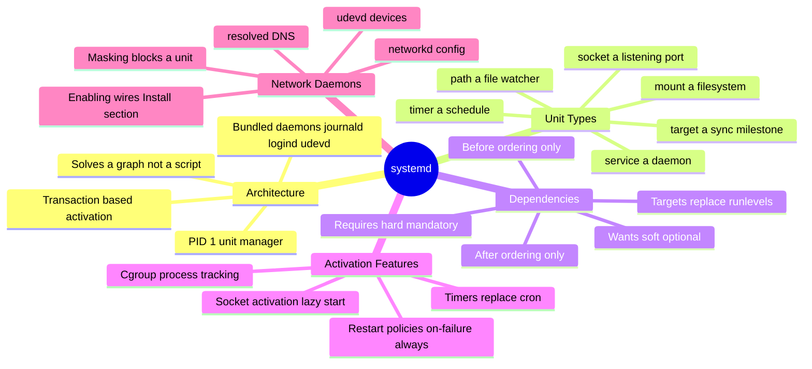
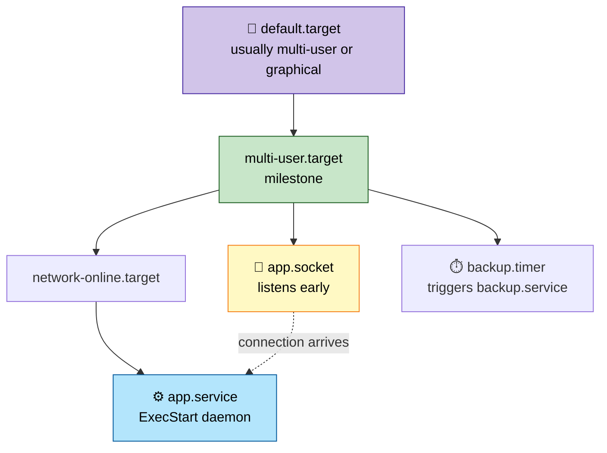
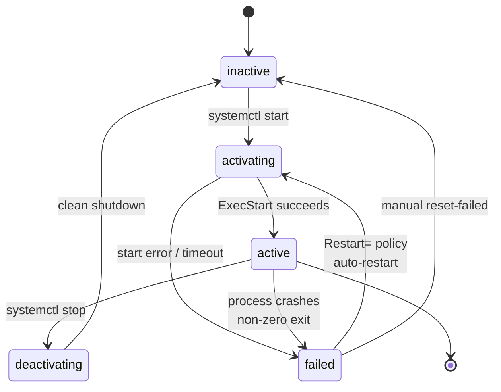
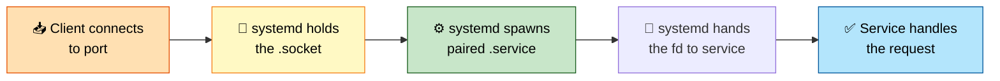
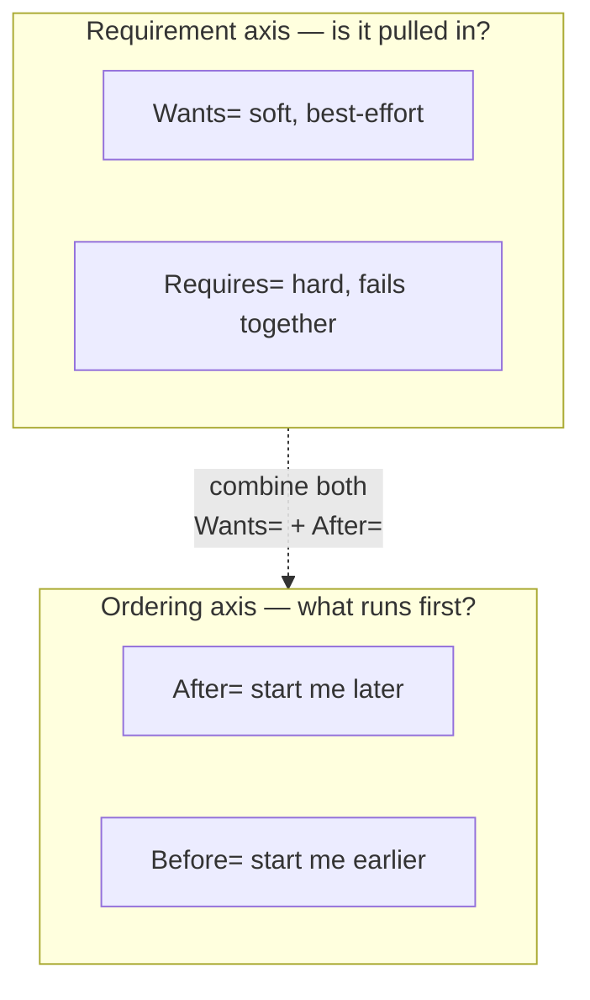
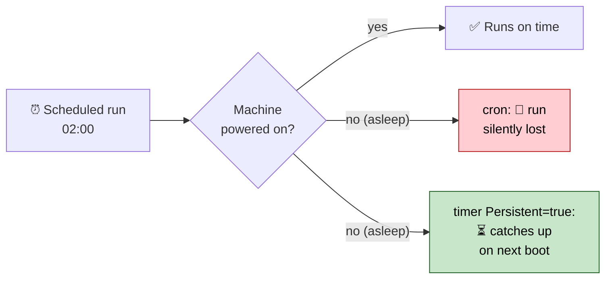

# Section 7: systemd & Service Management

This section covers systemd's architecture in depth — units, dependency graphs, socket activation,
journald logging, cgroup integration, timers, and the network-facing daemons systemd ships alongside
init. This is core material for service reliability, boot performance, and daemon-management interview
questions.

## Subtopic Index
- [systemd Architecture](#systemd-architecture)
- [Units (service, socket, target, mount, timer, path)](#units-service-socket-target-mount-timer-path)
- [Unit Dependencies (Wants, Requires, After, Before)](#unit-dependencies-wants-requires-after-before)
- [systemd Targets vs Runlevels](#systemd-targets-vs-runlevels)
- [Socket Activation](#socket-activation)
- [journald and Structured Logging](#journald-and-structured-logging)
- [systemd Cgroup Integration](#systemd-cgroup-integration)
- [systemd Timers vs Cron](#systemd-timers-vs-cron)
- [systemd-resolved, systemd-networkd, systemd-udevd](#systemd-resolved-systemd-networkd-systemd-udevd)
- [Service Restart Policies and Failure Handling](#service-restart-policies-and-failure-handling)
- [Masking, Enabling, Disabling Units](#masking-enabling-disabling-units)

---

## 🗺️ Visual Overview

**Mind map — the whole section at a glance** (skim this first, revisit it last):



**Unit activation — how systemd walks the dependency graph to `default.target`:**



**Service lifecycle — the state machine `systemctl status` reports:**



**Socket activation — connection arrives before the daemon is even running:**



> 🧠 **Memory hooks (mnemonics):**
> - **Wants vs Requires:** *"**W**ants is **W**eak, **R**equires is **R**igid."* If a `Wants=` dep fails, you still start; if a `Requires=` dep fails, you're dragged down with it.
> - **After ≠ Requires:** *"Order is not obligation."* `After=` only sets *sequence* (when to start), never *whether* to start. You can be ordered `After=` a unit you don't even pull in — pair `After=` with `Wants=`/`Requires=` to get both.
> - **Runlevel ↔ target map:** *"3 for **T**erminal, 5 for **F**ive-star GUI."* → runlevel **3 = multi-user.target** (CLI), runlevel **5 = graphical.target** (GUI), **0 = poweroff**, **6 = reboot**.
> - **Restart policies:** *"**A**lways restarts, **on-failure** forgives a clean exit."* `Restart=always` revives even after `systemctl stop`-style clean exits during crashes; `Restart=on-failure` only revives on non-zero/killed.
> - **Mask vs Disable:** *"**Disable** un-wires, **Mask** walls off."* `disable` removes autostart symlinks (can still be started manually); `mask` symlinks the unit to `/dev/null` so it *cannot* start at all.

---

## systemd Architecture

> 🎯 **Interview weight: High** — the foundation every other systemd answer builds on; you must be able to explain "why a graph, not a script."

**In one line:** systemd is **PID 1** on nearly every modern Linux distro, best understood as a **dependency-graph-driven unit manager** rather than a sequential script runner.

Every manageable resource is modeled as a **unit**, each with its own type-specific configuration file:

- a **service** (a managed process/daemon)
- a **mount** point
- a **device**
- a **socket**
- a **timer**
- a **slice** of cgroup-managed resource limits

**Its core job:** compute and execute a **transaction** — an ordered activation/deactivation plan — across the dependency graph of all currently-relevant units whenever the target system state changes. That happens at boot, on an explicit `systemctl start/stop`, or in reaction to a triggering event like a device appearing.

> 🧠 **Mental model:** SysVinit *ran a script*; systemd *solves a graph*. It figures out the correct parallel order to reach a desired state, rather than executing a fixed linear sequence.

**Bundled daemons:** systemd ships a substantial (and often-debated) set of additional daemons under one project umbrella, because their functionality was judged tightly coupled to service/session lifecycle:

| Daemon | Responsibility |
|--------|----------------|
| `systemd-journald` | Structured logging (see below) |
| `systemd-logind` | Session/seat management — who's logged in on which terminal/display, power-key/lid-close policy |
| `systemd-udevd` | Device event handling and `/dev` population, inheriting `udev`'s historically-separate role |
| `systemd-networkd` / `systemd-resolved` | Optional network config and DNS resolution, coexisting with or replacing NetworkManager |
| `systemd-timesyncd` | Basic NTP client functionality |

**The upside:** one uniform mechanism for cross-cutting concerns that used to be implemented inconsistently across independent projects — every unit, regardless of type, gets the same dependency resolution, the same **cgroup**-based process tracking, and the same **journald** logging integration.

> ⚠️ **The controversy:** the cost is that a single project now controls a much larger fraction of core system behavior than any historical init system did. This is a genuine, still-active architectural debate — a mature interview answer represents *both* sides fairly rather than treating it as settled.

### Key commands
```
systemctl --version                 # confirm systemd version and compiled-in feature list
systemd-analyze                       # boot time breakdown: firmware, loader, kernel, userspace
systemctl list-units --all             # every currently-loaded unit and its state
ps -p 1 -o comm=                        # confirm systemd is genuinely PID 1
```

## Units (service, socket, target, mount, timer, path)

> 🎯 **Interview weight: High** — knowing what each unit type models (and their shared structure) is core systemd literacy.

**In one line:** Each unit type models a distinct kind of manageable resource, but they all share the same structural skeleton — which is exactly what lets systemd apply one dependency/lifecycle engine across wildly different resources.

**The unit types:**

| Type | Models | Key detail |
|------|--------|------------|
| `.service` | A managed process/daemon | `ExecStart=`, `Type=` (how systemd decides it "started"), restart policy, sandboxing |
| `.socket` | A listening socket (TCP/UDP port, UNIX socket, FIFO) | systemd creates and listens *independently* of whether the service runs → enables socket activation |
| `.target` | A pure synchronization/grouping point | No executable content; a named milestone others depend on (`multi-user.target`, `network-online.target`) |
| `.mount` | A filesystem mount point | Same dependency-ordering as any unit; implicitly generated from `/etc/fstab` entries |
| `.timer` | A schedule that triggers a paired unit | Calendar-based or relative to boot/last run; systemd's native cron replacement |
| `.path` | A trigger based on filesystem path changes | Fires a paired unit when a file appears/changes — no custom file-watching code needed |

> 🔍 **Under the hood:** a `.mount` unit lets you express "this service **requires** this specific mount active first," and because fstab entries auto-generate implicit mount units, traditional fstab config still participates in dependency ordering.

**The shared skeleton** — every unit type follows the same structural convention:

- `[Unit]` — dependency/description metadata
- a type-specific section — `[Service]`, `[Socket]`, `[Mount]`, `[Timer]`, `[Path]`
- `[Install]` — what `systemctl enable` actually wires up

That common shape is precisely what lets systemd apply the same dependency-resolution and lifecycle machinery uniformly across such structurally different resource types.

### Key commands
```
systemctl cat <unit>                  # show the fully-resolved unit file content (including drop-ins)
systemctl list-units --type=socket       # list active socket units
systemctl list-units --type=mount          # list active mount units, including fstab-generated ones
systemctl list-timers                        # list timer units and their next/last trigger times
```

## Unit Dependencies (Wants, Requires, After, Before)

> 🎯 **Interview weight: High** — the single most-tested systemd distinction; the "ordering vs requirement" split trips up almost everyone.

**In one line:** systemd splits dependencies into **two independent axes** — *ordering* (who starts first) and *requirement* (whether one unit pulls in or is blocked by another) — and they are **completely orthogonal**.

> 🧠 **Mental model:** `After=` is *"if we both run, run me second."* `Wants=` is *"also bring this one along."* Neither implies the other.

**The two orthogonal axes — pick one from each to get the behavior you actually want:**



**The critical trap:** specifying a requirement (`Wants=`/`Requires=`) does **not** imply ordering, and specifying ordering (`After=`/`Before=`) does **not** imply requirement. To get the intuitive "start foo first *and* pull it in," you must combine both:

```
Wants=foo.service
After=foo.service
```

A unit declaring only `After=foo.service` (with no `Wants=`/`Requires=`) will happily start **even if `foo.service` never starts at all** — it merely guarantees that *if* both run, this one starts after. This is the classic "why didn't my dependency actually get started?" confusion.

**The requirement directives:**

| Directive | Strength | Behavior |
|-----------|----------|----------|
| `Requires=` | Hard | If the required unit fails to start (or stops later), the depending unit is stopped too |
| `Wants=` | Soft | Wanted unit is started best-effort; the wanting unit proceeds **regardless** of success — the recommended default |
| `Conflicts=` | Exclusion | Starting this unit stops any conflicting active unit |
| `BindsTo=` | Tighter than Requires | Stopped if the bound unit stops for *any* reason, including a crash (not just an explicit stop) |
| `PartOf=` | Coupling variant | Propagates stop/restart actions from the parent unit |

> 💡 **Interview tip:** default to `Wants=` for most real dependencies; reserve `Requires=`/`BindsTo=` for genuinely hard failure-propagation relationships.

Correctly modeling these is what lets systemd's parallel startup respect real-world correctness (a database genuinely must not start before its data volume is mounted) while still maximizing concurrency for units with no real ordering constraint between them.

### Key commands
```
systemctl list-dependencies <unit>        # visualize a unit's full dependency tree
systemctl list-dependencies --reverse <unit>   # show what depends ON this unit
systemd-analyze dot <unit> | dot -Tsvg > deps.svg   # render a unit's dependency graph visually
systemctl show <unit> -p Wants,Requires,After,Before   # raw dependency directive values for a unit
```

## systemd Targets vs Runlevels

> 🎯 **Interview weight: High** — a common "what replaced runlevels, and why is it better?" question.

**In one line:** A **target** is systemd's generalization of the old SysVinit runlevel into an arbitrary, composable synchronization point in the unit dependency graph — not a fixed, mutually-exclusive numbered state.

*(Covered in depth in Section 1's boot-process context; recapped here as a systemd-architecture concept.)*

Because a target is just another unit participating in the same `Wants=`/`After=` machinery as everything else, you get flexibility runlevels never had:

- **Custom targets** for app-specific synchronization — e.g., a `database-ready` target that several unrelated services depend on, *without* hardcoding a dependency on the concrete database service.
- **Decoupling** — "the data layer is ready" becomes independent of which concrete unit currently provides it.

> 🧠 **Mental model:** runlevels were a fixed dial (0–6). Targets are named checkpoints you can invent and compose freely.

**Switching states:** `systemctl isolate <target>` activates exactly the units that target (transitively) requires/wants, stopping units not needed for it — the same capability `telinit N` provided, but **computed dynamically** from the dependency graph rather than looked up from a static, pre-built directory for a numbered runlevel.

### Key commands
```
systemctl get-default                  # current default target
systemctl list-units --type=target        # all currently active targets
systemctl isolate multi-user.target         # switch to a target immediately, stopping unneeded units
```

## Socket Activation

> 🎯 **Interview weight: High** — a favorite "how does systemd achieve on-demand start and zero-downtime restart?" topic.

**In one line:** systemd itself owns and listens on a service's **socket**, independently of whether the service process is running — deferring service startup until the first connection arrives, and keeping connections queued across crashes/restarts.

**The startup-latency win:** because the socket exists and can accept (queue) connections *before* the service starts, a client connecting during the brief initialization window sees a short delay rather than an outright **connection-refused** error — the kernel-level socket is already listening regardless of backing-service readiness.

**Mechanically, step by step:**

1. systemd creates the listening socket described by a `.socket` unit at boot (or when the socket unit is started).
2. A connection arrives on a socket whose paired service isn't running.
3. systemd starts that service, and depending on the socket unit's config either:
   - **passes the already-accepted connection's file descriptor** directly to the new process — via a well-known, fixed FD number — letting it skip its own `socket()`/`bind()`/`listen()` and start reading/writing immediately, **or**
   - simply signals the service to start and lets it bind its own socket, then hands off ownership of the pre-existing listening socket.

**Beyond latency — genuine resilience:**

- If a service crashes, systemd (still holding the listening socket) can restart it **without dropping** already-queued or new incoming connections during the restart window.
- Multiple services can be activated from the same shared socket set for advanced load-distribution patterns.

> 🔍 **Under the hood:** this is architecturally similar to (and directly inspired by) macOS's **launchd** and, historically, **inetd**'s superserver model — but integrated natively into systemd's unit/dependency framework rather than bolted on as a separate subsystem.

### Key commands
```
systemctl list-sockets                 # all socket units and their current listening state
systemctl status <service>.socket        # confirm a socket unit's activation state independent of its service
ss -tlnp | grep systemd                    # confirm a socket is held open by systemd itself, pre-service-start
journalctl -u <service> -u <service>.socket   # correlated logs across both the socket and service units
```

## journald and Structured Logging

> 🎯 **Interview weight: High** — logging is central to service reliability, and the "structured vs plain text" trade-off is a common discussion.

**In one line:** `systemd-journald` collects logs from multiple sources and stores them in a **binary, indexed, structured** format that carries rich metadata automatically — enabling reliable field-based queries instead of `grep`-based text parsing.

**What it collects, simultaneously:**

- the **kernel ring buffer** (`dmesg`-equivalent messages)
- standard **syslog**-protocol messages (compatibility with traditional daemons)
- **structured** messages via `sd_journal_print()`/`sd_journal_send()`, or captured automatically from a managed service's own stdout/stderr

**Why the structure matters:** every entry automatically carries metadata — originating **unit**, PID, UID, boot ID, SELinux context, and more — without any application formatting it into the message text. `journalctl` filters on these fields as first-class, indexed values, far more reliably than pattern-matching free-form text:

```
journalctl -u myservice       # by unit
journalctl _PID=1234          # by PID
journalctl -b -1              # the previous boot specifically
```

**Storage modes:**

| Mode | Location | Persistence |
|------|----------|-------------|
| Volatile | `/run/log/journal` | RAM-backed, cleared on reboot (default on some minimal/embedded configs) |
| Persistent | `/var/log/journal` | Survives reboots; size caps + auto-rotation via `SystemMaxUse=`/`RuntimeMaxUse=` in `journald.conf` |

**Forwarding:** journald can additionally forward everything to a traditional syslog daemon (rsyslog/syslog-ng) for orgs standardized on flat-file/remote-syslog pipelines, or ship directly to a remote collector via `systemd-journal-remote` for centralized structured aggregation — no separate syslog forwarder needed.

> ⚠️ **Gotcha (frequently tested):** journald **rate-limits per-unit by default** to stop one log-spamming service from drowning out others. Engineers debugging a verbose service see gaps (`"N messages suppressed"`) unless rate-limiting is explicitly adjusted or disabled for that unit's debugging session.

### Key commands
```
journalctl -u myservice -f              # follow logs for a specific unit live
journalctl -b -1                          # logs from the previous boot
journalctl --disk-usage                    # current journal storage consumption
journalctl -u myservice -p err              # filter to error-priority-and-above messages for a unit
journalctl --vacuum-size=500M                # manually shrink journal storage to a target size
```

## systemd Cgroup Integration

> 🎯 **Interview weight: High** — explains *why* `systemctl stop` is reliable and how resource limits actually work; strong signal when explained correctly.

**In one line:** Every unit that runs processes is automatically placed into its own dedicated **cgroup**, which is what makes process tracking reliable and gives systemd a declarative interface to the kernel's resource controllers.

Each unit's cgroup lives hierarchically under systemd's own tree — visible at `/sys/fs/cgroup/system.slice/<unit>.service/` on a cgroup-v2 system.

> 🔍 **Under the hood — why `systemctl stop` is bulletproof:** every process a service ever forks, no matter how deeply nested or how many times re-forked, stays a member of that service's cgroup (unless it deliberately escapes). So `systemctl stop` signals **every process in the cgroup at once** — no orphaned descendant survives, regardless of the service's own process-tracking bugs. A SysVinit script tracking one recorded PID had no such guarantee.

**Resource control directives** in a unit's `[Service]` section are just a declarative front-end to the same kernel cgroup controllers discussed elsewhere in this guide — not systemd-invented controls:

| Directive | Limits |
|-----------|--------|
| `CPUQuota=` | CPU time (e.g., `50%` of one core) |
| `MemoryMax=` | Memory ceiling |
| `TasksMax=` | Number of tasks/PIDs |
| `IOWeight=` | Block I/O weighting |

This lets an admin express "this service may use at most 50% of one CPU and 512MB of memory" directly in the unit file, rather than invoking separate `cgcreate`/`cgset` tooling out-of-band.

**Slices for group-level limits:** `.slice` units (`system.slice`, `user.slice`, or custom ones) add a grouping layer *above* individual units, for limiting a whole category collectively — e.g., capping the combined resource consumption of *all* user sessions under `user.slice`, regardless of how many users are logged in. This gives hierarchical resource governance that mirrors cgroups' own hierarchy directly through the unit model.

### Key commands
```
systemd-cgtop                          # live top-like view of resource usage per systemd cgroup
systemctl status <unit>                  # shows the unit's cgroup path and member processes
systemctl set-property <unit> MemoryMax=512M   # apply a resource limit live, without restarting the unit
cat /sys/fs/cgroup/system.slice/<unit>.service/memory.current   # raw current usage for a unit's cgroup
```

## systemd Timers vs Cron

> 🎯 **Interview weight: Medium** — a practical "why would you use timers over cron?" question with several concrete advantages.

**In one line:** systemd **timers** (`.timer` units paired with a same-named `.service`) are the native cron replacement — functionally overlapping for basic scheduling, but with meaningfully better operational properties.

**Two scheduling models** (cron only has the first):

| Model | Directives | Use case |
|-------|-----------|----------|
| Calendar-based | `OnCalendar=` (e.g., `*-*-* 02:00:00` for daily-at-2am) | Fixed wall-clock schedules, like cron |
| Monotonic/relative | `OnBootSec=`, `OnUnitActiveSec=` | "Run every N hours since last boot / last run" — **no cron equivalent** |

**`Persistent=true` catch-up — the killer feature cron lacks:**



**Free inheritance from being a real service:** because a triggered timer just starts an ordinary service unit, it automatically gets:

- **journald-integrated logging** — queryable via `journalctl -u <job>.service`, vs cron's primitive mail-on-output or redirect-to-file conventions
- **resource limits** via the same cgroup integration just discussed
- **dependency ordering** — the paired service can declare `After=network-online.target`, something a bare crontab entry cannot express
- **`Persistent=true` catch-up** — solves cron's classic "system was powered off during the scheduled run, so it silently never ran" problem by recording the last trigger time and catching up a missed run on next boot

> 💡 **Interview tip:** `systemd-run --on-calendar=...` creates ad-hoc, one-off timers directly from the command line — no persistent unit files needed for transient scheduling.

> ⚠️ **The trade-off:** timers require authoring (or understanding) **two** unit files (`.timer` + `.service`) vs cron's single line per job — genuinely more verbose for the most trivial cases, even as it provides more capability and better observability for anything beyond the basic case.

### Key commands
```
systemctl list-timers --all             # all timers, their next/last trigger times, and paired units
systemctl status myjob.timer               # timer unit status
journalctl -u myjob.service                  # logs from a timer-triggered job, exactly like any other service
systemd-run --on-calendar='*-*-* 03:00:00' --unit=adhoc-job /path/to/script   # ad-hoc scheduled job
```

## systemd-resolved, systemd-networkd, systemd-udevd

> 🎯 **Interview weight: Medium** — know each daemon's role and that only one network manager should own an interface at a time.

**In one line:** These three daemons are systemd's optional extension into network and device configuration, each replacing or complementing historically-separate tooling.

*(`systemd-resolved` is covered in DNS-resolution detail in Section 5; this entry focuses on all three daemons' shared architectural role.)*

| Daemon | Role | Notes |
|--------|------|-------|
| `systemd-networkd` | Declarative network config (static/DHCP, VLANs, bridges, bonds) via `.network`/`.netdev` files | Lighter-weight alternative to NetworkManager for server/embedded — no Wi-Fi roaming UI / captive-portal detection |
| `systemd-resolved` | Local caching/forwarding DNS stub resolver | Uniquely supports **per-interface DNS** config (e.g., a VPN needing different DNS than the main link) |
| `systemd-udevd` | Reacts to kernel `uevent`s to create/remove `/dev` nodes with correct permissions and naming/symlink policy | Direct continuation of the historically-separate `udev` project |

> ⚠️ **Gotcha:** most server distros let you choose between `systemd-networkd`, NetworkManager, or traditional scripts (`ifupdown`, `network-scripts`) — but only **one** should actively manage a given interface at a time, or they fight over configuration.

**Why udevd's integration matters:** `systemd-udevd` applies naming/symlink policy — predictable network interface names based on physical bus location (rather than nondeterministic kernel enumeration order), and `/dev/disk/by-uuid/...` convenience symlinks. Because it's part of the systemd project, device-triggered events participate in the same unit-dependency and `.path`/`.device` unit machinery, letting a service declare a dependency on a device becoming available (`After=dev-sda1.device`) using the exact same dependency-graph mechanism as every other unit type.

### Key commands
```
networkctl status                    # systemd-networkd's view of interface configuration/state
resolvectl status                      # systemd-resolved's per-interface DNS configuration
udevadm monitor                          # watch live kernel uevents and udev processing in real time
udevadm info /dev/sda                      # inspect udev-assigned properties/symlinks for a device
```

## Service Restart Policies and Failure Handling

> 🎯 **Interview weight: High** — `Restart=`, the start-limit circuit breaker, and `Type=` readiness are heavily tested for production reliability.

**In one line:** `Restart=` controls whether/when a service auto-restarts, a rate-limiting circuit breaker prevents infinite crash loops, and `Type=` determines how systemd knows a service actually *started*.

**`Restart=` trigger conditions:**

| Value | Restarts when… |
|-------|----------------|
| `no` | Never automatically |
| `on-success` | Only if it exited cleanly |
| `on-failure` | Non-zero exit, signal, or timeout — **the common production setting** for long-running services |
| `on-abnormal` | Signal/timeout/watchdog, but not clean/error exit codes |
| `always` | Unconditionally, regardless of exit reason — for services with their own careful exit semantics |

**Tuning knobs:**

- `RestartSec=` — a delay before each restart, avoiding a tight, resource-consuming crash loop.
- `StartLimitIntervalSec=` / `StartLimitBurst=` — a **circuit breaker**: if a unit restarts more than `StartLimitBurst` times within `StartLimitIntervalSec`, systemd stops attempting further restarts and marks it **failed**, preventing an unrecoverably-broken service from looping forever.

**`Type=` — how systemd detects "started":** this directly affects both dependency-ordering correctness and failure detection:

| Type | "Started" means… | Notes |
|------|------------------|-------|
| `simple` (default) | The instant the main process is exec'd | No actual readiness verification |
| `forking` | Initial process forks a daemon and exits | systemd tracks the *forked* child (via `PIDFile=` or cgroup inspection) |
| `notify` | The service calls `sd_notify(READY=1)` once genuinely ready | **Most robust** — sockets bound, config loaded; accurately gates dependent units |

> 💡 **Interview tip:** `Type=notify` is a meaningfully more correct readiness signal than `Type=simple` for services with non-trivial startup/warm-up time — it delays dependents until *true* readiness, not just "the process was exec'd."

**Failure-driven automation:** `OnFailure=` can trigger an entirely separate unit in response to this unit's failure (commonly an alerting/notification service) — a native mechanism for failure-driven automation without an external process monitor layered on top.

### Key commands
```
systemctl show <unit> -p Restart,RestartSec,StartLimitBurst   # current restart policy configuration
systemctl reset-failed <unit>          # clear a unit's "failed" state and start-limit counter after a fix
journalctl -u <unit> -p err              # review failure-related log entries for a repeatedly-failing unit
systemd-notify --ready                    # (from within a service) manually signal readiness under Type=notify
```

## Masking, Enabling, Disabling Units

> 🎯 **Interview weight: High** — the enable/disable vs mask/unmask distinction is a precise detail that separates surface-level from deep answers.

**In one line:** `enable`/`disable` govern **automatic activation** at boot/target-reached time; `mask`/`unmask` govern whether activation can happen **at all, by any means**.

**The two levels, compared:**

| Operation | What it does | Can the unit still start otherwise? |
|-----------|--------------|-------------------------------------|
| `enable` | Creates the `[Install]`-section symlinks (e.g. `WantedBy=multi-user.target` → a link in `multi-user.target.wants/`) so it auto-starts at the next boot | Does **not** start it *now* — use `enable --now` for both |
| `disable` | Removes those symlinks, so it no longer auto-starts | **Yes** — still startable manually or pulled in by another unit's `Wants=`/`Requires=` |
| `mask` | Replaces the unit file with a symlink to `/dev/null` | **No** — impossible to start by any means until unmasked |
| `unmask` | Reverses a mask, restoring normal startability | — |

**Key clarifications:**

- **`enable` doesn't start now:** a common point of confusion. `systemctl enable --now` is the combined "enable for future boots *and* start right now" form.
- **`disable` isn't prevention:** a disabled-but-not-masked unit can still be started manually **or pulled in as a dependency** by another unit — disabling only removes its own `[Install]`-driven auto-start wiring, not its ability to be activated at all. A running unit also keeps running when disabled until explicitly stopped.
- **`mask` is the real off-switch:** the tool for genuinely preventing a problematic unit from *ever* running — e.g., a legacy service being replaced that some other package's dependency keeps accidentally re-activating — rather than merely deprioritizing automatic startup the way `disable` does.

> 💡 **Interview tip:** state the distinction crisply — *enable/disable = automatic activation; mask/unmask = whether activation is possible at all.* That precision is exactly what interviewers probe for.

### Key commands
```
systemctl enable --now myservice     # enable at boot AND start immediately
systemctl disable myservice            # remove auto-start wiring, but leave it startable manually
systemctl mask myservice                 # make the unit impossible to start by any means
systemctl unmask myservice                 # reverse a mask, restoring normal startability
```

---

### Interview Questions

**Conceptual/Internals (8)**

1. **Explain the difference between `Wants=`/`Requires=` and `After=`/`Before=` in systemd unit
   files.**
   `Wants=`/`Requires=` express *requirement* (whether one unit should pull in, or have its own
   activation blocked by the failure of, another) with no implied ordering. `After=`/`Before=` express
   pure *ordering* (which unit starts/stops first, if both are going to be active) with no implied
   requirement. Achieving the intuitive "start X first, and also depend on X" behavior requires
   specifying both directives together explicitly.

2. **How does socket activation improve both startup latency and reliability?**
   systemd creates and listens on a service's socket independently of the service process itself, so
   the socket can accept and queue connections even before the backing service has started or after it
   crashes, deferring service startup until first connection and avoiding dropped connections during a
   restart, since the listening socket persists across the service process's lifecycle rather than
   being tied to it.

3. **Why is `Type=notify` considered a more accurate readiness signal than `Type=simple`?**
   `Type=simple` considers a service "started" the instant its process is exec'd, with no actual
   verification that it has finished initializing. `Type=notify` requires the service to explicitly
   call `sd_notify(READY=1)` once genuinely ready (sockets bound, config loaded), letting systemd
   correctly delay dependent units' startup and readiness-dependent health checks until true readiness
   rather than mere process existence.

4. **What makes `systemctl stop` more reliable at fully terminating a service than a traditional
   SysVinit script tracking a single PID?**
   Every process a systemd-managed unit ever forks is placed into that unit's dedicated cgroup;
   `systemctl stop` can signal every process in that cgroup at once regardless of how deeply nested or
   how many times the service re-forked, guaranteeing no orphaned descendant survives — a traditional
   script tracking only one recorded PID has no such guarantee if the service's own process management
   has bugs.

5. **What is the practical difference between `disable` and `mask`?**
   `disable` removes a unit's automatic-activation symlinks (so it won't auto-start at the relevant
   target) but leaves it startable manually or as a pulled-in dependency of another unit. `mask`
   replaces the unit file with a symlink to `/dev/null`, making it impossible to start by any means at
   all until explicitly unmasked.

6. **Why do systemd timers solve a problem cron cannot for scheduled jobs on systems that may be
   powered off at the scheduled time?**
   A `Persistent=true` timer records its last trigger time and, on the next boot, checks whether the
   calculated next-scheduled run time has already passed while the system was off, triggering a
   catch-up run if so. Plain cron has no native equivalent — a job scheduled during a period the
   system was powered off simply never runs at all with standard cron.

7. **What is `StartLimitBurst`/`StartLimitIntervalSec` for, and what failure mode does it prevent?**
   It's a circuit breaker limiting how many times a unit may be automatically restarted within a given
   interval before systemd stops attempting further restarts and marks it failed. This prevents a
   persistently, unrecoverably broken service under an `always`/`on-failure` restart policy from
   consuming resources in an infinite rapid crash-restart loop forever.

8. **Why does systemd bundle udev, resolved, networkd, and journald under one project rather than
   keeping them fully independent, and what's the trade-off?**
   Bundling lets every unit type share the same dependency-graph, cgroup-tracking, and logging
   infrastructure uniformly (a device event can participate in ordinary unit dependencies, every
   service's logs flow through the same structured journald pipeline) rather than each subsystem
   reinventing its own. The trade-off, a genuine and ongoing point of debate, is that a single project
   now controls a much larger fraction of core system behavior, increasing the blast radius of any
   systemd-level bug and reducing the modularity/swappability earlier, more loosely-coupled Linux
   init/logging/device-management tooling provided.

**Scenario/Troubleshooting (6)**

9. **A service that should auto-start at boot doesn't, despite `systemctl enable` having been run
    previously and the unit starting fine when triggered manually.**
    Confirm the unit file's `[Install]` section actually specifies a `WantedBy=`/`RequiredBy=`
    target matching the system's actual default target (`systemctl get-default`), and confirm the
    expected symlink genuinely exists (`ls` the relevant `.wants/` directory) — a unit file edited or
    replaced *after* `enable` was originally run doesn't automatically regenerate stale symlinks; a
    fresh `systemctl daemon-reload` followed by re-running `enable` is required if the `[Install]`
    section itself changed.

10. **A service repeatedly restarts in a tight loop after a bad deployment, and `systemctl status`
    now reports it as failed with no further restart attempts, even after the underlying bug is
    fixed.**
    The unit likely hit its `StartLimitBurst`/`StartLimitIntervalSec` circuit breaker during the crash
    loop and is now in a "failed, no further auto-restart" state independent of whether the underlying
    issue has since been fixed. `systemctl reset-failed <unit>` clears this state (alongside restarting
    the now-fixed unit), which is the standard remediation step after resolving the root cause.

11. **A dependent service occasionally starts before its declared dependency has actually finished
    initializing, despite a correct `After=`/`Wants=` pairing in its unit file.**
    `After=` only guarantees ordering relative to the dependency unit being considered "started" by
    systemd's own definition, which for `Type=simple` (the default) means merely "process was exec'd,"
    not "finished initializing." If the dependency needs genuine readiness-gated ordering, it should be
    converted to `Type=notify` with an explicit `sd_notify(READY=1)` call once truly ready, or paired
    with an explicit health-check/wait mechanism in the dependent unit if the dependency's own code
    cannot be modified to support notify-type readiness signaling.

12. **A scheduled job configured via `.timer`/`.service` units silently didn't run at its expected
    time, and no error is visible in `journalctl -u <job>.service`.**
    Check `systemctl status <job>.timer` and `systemctl list-timers` first — since the service unit
    never actually ran, its own logs will naturally show nothing; the failure is more likely in timer
    activation itself (a syntax error in `OnCalendar=`, the timer unit not being enabled/started, or a
    dependency the timer itself declared not being satisfied) rather than in the paired service.

13. **After migrating log storage configuration, `journalctl -b -3` (three boots ago) no longer
    returns any results, though the service was confirmed running at that time via external
    monitoring.**
    Check whether journal storage is configured as volatile (`/run/log/journal`, cleared on every
    reboot) rather than persistent (`/var/log/journal`) in `journald.conf`'s `Storage=` setting —
    volatile storage by design cannot retain logs across a reboot at all, which would fully explain
    missing historical-boot data despite the service genuinely having run and logged normally at the
    time.

**FAANG-level Deep Dive (6)**

15. **Explain precisely how systemd computes a "transaction" when processing a unit activation
    request, and why this can result in units outside the directly-requested one being started or
    stopped.**
    Starting a unit isn't evaluated in isolation — systemd computes the full transitive closure of
    `Requires=`/`BindsTo=`/`Conflicts=` relationships reachable from the requested unit, building a
    transaction that may include starting required dependencies not yet active and stopping any
    currently-active conflicting units, then verifies the resulting transaction doesn't contain
    unresolvable ordering cycles or contradictions before executing it atomically — which is exactly
    why activating one unit can visibly start or stop several others that weren't directly named in
    the original request.

16. **Why can two units sharing an `After=` ordering relationship but no `Wants=`/`Requires=`
    relationship still both fail to start correctly under certain boot conditions, and what does this
    reveal about a common unit-file authoring mistake?**
    Without a requirement relationship, systemd has no reason to actually pull in and activate the
    "after" unit at all in a given boot's transaction if nothing else independently wants it — the
    ordering constraint only applies *if* both units end up being activated by the overall transaction
    for unrelated reasons, meaning a unit relying purely on `After=` for a dependency it actually needs
    can silently run before (or never coincide at all with) that dependency being active, a subtle
    trap that reveals the author intended a requirement relationship but only encoded an ordering one.

17. **Why does socket-activated file descriptor passing (rather than the service independently
    binding its own socket after being told to start) provide a meaningfully stronger zero-downtime
    restart guarantee?**
    When systemd itself owns the listening socket and passes the already-bound (and, for the first
    connection, already-accepted) file descriptor directly to the newly-started service process, the
    socket's listen backlog and any already-queued connections persist across the service process's
    entire restart transition, since the kernel-level socket object was never closed at any point — a
    service that instead independently re-binds its own socket after being merely signaled to start
    necessarily has a brief window where no listener exists at all between the old process exiting and
    the new process completing its own bind/listen setup, a real (if often small) availability gap the
    fd-passing model avoids entirely.

18. **Explain why a unit's cgroup-based process tracking can still fail to catch every descendant
    process in certain edge cases, despite systemd's design intent.**
    A process can escape its unit's cgroup if it has sufficient privilege to directly write to
    `cgroup.procs` in a different cgroup path (moving itself out), or in namespaced/nested-cgroup
    scenarios where a process creates and moves into its own child cgroup that systemd's stop logic
    doesn't anticipate needing separate handling for — while systemd's default behavior correctly
    signals every process remaining in the tracked cgroup tree, a sufficiently privileged and
    deliberately evasive process can still relocate itself outside that tree entirely, which is why
    cgroup-based tracking, while far more reliable than legacy single-PID tracking, is not an absolute,
    unconditional guarantee against every possible process-escape technique.

19. **Why might enabling both `systemd-networkd` and NetworkManager simultaneously on the same
    interface produce unpredictable network behavior, and how would you diagnose which daemon is
    actually managing a given interface?**
    Both daemons independently attempt to apply their own configuration (addressing, routing) to
    interfaces they believe they're responsible for, and without careful mutual exclusion
    configuration (each explicitly told which interfaces to manage, or one entirely disabled),
    conflicting configuration attempts on the same interface can produce flapping addresses, routes
    being added and removed by different daemons in sequence, or simply unpredictable final state
    depending on daemon startup/reconciliation timing. Diagnosis involves checking
    `networkctl status <iface>` and NetworkManager's own `nmcli device status` together, and confirming
    via each daemon's own configuration (`.network` files' `Match=` sections, NetworkManager's
    `unmanaged-devices` setting) exactly which interfaces each has actually claimed responsibility for.

20. **Why does journald's rate-limiting behavior potentially mask a genuine incident's diagnostic
    signal, and how should rate-limiting be handled for services under active incident
    investigation?**
    Default per-unit rate-limiting silently drops (while noting a suppressed-count summary message)
    log entries beyond a configured burst threshold within a time window, specifically to protect
    overall system logging capacity from a single misbehaving service — but during an active incident
    where a service is legitimately producing an unusually high volume of genuinely diagnostic error
    messages, this same protection can silently discard exactly the detailed information an
    investigator most needs. The correct practice is temporarily raising or disabling rate limits
    (`journald.conf`'s `RateLimitIntervalSec=`/`RateLimitBurst=`, or per-unit overrides) for a service
    under active investigation, and being aware to check for "N messages suppressed" notices in the
    journal output itself as a signal that the visible log may not be complete.

### Hands-On Labs

**Lab 1: Author a complete custom service with proper dependency ordering**
- Objective: Practice writing a production-quality unit file from scratch.
- Setup: A Linux VM with systemd.
- Tasks: Write a `.service` unit for a simple long-running script, with `Type=notify` (having the
  script call `systemd-notify --ready` once "initialized"), `Restart=on-failure`, `RestartSec=5`, and
  correct `After=`/`Wants=` on `network-online.target`; enable and verify with `systemctl status`.
- Expected outcome: A correctly-behaving custom service demonstrating notify-type readiness and
  restart-on-failure behavior.

**Lab 2: Socket activation from scratch**
- Objective: Build and verify a socket-activated service.
- Setup: A simple TCP echo script and a systemd-capable VM.
- Tasks: Write paired `.socket` and `.service` units; start only the socket unit; confirm via `ss -tln`
  that the port is listening with no service process running yet; connect a client and confirm the
  service starts on-demand and handles the connection.
- Expected outcome: A demonstrated, working on-demand socket-activated service.

**Lab 3: systemd timer with persistent catch-up**
- Objective: Verify `Persistent=true` catch-up behavior for a missed scheduled run.
- Setup: A VM you can safely power off/on.
- Tasks: Configure a daily timer with `Persistent=true`; power off the VM during its scheduled window;
  power back on later and confirm (via `journalctl -u <job>.service`) that a catch-up run occurred.
- Expected outcome: A verified demonstration of systemd timers' advantage over plain cron for
  missed-schedule recovery.

**Lab 4: cgroup resource limiting via systemd unit properties**
- Objective: Apply and verify live resource limits on a running service.
- Setup: A CPU/memory-intensive test service.
- Tasks: Start a service without limits and observe its resource consumption; apply
  `systemctl set-property <unit> CPUQuota=20% MemoryMax=256M` live; confirm enforcement by observing
  throttling/OOM behavior under load, and verify the underlying cgroup files directly.
- Expected outcome: A demonstrated, verified live resource limit applied without restarting the
  service.

**Lab 5: Boot time analysis and targeted optimization**
- Objective: Use systemd's own tooling to measurably improve boot time.
- Setup: Any systemd VM you can reboot freely.
- Tasks: Run `systemd-analyze blame`/`critical-chain`; identify the slowest non-essential unit; add an
  appropriate `After=`/reorder it out of the critical path, or disable it if genuinely unnecessary at
  boot; reboot and compare timings.
- Expected outcome: A measured, explained boot-time improvement backed by before/after
  `systemd-analyze` output.

### Production Incidents

**Incident 1: A "fixed" service never actually restarted after hitting the start-limit circuit
breaker**
- Symptom: After deploying a fix for a service that had been crash-looping, the service still shows as
  down, with no further restart attempts visible in recent logs.
- Investigation: `systemctl status` shows the unit in a "failed" state with restart attempts
  exhausted; `journalctl` confirms the crash loop from before the fix triggered
  `StartLimitBurst`/`StartLimitIntervalSec`, after which systemd stopped attempting automatic restarts
  entirely, independent of the underlying code fix already being deployed.
- Root cause: The deployment/remediation runbook didn't include `systemctl reset-failed` as a required
  step after resolving a crash-loop root cause, an easy step to overlook since the service "should"
  just start working again once the bug is fixed.
- Recovery: Ran `systemctl reset-failed <unit>` followed by `systemctl start <unit>`, restoring normal
  operation immediately.
- Prevention: Updated the incident/deployment runbook to explicitly include `reset-failed` as a
  standard step whenever remediating a previously crash-looping systemd service.

**Incident 2: Silent log loss during an active incident due to journald rate limiting**
- Symptom: During an ongoing production incident, engineers investigating via `journalctl -u
  affected-service -f` notice gaps in the timeline that don't match the observed application
  behavior, with occasional "N messages suppressed" notices easy to miss in a fast-scrolling log
  stream.
- Investigation: Confirmed the affected service's error-logging volume during the incident far
  exceeded journald's default per-unit rate limit, silently dropping a meaningful fraction of the very
  diagnostic detail needed to root-cause the issue.
- Root cause: Default journald rate-limiting settings, appropriate for normal operating conditions,
  were never adjusted for the unusually high legitimate log volume generated by a service actively
  failing during an incident.
- Recovery: Temporarily raised the affected unit's rate limit, immediately restoring full-fidelity
  logging for the remainder of the investigation.
- Prevention: Added an incident-response runbook step to proactively raise or disable journald rate
  limiting for any service under active investigation, and added monitoring for "suppressed" message
  notices as their own alertable signal.

**Incident 3: Conflicting network configuration after both systemd-networkd and NetworkManager were
left enabled post-migration**
- Symptom: A newly-provisioned host intermittently loses and regains its primary network address,
  with connectivity flapping every few minutes without any physical link issue.
- Investigation: `networkctl status` and `nmcli device status` both showed active management claims on
  the same physical interface; logs showed both daemons periodically reapplying their own
  (subtly different) DHCP-derived configuration to the same interface, each overwriting the other's
  settings in turn.
- Root cause: A provisioning template migration accidentally left both `systemd-networkd` and
  NetworkManager enabled and unconfigured to explicitly exclude each other's managed interfaces,
  something the previous template had correctly handled but the migrated version omitted.
- Recovery: Disabled `systemd-networkd` (the non-standard choice for this fleet, which had
  standardized on NetworkManager) and confirmed stable, non-flapping connectivity afterward.
- Prevention: Added an explicit provisioning-template validation check confirming exactly one network
  management daemon is active and correctly scoped to the expected interfaces before a host is marked
  ready for service.
