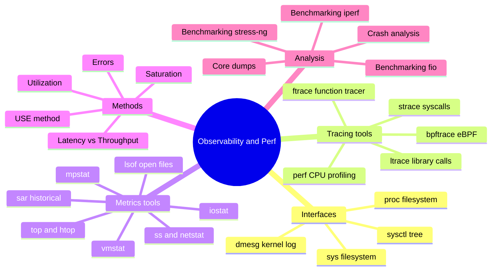
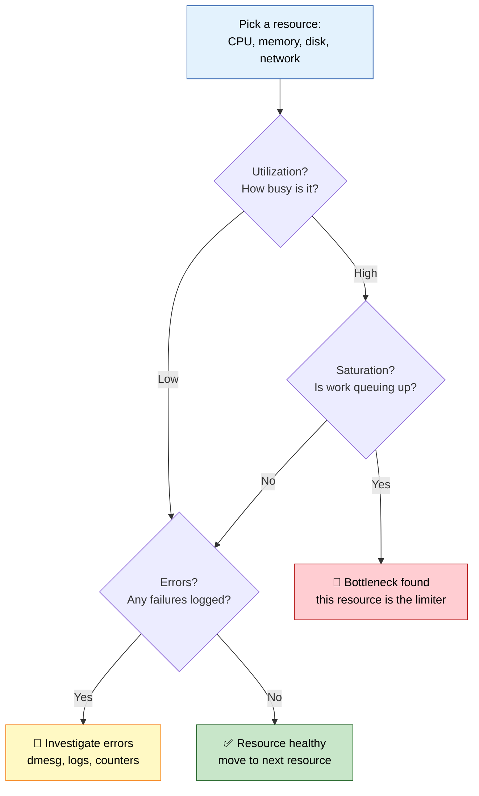
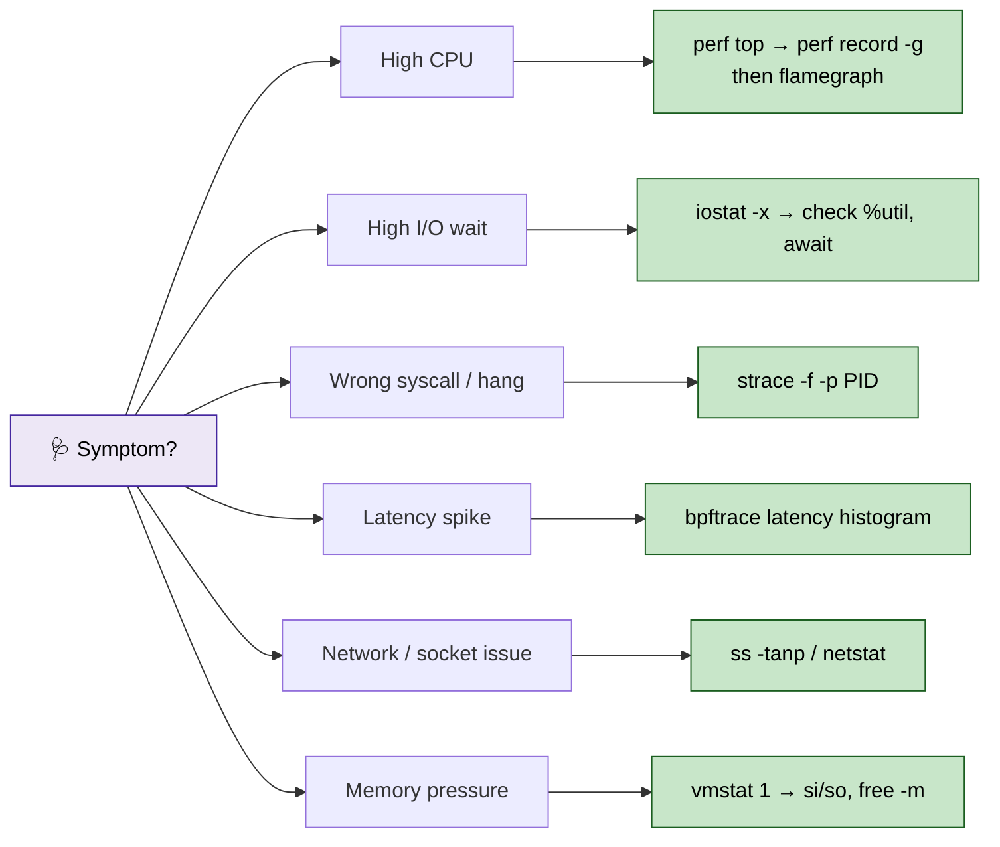
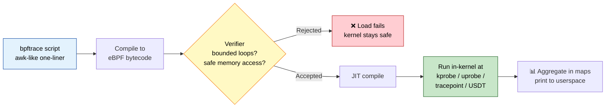
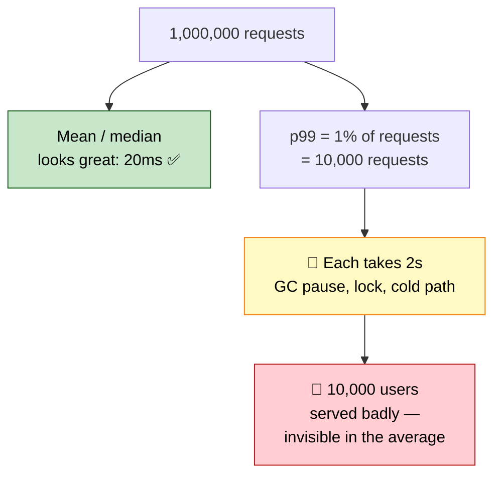

# Section 8: Observability, Performance & Troubleshooting

This section covers the practical toolchain for observing and diagnosing a running Linux system —
`/proc`/`/sys`, `strace`, `perf`, `bpftrace`, classic performance tools, core dumps, and the USE
method — tying together every kernel subsystem from earlier sections into an actionable
troubleshooting methodology.

## Subtopic Index
- [/proc and /sys Filesystems in Depth](#proc-and-sys-filesystems-in-depth)
- [strace and ltrace](#strace-and-ltrace)
- [perf (CPU profiling, flamegraphs)](#perf-cpu-profiling-flamegraphs)
- [bpftrace and eBPF tracing](#bpftrace-and-ebpf-tracing)
- [ftrace](#ftrace)
- [vmstat, iostat, mpstat, sar](#vmstat-iostat-mpstat-sar)
- [top/htop internals (how they read /proc)](#tophtop-internals-how-they-read-proc)
- [ss and netstat internals](#ss-and-netstat-internals)
- [lsof](#lsof)
- [dmesg and Kernel Logs](#dmesg-and-kernel-logs)
- [Core Dumps and Crash Analysis](#core-dumps-and-crash-analysis)
- [USE Method (Utilization, Saturation, Errors)](#use-method-utilization-saturation-errors)
- [Latency vs Throughput Analysis](#latency-vs-throughput-analysis)
- [Benchmarking Tools (fio, iperf, stress-ng)](#benchmarking-tools-fio-iperf-stress-ng)

---

## 🗺️ Visual Overview

**Mind map — the whole toolchain at a glance** (skim this first, revisit it last):



**USE method — the decision tree to run for every resource** (highest-value diagram in the section):



**Which tool for which symptom — the triage map** (memorize the symptom → tool jumps):



> 🧠 **Memory hooks (mnemonics):**
> - **USE method:** *"USE your senses"* → for every resource ask **U**tilization, **S**aturation, **E**rrors. (Metrics-first, resource-oriented — great for spotting *bottlenecks*.)
> - **RED method** (its request-oriented cousin, for services): **R**ate, **E**rrors, **D**uration. USE watches resources; RED watches requests.
> - **One tool per layer:** *"strace for syscalls, perf for CPU, bpftrace for everything (else)."*
> - **Load average = R + D:** Linux load counts tasks that are **R**unning *plus* in **D** uninterruptible sleep (usually disk I/O) — so high load with idle CPU means **I/O**, not compute.
> - **proc vs sys:** *"proc = **p**rocesses, sys = **s**ubsystems/devices."* Both are live, zero-disk, and never atomic across multiple reads.
> - **I/O wait triage:** *"await tells you the wait, %util tells you the busy"* — in `iostat -x`, high `await` + high `%util` = the disk is the limiter.

---

## /proc and /sys Filesystems in Depth

> 🎯 **Interview weight: High** — every higher-level tool is just a formatter over this raw data; knowing it cold signals genuine depth.

**In one line:** `/proc` and `/sys` are synthetic filesystems that expose nearly all kernel and process state as readable (and sometimes writable) text files.

> 🧠 **Mental model:** `top`, `ss`, and `iostat` are all convenient formatters over exactly this same raw data. Fluency reading `/proc`/`/sys` *directly* is what separates surface-level from genuinely deep troubleshooting.

**What `/proc/<pid>/` holds — one directory per process:**

| Entry | What it exposes |
|-------|-----------------|
| `status` / `stat` | Process state, memory, scheduling counters |
| `maps` / `smaps` | Virtual memory layout (see Section 3) |
| `fd/` | Open file descriptors, each a symlink to what it points at |
| `cwd` / `root` / `exe` | Symlinks to current dir, chroot root, on-disk executable |
| `environ` | The process's environment variables |
| `cgroup` | Which cgroups this process belongs to, across every hierarchy |
| `task/<tid>/` | Per-thread breakdown of much of the same info (see Section 2) |

**System-wide `/proc` entries** round out the picture:

- `/proc/meminfo`, `/proc/cpuinfo`, `/proc/interrupts`, `/proc/net/*`
- `/proc/sys/*` — the sysctl tree, both readable and writable for live kernel tuning

**`/sys` is different:** it's organized around the kernel's internal device/driver object model rather than process state. Every bus, device, driver, and class appears as a directory of attribute files.

It's the standard mechanism for both introspection (`/sys/class/net/eth0/carrier` for link state) and live configuration (`/sys/block/sda/queue/scheduler`, see Section 4).

> ⚠️ **Gotcha:** Both are regenerated live from in-kernel structures — zero disk I/O to read, always real-time. But they are **not** atomic snapshots across multiple reads. Reading `/proc/<pid>/stat` then `/proc/<pid>/status` moments later can reflect two slightly different instants — a subtlety that matters for tooling needing point-in-time-consistent multi-field data.

### Key commands
```
cat /proc/<pid>/status              # human-readable process state summary
ls -l /proc/<pid>/fd/                 # open file descriptors and what they resolve to
cat /proc/meminfo                      # system-wide memory breakdown
find /sys/devices -name modalias | head   # explore the sysfs device tree directly
```

## strace and ltrace

> 🎯 **Interview weight: High** — the canonical "what is this process actually doing?" tool and a staple of troubleshooting scenarios.

**In one line:** `strace` logs every syscall a process makes; `ltrace` does the same for shared-library calls.

**Why `strace` is so valuable:** it uses `ptrace()` to attach and pause the target at each syscall entry/exit (or seccomp-bpf fast paths on newer setups), showing the exact syscall name, arguments resolved to human-readable flags (not raw integers), and return value/errno.

It's the single best tool for "what is this process doing at the kernel-interaction level" when application logs don't explain a hang, an unexpected error, or a permission failure.

> ⚠️ **Gotcha:** Because it attaches via `ptrace()` and single-steps every syscall, overhead is substantial — commonly **2x to 100x+** slowdown depending on syscall frequency. Great for short diagnostic investigation, poor for profiling live production load without tight scoping.

**Keep overhead sane by scoping tightly:**

- `-e trace=open,read` — limit to specific syscalls of interest
- `-p <pid>` — attach to an already-running process instead of launching fresh
- `-c` — aggregated count/time summary instead of a full line-by-line trace

**`ltrace` — the library-call analog:** intercepts `malloc`, `strcpy`, any dynamically-linked function rather than syscalls. Useful for confirming a specific library function is even being called and with what arguments.

> 💡 **Interview tip:** `ltrace` is considered less reliable and more invasive than `strace` (edge cases with static linking, PLT/GOT manipulation, inlining), so it's reached for less often. Lead with `strace`.

> 🧠 **Mental model — the must-know pattern:** `strace -f -e trace=open,openat -p <pid>` reveals exactly which file a process fails to open when the app only reports a generic "permission denied" or "file not found" — collapsing extensive log-diving into one definitive kernel-level answer.

### Key commands
```
strace -f -p <pid>                    # attach to a running process (and its threads/children) live
strace -e trace=network ./program       # trace only network-related syscalls
strace -c ./program                       # aggregated syscall count/time summary instead of a full trace
ltrace -f -e malloc+free ./program          # trace library-level calls (here, allocation-related)
```

## perf (CPU profiling, flamegraphs)

> 🎯 **Interview weight: High** — the default first tool for "why is this process burning CPU?" and flame graphs come up constantly.

**In one line:** `perf` is Linux's standard profiling toolchain, built on the kernel's `perf_events` subsystem, that samples where CPU time is actually going without recompiling the target.

**Two kinds of events, one interface:**

- **Hardware-counter sampling** — cache misses, branch mispredictions, instructions-per-cycle, read from the CPU's dedicated performance monitoring unit registers.
- **Software-event tracing** — context switches, page faults, arbitrary kernel tracepoints/kprobes.

**The common workflow:** `perf record -g` (capture call-graph/stack info alongside sampled events, CPU-cycle-based by default) then `perf report`. It periodically interrupts the program, records the instruction pointer plus a call stack, and builds a *statistical* profile of where CPU time goes across the whole call graph.

> 🔍 **Under the hood:** No instrumentation or recompile needed — a big advantage over traditional instrumenting profilers, which require code changes/relinking and add more observer-effect overhead.

**Flame graphs** (Brendan Gregg's `FlameGraph` toolset, consuming `perf record` output) render the sampled call-graph as a scannable stacked-bar chart:

- Each box's **width** ∝ the fraction of total samples where that function appeared anywhere in the stack.
- The **vertical axis** is call-stack depth.
- The widest boxes are the biggest aggregate CPU consumers — spotted in seconds instead of parsing a text call-tree.

> 💡 **Interview tip:** `perf`'s low, sampling-based overhead makes it viable *in production* (unlike `strace`), which is exactly why it's the go-to for a live "high CPU" incident rather than only a staging repro.

### Key commands
```
perf record -g -p <pid> -- sleep 30    # sample a running process's call stacks for 30 seconds
perf report                              # interactive, text-based hierarchical report of captured samples
perf script | stackcollapse-perf.pl | flamegraph.pl > flame.svg   # generate a visual flame graph
perf stat ./program                        # aggregate hardware counter summary (cycles, IPC, cache misses) for a run
```

## bpftrace and eBPF tracing

> 🎯 **Interview weight: High** — eBPF is the modern state of the art for production-safe deep tracing; expect it in senior/FAANG rounds.

**In one line:** `bpftrace` is a high-level, awk-like tracing language that compiles short scripts into verified, sandboxed eBPF programs the kernel runs in-context with minimal overhead.

**What it can attach to:**

| Probe type | What it instruments |
|------------|---------------------|
| **kprobes** | Arbitrary kernel function entry/exit points |
| **uprobes** | Equivalent points in userspace binaries/libraries |
| **tracepoints** | Stable, kernel-maintained points that survive version upgrades (unlike raw kprobes on internal names) |
| **USDT probes** | Userspace statically-defined tracepoints some apps/runtimes expose |

Each script compiles to a verified eBPF program the kernel JIT-compiles and runs directly — lower-overhead and more flexible than `strace`'s `ptrace()` interception or a custom kernel module.

> 🧠 **Mental model — a representative one-liner:** `bpftrace -e 'kprobe:vfs_read { @[comm] = count(); }'` attaches to every `vfs_read()` system-wide and tallies a per-process-name count — answering "which processes drive the most read activity right now" with zero app instrumentation.

> 🔍 **Under the hood — why it's production-safe:** eBPF programs are **verified before load** (bounded loops, memory-access-safety checks) so they cannot crash or hang the kernel. An ad-hoc custom kernel module for the same job never earns that trust.

**The broader ecosystem it underpins:** `bcc`/BPF Compiler Collection tools like `biolatency`, `tcplife`, `execsnoop` — effectively polished, pre-packaged versions of exactly this kind of script, representing the current state of the art for low-overhead, production-safe deep tracing beyond what `strace`/`perf` alone conveniently express.

**The eBPF pipeline — script to safe, running kernel program:**



### Key commands
```
bpftrace -e 'kprobe:vfs_read { @[comm] = count(); }'   # tally VFS reads per process name, live
bpftrace -e 'tracepoint:syscalls:sys_enter_openat { printf("%s %s\n", comm, str(args->filename)); }'   # trace file opens
bpftrace -l 'kprobe:*tcp*'                                # list available kernel probe points matching a pattern
biolatency                                                  # (bcc tool) histogram of block I/O latency, built on eBPF
```

## ftrace

> 🎯 **Interview weight: High** — the kernel's own tracer, and its latency tracers do things nothing else conveniently duplicates.

**In one line:** **ftrace** is the kernel's built-in, lower-level tracing framework, accessed directly through `/sys/kernel/debug/tracing/` with no separate userspace daemon.

It predates and complements `perf_events`/eBPF, and provides three capability families:

- **Function tracing** — record entry/exit of nearly any kernel function, or a filtered subset.
- **Event tracing** — structured tracepoints, similar to those `bpftrace` also consumes.
- **Specialized latency tracers** — for specific analysis use cases (below).

**The specialized tracers worth knowing:**

| Tracer | What it does |
|--------|--------------|
| `function_graph` | Indented call-graph view of kernel function nesting + duration — see exactly what a syscall does internally, step by step |
| `irqsoff` / `preemptoff` | Records the worst-observed duration the kernel ran with interrupts/preemption disabled — invaluable for real-time/low-latency tuning |
| `wakeup` / `wakeup_rt` | Scheduler wakeup latency analysis |

> 🧠 **Mental model:** `irqsoff`/`preemptoff` catch an unexpectedly long non-preemptible section anywhere in the kernel — exactly the class of latency spike `PREEMPT_RT` tuning (Section 2) needs to identify and eliminate.

> 💡 **Interview tip:** `perf`/`bpftrace` are friendlier and more common today, but **ftrace** is available on essentially every kernel with debugfs mounted — no tooling to install — and its latency tracers aren't conveniently duplicated elsewhere. Reach for it in kernel-level latency forensics where installing extra tooling isn't practical.

### Key commands
```
echo function_graph > /sys/kernel/debug/tracing/current_tracer   # enable the function-graph tracer
cat /sys/kernel/debug/tracing/trace                                 # view captured trace output
echo 1 > /sys/kernel/debug/tracing/tracing_on                        # start/stop tracing without reconfiguring
trace-cmd record -p function_graph -F ./program                        # convenience wrapper around raw ftrace usage
```

## vmstat, iostat, mpstat, sar

> 🎯 **Interview weight: High** — the classic first-response toolkit; interviewers expect you to know which tool answers which question.

**In one line:** These `sysstat`-family tools each give a focused, time-series view of one resource dimension — together the standard opening move before reaching for `perf`/`bpftrace`.

**The four tools at a glance:**

| Tool | Scope | Best for |
|------|-------|----------|
| `vmstat` | Whole-system summary in one screen | First command when you have no context |
| `iostat -x` | Per-block-device I/O detail | Spotting a saturated/struggling disk |
| `mpstat -P ALL` | Per-core CPU breakdown | Catching a single-core bottleneck |
| `sar` | Historical logged metrics | Reconstructing conditions *after* an incident |

**`vmstat`** — one compact view spanning run-queue length (`r`), blocked/uninterruptible count (`b`, the load-average-vs-D-state topic from Section 2), memory (free/buffer/cache), swap (`si`/`so`), I/O (blocks in/out), and CPU breakdown (user/system/idle/iowait/steal).

**`iostat -x`** — detailed per-device stats. The two fields that matter most:

- **`await`** — average time a request spends queued plus serviced; the single best field for spotting a genuinely struggling device.
- **`%util`** — percentage of time the device had ≥1 outstanding request.

> ⚠️ **Gotcha:** `%util` can hit 100% on a device that could still accept *more* parallel requests if it supports enough queue depth. It only means the device was never idle during the interval — **not** that it's at its absolute throughput ceiling. A frequently-misread metric.

**`mpstat -P ALL`** — breaks CPU down per core, not an aggregate average. Essential for spotting a single-threaded process pegging one core at 100% while system-wide utilization looks unremarkable.

**`sar`** — the umbrella historical tool underlying all the above. Configured to log continuously (via cron/systemd timer) so that after an incident has passed, `sar -f /var/log/sa/saXX` retroactively reconstructs exactly what CPU/memory/I/O/network looked like — no need to have been watching live at the moment it happened.

### Key commands
```
vmstat 1                              # one-second-interval system-wide resource summary
iostat -x 1                             # detailed per-device I/O statistics, refreshed every second
mpstat -P ALL 1                           # per-core CPU utilization breakdown
sar -f /var/log/sa/sa15                     # retroactively review historical metrics from a specific past day
```

## top/htop internals (how they read /proc)

> 🎯 **Interview weight: High** — "how does `top` compute %CPU?" is a classic that separates users who understand the machine from those who memorize flags.

**In one line:** `top` and `htop` are just a loop that periodically re-reads `/proc/<pid>/stat`, computes deltas between samples, and renders a sorted display.

**How the familiar %CPU number is derived:** CPU time consumed since the last refresh, divided by wall-clock time elapsed. It is *always* a rate between two samples — there is no such thing as an "instantaneous CPU percentage" for a process, only consumed CPU time over a measured interval.

> ⚠️ **Gotcha:** A very short-lived, bursty process can be **entirely invisible** in `top`'s default interval. If it starts and exits between two consecutive `/proc` samples, `top` simply never observes it — no matter how much CPU it burned while alive.

**`htop` adds presentation, not new data:** colorized, scrollable UI, process-tree view, per-thread display — but it reads precisely the same `/proc` data. No extra kernel privilege or information source, just a friendlier layer.

> 🧠 **Mental model:** "It's just `/proc` polling under the hood." That reality tells you `top`'s hard limits — it can't show anything `/proc` doesn't expose, can't see history before it started, and its default sort/refresh can hide short-lived or low-average-but-high-peak consumers.

> 💡 **Interview tip:** Know when to switch tools — `pidstat` for historical per-process time-series, `perf`/`bpftrace` for kernel-internal detail `/proc` never surfaces.

### Key commands
```
top -d 1                              # refresh every 1 second (finer-grained sampling than the 3s default)
top -H -p <pid>                         # per-thread view for one specific process
htop                                      # friendlier interactive equivalent, same underlying /proc data source
pidstat 1                                  # historical, loggable per-process time-series (complements top's live-only view)
```

## ss and netstat internals

> 🎯 **Interview weight: Medium** — the "why `ss` over `netstat`?" question is a quick way to check whether you understand the tooling you use.

**In one line:** Both present the kernel's socket tables, but **ss** queries them via the modern netlink diagnostic API while **netstat** parses `/proc/net/*` text — a difference that matters enormously at scale.

Both show local/remote address-port pairs, connection state, and (with privilege) the owning process, drawing on `/proc/net/tcp`, `/proc/net/udp`, `/proc/net/unix` and their IPv6 equivalents.

**The mechanism gap:**

| | `ss` | `netstat` |
|---|------|-----------|
| Data source | `NETLINK_SOCK_DIAG` netlink API | Parses `/proc/net/*` text files |
| Filtering | In-kernel, before returning data | Reads/parses every socket, every query |
| Cost at scale | Fast even on connection-heavy hosts | Slow — grows with total socket count |
| Extra detail | TCP internals (cwnd, retransmits, RTT) via `ss -tin` | Never exposed this |

> ⚠️ **Gotcha:** On a busy load balancer or app server, `netstat` itself becomes a slow, resource-consuming command — ironically worst exactly when you most need a *fast* diagnostic during a connection-related incident.

> 💡 **Interview tip:** Most modern distros have deprecated/removed `netstat` in favor of `ss` (part of `iproute2`) plus `ip` for routing/interfaces. This reflects a real, measurable performance and capability advantage — not just a stylistic preference. `ss -tin` was covered in Section 5.

### Key commands
```
ss -tanp                              # all TCP sockets, numeric addresses, with owning process
ss -tan state established | wc -l       # quick count of established connections
ss -s                                     # summary totals across all socket types/states
netstat -tanp                              # older equivalent, meaningfully slower on connection-heavy hosts
```

## lsof

> 🎯 **Interview weight: Medium** — versatile across many seemingly-unrelated scenarios; a favorite for practical troubleshooting questions.

**In one line:** `lsof` (list open files) enumerates every open file descriptor across every process — and thanks to "everything is a file," that includes far more than regular files.

**What counts as an "open file"** (all represented as FDs in a process's `files_struct`, see Section 1):

- Regular files and directories
- Character/block devices
- Network sockets
- Pipes and shared memory segments

**Why that universality makes it so useful — the classic scoped queries:**

| Command | Answers |
|---------|---------|
| `lsof -i :443` | Which process is bound to a port ("address already in use") |
| `lsof /mount/point` | Every process holding a file open on a filesystem (before unmount) |
| `lsof +L1` | Files with link count 0 — deleted but still open ("disk full but `du` disagrees," Section 4) |
| `lsof -p <pid>` | Complete open-FD inventory for one process (footprint, `ulimit -n` debugging) |

> ⚠️ **Gotcha:** By default `lsof` enumerates the *entire* system's open files (walking every `/proc/<pid>/fd/`), which is surprisingly slow on a host with many processes. Always prefer the most specific filter (`-p`, `-i`, a path) over an unscoped invocation — faster, and far more actionable output.

### Key commands
```
lsof -i :443                          # find the process bound to a specific port
lsof -p <pid>                           # every open file descriptor for a specific process
lsof +L1                                  # find deleted-but-still-open files (disk space troubleshooting)
lsof /mount/point                          # every process holding a file open on a specific filesystem
```

## dmesg and Kernel Logs

> 🎯 **Interview weight: High** — kernel events (OOM, driver/FS errors) are frequently the true root cause behind app-layer symptoms; checking them early is a hallmark of efficient troubleshooting.

**In one line:** `dmesg` displays the kernel's ring buffer — a fixed-size, in-memory circular buffer the kernel writes `printk()` messages into, from earliest boot through live events.

**What lands in the buffer:** boot messages (Section 1), driver errors, OOM killer activity, hardware faults, filesystem errors, and security-module denials (surfaced via `audit`/`dmesg`).

> ⚠️ **Gotcha:** It's *fixed-size* — older messages get overwritten once it fills. That's why production forwards kernel messages to persistent storage:
> - `journalctl -k` — systemd-journal-integrated kernel logs, persistent if journal storage is configured (Section 7)
> - A traditional syslog daemon capturing kernel-facility messages

**Two flags that make it usable:**

- `--level=err,crit,alert,emerg` — messages are tagged with syslog severity; filtering to actionable levels is the standard first move on a busy log.
- `-T` — converts raw boot-relative timestamps into human-readable wall-clock time, essential for correlating a kernel event against app logs or monitoring alerts.

> 💡 **Interview tip:** Because kernel-level events (OOM kills, driver errors, FS-corruption detection, hardware ECC events) are so often the *root cause* of symptoms that first appear at the application layer, check `dmesg`/kernel logs **early** — not as an afterthought once app logs are exhausted.

### Key commands
```
dmesg -T --level=err,crit,alert,emerg    # human-readable timestamps, filtered to actionable severities
journalctl -k -b                            # kernel messages for the current boot, via persistent journal storage
dmesg | grep -i -E 'oom|killed process'       # quick scan for OOM killer activity
dmesg -w                                        # follow new kernel messages live, as they occur
```

## Core Dumps and Crash Analysis

> 🎯 **Interview weight: High** — post-mortem debugging of crashes you can't reproduce live is a strong senior signal.

**In one line:** A core dump is a snapshot of a process's memory and register state at the moment it crashes, saved for later post-mortem analysis with a debugger — no need to catch the crash live.

**When it's produced:** an unhandled fatal signal — typically `SIGSEGV`, `SIGABRT`, or `SIGBUS`. On modern systemd systems, `systemd-coredump` captures and stores it rather than dropping a bare file in the crashing process's working directory.

**The two knobs that control it:**

| Setting | Controls |
|---------|----------|
| `ulimit -c` | Whether dumps are generated at all (often 0/disabled by default to avoid filling disk) |
| `/proc/sys/kernel/core_pattern` | Where/how a dump is written |

> 🔍 **Under the hood:** `core_pattern` accepts a plain filename *or* a pipe syntax (`|/path/to/handler %p %u %g`) that routes raw core data through an external handler. That pipe mechanism is exactly how `systemd-coredump` intercepts every crash system-wide, compresses and stores it in a `coredumpctl`-queryable location, and captures rich metadata (executable, package version, backtrace summary).

**Analyzing the dump:** `gdb <executable> <core-file>` (or `coredumpctl debug` with systemd storage) loads the exact state at crash time — full call stack (`bt`) across every thread, local variable values per frame, raw memory — often pinpointing the exact line and corrupted value without ever reproducing the failure live.

> 💡 **Interview tip:** For rare, intermittent production crashes, ensuring capture is configured and retained (correct `core_pattern`, adequate `ulimit -c`, systemd-coredump retention) *before the next occurrence* is the single highest-leverage step — a crash that isn't captured cannot be analyzed, no matter how good your tooling.

### Key commands
```
ulimit -c unlimited                  # allow core dump generation for the current shell session
cat /proc/sys/kernel/core_pattern      # confirm current core-dump routing configuration
coredumpctl list                        # (systemd-coredump) list captured crashes
coredumpctl debug <pid-or-exe>             # load a captured crash directly into gdb for analysis
```

## USE Method (Utilization, Saturation, Errors)

> 🎯 **Interview weight: High** — Brendan Gregg's USE Method is *the* structured methodology interviewers love to hear invoked by name.

**In one line:** For every resource, systematically check three properties — Utilization, Saturation, Errors — so no resource dimension gets missed simply because no one thought to check it.

**The three properties, per resource** (CPU, memory, each disk, each NIC, …):

| Property | What it means | Where to look |
|----------|---------------|---------------|
| **Utilization** | % of time busy / % of capacity in use | CPU %, `iostat` `%util` |
| **Saturation** | Degree of work queued waiting because the resource is full | `vmstat` `r` column, `iostat -x` queue length |
| **Errors** | Count of error events for the resource | NIC CRC errors (`ethtool -S`), disk I/O errors (kernel logs), ECC counts |

> 🧠 **Mental model:** Saturation can reveal genuine contention even when utilization looks merely "high but not maxed." And errors degrade performance through a *different* mechanism than exhaustion — a resource with errors may show low utilization yet perform terribly due to constant retry/recovery overhead.

**Why the discipline matters — a worked example:** poor app performance with low CPU, low memory pressure, and low network utilization, but very high storage *saturation* (a long, growing `iostat` queue despite `%util` not yet at 100%) correctly points the investigation at storage — avoiding wasted time on CPU or application code when CPU was never the contended resource.

> 💡 **Interview tip:** The whole value is checking utilization, saturation, *and* errors for *every* resource rather than stopping at the first metric that looks concerning. That structured rigor is what separates a systematic methodology from guess-and-check.

### Key commands
```
mpstat -P ALL 1                # CPU: utilization per core
vmstat 1                         # CPU/memory: utilization and saturation (r/b queue columns)
iostat -x 1                       # storage: utilization (%util) and saturation (avgqu-sz/aqu-sz)
ethtool -S eth0 | grep -i err       # network: error counters
```

## Latency vs Throughput Analysis

> 🎯 **Interview weight: High** — a mature "how do you think about performance?" answer must distinguish these; tail-latency reasoning is a senior differentiator.

**In one line:** Latency (how long one operation takes) and throughput (how many complete per unit time) are distinct dimensions that move independently — conflating them is a common source of misdiagnosis.

**High throughput can coexist with poor latency:** a batching/queuing design processes many requests efficiently in bulk but makes each request wait in a queue for the next batch — trading per-request latency for aggregate throughput.

- A deliberate, often correct trade-off for **bulk/batch** workloads.
- A poor fit for **latency-sensitive interactive** workloads, where consistent low per-request latency matters far more than raw operation count.

**Good average latency can hide a serious tail:** reporting only mean/median systematically hides tail behavior (p95, p99, p99.9).

> ⚠️ **Gotcha:** A small fraction of requests hitting severe latency (occasional GC pauses, lock contention, a slow code path for certain inputs) is still a *very large absolute number* of poorly-served requests at scale — entirely invisible if you only look at central-tendency statistics.

> 🧠 **Mental model:** Be explicit about which dimension the workload/SLA actually cares about.
> - A batch ETL job → primarily throughput and total completion time.
> - A user-facing API → primarily tail latency, often tolerating modest aggregate throughput.

> 💡 **Interview tip:** Whenever tail behavior is operationally relevant, use percentile-based, full-distribution analysis (histograms, percentile breakdowns) — not single summary statistics. Treating "performance" as one undifferentiated concept is a junior tell.

**Why the mean lies — the tail hides where averages can't:**



### Key commands
```
ss -tin                          # per-connection RTT (a latency-relevant metric) alongside throughput-relevant cwnd
fio --output-format=json ... | jq '.jobs[0].read.clat_ns.percentile'   # full latency percentile breakdown from a benchmark
perf sched latency                 # scheduler-induced latency breakdown per task
```

## Benchmarking Tools (fio, iperf, stress-ng)

> 🎯 **Interview weight: Medium** — knowing *how* to generate controlled load (and how misconfiguration misleads) matters for capacity planning discussions.

**In one line:** Reliable performance work depends on generating controlled, repeatable synthetic load against one subsystem in isolation — rather than relying on unpredictable production traffic for every measurement.

**The three standard tools:**

| Tool | Subsystem | Key knobs |
|------|-----------|-----------|
| **`fio`** | Storage | Pattern (seq/random, r/w/mixed), block size, queue depth (`iodepth`, `numjobs`), I/O engine (`libaio`/`io_uring` vs sync) |
| **`iperf` / `iperf3`** | Network | TCP/UDP bandwidth, plus latency/jitter for UDP |
| **`stress-ng`** | CPU/mem/I/O | CPU, memory, I/O, and exotic stressors (cache contention, instruction-mix) |

**`fio`** — answers questions like "what IOPS and latency does this array actually achieve under 4K random-read at queue depth 32?" with a controlled, repeatable measurement.

> ⚠️ **Gotcha:** The I/O engine choice is decisive. `libaio`/`io_uring` genuinely submit many requests without blocking (representative of real DB/high-performance-storage workloads); a synchronous engine effectively caps queue depth at 1 regardless of `iodepth`, and misrepresents modern SSD/NVMe hardware whose parallelism is designed to be exploited by concurrent requests.

**`iperf`/`iperf3`** — measures achievable bandwidth (and UDP latency/jitter) directly at the TCP/UDP layer, isolating pure network-path capability from application processing that would otherwise confound a real-traffic measurement.

**`stress-ng`** — configurable synthetic pressure for two purposes: proactively validating a system handles expected peak load gracefully, and deliberately reproducing resource-exhaustion scenarios (as used in earlier hands-on labs) in a controlled way instead of waiting for a real incident.

> 🧠 **Mental model:** All three exist to isolate and measure one resource dimension precisely and repeatably — a complement to, not a replacement for, the observational tools in this section. Benchmarking answers "what is this subsystem *capable* of?"; observability answers "what is *actually happening* right now?"

### Key commands
```
fio --name=randread --ioengine=libaio --rw=randread --bs=4k --iodepth=32 --size=1G --numjobs=4 --runtime=60 --group_reporting
iperf3 -c <server-ip> -t 30            # measure achievable TCP throughput to a remote host for 30 seconds
stress-ng --cpu 4 --vm 2 --vm-bytes 1G --timeout 60s   # generate combined CPU and memory pressure
stress-ng --fork 0 --timeout 10s         # (careful, disposable VM only) simulate fork-bomb-like pressure for testing limits
```

---

### Interview Questions

**Conceptual/Internals (8)**

1. **Why does `strace` impose significant overhead, and how do you minimize its impact when
   investigating a production issue?**
   `strace` uses `ptrace()` to intercept and pause the target process at every single syscall
   entry/exit, and this attach-and-pause mechanism has real per-syscall cost, compounding heavily for
   syscall-frequent workloads. Minimize impact by scoping tightly with `-e trace=` to only the specific
   syscalls of interest, attaching to an already-running process rather than launching fresh, and
   preferring `-c` (aggregated summary) over a full line-by-line trace when only counts/timing are
   needed rather than the full sequence.

2. **What is a flame graph actually visualizing, and how is it generated?**
   A flame graph visualizes sampled call-stack data (typically from `perf record -g`), with each
   function represented as a box whose width is proportional to the fraction of total samples in which
   that function appeared anywhere in the captured call stack, and vertical position representing call
   stack depth. It's generated by collapsing `perf`'s raw sampled stack traces into a folded format and
   rendering that as a stacked, width-proportional bar chart (via tools like Brendan Gregg's
   FlameGraph scripts).

3. **Why is `ss` generally preferred over `netstat` on modern systems, especially for connection-heavy
   hosts?**
   `ss` uses the netlink socket-diagnostic API, allowing filtering to happen in-kernel before data is
   returned to userspace, while `netstat` parses the entire `/proc/net/*` text representation of every
   socket on the system for every query. On hosts with very large connection counts, this makes
   `netstat` itself a slow, resource-intensive command, ironically worst exactly when a fast diagnostic
   tool is most needed.

4. **Explain the USE Method and what problem it's specifically designed to prevent.**
   USE prescribes checking Utilization, Saturation, and Errors for every resource in a system
   systematically, specifically to prevent the common failure mode of fixating on whichever single
   metric happened to catch attention first and missing the true bottleneck in a resource dimension
   that was never checked at all — a resource can be performing poorly due to saturation or errors even
   while its raw utilization percentage looks unremarkable.

5. **Why can `top`'s reported %CPU value miss a very short-lived, bursty process entirely?**
   `top` computes %CPU as a rate between two successive `/proc/<pid>/stat` samples taken at its
   refresh interval; a process that starts and exits entirely between two consecutive samples is never
   observed by `top` at all, regardless of how much CPU it actually consumed during its brief
   lifetime, since there is no continuous background collection independent of `top`'s own polling
   interval.

6. **What is the difference between latency and throughput, and why can optimizing for one hurt the
   other?**
   Latency measures how long a single operation takes; throughput measures how many operations
   complete per unit time. Batching/queuing strategies commonly improve aggregate throughput precisely
   by increasing individual-request latency (holding requests briefly to process them together more
   efficiently in bulk), which is a reasonable trade-off for throughput-oriented batch workloads but
   harmful for latency-sensitive interactive workloads, making it essential to know which dimension
   actually matters for a given workload before optimizing.

7. **Why does `core_pattern`'s pipe syntax matter for how systemd-coredump captures crashes
   system-wide?**
   Setting `core_pattern` to a pipe (`|/path/to/handler ...`) routes raw core dump data through an
   external handler process at the moment of a crash, rather than writing a flat file directly to the
   crashing process's working directory. This is exactly the mechanism `systemd-coredump` uses to
   intercept every crash centrally, compress and store it in a structured, queryable location, and
   attach rich metadata, rather than requiring each application to independently manage its own core
   dump storage.

8. **Why is bpftrace generally considered lower-risk than writing an ad-hoc custom kernel module for
   the same investigative purpose?**
   bpftrace compiles scripts down to eBPF programs, which the kernel verifies before loading —
   checking for bounded loops, memory-access safety, and other properties that guarantee the program
   cannot crash or hang the kernel. A hand-written kernel module has no equivalent safety verification
   and runs with full, unchecked kernel privilege, making a bug in it capable of crashing or corrupting
   the entire system in ways a verified eBPF program is specifically designed to prevent.

**Scenario/Troubleshooting (6)**

9. **An application intermittently fails with a generic "permission denied" error with no further
    detail in its own logs. How do you find the exact cause quickly?**
    Attach `strace -f -e trace=open,openat -p <pid>` (or launch fresh under `strace` if reproducible on
    demand) to see exactly which file path the process is attempting to open at the moment of failure,
    collapsing what could be extensive log-diving or guesswork into a single definitive syscall-level
    answer, then cross-reference that path against both DAC permissions and, if applicable, SELinux/
    AppArmor denial logs from Section 6.

10. **A host shows high aggregate CPU utilization in a monitoring dashboard, but engineers can't
    identify which specific process is responsible via periodic `top` snapshots.**
    The responsible process is likely short-lived/bursty and falling between `top`'s sampling
    intervals; use `pidstat 1` (or a `perf record -a` system-wide capture) to get finer-grained,
    genuinely continuous historical per-process data rather than relying on `top`'s periodic point-in-
    time snapshots, which can systematically miss processes whose entire lifetime falls between
    samples.

11. **`iostat -x` shows a storage device at 100% `%util` but the application team insists throughput
    still has headroom. How do you reconcile this?**
    `%util` measures the percentage of time the device had at least one outstanding request, not
    necessarily that it's at its absolute throughput ceiling — a device supporting meaningful queue
    depth can still accept more parallel requests even at 100% util if `avgqu-sz`/`aqu-sz` isn't yet
    very high and `await` remains reasonable. Confirm true saturation by checking whether queue depth
    and average wait time are actually climbing under increased load, rather than relying on `%util`
    alone as a saturation indicator.

12. **A production service crashes intermittently, but no core dump is available for post-mortem
    analysis when it happens.**
    Check `ulimit -c` for the service's actual runtime user/systemd unit (core dumps are frequently
    disabled by default) and `/proc/sys/kernel/core_pattern` for correct routing; configure
    systemd-coredump (or an equivalent flat-file core_pattern with adequate storage) proactively before
    the next occurrence, since a crash that isn't captured when it happens cannot be analyzed
    afterward no matter how sophisticated the available tooling.

13. **A load balancer's monitoring shows low average request latency, but customer complaints about
    slowness persist. What's the likely gap in the monitoring, and what should you add?**
    Average/median latency systematically hides tail latency (p95/p99/p99.9) — a small fraction of
    requests experiencing severe latency can represent a large absolute number of poorly-served
    requests at scale while barely moving an average. Add percentile-based latency monitoring and
    alerting specifically on tail percentiles, not just mean/median, to make this class of problem
    visible.

14. **After enabling a new eBPF-based observability agent, a latency-sensitive service shows a small
    but consistent throughput regression. How would you validate whether the agent is the cause and
    what would you check?**
    Compare `perf stat`/hardware counters and `bpftool prog list`/`bpftool prog profile` (or the
    agent's own reported overhead) with the agent enabled versus disabled under an otherwise identical
    controlled benchmark (`fio`/`iperf3`/a representative synthetic load), since even verified,
    low-overhead eBPF programs are not literally free — attaching to very high-frequency hook points
    (like every syscall or every packet) can impose a small but measurable per-event cost that becomes
    significant in aggregate for extremely high-throughput, latency-sensitive workloads.

**FAANG-level Deep Dive (6)**

15. **Explain why `perf record`'s sampling-based profiling can produce a misleading picture for a
    workload dominated by very short-lived function calls, and what mitigation exists.**
    Sampling captures the current instruction pointer/call stack at a fixed frequency; a function whose
    individual invocations are shorter than the average interval between samples may be systematically
    under-represented (or entirely missed) in the resulting profile purely due to sampling granularity,
    even if it's called extremely frequently and its aggregate contribution to total runtime is
    significant. Mitigation includes increasing sampling frequency (`-F` in `perf record`, at the cost
    of higher observer-effect overhead) or supplementing sampling-based profiling with tracepoint/
    uprobe-based exact-count instrumentation (via `bpftrace`/`ftrace`) for specifically that function
    when sampling granularity is suspected to be hiding its true contribution.

16. **Why does netlink-based socket querying (used by `ss`) scale better than `/proc/net/*` text
    parsing (used by `netstat`) specifically as connection count grows, at a mechanistic level?**
    `/proc/net/tcp` and similar files must be fully generated (walking the kernel's entire socket hash
    table) and then fully parsed as text by the querying tool for every single invocation regardless of
    how narrow the actual query is, with cost scaling linearly with total socket count every time.
    Netlink's socket-diagnostic API allows the query itself (filters on state, address family, and
    other criteria) to be passed into the kernel, letting the kernel return only matching sockets
    directly in a structured binary format, avoiding both the full-table text generation and the
    full-table text parsing that `netstat`'s approach requires regardless of how selective the final
    displayed output is.

17. **Explain precisely why a fixed-size kernel ring buffer (as used by `dmesg`/`printk`) is the right
    design choice for kernel logging despite the data-loss risk of overwriting old messages, rather
    than an unbounded, dynamically-growing buffer.**
    An unbounded buffer risks unconstrained memory consumption specifically during pathological
    conditions (a runaway driver logging errors in a tight loop, or a genuine crash/panic scenario
    generating an enormous burst of diagnostic messages) — precisely the conditions under which kernel
    logging is most critical and memory may already be under severe pressure, making an unbounded
    buffer's own memory consumption a potential contributor to system instability rather than purely a
    diagnostic aid. A fixed-size ring buffer bounds this worst-case memory cost predictably regardless
    of message volume, at the cost of eventually overwriting older messages — a trade-off explicitly
    addressed operationally by forwarding messages to persistent, effectively-unbounded external
    storage (journald/syslog) for anything that must survive longer than the ring buffer's own fixed
    capacity allows.

18. **Why can two engineers investigating the same intermittent latency spike reach different
    conclusions if one relies solely on `perf record`'s CPU-cycle-based sampling while the other uses
    `bpftrace` to measure actual wall-clock syscall latency?**
    CPU-cycle-based sampling only captures where the CPU is actively executing instructions — a thread
    blocked in uninterruptible sleep waiting on slow I/O (as discussed in Section 2) consumes
    essentially zero CPU cycles during that wait and is therefore effectively invisible to a purely
    CPU-sampling-based profile, even though it may be the actual dominant contributor to the observed
    wall-clock latency spike. A `bpftrace` script measuring actual elapsed time between syscall entry
    and exit directly captures this blocked-waiting duration regardless of CPU activity, correctly
    attributing the latency to the syscall/I/O wait that a CPU-sampling-only view would systematically
    miss — this is exactly why latency investigation frequently requires combining CPU-profiling tools
    with wall-clock/syscall-latency tracing rather than relying on either alone.

19. **Why does benchmarking storage with `fio` using a synchronous I/O engine typically produce
    substantially different (and often misleading) results compared to `libaio`/`io_uring` for a
    workload meant to represent a real high-performance database?**
    A synchronous I/O engine issues one request, blocks until it completes, then issues the next —
    meaning the achievable queue depth is effectively always 1, regardless of any `iodepth` setting,
    which fails to exercise the storage device's/controller's ability to service many requests
    concurrently (a major source of achievable IOPS on modern SSD/NVMe hardware, whose internal
    parallelism is specifically designed to be exploited by concurrent, overlapping requests).
    `libaio`/`io_uring` genuinely submit multiple requests without blocking between them, correctly
    exercising this concurrency, which is why benchmark configuration must match the actual I/O
    concurrency pattern of the real target workload to produce results that meaningfully predict real
    application performance rather than measuring an artificially serialized, unrepresentative access
    pattern.

20. **Explain why a percentile-based latency SLA (e.g., "p99 < 200ms") can still be technically met
    while a meaningful fraction of *users* experience unacceptable latency, and what additional
    analysis reveals this gap.**
    A p99 latency figure describes the distribution of individual *requests*, not users — a small
    subset of users who happen to generate a disproportionate number of requests (a "power user"
    pattern, or a workload where a single problematic backend shard/dependency consistently serves a
    specific subset of users) can experience a much higher effective per-user latency even while the
    overall request-level p99 remains within SLA, because their poor-latency requests are diluted
    across the full population of otherwise-fine requests from everyone else. Revealing this requires
    analyzing latency distribution segmented by user/tenant/backend-shard rather than purely in
    aggregate across the entire undifferentiated request population, a genuinely important distinction
    between "the SLA metric looks fine in aggregate" and "every user is actually having a good
    experience."

### Hands-On Labs

**Lab 1: Diagnose a synthetic "permission denied" mystery with strace**
- Objective: Practice the canonical `strace`-based root-cause workflow.
- Setup: A test program deliberately misconfigured to fail opening a specific file due to a subtle
  permission or path issue, without printing the failing path itself.
- Tasks: Attach `strace -f -e trace=open,openat` to the failing program; identify the exact failing
  path and errno; fix the underlying permission/path issue and confirm success.
- Expected outcome: A documented root-cause identification purely from syscall-level tracing.

**Lab 2: Generate and interpret a CPU flame graph**
- Objective: Produce and read a real flame graph for a CPU-bound workload.
- Setup: A small CPU-intensive test program with an intentionally inefficient function.
- Tasks: Profile with `perf record -g`; generate a flame graph; identify the inefficient function as
  the widest box; optimize it and regenerate the flame graph to confirm the width (and total runtime)
  shrank.
- Expected outcome: A before/after flame graph pair demonstrating a measured, visually-confirmed
  optimization.

**Lab 3: Write a bpftrace one-liner for live syscall investigation**
- Objective: Get hands-on with bpftrace for a realistic investigative task.
- Setup: A Linux VM with bpftrace installed and a test workload generating file opens.
- Tasks: Write a one-liner tracing `openat` calls system-wide with process name and filename; run it
  while the test workload executes; confirm it captures every file open accurately.
- Expected outcome: A working, verified live syscall-tracing one-liner.

**Lab 4: USE Method walkthrough on an induced bottleneck**
- Objective: Apply the USE Method systematically to correctly identify an induced bottleneck.
- Setup: A VM where you deliberately induce one specific resource bottleneck (e.g., artificially
  throttled disk I/O via `dm-delay`, without telling yourself in advance which resource you throttled
  if practicing solo).
- Tasks: Systematically check Utilization/Saturation/Errors for CPU, memory, each storage device, and
  network; identify the actually-bottlenecked resource purely from this systematic checklist.
- Expected outcome: Correct identification of the induced bottleneck via disciplined USE Method
  application, not guesswork.

**Lab 5: Core dump capture and post-mortem analysis**
- Objective: Configure core dump capture and perform real post-mortem debugging.
- Setup: A small C program with a deliberate segfault bug, and `gdb`.
- Tasks: Confirm/set `ulimit -c unlimited` and appropriate `core_pattern`; run the program to crash;
  load the resulting core dump in `gdb` (or via `coredumpctl debug`); use `bt` to identify the exact
  line and cause of the crash without ever running the program under a live debugger.
- Expected outcome: A successful, documented post-mortem root-cause identification purely from a
  captured core dump.

### Production Incidents

**Incident 1: A critical alert with no clear cause traced to a bursty process invisible to standard
monitoring**
- Symptom: A monitoring dashboard shows brief, periodic CPU utilization spikes to 100% lasting only a
  few seconds each, with `top` snapshots taken during on-call investigation never showing any single
  process responsible.
- Investigation: Switched from periodic `top` snapshots to continuous `pidstat 1` logging and a
  system-wide `perf record -a` capture spanning several spike occurrences, revealing a short-lived
  batch/cron-triggered process whose entire lifetime (a few hundred milliseconds) fell reliably between
  `top`'s default refresh intervals.
- Root cause: A misconfigured cron job was launching a CPU-intensive but very short-lived subprocess
  far more frequently than intended, invisible to point-in-time `top` snapshots but real and
  significant in aggregate CPU consumption.
- Recovery: Corrected the cron job's frequency misconfiguration.
- Prevention: Added continuous, always-on `pidstat`/historical process accounting (rather than relying
  solely on live `top` snapshots during ad-hoc investigation) to standard monitoring infrastructure,
  specifically to catch this class of short-lived-process issue going forward.

**Incident 2: A critical crash went unanalyzable for weeks due to disabled core dumps**
- Symptom: A production service crashes roughly weekly with no clear pattern, and each occurrence is
  simply restarted by its supervisor with no root-cause analysis possible.
- Investigation: Confirmed `ulimit -c` for the service's systemd unit was effectively 0 (default,
  never explicitly configured) and no core dump was ever being generated at the moment of any crash,
  leaving nothing to analyze after the fact regardless of how many times the crash recurred.
- Root cause: Core dump capture was never explicitly configured for this service, a gap unnoticed
  precisely because the service's automatic restart made each individual crash operationally
  invisible/low-impact in isolation, removing the usual pressure to investigate root cause.
- Recovery: Configured `LimitCORE=infinity` on the systemd unit and verified `systemd-coredump`
  capture; the very next occurrence was successfully captured and root-caused via `gdb`/`coredumpctl`.
- Prevention: Added a standard checklist item to new-service onboarding requiring explicit core-dump
  capture verification before a service is considered production-ready, rather than relying on the
  platform default.

**Incident 3: Tail-latency SLA violations invisible in average-latency dashboards**
- Symptom: Customer complaints about intermittent slow responses persist for weeks despite the
  team's primary latency dashboard (showing average and median response time) remaining comfortably
  within SLA the entire time.
- Investigation: Added p95/p99/p99.9 percentile breakdowns to the same dashboard and immediately
  revealed a consistently elevated p99.9 tail correlated with the complaint reports, traced via
  `bpftrace`-based syscall latency tracing to occasional multi-second lock contention in a specific,
  rarely-exercised code path triggered only by a particular request pattern.
- Root cause: The team's dashboards and alerting had only ever been configured around
  average/median latency, which diluted the tail-latency problem into invisibility despite it being
  large and real for the specific affected requests.
- Recovery: Fixed the identified lock-contention code path; confirmed the p99.9 tail improvement in
  the newly-added percentile dashboard.
- Prevention: Standardized percentile-based (not average-based) latency monitoring and alerting as the
  required default for all customer-facing services going forward, explicitly informed by this
  incident's demonstrated gap.
