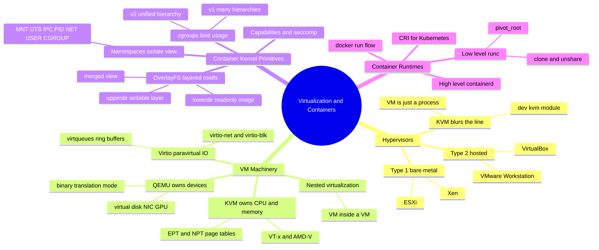
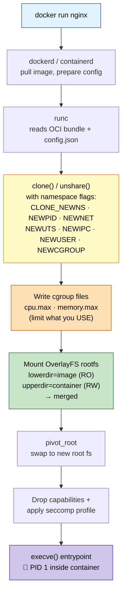
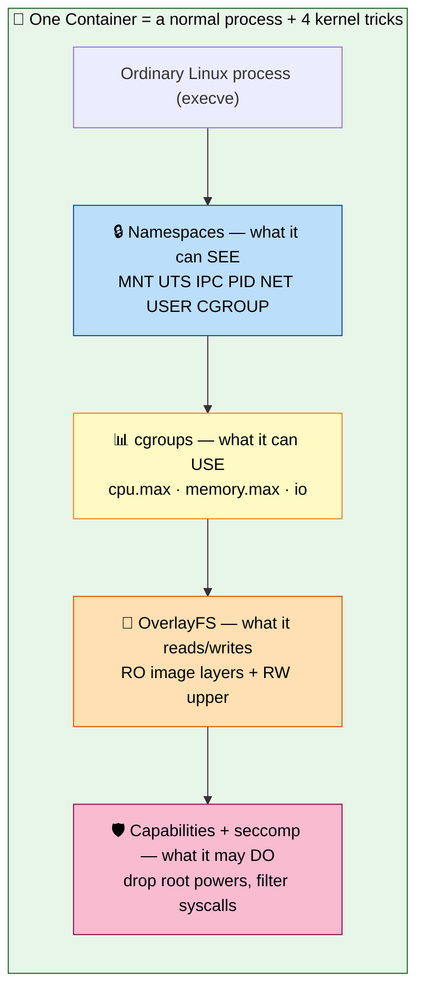
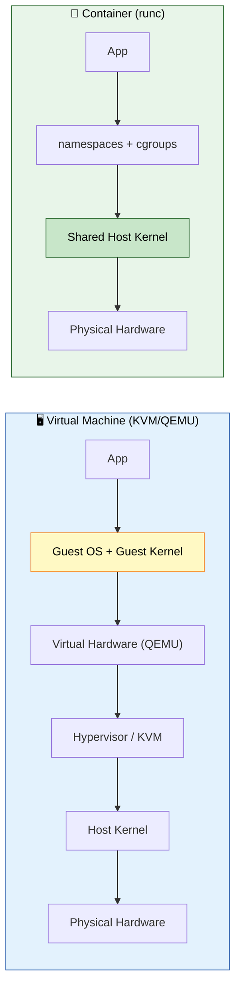
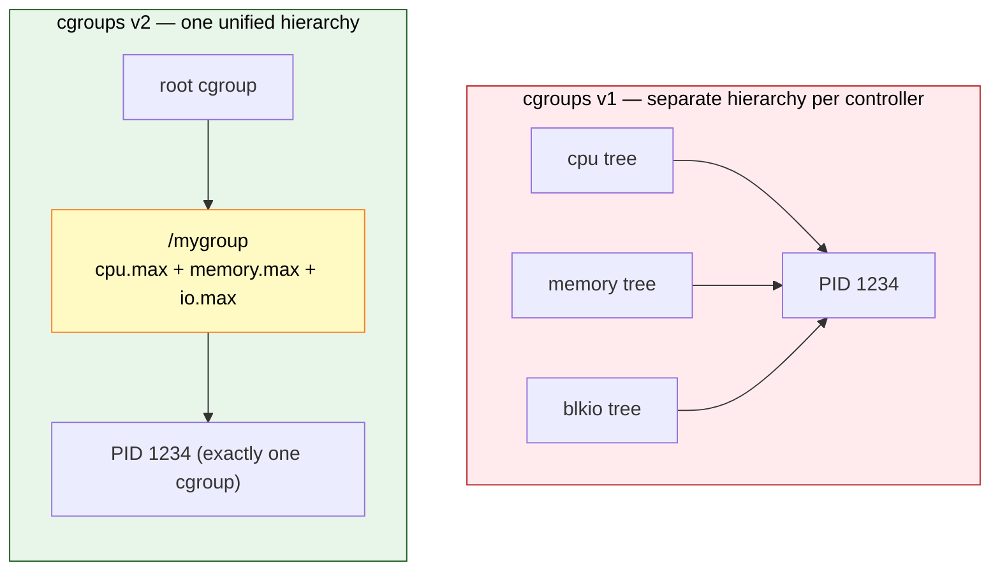
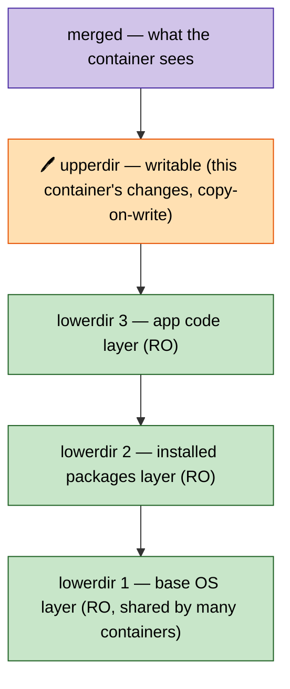
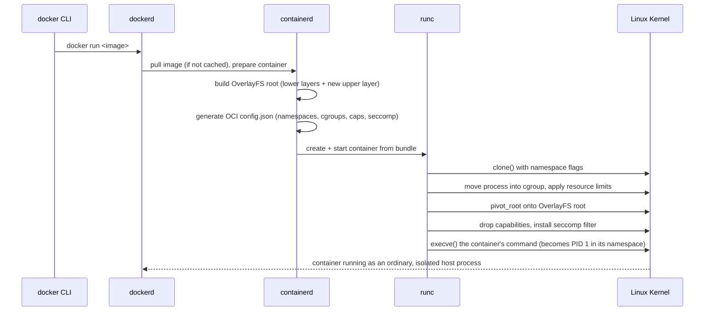

# Section 9: Virtualization & Containers on Linux

This section covers how Linux implements virtualization (KVM/QEMU) and containers — tying together
namespaces, cgroups, and OverlayFS from earlier sections into the concrete mechanics of `docker run`
and a KVM guest, including how to build a container from raw primitives by hand.

## Subtopic Index
- [Hypervisors (Type 1 vs Type 2)](#hypervisors-type-1-vs-type-2)
- [KVM Architecture](#kvm-architecture)
- [QEMU](#qemu)
- [Virtio](#virtio)
- [Linux Namespaces (recap: PID, NET, MNT, UTS, IPC, USER, CGROUP)](#linux-namespaces-recap-pid-net-mnt-uts-ipc-user-cgroup)
- [cgroups v1 vs v2](#cgroups-v1-vs-v2)
- [OverlayFS for Containers](#overlayfs-for-containers)
- [Container Runtimes (runc, containerd, CRI-O)](#container-runtimes-runc-containerd-cri-o)
- [How `docker run` Maps to Kernel Primitives](#how-docker-run-maps-to-kernel-primitives)
- [Nested Virtualization](#nested-virtualization)

---

## 🗺️ Visual Overview

**Mind map — the whole section at a glance** (skim this first, revisit it last):



**How `docker run` becomes kernel primitives** (the highest-value flow in the section):



**A container is not a thing — it is a bundle of kernel features** (layers, not a VM):



**VM vs Container — where the isolation boundary sits:**



> 🧠 **Memory hooks (mnemonics):**
> - **The 7 namespaces** — *"My Uncle Ian Pets Nine Ugly Cats"* → **M**NT, **U**TS, **I**PC, **P**ID, **N**ET, **U**SER, **C**GROUP.
> - **Namespaces vs cgroups:** *namespaces = what you **SEE** (isolation), cgroups = what you **USE** (limits).* SEE vs USE.
> - **Type 1 vs Type 2:** Type **1** stands **alone** on bare metal (1 = one layer, hardware); Type **2** needs a host OS **too** (2 = two layers). "Bare-metal firstborn, hosted second."
> - **KVM vs QEMU division:** *KVM = the **C**PU/memory **C**ore; QEMU = the **D**evices/**D**isks.* "Kernel does the Compute, QEMU does the Devices."
> - **OverlayFS layers:** *lower = **L**ocked (read-only image), upper = **U**pdatable (writes), merged = what you sea.* Copy-on-write: touch a file → it's copied **up**.

---

## Hypervisors (Type 1 vs Type 2)

> 🎯 **Interview weight: Medium** — know the taxonomy, but the real payoff is explaining why KVM breaks it.

**In one line:** A **hypervisor** creates and manages VMs; the Type 1 vs Type 2 split is about whether it runs on bare metal or on top of a host OS — and **KVM** deliberately blurs the line.

**The two classic types:**

| | Type 1 ("bare-metal") | Type 2 ("hosted") |
|---|---|---|
| Runs on | Physical hardware directly, no host OS | As an app atop a running host OS |
| Examples | VMware ESXi, Xen | VirtualBox, VMware Workstation |
| Privilege | Most privileged software on the box | Relies on host OS for scheduling/devices |
| Best for | Production, dense multi-tenant hosts | Desktop/dev, easy to install |

A **Type 1** hypervisor is itself the most privileged software on the machine, directly managing physical CPU scheduling, memory, and devices across all guests. A **Type 2** hypervisor leans on the already-running host OS for scheduling and device access — simpler to use, but with an extra layer of resource-management indirection.

**Where KVM fits:** **KVM** (Kernel-based Virtual Machine) is a *kernel module* that turns the ordinary, already-running Linux kernel into a Type-1-style hypervisor. The "host OS" and "hypervisor" are the same running kernel — and the kernel's normal process scheduler schedules guest execution as just another schedulable task, not a separate hypervisor scheduling domain.

> 🧠 **Mental model:** To the host kernel, a KVM VM is *just a process*. It shows up in `ps`/`top` as `qemu-system-x86_64`, distinguished only by using `/dev/kvm` to run guest CPU instructions directly on the physical CPU instead of emulating them in software.

### Key commands
```
lsmod | grep kvm                    # confirm the kvm kernel module is loaded
cat /sys/module/kvm_intel/parameters/nested   # (Intel) check nested virtualization support/enablement
ps aux | grep qemu                    # KVM guests appear as ordinary host processes
virsh list --all                        # (libvirt) list managed VMs and their state
```

## KVM Architecture

> 🎯 **Interview weight: High** — the KVM-vs-QEMU division of labor is a classic deep-dive.

**In one line:** **KVM** exposes the CPU's hardware virtualization extensions (Intel **VT-x** / AMD **AMD-V**) through the `/dev/kvm` device so userspace (QEMU) can create and run VMs at near-native speed.

**How it works:** Userspace virtualization software (almost always QEMU) opens `/dev/kvm` and issues `ioctl()` calls to create and control VMs. The hardware extensions are what make this fast instead of pure software emulation.

**What the hardware extensions give you:**

- A new CPU privilege mode (**VMX root/non-root** on Intel) that lets guest code run the vast majority of its instructions *directly* on the physical CPU at native speed.
- Automatic hardware **trap-and-emulate**: the CPU traps only specific privileged operations (touching certain control registers, executing an I/O instruction) back out to the hypervisor.
- This is fundamentally faster than older pre-hardware techniques that interpreted every instruction in software or used binary translation to rewrite privileged instructions dynamically.

**What KVM owns — CPU and memory only:**

- **Virtual CPUs:** each vCPU is an ordinary thread inside the owning QEMU process. A 4-vCPU guest is scheduled by the host as 4 independent threads competing for CPU time, exactly like any multi-threaded process.
- **Guest memory:** managed via nested/extended page tables (**EPT** on Intel, **NPT** on AMD) — a second hardware translation layer mapping guest-physical to host-physical addresses directly, avoiding the costly software "shadow page table" bookkeeping older approaches required.

> ⚠️ **Gotcha:** Device emulation (virtual disks, NICs, graphics) is *not* KVM's job at all — that belongs entirely to QEMU, the userspace process that owns the `/dev/kvm` file descriptor. KVM is narrowly scoped to just the CPU/memory virtualization primitives.

### Key commands
```
cat /proc/cpuinfo | grep -o 'vmx\|svm'    # confirm CPU hardware virtualization extension support
virsh dominfo <vm-name>                     # libvirt-managed VM configuration/state summary
cat /sys/kernel/debug/kvm/*                  # (if debugfs mounted) low-level KVM statistics
ps -T -p <qemu-pid>                            # show per-vCPU threads within a running QEMU process
```

## QEMU

> 🎯 **Interview weight: Medium** — pairs directly with KVM; know which half does what.

**In one line:** **QEMU** (Quick EMUlator) is the userspace program that builds a complete virtual machine around KVM's CPU/memory primitives — providing all the "hardware" (disks, NICs, graphics, USB, firmware/BIOS) that KVM deliberately leaves out.

**QEMU runs in two very different modes:**

| Mode | How it runs the guest CPU | Speed |
|------|---------------------------|-------|
| Pure emulator | Dynamic binary translation, instruction by instruction — can run a *different* CPU arch (ARM guest on x86 host) | Much slower |
| KVM accelerator (`-enable-kvm` / `qemu-kvm`) | Delegates CPU execution to KVM's hardware path; keeps only device emulation | Near-native |

This is exactly why a KVM-accelerated VM shows up in `ps` as a `qemu-system-x86_64` process: that process is QEMU providing the VM's virtual hardware (disk, network, console) and lifecycle, opening `/dev/kvm` and handing guest CPU execution to the kernel's KVM module rather than interpreting instructions itself.

**Management tooling sits above raw QEMU:**

- **`libvirt`** (with the `virsh` CLI, or `virt-manager`) provides a standardized, XML-driven API to define, start, stop, and migrate VMs.
- It saves admins from hand-writing the frequently very long, detailed raw QEMU command line for every VM.

> 🔍 **Under the hood:** Cloud hypervisor layers (historically much of AWS's early EC2 infrastructure) were themselves built atop Xen or KVM/QEMU foundations, with substantial custom engineering layered on for multi-tenant, massive-scale operation.

### Key commands
```
qemu-system-x86_64 -enable-kvm -m 2G -hda disk.img   # launch a KVM-accelerated guest directly
virsh edit <vm-name>                                    # edit a libvirt-managed VM's underlying XML definition
virt-install --name test --memory 2048 --disk size=10     # create a new VM via the higher-level virt-install tool
qemu-img create -f qcow2 disk.img 20G                        # create a virtual disk image
```

## Virtio

> 🎯 **Interview weight: Medium** — the go-to answer for "why is my VM's I/O slow?"

**In one line:** **Virtio** is a standardized paravirtualization interface that replaces slow, faithful hardware emulation with efficient shared-memory ring buffers — trading a guest-driver requirement for far better I/O performance.

**The problem with emulating real hardware:** Early VMs faithfully emulated a specific real NIC or disk controller so unmodified guests could use their existing drivers, unaware they were virtualized. Functionally correct, but every device interaction (a disk read, a network packet) had to trap out to the hypervisor and be processed through logic replicating that device's exact register-level behavior — often many trap-and-emulate round trips for one logical operation.

**How virtio fixes it:** Instead of emulating a real device, virtio defines a virtualization-aware device model from the ground up:

- Guest drivers written specifically for virtio (**virtio-net**, **virtio-blk**, **virtio-scsi**, **virtio-gpu**, and others, all in the mainline Linux kernel and available for other major guest OSes) talk to the hypervisor through shared-memory ring buffers called **virtqueues**.
- Both guest driver and host-side backend access the virtqueues directly, batching many I/O requests into shared memory descriptors.
- This needs far fewer expensive trap-to-hypervisor transitions than register-level hardware emulation.

**The trade-off** requires guest awareness: the guest must have virtio drivers installed (universal on any modern Linux guest, available for Windows). In exchange it gets substantially better I/O — which is why virtio is the default, strongly recommended choice for any capable KVM/QEMU guest, with fully-emulated models kept mainly for guests too old or specialized to have virtio support.

> 🔍 **Under the hood:** **`vhost`** goes further for networking/storage by moving the host-side virtqueue processing out of QEMU's userspace and directly into the host kernel (`vhost-net`, `vhost-scsi`), removing another userspace↔kernel round trip from the already-optimized data path for even lower latency and higher throughput on the most performance-sensitive device types.

### Key commands
```
lsmod | grep virtio                  # confirm virtio guest drivers are loaded (run inside the guest)
virsh domiflist <vm-name>              # confirm a VM's network interface is configured as virtio model
qemu-system-x86_64 ... -device virtio-net-pci,netdev=net0   # explicitly request virtio-net for a guest NIC
cat /sys/module/vhost_net/refcnt         # confirm vhost-net kernel acceleration is in use on the host
```

## Linux Namespaces (recap: PID, NET, MNT, UTS, IPC, USER, CGROUP)

> 🎯 **Interview weight: High** — namespaces are half of "what a container actually is."

**In one line:** The seven **namespace** types each give a process group an isolated *view* of one kind of system resource — and combining all seven correctly is exactly the "build a container from scratch" exercise.

> 📌 Individual namespace types are covered in depth in their own sections — PID in Section 2, NET in Section 5, USER/security in Section 6. This entry consolidates them as the container-construction toolkit.

**The seven namespace types:**

| Namespace | Isolates | Notes |
|-----------|----------|-------|
| **PID** | Process ID space | First process becomes PID 1 *within* the namespace (own subreaper/zombie-reaping duty, per Section 2); still an ordinary, differently-numbered process from the host's view |
| **Mount (MNT)** | Mounted filesystems | Lets a container have its own root FS (typically an OverlayFS stack) and mount points invisible to and independent from the host's mount table |
| **UTS** | Hostname & NIS domain name | Container reports its own distinct hostname via `hostname`/`uname` |
| **IPC** | System V IPC objects + POSIX message queues | Blocks a container from seeing/interfering with host or other containers' IPC objects |
| **Network (NET)** | Independent network stack (Section 5) | Own interfaces, routes, ports |
| **User (USER)** | UID/GID mapping (Section 6) | The security-critical piece enabling *rootless* containers |
| **Cgroup** | View of its own cgroup hierarchy path | Newest of the seven; `/proc/self/cgroup` shows container-relative paths instead of the revealing host-wide hierarchy — closing a minor but real information-disclosure gap |

> ⚠️ **Gotcha:** No single namespace — nor even most of the seven combined without the rest — is genuine isolation on its own. "A container" at the kernel-primitive level is *all seven* combined **plus** cgroups for resource limiting **plus** MAC/seccomp/capabilities for permission restriction (Section 6).

### Key commands
```
unshare --pid --mount --uts --ipc --net --user --cgroup --fork bash   # construct all seven namespace types at once
lsns                                    # list every active namespace of every type on the system
ls -l /proc/<pid>/ns/                     # inspect which specific namespace instances a process belongs to
nsenter --target <pid> --all bash           # enter every namespace of an existing process (debugging containers)
```

## cgroups v1 vs v2

> 🎯 **Interview weight: High** — the other half of "what a container is"; the v1→v2 shift comes up often.

**In one line:** **cgroups** limit and account for resource usage; **v1** gave each controller its own independent hierarchy, while **v2** unifies every controller onto one hierarchy where a process belongs to exactly one cgroup.

> 📌 cgroups' per-resource mechanics live elsewhere — CPU in Section 2, memory in Section 3, PIDs/security in Section 6. This entry focuses on the v1-vs-v2 architecture itself.

**cgroups v1 — independent hierarchies:**

- Each controller (cpu, memory, blkio, pids, …) could be mounted as an entirely independent hierarchy.
- A process could sit simultaneously at different, unrelated positions in the CPU hierarchy vs the memory hierarchy vs the blkio hierarchy.
- In practice this created substantial complexity: controllers' hierarchies could disagree about how processes were logically grouped, making a workload's *total* resource footprint genuinely hard to reason about across every dimension.
- Controllers evolved somewhat independently over v1's long life, ending up with subtly inconsistent semantics and interfaces.

**cgroups v2 — the "unified hierarchy"** (default, and increasingly the *only* option on modern kernels/distributions):

- Every controller lives on a single, unified hierarchy; every process belongs to exactly one cgroup at a time.
- Every controller enabled for that cgroup applies consistently to that same single grouping — eliminating controllers disagreeing about a workload's logical grouping.
- A consistent `cgroup.controllers` / `cgroup.subtree_control` mechanism enables controllers per-subtree, replacing v1's ad-hoc per-controller-hierarchy mounting.
- Meaningfully better controller semantics: `memory.high` soft-throttling (Section 3) has no clean v1 equivalent, and the v2 PID and I/O controllers (`io.max`, replacing v1's less consistent `blkio`) are generally considered better-designed.

> 💡 **Interview tip:** Modern Docker, containerd, and Kubernetes (`cgroupDriver=systemd`) have fully migrated to cgroups v2 by default — but v1 still shows up on older kernels, some enterprise-distro default configs, and older docs/tooling, so understanding its separate-hierarchy model remains genuinely relevant interview and operational knowledge.

**v1 many hierarchies vs v2 one unified hierarchy:**



### Key commands
```
mount | grep cgroup                  # confirm whether v1 (multiple mounts) or v2 (single unified mount) is active
cat /sys/fs/cgroup/cgroup.controllers   # (v2) list available controllers on the unified hierarchy
cat /sys/fs/cgroup/<path>/cgroup.subtree_control   # (v2) controllers enabled for child cgroups at this level
stat -fc %T /sys/fs/cgroup/               # filesystem type check: cgroup2fs (v2) vs tmpfs (v1's mount point convention)
```

## OverlayFS for Containers

> 🎯 **Interview weight: High** — explains why container images are small and startup is fast.

**In one line:** **OverlayFS** maps a container image's stack of read-only layers plus one thin writable layer directly onto the kernel's overlay mount model — giving cheap layer sharing and copy-on-write.

> 📌 OverlayFS's general mechanics are in Section 4; this entry focuses on its role as the standard container image/filesystem model.

**How image layers map to overlay:**

- A container image is a stack of independent, read-only layers — one per build step (base OS layer → installed-packages layer → application-code layer).
- Each pulled image layer becomes one read-only **lower** directory in the overlay stack.
- The running container's own changes go entirely into a thin writable **upper** layer unique to that container instance.
- **Copy-up** semantics (Section 4): any file the container modifies is first copied from whichever read-only layer it originates in up into the private upper layer before being changed — leaving the shared, read-only image layers completely untouched and safely shareable across every other container from the same image.

**Why this is space-and-time efficient at scale:**

- Pulling ten different images that all share the same common base-OS layer (very common, since most images derive from a small set of approved base images) stores that shared layer's content exactly *once* on disk.
- Starting a new container from an already-present image requires no data copying at all — it just constructs a new empty writable upper layer and mounts the stack, completing in well under a second regardless of total image size.
- This is exactly why container startup is so dramatically faster than provisioning an equivalent traditional VM.

> 🧠 **Mental model:** A container's writable upper layer is discarded by default when the container is removed (unless explicitly committed into a new image layer, or unless persistent data lives on an explicitly-mounted volume bypassing the overlay). This directly embodies and enforces the "immutable infrastructure" pattern (Section 11) — a container's writable state is meant to be ephemeral and disposable by design, not durably persisted without a deliberate volume mount.

**The overlay stack — read-only image layers under one writable layer:**



### Key commands
```
docker inspect <container> --format '{{.GraphDriver.Data}}'   # show the actual overlay lower/upper/merged paths in use
mount | grep overlay                                             # inspect active overlayfs mounts directly
du -sh /var/lib/docker/overlay2/*/diff                              # per-layer disk usage on the host
ctr images ls                                                         # (containerd) list locally-cached image layers
```

## Container Runtimes (runc, containerd, CRI-O)

> 🎯 **Interview weight: High** — the runc/containerd/CRI-O layering is a very common distinction question.

**In one line:** Container "runtimes" span several layers — **runc** does the low-level kernel work, **containerd** manages images and lifecycle, and **CRI-O** is a minimal Kubernetes-only alternative.

**`runc` — the low-level OCI runtime:**

- Takes an already-fully-prepared filesystem bundle (an extracted root FS plus a `config.json` describing namespaces, cgroup limits, capabilities, and the command to run) and performs the actual low-level kernel work: creates namespaces, sets up cgroups, applies seccomp/capabilities restrictions, then `execve()`s the container's specified process.
- Does *not* pull images, run a daemon, or persist any state beyond the single container it was invoked to create.
- Nearly every higher-level tool (Docker, containerd, CRI-O, Podman) ultimately shells out to `runc` — or an OCI-runtime-spec-compatible alternative like **`crun`**, the sandboxed **gVisor/runsc**, or VM-based **Kata Containers** — for this final, lowest-level container-creation step.

**`containerd` — one layer above `runc`:**

- Responsible for the broader lifecycle: pulling and unpacking images from a registry, managing image storage (the OverlayFS layer stack above), and supervising running containers (tracking state, handling restarts, streaming logs).
- Is what Docker itself is actually built on top of today — Docker's daemon delegates most of this heavy lifting to an embedded `containerd` instance rather than reimplementing it.
- Is also directly usable as a Kubernetes-compatible runtime in its own right via its native **CRI** (Container Runtime Interface) plugin, without Docker involved at all.

**`CRI-O` — purpose-built for Kubernetes:**

- A minimal alternative implementing *just* the Kubernetes CRI interface (unlike containerd, which supports CRI as one of several possible consumption interfaces).
- Deliberately implements nothing beyond exactly what Kubernetes needs, favoring a smaller, more tightly-scoped codebase and attack surface over the broader general-purpose feature set containerd/Docker also provide.

> 🧠 **Mental model:** The full layering is **CRI** (Kubernetes' runtime-agnostic interface) → **containerd/CRI-O** (image management + container lifecycle) → **runc/crun/gVisor/Kata** (actual namespace/cgroup/execution primitives). This is precisely what lets Kubernetes stay runtime-agnostic, supporting any CRI-compliant implementation interchangeably without the control plane knowing which low-level runtime runs underneath.

### Key commands
```
runc list                             # list containers directly managed by runc on this host
ctr containers list                     # (containerd's own CLI) list containers containerd is managing
crictl ps                                 # CRI-level view of containers (works against containerd or CRI-O)
docker info | grep -i "Runtime\|driver"     # confirm which runtime/runc variant Docker itself is configured to use
```

## How `docker run` Maps to Kernel Primitives

> 🎯 **Interview weight: High** — one of the most common "explain what actually happens" container exercises.

**In one line:** `docker run` walks the whole stack — CLI → daemon → containerd (image + OverlayFS + OCI config) → runc (namespaces, cgroups, `pivot_root`, seccomp, `execve`) — leaving behind an ordinary, isolated Linux process.

**Step by step:**

1. **CLI → daemon.** The Docker CLI sends the request to `dockerd`, which checks whether the image is present locally and, if not, pulls it — downloading each layer and unpacking it into the OverlayFS-backed local image store managed by the embedded `containerd`.
2. **containerd prepares the container.** It builds the root filesystem as an OverlayFS mount (the image's read-only layers beneath a fresh empty writable layer), then generates an OCI-spec `config.json` describing:
   - the requested namespaces (PID, mount, UTS, IPC, network — plus user namespace if rootless/remapped mode is configured),
   - resource limits (translated from `--memory`/`--cpus` into the corresponding cgroup v2 controller settings),
   - capability grants/drops, and the seccomp profile.
3. **runc does the actual kernel work.** containerd hands the fully-prepared bundle to `runc`, which:
   - calls `clone()` with the appropriate namespace flags to create the isolated execution context,
   - moves the new process into the pre-created cgroup (applying the configured resource limits),
   - performs the mount namespace setup and `pivot_root`s onto the prepared OverlayFS root,
   - drops capabilities and installs the seccomp filter per the OCI spec,
   - finally `execve()`s the container's specified command, which becomes **PID 1** within its own new PID namespace.

> 🧠 **Mental model:** From this point on, the running container is — at the kernel level — nothing more than an ordinary Linux process under the same scheduler, memory manager, and VFS as any other. It's distinguished *only* by which namespaces created it, which cgroup constrains its resource consumption, and which capability/seccomp/MAC restrictions apply — precisely the combination of primitives from this whole section.



### Key commands
```
docker run --rm -it alpine sh          # trigger the full pipeline just described
docker inspect <container> --format '{{.State.Pid}}'   # find the host-visible PID of a container's init process
cat /proc/<host-pid>/status | grep NSpid   # confirm the same process's PID within its own namespace vs the host's
ls -l /proc/<host-pid>/ns/                  # inspect every namespace the container process actually belongs to
```

## Nested Virtualization

> 🎯 **Interview weight: Low** — niche, but a clean way to show you understand trap/translation overhead.

**In one line:** **Nested virtualization** runs a hypervisor and its guests *inside* a VM that is itself already a guest — useful for CI/testing and "bring your own hypervisor" clouds, at a real, compounding performance cost.

**Why you'd want it:**

- CI/testing environments that spin up and test full VM-based infrastructure without dedicated bare-metal hardware for every test run.
- Cloud "bring your own hypervisor" scenarios (e.g., a nested Kubernetes-in-KVM lab atop an already-virtualized cloud instance).

**How KVM does it:** KVM exposes the hardware virtualization extensions (VT-x/AMD-V) themselves *into* a guest, letting that guest's own kernel load its own KVM module and create its own "level 2" guests underneath it. The outer (level 0) hypervisor must explicitly enable this pass-through (`kvm_intel nested=1` / `kvm_amd nested=1` module parameters), since exposing raw virtualization capability into a guest is not a default-safe assumption the host makes unprompted.

> ⚠️ **Gotcha:** Nested virtualization carries genuinely real, compounding overhead:
> - A level-2 guest's privileged instruction traps must now be handled by *two* layers of hypervisor mediation in sequence (the level-1 guest's own KVM, itself running atop the level-0 host's KVM).
> - Address translation must traverse *three* levels — guest-virtual → guest-physical → host-physical — and hardware acceleration for nested page-table walks is historically less mature than for single-level virtualization.
> - Expect meaningfully worse performance than an equivalent single-level VM, especially for memory- or I/O-intensive workloads. It's a reasonable choice for functional testing and development, but approach production performance-sensitive workloads cautiously and benchmark on the exact hardware/kernel combination in use.

### Key commands
```
cat /sys/module/kvm_intel/parameters/nested   # confirm nested virtualization is enabled at the host/level-0 layer
modprobe kvm_intel nested=1                     # enable nested virtualization support (Intel)
lscpu | grep Virtualization                       # confirm virtualization capability visible from within a guest
virt-host-validate                                  # sanity-check a host's virtualization capability/configuration
```

---

### Interview Questions

**Conceptual/Internals (8)**

1. **Why is KVM described as blurring the Type 1 vs Type 2 hypervisor distinction?**
   KVM is a kernel module that turns an already-running, ordinary Linux kernel into a hypervisor — the
   "host OS" and "hypervisor" are the same running kernel, and the kernel's own process scheduler
   directly schedules VM guest execution as just another kind of task, rather than KVM introducing an
   independent hypervisor scheduling domain the way a classic Type 1 design (or a Type 2 design running
   as an application atop a separate host OS) would.

2. **What is the division of responsibility between KVM and QEMU?**
   KVM handles CPU and memory virtualization — creating virtual CPUs (scheduled as threads within the
   owning QEMU process) and managing guest-physical-to-host-physical memory translation via hardware
   nested/extended page tables. QEMU handles everything else a complete virtual machine needs: device
   emulation/paravirtualization (disk, network, graphics), guest firmware, and overall VM lifecycle
   management, delegating only the actual CPU instruction execution to KVM's hardware-accelerated path.

3. **What problem does virtio solve compared to fully-emulated virtual hardware?**
   Fully-emulated device models faithfully replicate real physical hardware's register-level behavior,
   requiring many expensive trap-to-hypervisor round trips per logical I/O operation. Virtio is a
   paravirtualized, virtualization-aware device interface using shared-memory ring buffers
   (virtqueues) that batch requests and require far fewer traps, at the cost of requiring guest-side
   virtio-specific drivers rather than working with any unmodified, hardware-agnostic guest driver.

4. **List the seven Linux namespace types and, briefly, what each isolates.**
   PID (process ID space), Mount (filesystem mount table), UTS (hostname/domain name), IPC (System
   V/POSIX IPC objects), Network (network stack), User (UID/GID mapping), and Cgroup (view of the
   cgroup hierarchy path). No single one alone constitutes container isolation; all seven combined,
   plus cgroups and MAC/seccomp/capabilities, comprise what "a container" actually is.

5. **What is the key architectural difference between cgroups v1 and v2?**
   v1 allowed each resource controller to be mounted as an independent hierarchy, letting a process
   belong to different logical groupings per controller and creating real inconsistency reasoning about
   a workload's total resource footprint. v2 unifies every controller onto a single hierarchy where
   every process belongs to exactly one cgroup, with all enabled controllers applying consistently to
   that same grouping.

6. **Explain the layering between runc, containerd, and CRI-O.**
   `runc` is the lowest-level OCI runtime performing the actual namespace/cgroup/capability/seccomp
   setup and final `execve()` for one container, given an already-prepared bundle. `containerd` sits
   above it, handling image pulling/unpacking, image layer storage, and running-container lifecycle
   management, and is what Docker itself is built on top of. `CRI-O` is a purpose-built, minimal
   alternative implementing only the Kubernetes CRI interface, favoring a smaller scope/attack surface
   over containerd's broader general-purpose feature set.

7. **How does OverlayFS's layer model make container images space-efficient across many containers
   sharing a base image?**
   Each image layer becomes a read-only lower directory in an overlay stack; a running container's
   changes are captured entirely in its own private, thin writable upper layer via copy-up semantics,
   leaving shared read-only layers untouched. Multiple containers built from images sharing common
   base layers store that shared content exactly once on disk, and starting a new container requires no
   data copying, only constructing a new empty upper layer and mounting the stack.

8. **Why does nested virtualization carry meaningfully more overhead than single-level
    virtualization?**
    A nested (level-2) guest's privileged instruction traps must be handled by two layers of hypervisor
    mediation in sequence rather than one, and address translation must traverse three levels
    (guest-virtual to guest-physical to host-physical) instead of two, with hardware acceleration for
    this nested translation historically less mature than for standard single-level virtualization —
    together producing real, compounding performance overhead especially for memory- and I/O-intensive
    workloads.

**Scenario/Troubleshooting (6)**

9. **A container running as UID 0 needs to be verified as either genuinely isolated (user-namespace-
    mapped) or a real host-root risk. How do you check quickly?**
    Inspect `/proc/<host-pid>/uid_map` for the container's process — a genuine, non-identity mapping
    confirms the container's apparent root is mapped to an unprivileged host UID; an identity mapping
    (or the file showing the full, unrestricted UID range) indicates the container is running with
    real host-root privilege despite its own internal appearance of being isolated.

10. **A host running many containers from the same base image shows disk usage far higher than
    expected, given OverlayFS's layer-sharing design.**
    Check whether the images were actually built consistently from a shared base layer (`docker
    history`/comparing layer digests) — images rebuilt independently even from "the same" Dockerfile
    without deterministic build caching can produce layers with different digests despite conceptually
    identical content, defeating layer sharing. Also confirm the storage driver in use genuinely
    supports the expected overlay semantics (some backing filesystems have historically had overlay
    driver compatibility issues that silently degrade to less space-efficient behavior).

11. **A KVM guest's disk I/O performance is far below the underlying host storage's actual
    capability. What's the first thing to check?**
    Confirm the guest's disk device model is actually virtio-blk/virtio-scsi rather than a fully-
    emulated legacy device model (`virsh domblklist`/inspecting the QEMU command line/XML config) —
    fully-emulated device models incur substantially higher per-I/O-operation overhead than virtio's
    paravirtualized ring-buffer-based approach, and this is one of the most common, easily-fixed causes
    of poor guest storage performance.

12. **After enabling nested virtualization for a CI pipeline, level-2 guest VMs are functional but
    noticeably slower than expected compared to equivalent single-level VMs on the same hardware.**
    This is largely expected given nested virtualization's inherent compounding overhead (two layers
    of trap handling, three-level address translation); confirm nested extended/nested page table
    hardware support is actually active and being used (rather than falling back to a slower software
    shadow-paging path for the nested case specifically) and benchmark against the specific hardware/
    kernel combination in use, since nested virtualization performance characteristics vary
    meaningfully across CPU generations and kernel versions.

13. **A container image build process produces a final image far larger than expected, despite
    apparently minimal application code being added in the final layers.**
    Inspect the full layer history (`docker history <image>`) rather than only the final Dockerfile
    stage — a common cause is temporary build artifacts (package manager caches, compiled dependencies
    later deleted) being added in one layer and then "deleted" in a subsequent layer; because OverlayFS
    layers are immutable once built, a deletion in a later layer does not shrink the already-built
    earlier layer that still contains the large content, only masks it in the merged view, meaning
    multi-stage builds (or combining install-and-cleanup into a single layer) are required to actually
    reduce final image size.

**FAANG-level Deep Dive (6)**

15. **Explain precisely why KVM's use of extended/nested page tables (EPT/NPT) avoids the overhead
    that pre-hardware-virtualization "shadow page table" techniques required.**
    Shadow paging required the hypervisor to maintain and keep synchronized an entirely separate,
    software-managed page table reflecting the composition of guest-virtual-to-host-physical
    translation, trapping and emulating every guest page table modification to keep the shadow tables
    consistent — a significant per-modification overhead for any guest workload that frequently updates
    its own page tables (process creation/exit, memory-mapping-heavy workloads). EPT/NPT instead let
    the guest maintain its own ordinary page tables (translating guest-virtual to guest-physical)
    entirely without hypervisor involvement, with the CPU's memory management unit performing a second,
    hardware-native translation step (guest-physical to host-physical) automatically on every memory
    access, requiring no hypervisor trapping or shadow-table synchronization at all for ordinary guest
    page table updates.

16. **Why does a container's PID namespace's "PID 1 equivalent" still need the same subreaper/
    zombie-reaping responsibilities as a real system's actual PID 1, and what commonly goes wrong when
    this is overlooked?**
    Within a PID namespace, the first process is that namespace's own PID 1, and the kernel's PID-1
    semantics (inheriting orphaned descendants, being the mandatory reaper of last resort for that
    namespace) apply exactly the same as for the host's real PID 1 — a container's main process, even
    if it's just an application binary never designed to be an init system, still becomes responsible
    for reaping its own zombie children within that namespace. This is commonly overlooked when a
    container's `ENTRYPOINT` is an ordinary application (or a simple wrapper shell script) with no
    proper `SIGCHLD` handling, leading to exactly the zombie-accumulation problem discussed in Section
    2, which is why minimal init wrappers like `tini`/`dumb-init` (or a runtime's built-in equivalent)
    are the standard remediation.

17. **Explain why cgroups v1's independent per-controller hierarchies could allow a process's
    *effective* resource limits to become genuinely difficult to reason about, with a concrete
    example.**
    Because a process could belong to different positions in the CPU-controller hierarchy versus the
    memory-controller hierarchy independently, an administrator inspecting "what CPU limit applies to
    this process" and "what memory limit applies to this process" might need to trace two entirely
    separate, potentially inconsistently-organized hierarchy trees to answer each question, with no
    guarantee those two hierarchies group related processes the same way at all — a process could,
    for instance, be grouped with a database's other processes for memory-limiting purposes while
    simultaneously being grouped with an unrelated batch job for CPU-limiting purposes, if the two
    hierarchies were configured/populated independently, a genuinely confusing possibility cgroups v2's
    single unified hierarchy eliminates by construction.

18. **Why does `vhost-net` reduce network I/O latency for a KVM guest beyond what plain virtio-net
    alone achieves, at a mechanistic level?**
    Plain virtio-net still requires QEMU's own userspace process to process each virtqueue
    notification/data transfer, meaning a guest network packet's path includes a guest-to-host trap,
    then host-kernel-to-QEMU-userspace handoff, then QEMU performing the actual host-side network
    operation. `vhost-net` moves the host-side virtqueue processing directly into the host kernel,
    letting the guest's virtqueue notifications be handled without needing to schedule and context-
    switch into QEMU's userspace process for each one, removing an entire kernel-to-userspace-and-back
    round trip from the per-packet data path and correspondingly reducing latency and CPU overhead for
    network-intensive guest workloads.

19. **Explain why a container image's layer digest-based content-addressing (rather than, say,
    layer-order-based identification) is what actually enables cross-image layer sharing in practice,
    and what breaks this sharing.**
    Container image layers are identified by a cryptographic content hash of their actual data, not by
    their position/order within any specific image's manifest — two entirely different images that
    happen to produce byte-for-byte identical layer content (e.g., both built `FROM` the same base
    image with the same initial `RUN` commands producing identical resulting filesystem state) will
    have identical layer digests and can therefore share that stored layer content on disk regardless
    of which image "logically" is considered to own it. This sharing breaks whenever build
    non-determinism (embedding build timestamps, non-reproducible package manager metadata, or
    differing build-argument values) causes what's conceptually "the same" layer to actually produce
    different byte content and therefore a different digest across separate builds, which is why
    reproducible, deterministic build practices are a genuine prerequisite for realizing OverlayFS's
    layer-sharing space efficiency at scale across many independently-built images.

20. **Why does CRI-O's narrower scope (versus containerd's broader general-purpose feature set)
    represent a genuine security/attack-surface trade-off rather than merely a stylistic
    implementation choice?**
    containerd supports multiple consumption interfaces and use cases beyond just Kubernetes CRI
    (standalone use via `ctr`, being Docker's own embedded engine, various plugin extension points),
    meaning its codebase necessarily includes functionality unrelated to what any specific Kubernetes
    deployment actually exercises through the CRI interface — extra code paths that, while not
    necessarily used by a given deployment, still exist as potential attack surface and maintenance
    burden. CRI-O deliberately implements nothing beyond exactly the Kubernetes CRI specification's
    requirements, meaning its entire codebase is relevant to and exercised by its actual Kubernetes
    use case, a genuinely smaller and more auditable attack surface for organizations whose only
    container runtime consumer is Kubernetes itself, at the cost of losing containerd's broader
    flexibility for any non-Kubernetes use case.

### Hands-On Labs

**Lab 1: Build a container from raw primitives without any container runtime**
- Objective: Construct full container-equivalent isolation entirely by hand.
- Setup: A Linux VM with root access.
- Tasks: Use `unshare` to create PID, mount, UTS, IPC, network, and user namespaces together; set up an
  OverlayFS root filesystem stack manually; `pivot_root` into it; create and apply a cgroup with CPU/
  memory/PID limits; finally `exec` a shell inside this fully-constructed environment.
- Expected outcome: A working, manually-constructed "container" demonstrating every underlying kernel
  primitive discussed in this section, with no container runtime tool involved at all.

**Lab 2: Launch and inspect a KVM guest directly with QEMU**
- Objective: Understand the KVM/QEMU relationship hands-on, without libvirt abstraction.
- Setup: A Linux host with KVM support (nested virtualization if working inside a cloud VM).
- Tasks: Create a virtual disk with `qemu-img`; launch a guest directly with `qemu-system-x86_64
  -enable-kvm`; from the host, use `ps -T` to observe the guest's vCPU threads and confirm the guest
  process's presence in `/dev/kvm`'s open file descriptors.
- Expected outcome: A running KVM guest with documented, verified evidence of its host-visible process/
  thread structure.

**Lab 3: cgroups v1 vs v2 comparison**
- Objective: Directly compare the two cgroup architectures' administrative interfaces.
- Setup: Two VMs (or one VM bootable with a kernel parameter forcing v1 vs v2), if available; otherwise
  a written comparison based on `/sys/fs/cgroup` inspection on available systems.
- Tasks: On a v1 system, inspect the separate per-controller mount points and note how a process's
  membership differs across controllers; on a v2 system, inspect the single unified hierarchy and
  `cgroup.subtree_control`.
- Expected outcome: A clear, hands-on-verified written comparison of the two architectures'
  administrative differences.

**Lab 4: OverlayFS layer sharing verification**
- Objective: Empirically confirm container image layer sharing and copy-up behavior.
- Setup: Docker or Podman installed on a test host.
- Tasks: Pull two different images sharing a common base layer; confirm (via `docker system df` or
  inspecting `overlay2` storage directly) the shared layer is stored only once; start a container,
  modify a file that originates in a shared read-only layer, and confirm (via `du`/direct inspection)
  the copy-up occurred into that container's own private upper layer without affecting the shared
  layer or other containers from the same image.
- Expected outcome: A documented, verified demonstration of both layer sharing and copy-up semantics.

**Lab 5: Full `docker run` kernel-primitive trace**
- Objective: Directly observe every kernel primitive `docker run` sets up, tying the whole section
  together.
- Setup: A Docker host.
- Tasks: Start a long-running container; find its host PID; inspect `/proc/<pid>/ns/*` to enumerate
  every namespace it belongs to; inspect its cgroup path and applied limits under `/sys/fs/cgroup/`;
  inspect its capability set via `/proc/<pid>/status`; confirm its root filesystem is an OverlayFS
  mount via `mount | grep overlay`.
- Expected outcome: A complete, evidence-backed inventory mapping every abstract concept in this
  section to concrete, observed state for one real running container.

### Production Incidents

**Incident 1: Container escape traced to a missing user namespace combined with an overly broad
capability grant**
- Symptom: A security assessment demonstrates a proof-of-concept container escape achieving genuine
  host-level root access from within a production container.
- Investigation: Confirmed the affected containers ran without user namespace remapping (container
  "root" was genuine host root) and were granted `CAP_SYS_ADMIN`, the same broad capability flagged in
  Section 6's incident record, here specifically exploited via a mount-related operation only possible
  because the escaping process was genuinely, not just apparently, running as host root.
- Root cause: Neither of the two independent, complementary isolation mechanisms (user namespace
  remapping, narrow capability grants) that should each have independently prevented or contained this
  escape was actually in place, allowing a single overly-broad capability grant to translate directly
  into full host compromise.
- Recovery: Removed the unnecessary capability grant and enabled user namespace remapping for all
  containers on the affected hosts, then re-ran the proof-of-concept to confirm the escape path was
  closed by each mitigation independently.
- Prevention: Established a mandatory security baseline requiring both user namespace remapping and
  minimal capability grants (not either one alone) for all production container workloads, validated
  by automated policy scanning before deployment.

**Incident 2: Disk exhaustion from non-deterministic container image builds defeating layer sharing**
- Symptom: A container registry and build-node local storage both grow far faster than expected given
  the organization's stated policy of building all images from a small set of shared, standardized
  base images.
- Investigation: Comparing layer digests across recently-built images revealed that a shared base
  layer, expected to be identical (and thus stored once) across dozens of images, actually had dozens
  of distinct digests — tracing the build process found a non-deterministic step (embedding a live
  build timestamp into a layer) that made every build's "identical" base layer content actually differ
  byte-for-byte.
- Root cause: A seemingly innocuous timestamp-embedding step in the shared base image's own Dockerfile
  broke reproducibility, defeating the content-addressed layer-sharing mechanism the storage capacity
  planning had implicitly assumed was in effect.
- Recovery: Removed the non-deterministic timestamp embedding, rebuilt the base image, and triggered a
  rebuild of dependent images, immediately restoring expected layer-sharing behavior and storage usage.
- Prevention: Added a reproducible-build validation check to the base image's own CI pipeline,
  specifically verifying that two consecutive builds from identical source produce identical layer
  digests before the base image is published for broader use.

**Incident 3: Severe, unexplained I/O latency traced to a guest using a legacy emulated disk
controller**
- Symptom: A newly-provisioned KVM-based virtual machine shows disk I/O latency an order of magnitude
  worse than other, similarly-specified VMs on the same physical host and storage backend.
- Investigation: Comparing the affected VM's libvirt XML definition against a known-good VM's
  configuration revealed the affected VM was configured with a legacy, fully-emulated IDE disk
  controller (inherited from an outdated provisioning template) rather than virtio-blk/virtio-scsi used
  by the comparison VM.
- Root cause: An outdated VM provisioning template, predating the organization's standardization on
  virtio device models, was still in use for a subset of VM images, silently causing every VM
  provisioned from it to suffer substantially degraded I/O performance compared to the organization's
  current standard.
- Recovery: Reconfigured the affected VM to use a virtio-scsi controller (requiring a guest-side driver
  verification and a reboot), immediately restoring expected I/O performance.
- Prevention: Audited and retired all outdated provisioning templates still specifying legacy emulated
  device models, and added an automated post-provisioning validation check confirming virtio device
  model usage before a newly-provisioned VM is marked ready for service.
