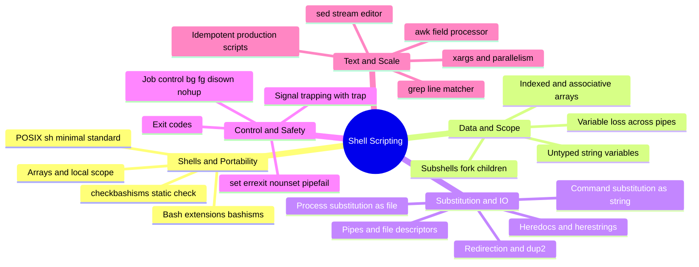
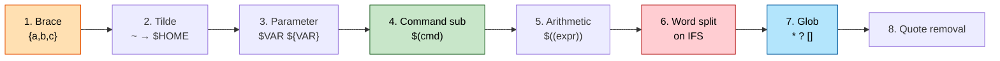
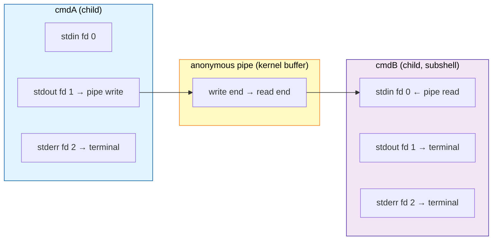
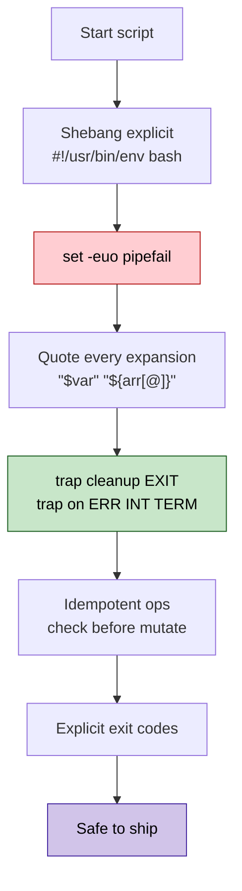
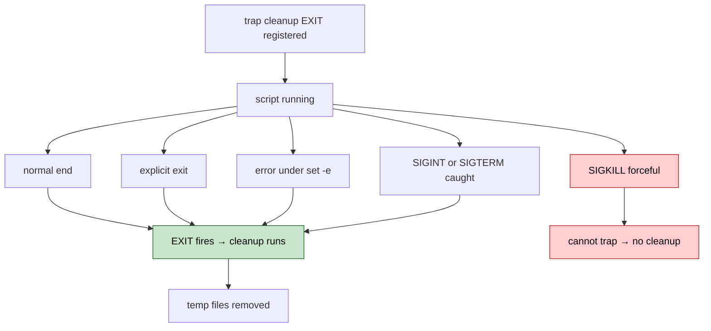
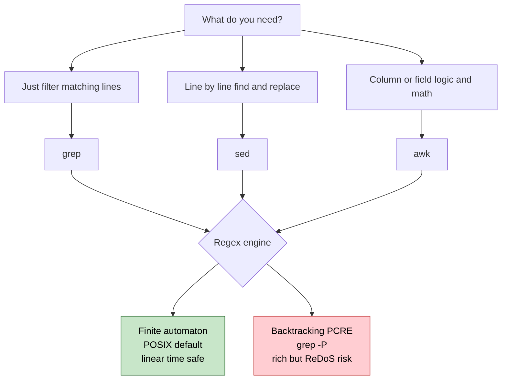

# Section 10: Shell Scripting & Automation Mastery

This section covers Bash at a mastery level — expansion order, file-descriptor plumbing, job control,
signal trapping, text processing, and the discipline of writing production-grade, idempotent
automation scripts. This is the material behind both scripting interview exercises and real-world
production tooling reliability.

## Subtopic Index
- [POSIX Shell vs Bash Extensions](#posix-shell-vs-bash-extensions)
- [Variables, Arrays, Subshells](#variables-arrays-subshells)
- [Process Substitution and Command Substitution](#process-substitution-and-command-substitution)
- [Pipes and Redirection Internals (file descriptors, dup2)](#pipes-and-redirection-internals-file-descriptors-dup2)
- [Exit Codes and set -e/-u/-o pipefail](#exit-codes-and-set--e-u-o-pipefail)
- [Signal Trapping in Scripts (trap)](#signal-trapping-in-scripts-trap)
- [Here-documents and Here-strings](#here-documents-and-here-strings)
- [Text Processing (sed, awk, grep internals, regex engines)](#text-processing-sed-awk-grep-internals-regex-engines)
- [xargs and Parallelism](#xargs-and-parallelism)
- [Job Control (bg, fg, disown, nohup)](#job-control-bg-fg-disown-nohup)
- [Writing Idempotent, Production-Grade Scripts](#writing-idempotent-production-grade-scripts)

---

## 🗺️ Visual Overview

**Mind map — the whole section at a glance** (skim this first, revisit it last):



**Bash expansion order — the sequence bash walks for every command line** (memorize the order; bugs hide here):



**Pipeline fd plumbing — how `cmdA | cmdB` wires standard streams** (why the loop-in-a-pipe loses variables):



**Defensive-scripting checklist — the safety gate every production script should pass:**



> 🧠 **Memory hooks (mnemonics):**
> - **`set -euo pipefail`:** *"**E**xit on error, **U**nset is fatal, **O** pipefail catches the middle of a pipe."* Remember it as **"E-U-Oh no, fail loudly."**
> - **Expansion order:** *"**B**rave **T**igers **P**ounce **C**leverly **A**t **W**andering **G**azelle **Q**uietly"* → **B**race, **T**ilde, **P**arameter, **C**ommand-sub, **A**rithmetic, **W**ord-split, **G**lob, **Q**uote-removal.
> - **`[@]` vs `[*]`:** *"**AT** keeps them **A**par**T**; **STAR** **S**mushes **T**ogether **A**s one **R**un."* Only `"${arr[@]}"` preserves each element.
> - **Quote everything:** *"When in doubt, double-quote"* — unquoted `$var` invites word-splitting and globbing; `"$var"` is one word, always.
> - **Subshell rule:** *"What happens in a `(subshell)`, stays in the subshell."* `cd`, variable writes, and the right side of a pipe never reach the parent.
> - **`$(...)` vs `<(...)`:** *"Dollar gives a **string**, angle gives a **file**."* Capture text with `$(cmd)`; hand a filename with `<(cmd)`.

---

## POSIX Shell vs Bash Extensions

> 🎯 **Interview weight: High** — the `#!/bin/sh` vs `#!/bin/bash` portability trap is a classic gotcha.

**In one line:** **POSIX sh** defines a minimal shell language every conforming shell implements identically; **Bash** layers many convenient but non-portable extensions ("bashisms") on top.

**POSIX sh** is a standardized specification that any conforming shell (`dash`, `ksh`, bash in POSIX mode) must implement identically — so portable scripts declaring `#!/bin/sh` behave predictably regardless of which shell `/bin/sh` actually points to.

**Bash** implements POSIX as a baseline, then adds features absent from (or different in) POSIX sh:

- **Arrays** — `declare -a` (indexed) and `declare -A` (associative); entirely absent from POSIX sh.
- **`[[ ]]` extended test** — pattern matching and regex without the word-splitting/globbing hazards of POSIX's `[ ]`/`test`.
- **Arithmetic** — C-style `((...))` evaluation and `for ((;;))` loops.
- **Process substitution** — `<(...)` / `>(...)` (covered below).
- **Brace expansion** — `{a,b,c}`, `{1..10}`.
- **`local`** — genuinely function-scoped variables.

> ⚠️ **Gotcha:** A script tested under interactive `bash` but shebanged `#!/bin/sh` can fail — sometimes *silently* producing wrong results — when run where `/bin/sh` is `dash` (Debian/Ubuntu default) or busybox `ash` (Alpine images), because those shells don't implement bashisms at all.

The defense: either declare `#!/bin/bash` explicitly (and ensure bash is installed in the target), or write genuinely POSIX-compliant scripts when portability and minimal image size matter.

> 💡 **Interview tip:** `checkbashisms` (a Debian static-analysis tool) flags bash-specific constructs in a script claiming POSIX `sh` compatibility — an automatable way to catch this bug class before production.

### Key commands
```
readlink -f /bin/sh                # confirm which actual shell /bin/sh is symlinked to on this system
checkbashisms myscript.sh             # static analysis flagging bash-specific constructs in a POSIX-sh script
bash --posix -c 'source myscript.sh'    # test a script's behavior under bash's own POSIX-compatibility mode
dash myscript.sh                        # directly test under a strict POSIX shell, if installed
```

## Variables, Arrays, Subshells

> 🎯 **Interview weight: High** — array quoting (`"${arr[@]}"`) and the subshell-variable-loss trap are perennial questions.

**In one line:** Bash variables are untyped strings; arrays and subshells add power but come with two of the most-misunderstood quoting and scoping traps in the language.

**Variables** are untyped strings by default (even numeric-looking values are stored as text unless used in arithmetic context). Assign with **no spaces around `=`** (`VAR=value`) — `VAR = value` is instead parsed as running a command named `VAR` with arguments `=` and `value`. Reference with `$VAR` or, for safety against ambiguous word boundaries, `${VAR}`.

**Arrays** (`arr=(one two three)`, indexed from zero; or `declare -A assoc` for string keys) are a bash-specific extension. The critical expansion distinction:

| Form | Result |
|------|--------|
| `"${arr[@]}"` | Each element as a separate, individually-quoted word — **correct** for filenames with spaces |
| `"${arr[*]}"` | All elements joined into one space-separated string |
| `${arr[@]}` (unquoted) | Subject to further word-splitting/globbing — silently mangles elements |

> ⚠️ **Gotcha:** Only `"${arr[@]}"` (with the double quotes) preserves each element as one distinct word regardless of embedded whitespace. Any other form can silently split an array of filenames.

**Subshells** are genuinely separate child processes, created explicitly with `(...)` — as opposed to `{...}`, which groups commands in the *current* shell without forking — or implicitly by command substitution and background pipeline elements.

> ⚠️ **Gotcha:** Variable assignments and `cd` made *inside* a subshell are invisible to the parent once it exits. That's why `cat file | while read line; do count=$((count+1)); done; echo $count` reports `count` as zero — the `while` runs in a subshell (the right side of a pipe), so increments never reach the parent's variable. (Bash's `lastpipe` option can change this specific case.)

### Key commands
```
arr=("one two" three); printf '%s\n' "${arr[@]}"   # correct, safe array expansion preserving embedded spaces
declare -A map=([key1]=val1 [key2]=val2); echo "${map[key1]}"   # associative array usage
(cd /tmp && ls)                        # subshell: cd here does not affect the calling shell's directory
shopt -s lastpipe                        # (bash-specific) let the last pipeline element run in the current shell, not a subshell
```

## Process Substitution and Command Substitution

> 🎯 **Interview weight: Medium** — knowing when to reach for `<(...)` vs `$(...)` shows real fluency.

**In one line:** **Command substitution** captures a command's output *as a string*; **process substitution** presents a command's output *as a file* — different tools for different jobs.

**Command substitution** — `$(command)` (preferred) or the older, awkwardly-nesting backticks `` `command` `` — captures a command's stdout as a string, strips trailing newlines, and substitutes that text into the surrounding command line. `result=$(some_command)` is the standard capture idiom. It runs the command in a subshell (with all the variable-invisibility consequences above), since the output must be fully captured before the surrounding command runs.

**Process substitution** — `<(command)` / `>(command)`, a bash-specific extension — instead creates a filesystem-visible reference (a special file under `/dev/fd/`, backed by an anonymous pipe) that can be passed anywhere a filename argument is expected. `diff <(sort file1) <(sort file2)` feeds each `sort`'s live output stream to `diff` as if reading two ordinary files — no temp file, and `diff` needs no special pipe support.

When to use which:

- **Command substitution** — when you need a program's *entire* output captured as a string for further manipulation or a scalar value.
- **Process substitution** — when you need to feed output as a *file* to a program that expects file arguments.

> ⚠️ **Gotcha:** Process substitution's pipe backing means genuine `seek()` doesn't work — programs needing true random-access file behavior (not just a sequential stream) will misbehave.

### Key commands
```
files=$(ls *.txt)                 # command substitution: capture output as a string
diff <(sort a.txt) <(sort b.txt)     # process substitution: feed two live command outputs as "files" to diff
while read -r line; do echo "$line"; done < <(some_command)   # process substitution avoiding the subshell pipe-to-while issue
tee >(gzip > out.gz) < input.txt       # process substitution as an output target, splitting a stream to multiple consumers
```

## Pipes and Redirection Internals (file descriptors, dup2)

> 🎯 **Interview weight: High** — the `2>&1 > file` ordering trap is one of the most-asked shell gotchas.

**In one line:** Every redirection is syntactic sugar over the same `open()`/`dup2()`/`close()` syscall sequence the shell performs before `execve()`-ing the target command — and order matters.

(The kernel-level mechanics of pipes and fd inheritance are covered in Section 1; this entry focuses on shell-level syntax and its precise semantics.)

**The ordering trap** — redirections are applied left to right:

- `command > file 2>&1` — redirect stdout to the file *first*, then make fd 2 a duplicate of fd 1 (now the file). **Both go to the file.** ✅
- `command 2>&1 > file` — duplicate fd 2 onto whatever fd 1 *currently* is (the terminal), *then* redirect fd 1 to the file. **stderr stays on the terminal; only stdout goes to the file.** ❌

> ⚠️ **Gotcha:** `2>&1 > file` is one of the single most common redirection mistakes in real scripts — it does the opposite of what most people intend.

**Custom file descriptors** beyond 0/1/2 enable more sophisticated plumbing:

- `exec 3< file` — open fd 3 for reading for the rest of the script, so multiple parts can read the same fd sequentially without reopening.
- `exec 3>&1; command >&3 3>&-` — temporarily duplicate and later close an extra reference to stdout.

> 🔍 **Under the hood:** `/dev/stdin`, `/dev/stdout`, `/dev/stderr`, and `/dev/fd/N` give a filesystem-path way to reference these same descriptors — useful for programs that only accept file-path arguments and have no concept of an already-open fd.

### Key commands
```
command > out.log 2>&1              # correct order: redirect stdout, then duplicate stderr onto it
command 2>&1 > out.log                 # common mistake: stderr still goes to terminal, only stdout to file
exec 3< file.txt; read -u 3 line; exec 3<&-   # open, use, and explicitly close a custom file descriptor
strace -e trace=dup2,open -f bash -c 'command > out 2>&1'   # observe the actual syscalls a redirection produces
```

## Exit Codes and set -e/-u/-o pipefail

> 🎯 **Interview weight: High** — `set -euo pipefail` and its documented exceptions are baseline production-scripting knowledge.

**In one line:** Every command returns a numeric exit status that drives all shell control flow; the `set -euo pipefail` trio turns silent failures into loud ones — with important exceptions.

**Exit status** — 0 conventionally means success, any nonzero means failure (specific meanings are per-command convention, not kernel-enforced). Retrieve the last one via `$?`. It drives virtually all control flow: `if command; then`, `command && next`, `command || fallback`.

The three defensive flags:

| Flag | Name | Effect |
|------|------|--------|
| `set -e` | `errexit` | Exit immediately when any simple command fails |
| `set -u` | `nounset` | Treat referencing an unset variable as an error (catches typos) |
| `set -o pipefail` | — | Pipeline status becomes the *rightmost nonzero* stage, not just the last stage |

> ⚠️ **Gotcha:** `set -e` does **not** trigger when a command fails inside an `if`/`while` condition, as a non-final pipeline element (without `pipefail`), or within `&&`/`||` chains — the shell assumes those contexts deliberately test the failure. Relying on `set -e` as an unconditional catch-all is a mistake.

**Why `pipefail` matters:** without it, `command_that_fails | grep pattern` reports success (grep's status), silently masking the real failure. With it, the earlier failure surfaces.

> 💡 **Interview tip:** `set -euo pipefail` at the top of a production script is the near-universal baseline best practice — but state that you understand each flag's specific scope and exceptions, not that it's an unconditional safety guarantee.

### Key commands
```
set -euo pipefail                   # standard defensive header for production bash scripts
echo $?                               # check the most recent command's exit status
command; echo "exit status: $?"          # explicitly capture and display an exit status for debugging
false | true; echo $?                       # without pipefail: reports 0 (true's status), masking false's failure
set -o pipefail; false | true; echo $?        # with pipefail: correctly reports nonzero
```

## Signal Trapping in Scripts (trap)

> 🎯 **Interview weight: High** — `trap 'cleanup' EXIT` is the canonical guaranteed-cleanup pattern.

**In one line:** `trap` registers a command to run when the shell receives a signal, letting a script clean up gracefully no matter how it ends.

**The `trap 'cleanup' EXIT` pattern** is the most valuable: `EXIT` is a pseudo-signal bash fires whenever the shell is about to exit for *any* reason — natural completion, an explicit `exit`, or an untrapped real signal. A single `trap ... EXIT` is a comprehensive "no matter what, always run this cleanup" guarantee, far more robust than manually calling cleanup at every exit point (tedious, and easy to miss a path added later during maintenance).

**Trapping specific signals** (`trap 'handler' TERM INT`) lets a script react differently to an explicit termination request — e.g., a long-running script finishing its current unit of work cleanly instead of dying mid-operation.

> ⚠️ **Gotcha:** `SIGKILL` cannot be trapped (see Section 2), so cleanup logic can never protect against a forceful kill — only against a courteous `SIGTERM` graceful-shutdown request.

**The canonical temp-file pattern** guarantees cleanup on every path: `tmpfile=$(mktemp); trap 'rm -f "$tmpfile"' EXIT`. This removes the temp file whether the script completes normally, errors out under `set -e`, or is interrupted — eliminating the class of bug where an early exit leaves stray temp files accumulating.



### Key commands
```
trap 'rm -f "$tmpfile"' EXIT           # guaranteed cleanup on any exit path, including via set -e
trap 'echo "interrupted"; exit 130' INT   # custom handling for Ctrl-C specifically
trap -p                                    # list currently registered traps for the current shell
trap - TERM                                  # reset a specific signal's trap back to default behavior
```

## Here-documents and Here-strings

> 🎯 **Interview weight: Medium** — heredocs are everywhere in real scripts; the quoted-delimiter behavior is the key nuance.

**In one line:** A **here-document** embeds a multi-line block of text inline as a command's stdin; a **here-string** does the same for a single line.

**Here-document** (`<<DELIMITER ... DELIMITER`) feeds an inline multi-line block to a command's stdin as if it were a file — common for embedding config content, SQL, or multi-line messages directly in a script rather than shipping a separate template file.

By default, variables and command substitutions in the body **are expanded** (`$HOME` becomes its value) — usually what you want for dynamic content. **Quoting the delimiter** (`<<'EOF'` instead of `<<EOF`) disables expansion entirely, treating the body as fully literal.

> 💡 **Interview tip:** Use the quoted form (`<<'EOF'`) when the body must contain literal `$`, backticks, or `$1`-style parameters meant for an inner script, not the outer shell.

**Here-string** (`<<< "text"`) is a simpler single-line variant — `command <<< "$variable"` replaces the more verbose `echo "$variable" | command` and avoids spawning an extra `echo` subprocess/pipe.

> ⚠️ **Gotcha:** Here-documents are POSIX-standardized and portable, but here-strings specifically are a bash-only addition — the same portability caveat from earlier in this section applies.

### Key commands
```
cat <<EOF > config.yaml
name: myapp
home: $HOME
EOF
                                        # here-document with variable expansion
cat <<'EOF' > script-template.sh
echo "literal \$HOME is not expanded here"
EOF
                                        # quoted delimiter: fully literal, no expansion
grep pattern <<< "$variable"              # here-string: simpler single-value stdin feeding
```

## Text Processing (sed, awk, grep internals, regex engines)

> 🎯 **Interview weight: High** — `grep`/`sed`/`awk` fluency and the regex-engine distinction come up constantly.

**In one line:** Three classic tools with deliberately narrow niches — `grep` filters, `sed` edits line-by-line, `awk` is a small programming language for column-oriented data.

The toolkit at a glance:

| Tool | Role | Best for |
|------|------|----------|
| `grep` | Search lines matching a pattern | Filtering; nothing beyond that |
| `sed` | Stream editor: line-oriented transforms | Straightforward find-and-replace |
| `awk` | Pattern-action programming language | Non-trivial column/field logic |

**`grep`** searches for matching lines using basic regex by default, extended regex with `-E`, or Perl-compatible regex with GNU `-P` — each richer but progressively less portable.

**`sed`** (stream editor) applies line-oriented transforms — substitution (`s/pattern/replacement/`), deletion, insertion — one line at a time through an implicit pattern-space buffer. Ideal for line-scoped edits, awkward for cross-line context or arithmetic.

**`awk`** is the most general: a complete language of pattern-action pairs (`pattern { action }`, run once per record), with fields auto-split as `$1`, `$2`, … (`$0` is the whole line), plus variables, arrays, arithmetic, and functions — right for summing columns, reformatting output, or multi-field conditional logic.

> 🔍 **Under the hood:** Regex engines come in two families with different performance:
> - **Finite-automaton** (POSIX basic/extended; default in most `grep`/`sed`/`awk`) — guaranteed *linear-time* matching regardless of pattern complexity.
> - **Backtracking** (PCRE; `grep -P`, most scripting languages) — richer features (lookahead, backreferences) but potentially *exponential-time* worst case.

> ⚠️ **Gotcha:** Backtracking's worst case is "catastrophic backtracking" — a real denial-of-service vector (**ReDoS**) when untrusted input is matched against a naively-written regex. Prefer the automaton flavor for untrusted input.



### Key commands
```
grep -E 'pattern1|pattern2' file        # extended regex, alternation without backslash-escaping
sed -i 's/old/new/g' file                 # in-place substitution across a file
awk -F, '{sum += $3} END {print sum}' file  # sum a specific CSV column using awk's built-in arithmetic
grep -P '(?<=foo)bar' file                    # PCRE lookbehind assertion, unavailable in POSIX-flavor grep
```

## xargs and Parallelism

> 🎯 **Interview weight: High** — `find ... -print0 | xargs -0` and `xargs -P` are staple one-liners.

**In one line:** `xargs` turns a list on stdin into command-line arguments for commands that expect arguments (not stdin), with easy batching and parallelism.

**The bridging role:** commands like `find` and `grep -l` produce a list on stdout, but `rm`, `chmod`, and most utilities expect items as *arguments*. `xargs` reads that list and constructs invocations with the items appended as arguments, automatically batching many items into as few invocations as the max argument-list length permits — avoiding the classic "argument list too long" failure.

**Parallelism via `-P N`** runs up to N invocations concurrently — a remarkably easy way to parallelize an embarrassingly-parallel batch (resizing images, validating many files) without writing job-management logic:

```
find . -name '*.jpg' -print0 | xargs -0 -P 8 -I{} convert {} -resize 50% {}.small.jpg
```

> ⚠️ **Gotcha:** Always prefer `-print0`/`-0` (NUL-delimited) over the default whitespace splitting when filenames are involved. Filenames can legally contain spaces or newlines (any byte except NUL and `/`), so whitespace-delimited parsing silently mis-splits them into wrong arguments.

### Key commands
```
find . -name '*.log' -print0 | xargs -0 rm             # safe deletion, correctly handling filenames with spaces
find . -name '*.txt' | xargs -P 4 -I{} gzip {}            # parallelize an independent per-file operation across 4 workers
echo "a b c" | xargs -n1 echo                               # split input into individual invocations, one argument each
xargs --show-limits                                            # inspect the actual max-argument-length limit in effect
```

## Job Control (bg, fg, disown, nohup)

> 🎯 **Interview weight: Medium** — know `nohup` vs `disown` and when to prefer a systemd unit instead.

**In one line:** An interactive shell tracks each pipeline as a numbered "job" you can move between foreground, background, and stopped states.

(The kernel-level process-group/session mechanics are covered in Section 2; this entry focuses on the interactive commands built on top.)

**Job states:**

- **Foreground** — has the terminal's attention, receives Ctrl-C directly.
- **Background** — `command &`, or Ctrl-Z then `bg`; runs without terminal focus.
- **Stopped** — suspended via Ctrl-Z, not running until resumed with `fg`/`bg`.

**Moving jobs:** `fg %N` / `bg %N` move a numbered job to foreground/background.

**Surviving a terminal disconnect** — two related but distinct tools:

| Command | Effect |
|---------|--------|
| `disown %N` | Removes a job from the shell's job table; does *not* by itself block `SIGHUP` |
| `disown -h %N` | Keeps it in the table but exempts it from `SIGHUP` |
| `nohup command &` | Makes the command ignore `SIGHUP` outright, redirecting output to `nohup.out` |

> 💡 **Interview tip:** For anything beyond a quick one-off, a proper systemd service/timer unit (Section 7) beats `nohup`/`disown` — it adds restart policies, structured logging, and reliable cgroup-based process tracking that ad-hoc backgrounding lacks.

### Key commands
```
command &                            # launch directly in the background
jobs                                    # list current shell's tracked jobs
fg %1 / bg %1                             # bring job 1 to foreground / resume it in background
disown -h %1                                # exempt job 1 from SIGHUP without removing job-table tracking
nohup command &                               # simpler: ignore SIGHUP outright, redirecting output to nohup.out
```

## Writing Idempotent, Production-Grade Scripts

> 🎯 **Interview weight: High** — idempotency and the full production-script discipline checklist are core SRE material.

**In one line:** An **idempotent** script produces the same correct end state no matter how many times it runs — essential for safe retries by orchestration and config-management tooling.

Idempotency matters for any automation meant to be safely re-run after a partial failure, retried by an orchestrator, or applied repeatedly by config-management tooling (Ansible, cloud-init, provisioning scripts) without accumulating duplicate state or failing on a second run.

**Achieving idempotency** means favoring "ensure state X" over "perform action Y":

- `mkdir -p` (silent whether or not the dir exists) instead of bare `mkdir` (fails on the second run).
- Check before appending: `grep -qxF "$line" file || echo "$line" >> file` instead of unconditionally appending (which duplicates the line on every re-run).
- Use a package manager's "ensure installed" semantics rather than an unconditional install.

**Beyond idempotency, production-grade scripts combine the disciplines from this whole section:**

- **`set -euo pipefail`** as a baseline safety net.
- **Explicit, meaningful exit codes** distinguishing failure categories (not a generic `1` everywhere), so a caller can tell "input invalid" from "dependency unreachable" from "operation failed partway" without parsing free-form error text.
- **Structured, timestamped logging** to stdout and a location a monitoring/log-aggregation pipeline can consume — not silent or unstructured output.
- **`trap`-based cleanup** guaranteeing temporary resources are always released regardless of exit path.
- **Input validation at entry** — check required args/env vars are present and sane *before* proceeding, not failing confusingly deep inside.
- **A `--dry-run` mode** for destructive operations, printing what *would* happen so an operator can verify before committing against production.

> 🧠 **Mental model:** None of these are hard in isolation — consistently applying *all* of them together is exactly what separates a quick ad-hoc script from automation trusted to run unattended against critical infrastructure.

### Key commands
```
set -euo pipefail                     # standard safety-net header
mkdir -p /path/to/dir                   # idempotent directory creation
grep -qxF "$line" file || echo "$line" >> file   # idempotent "ensure line present" pattern
trap 'rm -f "$tmpfile"' EXIT               # guaranteed temp-resource cleanup
[[ "${1:-}" == "--dry-run" ]] && DRY_RUN=1   # simple dry-run flag support pattern
```

---

### Interview Questions

**Conceptual/Internals (8)**

1. **Why can a script declaring `#!/bin/sh` behave unexpectedly on some systems but not others?**
   `/bin/sh` is frequently symlinked to a minimal, strictly POSIX-compliant shell (`dash` on Debian/
   Ubuntu, `ash`/busybox on many minimal container base images) rather than `bash`, and any bash-
   specific extensions used in the script (arrays, `[[ ]]`, process substitution) simply don't exist
   or behave differently under those shells, causing failures or silently wrong behavior specifically
   on systems where `/bin/sh` isn't actually bash.

2. **Explain why `"${arr[@]}"` and `"${arr[*]}"` behave differently, and why the distinction matters.**
   `"${arr[@]}"` expands each array element as its own separate, individually-quoted word, correctly
   preserving elements containing embedded spaces as single arguments. `"${arr[*]}"` joins all elements
   into a single string separated by the first character of `$IFS`, losing the individual-element
   boundary information — using the wrong form when iterating over filenames or arguments that may
   contain spaces is a common, subtle correctness bug.

3. **Why does `command 2>&1 > file` not achieve the commonly-intended "redirect both stdout and
   stderr to file" behavior?**
   Redirection operators are processed left to right; `2>&1` first duplicates fd 2 onto whatever fd 1
   currently points to (the terminal, if this is the first redirection), and only afterward does
   `> file` redirect fd 1 itself to the file — leaving stderr still pointed at the terminal. The
   correct order is `> file 2>&1`, redirecting stdout to the file first, then duplicating stderr onto
   that same, already-redirected destination.

4. **What specifically does `set -o pipefail` change, and what problem does it solve?**
   By default, a pipeline's exit status is simply whatever its last command returned, regardless of any
   earlier stage's failure — `failing_command | grep pattern` reports success based on grep's exit
   status alone. `pipefail` changes the pipeline's overall exit status to the rightmost nonzero exit
   status among all stages, surfacing an earlier stage's failure that would otherwise be silently
   masked by a later, successfully-exiting stage.

5. **Why is `trap 'cleanup' EXIT` considered more robust than manually calling a cleanup function at
   every point a script might exit?**
   `EXIT` is a pseudo-signal bash fires whenever the shell is about to exit for any reason — normal
   completion, an explicit `exit` call, or an unhandled real signal — making one `trap ... EXIT`
   registration a comprehensive guarantee that doesn't require anticipating and instrumenting every
   individual exit path manually, which is both tedious and easy to miss for a new exit path
   introduced later during script maintenance.

6. **Why does a `while read line; do ...; done < <(command)` pattern avoid a subtlety that
   `command | while read line; do ...; done` has?**
   In the piped form, the `while` loop runs in a subshell (the right-hand side of a pipe), so any
   variables set inside the loop body do not persist back to the calling shell once the pipeline
   completes. Using process substitution instead (`< <(command)`) feeds the same data into the loop
   without placing the loop itself inside a subshell, so variables set inside it remain visible to the
   rest of the script afterward.

7. **What makes a script idempotent, and give a concrete example of a non-idempotent operation and
   its idempotent equivalent.**
   An idempotent script produces the same correct end state no matter how many times it's run. A bare
   `mkdir /path` is non-idempotent (fails if the directory already exists from a prior run); `mkdir -p
   /path` is the idempotent equivalent, succeeding silently whether or not the directory already
   exists.

8. **Why can PCRE-style backtracking regular expressions pose a denial-of-service risk that POSIX-
   style regex engines generally don't?**
   POSIX basic/extended regex engines typically use finite-automaton-based matching with guaranteed
   linear-time complexity regardless of pattern complexity. PCRE's backtracking approach supports
   richer features (lookahead, backreferences) but can exhibit catastrophic, exponential-time
   worst-case behavior for certain pathological pattern/input combinations, a genuine ReDoS risk when
   matching untrusted input against a naively-constructed backtracking regex.

**Scenario/Troubleshooting (6)**

9. **A deployment script using `set -e` continues executing past a failed command inside an `if`
    condition, contrary to the team's expectation.**
    This is `errexit`'s well-documented, correct-per-specification behavior, not a bug: a command's
    failure as part of an `if`/`while` condition (or as a non-final pipeline element without
    `pipefail`, or within `&&`/`||` chains) does not trigger `errexit`'s exit, since the shell
    reasonably assumes those contexts are deliberately testing/handling the failure. The fix is
    explicitly checking and handling the exit status within the conditional logic itself, rather than
    relying on `set -e` to catch it there.

10. **A script processing a directory of user-uploaded files fails or behaves incorrectly whenever a
    filename contains a space.**
    The script is very likely using unquoted variable expansion or whitespace-delimited `find`/`xargs`
    piping without `-print0`/`-0`, causing filenames with embedded spaces to be incorrectly split into
    multiple arguments. Fix by consistently quoting variable expansions (`"$file"`, not `$file`) and
    using NUL-delimited (`find ... -print0 | xargs -0 ...`) patterns throughout wherever filenames flow
    through the pipeline.

11. **A backup script wrapped with `nohup script.sh &` still gets killed when the initiating SSH
    session disconnects unexpectedly, despite `nohup` being used correctly.**
    Confirm whether the script itself spawns further child processes that don't inherit the same
    `SIGHUP`-ignoring disposition, or whether the session is being terminated by something other than
    `SIGHUP` (a more forceful termination of the whole session's process group by the SSH server/PAM
    session cleanup). For anything genuinely needing to survive independent of any interactive
    session's lifecycle at all, migrating to a proper systemd service/timer unit rather than
    `nohup`-based backgrounding is the more robust, recommended fix.

12. **A CI pipeline step using `xargs -P 4` to parallelize a batch operation occasionally produces
    corrupted output files, though the same operation works correctly when run sequentially.**
    Check whether the parallelized operations have any shared-state contention (writing to a shared
    intermediate file, appending to a shared log without appropriate locking) that only manifests under
    genuine concurrent execution — sequential execution masks race conditions that true parallelism
    exposes. Fix by ensuring each parallel invocation operates on genuinely independent output
    targets, or by adding explicit locking/synchronization if shared state is unavoidable.

13. **A production script that has run reliably for months suddenly fails with "argument list too
    long" after a directory it processes grew substantially.**
    The script is very likely passing an unbounded, directly-expanded glob (`rm *.log` or similar)
    directly as command-line arguments rather than piping a list through `xargs`, which automatically
    batches arguments within the system's actual maximum argument-list length limit. Fix by refactoring
    to `find ... -print0 | xargs -0 command`, which handles arbitrarily large lists correctly regardless
    of how many files are involved.

**FAANG-level Deep Dive (6)**

15. **Explain precisely why `set -e`'s behavior with pipelines requires `pipefail` to be meaningfully
    useful, and describe a scenario where even `set -euo pipefail` together still fails to catch a
    real error.**
    Without `pipefail`, `set -e` only observes a pipeline's overall (last-command) exit status, missing
    earlier-stage failures entirely; `pipefail` fixes this specific gap. However, even with all three
    flags set, a command substitution's own internal failure inside an otherwise-successful larger
    expression (`var=$(failing_command); other_command "$var"`, where `other_command` might still
    "succeed" operating on empty/garbage input from the failed substitution) is not automatically
    caught by `errexit` in every bash version/context reliably, since command substitution failure
    propagation historically has its own set of edge cases distinct from pipeline failure propagation —
    illustrating that `set -euo pipefail` substantially improves but does not create an unconditional,
    complete safety guarantee against every failure mode.

16. **Why does process substitution's `/dev/fd/N`-based implementation mean it cannot fully replace a
    real temporary file for every use case, even though it avoids creating one?**
    Process substitution's "file" is backed by an anonymous pipe, which supports only sequential
    reading (or writing) and has no genuine random-access seek capability the way a real, disk-backed
    temporary file does. A program that needs to `seek()` backward within the data it's given (some
    archive tools, certain database bulk-load utilities validating a file's structure by reading it
    multiple times or out of order) will fail or behave incorrectly when given a process-substitution
    pseudo-file instead of a genuine seekable file, which is precisely the scenario where a real
    temporary file (`mktemp`) remains necessary despite process substitution's general convenience and
    efficiency advantage for purely sequential consumers.

17. **Explain why `trap ... EXIT` cleanup logic itself needs to be written carefully to avoid masking
    the script's own real exit status.**
    If the trap handler itself executes a command whose own exit status differs from zero (even
    unintentionally, like a cleanup `rm` that fails because the file was already removed), and the trap
    handler doesn't explicitly preserve and re-exit with the original failing exit status the script
    was in the process of exiting with, the script's final observed exit status can become the trap
    handler's own (possibly successful) exit status instead of the original failure that triggered the
    exit in the first place — silently converting what should be a visible failure into an apparently
    successful script run. Correct practice captures `$?` at the very start of the trap handler and
    explicitly `exit`s with that preserved value at the handler's end, after performing cleanup.

18. **Why does `awk`'s automatic field-splitting model make it fundamentally better suited than `sed`
    for column-oriented data transformation, at a conceptual level?**
    `sed` operates purely on the line as an undifferentiated string, with no native concept of fields/
    columns at all — any column-aware logic must be hand-built via regular expressions matching
    delimiter positions, which becomes increasingly awkward and fragile as the required logic grows
    beyond simple substitution. `awk` automatically splits each input record into fields (based on a
    configurable field separator) as a first-class part of its execution model, exposing them as
    directly indexable variables (`$1`, `$2`, ...) with native arithmetic and comparison support,
    making genuinely column-aware logic (summing a column, comparing two fields, conditional logic
    spanning multiple fields) a natural, concise expression rather than requiring `sed`'s
  line-as-string workaround approach.

19. **Explain why `xargs -P N`'s parallelism model can produce a genuinely different (and sometimes
    incorrect) result compared to the equivalent sequential invocation, beyond simple raw execution
    speed.**
    Parallel invocations share no ordering guarantee relative to each other and may execute in
    overlapping time windows, meaning any operation with side effects that depend on execution order
    (appending to a shared log file without proper locking, incrementing a shared counter file,
    operations that assume a specific processing order for correctness) can produce genuinely different
    — and potentially incorrect or corrupted — results under real concurrency that a sequential
    execution's implicit ordering guarantee happened to mask, which is precisely why introducing
    parallelism to an existing sequential script requires explicitly verifying (not merely assuming)
    that each parallelized unit of work is genuinely independent with no hidden shared-state
    dependency.

20. **Why is checking `${VAR:-default}` different from `${VAR:=default}`, and why does the distinction
    matter for idempotent script design?**
    `${VAR:-default}` merely *substitutes* `default` in the expansion's result if `VAR` is unset or
    empty, without actually assigning `default` back into `VAR` itself — subsequent references to
    `$VAR` later in the script still see it as unset/empty. `${VAR:=default}` both substitutes *and*
    assigns `default` into `VAR` for the remainder of the script's execution, meaning subsequent
    references correctly see the now-defaulted value — using the wrong form (particularly `:-` when
    `:=` was actually needed) is a subtle bug where a script appears to correctly apply a default value
    once but then behaves as though the variable were still unset everywhere else it's referenced
    afterward, directly undermining a script's intended idempotent, predictable behavior across its
    full execution.

### Hands-On Labs

**Lab 1: Build a defensive, idempotent deployment script**
- Objective: Apply every production-grade scripting discipline covered in this section together.
- Setup: Any Linux shell environment.
- Tasks: Write a script that provisions a user, a directory, and a systemd service unit; make it
  idempotent (safe to re-run without error or duplication); add `set -euo pipefail`, a `trap`-based
  cleanup for any temp files used, input validation for required arguments, and a `--dry-run` mode.
- Expected outcome: A script verified safe to run repeatedly with identical, correct results each
  time, including a working dry-run mode.

**Lab 2: Diagnose and fix redirection-order and quoting bugs**
- Objective: Directly experience and fix the classic redirection-order and array-quoting mistakes.
- Setup: Any Linux shell.
- Tasks: Write a script with the `2>&1 > file` ordering mistake and confirm stderr still appears on the
  terminal; fix the order and confirm correct behavior; separately, write a script iterating over an
  array of filenames-with-spaces using unquoted `${arr[@]}` and observe the incorrect splitting, then
  fix it with `"${arr[@]}"`.
- Expected outcome: A documented before/after for both classic bugs, with root cause explained in your
  own words.

**Lab 3: Parallelize a batch operation safely with xargs**
- Objective: Correctly parallelize an embarrassingly-parallel task while avoiding shared-state hazards.
- Setup: A directory of test files.
- Tasks: Write a sequential script performing an independent per-file operation (e.g., computing a
  checksum and writing it to its own per-file output, not a shared log); convert it to use
  `xargs -P N`; verify identical, correct results at higher speed; then deliberately introduce a
  shared-log-append version and observe/document the resulting corruption under parallelism.
- Expected outcome: A working, correctly-parallelized version, plus a documented demonstration of the
  shared-state hazard it specifically avoided.

**Lab 4: trap-based guaranteed cleanup under multiple exit paths**
- Objective: Verify `trap ... EXIT` cleanup fires reliably regardless of how a script exits.
- Setup: Any Linux shell.
- Tasks: Write a script creating a temp file with `trap 'rm -f "$tmpfile"' EXIT`; test that the temp
  file is removed after normal completion, after an explicit early `exit 1`, and after being killed
  with `SIGTERM` mid-execution (not `SIGKILL`, which cannot be trapped).
- Expected outcome: Verified, documented cleanup across all three exit scenarios.

**Lab 5: POSIX portability audit**
- Objective: Practice distinguishing bash-specific constructs from POSIX-portable ones.
- Setup: A Linux system with both `bash` and `dash` installed.
- Tasks: Write a script using several bashisms (arrays, `[[ ]]`, process substitution); run it under
  `dash` and document each resulting failure; rewrite it to be strictly POSIX-compliant and confirm it
  now runs identically under both `bash` and `dash`.
- Expected outcome: A documented list of bashisms encountered and their POSIX-compliant replacements.

### Production Incidents

**Incident 1: A silent data-loss bug from an unquoted array expansion in a backup script**
- Symptom: A backup script intended to archive a list of directories (some containing spaces in their
  names) silently skips or mis-archives a subset of directories, discovered only when a restore was
  attempted and specific directories were missing.
- Investigation: Code review found the script iterated over an array of directory paths using
  unquoted `${dirs[@]}` rather than `"${dirs[@]}"`, causing directories with embedded spaces to be
  word-split into multiple, individually-incorrect path fragments.
- Root cause: The unquoted array expansion silently mishandled any directory name containing a space,
  with no error raised at the time — the script appeared to "work" for the common case of
  space-free directory names, masking the bug until a genuinely space-containing directory was
  eventually included.
- Recovery: Directories missed by previous backup runs could not be recovered from that backup
  mechanism and required restoration from an alternate, older backup source.
- Prevention: Fixed the quoting throughout the script, and added a linting step (`shellcheck`, which
  specifically flags this exact class of unquoted-expansion issue) to the script's CI validation
  pipeline to catch this category of bug automatically before future deployment.

**Incident 2: A masked pipeline failure caused a data pipeline to silently process incomplete data
for weeks**
- Symptom: A downstream analytics report is found to be subtly, consistently incomplete over several
  weeks, though the data pipeline's own logs and monitoring showed no failures during that entire
  period.
- Investigation: Found the pipeline's ingestion script piped a data-fetching command through a
  filtering/transformation stage (`fetch_data | transform | load_data`) without `set -o pipefail`; the
  fetch stage had begun intermittently failing (an upstream API change), but since `transform`/
  `load_data` continued to exit successfully on whatever partial/empty input they received, the
  pipeline's own exit-status-based success monitoring never detected any problem.
- Root cause: Without `pipefail`, an earlier pipeline stage's failure was completely invisible to the
  script's own success/failure determination, which relied solely on the final stage's exit status.
- Recovery: Backfilled the missing data once the upstream API issue was identified and fixed, requiring
  a fully separate remediation effort to reconstruct the several weeks of incomplete analytics.
- Prevention: Added `set -euo pipefail` to this and all similar pipeline scripts fleet-wide, and added
  explicit row-count/data-volume sanity checks as an additional, independent layer of pipeline health
  verification beyond pure exit-status monitoring alone.

**Incident 3: A non-idempotent provisioning script caused duplicate configuration after a retried
deployment**
- Symptom: After an automated deployment system retried a provisioning step following a transient
  network failure partway through its first attempt, several hosts ended up with duplicated
  configuration file entries and, in a few cases, duplicate cron jobs performing the same scheduled
  task twice.
- Investigation: The provisioning script unconditionally appended configuration lines and cron entries
  on every run rather than checking whether they already existed, meaning a retried run (necessary
  because the first attempt had partially completed before failing) reapplied the same appends a
  second time.
- Root cause: The script was written assuming it would only ever run exactly once per host, an
  assumption violated the moment any retry-on-failure automation was introduced around it.
- Recovery: Manually identified and de-duplicated the affected configuration and cron entries across
  impacted hosts.
- Prevention: Rewrote the provisioning script using idempotent patterns throughout (checking for
  existing entries before appending, using `mkdir -p` and equivalent "ensure state" operations
  consistently) and added an explicit idempotency test to the script's validation suite, running it
  twice in a row against a clean test host and asserting identical final state after both runs.
