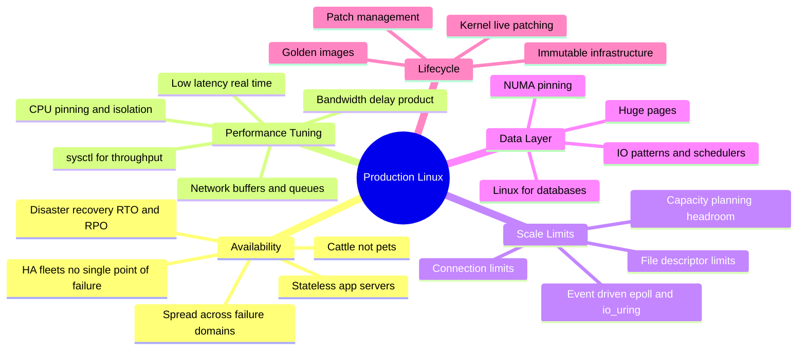
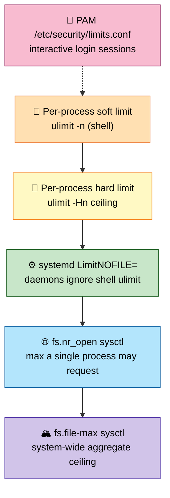
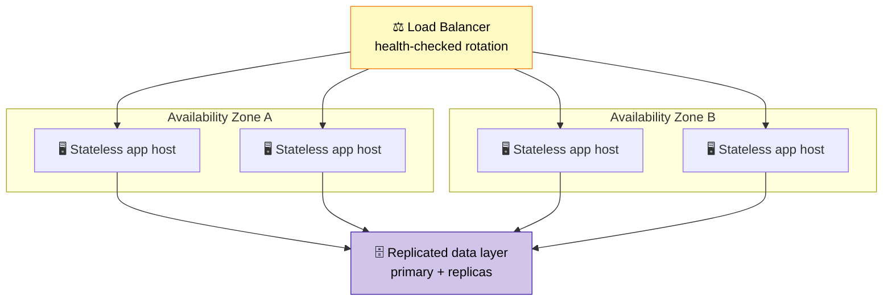
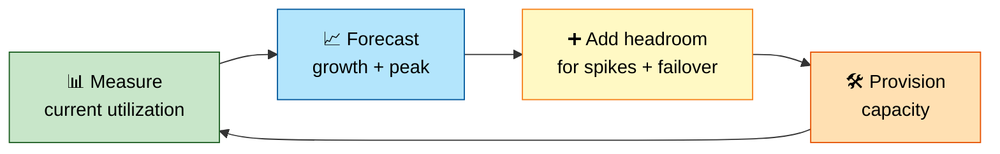
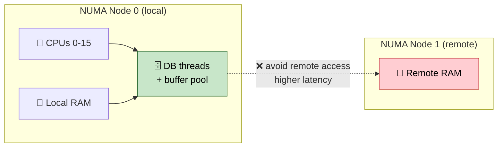
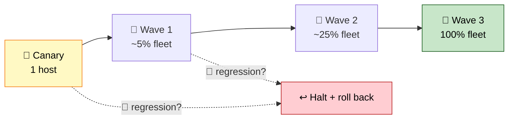

# Section 11: System Design & Production Architecture (Linux-Centric)

This section applies everything from earlier sections to fleet-scale, production-architecture
decisions — kernel tuning for high-throughput servers, capacity planning, NUMA-aware database
deployment, immutable infrastructure, and safe patching at scale. This is the material for
"design a Linux host configuration for X" system-design interview questions.

## Subtopic Index
- [Designing Highly Available Linux Fleets](#designing-highly-available-linux-fleets)
- [Kernel Tuning for High-Throughput Servers (sysctl tuning)](#kernel-tuning-for-high-throughput-servers-sysctl-tuning)
- [File Descriptor and Connection Limits at Scale](#file-descriptor-and-connection-limits-at-scale)
- [Capacity Planning (CPU, memory, disk, network)](#capacity-planning-cpu-memory-disk-network)
- [Linux for Databases (I/O patterns, huge pages, NUMA pinning)](#linux-for-databases-io-patterns-huge-pages-numa-pinning)
- [Linux for Low-Latency Trading/Real-Time Systems](#linux-for-low-latency-tradingreal-time-systems)
- [Immutable Infrastructure and Golden Images](#immutable-infrastructure-and-golden-images)
- [Patch Management and Kernel Live Patching](#patch-management-and-kernel-live-patching)
- [Disaster Recovery for Linux Fleets](#disaster-recovery-for-linux-fleets)

---

## 🗺️ Visual Overview

**Mind map — the whole section at a glance** (skim this first, revisit it last):



**The file-descriptor limit ladder — raise every rung or you still hit "too many open files":**



**HA fleet topology — lose any host, zone, or rack without customer-visible impact:**



**Capacity-planning feedback loop — measure, forecast, provision, repeat:**



> 🧠 **Memory hooks (mnemonics):**
> - **RTO vs RPO:** *"**T**ime = how long you're down, **P**oint = how much data you lose."* **RTO** = recovery **T**ime objective (downtime budget); **RPO** = recovery **P**oint objective (data-loss budget).
> - **FD limit ladder:** *"Shells Serve Daemons, Nr Feeds All"* → **s**hell ulimit → **s**ystemd LimitNOFILE → **d**aemon → **nr_open** → **file-max**. Raise every rung, not just one.
> - **Immutable infra:** *"Replace, don't patch."* Bake a new golden image and roll it out — never hand-edit a live host.
> - **Cattle not pets:** hosts are disposable and interchangeable; if you're SSHing in to fix one, you're doing HA wrong.
> - **BDP throughput:** *"Buffers ÷ RTT."* Too small a buffer for the round-trip and the fast link sits idle waiting for ACKs.

---

## Designing Highly Available Linux Fleets

> 🎯 **Interview weight: High** — the canonical "design a resilient fleet" system-design question that ties every earlier section together.

**In one line:** High availability is the systematic elimination of single points of failure at *every* layer — hardware, host, failure domain, and state — so any single host can be lost without operator intervention or data loss.

> 🧠 **Mental model:** Treat hosts as **cattle, not pets** — replaceable/disposable (see Immutable Infrastructure below), never uniquely hand-tuned. True HA at scale depends on being able to lose any single host without anyone noticing.

**Redundancy at the individual-host level** starts with hardware and extends into OS configuration:

- **RAID** for storage (single-disk failure tolerance)
- **Bonded NICs** for network path redundancy
- **Redundant power supplies**
- Host config treated as disposable rather than precious

**Spread instances across failure domains** that share as few underlying dependencies as possible:

- Separate physical **racks** — sharing neither power nor top-of-rack network switch
- Separate **availability zones/datacenters** — sharing neither power grid nor network backbone
- **Load balancing** (Section 5) distributes traffic across healthy instances
- **Health checks** (systemd's `Type=notify`, Section 7, or external checks) automatically remove unhealthy instances from rotation before they cause customer-visible failures

**Session/state management** is a frequently underestimated design dimension. A fleet of **stateless application servers** — any request served by any instance, with all persistent state externalized to a separately-architected, independently-replicated data layer — is dramatically easier to make highly available than one where each instance holds unique, non-replicated local state.

A stateless instance can simply be killed and replaced without data-loss risk or complex failover/reconciliation logic.

> 💡 **Interview tip:** This is exactly why **"keep application servers stateless"** is a foundational principle — it concentrates the genuinely hard HA engineering effort on the **data layer** (databases, caches), where state that truly cannot be regenerated on a replacement host actually lives.

## Kernel Tuning for High-Throughput Servers (sysctl tuning)

> 🎯 **Interview weight: High** — production tuning at scale is a favorite "you have a slow high-load server, what do you change?" question.

**In one line:** Kernel defaults are chosen as broadly reasonable for *general-purpose* use — high-throughput servers routinely need deliberate, benchmarked `sysctl` tuning across network, memory, and file-handling subsystems.

> ⚠️ **Gotcha:** Defaults are safe, not optimal. But never cargo-cult tuning values from an unrelated workload — the correct value is always **workload- and hardware-specific**, and a value that helps one workload can be neutral or actively harmful for a differently-shaped one.

**Network tuning** (drawing on Section 5's mechanisms):

| sysctl | What it controls | Why tune it |
|--------|------------------|-------------|
| `net.core.somaxconn` | Accept queue size | Default often too small for many concurrent incoming connections |
| `net.ipv4.tcp_max_syn_backlog` | SYN queue size | Same — sizes the half-open connection queue |
| `net.ipv4.tcp_rmem` / `tcp_wmem` | Per-connection TCP buffers | Governs achievable throughput on high-BDP paths |
| `net.netfilter.nf_conntrack_max` | Connection-tracking table size | Prevents conntrack exhaustion on connection-heavy workloads |

> 🧠 **Mental model — bandwidth-delay product:** Throughput is fundamentally capped by *buffer size ÷ round-trip time*, regardless of how fast the underlying link is. If buffers are too small relative to RTT, the link sits idle waiting for ACKs.

**Memory tuning** (Section 3):

| sysctl | What it controls | Why tune it |
|--------|------------------|-------------|
| `vm.swappiness` | Preference for swapping anon memory vs dropping file cache | Lower it for latency-sensitive services that should prefer dropping cache |
| `vm.dirty_ratio` / `vm.dirty_background_ratio` | Writeback backpressure thresholds | Tune for write-heavy workloads to control writeback timing |

**Filesystem / file-descriptor tuning:**

- `fs.file-max` — system-wide open file handle ceiling
- Per-process `ulimit -n` adjustments (discussed further below)

> 💡 **Interview tip:** Every tuning decision should be validated with the benchmarking discipline from Section 8 (`fio`, `iperf3`, representative synthetic load matching the *real* production access pattern) rather than applied as blind "best practice."

### Key commands
```
sysctl -a | grep -E 'somaxconn|tcp_max_syn_backlog'   # inspect current connection queue tuning
sysctl -w net.core.somaxconn=4096                        # apply a tuning change live (add to /etc/sysctl.d/ to persist)
sysctl vm.swappiness vm.dirty_ratio vm.dirty_background_ratio   # memory-subsystem tuning values
sysctl -p /etc/sysctl.d/99-tuning.conf                      # apply a persisted sysctl config file
```

## File Descriptor and Connection Limits at Scale

> 🎯 **Interview weight: High** — "too many open files" is one of the most common production incidents at scale.

**In one line:** Every open file, socket, and pipe consumes a file descriptor — and the legacy default (often 1024/process) is drastically too low for any server handling meaningful connection concurrency, so limits must be raised at **multiple layers simultaneously**.

> ⚠️ **Gotcha:** Each active client connection consumes at least one FD. A server targeting tens of thousands of concurrent connections must raise the limit *deliberately and explicitly* — and raising just one of the several independent limit points is the classic incomplete fix.

**The independent limit points that must all be raised:**

| Layer | Where to set it | Applies to |
|-------|-----------------|------------|
| systemd service | `LimitNOFILE=` in the unit file | systemd-launched daemons (a shell `ulimit` has **no** effect here) |
| System-wide | `fs.file-max` sysctl | Aggregate ceiling across every process; must exceed the sum of all services' per-process limits |
| PAM sessions | `/etc/security/limits.conf` | Logged-in interactive sessions only — a distinct, commonly-overlooked point |

> ⚠️ **Gotcha:** A `ulimit` set in an interactive shell only affects that shell — it does **not** apply to a systemd-managed service launched independently of any shell. Raising one but forgetting the others is the single most common cause of this failure below true capacity.

**Raw FD ceilings are necessary but not sufficient** — the service's I/O model is the deeper constraint:

- **Thread-or-process-per-connection** designs incur real per-connection memory and context-switching overhead (Section 2) that becomes the limiting factor *well before* any FD ceiling is reached.
- **Event-driven `epoll()`-based (or `io_uring`-based)** designs multiplex enormous numbers of concurrent connections through a small, fixed pool of worker threads.

> 💡 **Interview tip:** This is precisely why virtually every high-connection-count server (nginx, modern app servers) is built around the event-driven model — and why "raise the FD limit" alone is necessary but insufficient without also addressing the service's fundamental concurrency architecture.

### Key commands
```
ulimit -n                              # current shell's file descriptor limit
cat /proc/<pid>/limits | grep "Max open files"   # actual enforced limit for a running process
systemctl show <unit> -p LimitNOFILE      # confirm a systemd service's configured file descriptor limit
sysctl fs.file-max                          # system-wide aggregate ceiling
cat /proc/sys/fs/file-nr                      # current system-wide open file count vs the max
```

## Capacity Planning (CPU, memory, disk, network)

> 🎯 **Interview weight: High** — quantitative provisioning and percentile-aware reasoning are core system-design signals.

**In one line:** Capacity planning quantitatively projects future resource needs from observed usage and expected growth — so you provision *proactively* rather than discovering a ceiling via a production incident.

> 🧠 **Mental model:** Plan for **percentiles, not averages**. Queueing delay grows *non-linearly* as utilization approaches saturation, so provisioning for average CPU while ignoring peak/tail behavior guarantees under-provisioning for exactly the spikes that matter most.

**Each resource dimension has distinct headroom requirements:**

| Dimension | Headroom target / rule | Why |
|-----------|------------------------|-----|
| **CPU** | Keep peak sustained utilization ~70–80% (not 100%) | Preserve headroom for spikes; keep scheduling latency (Section 2) low as queueing grows non-linearly near saturation |
| **Memory** | Account for app footprint *and* page-cache/reclaimable behavior (Section 3) | Ensure genuine app memory — not reclaimable cache filling idle RAM — has headroom under peak |
| **Storage** | Project raw space growth *and* IOPS/throughput headroom **separately** | A volume can have ample free space while being I/O-saturated (USE method, Section 4/8) |
| **Network** | Account for raw bandwidth *and* conntrack table sizing (Section 5) | Conntrack is an independent, non-bandwidth ceiling at high connection-churn |

**Capacity planning is a feedback loop, not a one-time exercise:**

- Observed utilization trends (from long-retained historical metrics — Section 8's `sar` retrospective analysis) should continuously inform revised projections.
- Load testing (Section 8's benchmarking tools) should validate that projected capacity actually holds under realistic synthetic load before committing.

> ⚠️ **Gotcha:** Pure trend extrapolation misses **non-linear cliff effects** — e.g., a service that degrades gracefully to 80% capacity but falls off a cliff at 85% due to a specific resource-contention effect. Only deliberate load testing beyond observed peak reveals it.

## Linux for Databases (I/O patterns, huge pages, NUMA pinning)

> 🎯 **Interview weight: High** — database hosts are the most-tuned workload and a rich source of "why is this DB slow?" questions.

**In one line:** Databases have a distinctive resource profile that rewards deliberate tuning across memory (Section 3), storage (Section 4), and NUMA (Sections 2–3) — synthesized into one coherent deployment pattern.

**I/O pattern tuning** — databases issue a predictable mix of I/O:

- **Random reads** for index/row lookups
- **Sequential writes** for write-ahead-log (WAL) append
- Periodic **checkpoint/flush** operations

Match the I/O scheduler to the storage (`none` for NVMe, Section 4), and ensure WAL durability is backed by explicit `fsync()`/`O_DIRECT` (Section 4) rather than relying on buffered writes' default, non-durable behavior.

**Huge pages** (Section 3) reduce TLB pressure across a large, memory-resident buffer pool:

> ⚠️ **Gotcha:** Many DB deployment guides recommend **disabling Transparent Huge Pages** (THP) — its automatic, compaction-driven promotion risks latency spikes (Section 3). Instead configure explicit **HugeTLB** pages sized to the known buffer pool, gaining the TLB benefit without THP's unpredictable compaction latency.

**NUMA pinning** (Sections 2–3) matters enormously on multi-socket hardware:

- Size the DB to fit its primary buffer pool within a **single NUMA node's** local memory.
- Pin worker threads/processes to that same node's CPUs via `numactl`.
- This avoids the cross-node memory-access latency penalty entirely.

> 💡 **Interview tip:** This is why DB runbooks so often include explicit `numactl --cpunodebind --membind` rather than relying on default first-touch allocation and automatic NUMA balancing — whose convergence-over-time behavior (Section 3) is a poor fit for a database that should have correct locality *from the moment it starts serving traffic*, not after runtime convergence.

**Keep the DB local to one NUMA node — pin CPUs and memory to avoid cross-node latency:**



## Linux for Low-Latency Trading/Real-Time Systems

> 🎯 **Interview weight: Medium** — a niche but impressive domain; great for showing depth on scheduling and jitter.

**In one line:** Low-latency trading and real-time control treat **worst-case latency — not average throughput — as the primary metric**, a philosophy genuinely different from nearly every other production workload.

**Core techniques combine:**

- **CPU isolation** (`isolcpus`, `nohz_full` boot params, Section 2) — remove specific cores entirely from the general scheduler's load-balancing domain and periodic timer-tick housekeeping, dedicating them exclusively to the latency-critical process with no other work ever scheduled on them.
- **IRQ affinity tuning** — steer hardware interrupt handling (NICs, other devices) onto *different*, non-isolated cores so interrupt handling never contends with the isolated cores' critical work.
- **`PREEMPT_RT` kernel** (Section 2) — bounds the kernel's own worst-case non-preemptible latency.
- **Disable CPU frequency scaling and deep C-states** — both introduce latency when a core transitions between power states, an unacceptable source of jitter.
- **Busy-polling network I/O** — spin on a socket rather than blocking/sleeping, trading continuous CPU consumption for eliminating wake-from-sleep scheduling latency (appropriate precisely because whole cores are already dedicated).
- **Kernel-bypass networking** (DPDK) — move packet processing entirely into userspace, bypassing the kernel network stack's overhead (Section 5), for the most extreme latency-sensitive components.

> ⚠️ **Gotcha:** Validate this tuning with specialized tooling (`cyclictest`, Section 2) designed to surface **worst-case, not average**, latency. A system with excellent 99.9th-percentile latency but occasional catastrophic worst-case spikes is a *failed* design here — one rare catastrophic-latency event can have outsized real-world consequences no matter how statistically rare.

## Immutable Infrastructure and Golden Images

> 🎯 **Interview weight: High** — a foundational cloud-native operations principle interviewers expect you to defend.

**In one line:** Treat running servers/containers as **disposable, non-modifiable artifacts** — apply a change by building a new versioned image and replacing instances, never by editing a running host in place.

> 🧠 **Mental model — cattle, not pets:** Mutable infrastructure logs into a running host to patch it in place ("pets"). Immutable infrastructure builds an entirely new **golden image** (an AMI, container image, or VM template) incorporating the change, launches fresh instances from it, and discards the old ones entirely ("cattle").

**How it leverages concepts from across this guide:**

- **OverlayFS's** layered, copy-on-write container image model (Section 9) is itself a direct embodiment of immutability — a container's writable state is explicitly meant to be ephemeral, not durably modified in place.
- It eliminates an entire class of incident: **configuration drift**, where two identically-provisioned servers gradually diverge from accumulated ad-hoc manual changes, eventually producing subtly different, hard-to-reproduce behavior.

**Core operational benefit — deterministic reproducibility:**

- Any instance's state is always fully reproducible from its source image plus version-controlled config.
- A **"just redeploy from the golden image"** recovery path is always available for any instance behaving unexpectedly — no need to diagnose and repair undocumented drift.
- This is a direct rollback and recovery advantage over mutable infrastructure's harder-to-reproduce, harder-to-roll-back state.

> ⚠️ **Gotcha:** Building golden images reliably depends on **reproducible build practices** (Section 9's image build determinism) — so rebuilding "the same" image later, or auditing what a deployed image contains, produces trustworthy, verifiable results.

## Patch Management and Kernel Live Patching

> 🎯 **Interview weight: High** — balancing security currency against availability risk at fleet scale is a core reliability topic.

**In one line:** Patching a fleet must balance **security/currency** (unpatched systems accumulate exploitable vulnerabilities) against **availability risk** (any patch carries residual regression risk, and a fleet-wide simultaneous apply risks a fleet-wide simultaneous failure).

> 🧠 **Mental model — canary/staged rollout:** Apply a patch first to a small subset (or a single non-critical host), monitor closely over a meaningful window, and only proceed to progressively larger waves once each preceding wave is confirmed healthy. This reuses Section 8's observability tooling to detect a regression *before* it propagates fleet-wide.

**Staged rollout — a bad patch is caught on the canary, never fleet-wide:**



**Kernel patching specifically has historically required a full reboot** — the running kernel image in memory can't simply be swapped the way a userspace process can be restarted. That's meaningfully more disruptive than most userspace package updates, especially for services that can't tolerate individual-host downtime gracefully.

**Kernel live patching** (`kpatch` on RHEL-family, the upstream `livepatch` infrastructure it builds on) addresses this gap for *security-relevant* fixes:

- Applies a **binary patch directly to the already-running kernel's in-memory code**.
- Redirects specific vulnerable functions to patched replacements — **no reboot required**.
- Closes a security exposure window quickly on latency/availability-sensitive systems that would otherwise wait for a scheduled maintenance window.

> ⚠️ **Gotcha:** Live patching is scoped to security fixes with bounded patch complexity — it is **not** a wholesale replacement for eventually applying a full kernel upgrade (and reboot) to pick up larger feature/performance improvements that its binary-patch model can't express.

### Key commands
```
kpatch list                          # (RHEL-family) show currently applied live kernel patches
uname -r                               # confirm the running kernel version (live patches don't change this string)
cat /sys/kernel/livepatch/*/enabled      # (upstream livepatch) confirm a specific live patch's applied state
```

## Disaster Recovery for Linux Fleets

> 🎯 **Interview weight: High** — RTO/RPO reasoning and "have you actually tested your backups?" are staple reliability questions.

**In one line:** DR planning must define, quantify, and *regularly test* recovery objectives — **RTO** (how fast service must be restored) and **RPO** (how much data loss, in time, is acceptable) — because those two numbers determine which backup/replication architecture is actually appropriate.

| Objective | Full name | Question it answers |
|-----------|-----------|---------------------|
| **RTO** | Recovery Time Objective | How quickly must service be restored after a disaster? |
| **RPO** | Recovery Point Objective | How much data loss (measured in time) is acceptable? |

> ⚠️ **Gotcha:** A DR plan not concretely tied to explicit RTO/RPO targets is not an actionable plan at all — there's no way to evaluate whether a chosen backup strategy satisfies real requirements.

**DR synthesizes resilience across layers:**

- **Storage layer:** RAID for single-disk failure tolerance (Section 4).
- **Fleet/datacenter layer:** multi-region/multi-AZ replication for entire-datacenter-loss (this section's HA principles).
- **Application-data layer:** database backup/replication matched to the required RPO:
  - **Asynchronous replication** — accepts a small, bounded RPO gap for lower latency/cost.
  - **Synchronous replication** — guarantees zero data loss at the cost of higher write latency and more complex multi-site coordination.

> 🧠 **Mental model:** Genuinely validated DR requires **regular, realistic recovery drills** — actually restoring from backup and measuring real elapsed time against RTO, actually failing over to a secondary region and confirming real functionality — not merely confirming backups exist and complete.

> ⚠️ **Gotcha:** An untested backup/DR procedure carries substantial hidden risk of failing exactly when needed — a corrupted backup image never noticed because no one tried restoring it, or a failover runbook with an undocumented manual step forgotten since the last drill.

> 💡 **Interview tip:** For immutable-infrastructure fleets, DR is meaningfully simpler for the compute/application layer (any instance is reproducible from its golden image plus version-controlled config), concentrating the genuinely hard, irreplaceable DR effort on the **stateful data layer** — the one part that by definition cannot be "redeployed from an image" after loss.

---

### Interview Questions

**Conceptual/Internals (8)**

1. **Why is "keep application servers stateless" a foundational high-availability design principle?**
   A stateless instance holds no unique, non-replicated data, so it can be killed and replaced by any
   other instance without data loss or complex failover/reconciliation logic — high availability for
   the compute layer becomes simply "have enough healthy instances behind a load balancer." This
   concentrates the genuinely hard availability engineering effort on the data layer, where state that
   truly can't be regenerated actually resides.

2. **Why must file descriptor limits be raised at multiple, distinct configuration points rather than
   just one `ulimit` command?**
   `ulimit` set in an interactive shell only affects that shell and its children, not independently
   launched systemd services (which need `LimitNOFILE=` in their own unit files) or PAM-authenticated
   sessions (`/etc/security/limits.conf`), and none of these override the system-wide `fs.file-max`
   aggregate ceiling, which must also be large enough to accommodate the sum of every raised
   per-process limit across the whole host.

3. **Why does capacity planning targeting "average" utilization systematically under-provision for
   real production traffic?**
   Average-based planning ignores tail/peak behavior, and queueing delay grows non-linearly as
   utilization approaches saturation — provisioning for average utilization guarantees insufficient
   headroom for exactly the traffic spikes and peak periods that matter most operationally, which
   requires percentile-aware analysis of actual historical peak behavior instead.

4. **Why do many production database deployment guides recommend disabling Transparent Huge Pages in
   favor of explicit HugeTLB pages?**
   THP's automatic promotion can trigger memory compaction, introducing unpredictable latency spikes
   (Section 3) that are poorly tolerated by latency-sensitive database workloads. Explicit HugeTLB
   pages, pre-reserved and sized to match the database's known buffer pool size, provide the same TLB-
   pressure-reduction benefit without THP's unpredictable, compaction-driven latency risk.

5. **Why does immutable infrastructure eliminate configuration drift as a class of production
   incident?**
   Changes are applied by building a new, versioned golden image and replacing running instances
   entirely, rather than modifying running instances in place — since no instance is ever individually,
   ad-hoc modified, there's no mechanism for two originally-identical instances to gradually diverge
   from accumulated, inconsistent manual changes over time, which is precisely how configuration drift
   arises under a mutable-infrastructure model.

6. **What does kernel live patching actually do, and what class of update is it NOT a substitute
   for?**
   Live patching applies a binary patch directly to an already-running kernel's in-memory code,
   redirecting specific vulnerable functions to patched replacements without requiring a reboot,
   closing a security exposure window quickly. It's generally scoped to bounded-complexity security
   fixes, not a substitute for eventually applying a full kernel upgrade (with its accompanying reboot)
   to pick up larger feature/performance improvements that a binary patch's model can't express.

7. **Why must RTO and RPO be explicitly quantified for a disaster recovery plan to be considered
   actionable?**
   RTO (acceptable downtime) and RPO (acceptable data loss, in time) directly determine which specific
   backup/replication architecture is appropriate — a plan without explicit numeric targets for both
   provides no way to evaluate whether a chosen backup strategy (e.g., nightly backups vs synchronous
   replication) actually satisfies real business requirements, or to know whether an actual disaster
   recovery outcome succeeded or failed against a defined bar.

8. **Why is a canary/staged rollout the standard mitigation for kernel/patch update risk across a
   fleet?**
   Any patch carries some residual regression risk regardless of testing; applying it fleet-wide
   simultaneously risks a fleet-wide simultaneous failure if that risk materializes. A staged rollout
   applies the patch to progressively larger waves, using observability tooling to confirm each wave's
   health before proceeding, containing the blast radius of any regression to the smallest wave in
   which it's first detected.

**Scenario/Troubleshooting (6)**

9. **A newly-provisioned high-connection-count server hits "too many open files" errors well before
    reaching its expected connection capacity.**
    Check file descriptor limits at every relevant level: the systemd unit's `LimitNOFILE=`, the
    system-wide `fs.file-max`, and (if the service somehow runs under a PAM-authenticated session)
    `/etc/security/limits.conf` — a server frequently hits this well below its true target capacity
    because only one of these several independent limit points was raised, with the others still
    defaulting to a much lower legacy value.

10. **A database migrated to larger, multi-socket hardware shows worse latency than the smaller,
    single-socket hardware it replaced.**
    This is the classic NUMA-locality regression discussed in Sections 2-3 and this section's database
    tuning entry — verify with `numastat` whether cross-node memory access is prevalent, and if the
    database's buffer pool fits within one node's memory, bind it explicitly with `numactl
    --cpunodebind --membind` rather than relying on default placement across the now-multi-socket
    topology.

11. **A fleet-wide kernel patch rollout, tested successfully in staging, still causes a regression
    once applied to a subset of production hosts during a canary wave.**
    This is exactly the scenario staged rollout is designed to contain — the canary wave's small blast
    radius (rather than the full fleet) confirms the staging methodology worked as intended even though
    staging itself didn't catch the specific regression (staging environments frequently differ from
    production in load pattern, data volume, or hardware specifics that can mask certain regressions).
    Halt the rollout at the current wave, roll back the canary hosts, and investigate the specific
    production-only conditions that triggered the regression before considering further rollout.

12. **A DR failover drill reveals that restoring the production database from backup takes
    significantly longer than the documented RTO target.**
    This is precisely why regular, realistic DR drills (not just confirming backups complete
    successfully) are essential — the documented RTO was apparently never actually validated against
    real restore time under realistic data volume. Remediation involves either revising the backup/
    replication architecture to meet the real RTO target (e.g., moving from periodic backup-and-restore
    toward continuous replication with a hot/warm standby) or formally revising the RTO target itself if
    business stakeholders accept the longer, empirically-measured recovery time.

13. **After adopting immutable infrastructure, an application team is frustrated that a quick,
    urgent hotfix now requires a full image rebuild and instance replacement rather than a fast, direct
    in-place edit.**
    This friction is an inherent, deliberate trade-off of immutable infrastructure (Section 11) — the
    same discipline that eliminates configuration drift necessarily removes the option of fast in-place
    edits. The appropriate response is investing in fast, reliable image-build and deployment pipeline
    tooling (so "rebuild and redeploy" itself becomes fast) rather than reintroducing in-place mutation
    as an escape hatch, which would reintroduce exactly the drift risk the architecture was adopted to
    eliminate.

**FAANG-level Deep Dive (6)**

15. **Explain why raising `net.ipv4.tcp_rmem`/`tcp_wmem` alone doesn't guarantee improved throughput
    on a high-bandwidth, high-latency network path, referencing the bandwidth-delay product
    principle.**
    Achievable throughput on a given path is fundamentally capped by the smaller of (buffer size) and
    (bandwidth × round-trip-time) — the bandwidth-delay product represents how much data must be "in
    flight" (sent but not yet acknowledged) to keep the pipe fully utilized given its latency. Simply
    raising buffer sizes without also confirming the actual achievable throughput improvement via
    real measurement (Section 8) can fail to help if some other factor (congestion control algorithm
    behavior, Section 5, or an intermediate network element's own smaller buffer) is the actual binding
    constraint, illustrating why sysctl tuning values should always be validated empirically rather than
    applied as an assumed guaranteed fix.

16. **Why does isolating cores with `isolcpus`/`nohz_full` for a latency-critical process still
    require separate, explicit IRQ affinity tuning to be fully effective?**
    `isolcpus`/`nohz_full` remove the isolated cores from the general scheduler's load-balancing domain
    and periodic timer-tick housekeeping, but hardware interrupts (network card, storage controller)
    are a separate concern entirely, routed according to their own IRQ affinity configuration — without
    explicitly steering interrupt handling away from the isolated cores, a hardware interrupt can still
    land on and briefly preempt an isolated core's latency-critical work, defeating the isolation's
    purpose for exactly the class of jitter it was meant to eliminate, which is why genuinely complete
    low-latency tuning requires both core isolation AND explicit IRQ affinity configuration together,
    neither being sufficient alone.

17. **Why can a golden-image-based immutable infrastructure model still suffer from a form of "drift"
    despite eliminating in-place instance modification, and what causes it?**
    Drift can still occur at the *image-building* layer rather than the running-instance layer — if the
    golden image build process itself isn't fully reproducible/deterministic (Section 9's build-
    determinism discussion), rebuilding "the same" golden image at different times (picking up
    different upstream package versions, non-pinned dependency resolution) can silently produce
    meaningfully different images despite an unchanged build specification, reintroducing a subtler,
    build-time analog of the same fundamental problem immutable infrastructure otherwise solves at
    the running-instance layer.

18. **Explain why kernel live patching cannot address every class of kernel vulnerability, and what
    determines whether a given fix is a good live-patching candidate.**
    Live patching works by redirecting specific vulnerable functions to patched replacements within
    the already-running kernel's existing binary layout and data structures — it's well-suited to fixes
    that are self-contained within a function's logic without requiring a change to fundamental,
    already-in-use kernel data structure layouts or complex, wide-reaching interactions with other
    subsystems' current in-memory state. A fix requiring a data structure layout change, or one whose
    correct application depends on kernel-wide state that can't be safely reconciled with an
    already-running system's existing state, isn't expressible as a live patch and requires a full
    kernel replacement (and reboot) instead.

19. **Why is synchronous replication's "zero data loss" guarantee not actually free from availability
    trade-offs, and what specifically does it cost?**
    Synchronous replication requires a write to be confirmed durable on the replica(s) before
    acknowledging success to the original writer, meaning write latency now includes the full round-
    trip time to the replica(s) plus their own write-durability time — for geographically distant
    replicas specifically, this can impose a substantial, sometimes unacceptable latency cost per
    write. It can also introduce availability risk in the opposite direction: if the replica becomes
    unreachable, a strict synchronous-replication design must choose between blocking all writes
    (favoring consistency/durability over availability) or degrading to asynchronous mode temporarily
    (favoring availability, accepting a temporary RPO gap) — a genuine, unavoidable trade-off, not a
    strictly-better-in-every-dimension choice over asynchronous replication.

20. **Why does capacity planning based purely on linear trend extrapolation of historical utilization
    risk missing a "cliff" failure mode, and how would you design monitoring/testing to catch it in
    advance?**
    Many systems degrade gracefully up to some specific utilization threshold and then fail sharply
    (non-linearly) beyond it, due to some specific resource-contention effect only manifesting past
    that point (a lock contention pattern that only becomes severe past a certain concurrency level, a
    cache hit-rate collapse past a certain working-set size, conntrack/file-descriptor exhaustion at a
    specific connection count) — pure linear extrapolation of past utilization trends has no way to
    reveal a cliff that hasn't yet been reached in observed historical data. Catching this in advance
    requires deliberate load testing (Section 8) specifically pushing well beyond currently-observed
    peak utilization in a controlled environment, explicitly searching for the point at which
    degradation stops being graceful/linear, rather than relying solely on extrapolating a trend line
    from data that has never actually approached the true failure threshold.

### Hands-On Labs

**Lab 1: Kernel tuning and validated benchmark comparison**
- Objective: Apply and empirically validate high-throughput sysctl tuning.
- Setup: A VM capable of generating meaningful concurrent connection load.
- Tasks: Benchmark a simple TCP server's connection-handling capacity at default sysctl values using a
  load-generation tool; raise `somaxconn`, `tcp_max_syn_backlog`, and relevant buffer sizes; re-benchmark
  and quantify the improvement.
- Expected outcome: A documented, measured before/after showing the real effect of specific tuning
  changes, not just applied-and-assumed values.

**Lab 2: Multi-layer file descriptor limit configuration**
- Objective: Correctly raise file descriptor limits at every necessary configuration point.
- Setup: A systemd-managed test service.
- Tasks: Reproduce a "too many open files" failure at default limits; raise the limit at only one
  configuration point (e.g., just `ulimit`) and confirm the systemd service is unaffected; correctly
  raise `LimitNOFILE=` in the unit file and `fs.file-max`, and confirm the service now handles the
  target connection count.
- Expected outcome: A documented demonstration of why all relevant limit points must be configured
  together.

**Lab 3: NUMA-aware database deployment**
- Objective: Apply and measure NUMA pinning for a database-like workload.
- Setup: A multi-socket or NUMA-emulated VM.
- Tasks: Run a memory-intensive benchmark representing a database workload with default placement;
  repeat with explicit `numactl --cpunodebind --membind` pinning; compare latency/throughput.
- Expected outcome: Quantified evidence of the NUMA-pinning benefit for this specific workload/
  hardware combination.

**Lab 4: Build and validate a reproducible golden image**
- Objective: Practice immutable-infrastructure image-building discipline.
- Setup: A container or VM image build pipeline.
- Tasks: Build a golden image twice from identical source/specification; verify (via layer digests or
  a full content hash) that both builds produce identical output; deliberately introduce a
  non-deterministic build step and confirm the two builds now diverge.
- Expected outcome: A documented demonstration of reproducible-build verification and what breaks it.

**Lab 5: Disaster recovery drill with measured RTO**
- Objective: Perform a real, measured DR drill rather than a documentation-only exercise.
- Setup: A test database with a backup/restore procedure.
- Tasks: Time a full restore-from-backup operation under realistic data volume; compare against a
  documented RTO target; identify and address any gap.
- Expected outcome: An empirically-measured RTO compared against the documented target, with any
  discrepancy explicitly reconciled.

### Production Incidents

**Incident 1: A canary rollout correctly contained a kernel regression that staging had missed**
- Symptom: During a staged kernel patch rollout, the first canary wave (a small subset of production
  hosts) shows elevated error rates shortly after the patch is applied, despite the same patch having
  passed staging validation cleanly.
- Investigation: Confirmed the regression was specific to a production-only condition (a particular
  hardware/driver combination present in only part of the fleet, not represented in the staging
  environment) that triggered a kernel driver incompatibility with the patch.
- Root cause: Staging environment hardware diversity didn't fully represent production's hardware
  variety, allowing a hardware-specific regression to pass staging validation undetected.
- Recovery: Halted the rollout at the canary wave (as designed), rolled back the affected hosts to the
  previous kernel, avoiding any impact to the remaining, much larger fleet.
- Prevention: Expanded staging environment hardware diversity to better represent production's actual
  hardware population, and reinforced canary-wave rollout discipline (proven effective by this exact
  incident) as a mandatory, non-skippable step for all future kernel patch rollouts regardless of
  staging results.

**Incident 2: A "successful" backup strategy failed its first real disaster recovery test**
- Symptom: A first-ever full DR drill, restoring a critical database from its documented backup
  procedure, takes over six hours against a documented four-hour RTO target, and the restored data is
  found to be missing the final 45 minutes of transactions against a documented 15-minute RPO target.
- Investigation: The backup procedure itself had never been fully drilled end-to-end before; nightly
  backup *completion* had been monitored and confirmed successful for years, but actual restore time
  and post-restore data completeness had never been measured against the documented RTO/RPO targets
  at all.
- Root cause: Monitoring validated that backups *completed*, but no process existed to validate that a
  *restore* from those backups actually met the documented recovery objectives — a critical gap between
  "backup succeeded" and "recovery succeeds within target," discovered only when a real drill was
  finally performed.
- Recovery: This particular drill was non-production (a planned exercise), so no real data loss
  occurred; the gap between actual and target RTO/RPO was formally documented and escalated.
- Prevention: Established mandatory, regularly-scheduled (not one-time) DR drills measuring actual
  restore time and data completeness against documented targets, and revised the backup architecture
  (moving toward more frequent incremental backups plus replication) specifically to close the
  measured RPO gap.

**Incident 3: Non-reproducible golden image builds caused inconsistent fleet behavior post-deployment**
- Symptom: After deploying "the same" golden image version to two different regions, hosts in one
  region exhibit a subtle behavioral difference (a slightly different default library version)
  compared to the other region, despite both being built from an identical, version-tagged build
  specification.
- Investigation: Comparing full package manifests between the two regions' actually-running instances
  revealed a minor dependency version mismatch, traced to the image build pipeline resolving
  non-pinned transitive dependencies against each region's own local package mirror, which had
  synced updated package versions at slightly different times.
- Root cause: The build specification didn't pin exact versions for all transitive dependencies,
  allowing the same nominal build specification to resolve to different actual content depending on
  exactly when and where the build ran — a reproducibility gap directly analogous to Section 9's
  container image build-determinism discussion, here at the golden-image/VM-image layer instead.
- Recovery: Rebuilt both regions' images from a single, centrally-resolved and fully-pinned dependency
  manifest, redeployed, and confirmed identical package manifests across both regions afterward.
- Prevention: Added a build-pipeline requirement that all dependencies be fully pinned (no unpinned
  transitive resolution) and a post-build verification step comparing full package manifests across
  any region a given image version is deployed to, specifically to catch this class of divergence
  before it reaches production again.
