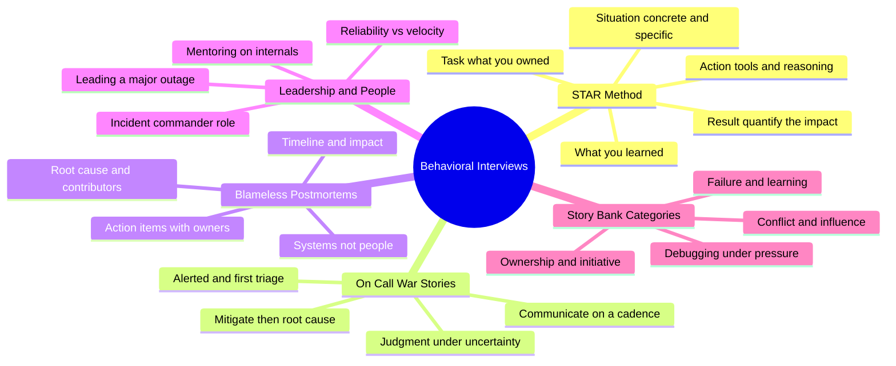
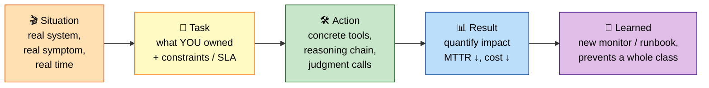
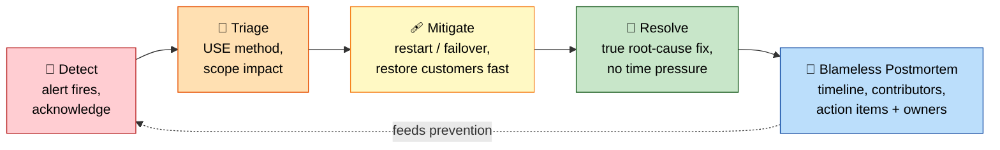

# Section 12: FAANG Behavioral & Leadership (Linux/SRE Context)

Technical mastery of the kernel is necessary but *not sufficient* for a senior Linux/SRE/Platform role
at FAANG scale. Every interview loop also evaluates how you handle ambiguity, incident pressure,
cross-team conflict, and the long-term health of the systems and people you work with.

This section covers two things:

- **The behavioral interview format itself** — what interviewers are actually probing for.
- **A bank of model STAR answers** grounded specifically in Linux/SRE scenarios.

The goal: your technical depth from earlier sections and your behavioral narrative should reinforce
each other, not feel like two disconnected interview tracks.

## Subtopic Index
- [STAR Method for Linux/SRE Incidents](#star-method-for-linuxsre-incidents)
- [On-call War Stories and Postmortems](#on-call-war-stories-and-postmortems)
- [Blameless Postmortem Culture](#blameless-postmortem-culture)
- [Leading a Major Outage Response](#leading-a-major-outage-response)
- [Mentoring Engineers on Linux Internals](#mentoring-engineers-on-linux-internals)
- [Balancing Reliability vs Feature Velocity](#balancing-reliability-vs-feature-velocity)

---

## 🗺️ Visual Overview

**Mind map — the whole section at a glance** (skim this first, revisit it last):

**The STAR answer skeleton — memorize this five-beat flow** (the highest-value diagram here):

**The incident-response loop — the arc every on-call war story should trace:**

> 🧠 **Memory hooks (mnemonics):**
> - **STAR + L** — **S**ituation, **T**ask, **A**ction, **R**esult, then **L**earned. The "L" is the senior-differentiating beat most people forget.
> - **"Blameless = systems, not people."** Postmortems interrogate the process and guardrails that let a human error reach production, never the human.
> - **"Quantify the Result or it didn't happen."** Attach a number — MTTR down, incidents eliminated, cost avoided — or the story reads as junior.
> - **DTMRP incident loop** — **D**etect, **T**riage, **M**itigate, **R**esolve, **P**ostmortem. Mitigate (fast) always comes before Resolve (thorough).
> - **"Own the I in STAR."** Say "I" for your decisions and "we" for team context — never hide your personal contribution behind the team.

---

## STAR Method for Linux/SRE Incidents

STAR (**S**ituation, **T**ask, **A**ction, **R**esult) is the standard structure for behavioral
answers. Its real value for an SRE interview: it forces you to demonstrate not just *that* you fixed a
problem, but the reasoning and judgment you applied — precisely what a senior/staff interviewer is
assessing. Junior engineers can often describe the same technical fix without demonstrating the same
judgment about prioritization, communication, and trade-offs under pressure.

How to make each letter land:

- **Situation** — Concrete and specific: a real system, a real symptom, a real timeframe.
  - ✅ *"Our checkout service was returning elevated 5xx errors starting at 2:14am."*
  - ❌ *"We had a performance issue once."*
- **Task** — Clarify what *you personally* owned and the constraints you operated under. Were you the
  incident commander, a contributing responder, or the person who made the fix decision? Was there an
  SLA with real customer impact accumulating?
- **Action** — Where your technical depth from earlier sections should surface *naturally and
  specifically*.
  - ❌ *"I looked at the logs."*
  - ✅ *"I ran `ss -tan state time-wait | wc -l` and confirmed we'd exhausted the ephemeral port range
    for outbound connections, which correlated exactly with the connection-timeout errors."*
  - Use concrete tool names, concrete observations, and the actual reasoning chain from symptom to
    root cause.
- **Result** — Quantify impact wherever possible (reduced MTTR from X to Y, eliminated a recurring
  incident class, prevented a projected cost). Critically, include **what changed afterward** — a new
  monitor, a runbook update, an automated remediation.

> 💡 **Tip:** An answer that ends at *"and then it was fixed"* misses the single most
> senior-differentiating part of the story. Junior engineers fix incidents; senior/staff engineers
> demonstrably *prevent whole classes* of future incidents from the lessons of past ones.

## On-call War Stories and Postmortems

Interviewers ask for *"a time you were on call and something went wrong"* to probe how you behave
under genuine operational pressure — not merely whether you can recite a kernel fact in a calm setting.
The strongest answers show a **calm, structured triage process** even when recalling a stressful moment.

A strong on-call narrative follows a recognizable structure:

- **How you were alerted and your first diagnostic steps** — ideally the systematic USE-method
  discipline from Section 8, not random guessing under pressure.
- **What you communicated, to whom, and when** — a senior engineer proactively updates stakeholders on
  a predictable cadence during a long incident rather than going silent while heads-down debugging.
  Stakeholder anxiety and business impact both compound when communication is absent.
- **How you made a judgment call under incomplete information** — production incidents rarely present
  with clean, unambiguous symptoms. A mature answer acknowledges genuine uncertainty in the moment
  rather than pretending the root cause was obvious from the start.
- **How the incident concluded** — the immediate *mitigation* (restarting a service, failing over to a
  healthy replica to restore customer impact fast) is often different from, and faster than, the true
  *root-cause fix*, which continues afterward without time pressure.

**On postmortems (post-incident reviews):** being able to describe your org's process specifically is
itself a signal of operational maturity. Be ready to name:

- The sections it includes: timeline, impact, root cause, contributing factors, action items with
  owners and due dates.
- Who reviews it.
- How action items are tracked to *actual completion* rather than written down and forgotten.

> 💡 **Tip:** A postmortem that doesn't produce tracked, completed action items is a purely ceremonial
> exercise providing no real organizational learning. Interviewers listen for whether yours produces
> real change.

## Blameless Postmortem Culture

Blameless postmortem culture is the explicit organizational commitment to investigating incidents by
asking **"what in our systems, processes, and tooling allowed this to happen"** rather than **"who made
the mistake."** Interviewers probe for it because it reveals how you think about systemic reliability
versus individual fault.

**The core insight:** individual human error is rarely, on its own, a sufficient or actionable root
cause. If an engineer fat-fingered a destructive command, the more useful and more preventable
questions are:

- Why did the tooling allow that destructive command to run without a confirmation step or dry-run
  preview?
- Why did insufficiently restrictive access controls (Section 6) permit it in the first place?
- Why did no automated safeguard catch it before real impact occurred?

A culture that instead simply blames — and possibly disciplines — the individual engineer does two
damaging things:

- **Fails to fix any systemic gap**, guaranteeing a similar incident recurs with a different individual
  next time.
- **Discourages honesty.** Fear of blame incentivizes responders to minimize, omit, or reframe details
  — undermining the very accuracy the whole exercise depends on.

**How to answer well:** describe a concrete instance where you (or someone else) made a genuine mistake
during an incident, and instead of it being treated as a personal failing, the retrospective produced a
*systemic fix* (better tooling guardrails, an improved runbook, an added automated check) that would
have prevented the mistake regardless of who was involved.

> 💡 **Tip:** Demonstrate you've *lived* the principle, not just learned the phrase. "We fixed the
> system so the next person can't hit this" beats "we agreed not to blame anyone."

## Leading a Major Outage Response

Leading (not merely participating in) a major outage response is a distinctly different skill from
strong individual troubleshooting. Senior/staff interviews probe for it because the skills genuinely
diverge: **the strongest individual debugger is not automatically the strongest incident commander.**
Incident command is fundamentally a coordination and decision-prioritization role, not primarily a
hands-on-keyboard one.

What a strong incident commander does:

- **Separates the roles** of "who is actively debugging/fixing" from "who is coordinating, tracking
  status, and communicating externally." Resist the natural urge to personally dive into every
  technical rabbit hole — doing so removes the one person maintaining overall situational awareness.
- **Establishes a clear timeline and communication cadence** — a running incident channel with regular
  status updates, a single source of truth rather than information scattered across side conversations.
- **Makes explicit trade-off decisions under time pressure** — mitigating customer impact immediately
  via a faster, imperfect fix (failing over to a degraded-but-functional mode) versus pursuing a fully
  correct root-cause fix — and is transparent about which trade-off was deliberately chosen and why.
- **Knows when to escalate** or bring in additional expertise, rather than letting sunk-cost thinking
  keep the existing team struggling past the point where fresh eyes would clearly help.

> 💡 **Tip:** A genuinely strong answer acknowledges a moment of uncertainty or a decision that could
> have gone better. Interviewers are skeptical of narratives where every decision was obviously and
> immediately correct — that pattern signals a rehearsed, sanitized story more than a real one.

## Mentoring Engineers on Linux Internals

Being asked how you've mentored others on *deep technical material* (rather than general career
mentorship) tests whether you can translate expert-level Linux internals knowledge into something a
less experienced engineer can actually absorb and apply — a genuinely distinct skill from possessing
the knowledge yourself.

What strong answers include:

- **A specific, concrete teaching moment** — not "I mentor junior engineers regularly" in the abstract.
  Walking a junior engineer through a real production incident's root cause as a live teaching
  opportunity (e.g., explaining *why* `D`-state processes inflate load average while the CPU sits idle,
  in the context of an actual incident you were jointly debugging) lands far more memorably than
  describing formal, scheduled training sessions.
- **Calibrating depth and pace** to the mentee's actual current level, rather than delivering the same
  maximally-detailed explanation regardless of audience. A skilled mentor knows when a simplified,
  analogy-based first pass is the right starting point:
  - > "Think of `vruntime` like a fairness ledger tracking how much CPU time each task has already
    > gotten"
  - …before layering in the full red-black-tree/scheduling-class mechanistic detail — versus when a
    mentee is ready for the complete depth immediately.
- **Evidence it was a two-way, sustained relationship** — following up to confirm the concept stuck
  (having the mentee independently diagnose a similar issue later, or explain it back in their own
  words), and being open about your own gaps or moments you worked through an unknown answer *together*.

> 💡 **Tip:** Showing intellectual honesty about what you didn't know models continuous learning — the
> mark of a genuine long-term mentor rather than someone merely performing expertise.

## Balancing Reliability vs Feature Velocity

Nearly every senior/staff loop includes some version of *"tell me about a time you had to push back on
a deadline for reliability reasons"* or *"how do you balance reliability work against feature delivery
pressure."* This tension is one of the most persistent, genuinely difficult aspects of the role, and
how you navigate it reveals your technical judgment **and** your organizational/communication skill
simultaneously.

**Weak answer** \u2014 treats reliability and feature velocity as a zero-sum conflict resolved purely
through personal authority:

> \u274c *\"I told them we couldn't ship until it was fixed.\"*

**Strong answer** \u2014 translates a reliability concern into terms the broader organization (including
non-infrastructure stakeholders) can weigh against feature value:

- **Quantify the actual risk** \u2014 a specific failure mode's probability and blast radius, backed by
  concrete data, not an unquantified appeal to caution:
  - > \u2705 *\"At our current growth rate we project hitting this conntrack ceiling within six weeks, at\n    > which point new customer signups would start failing outright.\"*\n- **Propose a genuinely incremental path** \u2014 a smaller, faster mitigation that meaningfully reduces\n  risk, rather than presenting reliability work and feature work as strictly sequential, mutually\n  exclusive alternatives.\n\n**The error budget** is worth being able to discuss concretely: a data-driven, pre-agreed acceptable\nrate of unreliability, negotiated in advance between reliability and product stakeholders. It provides\na standing, objective mechanism for deciding *\"do we have room to take on more risk for a feature\nlaunch, or has this period's budget already been consumed by recent incidents?\"*\n\n> \ud83d\udca1 **Tip:** The error budget is the structural, *non-adversarial* mechanism mature orgs use to make\n> this trade-off explicit and data-driven \u2014 instead of an ad-hoc argument repeated fresh every time.\n> Describing lived experience using or helping establish one is a strong, senior-level signal.

---

### 15 Behavioral Questions with Model STAR Answers

> 💡 **How to use these:** Don't memorize them word-for-word. Swap in your *own* real incidents, keep
> the same **Situation → Task → Action → Result** skeleton, and preserve the two senior-level signals
> baked into every answer: a *specific* technical observation, and a *systemic* prevention at the end.

**1. Tell me about a production incident you diagnosed and resolved that required deep Linux
internals knowledge.**
- **Situation:** A payment-processing service began intermittently timing out under moderate load,
  with CPU and memory utilization on affected hosts looking unremarkable in standard dashboards.
- **Task:** As the on-call engineer, I needed to identify the root cause before the next peak-traffic
  window, since the intermittent nature meant it could become far more severe under higher load.
- **Action:** I checked load average first and found it elevated despite low CPU utilization —
  immediately suggesting `D`-state processes rather than a CPU bottleneck. `ps -eo stat` confirmed a
  cluster of uninterruptible-sleep processes, and `iostat -x` showed a shared network storage backend
  with `await` times spiking into the hundreds of milliseconds. I traced this to a specific storage
  volume shared with an unrelated batch job that had recently increased its I/O footprint, creating
  contention neither team had visibility into.
- **Result:** I worked with the batch job's owning team to move it to a separate volume, immediately
  resolving the timeouts. I also added D-state-process-count and storage-`await` monitoring to our
  standard dashboard, since load average alone had been misleadingly reassuring throughout the
  incident, and documented this diagnostic pattern in our on-call runbook.

**2. Describe a time you had to make a difficult trade-off decision during an active incident.**
- **Situation:** During a major outage, our primary database's replication lag had grown severe enough
  that failing over to the replica risked measurable data loss, but continuing on the primary meant
  ongoing customer-facing errors.
- **Task:** As incident commander, I had to decide between accepting a bounded, quantifiable amount of
  data loss to restore service quickly, or continuing to investigate a same-primary fix with unknown
  time-to-resolution.
- **Action:** I quickly quantified the actual data-loss window (based on the measured replication lag)
  and communicated both options with their concrete trade-offs to the relevant stakeholders (including
  a data/compliance representative, since data loss had implications beyond pure engineering) rather
  than making the call unilaterally and silently, given the genuine business-impact dimension of the
  choice.
- **Result:** We collectively chose to fail over, accepting a documented, bounded data-loss window,
  restoring service within minutes rather than continuing an open-ended investigation. Afterward, we
  identified and fixed the specific replication-lag root cause and added an automated alert firing well
  before lag reaches a failover-risk threshold, so future incidents have more decision time available
  before this same trade-off becomes urgent.

**3. Tell me about a time you disagreed with a decision made during an incident and how you handled
it.**
- **Situation:** During a live incident, another senior engineer proposed immediately restarting a
  cluster of application servers as the fix, but I suspected (based on recent log patterns) the actual
  issue was a poison-pill message in a shared queue that would simply recur after any restart.
- **Task:** I needed to raise this disagreement constructively without stalling the ongoing mitigation
  effort or undermining the incident commander's authority to make the final call.
- **Action:** I voiced my specific, evidence-based concern directly in the incident channel (rather than
  a side conversation), proposed a quick, low-cost way to test my hypothesis in parallel (inspecting
  the queue for the suspected poison message) while the restart proceeded as the immediate mitigation
  regardless, so we weren't blocking on resolving the disagreement before taking any action at all.
- **Result:** The restart provided temporary relief as expected, and my parallel investigation confirmed
  the poison-pill message shortly afterward, letting us apply the actual fix (purging the specific
  message) before the issue could recur. The incident commander explicitly credited the parallel-
  investigation approach afterward as a pattern worth repeating for future incidents with competing
  hypotheses.

**4. Describe a time you contributed to a blameless postmortem after making a mistake yourself.**
- **Situation:** I ran a cleanup script against what I believed was a decommissioned host, but it was
  actually still serving low-volume production traffic due to a stale inventory record.
- **Task:** I needed to both restore the affected service quickly and be fully transparent about my own
  role in the postmortem that followed, despite the natural instinct to minimize my own mistake.
- **Action:** I immediately flagged the issue myself the moment I noticed the impact, restored the
  service from a recent backup, and in the postmortem explicitly walked through exactly what I did and
  why the stale inventory record made it seem safe, rather than describing the incident vaguely.
- **Result:** The postmortem's action items focused entirely on the systemic gap (the inventory system
  had no automated verification against actual host activity) rather than on my individual action,
  leading to an automated pre-flight check being added to the cleanup tooling that verifies genuine
  inactivity before allowing any destructive operation — a fix that has since prevented at least two
  similar near-misses by other engineers.

**5. Tell me about a time you had to explain a complex Linux/kernel concept to a less experienced
engineer or a non-technical stakeholder.**
- **Situation:** A junior engineer on my team was confused why our monitoring showed high load average
  on a host with plenty of idle CPU, and separately, a product manager needed to understand why we
  couldn't simply "add more CPU" to fix a customer-reported slowness issue.
- **Task:** I needed to give each audience an explanation calibrated to their actual background and
  what decision they needed to make with the information.
- **Action:** For the junior engineer, I walked through the actual mechanism live during our joint
  debugging session — showing `ps -eo stat`, explaining uninterruptible sleep, and connecting it
  directly to the real symptom we were looking at together. For the product manager, I used a
  simpler analogy (comparing it to a warehouse with plenty of workers but a jammed loading dock) to
  convey that the bottleneck was I/O, not raw compute capacity, which was the actual decision-relevant
  fact they needed (that adding CPU wouldn't help, but addressing the storage backend would).
- **Result:** The junior engineer independently diagnosed a similar D-state issue on their own a few
  weeks later, confirming the explanation had genuinely stuck rather than just being nodded along to.
  The product manager correctly redirected the relevant budget conversation toward storage
  infrastructure instead of compute scaling, based on accurately understanding the real bottleneck.

**6. Describe a time you pushed back on a feature deadline for reliability reasons.**
- **Situation:** A new feature launch was scheduled that would significantly increase write volume to a
  database cluster already operating close to its known I/O capacity ceiling, based on our own
  capacity planning data.
- **Task:** I needed to raise this risk clearly enough to actually change the launch plan, without
  simply saying "no" in a way that would be dismissed as generic engineering caution.
- **Action:** I quantified the specific risk using our existing capacity planning data (projected write
  volume against measured I/O headroom) and proposed a concrete, incremental alternative — a phased
  rollout ramping traffic gradually with explicit monitoring gates, rather than either a full delay or
  an unmitigated full-volume launch.
- **Result:** The team adopted the phased rollout; we caught the actual I/O ceiling being approached
  during the second rollout phase (validating the original concern) and had time to provision
  additional capacity before it became customer-impacting, allowing the feature to still launch on
  essentially the original timeline with the risk properly managed rather than ignored.

**7. Tell me about a time a monitoring/alerting gap contributed to an incident being detected late.**
- **Situation:** A slow memory leak in a service went undetected for weeks because our monitoring
  tracked only aggregate memory usage, which grew gradually enough to look like normal, expected growth
  rather than a leak, until an OOM kill finally occurred.
- **Task:** After the incident, I needed to both understand why our existing monitoring missed this and
  propose a genuinely better detection mechanism, not just a reactive alert on the symptom that had
  already occurred.
- **Action:** I analyzed the actual memory growth pattern retrospectively and identified that per-
  process RSS growth rate (not just absolute level) would have flagged the leak weeks earlier, well
  before it became critical, and implemented that as a new proactive alert.
- **Result:** The new growth-rate-based alert has since caught two subsequent memory leaks in other
  services within days of introduction rather than weeks, directly demonstrating the value of the
  changed detection approach with concrete before/after evidence.

**8. Describe a time you had to lead an incident response involving multiple teams.**
- **Situation:** A cascading failure during a traffic spike involved our infrastructure team's load
  balancers, a separate application team's service, and a third team's shared database, with no single
  team having full visibility into the whole chain.
- **Task:** As the incident commander, I needed to coordinate across all three teams' engineers, who
  didn't normally work together directly, toward a shared understanding of the failure chain.
- **Action:** I established a single incident channel as the shared source of truth, explicitly assigned
  each team's lead a specific investigation scope to avoid duplicated effort, and personally maintained
  the overall timeline/status rather than diving into any one team's specific technical investigation
  myself, checking in with each workstream at a regular cadence.
- **Result:** We identified the full cascading chain (load balancer health-check timeout tuning that
  amplified an initially minor database slowdown into full service failure) within 40 minutes, faster
  than any single team likely would have achieved investigating in isolation, and the postmortem
  produced coordinated action items across all three teams.

**9. Tell me about a time you automated a manual, error-prone process.**
- **Situation:** Our team manually applied kernel security patches host-by-host following a checklist,
  and the process was both slow and occasionally inconsistently followed under time pressure.
- **Task:** I wanted to reduce both the time cost and the human-error risk of this recurring operational
  burden.
- **Action:** I built an idempotent automation script (following the production-grade scripting
  discipline from Section 10 — `set -euo pipefail`, proper trap-based cleanup, a dry-run mode) that
  encoded the checklist's logic directly, including the canary/staged-rollout discipline from Section
  11 rather than applying patches fleet-wide at once.
- **Result:** Patch rollout time dropped substantially, and the automation's built-in staged rollout
  caught a regression during a canary wave on one later rollout that a rushed, purely manual process
  under time pressure likely would have missed until it had already spread further.

**10. Describe a time you had to say no to a request that would have compromised system security or
reliability.**
- **Situation:** A team requested a broad, unscoped `CAP_SYS_ADMIN` capability grant for a container to
  quickly resolve a permission error they were blocked on.
- **Task:** I needed to decline the overly broad request without simply blocking their progress
  outright, since they had a genuine, time-sensitive need.
- **Action:** I investigated with them what specific narrow capability their actual operation required,
  found it was a much narrower, specific capability rather than the broad grant they'd defaulted to
  requesting, and helped them apply that instead.
- **Result:** They were unblocked within the same day with a properly minimal capability grant, and this
  became the standard example I've since used when mentoring other teams on why "just grant
  `CAP_SYS_ADMIN`" is almost never actually the right fix for a permission error, directly informed by
  the capability model covered in Section 6.

**11. Tell me about a time you had to recover from a mistake that caused a production incident.**
- **Situation:** I introduced a change to a shared configuration management template that inadvertently
  disabled a security-relevant firewall rule across a subset of hosts.
- **Task:** I needed to both remediate the immediate exposure and take ownership of the mistake
  transparently.
- **Action:** I identified the affected hosts immediately upon discovering the issue, reverted the
  change, and proactively opened an incident and notified the security team rather than quietly
  reverting and hoping the brief exposure window went unnoticed.
- **Result:** No exploitation of the exposure window was found upon investigation, and the postmortem
  led to adding an automated policy check specifically validating firewall rule presence as part of
  the configuration management pipeline's own testing, preventing this specific class of regression
  from reaching production again regardless of which engineer might introduce a similar future change.

**12. Describe a time you improved a runbook or process based on lessons from an incident.**
- **Situation:** During an incident, our existing runbook for "service unresponsive" investigation
  didn't include checking for conntrack table exhaustion, a cause we ultimately found only through ad-
  hoc investigation that took longer than it should have.
- **Task:** I wanted to make sure the next engineer facing a similar symptom wouldn't need to rediscover
  this diagnostic path from scratch.
- **Action:** I updated the runbook with an explicit, ordered diagnostic checklist informed by the USE
  method (Section 8), including the specific `conntrack -L | wc -l` versus `nf_conntrack_max` check
  that had resolved this particular incident, alongside the reasoning for why each check matters.
- **Result:** The updated runbook was used successfully by a different on-call engineer during a later,
  unrelated incident with similar symptoms, who resolved it significantly faster by following the
  updated checklist rather than needing to rediscover the same diagnostic path independently.

**13. Tell me about a time you had to make a decision with incomplete information during an
incident.**
- **Situation:** During an outage, two plausible root causes existed (a recent deployment and an
  unrelated infrastructure change happening around the same time), and we didn't have time to fully
  confirm either before customer impact became severe.
- **Task:** I needed to decide which mitigation to pursue first without certainty about the true root
  cause.
- **Action:** I chose to roll back the recent deployment first, reasoning it was the lower-risk, faster-
  to-reverse action regardless of whether it was the actual root cause, while continuing to
  investigate the infrastructure change in parallel rather than waiting for full certainty before
  acting at all.
- **Result:** The rollback resolved the issue, confirming the deployment as the actual root cause, and I
  explicitly documented in the postmortem that this was an educated bet under uncertainty (lowest-risk,
  fastest-to-reverse action first) rather than implying we had certain knowledge from the start, which
  the team later adopted as an explicit stated principle for similar dual-hypothesis situations.

**14. Describe a time you had to balance urgent operational work against planned project work.**
- **Situation:** I was in the middle of a planned infrastructure migration project when a recurring,
  moderate-severity incident pattern began consuming significant on-call time.
- **Task:** I needed to decide how to allocate my own time between the two, and to make that trade-off
  visible to my manager rather than silently absorbing the conflict myself.
- **Action:** I proposed a short, explicit pause on the migration project specifically to root-cause and
  permanently fix the recurring incident pattern, quantifying the ongoing on-call time cost it was
  creating against the migration project's own timeline cost, and got explicit agreement on the
  trade-off rather than deciding it unilaterally.
- **Result:** The root-cause fix eliminated the recurring incident entirely, and the migration project
  resumed with a clearer runway (no longer competing with recurring on-call interruptions), ultimately
  completing only slightly later than originally planned but without ever needing to interrupt it again.

**15. Tell me about a time you mentored someone and saw them grow as a result.**
- **Situation:** A newer engineer on my team was capable but hesitant to lead incident response,
  consistently deferring to more senior engineers even when they had clearly already identified the
  correct root cause themselves.
- **Task:** I wanted to build their confidence and visibility as an incident responder, not just their
  raw technical skill, which was already solid.
- **Action:** During a lower-severity incident where I was confident they could handle it, I deliberately
  stepped back and let them drive, staying available but not taking over, and afterward gave specific,
  concrete feedback on what they'd done well rather than generic encouragement.
- **Result:** They led several subsequent incidents independently and successfully, and were promoted to
  a senior on-call role within the following review cycle — a change I specifically attribute to
  deliberately creating space for them to practice leading, not just accumulating more individual
  technical knowledge, which they already had.
