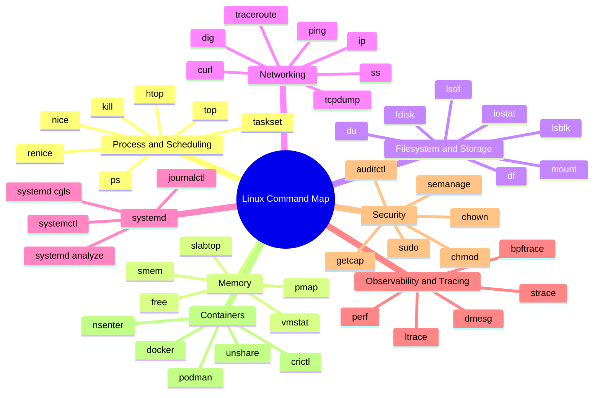
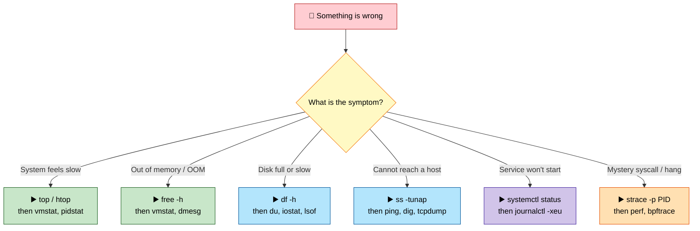

# Section 13: Hands-On Labs & Documentation

This section consolidates a capstone set of hands-on labs spanning every earlier section into a single
study-and-practice reference, plus a master command-line cheat sheet organized by subject area.

Use it as the **practical companion** to the conceptual depth in Sections 1-12: read the theory in the
relevant section, then execute the corresponding lab here (or the fuller labs embedded in each section)
to convert understanding into muscle memory before an interview.

> 💡 **Tip:** Reading these labs is not the same as doing them. The muscle memory that makes you calm in
> an interview only comes from actually running the commands on a throwaway VM.

## Subtopic Index
- [Visual Overview](#️-visual-overview)
- [Capstone Hands-On Labs](#capstone-hands-on-labs)
- [Master Command-Line Cheat Sheet](#master-command-line-cheat-sheet)

---

## 🗺️ Visual Overview

**Command map — the whole cheat sheet at a glance** (skim this first, revisit it last). Group every command you learn under one of these subsystems; recall the family, then the flagship tool:



**Troubleshooting triage — symptom to first command** (start here when something breaks):



> 🧠 **Memory hooks (mnemonics):**
> - **USE method per resource:** for CPU, memory, disk, and network, always check **U**tilization → **S**aturation → **E**rrors. "USE it on every resource."
> - **Escalation ladder for tracing:** *top → perf → bpftrace*. Start cheap and broad (`top`), sample deeper (`perf`), then surgically trace (`bpftrace`) only when you need the smoking gun.
> - **One go-to command per subsystem:** *"Please Feed Data Into Systemd Justly"* → **P**rocess `ps`, **F**ree memory `free`, **D**isk `df`, **I**P/network `ip`+`ss`, **S**ystemd `systemctl`, **J**ournal `journalctl`.
> - **Full disk detective:** `df` says *how full*, `du` says *what filled it*, `lsof` finds the *deleted-but-held* file still eating space. "df → du → lsof."
> - **Network triage order:** *"Socket, Ping, Dig, Dump"* → `ss` (is it listening?) → `ping` (is it reachable?) → `dig` (does DNS resolve?) → `tcpdump` (what's on the wire?).

---

## Capstone Hands-On Labs

Each section of this guide (1-12) already includes 3-5 focused hands-on labs tied directly to that
section's material. This capstone list adds **15 broader, cross-cutting labs** that deliberately
combine multiple sections together — mirroring the kind of end-to-end reasoning a staff-level interview
(or a real production incident) actually demands. No single subsystem in isolation.

> 💡 **Tip:** Each lab below names the sections it stitches together. If a lab feels hard, that's the
> signal to revisit those sections' theory first, then come back.

**Lab 1: Full boot-to-login trace with custom kernel parameters**
- **Objective:** Tie together Sections 1 and 7 — bootloader, kernel init, and systemd target activation.
- **Setup:** A VM you can freely reboot, with GRUB2 and systemd.
- **Tasks:** Add a custom kernel parameter; regenerate GRUB config; reboot and confirm the parameter in
  `/proc/cmdline`; run `systemd-analyze blame`/`critical-chain` and reduce total boot time by at least
  10% through a justified, documented change.
- **Expected outcome:** A single, coherent before/after report spanning firmware, kernel, and userspace
  boot phases.

**Lab 2: Build a container from raw primitives, then compare against Docker**
- **Objective:** Tie together Sections 2, 5, 6, and 9 — namespaces, veth/bridge networking, capabilities,
  and cgroups.
- **Setup:** A Linux VM with root access and Docker installed for comparison.
- **Tasks:** Manually construct a namespaced, cgroup-limited, capability-dropped process environment with
  network connectivity (as in Section 9's Lab 1); separately inspect an equivalent `docker run`
  container's actual kernel-level configuration (Section 9's Lab 5); write a comparison table mapping
  every manual step to its Docker-automated equivalent.
- **Expected outcome:** A working manual "container" plus a documented, verified mapping to Docker's
  automated pipeline.

**Lab 3: Diagnose a multi-layered performance incident**
- **Objective:** Tie together Sections 2, 3, 4, and 8 — CPU scheduling, memory, storage, and the USE
  method.
- **Setup:** A VM where you (or a study partner) deliberately induces two simultaneous, independent
  bottlenecks (e.g., artificially throttled disk I/O plus a CPU-hogging background process) without
  revealing which ones in advance.
- **Tasks:** Apply the USE method systematically across CPU, memory, and storage; use `strace`/`perf`/
  `bpftrace` as needed; correctly identify both induced bottlenecks and their independent root causes.
- **Expected outcome:** Correct identification of both bottlenecks purely through systematic
  investigation, not guesswork, with a documented diagnostic trail.

**Lab 4: End-to-end TCP connection lifecycle with security hardening**
- **Objective:** Tie together Sections 5 and 6 — the TCP state machine, conntrack, and firewall/SSH
  hardening.
- **Setup:** Two VMs connected over a network you control.
- **Tasks:** Capture a full TCP connection lifecycle with `tcpdump` while simultaneously observing
  `conntrack -L`; apply `sshd_config` hardening (disable password auth, disable root login) and verify
  in a second session before closing the first; add an nftables rule restricting SSH access to a
  specific source range and verify enforcement.
- **Expected outcome:** A documented, captured full connection lifecycle alongside verified, tested
  security hardening changes.

**Lab 5: Kernel live patching and canary rollout simulation**
- **Objective:** Tie together Sections 7 and 11 — service restart policies and staged rollout discipline.
- **Setup:** A small fleet of 3-5 VMs (or containers simulating hosts).
- **Tasks:** Script a staged rollout of a configuration change across the "fleet," including a health-check
  gate between waves; deliberately introduce a regression that only manifests on a subset of hosts and
  confirm the staged rollout catches and contains it at the canary wave rather than propagating
  fleet-wide.
- **Expected outcome:** A working, demonstrated staged-rollout script that correctly halts on a detected
  regression before reaching the full simulated fleet.

**Lab 6: Memory pressure, OOM scoring, and cgroup containment together**
- **Objective:** Tie together Sections 3, 6, and 9 — memory management, cgroup security framing, and
  container resource limits.
- **Setup:** A VM with cgroup v2.
- **Tasks:** Run two competing processes in separate cgroups with different `oom_score_adj` values and
  different `memory.max` limits; induce memory pressure and confirm the OOM killer's behavior matches
  your configured priorities exactly; document the full reasoning chain from configuration to observed
  outcome.
- **Expected outcome:** A verified, explained OOM containment outcome matching intended configuration.

**Lab 7: Reproducible container image build audit**
- **Objective:** Tie together Sections 9 and 11 — OverlayFS layer sharing and golden-image reproducibility.
- **Setup:** A container build pipeline.
- **Tasks:** Build an image twice from identical source; verify identical layer digests; introduce a
  non-deterministic build step (embedding a timestamp); rebuild and confirm digests now diverge; fix it
  and reconfirm reproducibility.
- **Expected outcome:** A documented reproducibility verification workflow, with both a passing and
  failing case demonstrated.

**Lab 8: Full disk-to-network write path trace**
- **Objective:** Tie together Sections 4 and 5 — the block I/O path and the network stack, contrasted
  side by side.
- **Setup:** Any Linux VM with `strace`, `blktrace`, and `tcpdump`.
- **Tasks:** Trace a local file write end-to-end (`strace -T`, `blktrace`) and a network send end-to-end
  (`strace -T`, `tcpdump`) for comparable data volumes; document and compare the number of distinct
  subsystem layers and buffering points each path traverses.
- **Expected outcome:** A side-by-side documented comparison of both I/O paths' full mechanics.

**Lab 9: Real-time scheduling and IRQ affinity for a simulated low-latency workload**
- **Objective:** Tie together Section 2's real-time scheduling and Section 11's low-latency tuning
  guidance.
- **Setup:** A VM (results will be less extreme than bare metal, but the configuration steps are
  identical).
- **Tasks:** Isolate a core with `isolcpus`; pin a test workload to it with `taskset`/`chrt -f`; steer
  interrupt affinity away from that core; measure latency with `cyclictest` before and after the full
  configuration.
- **Expected outcome:** A measured, documented latency improvement attributable to the combined
  configuration, with each individual step's contribution isolated where possible.

**Lab 10: Systemd-managed, security-hardened, observable service from scratch**
- **Objective:** Tie together Sections 6, 7, and 8 — capabilities/seccomp, systemd unit design, and
  journald-based observability.
- **Setup:** Any systemd VM.
- **Tasks:** Write a custom `.service` unit for a simple network-facing test program; apply
  `CapabilityBoundingSet=`, a custom seccomp filter via `SystemCallFilter=`, and `MemoryMax=`/
  `TasksMax=` limits directly in the unit file; verify enforcement of each; confirm structured logs are
  correctly queryable via `journalctl -u`.
- **Expected outcome:** A single, fully-hardened, observable systemd service with every restriction
  independently verified.

**Lab 11: Fork bomb containment drill**
- **Objective:** Tie together Sections 2 and 6 — PID exhaustion and cgroup PID limits as a security
  control.
- **Setup:** A disposable VM (never run this without a PID limit safety net in place first).
- **Tasks:** Apply a `pids.max` cgroup limit to a test cgroup; run a deliberate fork bomb inside it; confirm
  the rest of the host remains fully responsive throughout; remove the limit and, in a fully disposable,
  snapshot-able VM only, observe the contrasting uncontained failure mode.
- **Expected outcome:** A documented, safe demonstration of both the failure mode and its containment.

**Lab 12: NUMA-aware, huge-page-tuned database deployment**
- **Objective:** Tie together Sections 2, 3, and 11 — NUMA scheduling, huge pages, and database-specific
  tuning guidance.
- **Setup:** A multi-socket or NUMA-emulated VM with a real or simulated database workload.
- **Tasks:** Apply the full recommended tuning stack (THP set to madvise, explicit HugeTLB pages sized to a
  target buffer pool, `numactl` CPU/memory binding); benchmark against an untuned baseline.
- **Expected outcome:** A quantified, multi-factor tuning improvement with each individual tuning
  component's contribution documented where feasible.

**Lab 13: Blameless postmortem writing exercise**
- **Objective:** Tie together Section 12's behavioral material with a real (lab-induced) technical
  incident from earlier in this list.
- **Setup:** Any incident you've reproduced in an earlier lab (e.g., Lab 3's multi-layered performance
  incident).
- **Tasks:** Write a full postmortem document (timeline, impact, root cause, contributing factors, action
  items with owners/dates) in blameless language, focused on systemic factors rather than individual
  fault, even if the "incident" was entirely self-induced for practice.
- **Expected outcome:** A complete, well-structured postmortem document you could confidently present in
  a real interview as a work sample.

**Lab 14: Disaster recovery drill with measured RTO/RPO**
- **Objective:** Directly execute Section 11's DR guidance end-to-end.
- **Setup:** A test database with an established backup procedure.
- **Tasks:** Define explicit RTO/RPO targets; perform a real, timed restore; measure actual RTO and data
  completeness (RPO) against the targets; document any gap and a remediation plan.
- **Expected outcome:** A real, measured DR drill result, not a documentation-only exercise.

**Lab 15: Full incident-to-prevention loop**
- **Objective:** Demonstrate the complete cycle this entire guide has emphasized — diagnose, fix, and
  systemically prevent recurrence.
- **Setup:** Any lab-induced incident from this list.
- **Tasks:** Diagnose and resolve the immediate issue; identify and implement a monitoring/alerting
  improvement that would have caught it earlier; identify and implement an automated safeguard that
  would prevent recurrence entirely (not just detect it faster); write up all three (diagnosis, fix,
  prevention) together as one narrative.
- **Expected outcome:** A complete, three-part incident lifecycle write-up demonstrating the systemic-
  prevention mindset covered throughout Section 12.

---

## Master Command-Line Cheat Sheet

Organized by subject area, covering the most important commands referenced throughout this guide.

> 💡 **Tip:** Don't just skim these — run each one and read its output. Knowing *what a command's output
> looks like* is what lets you spot the anomaly fast during a real incident.

### Process & Scheduling
```
ps -eLf                              # list threads alongside processes
ps -eo pid,ppid,stat,pri,ni,comm       # state, priority, nice value overview
top -H -p <pid>                          # per-thread CPU usage
pidstat 1                                 # historical per-process time-series
chrt -f -p <priority> <pid>                 # set SCHED_FIFO real-time priority
nice -n 10 command / renice -n -5 -p <pid>    # adjust CPU scheduling priority
taskset -c 2,3 command                         # pin a process to specific CPUs
numactl --cpunodebind=0 --membind=0 command      # NUMA CPU + memory binding
strace -f -e trace=clone,execve,wait4 <cmd>       # observe process lifecycle syscalls
kill -TERM / -KILL / -HUP <pid>                     # graceful / forceful / reload-request signals
```

### Memory
```
free -h                              # memory + swap summary ('available' matters most)
cat /proc/meminfo                      # detailed memory breakdown
cat /proc/<pid>/smaps_rollup             # per-process RSS/PSS summary
vmstat 1                                  # memory, swap, CPU summary over time
sysctl vm.swappiness vm.dirty_ratio         # key memory-subsystem tunables
echo 1/2/3 > /proc/sys/vm/drop_caches         # drop page cache / dentries+inodes / both (diagnostic only)
cat /sys/kernel/mm/transparent_hugepage/enabled   # THP mode
numastat -p <pid>                                    # per-process NUMA locality stats
choom -p <pid> -n <score>                              # view/set oom_score_adj
```

### Filesystems & Storage
```
lsblk / df -h / df -i                # block devices; space usage; inode usage
mount | column -t                      # all mounted filesystems
stat <file> / ls -li                     # inode metadata / inode numbers
lsof +L1                                   # deleted-but-open files
filefrag -v <file>                           # extent/fragmentation map
pvcreate / vgcreate / lvcreate                 # LVM PV/VG/LV creation
lvextend -L +10G -r /dev/vg/lv                   # grow LV and filesystem online
mdadm --create/--detail/--manage                   # software RAID management
cat /sys/block/sdX/queue/scheduler                    # I/O scheduler selection
fio --name=test --rw=randread --bs=4k --iodepth=32      # storage benchmarking
```

### Networking
```
ip addr / ip route / ip link          # interfaces, routing, link state
ss -tanp / ss -unp / ss -xp             # TCP / UDP / UNIX sockets with owning process
ss -tin                                   # per-connection TCP internals (cwnd, RTT, retransmits)
tcpdump -i eth0 -nn port 443                # packet capture
conntrack -L                                  # connection tracking table
iptables -L -n -v / nft list ruleset            # firewall rules
ip netns add/exec                                 # network namespace management
tc qdisc add dev eth0 root netem delay 100ms        # traffic shaping / network emulation
resolvectl status                                     # systemd-resolved DNS configuration
ethtool -S eth0 / ethtool -k eth0                       # interface stats / offload feature state
```

### Security & Access Control
```
id / getent passwd <user>            # identity and NSS-resolved user info
getfacl / setfacl                      # ACL inspection/management
getcap / setcap                          # capability inspection/management
getenforce / ausearch -m avc -ts recent    # SELinux mode / denial search
aa-status                                    # AppArmor profile status
sudo -l / visudo                               # sudo permissions / safe sudoers editing
ssh-keygen -t ed25519 -a 100                     # generate a strong SSH key
auditctl -w /path -p wa -k key                     # audit file-watch rule
rkhunter --check / aide --check                      # rootkit / file-integrity scanning
```

### systemd
```
systemctl status/start/stop/enable/mask <unit>   # core unit lifecycle management
systemctl list-dependencies <unit>                 # dependency tree
systemctl list-timers --all                          # scheduled timer units
systemd-analyze blame/critical-chain                   # boot time analysis
journalctl -u <unit> -f / -b -1 / -p err                 # unit logs / previous boot / error-level+
systemd-cgtop                                              # live per-unit resource usage
systemctl set-property <unit> MemoryMax=512M                 # live resource limit change
```

### Observability & Troubleshooting
```
strace -f -e trace=... -p <pid>       # syscall tracing
perf record -g -p <pid> -- sleep 30     # CPU profiling with call graphs
perf report / perf stat                   # profile analysis / hardware counter summary
bpftrace -e '...'                           # ad-hoc eBPF tracing one-liners
vmstat 1 / iostat -x 1 / mpstat -P ALL 1      # classic resource summaries
dmesg -T --level=err,crit,alert,emerg           # kernel log, filtered to actionable severity
coredumpctl list / coredumpctl debug              # captured crash inspection
lsof -i :<port> / lsof -p <pid>                     # port ownership / process file descriptors
```

### Virtualization & Containers
```
ps aux | grep qemu / virsh list --all   # KVM guest inspection
unshare --pid --mount --net --user --fork bash  # manual namespace construction
lsns / nsenter --target <pid> --all bash          # namespace enumeration / entry
cat /sys/fs/cgroup/cgroup.controllers               # cgroup v2 controller list
docker inspect <container> --format '{{.State.Pid}}'  # container's host-visible PID
runc list / ctr containers list / crictl ps             # runtime-level container listing
```

### Shell Scripting
```
set -euo pipefail                    # standard defensive script header
trap 'cleanup' EXIT                    # guaranteed cleanup on any exit path
"${arr[@]}"                              # correct, safe array expansion
find . -print0 | xargs -0 -P4 cmd          # safe, parallelized batch operations
shellcheck myscript.sh                       # static analysis for common scripting bugs
```
