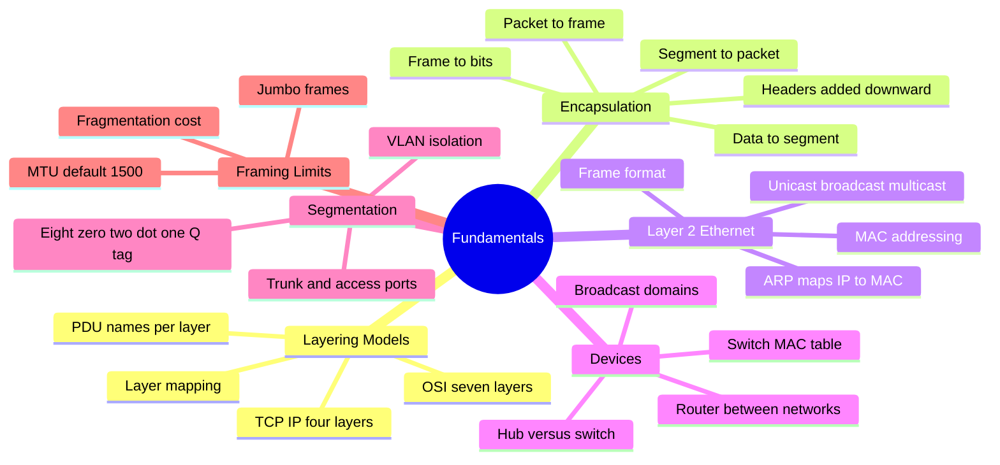
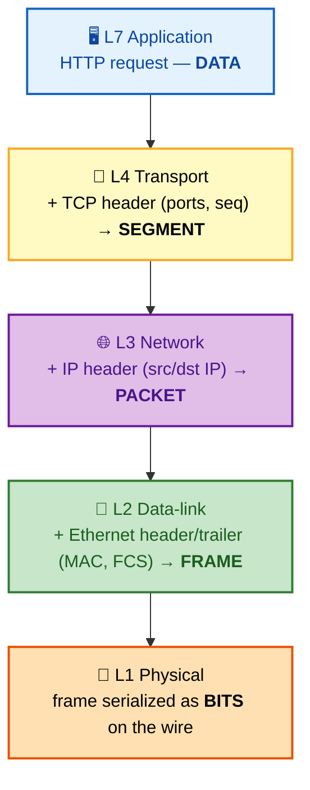
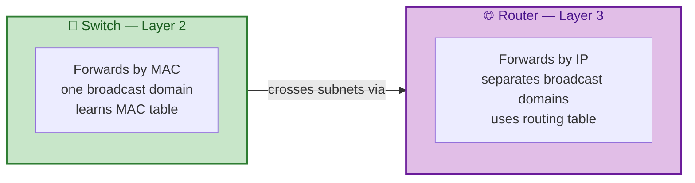

# SECTION 1: FUNDAMENTALS & THE STACK

> **Scope:** The two layering models (OSI vs TCP/IP), how data is encapsulated with headers as it
> descends the stack, and everything at Layer 2 — Ethernet frames, MAC addressing, ARP, the
> switch-vs-router distinction, VLANs/trunking, and MTU.

---

## 🗺️ Visual Overview

**In one line:** Networking is a stack of layers, each adding a header as data descends toward the wire
and stripping it as data ascends toward the app — master the layers and the header at each one, and
every later topic slots into place.

**Mind map — the whole section at a glance:**



**Encapsulation — data descending the stack, each layer prepends a header** (this is THE diagram to
memorize):



**ARP resolution — how L3 finds the L2 address of the next hop:**

```mermaid
sequenceDiagram
    participant H as 🖥️ Host A (10.0.0.5)
    participant N as 📡 Broadcast domain
    participant B as 🖥️ Host B (10.0.0.9)
    Note over H: Wants to send to 10.0.0.9,<br/>knows IP, needs MAC
    H->>N: ARP Request (broadcast)<br/>"Who has 10.0.0.9? Tell 10.0.0.5"
    N-->>B: Every host sees it;<br/>only .9 answers
    B->>H: ARP Reply (unicast)<br/>"10.0.0.9 is at aa:bb:cc:dd:ee:ff"
    Note over H: Cache entry stored;<br/>frame now addressable
```

**Switch vs router — where each operates and what it separates:**



> 🧠 **Memory hooks (mnemonics):**
> - **OSI top→down:** *"All People Seem To Need Data Processing"* → **A**pplication, **P**resentation,
>   **S**ession, **T**ransport, **N**etwork, **D**ata-link, **P**hysical. Bottom→up:
>   *"Please Do Not Throw Sausage Pizza Away."*
> - **PDU names by layer:** *"Some People Fear Birthdays"* → **S**egment (L4), **P**acket (L3),
>   **F**rame (L2), **B**its (L1). Data is the L5–L7 name.
> - **Switch vs router:** switch = **S**ame network (MAC, L2); router = **R**oute between networks
>   (IP, L3).
> - **ARP direction:** **Request is broadcast** ("shout to everyone"), **reply is unicast** ("whisper
>   back").

---

## 1. OSI vs TCP/IP Models

> 🎯 **Interview weight: High** — the mental scaffold for every other answer; "which layer does X
> live at?" is a constant.

**In one line:** OSI is the 7-layer *teaching/reference* model; TCP/IP (4 layers) is the model the
real Internet is actually built on — you map one onto the other.

The **OSI model** is a conceptual 7-layer reference. The **TCP/IP model** is the practical 4-layer
stack that real networks implement. They map directly:

| OSI Layer | # | TCP/IP Layer | PDU | Examples / Responsibility |
|---|---|---|---|---|
| Application | 7 | Application | Data | HTTP, DNS, SSH — app semantics |
| Presentation | 6 | Application | Data | TLS encryption, encoding, compression |
| Session | 5 | Application | Data | Session setup/teardown, dialog control |
| Transport | 4 | Transport | Segment | TCP, UDP — ports, reliability, ordering |
| Network | 3 | Internet | Packet | IP, ICMP — addressing, routing |
| Data-link | 2 | Link | Frame | Ethernet, ARP, MAC, switching |
| Physical | 1 | Link | Bits | Cables, NICs, signaling |

**Why interviewers use it:** it gives a shared vocabulary for *where a problem lives*. "DNS fails" is
L7; "no route to host" is L3; "cable unplugged / link down" is L1. Troubleshooting (Section 6) is
literally walking these layers bottom-up.

> 💡 **The distinction that matters:** OSI splits the top into three layers (Session, Presentation,
> Application), but TCP/IP lumps them into one "Application" layer because in practice a single program
> (e.g., a browser) handles all three. When someone says "Layer 7 load balancer," they mean it makes
> decisions using application data (HTTP headers, URLs), regardless of the pedantic OSI split.

> ⚠️ **Common trap:** TLS is often called "Layer 4.5" or placed at L6 (Presentation). It runs *over*
> TCP but *below* HTTP. Don't over-think it — say "TLS sits between transport and application; OSI-wise
> it's presentation-layer encryption."

## 2. Encapsulation & Headers

> 🎯 **Interview weight: High** — the core mechanic behind "what happens when you type a URL."

**In one line:** As data descends the stack each layer wraps it in that layer's header (and L2 adds a
trailer too), building the final frame; the receiver unwraps in reverse.

**Encapsulation (sending, top→down):**

1. **L7 Application** produces the payload — the HTTP request bytes ("**Data**").
2. **L4 Transport** prepends a **TCP/UDP header** (source & destination *ports*, and for TCP: sequence
   number, ACK, flags, window) → the unit is now a **Segment** (TCP) or **Datagram** (UDP).
3. **L3 Network** prepends an **IP header** (source & destination *IP addresses*, TTL, protocol) → now
   a **Packet**.
4. **L2 Data-link** prepends an **Ethernet header** (source & destination *MAC addresses*, EtherType)
   and appends a **trailer** (FCS checksum) → now a **Frame**.
5. **L1 Physical** serializes the frame as **Bits** (electrical/optical/radio signals) on the medium.

**Decapsulation (receiving)** reverses it: each layer reads and strips its own header, then hands the
remaining payload up.

> 🔍 **Under the hood — the addressing hierarchy is the key insight:** each layer has its *own* address
> type answering a different question. **Ports (L4)** = which *application/socket* on the host.
> **IP (L3)** = which *host*, anywhere on the Internet (end-to-end, unchanged across hops except by
> NAT). **MAC (L2)** = which *physical interface* on the *local link* (rewritten at every router hop).

| Layer | Address | Scope | Changes per hop? |
|---|---|---|---|
| L4 Transport | Port | Per-socket on a host | No |
| L3 Network | IP address | Global / end-to-end | No (except NAT) |
| L2 Data-link | MAC address | Local link only | **Yes — rewritten every hop** |

This is *the* most important fundamentals concept: **the destination IP is constant end-to-end, but
the destination MAC changes at every router** because MAC only has meaning on the local segment.

## 3. Layer 2 — Ethernet, MAC & Frames

> 🎯 **Interview weight: Medium-High** — frame format and MAC semantics anchor switching and ARP.

**In one line:** Ethernet is the dominant L2 protocol; it moves **frames** between **MAC addresses** on
a local link.

**Ethernet II frame format:**

| Field | Size | Purpose |
|---|---|---|
| Destination MAC | 6 bytes | Target interface on the local link |
| Source MAC | 6 bytes | Sending interface |
| EtherType | 2 bytes | Upper protocol (0x0800 = IPv4, 0x86DD = IPv6, 0x0806 = ARP) |
| Payload | 46–1500 bytes | The IP packet (the **MTU** caps this) |
| FCS (trailer) | 4 bytes | CRC checksum for error detection |

A **MAC address** is a 48-bit hardware identifier, written as 6 hex octets (`aa:bb:cc:dd:ee:ff`). The
first 3 octets are the **OUI** (vendor), the last 3 are vendor-assigned. It is meant to be globally
unique and permanent (though software can override it).

**Three frame delivery types:**

| Type | Destination MAC | Meaning |
|---|---|---|
| **Unicast** | One specific MAC | Deliver to a single host |
| **Broadcast** | `ff:ff:ff:ff:ff:ff` | Deliver to *every* host in the broadcast domain (ARP uses this) |
| **Multicast** | `01:00:5e:...` (v4) | Deliver to a subscribed group |

> ⚠️ **Gotcha:** The FCS only *detects* corruption (frame is silently dropped if the CRC fails); it
> does **not** correct it. Reliability/retransmission is L4 (TCP), not L2.

## 4. ARP — Bridging L3 and L2

> 🎯 **Interview weight: High** — the glue between IP and MAC; a favorite "walk me through it" topic.

**In one line:** **ARP** (Address Resolution Protocol) discovers the **MAC address** for a known **IPv4
address** on the local link, so L2 can actually frame and deliver the L3 packet.

**The problem it solves:** the host knows the destination IP but the Ethernet frame needs a destination
MAC. ARP fills that gap.

**The flow (see the diagram above):**

1. Host checks its **ARP cache** (`ip neigh` / `arp -a`). If the MAC is cached, done.
2. If not, it sends an **ARP Request** as an L2 **broadcast**: "Who has `10.0.0.9`? Tell `10.0.0.5`."
3. Every host on the segment receives it; only `10.0.0.9` replies with a **unicast ARP Reply**
   containing its MAC.
4. The requester caches the mapping (with a timeout) and sends the frame.

> 🔍 **The routing subtlety:** if the destination IP is on a *different* subnet, the host does **not**
> ARP for the final destination. It ARPs for its **default gateway** (router), sends the frame to the
> router's MAC, and the router forwards on — rewriting the destination MAC at each hop while leaving
> the destination IP untouched. This is the encapsulation insight from §2 in action.

> 💡 **IPv6 note:** IPv6 has no ARP. It uses **NDP** (Neighbor Discovery Protocol) with ICMPv6
> Neighbor Solicitation/Advertisement messages over multicast — cleaner than broadcast ARP.

> ⚠️ **Security:** **ARP spoofing/poisoning** — because ARP replies are unauthenticated, an attacker
> can forge replies to redirect traffic (man-in-the-middle). Mitigations: Dynamic ARP Inspection (DAI)
> on switches, static ARP entries for critical hosts.

## 5. Switches vs Routers vs Hubs

> 🎯 **Interview weight: High** — the device-layer distinction that separates L2 from L3 thinking.

**In one line:** A **hub** blindly repeats bits (L1), a **switch** forwards frames by MAC within one
broadcast domain (L2), and a **router** forwards packets by IP *between* networks (L3).

| Device | Layer | Forwards by | Table | Separates |
|---|---|---|---|---|
| **Hub** | L1 | Nothing — repeats to all ports | None | Nothing (one collision domain) |
| **Switch** | L2 | Destination MAC | MAC/CAM table | Collision domains (one broadcast domain) |
| **Router** | L3 | Destination IP | Routing table | **Broadcast domains** (subnets) |

**How a switch learns (MAC learning + forwarding):**

- **Learning:** when a frame arrives, the switch records `(source MAC → ingress port)` in its **CAM
  table**.
- **Forwarding:** if the destination MAC is known, forward out only that port (**unicast**). If
  unknown, **flood** out all ports except the ingress (then learn from the reply).
- **Aging:** entries time out (default ~300s) so moved/removed hosts don't linger.

> 🔍 **Broadcast domain vs collision domain:** a switch puts each port in its own **collision domain**
> (full-duplex, no collisions) but all ports share **one broadcast domain** — an ARP broadcast reaches
> every port. A **router** is what *breaks* the broadcast domain; that's why "one subnet = one
> broadcast domain" and crossing subnets always means a router (or L3 switch).

> ⚠️ **Loop danger:** redundant switch links create broadcast storms (a broadcast loops forever since
> L2 frames have no TTL). **Spanning Tree Protocol (STP)** detects loops and blocks redundant links to
> keep a loop-free topology.

## 6. VLANs & Trunking

> 🎯 **Interview weight: Medium** — how one physical switch is carved into many logical networks.

**In one line:** A **VLAN** (Virtual LAN) logically partitions one physical switch into multiple
isolated broadcast domains; **trunk ports** carry many VLANs between switches using **802.1Q** tags.

- An **access port** belongs to exactly one VLAN; frames are untagged (the host is unaware of VLANs).
- A **trunk port** carries traffic for *multiple* VLANs; each frame gets a **802.1Q tag** (a 4-byte
  header inserting a 12-bit **VLAN ID**, 1–4094) so the receiving switch knows which VLAN it belongs
  to.
- Hosts in different VLANs **cannot** talk without a router/L3 switch ("**inter-VLAN routing**"),
  exactly like separate physical subnets — a VLAN *is* a broadcast domain.

> 💡 **Why it matters in cloud/DevOps:** VLANs are the on-prem ancestor of cloud **subnets** and
> **security segmentation**. The concept — isolate broadcast/blast radius, route deliberately between
> segments — maps straight onto VPC/VNet subnet design.

> ⚠️ **Native VLAN gotcha:** the trunk's "native VLAN" is sent *untagged*. Mismatched native VLANs
> between two switches silently merge two VLANs — a classic misconfiguration and a VLAN-hopping attack
> vector.

## 7. MTU & Fragmentation

> 🎯 **Interview weight: High** — MTU mismatches cause some of the nastiest "works for small requests,
> hangs for large ones" bugs.

**In one line:** The **MTU** (Maximum Transmission Unit) is the largest payload a link can carry in one
frame — **1500 bytes** for standard Ethernet — and anything larger must be fragmented or dropped.

- Standard Ethernet MTU = **1500 bytes** (the IP packet size; the frame including headers is ~1518).
- **Jumbo frames** raise MTU to ~**9000 bytes** — fewer headers per byte of data, less CPU, used in
  storage/data-center networks where *every* device on the path supports it.
- If a packet exceeds the next link's MTU:
  - **IPv4:** the router may **fragment** it (split into pieces reassembled at the destination) —
    unless the **DF (Don't Fragment)** bit is set, in which case it's dropped and an **ICMP "Frag
    needed"** is returned.
  - **IPv6:** routers **never fragment**; only the source can, guided by **Path MTU Discovery (PMTUD)**.

**Path MTU Discovery (PMTUD):** the sender sets DF, and if a link can't fit the packet, a router
returns **ICMP Type 3 Code 4** ("fragmentation needed") with the smaller MTU; the sender lowers its
packet size.

> ⚠️ **The classic real-world failure:** firewalls that **block all ICMP** break PMTUD — the "frag
> needed" message never arrives, so large packets are silently dropped while small ones succeed. The
> symptom: SSH connects and small commands work, but `ls` of a big directory or a large HTTP response
> **hangs**. This is the **"PMTUD black hole."** Fix: allow ICMP Type 3, or clamp MSS
> (`iptables ... --set-mss`). A frequent cause with VPNs/tunnels (GRE, IPsec, VXLAN) whose
> encapsulation overhead lowers the effective MTU below 1500.

> 🧠 **MSS vs MTU:** **MSS** (Maximum Segment Size) is the TCP payload = MTU − IP header (20) − TCP
> header (20) = **1460** for a 1500 MTU. TCP negotiates MSS in the SYN; adjusting it ("MSS clamping")
> is the standard tunnel-MTU workaround.

---

## Interview Questions & Answers

**Q1: Walk me through exactly what happens at Layers 2–3 when Host A sends a packet to Host B on a
different subnet.**

**Crisp answer:** Host A sees the destination IP is on another subnet, so it sends the frame to its
**default gateway's MAC**, not Host B's. The router forwards the packet, rewriting the destination MAC
at each hop while keeping the destination IP constant, until the final router ARPs for Host B and
delivers it.

**Internals:** A masks the destination IP with its subnet mask, finds it's non-local, looks up the
default gateway, ARPs for the *gateway's* MAC (broadcast request → unicast reply), and frames the
packet with `dst MAC = gateway`. The router strips the L2 frame, consults its routing table, decrements
TTL, re-frames with the next hop's MAC, and forwards. **IP stays end-to-end; MAC is per-hop.**

**Follow-up — what if TTL hits 0?** The router drops the packet and returns **ICMP Time Exceeded** —
which is exactly how `traceroute` works (sending packets with TTL 1, 2, 3…).

---

**Q2: What's the difference between a broadcast domain and a collision domain, and which device
separates each?**

**Crisp answer:** A **collision domain** is a segment where frames can collide; a **switch** gives each
port its own (full-duplex ends collisions). A **broadcast domain** is the set of devices a broadcast
reaches; only a **router** (or L3 switch / VLAN boundary) separates it.

**Internals:** Hubs = one shared collision domain and one broadcast domain. Switches = per-port
collision domains, one shared broadcast domain. Routers = break broadcast domains → "one subnet = one
broadcast domain."

**Follow-up — how do VLANs fit?** A VLAN creates *multiple* broadcast domains on one physical switch
without a separate router per domain; crossing them still needs L3 routing.

---

**Q3: Why does the destination MAC address change at every hop but the destination IP does not?**

**Crisp answer:** MAC addresses have meaning only on the **local link**, so each hop must re-address the
frame to the next device's interface. The IP is the **end-to-end** identity of the final host, so it
stays fixed (NAT aside).

**Internals:** L2 is link-local delivery; L3 is global delivery. A router is precisely the device that
terminates one link's L2 addressing and originates the next's. This is why you can't "ping by MAC"
across the Internet.

**Follow-up — when does the IP change?** At a **NAT** device, which rewrites source (and/or destination)
IP+port — covered in Section 2.

---

**Q4: You can ping a host by IP but not by hostname. Which layer is broken?**

**Crisp answer:** L3 connectivity is fine (ping by IP works), so the problem is **name resolution
(DNS, L7)** — the app can't turn the name into an IP.

**Internals:** Reaching by IP proves routing, ARP, and the physical path all work. Failing by name
isolates it to DNS: bad `/etc/resolv.conf`, unreachable resolver, wrong record, or stale cache. Check
with `dig`/`nslookup` (Section 4 & 6).

**Follow-up — the reverse (name resolves but connection refused)?** DNS is fine; now it's L4 — nothing
listening on the port, or a firewall dropping it.

---

**Q5: Explain MTU, MSS, and how an MTU mismatch causes a "small requests work, large ones hang" bug.**

**Crisp answer:** MTU is the max frame payload (1500 on Ethernet); MSS is the max TCP payload
(MTU − 40 = 1460). If a path has a smaller MTU and PMTUD is broken (ICMP blocked), large packets with
DF set are silently dropped while small packets fit — so the handshake and small requests succeed but
big transfers stall.

**Internals:** The sender expects an ICMP "fragmentation needed" to shrink its packets. A firewall
dropping ICMP creates a **PMTUD black hole**. Fix by allowing ICMP Type 3 Code 4 or clamping MSS on the
tunnel/router.

**Follow-up — why is this common with overlays?** VXLAN/IPsec/GRE add encapsulation overhead, lowering
the effective MTU below 1500; without MSS clamping or jumbo frames end-to-end, you hit the black hole.

---

## Troubleshooting Scenarios

**Scenario 1 — "Host can't reach anything, not even its gateway."**
- **Symptom:** All connectivity fails from one host; `ip addr` shows an IP.
- **Investigation:** Check `ip link` (is the interface `UP`?), `ip neigh` (can it ARP the gateway?),
  `ping <gateway>`. A failed gateway ARP (`INCOMPLETE`) points to L2: wrong VLAN, bad switch port, or
  duplicate IP.
- **Root cause (common):** Access port in the wrong VLAN, or an IP/subnet-mask misconfiguration so the
  gateway looks non-local.
- **Fix:** Correct the VLAN/port or the IP/mask; verify with a successful gateway ARP + ping.

**Scenario 2 — "Two hosts on the same switch intermittently lose connectivity."**
- **Symptom:** Sporadic drops, duplicate-IP warnings, flapping ARP cache.
- **Investigation:** `ip neigh` shows the target IP flipping between two MACs; check switch logs for MAC
  flapping.
- **Root cause:** **Duplicate IP address** (two hosts configured the same), or a bridging loop causing
  MAC table instability.
- **Fix:** Resolve the IP conflict; enable STP / remove the accidental loop.

**Scenario 3 — "Large file transfers hang; SSH login and small commands are fine."**
- **Symptom:** Connection establishes, tiny payloads work, bulk transfer stalls.
- **Investigation:** `ping -M do -s 1472 <host>` (tests a 1500-byte packet with DF). If it fails but
  smaller sizes pass, MTU is the culprit. `tracepath <host>` reports the path MTU.
- **Root cause:** PMTUD black hole — an ICMP-blocking firewall on a reduced-MTU path (often a tunnel).
- **Fix:** Allow ICMP Type 3 Code 4, or MSS-clamp (`iptables -t mangle ... --clamp-mss-to-pmtu`).

---

## Documentation Links

| Topic | Link |
|---|---|
| OSI model overview | https://en.wikipedia.org/wiki/OSI_model |
| Ethernet frame (IEEE 802.3) | https://en.wikipedia.org/wiki/Ethernet_frame |
| ARP (RFC 826) | https://www.rfc-editor.org/rfc/rfc826 |
| IEEE 802.1Q VLAN tagging | https://en.wikipedia.org/wiki/IEEE_802.1Q |
| Path MTU Discovery (RFC 1191) | https://www.rfc-editor.org/rfc/rfc1191 |
| Spanning Tree Protocol | https://en.wikipedia.org/wiki/Spanning_Tree_Protocol |

---

*Continue to [02-IP-ROUTING.md](02-IP-ROUTING.md) for Section 2 (IP Addressing & Routing).*
