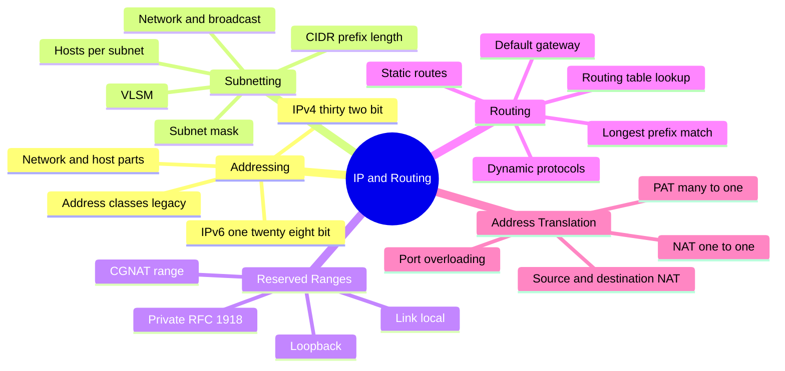
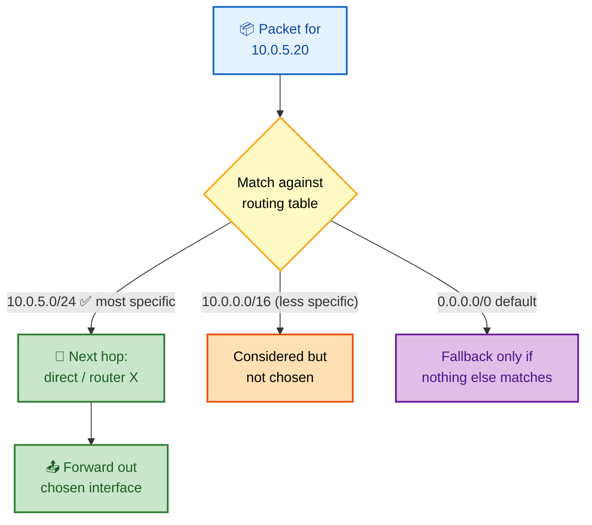
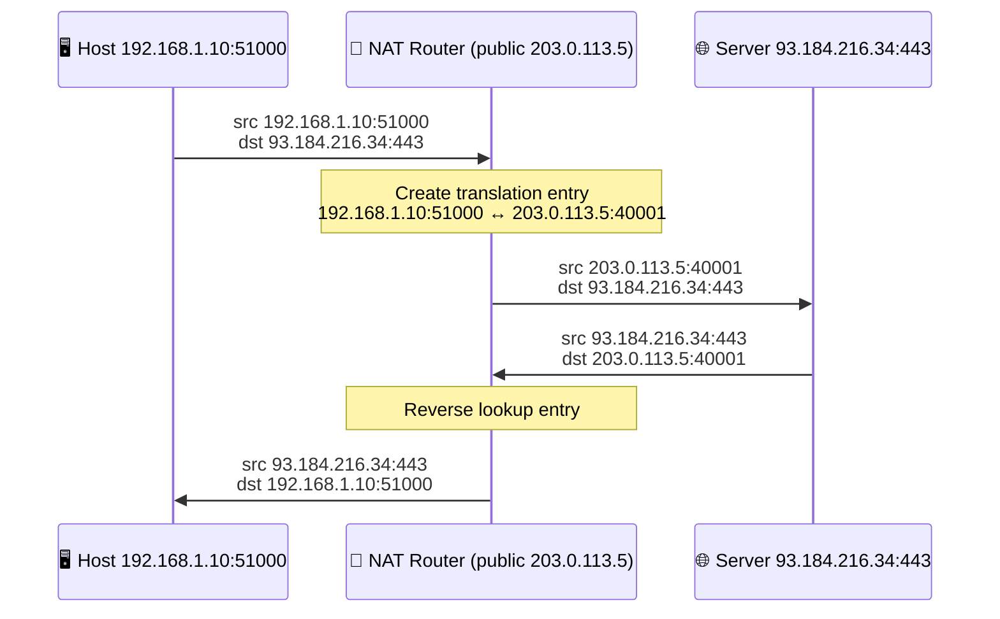
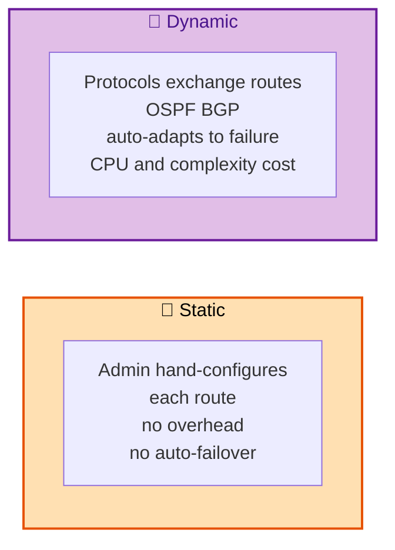

# SECTION 2: IP ADDRESSING & ROUTING

> **Scope:** IPv4 and IPv6 addressing, subnetting and CIDR math (drilled until instant), public vs
> private ranges, how routing tables make forwarding decisions, static vs dynamic routing, NAT/PAT,
> and the role of the default gateway.

---

## 🗺️ Visual Overview

**In one line:** An IP address plus a mask defines a *network* and its *hosts*; routing is the repeated
process of picking the most-specific matching route toward the destination — and subnetting math is the
single most-tested whiteboard skill in infrastructure interviews.

**Mind map — the whole section at a glance:**



**Routing decision — longest-prefix match picks the next hop:**



**Packet through NAT/PAT — private source rewritten to public:**



**Static vs dynamic routing — who maintains the table:**



> 🧠 **Memory hooks (mnemonics):**
> - **Private ranges (RFC 1918):** *"10-172-192"* → `10.0.0.0/8`, `172.16.0.0/12`, `192.168.0.0/16`.
>   The 172 one is the tricky middle (16–31 only).
> - **Prefix → hosts:** hosts = `2^(32 − prefix) − 2`. The **−2** = network address + broadcast.
> - **/24 = 256, /25 = 128, /26 = 64, /27 = 32, /28 = 16…** each extra bit *halves* the block.
> - **Longest prefix wins:** the router always picks the **most specific** (largest prefix number)
>   matching route; `0.0.0.0/0` (default) is the *least* specific, the last resort.
> - **NAT vs PAT:** NAT maps **I**P↔IP; PAT adds **P**orts to multiplex many hosts behind one IP
>   ("P for Port, P for many-to-one").

---

## 1. IPv4 Addressing Fundamentals

> 🎯 **Interview weight: High** — the foundation everything else in this section builds on.

**In one line:** An IPv4 address is **32 bits** (four 8-bit octets), split by a **subnet mask** into a
**network portion** (identifies the subnet) and a **host portion** (identifies the device within it).

- Written as dotted decimal: `192.168.1.10`. Each octet is 0–255 (8 bits).
- The **subnet mask** (`255.255.255.0`) or **CIDR prefix** (`/24`) marks how many leading bits are the
  network. `/24` = first 24 bits network, last 8 bits host.
- **Address classes (legacy):** Class A `/8`, Class B `/16`, Class C `/24` — obsolete since CIDR
  (1993) but still referenced. Modern networking is **classless**: any prefix length is valid.

**Two reserved addresses in every subnet:**

| Address | Which one | Usable by a host? |
|---|---|---|
| **Network address** | All host bits = 0 (e.g., `192.168.1.0`) | No — identifies the subnet |
| **Broadcast address** | All host bits = 1 (e.g., `192.168.1.255`) | No — reaches all hosts |

That's why usable hosts = `2^(host bits) − 2`.

## 2. Subnetting & CIDR — The Math

> 🎯 **Interview weight: Very High** — the classic whiteboard exercise. Drill until it's reflexive.

**In one line:** Subnetting borrows host bits to create more, smaller networks; CIDR notation (`/n`)
states how many bits are network, and from that you can compute block size, host count, network, and
broadcast in seconds.

**The prefix ↔ hosts table (memorize the common ones):**

| CIDR | Mask | Block size (addresses) | Usable hosts | Common use |
|---|---|---|---|---|
| /8 | 255.0.0.0 | 16,777,216 | 16,777,214 | Huge private (10.0.0.0/8) |
| /16 | 255.255.0.0 | 65,536 | 65,534 | Large VPC |
| /24 | 255.255.255.0 | 256 | 254 | Standard subnet |
| /25 | 255.255.255.128 | 128 | 126 | Half a /24 |
| /26 | 255.255.255.192 | 64 | 62 | Quarter |
| /27 | 255.255.255.224 | 32 | 30 | Small subnet |
| /28 | 255.255.255.240 | 16 | 14 | Tiny subnet |
| /30 | 255.255.255.252 | 4 | 2 | Point-to-point link |
| /31 | 255.255.255.254 | 2 | 2 | P2P (RFC 3021, no net/bcast) |
| /32 | 255.255.255.255 | 1 | 1 | Single host / loopback |

**The 4-step method to subnet any address — worked example: `192.168.1.100/26`**

1. **Block size** = `256 − (mask octet)`. The /26 mask is `255.255.255.192`; the interesting octet is
   **192**, so block size = `256 − 192 = 64`.
2. **Which subnet?** Subnets start at multiples of the block size in the interesting octet: `.0`,
   `.64`, `.128`, `.192`. `.100` falls in the **`.64`** block → **network = `192.168.1.64`**.
3. **Broadcast** = next network − 1 = `192.168.1.128 − 1` = **`192.168.1.127`**.
4. **Usable range** = network+1 → broadcast−1 = **`.65` to `.126`** (62 hosts).

> 💡 **The "magic number" trick:** the block size (64 here) *is* the magic number. Networks are its
> multiples; broadcast is one below the next multiple. That's the whole game — do it for the octet
> where the mask isn't 0 or 255.

**VLSM (Variable Length Subnet Masking):** carve one block into *different-sized* subnets to match
need. Given `10.0.0.0/24`, you might allocate a `/25` (126 hosts), then a `/26` (62), then a `/27`
(30) — always place the *largest* subnet first to avoid overlap. This is exactly how cloud VPC subnets
are planned.

> ⚠️ **Classic trap:** `/30` gives **2 usable hosts** (4 total − network − broadcast), the standard for
> router-to-router links. `/31` (RFC 3021) gives **2 usable** with no network/broadcast, saving
> addresses on point-to-point links.

## 3. Public vs Private Addressing

> 🎯 **Interview weight: Medium-High** — the why-behind-NAT and cloud-IP-design question.

**In one line:** **Private ranges (RFC 1918)** are non-routable on the public Internet and reused by
everyone behind NAT; **public** addresses are globally unique and Internet-routable.

| Range | CIDR | Size | Typical use |
|---|---|---|---|
| `10.0.0.0` – `10.255.255.255` | `10.0.0.0/8` | 16.7M | Large enterprise / VPC |
| `172.16.0.0` – `172.31.255.255` | `172.16.0.0/12` | 1M | Medium networks (Docker default) |
| `192.168.0.0` – `192.168.255.255` | `192.168.0.0/16` | 65K | Home/SOHO |

**Other reserved ranges worth knowing:**

| Range | Purpose |
|---|---|
| `127.0.0.0/8` | Loopback (`127.0.0.1` = localhost) |
| `169.254.0.0/16` | Link-local / APIPA (also cloud metadata `169.254.169.254`) |
| `100.64.0.0/10` | CGNAT (carrier-grade NAT, RFC 6598) |
| `224.0.0.0/4` | Multicast |

> 🔍 **Cloud tie-in:** a VPC/VNet CIDR (e.g., `10.0.0.0/16`) is carved into subnets (`10.0.1.0/24`
> public, `10.0.2.0/24` private). Instances get private IPs; a NAT Gateway/Instance gives private
> subnets outbound Internet without inbound exposure. The metadata endpoint `169.254.169.254` is the
> link-local reserved range — same concept as APIPA.

## 4. IPv6 Essentials

> 🎯 **Interview weight: Medium** — expect the "why IPv6 and how is it different" question.

**In one line:** IPv6 is a **128-bit** address space (vs 32-bit IPv4) that eliminates address
exhaustion and NAT-by-necessity, with built-in autoconfiguration and no broadcast.

- Written as 8 groups of 4 hex digits: `2001:0db8:85a3:0000:0000:8a2e:0370:7334`.
- **Shortening rules:** drop leading zeros per group; replace one run of all-zero groups with `::`
  (once only) → `2001:db8:85a3::8a2e:370:7334`.
- **No ARP** — uses **NDP** (Neighbor Discovery) over ICMPv6 multicast.
- **No broadcast** — replaced by multicast (`ff02::1` = all nodes).
- **SLAAC** (Stateless Address Autoconfiguration): a host can self-assign an address from the router's
  advertised prefix — no DHCP required.

| Feature | IPv4 | IPv6 |
|---|---|---|
| Size | 32-bit (~4.3B) | 128-bit (~3.4×10³⁸) |
| Notation | Dotted decimal | Colon hex |
| Address resolution | ARP (broadcast) | NDP (multicast) |
| Autoconfig | DHCP | SLAAC or DHCPv6 |
| NAT | Common (scarcity) | Rare (abundance) |
| Header | Variable, checksummed | Fixed 40B, no checksum |

> 💡 **Loopback:** IPv6 loopback is `::1` (the shortened `0:0:0:0:0:0:0:1`), the analog of `127.0.0.1`.

## 5. Routing Tables & Longest-Prefix Match

> 🎯 **Interview weight: High** — how a host/router actually decides where to send a packet.

**In one line:** Every forwarding decision is a **longest-prefix match** — the router picks the *most
specific* (highest prefix length) route that contains the destination IP, falling back to the default
route only when nothing else matches.

A routing table entry maps a **destination network** → **next hop / interface**. Reading one:

```
# Linux: view the routing table
ip route show
# default via 10.0.0.1 dev eth0            <- 0.0.0.0/0, the default gateway
# 10.0.0.0/24 dev eth0 proto kernel scope link src 10.0.0.15   <- directly connected
# 10.0.5.0/24 via 10.0.0.1 dev eth0        <- reachable via a router
```

**The decision algorithm:**

1. Compare the destination IP against every route's network/prefix.
2. Keep all that match (the destination falls within the CIDR block).
3. Choose the one with the **longest prefix** (most specific). `10.0.5.0/24` beats `10.0.0.0/16` beats
   `0.0.0.0/0`.
4. Forward to that entry's next hop out its interface.

> 🔍 **Directly connected vs via-gateway:** if the destination is on a *directly connected* subnet, the
> host ARPs for it and delivers on the link. Otherwise it sends to the **next-hop router**'s MAC. The
> default route (`0.0.0.0/0`) is the catch-all next hop — the **default gateway**.

> 💡 **Trace it live:** `ip route get 10.0.5.20` shows exactly which route and next hop the kernel would
> choose for a given destination — invaluable for debugging.

## 6. Static vs Dynamic Routing

> 🎯 **Interview weight: Medium** — the trade-off and where each belongs.

**In one line:** **Static** routes are hand-configured and never change on their own; **dynamic**
routing protocols let routers advertise and learn routes automatically, adapting to failures.

| | Static | Dynamic |
|---|---|---|
| Configured by | Admin, manually | Protocol auto-discovery |
| Adapts to link failure | No | Yes (reconverges) |
| Overhead | None | CPU, bandwidth, complexity |
| Scales | Small/stable networks | Large/changing networks |
| Examples | `ip route add` | OSPF, BGP, EIGRP, RIP |

**Key dynamic protocols:**

- **OSPF** (Open Shortest Path First) — **link-state**, intra-domain (within one org). Each router
  builds a full map and runs Dijkstra's shortest-path. Fast convergence.
- **BGP** (Border Gateway Protocol) — **path-vector**, the routing protocol *of the Internet*, between
  autonomous systems (ASes). Policy-driven, not shortest-path. It's what makes anycast and global
  routing work.

> 🔍 **Why BGP matters for cloud/DevOps:** BGP outages (a bad route advertisement) have taken down major
> providers globally. Anycast (Section 4) relies on BGP advertising the same prefix from many
> locations. Cloud "direct connect / ExpressRoute" links use BGP to exchange routes with your VPC.

## 7. NAT & PAT

> 🎯 **Interview weight: High** — the mechanism behind private-network Internet access and a favorite
> conceptual question.

**In one line:** **NAT** rewrites IP addresses at a boundary router so private hosts can share public
IPs; **PAT** (a.k.a. NAT overload) adds **port** translation so *many* hosts multiplex behind **one**
public IP.

**Types:**

| Type | Mapping | Use |
|---|---|---|
| **Static NAT** | One private ↔ one public (1:1) | Expose a specific server |
| **Dynamic NAT** | Private ↔ public from a pool | Share a pool of public IPs |
| **PAT / NAT overload** | Many private ↔ one public + unique ports | Home routers, cloud NAT GW |

**How PAT works (see the sequence diagram):** the NAT device keeps a **translation table** keyed by
`(inside IP:port ↔ outside IP:port)`. Outbound, it rewrites the source to `publicIP:newPort` and
records the mapping; inbound replies are reverse-translated by matching the port. Thousands of hosts
share one IP because the *port* disambiguates each flow.

- **Source NAT (SNAT)** — rewrite the *source* (outbound; the home-router case).
- **Destination NAT (DNAT)** — rewrite the *destination* (inbound; port-forwarding, load balancers).

> ⚠️ **NAT trade-offs:** breaks true end-to-end connectivity, complicates inbound connections (hence
> port-forwarding, hole-punching, STUN/TURN for VoIP/WebRTC), and depends on connection-tracking state
> (table exhaustion drops new connections). It also conserves IPv4 — one reason IPv4 survived past
> exhaustion.

> 🔍 **Kubernetes tie-in:** `kube-proxy` in iptables/IPVS mode programs DNAT rules so a single Service
> ClusterIP load-balances across pod IPs, and SNAT/masquerade for pod→external traffic — NAT concepts
> applied at cluster scale.

## 8. The Default Gateway

> 🎯 **Interview weight: Medium** — the "how do I leave my subnet" answer.

**In one line:** The **default gateway** is the router a host sends any packet to when the destination
is *not* on its local subnet — the `0.0.0.0/0` next hop.

- A host compares `dest IP AND mask` to its own network. If different subnet → send to the default
  gateway's MAC (ARP for the gateway, not the destination).
- Misconfigured or missing gateway = "can reach local hosts, can't reach the Internet" — a textbook
  symptom.

> 💡 **Debug:** `ip route | grep default` shows your gateway. No default route = no off-subnet
> connectivity, even if DNS and the link are fine.

---

## Interview Questions & Answers

**Q1: Subnet `172.16.32.100/20` — give the network, broadcast, and usable host range.**

**Crisp answer:** Network `172.16.32.0`, broadcast `172.16.47.255`, usable `172.16.32.1`–
`172.16.47.254` (4094 hosts).

**Internals:** /20 mask = `255.255.240.0`; interesting octet is the 3rd, mask 240 → block size
`256 − 240 = 16`. Multiples of 16: …16, **32**, 48… `.32.x` falls in the `.32` block → network
`172.16.32.0`. Next block starts at `.48.0`, so broadcast = `172.16.47.255`. Hosts =
`2^(32−20) − 2 = 4096 − 2 = 4094`.

**Follow-up — how many /24s fit in a /20?** `2^(24−20) = 16` subnets.

---

**Q2: Explain longest-prefix match. Given routes `0.0.0.0/0`, `10.0.0.0/16`, and `10.0.5.0/24`, where
does a packet for `10.0.5.20` go?**

**Crisp answer:** It matches all three, but the router picks the **most specific** — `10.0.5.0/24` — and
forwards to that route's next hop.

**Internals:** Routing is not first-match; it's *best (longest) match*. `/24` (24 network bits) is more
specific than `/16`, which is more specific than the `/0` default. The default is the fallback only
when nothing more specific matches.

**Follow-up — why does the default route exist at all?** So a host needs only *one* off-subnet route
instead of a table of every remote network — everything unknown goes to the gateway.

---

**Q3: How does PAT let 200 devices share one public IP? What's the state it must keep?**

**Crisp answer:** PAT rewrites each outbound flow's source to the single public IP but assigns a
**unique source port** per flow, storing `(inside IP:port ↔ public IP:port)` in a translation table so
replies can be reverse-mapped.

**Internals:** The 4-tuple + the unique translated port disambiguates flows even to the same
destination. ~64K ports per public IP per destination bound the concurrent connections; carrier-grade
NAT pools multiple public IPs.

**Follow-up — failure mode?** Translation/conntrack table exhaustion under high connection churn →
new connections silently dropped until entries age out.

---

**Q4: Why was CIDR introduced, and what problem did classful addressing cause?**

**Crisp answer:** Classful addressing (A/B/C) wasted huge blocks — a org needing 300 hosts had to take a
whole Class B (65K) because a Class C (254) was too small. **CIDR** allows arbitrary prefix lengths
(e.g., `/23` for ~500 hosts) and **route aggregation** (supernetting), slowing IPv4 exhaustion and
shrinking global routing tables.

**Internals:** CIDR decouples the prefix from the address's first bits; `/n` can be anything. Aggregation
lets one advertised `/16` summarize 256 `/24`s, keeping BGP tables manageable.

**Follow-up — what's supernetting?** Combining contiguous smaller blocks into one larger prefix for
advertisement — the inverse of subnetting.

---

**Q5: A host can ping others in its subnet but nothing outside it. What's wrong?**

**Crisp answer:** The **default gateway** is missing or wrong — local delivery (same-subnet ARP) works,
but there's no route for off-subnet traffic.

**Internals:** Same-subnet packets never need the gateway (direct ARP + deliver). Off-subnet packets
require the `0.0.0.0/0` next hop; without it the host has nowhere to send them. Check
`ip route | grep default` and gateway reachability (`ping <gw>`).

**Follow-up — pings local *and* gateway but still no Internet?** Now suspect the gateway's own upstream
route, NAT, or DNS — walk further up the path.

---

## Troubleshooting Scenarios

**Scenario 1 — "New subnet can't reach an existing one within the same VPC."**
- **Symptom:** Instances in `10.0.5.0/24` can't reach `10.0.6.0/24`.
- **Investigation:** Check route tables for a route between the subnets; check security groups/NACLs;
  `ip route get <target>`.
- **Root cause:** Missing route-table entry, or an overlapping/mis-sized CIDR so the target looks
  local and is never routed.
- **Fix:** Add the correct route; ensure non-overlapping, correctly-sized CIDRs.

**Scenario 2 — "Intermittent 'connection refused' only under high load from behind NAT."**
- **Symptom:** Under heavy outbound concurrency, new connections fail sporadically.
- **Investigation:** Check NAT/conntrack table usage (`conntrack -C`, `nf_conntrack_count` vs `_max`);
  watch for `table full` in kernel logs.
- **Root cause:** Port/conntrack exhaustion on the NAT device (too many concurrent flows for one public
  IP).
- **Fix:** Add public IPs to the NAT pool, raise `nf_conntrack_max`, lower idle timeouts, or reduce
  connection churn (connection pooling).

**Scenario 3 — "Two networks can't route to each other after a merge."**
- **Symptom:** Sites A and B both use `192.168.1.0/24`; routing between them fails.
- **Investigation:** Compare subnet CIDRs on both sides.
- **Root cause:** **Overlapping CIDRs** — the router can't distinguish which side `192.168.1.10` is on.
- **Fix:** Re-IP one side, or deploy NAT between them (double-NAT) as a stopgap.

---

## Documentation Links

| Topic | Link |
|---|---|
| CIDR / classless routing (RFC 4632) | https://www.rfc-editor.org/rfc/rfc4632 |
| Private address space (RFC 1918) | https://www.rfc-editor.org/rfc/rfc1918 |
| IPv6 addressing (RFC 4291) | https://www.rfc-editor.org/rfc/rfc4291 |
| NAT terminology (RFC 2663) | https://www.rfc-editor.org/rfc/rfc2663 |
| BGP (RFC 4271) | https://www.rfc-editor.org/rfc/rfc4271 |
| Subnet calculator | https://www.subnet-calculator.com/ |

---

*Continue to [03-TRANSPORT.md](03-TRANSPORT.md) for Section 3 (Transport Layer — TCP/UDP).*
