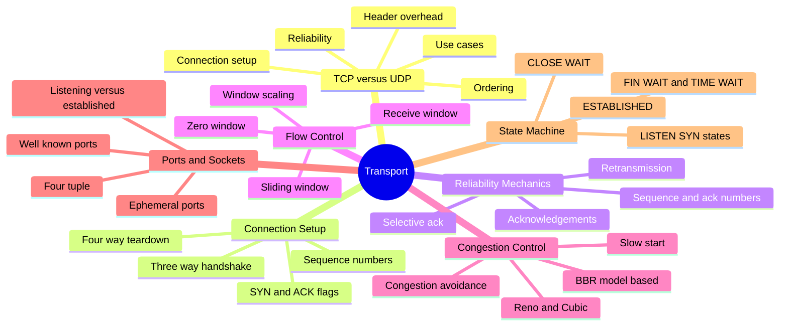
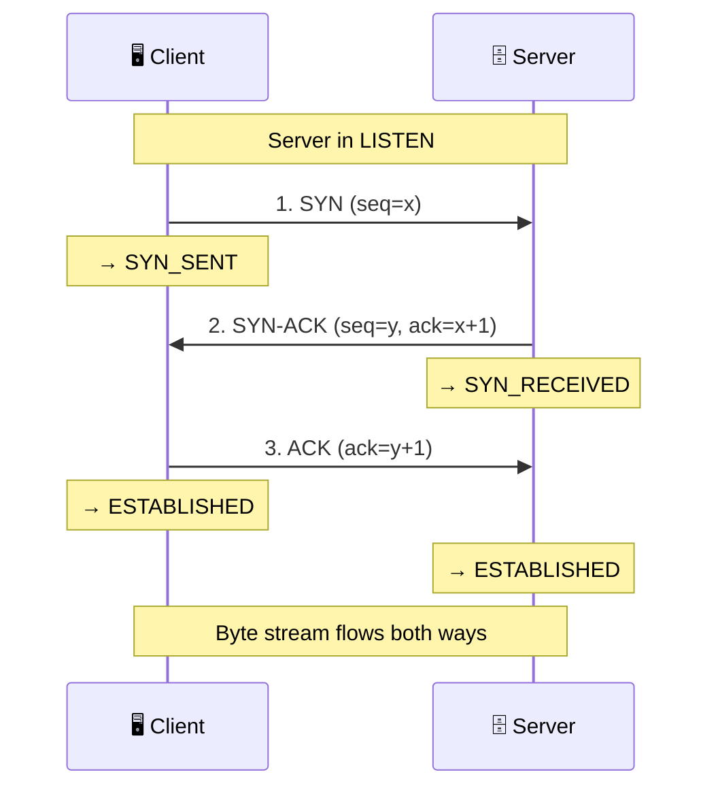
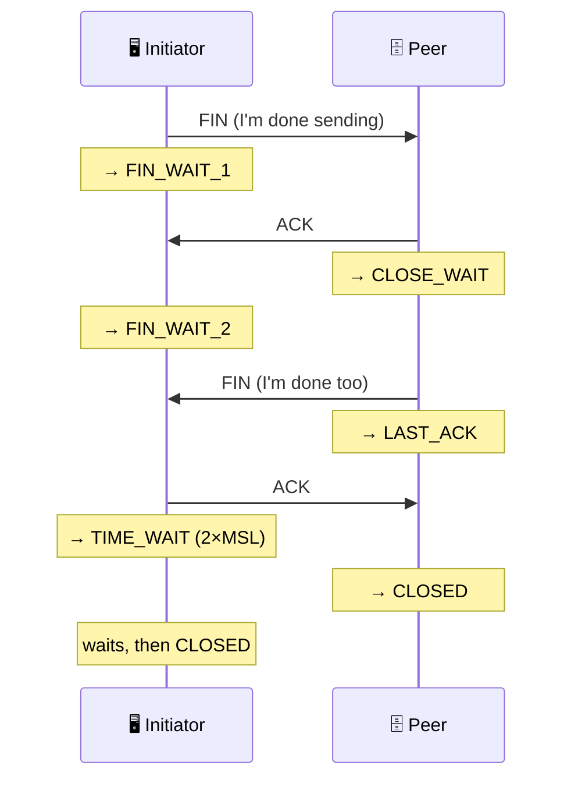
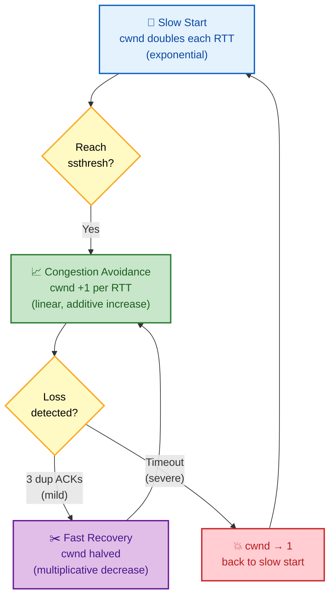

# SECTION 3: TRANSPORT LAYER (TCP/UDP)

> **Scope:** TCP vs UDP trade-offs, the 3-way handshake and 4-way teardown, flow control and the
> sliding window, congestion control, ports and sockets, and the full TCP state machine — the densest
> and highest-value internals in the whole networking interview.

---

## 🗺️ Visual Overview

**In one line:** TCP turns the unreliable, unordered packet layer into a reliable, ordered, flow- and
congestion-controlled byte stream; UDP does almost none of that and trades reliability for speed — and
understanding *how TCP achieves reliability* is the single richest seam of senior networking questions.

**Mind map — the whole section at a glance:**



**TCP 3-way handshake — establishing a connection (colorful sequence):**



**TCP 4-way teardown & TIME_WAIT — graceful close:**



**Congestion control — slow start into congestion avoidance:**



> 🧠 **Memory hooks (mnemonics):**
> - **Handshake:** *"SYN, SYN-ACK, ACK"* — client knocks, server answers-and-knocks, client confirms.
> - **Teardown:** *"FIN, ACK, FIN, ACK"* — four messages because each direction closes independently.
> - **TCP guarantees:** *"ROC"* → **R**eliable (ACK+retransmit), **O**rdered (sequence numbers),
>   **C**ongestion/flow-controlled. UDP has *none* of these.
> - **AIMD:** **A**dditive **I**ncrease (probe up slowly, +1/RTT), **M**ultiplicative **D**ecrease
>   (back off hard on loss, ÷2). "Gentle up, sharp down."
> - **TIME_WAIT is on the side that closed first** (sent the first FIN) — remember "**closer waits**."

---

## 1. TCP vs UDP

> 🎯 **Interview weight: Very High** — the opening question of nearly every transport discussion.

**In one line:** TCP is a **connection-oriented, reliable, ordered** byte stream; UDP is a
**connectionless, best-effort** datagram service — you pick based on whether losing/ reordering a packet
is acceptable.

| Property | TCP | UDP |
|---|---|---|
| Connection | Yes (handshake) | No |
| Reliability | Guaranteed (ACK + retransmit) | None — fire and forget |
| Ordering | In-order (sequence numbers) | No ordering |
| Flow control | Yes (window) | No |
| Congestion control | Yes | No |
| Header size | 20–60 bytes | **8 bytes** |
| Speed/overhead | Higher latency, more overhead | Minimal overhead, low latency |
| Use cases | HTTP, SSH, DB, email | DNS, VoIP, video, gaming, QUIC |

**When to pick UDP:** when timeliness beats completeness — a dropped video frame or VoIP packet is
better skipped than retransmitted late. Also when the app builds its *own* reliability (QUIC/HTTP/3
runs reliability atop UDP; see Section 5).

> 💡 **The "DNS uses UDP" nuance:** DNS uses UDP for small queries (one packet, retry if lost — cheaper
> than a handshake) but **falls back to TCP** for large responses (>512 bytes, or zone transfers). A
> great follow-up trap.

> ⚠️ **"Reliable" ≠ "secure" ≠ "fast":** TCP guarantees delivery and order, *not* encryption (that's
> TLS) and *not* low latency (head-of-line blocking can make it slower than UDP under loss).

## 2. Ports & Sockets

> 🎯 **Interview weight: High** — the addressing that makes multiplexing possible.

**In one line:** A **port** identifies which application/socket on a host; a **socket** is one endpoint
`(IP, port)`, and a TCP connection is uniquely identified by the **4-tuple**
`(src IP, src port, dst IP, dst port)`.

- **Well-known ports** (0–1023): 22 SSH, 53 DNS, 80 HTTP, 443 HTTPS, 25 SMTP. Require privilege to bind.
- **Registered ports** (1024–49151): app-assigned (3306 MySQL, 6379 Redis).
- **Ephemeral ports** (49152–65535, Linux often 32768+): the OS assigns these as the *source* port for
  outbound client connections.

**The 4-tuple is why multiplexing works:** a server on `:443` handles thousands of clients because each
connection differs in `(clientIP, clientPort)`. Two connections from the same client to the same server
differ in *client port*. This is the uniqueness the kernel uses to demultiplex incoming segments to the
right socket.

```
ss -tanp                 # all TCP sockets: state, local/peer 4-tuple, owning process
ss -ltn                  # listening TCP sockets only
ss -s                    # summary counts by state
```

> 🔍 **Listening vs established sockets:** a listening socket is `(*, 443, *, *)` — bound but not yet
> connected. Each accepted connection spawns an *established* socket with the full 4-tuple filled in.
> One listener → many established sockets.

## 3. The 3-Way Handshake

> 🎯 **Interview weight: Very High** — the canonical "explain TCP setup" question.

**In one line:** Before any data, client and server exchange **SYN → SYN-ACK → ACK** to synchronize
**initial sequence numbers** and confirm both directions work.

1. **SYN:** client picks a random **ISN** (initial sequence number) `x`, sends `SYN(seq=x)`.
   Client → `SYN_SENT`.
2. **SYN-ACK:** server picks its own ISN `y`, acknowledges the client's (`ack=x+1`), sends
   `SYN-ACK(seq=y, ack=x+1)`. Server → `SYN_RECEIVED`.
3. **ACK:** client acknowledges the server's ISN (`ack=y+1`). Client → `ESTABLISHED`; on receipt
   server → `ESTABLISHED`.

**Why three messages and not two?** Both sides must prove they can send *and* receive. The SYN-ACK
combines the server's SYN (prove it can send) with its ACK (prove it received the client's SYN). The
final ACK proves the client received the server's SYN. Two messages can't confirm both directions.

**Why random ISNs?** Security (harder to spoof/inject into a connection) and to avoid confusing delayed
segments from a previous connection on the same 4-tuple.

> ⚠️ **SYN flood attack:** an attacker sends many SYNs without the final ACK, filling the **SYN
> backlog** (half-open connections) so legitimate clients can't connect. Defense: **SYN cookies** —
> the server encodes connection state in the ISN instead of allocating a backlog slot, so no state is
> held until the final ACK arrives.

## 4. Connection Teardown & TIME_WAIT

> 🎯 **Interview weight: High** — TIME_WAIT is a favorite "why do I see thousands of these" question.

**In one line:** TCP closes with a **4-way** exchange (each direction FINs independently), and the side
that closed first sits in **TIME_WAIT** for 2×MSL to absorb stray packets and guarantee a clean close.

1. **FIN** (initiator done sending) → `FIN_WAIT_1`.
2. **ACK** from peer → initiator `FIN_WAIT_2`; peer → `CLOSE_WAIT`.
3. **FIN** from peer (it's done too) → peer `LAST_ACK`.
4. **ACK** from initiator → peer `CLOSED`; initiator → **`TIME_WAIT`** (waits **2×MSL**, ~60s on
   Linux) → `CLOSED`.

**Why TIME_WAIT exists (two reasons):**
- **Absorb delayed duplicates:** any straggler segment from this connection dies before the same
  4-tuple can be reused, preventing it from corrupting a *new* connection.
- **Guarantee the final ACK arrives:** if the peer's last FIN is retransmitted (its ACK was lost),
  TIME_WAIT lets the initiator re-ACK it instead of replying `RST`.

> ⚠️ **Production reality:** a busy client/proxy making many short outbound connections piles up
> thousands of TIME_WAIT sockets (it's the *active closer*). This can exhaust ephemeral ports. Fixes:
> **connection reuse/keep-alive** (the real fix), `net.ipv4.tcp_tw_reuse=1` (safe reuse for outbound),
> or more ephemeral ports. **Never** rely on the deprecated `tcp_tw_recycle` (broke NAT).

> 🔍 **CLOSE_WAIT piling up means a bug:** it's the *other* side's FIN waiting for *your* app to call
> `close()`. Thousands of CLOSE_WAIT sockets = the application isn't closing sockets (a file-descriptor
> leak), not a network problem.

## 5. Reliability: Sequence Numbers, ACKs, Retransmission

> 🎯 **Interview weight: High** — the mechanics that make TCP "reliable."

**In one line:** Every byte has a **sequence number**; the receiver **ACKs** the next byte it expects,
and the sender **retransmits** anything not ACKed within the retransmission timeout or after duplicate
ACKs.

- **Sequence number** = byte offset in the stream. **ACK number** = next expected byte (cumulative:
  "I have everything up to here").
- **Retransmission triggers:**
  - **RTO (Retransmission Timeout):** no ACK within the timeout (derived from smoothed RTT) → resend.
  - **Fast retransmit:** **3 duplicate ACKs** signal a gap → resend the missing segment immediately
    without waiting for RTO.
- **SACK (Selective ACK):** lets the receiver acknowledge non-contiguous blocks so the sender
  retransmits *only* the missing piece, not everything after the gap.

> 🔍 **Head-of-line blocking:** because TCP delivers in order, one lost segment stalls *all* later
> (already-received) data until the gap is filled. This is a fundamental TCP limitation that **HTTP/3
> over QUIC** was designed to escape (Section 5).

## 6. Flow Control — The Sliding Window

> 🎯 **Interview weight: High** — often confused with congestion control; know the difference.

**In one line:** **Flow control** stops a fast sender from overwhelming a slow *receiver*, using the
**receive window (rwnd)** the receiver advertises in every ACK.

- The receiver advertises `rwnd` = free space in its receive buffer. The sender may have at most `rwnd`
  bytes unacknowledged **in flight**.
- As the app drains the buffer, `rwnd` grows; if the buffer fills, the receiver advertises **zero
  window**, pausing the sender (which probes periodically with window-probe segments).
- **Window scaling** (a TCP option) multiplies the 16-bit window field (max 64KB) by a shift factor,
  essential for high-bandwidth × high-latency ("long fat") networks where 64KB is far too small.

> 💡 **Flow control vs congestion control — the crucial distinction:** flow control protects the
> **receiver** (rwnd). Congestion control protects the **network** (cwnd). The sender can send at most
> **min(rwnd, cwnd)** — whichever bottleneck is tighter wins.

## 7. Congestion Control

> 🎯 **Interview weight: High** — the "how does TCP avoid collapsing the network" deep dive.

**In one line:** Congestion control keeps the *network* from overloading by maintaining a **congestion
window (cwnd)** that grows while things are healthy and shrinks sharply on loss — classic **AIMD**.

**The phases (see the diagram):**

- **Slow start:** cwnd starts tiny (~10 segments) and **doubles every RTT** (exponential) until it
  hits `ssthresh` — fast ramp to find capacity.
- **Congestion avoidance:** past `ssthresh`, cwnd grows **linearly** (+1 MSS/RTT) — gentle probing.
- **On 3 duplicate ACKs (mild loss):** **fast retransmit + fast recovery** — halve cwnd, keep going.
- **On timeout (severe loss):** cwnd collapses to 1, back to slow start.

**Algorithms:**

| Algorithm | Signal | Notes |
|---|---|---|
| **Reno / NewReno** | Loss | Classic AIMD |
| **CUBIC** | Loss | Linux default; cubic growth, better on high-BDP links |
| **BBR** | Bandwidth + RTT (model) | Google; probes actual throughput/latency, not loss — great on lossy/wireless links |

> 🔍 **Why BBR is a big deal:** loss-based algorithms mistake *random* (non-congestion) loss on
> wireless/lossy links for congestion and needlessly slow down. **BBR** models the bottleneck bandwidth
> and RTT directly, so it sustains throughput where CUBIC would crater — widely deployed at Google/CDNs.

> ⚠️ **Bufferbloat:** oversized router buffers hide loss, so loss-based control keeps filling them,
> inflating latency massively. BBR and AQM (fq_codel) target this.

## 8. The TCP State Machine

> 🎯 **Interview weight: High** — reading `ss`/`netstat` states is a real debugging skill.

**In one line:** A TCP connection moves through a well-defined set of states from `LISTEN`/`SYN_SENT`
through `ESTABLISHED` to the teardown states — and the state you see in `ss` tells you exactly where a
stuck connection is.

| State | Meaning | What it tells you |
|---|---|---|
| `LISTEN` | Waiting for connections | A server socket is up |
| `SYN_SENT` | Sent SYN, awaiting SYN-ACK | Client waiting — firewall/unreachable if stuck |
| `SYN_RECV` | Got SYN, sent SYN-ACK | Half-open; piles up under SYN flood |
| `ESTABLISHED` | Connection open | Normal, active |
| `FIN_WAIT_1/2` | Sent FIN, closing | We initiated close |
| `CLOSE_WAIT` | Peer closed, we haven't | **App bug** if many — not calling `close()` |
| `LAST_ACK` | We sent final FIN | Awaiting last ACK |
| `TIME_WAIT` | Active closer waiting 2×MSL | Normal; huge counts = many short conns |
| `CLOSED` | Fully torn down | Gone |

> 💡 **Fast reads:** many `SYN_SENT` from a client = it can't reach the server (firewall/port closed).
> Many `CLOSE_WAIT` on a server = your code is leaking sockets. Many `TIME_WAIT` on a client = you're
> not reusing connections.

---

## Interview Questions & Answers

**Q1: Walk through the 3-way handshake and explain why three messages are required.**

**Crisp answer:** `SYN(seq=x)` → `SYN-ACK(seq=y, ack=x+1)` → `ACK(ack=y+1)`. Three are needed so both
sides confirm they can *both* send and receive; the server's SYN-ACK fuses its own SYN with the ACK of
the client's, and the client's final ACK confirms the server's SYN.

**Internals:** Each side synchronizes a random ISN. Two messages would leave one direction unconfirmed.
The random ISN prevents spoofing and stale-segment confusion.

**Follow-up — SYN flood?** Half-open `SYN_RECV` entries exhaust the backlog; **SYN cookies** encode
state in the ISN so no memory is held until the final ACK.

---

**Q2: What is TIME_WAIT, which side enters it, and why does it exist?**

**Crisp answer:** The side that **closes first** (sends the first FIN) enters TIME_WAIT for **2×MSL**.
It exists to (1) let delayed duplicate segments die before the 4-tuple is reused and (2) reliably ACK a
retransmitted final FIN.

**Internals:** Without it, a stray old segment could be accepted by a new connection on the same tuple,
or a lost final ACK would trigger a spurious RST. ~60s on Linux.

**Follow-up — thousands of TIME_WAIT on a load balancer?** It's the active closer on many short
connections; fix with keep-alive/connection reuse, `tcp_tw_reuse`, or more ephemeral ports — not
`tcp_tw_recycle` (deprecated, NAT-breaking).

---

**Q3: Distinguish flow control from congestion control.**

**Crisp answer:** Flow control protects the **receiver** via the advertised **receive window (rwnd)**;
congestion control protects the **network** via the **congestion window (cwnd)**. The sender is limited
by **min(rwnd, cwnd)**.

**Internals:** rwnd reflects receive-buffer space (zero window pauses the sender). cwnd follows AIMD —
grows on success, halves/collapses on loss. Different problems, different windows.

**Follow-up — long fat networks?** The 16-bit window maxes at 64KB; **window scaling** multiplies it so
high-BDP links can keep enough bytes in flight.

---

**Q4: I see thousands of CLOSE_WAIT sockets on my server. Network problem or app problem?**

**Crisp answer:** **App problem.** CLOSE_WAIT means the peer sent FIN and the kernel ACKed it, but your
application never called `close()` on the socket — a file-descriptor leak.

**Internals:** The connection is stuck waiting for the local app to close. It won't clear on its own;
eventually you hit the fd limit and `accept()` fails with "too many open files."

**Follow-up — how to find the leak?** `ss -tanp state close-wait` shows the owning process; audit code
paths that open sockets without a matching close (missing `finally`/`defer`/context-manager).

---

**Q5: How does TCP detect and recover from a single lost segment without waiting for a full timeout?**

**Crisp answer:** **Fast retransmit** — three duplicate ACKs (the receiver re-ACKing the same expected
byte because later segments arrived) signal a gap, so the sender resends the missing segment
immediately, then enters **fast recovery** (halve cwnd rather than collapse to 1).

**Internals:** Cumulative ACKs mean each out-of-order arrival re-triggers the same ACK number; 3 dups
is the heuristic for "lost, not merely reordered." **SACK** lets the sender resend *only* the gap.

**Follow-up — the downside of in-order delivery?** Head-of-line blocking: later data waits for the gap,
which HTTP/3/QUIC avoids with independent streams.

---

## Troubleshooting Scenarios

**Scenario 1 — "Connections to a service hang in SYN_SENT."**
- **Symptom:** Client `ss` shows `SYN_SENT`; no response.
- **Investigation:** `ss -tan | grep SYN-SENT`; test `nc -vz host port`; check firewall/security-group
  and whether the server is `LISTEN`ing.
- **Root cause:** SYNs dropped by a firewall (silent drop, not reject) or no listener on the port.
- **Fix:** Open the port/security group; confirm the service is bound and listening.

**Scenario 2 — "App throughput is capped far below link bandwidth on a high-latency link."**
- **Symptom:** Transfers plateau; bandwidth-delay product suggests much more is possible.
- **Investigation:** Check `rwnd`/window scaling (`ss -ti` shows `wscale`, `cwnd`, `rtt`); verify
  buffer sizes (`net.ipv4.tcp_rmem/wmem`).
- **Root cause:** Window too small for the BDP (scaling off or buffers too small) — not enough bytes in
  flight to fill the pipe.
- **Fix:** Enable window scaling, raise TCP buffer limits; consider BBR for lossy paths.

**Scenario 3 — "Client runs out of ephemeral ports under load."**
- **Symptom:** `cannot assign requested address`; thousands of TIME_WAIT.
- **Investigation:** `ss -s` (TIME_WAIT count), check ephemeral range `net.ipv4.ip_local_port_range`.
- **Root cause:** Many short-lived outbound connections, each leaving a TIME_WAIT, exhausting ports.
- **Fix:** Use HTTP keep-alive/connection pooling, enable `tcp_tw_reuse`, widen the ephemeral range.

---

## Documentation Links

| Topic | Link |
|---|---|
| TCP (RFC 9293, consolidated) | https://www.rfc-editor.org/rfc/rfc9293 |
| TCP congestion control (RFC 5681) | https://www.rfc-editor.org/rfc/rfc5681 |
| Selective ACK (RFC 2018) | https://www.rfc-editor.org/rfc/rfc2018 |
| TCP window scaling (RFC 7323) | https://www.rfc-editor.org/rfc/rfc7323 |
| BBR congestion control | https://queue.acm.org/detail.cfm?id=3022184 |
| `ss` socket statistics | https://man7.org/linux/man-pages/man8/ss.8.html |

---

*Continue to [04-DNS-DISCOVERY.md](04-DNS-DISCOVERY.md) for Section 4 (DNS & Service Discovery).*
