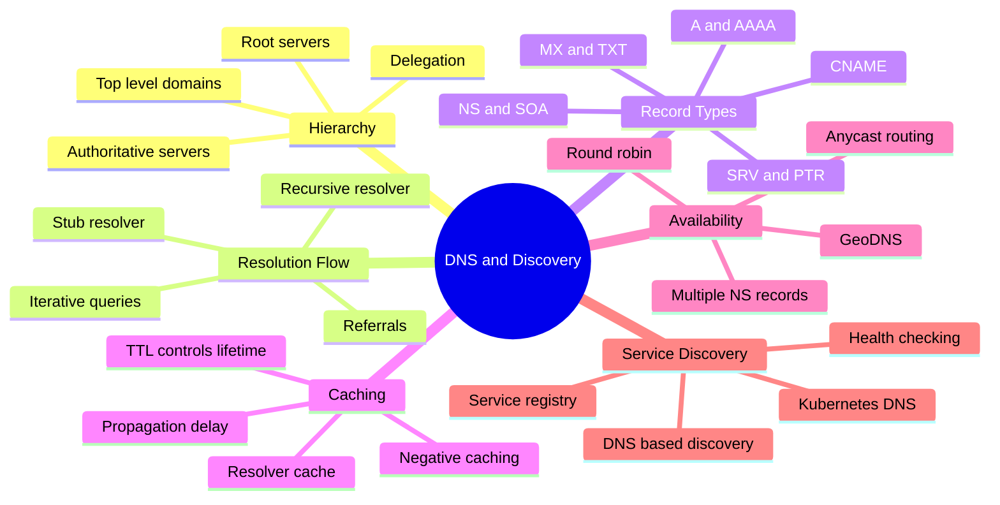
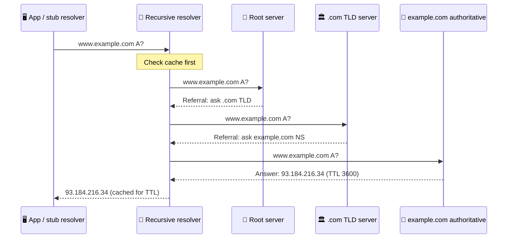
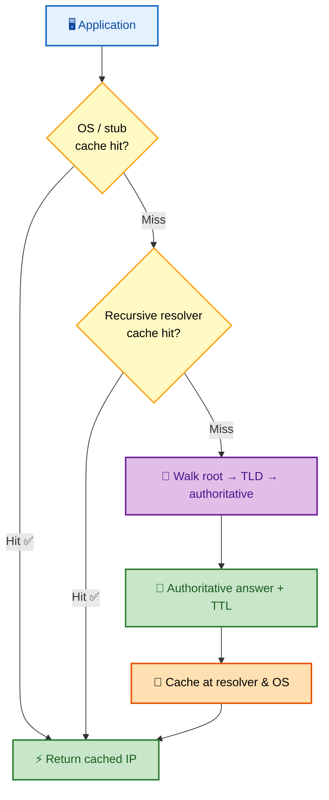
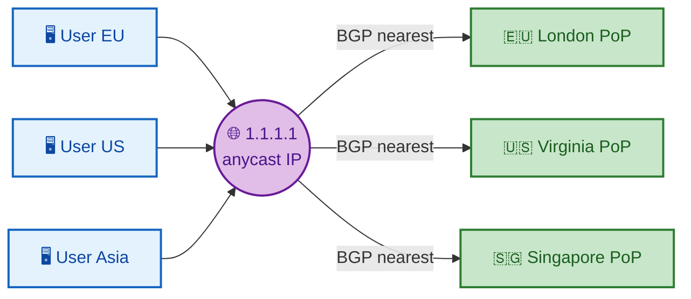

# SECTION 4: DNS & SERVICE DISCOVERY

> **Scope:** The DNS hierarchy, the recursive resolver flow end-to-end, record types, caching and TTL
> behavior, anycast, and the basics of service discovery — the machinery behind "why is the site
> down" and "why hasn't my DNS change propagated."

---

## 🗺️ Visual Overview

**In one line:** DNS is a globally distributed, cached, hierarchical database that turns human names
into IP addresses through a recursive walk from the root down — and its **caching/TTL** behavior is
behind half of all "it works for me but not for them" incidents.

**Mind map — the whole section at a glance:**

**Recursive DNS resolution — the full walk for `www.example.com`:**

**DNS query path & caching layers — where answers can come from:**

**Anycast — one IP, many locations, routed to the nearest:**

> 🧠 **Memory hooks (mnemonics):**
> - **Resolution order:** *"Root, TLD, Authoritative"* → top-down delegation, most-general to
>   most-specific.
> - **A vs CNAME:** **A** = **A**ddress (name→IP); **CNAME** = **C**anonical **NAME** (name→another
>   name, an alias).
> - **Recursive vs iterative:** the **recursive** resolver does the work *for* you; it makes
>   **iterative** queries to each server ("go ask them").
> - **TTL = cache lifetime.** Low TTL = fast changes, more query load. High TTL = less load, slower
>   propagation. "**Lower TTL before a migration.**"
> - **Anycast:** *"one IP, nearest instance"* — **BGP** picks the closest of many identical servers.

---

## 1. The DNS Hierarchy

> 🎯 **Interview weight: High** — the structural backbone every other DNS answer references.

**In one line:** DNS is an inverted tree — the **root** delegates to **TLDs** (`.com`, `.org`), which
delegate to **authoritative** servers for each domain, so no single server holds the whole database.

- **Root servers** (13 logical, `a`–`m`, massively anycasted): know where every **TLD** lives.
- **TLD servers** (`.com`, `.net`, country codes): know the **authoritative** name servers for each
  domain under them.
- **Authoritative servers:** hold the actual records (A/AAAA/MX/…) for a domain — the source of truth.
- **Delegation** via **NS records**: each level points down to the next by naming the child's
  authoritative servers. A domain is **"delegated"** when its parent's NS records point to it.

**Reading a name right-to-left:** `www.example.com.` → the trailing `.` is the root, then `.com` TLD,
then `example` domain, then `www` host. DNS walks this delegation top-down.

## 2. Recursive Resolution Flow

> 🎯 **Interview weight: Very High** — a core part of "what happens when you type a URL."

**In one line:** Your device asks a **recursive resolver**, which (on a cache miss) walks **root → TLD →
authoritative** with **iterative** queries, returns the answer, and caches it for the TTL.

**The two roles:**
- **Stub resolver** (on your OS): a thin client that just asks the configured recursive resolver
  (`/etc/resolv.conf`).
- **Recursive resolver** (ISP, `8.8.8.8`, `1.1.1.1`): does the heavy lifting — the full walk — and
  caches aggressively.

**The walk (see the sequence diagram):**
1. App → stub → recursive resolver: "A record for `www.example.com`?"
2. Resolver checks its **cache**. Hit → return immediately.
3. Miss → ask a **root** server → referral to `.com` TLD servers.
4. Ask a **`.com` TLD** server → referral to `example.com`'s authoritative NS.
5. Ask the **authoritative** server → the actual A record + TTL.
6. Resolver caches it and returns to the client (which may also cache in the OS/app).

> 💡 **Iterative vs recursive:** the *client→resolver* query is **recursive** ("give me the final
> answer"). Each *resolver→server* query is **iterative** ("give me the answer or a referral"). Root/TLD
> servers only do iterative — they'd never survive doing recursion for the world.

## 3. Record Types

> 🎯 **Interview weight: High** — you must know the common ones cold.

| Record | Maps | Example / Notes |
|---|---|---|
| **A** | Name → IPv4 | `example.com → 93.184.216.34` |
| **AAAA** | Name → IPv6 | `example.com → 2606:2800:...` |
| **CNAME** | Name → another name (alias) | `www → example.com`; **cannot coexist** with other records at the same name, and not allowed at the zone apex |
| **MX** | Domain → mail server (+ priority) | `10 mail.example.com` |
| **NS** | Domain → authoritative name server | Delegation |
| **TXT** | Arbitrary text | SPF, DKIM, domain verification |
| **SOA** | Zone metadata | Serial, refresh, **negative-cache TTL** |
| **PTR** | IP → name (reverse DNS) | In `in-addr.arpa`; used by mail anti-spam |
| **SRV** | Service → host + port | `_sip._tcp` … priority/weight/port — used in service discovery |
| **CAA** | Which CAs may issue certs | Ties into TLS/PKI (Section 5) |

> ⚠️ **CNAME gotchas:** (1) you cannot put a CNAME at the **zone apex** (`example.com` itself) because
> the apex needs SOA/NS records a CNAME would forbid — hence cloud "ALIAS/ANAME" records that mimic a
> CNAME at the apex. (2) A CNAME chain adds lookups/latency.

> 🔍 **Round-robin DNS:** returning multiple A records for one name spreads load across IPs — crude
> load balancing, but with no health awareness (a dead IP is still handed out until removed).

## 4. Caching & TTL

> 🎯 **Interview weight: Very High** — the root cause of most DNS "propagation" confusion.

**In one line:** Every record carries a **TTL** (seconds) telling resolvers how long to cache it;
"propagation delay" is simply old cached answers living out their TTL — DNS doesn't push updates, it
expires them.

- **TTL** is set by the domain owner per record. A resolver serves the cached answer until the TTL
  expires, then re-queries.
- **"DNS propagation"** is a misnomer: nothing propagates. When you change a record, resolvers that
  cached the old value keep serving it until their copy's TTL runs out (up to the *old* TTL).
- **Negative caching:** NXDOMAIN (name doesn't exist) results are also cached, governed by the SOA's
  minimum/negative TTL — so a typo or too-early lookup can be cached as "doesn't exist."

> 💡 **Migration playbook:** **lower the TTL** (e.g., to 60s) *well before* a planned IP change, wait
> for the old high TTL to expire everywhere, make the change, verify, then raise the TTL back up. This
> minimizes the window where clients hit the old IP.

> ⚠️ **The multi-layer cache trap:** answers are cached at the **authoritative** (TTL), **recursive
> resolver**, **OS stub**, *and* the **application** (e.g., JVM `networkaddress.cache.ttl` historically
> cached forever). A change can look "not propagated" purely because of a stale app-level cache. Always
> ask *which* cache.

## 5. Anycast & DNS Availability

> 🎯 **Interview weight: Medium-High** — how DNS (and CDNs) achieve global low latency and resilience.

**In one line:** **Anycast** advertises the *same IP* from many geographic locations via **BGP**, so
each user is routed to the **nearest** instance — giving low latency, DDoS absorption, and automatic
failover.

- Root servers, public resolvers (`1.1.1.1`, `8.8.8.8`), and CDNs all use anycast.
- **Resilience:** if a location goes down, BGP withdraws its route and traffic reroutes to the next
  nearest — no client change needed.
- **DDoS absorption:** an attack is localized to the nearest PoP rather than hitting one central
  server.

**Other availability techniques:**
- **Multiple NS records** per domain (on diverse networks) so one authoritative outage isn't fatal.
- **GeoDNS:** return different answers based on the querier's location (send users to the nearest
  region) — used heavily by CDNs and global load balancing.

## 6. Service Discovery Basics

> 🎯 **Interview weight: Medium** — how dynamic systems find each other; common in cloud/microservices.

**In one line:** Service discovery lets services find healthy instances of other services *dynamically*
(as they scale and move), typically via a **registry** with **health checks**, often surfaced through
**DNS** or an API.

- **DNS-based discovery:** services register and are resolved by name; **SRV records** carry host+port.
  Simple, ubiquitous, but limited by DNS caching/TTL for fast changes.
- **Registry-based discovery:** a dedicated registry (Consul, etcd, Eureka) tracks instances +
  **health**, so only healthy endpoints are returned; supports fast updates and rich metadata.
- **Client-side vs server-side:** the *client* picks an instance from the registry (client-side LB), or
  a load balancer/proxy does (server-side).

**Kubernetes DNS (CoreDNS):** the canonical modern example — a Service gets a stable DNS name
(`svc.namespace.svc.cluster.local`) resolving to the Service's ClusterIP; **CoreDNS** serves it, and
`kube-proxy` load-balances the ClusterIP across healthy pod IPs (readiness probes gate membership).
Headless Services return pod IPs directly via A/SRV records.

> 🔍 **Why DNS TTL fights fast discovery:** DNS caching (great for the web) is a liability when
> instances churn every few seconds. That's why Kubernetes pairs short-lived DNS with a *virtual*
> ClusterIP (stable) plus iptables/IPVS backend updates, and why registries with push/watch semantics
> exist alongside DNS.

---

## Interview Questions & Answers

**Q1: Walk through DNS resolution for a name that isn't cached anywhere.**

**Crisp answer:** Stub resolver → recursive resolver; the resolver queries a **root** server (referral
to the TLD), then the **TLD** server (referral to the domain's authoritative NS), then the
**authoritative** server (the actual record + TTL), caches it, and returns it.

**Internals:** The client→resolver query is *recursive*; each resolver→server hop is *iterative*
(answer-or-referral). Delegation via NS records chains root→TLD→authoritative. The TTL governs how long
the answer is cached.

**Follow-up — why don't root servers do the whole recursion?** They'd be overwhelmed; roots/TLDs only
delegate. Recursion is pushed to resolvers that cache heavily.

---

**Q2: I updated an A record but users still hit the old IP. Why, and how do you plan the change
better?**

**Crisp answer:** Resolvers (and OS/app caches) are still serving the **old value until its TTL
expires** — DNS expires, it doesn't push. Plan by **lowering the TTL before** the change so caches turn
over quickly.

**Internals:** The stale window is bounded by the *old* record's TTL. Multiple cache layers (recursive,
OS stub, app-level like JVM) can each hold the old value. Lower TTL → change → verify → raise TTL.

**Follow-up — negative caching bite?** If something looked up the new name before it existed, the
NXDOMAIN may be cached per the SOA negative TTL — so it looks "missing" even after you add the record.

---

**Q3: A record vs CNAME — when would a CNAME break, and what's the apex workaround?**

**Crisp answer:** An **A** record maps a name to an IP; a **CNAME** aliases a name to *another name*. A
CNAME **cannot coexist with other records** at the same name and **cannot be at the zone apex**
(`example.com`), which needs SOA/NS. The workaround is a provider **ALIAS/ANAME** record that behaves
like a CNAME at the apex but returns A records.

**Internals:** The apex must have SOA and NS; CNAME rules forbid siblings, so you can't CNAME the apex.
ALIAS/ANAME resolves the target server-side and serves the resulting A/AAAA.

**Follow-up — CNAME chain cost?** Each alias hop is another lookup, adding latency; keep chains short.

---

**Q4: Why does DNS use UDP, and when does it use TCP?**

**Crisp answer:** DNS uses **UDP/53** for typical small queries — one packet, cheap, retry if lost,
avoids a handshake. It uses **TCP/53** when the response is large (historically >512 bytes, or with
EDNS larger, but truncated responses set the **TC** bit forcing a TCP retry) and for **zone
transfers**.

**Internals:** A truncated UDP answer sets the TC flag; the resolver retries over TCP. DNSSEC and big
answer sets push responses past UDP limits, making TCP fallback common.

**Follow-up — DNS over TLS/HTTPS?** DoT (853) and DoH (443) encrypt DNS to stop eavesdropping/tampering
on the plaintext query — increasingly default in browsers/OSes.

---

**Q5: How does anycast make a single IP highly available and low-latency globally?**

**Crisp answer:** The same IP is **advertised via BGP from many locations**; routing delivers each user
to the **nearest** instance. If one location fails, BGP withdraws its route and traffic reroutes
automatically.

**Internals:** BGP's path selection naturally prefers the closest origin. This gives latency wins,
DDoS localization, and failover with no client awareness — used by roots, `1.1.1.1`, and CDNs.

**Follow-up — anycast weakness for TCP?** A mid-connection routing change can shift packets to a
different PoP and break the TCP flow; fine for short UDP DNS, trickier for long-lived TCP (mitigated by
stable routing and stateless designs).

---

## Troubleshooting Scenarios

**Scenario 1 — "Name resolves on one machine but not another."**
- **Symptom:** `dig` works on host A, fails/old on host B.
- **Investigation:** Compare `/etc/resolv.conf` resolvers; `dig @8.8.8.8 name` vs `dig name` (bypass
  local cache); check OS/app caches.
- **Root cause:** Different resolvers with different cache states, or a stale local/app cache still
  within the old TTL.
- **Fix:** Flush caches, align resolvers, wait out the TTL; lower TTL before future changes.

**Scenario 2 — "Intermittent resolution failures under load."**
- **Symptom:** Sporadic `SERVFAIL`/timeouts from the app.
- **Investigation:** Check resolver reachability/latency; look for UDP packet loss; verify only one of
  several NS is failing; check conntrack/UDP limits on NAT.
- **Root cause:** An overloaded/failing resolver or one bad authoritative NS, or UDP drops on a
  saturated NAT device.
- **Fix:** Add/secondary resolvers, fix the failing NS, raise UDP/conntrack limits, enable caching
  (nscd/systemd-resolved/node-local DNS).

**Scenario 3 — "Kubernetes pods intermittently fail to resolve service names."**
- **Symptom:** Random `could not resolve host` inside pods.
- **Investigation:** Check CoreDNS pod health/logs; `ndots:5` causing excess search-domain lookups;
  conntrack race on UDP DNS.
- **Root cause:** CoreDNS overload, the classic `ndots` amplification, or the UDP conntrack insert race.
- **Fix:** Scale CoreDNS, add **NodeLocal DNSCache**, tune `ndots`, use TCP for DNS or `single-request`
  options.

---

## Documentation Links

| Topic | Link |
|---|---|
| DNS concepts (RFC 1034) | https://www.rfc-editor.org/rfc/rfc1034 |
| DNS implementation (RFC 1035) | https://www.rfc-editor.org/rfc/rfc1035 |
| Negative caching (RFC 2308) | https://www.rfc-editor.org/rfc/rfc2308 |
| SRV records (RFC 2782) | https://www.rfc-editor.org/rfc/rfc2782 |
| DNS over HTTPS (RFC 8484) | https://www.rfc-editor.org/rfc/rfc8484 |
| CoreDNS (Kubernetes DNS) | https://coredns.io/manual/toc/ |

---

*Continue to [05-HTTP-TLS.md](05-HTTP-TLS.md) for Section 5 (HTTP & TLS).*
