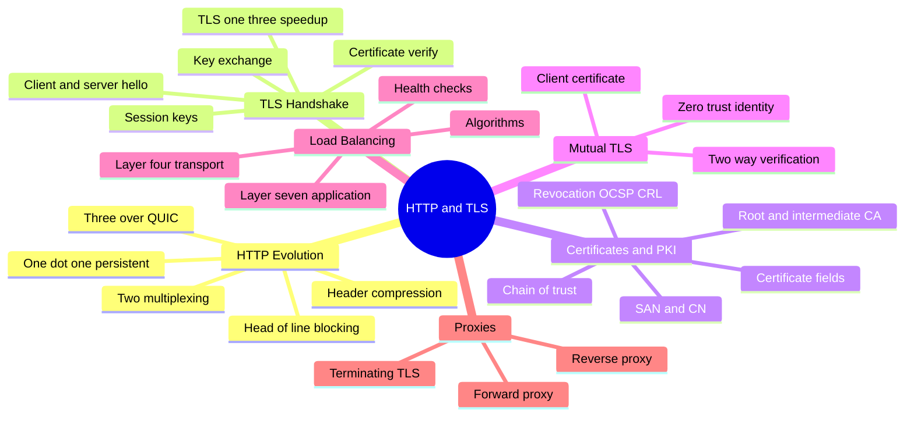
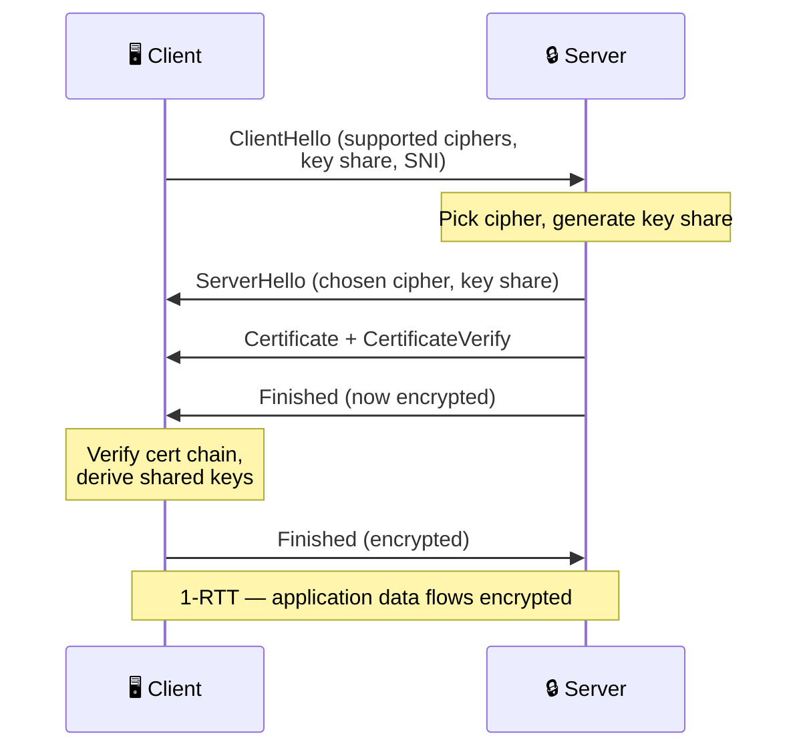
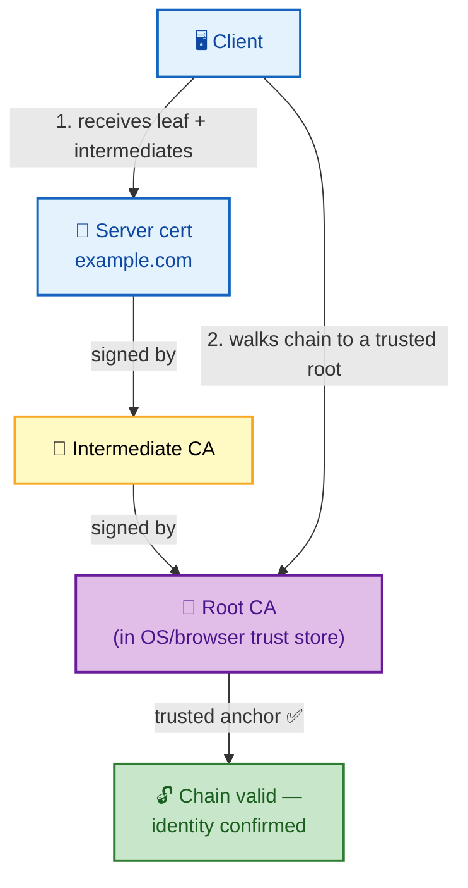
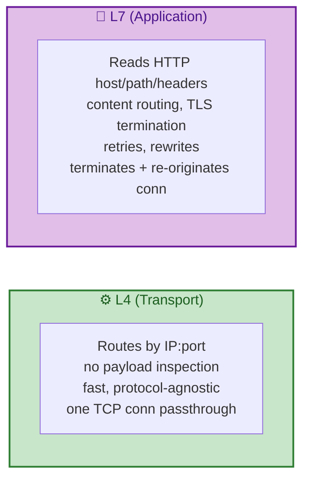

# SECTION 5: HTTP & TLS

> **Scope:** The evolution of HTTP (1.1 → 2 → 3/QUIC), the TLS handshake byte-by-byte, certificates,
> PKI and chains of trust, mutual TLS, L4 vs L7 load balancing, and proxies — where the transport
> stack meets real web traffic and security.

---

## 🗺️ Visual Overview

**In one line:** HTTP is the application protocol of the web and TLS is the encryption layer beneath it;
knowing how each HTTP version fixes the previous one's bottleneck and how the TLS handshake establishes
trust-plus-keys is what separates a surface answer from a senior one.

**Mind map — the whole section at a glance:**

**TLS 1.3 handshake — establishing an encrypted channel (fast path):**

**PKI chain of trust — how a cert is verified:**

**L4 vs L7 load balancing — what the balancer sees:**

> 🧠 **Memory hooks (mnemonics):**
> - **HTTP evolution = killing head-of-line blocking:** 1.1 = one request at a time per conn (HoL at
>   HTTP layer); 2 = **multiplexing** over one TCP conn (HoL moves to TCP); 3/QUIC = independent
>   streams over UDP (**HoL finally gone**).
> - **TLS does two jobs:** **A**uthentication (cert proves identity) + **E**ncryption (session keys).
>   "Prove who, then hide what."
> - **Chain of trust:** *"Leaf → Intermediate → Root"* — you trust the leaf because a root you already
>   trust vouches (transitively) for it.
> - **L4 vs L7:** L4 sees **numbers** (IP/port); L7 sees **words** (host/path/headers). Higher layer =
>   smarter but costlier.
> - **mTLS = both sides show ID** — not just the server proving itself, the client does too.

---

## 1. HTTP Evolution: 1.1 → 2 → 3

> 🎯 **Interview weight: High** — "why HTTP/2 or /3" is a standard systems question.

**In one line:** Each HTTP version attacks the previous one's concurrency bottleneck — persistent
connections (1.1), multiplexing (2), then escaping TCP's head-of-line blocking entirely with QUIC over
UDP (3).

| | HTTP/1.1 | HTTP/2 | HTTP/3 |
|---|---|---|---|
| Year | 1997 | 2015 | 2022 |
| Transport | TCP | TCP | **QUIC over UDP** |
| Concurrency | 1 request/conn (pipelining broken) | **Multiplexed** streams / 1 conn | Multiplexed, **independent** streams |
| Head-of-line blocking | At HTTP layer | Moved to **TCP** layer | **Eliminated** |
| Headers | Plaintext, repeated | **HPACK** compression | **QPACK** compression |
| Encryption | Optional | Effectively required | **Built into QUIC** |
| Connection setup | TCP + TLS (2+ RTT) | TCP + TLS | **1-RTT (0-RTT resume)** |

**Key transitions:**
- **HTTP/1.1** added **persistent (keep-alive)** connections and chunked encoding, but browsers had to
  open ~6 parallel TCP connections per host to get concurrency; pipelining was never usable.
- **HTTP/2** **multiplexes** many requests as independent streams over *one* TCP connection with header
  compression (HPACK) and server push — but because it's still on TCP, **one lost packet stalls all
  streams** (TCP-level HoL blocking).
- **HTTP/3** runs over **QUIC** (a reliable, multiplexed transport built on UDP with TLS 1.3 baked in).
  Streams are independent at the transport level, so a lost packet only stalls *its* stream —
  eliminating HoL blocking — plus faster connection setup and connection migration across IP changes.

> 🔍 **Why UDP for HTTP/3?** TCP is implemented in the OS kernel and can't be changed quickly; building
> QUIC in **user space over UDP** let it iterate fast, integrate TLS 1.3, and fix HoL blocking without
> waiting for kernels/middleboxes to update. QUIC provides TCP-like reliability itself.

## 2. The TLS Handshake

> 🎯 **Interview weight: Very High** — the marquee security-internals question.

**In one line:** TLS establishes an encrypted, authenticated channel by having the server prove its
identity with a **certificate** and both sides agree on **session keys** via key exchange — TLS 1.3
does it in **one round trip**.

**TLS 1.3 handshake (the modern default — see the sequence diagram):**
1. **ClientHello:** client sends supported cipher suites, a **key share** (its half of an ephemeral
   Diffie-Hellman exchange), and **SNI** (which hostname it wants — so one IP can host many certs).
2. **ServerHello:** server picks a cipher and sends its key share. Both sides can now derive the shared
   secret.
3. **Certificate + CertificateVerify:** server sends its certificate chain and signs the handshake to
   prove it owns the cert's private key.
4. **Finished (both sides):** handshake integrity is verified; **application data flows encrypted after
   1 RTT** (0-RTT possible on resumption).

**What TLS 1.3 removed (vs 1.2):** RSA key transport (no forward secrecy), static DH, and the extra
round trip. **1.3 mandates ephemeral (EC)DHE**, giving **forward secrecy** — compromising the server's
long-term key later can't decrypt past captured sessions.

> 💡 **The two jobs, cleanly separated:** (1) **Authentication** — the certificate + signature prove
> you're really talking to `example.com`. (2) **Key agreement** — ephemeral DH derives a fresh shared
> secret nobody watching the wire can compute. The certificate does *not* encrypt data; it authenticates
> and bootstraps the key exchange.

> ⚠️ **Forward secrecy is the point of ephemeral keys:** with RSA key transport (old TLS), recording
> traffic + later stealing the private key = decrypt everything. With (EC)DHE, each session's keys are
> ephemeral and discarded, so past sessions stay safe.

## 3. Certificates, PKI & Chains of Trust

> 🎯 **Interview weight: High** — "how does your browser know the cert is legit" is core.

**In one line:** A certificate binds a **public key** to an **identity (hostname)**, signed by a
**Certificate Authority**; your browser trusts it by walking the **chain** from the server's leaf cert
up through intermediates to a **root CA** already in its trust store.

**The chain of trust (see the PKI diagram):**
- **Root CA:** a self-signed cert pre-installed in the OS/browser **trust store**. The anchor.
- **Intermediate CA:** signed by the root; issues leaf certs (roots stay offline for safety).
- **Leaf (server) cert:** signed by an intermediate; presented by the server, names the hostname(s).
- The server sends the **leaf + intermediates**; the client walks up until it reaches a **trusted
  root**. If the chain is complete and valid → trusted.

**Key certificate fields:**

| Field | Purpose |
|---|---|
| **Subject / CN** | The entity (legacy hostname field) |
| **SAN (Subject Alternative Name)** | The hostname(s) the cert is valid for — **what browsers actually check** |
| **Issuer** | Which CA signed it |
| **Validity (NotBefore/NotAfter)** | Expiry window |
| **Public key** | The server's public key |
| **Signature** | The CA's signature over all of the above |

**Validation checks the client performs:** chain builds to a trusted root, not expired, hostname
matches a **SAN**, not revoked (**OCSP**/CRL), and signatures verify.

> ⚠️ **CN is dead; SAN rules:** modern browsers **ignore CN** and require the hostname in the **SAN**
> list. "Cert works in curl but not Chrome" is often a missing SAN.

> 🔍 **Revocation:** **CRL** (big published list) and **OCSP** (query "is this cert revoked?") let a CA
> invalidate a cert before expiry. **OCSP stapling** has the server attach a fresh signed OCSP response
> so the client needn't contact the CA (faster, more private).

## 4. Mutual TLS (mTLS)

> 🎯 **Interview weight: Medium-High** — central to zero-trust and service meshes.

**In one line:** In **mutual TLS**, *both* sides present certificates — the client proves its identity
to the server too — turning TLS into strong bidirectional authentication.

- Standard TLS: only the **server** authenticates (client verifies the server). Anyone can be a client.
- mTLS: the **client also presents a cert** the server validates against a trusted CA — so only clients
  with a valid cert connect.
- **Where it's used:** service meshes (Istio/Linkerd) give every workload an identity cert and enforce
  mTLS between services; zero-trust architectures; machine-to-machine APIs.

> 🔍 **Why service meshes love mTLS:** it provides **identity** (who is this service), **encryption**
> (in transit), and **authorization** (policy by cert identity) uniformly, without changing app code —
> the sidecar proxy handles it. This is how "encrypt all east-west traffic" is achieved at scale.

## 5. L4 vs L7 Load Balancing

> 🎯 **Interview weight: High** — a constant system-design decision point.

**In one line:** An **L4** load balancer routes by **IP/port** without seeing the payload (fast,
protocol-agnostic); an **L7** balancer reads **HTTP** (host, path, headers) to make smart
content-based decisions and can terminate TLS.

| | L4 (Transport) | L7 (Application) |
|---|---|---|
| Sees | IP, port, TCP/UDP | Full HTTP: host, path, headers, cookies |
| Routing | By connection tuple | By URL/host/header/content |
| TLS | Passthrough (usually) | Can **terminate** and re-originate |
| Features | Raw speed, any protocol | Path routing, retries, rewrites, sticky sessions, WAF |
| Cost/latency | Lower | Higher (parses each request) |
| Examples | AWS NLB, IPVS, HAProxy TCP | AWS ALB, Nginx, Envoy, HAProxy HTTP |

**Load-balancing algorithms:** round-robin, least-connections, weighted, IP-hash (sticky), and
consistent hashing (stable mapping when backends change — key for caches).

> 💡 **TLS termination placement:** an L7 LB that **terminates TLS** decrypts, inspects, and re-encrypts
> (or sends plaintext internally) — enabling content routing and centralizing cert management, at the
> cost of the LB seeing plaintext. An L4 LB **passes TLS through** to the backend (end-to-end
> encryption, but no content routing). Service meshes push TLS termination back to per-pod sidecars.

## 6. Proxies

> 🎯 **Interview weight: Medium** — forward vs reverse is a classic clarity check.

**In one line:** A **forward proxy** sits in front of **clients** (representing them outbound); a
**reverse proxy** sits in front of **servers** (representing them to inbound clients).

| | Forward proxy | Reverse proxy |
|---|---|---|
| In front of | Clients | Servers |
| Hides | The client from the server | The servers from the client |
| Use | Egress filtering, caching, anonymity, corp outbound | TLS termination, LB, caching, WAF, API gateway |
| Examples | Squid, corporate proxy | Nginx, Envoy, HAProxy, CloudFront |

> 🔍 **The reverse proxy is everywhere in modern infra:** it's the front door doing TLS termination,
> load balancing, caching, compression, rate limiting, and routing — Nginx/Envoy as ingress, CDNs at
> the edge, API gateways for microservices. Most "L7 load balancer" features are reverse-proxy
> features.

---

## Interview Questions & Answers

**Q1: What problem does HTTP/2 solve over 1.1, and what problem does HTTP/3 solve over 2?**

**Crisp answer:** HTTP/2 **multiplexes** many requests over one TCP connection (killing HTTP-layer
head-of-line blocking and the 6-connections-per-host hack) with header compression. HTTP/3 moves to
**QUIC over UDP** so streams are independent at the transport layer, **eliminating TCP head-of-line
blocking** — one lost packet no longer stalls every stream.

**Internals:** HTTP/2's streams still ride one TCP byte stream, so a single packet loss blocks all
streams until retransmit. QUIC gives each stream its own delivery, plus TLS 1.3 integration, 1-RTT
setup, and connection migration.

**Follow-up — why not just fix TCP?** TCP lives in the kernel and middleboxes; QUIC in user space over
UDP could iterate and deploy far faster.

---

**Q2: Walk through the TLS handshake. What exactly does the certificate do?**

**Crisp answer:** ClientHello (ciphers, key share, SNI) → ServerHello (chosen cipher, key share) →
Certificate + CertificateVerify → Finished both ways; app data flows after 1 RTT in TLS 1.3. The
**certificate authenticates the server's identity** and lets the client verify the server owns the
matching private key — it does **not** encrypt data; ephemeral DH derives the session keys.

**Internals:** Both sides contribute (EC)DHE key shares to compute a shared secret (forward secrecy).
CertificateVerify signs the handshake with the cert's private key, proving ownership. Finished verifies
integrity.

**Follow-up — forward secrecy?** Ephemeral keys per session mean a later private-key theft can't
decrypt recorded past sessions; TLS 1.3 mandates it.

---

**Q3: How does your browser decide a certificate is trustworthy?**

**Crisp answer:** It builds the **chain** from the server's leaf cert through intermediates up to a
**root CA in its trust store**, and checks: chain valid, not expired, hostname in the **SAN**, not
revoked, signatures verify.

**Internals:** Roots are pre-installed and self-signed; intermediates bridge to the leaf so roots can
stay offline. The client trusts the leaf transitively because a trusted root signed the chain.

**Follow-up — works in curl but not Chrome?** Usually a missing **SAN** (browsers ignore CN) or an
incomplete intermediate chain the server failed to send.

---

**Q4: When would you choose an L4 load balancer over an L7, and what do you give up?**

**Crisp answer:** Choose **L4** for raw throughput, non-HTTP protocols, or true end-to-end TLS
(passthrough) — you give up content-based routing, header inspection, retries, and central TLS
termination, which **L7** provides at higher per-request cost.

**Internals:** L4 forwards by tuple without parsing payload (can preserve the client's TCP connection);
L7 terminates and re-originates connections to read HTTP, enabling path/host routing and WAF.

**Follow-up — where does TLS terminate?** At an L7 LB (decrypt, inspect, re-encrypt) or, in a mesh,
back at per-pod sidecars with mTLS; L4 typically passes it through.

---

**Q5: What is mTLS and why do service meshes use it?**

**Crisp answer:** mTLS is **two-way** TLS where the client also presents a certificate, so both sides
authenticate. Service meshes use it to give every workload a cryptographic **identity**, **encrypt all
service-to-service traffic**, and **authorize by identity** — transparently via sidecar proxies.

**Internals:** The mesh control plane issues/rotates per-workload certs; sidecars enforce mTLS and
policy without app changes. This delivers zero-trust east-west security at scale.

**Follow-up — cost?** Cert issuance/rotation, handshake CPU, and operational complexity; session
resumption and hardware offload mitigate the CPU cost.

---

## Troubleshooting Scenarios

**Scenario 1 — "TLS works with curl but browsers show NET::ERR_CERT_COMMON_NAME_INVALID."**
- **Symptom:** curl fine; Chrome/Firefox reject the cert.
- **Investigation:** `openssl s_client -connect host:443 -servername host` and inspect the SAN list;
  compare to the hostname.
- **Root cause:** Hostname present only in **CN**, not **SAN** (browsers require SAN).
- **Fix:** Reissue the cert with the hostname in the SAN list.

**Scenario 2 — "Intermittent cert errors from some clients only."**
- **Symptom:** Some clients error with "unable to get local issuer certificate."
- **Investigation:** `openssl s_client -showcerts` — is the **intermediate** sent? Older/embedded
  clients lack cached intermediates.
- **Root cause:** Server sends only the leaf; browsers cache intermediates and succeed, but clients
  without the cached intermediate fail.
- **Fix:** Configure the server to send the **full chain** (leaf + intermediates).

**Scenario 3 — "After enabling HTTP/2 behind a proxy, some requests fail or fall back to 1.1."**
- **Symptom:** Mixed protocol behavior, occasional stalls.
- **Investigation:** Check ALPN negotiation (`openssl s_client -alpn h2`), proxy/LB HTTP/2 support, and
  whether TLS terminates before a 1.1-only hop.
- **Root cause:** An intermediate proxy negotiates HTTP/2 with the client but speaks 1.1 upstream, or
  ALPN isn't offered end-to-end.
- **Fix:** Enable HTTP/2 end-to-end or terminate consistently; ensure ALPN advertises `h2`.

---

## Documentation Links

| Topic | Link |
|---|---|
| HTTP/2 (RFC 9113) | https://www.rfc-editor.org/rfc/rfc9113 |
| HTTP/3 (RFC 9114) | https://www.rfc-editor.org/rfc/rfc9114 |
| QUIC (RFC 9000) | https://www.rfc-editor.org/rfc/rfc9000 |
| TLS 1.3 (RFC 8446) | https://www.rfc-editor.org/rfc/rfc8446 |
| X.509 / PKI (RFC 5280) | https://www.rfc-editor.org/rfc/rfc5280 |
| Mozilla Server Side TLS | https://wiki.mozilla.org/Security/Server_Side_TLS |

---

*Continue to [06-TROUBLESHOOTING.md](06-TROUBLESHOOTING.md) for Section 6 (Troubleshooting).*
