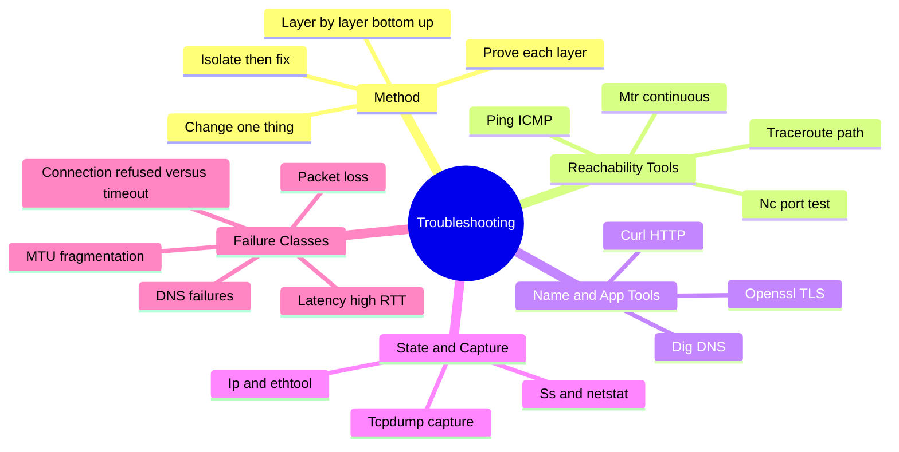
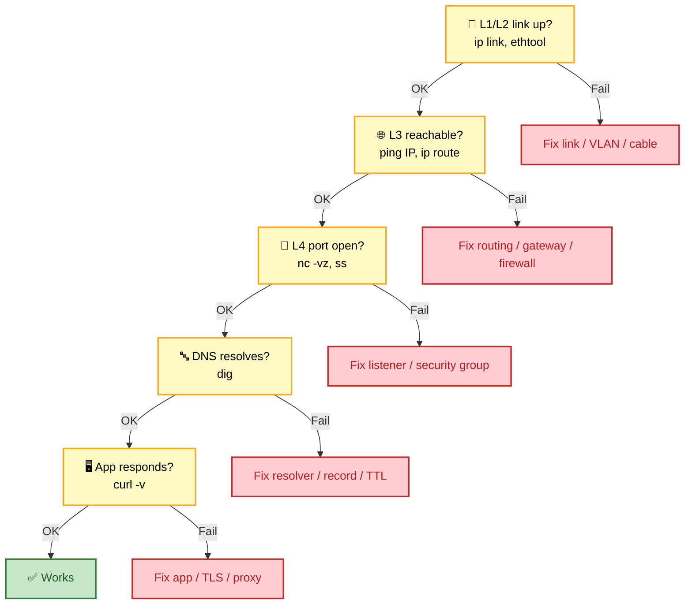
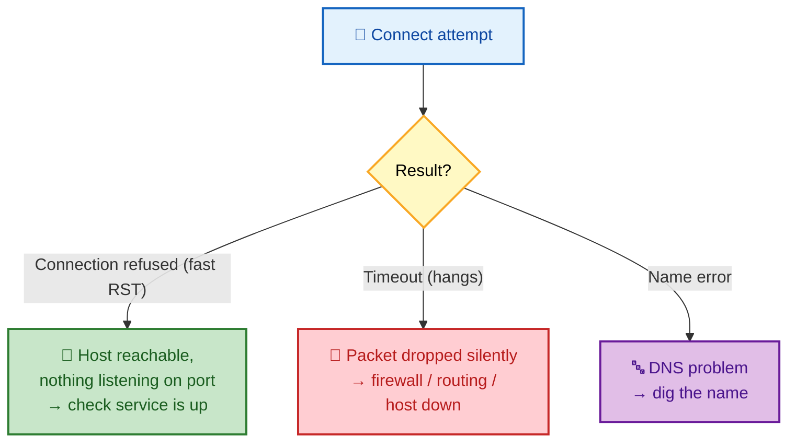

# SECTION 6: TROUBLESHOOTING

> **Scope:** A methodical, layer-by-layer approach to diagnosing network problems, the essential tool
> belt (ping, traceroute, dig, curl, ss/netstat, tcpdump, mtr, nc), and the recurring failure classes
> — latency, packet loss, MTU/fragmentation, and DNS issues — with real annotated commands.

---

## 🗺️ Visual Overview

**In one line:** Network troubleshooting is a discipline, not guesswork — walk the OSI layers from the
bottom up, prove each layer works before suspecting the next, and reach for the one tool that isolates
the current layer.

**Mind map — the whole section at a glance:**



**The layer-by-layer method — walk up until it breaks:**



**Connection refused vs timeout — the first fork in any diagnosis:**



> 🧠 **Memory hooks (mnemonics):**
> - **Bottom-up method:** *"Link, Route, Port, Name, App"* → L1/2 link → L3 route → L4 port → DNS name
>   → L7 app. Prove each before blaming the next.
> - **Refused vs timeout:** **Refused = fast RST** ("I'm here, that door's locked" → nothing
>   listening). **Timeout = silence** ("no one answered" → firewall/route/host down).
> - **One tool per layer:** `ping` (L3 reach), `nc` (L4 port), `dig` (DNS), `curl` (L7 app),
>   `tcpdump` (see the truth).
> - **Change one variable at a time** — the golden rule; otherwise you can't attribute the fix.

---

## 1. The Methodical Approach

> 🎯 **Interview weight: High** — interviewers care more about *method* than trivia; a structured
> answer wins.

**In one line:** Diagnose **bottom-up** through the layers — confirm the link, then L3 reachability,
then the L4 port, then DNS, then the application — isolating the failing layer before touching anything.

**The disciplined loop:**
1. **Define the symptom precisely.** "Slow" vs "fails" vs "intermittent" lead to different tools.
2. **Establish scope.** One host or all? One destination or all? Started when? (Correlate with a
   change.)
3. **Walk the layers bottom-up** (see the flowchart). Prove each works before suspecting the next.
4. **Isolate, then change one variable at a time.** Confirm the fix; don't shotgun multiple changes.

> 💡 **The single most useful first split:** is it **connection refused** (fast — host up, no listener)
> or **timeout** (silent — firewall/route/host)? This one observation eliminates half the search space
> instantly. A third branch is **name resolution** failure (can't even get an IP).

## 2. Reachability Tools — ping, traceroute, mtr

> 🎯 **Interview weight: High** — the L3 path tools everyone must know cold.

**In one line:** `ping` tests basic reachability and RTT; `traceroute` maps the hop-by-hop path and
where it breaks; `mtr` combines both continuously to expose *which hop* loses packets.

```bash
ping -c 4 8.8.8.8            # 4 ICMP echoes: reachability + round-trip time + loss %
ping -M do -s 1472 host      # DF-set 1500B packet — tests MTU (fails if path MTU < 1500)

traceroute host             # UDP/ICMP probes with increasing TTL; each hop returns Time Exceeded
traceroute -T -p 443 host   # TCP traceroute to port 443 (gets through firewalls that drop UDP/ICMP)

mtr host                    # live, continuous traceroute — best for spotting loss at a specific hop
mtr -rwc 100 host           # report mode, 100 cycles — snapshot for tickets
```

**How traceroute works (a favorite question):** it sends packets with **TTL=1, 2, 3, …**. Each router
that decrements TTL to 0 returns an **ICMP Time Exceeded**, revealing itself. The destination returns a
**Port Unreachable** (or the probe completes), ending the trace.

> ⚠️ **Reading traceroute correctly:** a hop showing `* * *` isn't necessarily broken — many routers
> **deprioritize or drop ICMP** to their own control plane while still **forwarding** traffic fine.
> Loss that **persists to the destination** matters; loss at a single middle hop that clears afterward
> is usually just that router rate-limiting ICMP. `mtr` makes this pattern obvious.

## 3. Name & App Tools — dig, curl, openssl

> 🎯 **Interview weight: High** — the L7/DNS workhorses.

```bash
dig example.com              # full DNS answer: record, TTL, which server answered
dig +short example.com       # just the IP(s)
dig @8.8.8.8 example.com     # query a specific resolver (bypass local cache to compare)
dig +trace example.com       # walk root → TLD → authoritative yourself (see delegation)
dig -x 93.184.216.34         # reverse lookup (PTR)

curl -v https://example.com          # verbose: DNS, TCP connect, TLS handshake, headers, body
curl -I https://example.com          # headers only (HEAD) — status, redirects, server
curl --resolve example.com:443:1.2.3.4 https://example.com   # force an IP, bypass DNS
curl -w "dns:%{time_namelookup} connect:%{time_connect} tls:%{time_appconnect} ttfb:%{time_starttransfer}\n" -o /dev/null -s https://example.com   # timing breakdown per phase

openssl s_client -connect example.com:443 -servername example.com   # inspect the TLS cert chain/handshake
```

> 💡 **`curl -w` timing is a superpower:** it breaks a request into DNS, TCP connect, TLS, and
> time-to-first-byte. A slow `time_namelookup` = DNS; slow `time_connect` = network/TCP; slow
> `time_appconnect` = TLS; slow `time_starttransfer` = server processing. One command localizes "the
> site is slow" to a layer.

> 🔍 **`dig +trace` vs a normal `dig`:** normal `dig` asks your resolver (may be cached); `+trace`
> performs the full iterative walk from the root yourself, so you see the *authoritative* answer and
> exactly where delegation breaks — gold for "propagation" debugging.

## 4. State & Capture — ss, tcpdump, ip, ethtool

> 🎯 **Interview weight: High** — the "show me what's really happening" tools.

```bash
ss -tanp                    # all TCP sockets: state, 4-tuple, owning process (replaces netstat)
ss -ltn                     # listening TCP ports (is the service actually bound?)
ss -s                       # socket summary by state (spot TIME_WAIT/CLOSE_WAIT floods)
ss -ti                      # per-socket TCP internals: rtt, cwnd, retransmits, wscale

ip addr / ip link           # interface IPs and link state (UP/DOWN)
ip route get 10.0.5.20      # exactly which route/next-hop the kernel picks for a destination
ip neigh                    # ARP/neighbor cache (REACHABLE / STALE / INCOMPLETE)

ethtool -S eth0 | grep -i err   # NIC-level error/drop counters (L1/L2 problems)

tcpdump -i eth0 -nn host 1.2.3.4 and port 443   # capture matching packets, no name resolution
tcpdump -i any -nn -c 20 'tcp[tcpflags] & tcp-syn != 0'   # see SYNs — are connections even leaving?
tcpdump -i eth0 -w capture.pcap host 1.2.3.4    # write to file for Wireshark analysis

nc -vz host 443             # test if a TCP port is open without sending data
nc -vzu host 53             # test a UDP port (DNS)
```

> 🔍 **tcpdump is the ground truth:** when higher-level tools disagree or lie, a capture shows exactly
> which packets left, arrived, or got no reply. Seeing SYNs go out with no SYN-ACK back = the other
> side/firewall is dropping them (timeout class). Seeing an immediate RST = refused. Seeing retransmits
> = loss.

> 💡 **`ss -ti` exposes TCP health:** per-socket `retrans`, `rtt`, and `cwnd` reveal loss and whether a
> throughput ceiling is a window/BDP problem (Section 3) — far more than `netstat` ever showed.

## 5. Failure Class — Latency

> 🎯 **Interview weight: High** — "the app is slow" is the most common vague report.

**In one line:** Isolate *where* the latency is — DNS, TCP connect, TLS, or server processing — with
`curl -w` timings and `mtr` for path RTT, rather than guessing.

- **High RTT everywhere** → path/distance/congestion; `mtr` shows where RTT jumps.
- **Slow DNS only** (`time_namelookup` high) → resolver problem (Section 4).
- **Slow connect** (`time_connect`) → network latency or SYN retransmits (packet loss on the handshake).
- **Slow TLS** (`time_appconnect`) → handshake round trips, OCSP fetches, weak cipher/CPU.
- **Slow first byte** (`time_starttransfer`) → the *server*/app is slow, not the network.

> ⚠️ **Latency vs throughput:** a high-latency link can still have high bandwidth. If throughput is the
> problem on a high-RTT link, suspect the **window/BDP** (Section 3) — not raw latency. `ss -ti` shows
> if the window is the limiter.

## 6. Failure Class — Packet Loss

> 🎯 **Interview weight: High** — loss silently degrades everything above it.

**In one line:** Confirm loss with `ping`/`mtr`, locate *which hop* with `mtr`, and distinguish
**real path loss** (persists to destination) from **ICMP rate-limiting** (loss at one hop that clears
after).

- `ping -c 100` → loss percentage to the destination.
- `mtr` → per-hop loss; the meaningful signal is loss that **continues to the final hop**.
- `ethtool -S` / `ip -s link` → local NIC drops/errors (bad cable, duplex mismatch, ring overruns).
- `ss -ti` retransmits → TCP-visible loss on a specific connection.

> ⚠️ **The #1 misread:** loss at hop 5 that **doesn't** appear at hops 6–10 is that router
> rate-limiting ICMP to *itself*, **not** a real problem — transit traffic is fine. Only loss that
> **reaches the destination** degrades the app.

## 7. Failure Class — MTU / Fragmentation

> 🎯 **Interview weight: High** — the "small works, large hangs" signature (also in Section 1).

**In one line:** When small requests succeed but large transfers hang, suspect an **MTU black hole** —
a reduced-MTU path (often a tunnel) plus a firewall dropping the ICMP "fragmentation needed" that PMTUD
needs.

```bash
ping -M do -s 1472 host     # 1472 payload + 28 hdr = 1500; fails if path MTU < 1500
ping -M do -s 1400 host     # binary-search down to find the real path MTU
tracepath host              # reports the path MTU and where it drops
ip link show eth0           # local interface MTU
```

- Test with DF-set pings of decreasing size to find the true path MTU.
- Fix by **allowing ICMP Type 3 Code 4**, **MSS clamping**
  (`iptables -t mangle -A FORWARD -p tcp --tcp-flags SYN,RST SYN -j TCPMSS --clamp-mss-to-pmtu`), or
  matching MTU end-to-end (jumbo frames or lowering the tunnel MTU).

> 🔍 **Why overlays trigger it:** VXLAN/IPsec/GRE add ~50+ bytes of encapsulation, dropping the
> effective MTU below 1500; without MSS clamping the endpoints keep sending 1500-byte packets that the
> tunnel can't carry, and blocked ICMP hides the problem.

## 8. Failure Class — DNS Issues

> 🎯 **Interview weight: High** — ties Section 4 to hands-on debugging.

**In one line:** Separate **"can't resolve"** from **"resolves wrong/stale"** with `dig`, comparing the
local resolver against an authoritative or public one, and remember multiple cache layers.

```bash
dig +short name                      # what does MY resolver return?
dig @8.8.8.8 +short name             # what does a public resolver return? (compare)
dig +trace name                      # authoritative answer + where delegation breaks
dig name | grep -A1 "ANSWER SECTION" # inspect the TTL (how long is it cached?)
```

- **NXDOMAIN** → record missing (or negative-cached — Section 4).
- **SERVFAIL** → resolver/authoritative failure (DNSSEC, unreachable NS).
- **Right answer from `@8.8.8.8` but wrong locally** → stale local/OS/app cache within the old TTL.

> ⚠️ **Don't forget the app cache:** even after OS and resolver caches are correct, a long-lived process
> (classic: old JVM DNS caching) may hold the old IP indefinitely. "Everything says the right IP but
> the app connects to the old one" = restart or fix the app-level cache TTL.

---

## Interview Questions & Answers

**Q1: "The application is slow." Walk me through isolating whether it's the network or the server.**

**Crisp answer:** Use `curl -w` to break the request into **DNS → TCP connect → TLS → time-to-first-
byte**. If `time_starttransfer` dominates while connect/TLS are fast, it's the **server**; if
connect/RTT is high, it's the **network** (confirm the path with `mtr`).

**Internals:** Each timing phase maps to a layer — namelookup=DNS, connect=TCP/RTT, appconnect=TLS,
starttransfer=server processing. `mtr` localizes path RTT/loss; `ss -ti` shows if throughput is
window/BDP-bound.

**Follow-up — high RTT but fine bandwidth needed?** Throughput ceiling on a long-fat link → window
scaling/buffer tuning, not a "network down" issue.

---

**Q2: Connection to a service times out vs is refused — what does each tell you?**

**Crisp answer:** **Refused** = an immediate TCP **RST**: the host is up and reachable but **nothing is
listening** on that port (or it actively rejects). **Timeout** = **silence**: a firewall dropped the
packet, a route is missing, or the host is down.

**Internals:** RST is a positive "no" from a reachable stack; a timeout means the SYN got no response at
all. `tcpdump` confirms: RST back = refused; SYNs with no reply = dropped.

**Follow-up — how to prove it's a firewall vs host down?** `traceroute -T -p <port>` shows how far you
get; a capture shows SYNs leaving with no SYN-ACK; check security groups/iptables at the boundary.

---

**Q3: How does traceroute work, and why might a hop show `* * *` yet everything works?**

**Crisp answer:** Traceroute sends packets with increasing **TTL**; each router decrementing TTL to 0
returns **ICMP Time Exceeded**, revealing the path. A `* * *` hop usually means that router
**deprioritizes/drops ICMP to itself** while still forwarding traffic — so it's cosmetic unless the
loss **persists to the destination**.

**Internals:** TTL=1,2,3… elicits per-hop replies; the destination returns Port Unreachable. Routers
rate-limit ICMP to their control plane, not transit traffic.

**Follow-up — firewall drops UDP traceroute?** Use **TCP traceroute** (`-T -p 443`) to probe on an
allowed port.

---

**Q4: Large file downloads hang while small requests succeed. Diagnose it.**

**Crisp answer:** Classic **MTU black hole**. Test with `ping -M do -s 1472 host`; if a full-size DF
packet fails but smaller ones pass, a reduced-MTU path plus a firewall dropping ICMP "frag needed" is
silently dropping big packets.

**Internals:** PMTUD relies on ICMP Type 3 Code 4 to shrink packet size; blocked ICMP breaks it. Common
with VPN/overlay encapsulation lowering effective MTU below 1500.

**Follow-up — fix without touching the firewall?** **MSS clamping** on the router/tunnel forces a
smaller TCP segment size so packets fit.

---

**Q5: DNS "isn't propagating" after a record change. How do you confirm and explain it?**

**Crisp answer:** Compare `dig +short name` (local resolver) with `dig @8.8.8.8 +short name` and
`dig +trace` (authoritative). If authoritative is correct but local is stale, caches are still within
the **old TTL** — DNS expires, it doesn't push.

**Internals:** Multiple cache layers (recursive, OS stub, app) hold the old value up to the old TTL.
Negative caching can also cache an early NXDOMAIN. Lower TTL *before* changes next time.

**Follow-up — authoritative itself is wrong?** The change didn't apply at the provider, or you edited
the wrong zone/record; `dig +trace` proves what the authoritative server actually serves.

---

## Troubleshooting Scenarios

**Scenario 1 — "One microservice can't reach another; others can."**
- **Symptom:** Service A → B fails; A → C works; D → B works.
- **Investigation:** Bottom-up from A: `nc -vz B 8080` (port), `ping B` (L3), `dig B` (name),
  `ip route get <B-ip>`; check B's `ss -ltn` and A↔B firewall/security-group/NetworkPolicy.
- **Root cause:** A specific policy/security-group rule or a NetworkPolicy blocking the A→B pair, or B
  not listening on the expected interface.
- **Fix:** Correct the policy/rule or B's bind address; verify with `nc` then `curl`.

**Scenario 2 — "Throughput between two regions is far below the link capacity."**
- **Symptom:** Transfers plateau well under bandwidth on a high-RTT path.
- **Investigation:** `ss -ti` for `cwnd`, `rtt`, `retrans`, `wscale`; `mtr` for loss; compute BDP.
- **Root cause:** Window too small for the bandwidth-delay product (scaling/buffers), and/or random
  loss capping a loss-based congestion algorithm.
- **Fix:** Enable window scaling, raise TCP buffers, try **BBR**; fix any real loss found by `mtr`.

**Scenario 3 — "Intermittent 5xx from a service behind a load balancer."**
- **Symptom:** Sporadic 502/504 under load.
- **Investigation:** LB logs + `curl -w` timing to the backend directly; `ss -s` for CLOSE_WAIT/
  TIME_WAIT floods; check backend health-check config and keep-alive settings.
- **Root cause:** Backend socket leak (CLOSE_WAIT), keep-alive mismatch (LB reuses a connection the
  backend closed), or health checks flapping.
- **Fix:** Fix the socket leak, align idle/keep-alive timeouts (backend ≥ LB), stabilize health checks.

---

## Documentation Links

| Topic | Link |
|---|---|
| `tcpdump` manual | https://www.tcpdump.org/manpages/tcpdump.1.html |
| `ss` socket statistics | https://man7.org/linux/man-pages/man8/ss.8.html |
| `dig` manual | https://linux.die.net/man/1/dig |
| `mtr` manual | https://www.bitwizard.nl/mtr/ |
| `curl` `-w` variables | https://everything.curl.dev/usingcurl/verbose/writeout |
| Path MTU Discovery (RFC 1191) | https://www.rfc-editor.org/rfc/rfc1191 |

---

*This is the final section. Return to the [Networking index](README.md) to review, or revisit
[01-FUNDAMENTALS.md](01-FUNDAMENTALS.md) to reinforce the layer model that ties every section together.*
