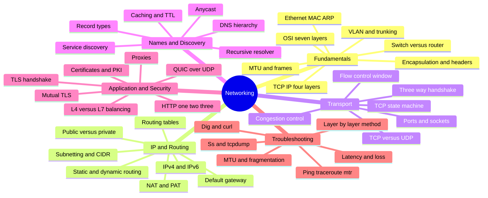

# Networking — Deep Dive Interview Preparation

A complete, in-depth **computer networking** interview preparation curriculum for DevOps Engineers,
SREs, Platform Engineers, Cloud Engineers, and Backend/Infrastructure interviews. Networking is the
one subject that shows up in *every* infrastructure interview — "what happens when you type a URL,"
subnetting math on a whiteboard, TCP state debugging, DNS propagation, TLS handshakes, and
load-balancer design are all fair game regardless of the cloud or stack.

This guide teaches from **fundamentals through system internals** — packet encapsulation, subnetting
arithmetic, the TCP state machine, DNS resolver flow, the TLS handshake byte-by-byte, and a methodical
layer-by-layer troubleshooting discipline — not command memorization. Every section is depth-first per
topic, with colorful diagrams for the hard flows, comparison tables, interview-worthy Q&A
(answer → internals → follow-up), real annotated commands, and troubleshooting scenarios.

---

## Master Table of Contents

| # | Section | Covers |
|---|---------|--------|
| 1 | [Fundamentals & the Stack](01-FUNDAMENTALS.md) | OSI vs TCP/IP models, encapsulation & headers, L2 Ethernet/MAC/ARP, switches vs routers, VLANs & trunking, MTU & frames |
| 2 | [IP Addressing & Routing](02-IP-ROUTING.md) | IPv4/IPv6 addressing, subnetting & CIDR math, public vs private (RFC 1918), routing tables, static vs dynamic routing, NAT/PAT, default gateway |
| 3 | [Transport Layer (TCP/UDP)](03-TRANSPORT.md) | TCP vs UDP, 3-way handshake, connection teardown, flow control & windows, congestion control, ports & sockets, the TCP state machine |
| 4 | [DNS & Service Discovery](04-DNS-DISCOVERY.md) | DNS hierarchy, recursive resolver flow, record types, caching & TTL, anycast, service discovery basics |
| 5 | [HTTP & TLS](05-HTTP-TLS.md) | HTTP/1.1 vs HTTP/2 vs HTTP/3 (QUIC), the TLS handshake, certificates/PKI/chains, mTLS, L4 vs L7 load balancing, proxies |
| 6 | [Troubleshooting](06-TROUBLESHOOTING.md) | Methodical layer-by-layer approach; ping, traceroute, dig, curl, ss/netstat, tcpdump, mtr, nc; latency, packet loss, MTU/fragmentation, DNS issues |

---

## 🗺️ Repo-wide Mind Map

Skim this first to see how the whole subject fits together, then revisit it after each section:

## Suggested study order

1. **Section 1 (Fundamentals)** — the models and Layer 2. Everything above stands on encapsulation,
   MAC/ARP, and the switch-vs-router distinction. Do not skip.
2. **Section 2 (IP & Routing)** — subnetting/CIDR is the single most-tested whiteboard skill. Drill the
   math until it is instant.
3. **Section 3 (Transport)** — TCP internals (handshake, windows, congestion, states) are the densest
   interview territory. This is where "senior" answers are separated from "junior" ones.
4. **Section 4 (DNS)** — the recursive resolution flow and caching/TTL behavior underpin half of all
   "site is down" incidents.
5. **Section 5 (HTTP & TLS)** — protocol evolution and the TLS handshake tie the stack to real web
   traffic and security.
6. **Section 6 (Troubleshooting)** — practice diagnosing symptoms with every tool, layer by layer. Do
   this last, but return to it continuously.

> 🧠 **The one mnemonic to never forget — OSI layers bottom→top:**
> *"Please Do Not Throw Sausage Pizza Away"* → **P**hysical, **D**ata-link, **N**etwork, **T**ransport,
> **S**ession, **P**resentation, **A**pplication. Top→down flip:
> *"All People Seem To Need Data Processing."*

---

*Begin with [01-FUNDAMENTALS.md](01-FUNDAMENTALS.md).*
