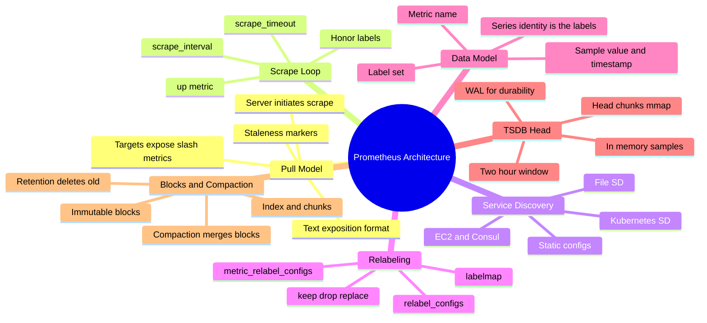
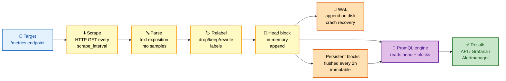
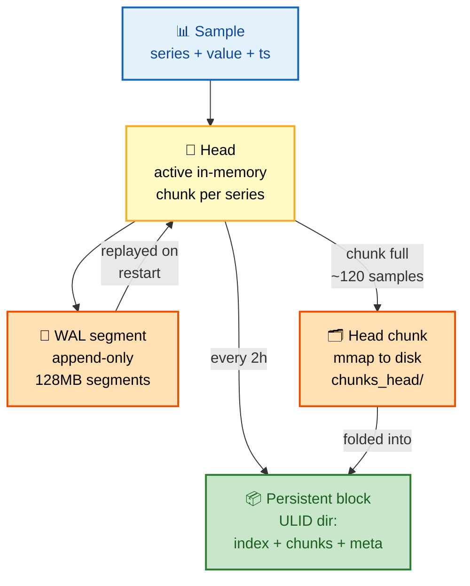
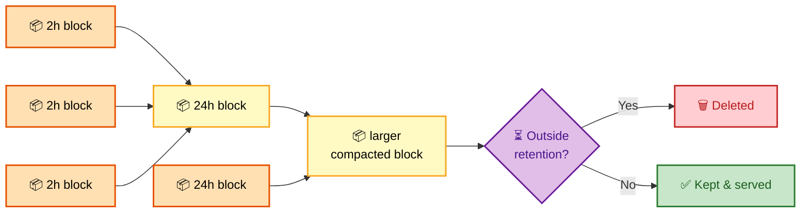

# SECTION 1: PROMETHEUS ARCHITECTURE

> **Scope:** How Prometheus pulls, stores, and serves metrics — the pull model, the scrape loop, service discovery & relabeling, the data model, and TSDB internals (head, WAL, blocks, mmap chunks, compaction, retention).

---

## Table of Contents

1. [The Pull Model](#1-the-pull-model)
2. [The Scrape Loop & Targets](#2-the-scrape-loop--targets)
3. [Service Discovery](#3-service-discovery)
4. [Relabeling](#4-relabeling)
5. [The Data Model: Metric Name + Labels + Samples](#5-the-data-model-metric-name--labels--samples)
6. [TSDB Internals: Head, WAL, Blocks](#6-tsdb-internals-head-wal-blocks)
7. [Compaction & Retention](#7-compaction--retention)
8. [Interview Questions & Answers](#interview-questions--answers)
9. [Troubleshooting Scenarios](#troubleshooting-scenarios)
10. [Documentation Links](#documentation-links)

---

## 🗺️ Visual Overview

**In one line:** Prometheus is a single binary that scrapes HTTP endpoints on a timer, appends the parsed samples into an in-memory head that's crash-protected by a WAL, periodically flushes the head to immutable on-disk blocks, and answers PromQL by reading head + blocks together.

**Mind map — the whole section at a glance** (skim first, revisit last):



**The scrape-to-query pipeline — the highest-value diagram in the section** (blue = ingest, yellow = process, orange = storage, green = serve):



**TSDB write path — where a sample actually lands** (yellow = memory, orange = disk, green = durable):



> 🧠 **Memory hooks (mnemonics):**
> - **Pull, not push:** Prometheus **P**ulls — the server **P**hones the target, the target never calls home. "The scraper knocks; the app just answers the door."
> - **Write path order:** *"Head, WAL, mmap, Block"* → sample hits the **Head** first, is made durable in the **WAL**, spills to an **mmap**'d head chunk when full, and is folded into a **Block** every 2h.
> - **Series identity:** a time series IS its full label set (name is just the `__name__` label). Change one label value → brand-new series. "New label, new line."
> - **Block is immutable:** once written, a block is never edited — only **compacted** (merged) or **deleted** (retention). "Blocks are write-once."

---

## 1. The Pull Model

> 🎯 **Interview weight: Very High** — "pull vs push, and why" is the single most common Prometheus opener.

**In one line:** Prometheus **initiates** every collection — it sends an HTTP `GET /metrics` to each target on a timer and parses whatever text the target returns, rather than waiting for apps to push data in.

**How it works:** Each target exposes a plaintext endpoint (conventionally `/metrics`) in the
**exposition format**. Prometheus holds a list of targets (from service discovery), and on each
`scrape_interval` fires a concurrent HTTP request to every target, parses the response into samples,
and appends them to the TSDB.

A sample exposition response:

```text
# HELP http_requests_total Total HTTP requests.
# TYPE http_requests_total counter
http_requests_total{method="GET",status="200"} 10294
http_requests_total{method="POST",status="500"} 3
# HELP process_resident_memory_bytes Resident memory.
# TYPE process_resident_memory_bytes gauge
process_resident_memory_bytes 5.2428e+07
```

**Why pull wins for Prometheus's use case:**

| Dimension | Pull (Prometheus) | Push (StatsD, Graphite) |
|---|---|---|
| Target health | Free — a failed scrape sets `up=0` | Silence is ambiguous (down? or just quiet?) |
| Discovery | Server owns the target list (SD) | Every client must know the server address |
| Overload control | Server controls scrape rate | Clients can flood the server |
| Firewalling | Server reaches into targets | Targets must reach out |
| Ad-hoc debugging | `curl target/metrics` by hand | No equivalent |

> 💡 The **`up`** metric is a synthetic sample Prometheus writes for every scrape: `1` if the scrape
> succeeded, `0` if it failed. It's the backbone of target-health alerting — you never instrument it,
> Prometheus generates it.

⚠️ **The pull model's real weak spot: short-lived/batch jobs.** A cron job that runs for 3 seconds may
never be alive when Prometheus scrapes. The fix is the **Pushgateway** — the job pushes its final
metrics to the Pushgateway, which holds them so Prometheus can scrape them later. This is the *one*
sanctioned place to "push," and it's for ephemeral jobs only — never for regular service metrics
(it breaks the `up` health signal and becomes a single point of staleness).

🔍 **Interview trap:** "How does Prometheus know if a target is down?" — because the **pull** failed.
In a push system, absence of data is indistinguishable from "the app had nothing to say."

---

## 2. The Scrape Loop & Targets

> 🎯 **Interview weight: High** — interviewers probe interval/timeout interplay and the `up`/staleness mechanics.

**In one line:** A **scrape job** is a named group of targets sharing one scrape config; each target
is scraped independently on the job's interval, and each scrape is bounded by `scrape_timeout`.

Minimal `prometheus.yml`:

```yaml
global:
  scrape_interval: 15s      # default poll frequency for every job
  scrape_timeout: 10s       # must be <= scrape_interval
  evaluation_interval: 15s  # how often rules/alerts are evaluated

scrape_configs:
  - job_name: "node"
    static_configs:
      - targets: ["10.0.0.1:9100", "10.0.0.2:9100"]
  - job_name: "api"
    scrape_interval: 30s     # per-job override
    metrics_path: /actuator/prometheus
    scheme: https
    static_configs:
      - targets: ["api.internal:8443"]
```

**Key mechanics:**

- **`scrape_interval` vs `scrape_timeout`:** timeout must be ≤ interval. If a target takes longer than
  `scrape_timeout` to respond, the scrape fails, `up=0`, and that interval has no data.
- **Automatic labels:** every scraped series gets `job` (the job_name) and `instance`
  (host:port) labels attached. These are your primary grouping dimensions.
- **Staleness handling:** if a series present in one scrape disappears in the next (or the scrape
  fails), Prometheus injects a **staleness marker** ~5 min out so queries stop returning the last
  value as if it were current. This is why `rate()` doesn't keep extrapolating a dead series forever.
- **Sample limits:** `sample_limit` on a job rejects a scrape entirely if it returns more than N
  series — a guardrail against a misbehaving target causing a **cardinality explosion**.

```yaml
  - job_name: "risky-app"
    sample_limit: 10000      # fail the whole scrape if > 10k series returned
    static_configs:
      - targets: ["risky:8080"]
```

> 💡 **Scrape interval is a durability/resolution trade-off.** Shorter interval = higher resolution but
> more samples, more disk, more series churn. 15–60s is the sweet spot for most services; sub-5s is
> rarely worth the storage cost.

⚠️ **Honor labels:** by default, if a target exposes a label that collides with an attached label
(e.g., it exports its own `job`), Prometheus prefixes the exported one with `exported_`. Set
`honor_labels: true` to let the target's values win — essential for the Pushgateway and federation,
dangerous elsewhere.

---

## 3. Service Discovery

> 🎯 **Interview weight: High (esp. Kubernetes)** — expect "how does Prometheus find pods in K8s?"

**In one line:** Service Discovery (SD) keeps the target list **dynamic** — instead of a hardcoded IP
list, Prometheus queries an authority (Kubernetes API, Consul, EC2, DNS, a file) and continuously
reconciles the live set of targets.

**Common SD mechanisms:**

| SD type | Source of truth | Typical use |
|---|---|---|
| `static_configs` | Hardcoded list | Fixed infra, labs |
| `file_sd_configs` | JSON/YAML files on disk | External system writes target files |
| `kubernetes_sd_configs` | K8s API | Pods, services, endpoints, nodes, ingress |
| `consul_sd_configs` | Consul catalog | Service mesh / VM fleets |
| `ec2_sd_configs` | EC2 API | Auto Scaling Group instances |
| `dns_sd_configs` | DNS SRV/A records | Simple dynamic discovery |

**Kubernetes SD deep dive:** you pick a `role` — `pod`, `service`, `endpoints`, `node`, or `ingress` —
and Prometheus watches the API for that object type. Each discovered object arrives with a bag of
`__meta_kubernetes_*` labels (namespace, pod name, annotations, labels). You then use **relabeling**
to decide which to keep and how to shape their final labels.

```yaml
  - job_name: "kubernetes-pods"
    kubernetes_sd_configs:
      - role: pod
    relabel_configs:
      # Only scrape pods with annotation prometheus.io/scrape: "true"
      - source_labels: [__meta_kubernetes_pod_annotation_prometheus_io_scrape]
        action: keep
        regex: "true"
      # Use the pod's custom path annotation if present
      - source_labels: [__meta_kubernetes_pod_annotation_prometheus_io_path]
        action: replace
        target_label: __metrics_path__
        regex: (.+)
      # Attach namespace and pod name as real labels
      - source_labels: [__meta_kubernetes_namespace]
        target_label: namespace
      - source_labels: [__meta_kubernetes_pod_name]
        target_label: pod
```

🔍 The annotation-driven `keep` pattern above is the classic "how do I control which pods get
scraped" answer — the pod opts in via `prometheus.io/scrape: "true"`.

---

## 4. Relabeling

> 🎯 **Interview weight: High** — relabeling is where most real config lives and where most bugs hide.

**In one line:** Relabeling is a small rule engine that runs **before** a scrape (on the target's
meta-labels) or **after** (on the parsed metrics), letting you keep/drop targets, rewrite labels, and
drop high-cardinality series.

**Two distinct stages — know the difference cold:**

| Stage | Field | Runs on | Purpose |
|---|---|---|---|
| Target relabeling | `relabel_configs` | Target meta-labels, before scrape | Choose targets, set address/path, shape instance labels |
| Metric relabeling | `metric_relabel_configs` | Parsed samples, after scrape | Drop noisy/high-cardinality metrics or labels |

**Core actions:**

- **`keep` / `drop`** — include or exclude based on a regex over `source_labels`.
- **`replace`** — write a new `target_label` from a regex capture of `source_labels`.
- **`labelmap`** — copy labels matching a regex into new names (great for K8s meta-labels).
- **`labeldrop` / `labelkeep`** — remove or retain labels by name pattern.
- **`hashmod`** — hash a label mod N — the primitive behind **horizontal sharding** (see Section 6).

**Drop a high-cardinality metric after scraping** (the most common `metric_relabel_configs` use):

```yaml
    metric_relabel_configs:
      # Drop a per-request-id metric that would explode cardinality
      - source_labels: [__name__]
        regex: "http_request_duration_seconds_bucket"
        action: drop
      # Strip a noisy label from every series
      - regex: "id"          # drops the label named "id"
        action: labeldrop
```

> 💡 **`__` labels are internal.** Labels starting with `__` (like `__address__`, `__meta_*`,
> `__metrics_path__`) exist only during relabeling and are dropped before storage — except
> `__name__`, which becomes the metric name. Relabeling is your only chance to act on them.

⚠️ **Order matters.** Relabel rules run top-to-bottom; a `keep` that runs after a `replace` sees the
rewritten value. A misordered `drop` can silently discard everything.

---

## 5. The Data Model: Metric Name + Labels + Samples

> 🎯 **Interview weight: Very High** — misunderstanding series identity causes every cardinality disaster.

**In one line:** A **time series** is uniquely identified by its metric name plus its full set of
label key/values; a **sample** is a single `(value float64, timestamp int64_ms)` point on that series.

**Anatomy of one series:**

```text
http_requests_total{method="POST", handler="/api/orders", status="500"}  @1717000000000  →  42
└──── metric name ────┘└──────────────── label set ───────────────────┘   └timestamp ms┘    value
```

**The three pillars:**

1. **Metric name** — *what* is measured (`http_requests_total`). Internally it's just the reserved
   label `__name__`, so `{__name__="http_requests_total"}` is equivalent syntax.
2. **Labels** — *dimensions* that split the metric (`method`, `status`, `instance`). The label set **is**
   the identity: `{status="200"}` and `{status="500"}` are two entirely separate series.
3. **Samples** — the `(timestamp, value)` points appended over time. Values are always `float64`;
   timestamps are Unix ms.

**Cardinality — the number that kills Prometheus:**

> **Cardinality of a metric = product of the number of distinct values of each of its labels.**

`http_requests_total` with 5 methods × 20 handlers × 8 status codes = **800 series** per instance.
Multiply by 100 instances = 80,000 series for *one* metric. Now imagine someone adds a `user_id` label
with 1M values — you've created up to a **billion** series. This is the **cardinality explosion**, and
it OOMs the head block (every active series holds an in-memory chunk).

| ✅ Good label (bounded) | ❌ Bad label (unbounded) |
|---|---|
| `status="500"` | `user_id="a83f..."` |
| `method="POST"` | `request_id="uuid"` |
| `region="us-east-1"` | `full_url="/api/x?ts=..."` |
| `queue="orders"` | `timestamp`, `email`, session token |

🔍 **Rule:** a label value must be a member of a **small, bounded, low-churn set**. If you can't
enumerate the possible values, it doesn't belong in a label — it belongs in a log or a trace.

---

## 6. TSDB Internals: Head, WAL, Blocks

> 🎯 **Interview weight: Very High** — TSDB internals separate memorizers from engineers.

**In one line:** The TSDB keeps the most recent ~2 hours of data in an in-memory **head block** (made
crash-safe by a write-ahead log), and everything older in immutable on-disk **blocks**; a query
transparently reads both.

**The head block (in memory):**

- Every **active series** has an in-memory chunk being appended to. This is why active series count —
  not sample count — drives memory: each series costs memory *just to exist*.
- Samples are compressed with **Gorilla-style delta-of-delta** encoding for timestamps and XOR
  encoding for values — often ~1.3 bytes per sample on disk.
- When a chunk fills (~120 samples or ~2h), it's cut and **mmap'd** to `chunks_head/` on disk so the
  kernel page cache can evict it under pressure — the head keeps only a pointer, not the full data.

**The WAL (Write-Ahead Log):**

- Before (well, alongside) appending to the head, each sample is written to the **WAL** in
  `wal/` as append-only 128MB segments.
- Purpose: **durability**. If Prometheus crashes, the head (RAM) is gone — on restart, the WAL is
  **replayed** to rebuild the exact head state. No WAL = you'd lose up to 2h of data on every crash.
- **Checkpointing:** periodically old WAL segments are compacted into a checkpoint (dropping series
  that have been flushed to blocks), so WAL replay stays bounded.

**Persistent blocks (on disk):**

Every ~2h the head is flushed to a new **block** — a directory named with a **ULID** (sortable,
time-encoded ID):

```text
data/
├── 01HQ8...ABCD/           # a 2h block (ULID dir)
│   ├── chunks/
│   │   └── 000001          # compressed sample chunks
│   ├── index               # inverted index: label → series → chunk positions
│   ├── meta.json           # time range, series count, compaction level
│   └── tombstones          # soft-deletes for deleted series
├── 01HQ8...WXYZ/           # another block
├── chunks_head/            # mmap'd head chunks (not yet in a block)
└── wal/                    # write-ahead log segments
    └── 000042
```

**The index is the magic:** it's an **inverted index** mapping each label pair (e.g.,
`status="500"`) to a **postings list** of series IDs. A PromQL matcher like `{status="500", job="api"}`
intersects the two postings lists to find matching series *without scanning every series* — the same
data structure a search engine uses.

> 💡 **Why queries stay fast:** matchers resolve to postings-list intersections against a per-block
> inverted index; only the matching chunks are then decompressed. You never full-scan the TSDB.

⚠️ **Head memory is the #1 OOM cause.** `RAM ≈ active_series × (chunk overhead + labels) + WAL
buffers`. Doubling active series roughly doubles head memory. Cardinality control (Section 4) *is*
memory control.

---

## 7. Compaction & Retention

> 🎯 **Interview weight: Medium-High** — expect "what does compaction do and why?"

**In one line:** **Compaction** periodically merges many small blocks into fewer larger ones (better
query efficiency and index dedup), and **retention** deletes blocks whose time range falls entirely
outside the retention window.

**Compaction:**

- Freshly flushed blocks are 2h. Compaction merges adjacent blocks into progressively larger ones
  (2h → 6h → 24h → ...), up to `~10%` of the retention period per block by default.
- **Why:** fewer, larger blocks mean fewer index files to open per query, deduplicated series indexes,
  and application of tombstones (actually purging deleted data).
- Compaction is a background process that rewrites blocks into new ULID dirs, then atomically swaps
  and removes the sources.



**Retention — two independent limits:**

```bash
# Time-based: delete blocks older than 30 days
--storage.tsdb.retention.time=30d

# Size-based: delete oldest blocks once total exceeds 100GB
--storage.tsdb.retention.size=100GB
```

- If **both** are set, a block is deleted when it violates **either** limit (whichever triggers first).
- Deletion works at **block granularity** — a block is removed only when its *entire* time range is
  older than retention. This is why you can slightly exceed the exact retention time.

> 💡 **Local Prometheus is not long-term storage.** The TSDB is designed for days-to-weeks of local
> retention. For months/years you offload via **remote write** to Thanos/Cortex/Mimir (Section 6) —
> local retention then just needs to outlive your longest alerting window plus a safety margin.

⚠️ **Never share a data dir between two Prometheus processes.** The TSDB takes a lock; two writers
corrupt the WAL and index. HA is achieved by running two *independent* Prometheis scraping the same
targets, not by sharing storage (Section 6).

---

## Interview Questions & Answers

**1. Why does Prometheus pull instead of push, and when would you push?**
**Crisp:** Pull lets the server own the target list, control scrape rate, and get free health signals
(`up`). **Internals:** on each interval the server issues `GET /metrics`, parses the exposition text,
and writes `up=1/0` based on success — so a dead target is *observable* rather than silently quiet.
**Follow-up (when to push):** only for short-lived/batch jobs via the **Pushgateway**, because they
may never be alive at scrape time; never for long-running services, since Pushgateway hides the health
signal and becomes a staleness point.

**2. Walk me through exactly what happens to a sample from scrape to disk.**
**Crisp:** scrape → parse → relabel → append to head → WAL → mmap when chunk fills → block every 2h.
**Internals:** the sample lands in the series's in-memory head chunk and is simultaneously appended to
the WAL for durability; when the chunk fills (~120 samples) it's mmap'd to `chunks_head/`; every ~2h
the whole head is flushed into an immutable ULID block (index + chunks + meta). **Follow-up (crash):**
on restart the head is rebuilt by **replaying the WAL** — nothing in the head is lost as long as it
reached the WAL.

**3. What determines Prometheus memory usage, and why?**
**Crisp:** the number of **active series**, not the number of samples. **Internals:** every active
series holds an in-memory chunk plus its label set in the head; memory ≈ active_series × per-series
overhead + WAL buffers. **Follow-up (a spike):** a new high-cardinality label (e.g., `user_id`)
multiplies series count, inflating the head until OOM — fix with `metric_relabel_configs` `labeldrop`
or `sample_limit`.

**4. What is cardinality and how do you compute a metric's cardinality?**
**Crisp:** cardinality = number of distinct series = product of each label's distinct-value count,
times the number of instances. **Internals:** each unique label-set is a separate series with its own
chunk and index entries. **Follow-up:** unbounded labels (IDs, emails, URLs with query strings) are
the cause; keep label values to small, enumerable, low-churn sets.

**5. How does Prometheus answer a query fast over billions of samples?**
**Crisp:** an **inverted index** per block maps label pairs to postings lists of series IDs; matchers
become set intersections, then only matching chunks are decompressed. **Internals:** same structure as
a search engine — you never scan all series. **Follow-up (range query):** it resolves matching series
once, then reads the chunks overlapping the `[start,end]` range across head + relevant blocks.

**6. What's the difference between `relabel_configs` and `metric_relabel_configs`?**
**Crisp:** `relabel_configs` runs on **target meta-labels before** scraping (pick targets, set
path/address); `metric_relabel_configs` runs on **parsed samples after** scraping (drop noisy or
high-cardinality metrics/labels). **Internals:** the first shapes *what* you scrape and its
`instance`/path; the second is your last line of defense against cardinality. **Follow-up:** you drop
an expensive histogram's `_bucket` series post-scrape with a `drop` action matching `__name__`.

**7. What is the WAL and why can't you just skip it?**
**Crisp:** the write-ahead log makes the in-memory head durable. **Internals:** samples are appended to
128MB WAL segments; on restart the WAL is replayed to reconstruct the head exactly; without it a crash
loses up to ~2h of unflushed data. **Follow-up (bounded replay):** checkpointing compacts old segments
and drops already-flushed series so replay time stays bounded.

**8. Why are blocks immutable, and how is old data removed?**
**Crisp:** immutability makes compaction and concurrent reads safe and lock-free. **Internals:** data is
only ever added via new blocks; removal happens by deleting whole blocks whose time range is fully
past retention (time or size), and soft-deletes use tombstones applied during compaction.
**Follow-up:** that block granularity is why actual retention slightly overshoots the configured time.

**9. How does Kubernetes service discovery actually find pods?**
**Crisp:** `kubernetes_sd_configs` with a `role` (pod/endpoints/service/node) watches the K8s API and
emits targets tagged with `__meta_kubernetes_*` labels. **Internals:** you then `keep` only pods with
`prometheus.io/scrape: "true"` and `labelmap`/`replace` meta-labels into real labels via relabeling.
**Follow-up:** `role: endpoints` is usually preferred for services because it gives you the actual
backing pod IPs behind a Service.

**10. Two Prometheus servers, same targets — is that HA, and what about storage?**
**Crisp:** yes, HA = two independent servers scraping the same targets, each with its **own** TSDB.
**Internals:** you must never share a data dir (TSDB lock + WAL corruption); dedup of their near-identical
data happens at the query layer (Thanos/Mimir) or via Alertmanager's dedup. **Follow-up:** their series
won't be byte-identical (scrapes are offset in time), which is exactly what Thanos dedup and
Alertmanager grouping are built to reconcile (Sections 3 and 6).

---

## Troubleshooting Scenarios

### Scenario 1: "Prometheus OOM-killed overnight; it was fine for weeks."
**Symptom:** Prometheus pod restarts with OOMKilled; `prometheus_tsdb_head_series` shows a sharp
step-up right before the crash.
**Investigation:**
```promql
# Which metric exploded in series count? Top 10 by series.
topk(10, count by (__name__)({__name__=~".+"}))

# Series growth over time
prometheus_tsdb_head_series

# Which job is contributing the churn?
sum by (job) (scrape_samples_scraped)
```
**Likely cause:** a deploy added a high-cardinality label (request/trace/user id) to a hot metric,
multiplying active series and blowing up the head.
**Fix:** drop the offending label at scrape time and cap the job:
```yaml
    metric_relabel_configs:
      - regex: "request_id|user_id|trace_id"
        action: labeldrop
    sample_limit: 50000
```
Then work with the app team to move that dimension to logs/traces.

---

### Scenario 2: "A target shows `up=0` but `curl target:9100/metrics` works fine from my laptop."
**Symptom:** `up{instance="10.0.0.5:9100"} == 0`, `scrape_duration_seconds` missing.
**Investigation:** check the target's "Last Scrape" error on the `/targets` page; verify network path
*from the Prometheus pod*, not your laptop; check `scrape_timeout`.
**Plausible causes:** (1) firewall/NetworkPolicy blocks Prometheus's source but not your laptop;
(2) the endpoint is slow and exceeds `scrape_timeout` (`context deadline exceeded`); (3) TLS/scheme
mismatch (`https` vs `http`) or wrong `metrics_path`.
**Fix:** align `scheme`/`metrics_path`, raise `scrape_timeout` (≤ interval) for slow endpoints, and
fix the NetworkPolicy to allow the Prometheus namespace.

---

### Scenario 3: "Old data disappeared earlier than my 90d retention."
**Symptom:** queries beyond ~40 days return nothing despite `retention.time=90d`.
**Cause:** `--storage.tsdb.retention.size` is *also* set and hit first — size retention deletes oldest
blocks regardless of age. Both limits are OR'd.
**Fix:** raise/remove the size cap, or accept that disk is the binding constraint and offload to
remote long-term storage (Section 6) instead of stretching local retention.

---

## Documentation Links

| Topic | Link |
|---|---|
| Prometheus overview | https://prometheus.io/docs/introduction/overview/ |
| Configuration (scrape/SD/relabel) | https://prometheus.io/docs/prometheus/latest/configuration/configuration/ |
| Data model | https://prometheus.io/docs/concepts/data_model/ |
| TSDB format | https://github.com/prometheus/prometheus/blob/main/tsdb/docs/format/README.md |
| Storage & retention | https://prometheus.io/docs/prometheus/latest/storage/ |
| Pushgateway (when to use) | https://prometheus.io/docs/practices/pushing/ |
| Kubernetes SD | https://prometheus.io/docs/prometheus/latest/configuration/configuration/#kubernetes_sd_config |

---

*Continue to [02-PROMQL.md](./02-PROMQL.md) for Section 2 (PromQL).*
