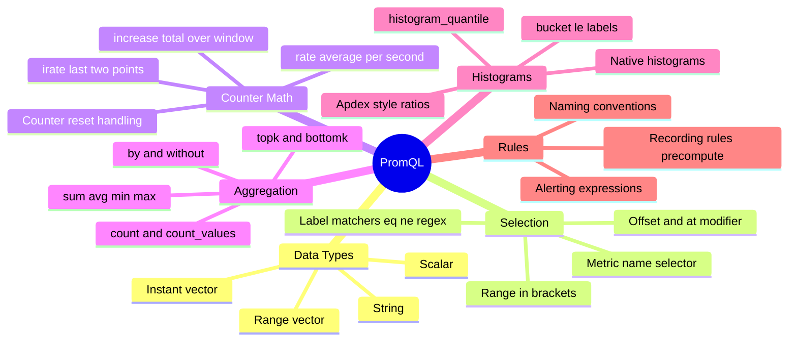
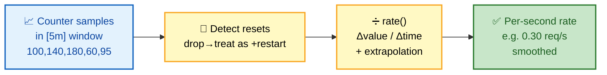
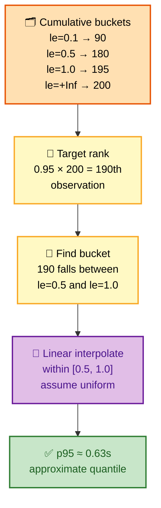

# SECTION 2: PROMQL

> **Scope:** The Prometheus query language — instant vs range vectors, selectors, `rate`/`irate`/`increase` and counter math, aggregation operators, histograms & quantiles, recording rules, and the query patterns interviewers actually ask you to reason about.

---

## Table of Contents

1. [The Four PromQL Data Types](#1-the-four-promql-data-types)
2. [Selectors & Matchers](#2-selectors--matchers)
3. [rate, irate, increase — Counter Math](#3-rate-irate-increase--counter-math)
4. [Aggregation Operators](#4-aggregation-operators)
5. [Histograms & Quantiles](#5-histograms--quantiles)
6. [Recording Rules](#6-recording-rules)
7. [Common Query Patterns](#7-common-query-patterns)
8. [Interview Questions & Answers](#interview-questions--answers)
9. [Troubleshooting Scenarios](#troubleshooting-scenarios)
10. [Documentation Links](#documentation-links)

---

## 🗺️ Visual Overview

**In one line:** PromQL selects series with label matchers, turns raw counters into rates over a time
window, aggregates across labels, and — for latency — reconstructs approximate quantiles from
pre-bucketed histograms.

**Mind map — the whole section at a glance:**



**rate() over a range vector — how a counter becomes a per-second rate** (blue = raw, yellow = compute, green = result):



**histogram_quantile — how p95 is computed from buckets** (orange = stored buckets, purple = interpolation, green = answer):



> 🧠 **Memory hooks (mnemonics):**
> - **`rate` vs `irate`:** **rate** = **r**eliable average (whole window, use for alerting/graphs);
>   **irate** = **i**nstant/last-two-points (spiky, use for fast-moving debug graphs only).
> - **Always `rate()` a counter before aggregating:** *"rate then sum, never sum then rate"* — summing
>   raw counters across restarting instances gives garbage.
> - **Histogram quantile inputs:** you feed `histogram_quantile()` the **`rate()` of the `_bucket`
>   series**, grouped **`by (le)`**. "Rate the buckets, keep the le."
> - **Range needs `[ ]`:** only functions that take a **range vector** (rate, increase, avg_over_time)
>   use `[5m]`. Bare selectors are instant vectors.

---

## 1. The Four PromQL Data Types

> 🎯 **Interview weight: High** — the instant-vs-range distinction underlies every function error.

**In one line:** PromQL has four types — **instant vector** (one value per series *now*), **range
vector** (many values per series over a window), **scalar** (a single number), and **string** — and
most "parse error" confusion is feeding the wrong one to a function.

| Type | Looks like | Meaning |
|---|---|---|
| **Instant vector** | `http_requests_total` | One sample per matching series at the eval time |
| **Range vector** | `http_requests_total[5m]` | All samples per series in the last 5 min |
| **Scalar** | `0.95`, `scalar(x)` | A single numeric value, no labels |
| **String** | `"prod"` | Literal string (rare; label functions) |

**The critical rule:** functions like `rate()`, `increase()`, `*_over_time()` require a **range
vector** (`[5m]`). Operators like `+`, `sum()`, comparisons require **instant vectors**. You cannot
graph a range vector directly — you must collapse it with a function first.

```promql
http_requests_total          # instant vector — graphable
http_requests_total[5m]      # range vector — NOT directly graphable
rate(http_requests_total[5m])  # range → instant via rate(); graphable ✅
```

> ⚠️ `Error: expected type instant vector ... got range vector` almost always means you left a `[5m]`
> where a function should have consumed it (or forgot the `rate()` wrapper).

**`offset` and `@` modifier:** `offset 1h` shifts the lookback (compare now vs 1h ago); `@` pins the
eval to an absolute timestamp (for stable week-over-week comparisons).

```promql
# Traffic now vs the same metric one week ago
sum(rate(http_requests_total[5m]))
  / sum(rate(http_requests_total[5m] offset 1w))
```

---

## 2. Selectors & Matchers

> 🎯 **Interview weight: Medium-High** — regex matchers and anchoring trip people up.

**In one line:** A selector filters series by label; matchers are `=` (equal), `!=` (not equal),
`=~` (regex match), `!~` (regex not-match), and the metric name is just `__name__`.

```promql
http_requests_total{job="api"}                 # exact
http_requests_total{status=~"5.."}             # regex: any 5xx
http_requests_total{status!~"2..|3.."}         # not 2xx or 3xx
{__name__=~"node_.*", instance="host1:9100"}   # select by name pattern
```

**Key gotchas:**

- **Regex is fully anchored.** `status=~"5.."` is implicitly `^5..$` — it must match the *entire* value.
  `status=~"5"` matches nothing unless the value is exactly `"5"`.
- **Empty-label matching:** `{env=""}` matches series that **don't have** the `env` label at all (or
  have it empty). Useful to catch un-labeled series.
- **At least one non-empty matcher is required** — you can't select `{}` with only negative/empty
  matchers on some setups; give the engine something to seed the postings-list intersection.

> 💡 Matchers resolve against the **inverted index** (Section 1): each `label="value"` pair maps to a
> postings list, and the engine intersects them. Fewer, more selective matchers = faster query.

---

## 3. rate, irate, increase — Counter Math

> 🎯 **Interview weight: Very High** — "explain `rate()` and why not just subtract" is a staple.

**In one line:** Counters only go up (and reset to 0 on restart), so you never read them directly —
`rate()` computes the **per-second average increase** over a range window, transparently correcting
for resets and extrapolating to the window edges.

**The three functions:**

| Function | Uses | Output | Use for |
|---|---|---|---|
| `rate(c[5m])` | All points in window, averaged | per-second rate | Graphs, alerts (smooth) |
| `irate(c[5m])` | **Last two** points only | per-second rate | Fast, volatile debug graphs |
| `increase(c[5m])` | First→last delta over window | total count over window | "How many in the last 5m" |

`increase(c[5m])` is exactly `rate(c[5m]) * 300`. Same computation, different units.

**Two things `rate()` does under the hood that interviewers love:**

1. **Counter reset correction.** If a sample is *lower* than the previous one, the counter reset
   (process restart). `rate()` assumes it climbed from 0 and adds the delta, so a restart doesn't show
   up as a huge negative spike.
2. **Extrapolation.** The first/last samples rarely align exactly with the window edges, so `rate()`
   extrapolates the rate out to the boundaries — which is why `increase()` can return non-integers
   like `7.3`.

⚠️ **The `rate()` interval rule:** the range `[Xm]` must be **≥ 4× the scrape interval** (needs ≥2
samples, ideally ≥4 for reset detection). With a 15s scrape, `rate(...[1m])` (4 samples) is the floor;
`[5m]` is the safe default. Too short → gaps/NaN; too long → over-smoothed, laggy alerts.

> 💡 **Golden rule: `rate()` BEFORE aggregation.** Each instance's counter resets independently. If
> you `sum()` raw counters across instances and *then* rate, a single restart corrupts the whole sum.
> Always: `sum(rate(...))`, never `rate(sum(...))`.

```promql
# ✅ Correct: rate per series, then sum
sum(rate(http_requests_total[5m]))

# ❌ Wrong: sum resets together, rate sees garbage
rate(sum(http_requests_total)[5m:])
```

🔍 **Why can't I just do `c - c offset 5m`?** That ignores counter resets (goes negative on restart)
and doesn't normalize to per-second. `rate()` exists precisely to handle both.

---

## 4. Aggregation Operators

> 🎯 **Interview weight: High** — `by` vs `without` and "aggregate what exactly" come up constantly.

**In one line:** Aggregation operators collapse an instant vector across labels — `sum`, `avg`, `min`,
`max`, `count`, `topk`, `quantile` — and `by`/`without` control which labels **survive** the collapse.

| Operator | Does |
|---|---|
| `sum` / `avg` / `min` / `max` | Arithmetic collapse across series |
| `count` | Number of series (e.g., how many instances) |
| `count_values("v", x)` | Histogram of values — count series per distinct value |
| `topk(k, x)` / `bottomk(k, x)` | k highest/lowest series (keeps labels) |
| `quantile(0.9, x)` | φ-quantile **across series** (not time) |
| `stddev` / `stdvar` | Spread across series |

**`by` vs `without`:**

- `sum by (job, status) (...)` — keep only `job` and `status`; collapse everything else.
- `sum without (instance) (...)` — collapse only `instance`; keep all other labels.

```promql
# Requests/sec per job and status code (instance collapsed away)
sum by (job, status) (rate(http_requests_total[5m]))

# Error ratio per job
sum by (job) (rate(http_requests_total{status=~"5.."}[5m]))
  /
sum by (job) (rate(http_requests_total[5m]))

# The 3 pods burning the most CPU right now
topk(3, rate(container_cpu_usage_seconds_total[5m]))
```

> 💡 **`without` is more maintainable** — it survives new labels automatically (you only name what to
> drop), whereas `by` silently drops any new label someone adds later.

⚠️ **`quantile()` the operator ≠ `histogram_quantile()` the function.** `quantile(0.9, x)` takes the
90th percentile *across the set of series* at one instant (e.g., "the 90th-percentile instance by
CPU"). `histogram_quantile()` estimates a latency percentile *within one thing's distribution*. They
answer completely different questions.

---

## 5. Histograms & Quantiles

> 🎯 **Interview weight: Very High** — latency percentiles are the #1 PromQL deep-dive topic.

**In one line:** A Prometheus **histogram** pre-buckets observations into cumulative `_bucket{le="..."}`
counters at scrape time, and `histogram_quantile()` reconstructs an *approximate* percentile by
linearly interpolating within the bucket where the target rank falls.

**What a histogram actually stores** — three series families:

```text
http_request_duration_seconds_bucket{le="0.1"}   90    # ≤ 0.1s   (cumulative!)
http_request_duration_seconds_bucket{le="0.5"}   180
http_request_duration_seconds_bucket{le="1.0"}   195
http_request_duration_seconds_bucket{le="+Inf"}  200   # total count
http_request_duration_seconds_sum                112.4 # sum of all observed values
http_request_duration_seconds_count              200   # == the +Inf bucket
```

**Buckets are cumulative** (`le` = "less than or equal"): the `le="0.5"` bucket counts *everything*
≤ 0.5s, including what's in `le="0.1"`. This is what makes interpolation possible.

**Computing p95:**

```promql
histogram_quantile(
  0.95,
  sum by (le) (rate(http_request_duration_seconds_bucket[5m]))
)
```

Read it inside-out:
1. `rate(..._bucket[5m])` — per-second rate of each cumulative bucket (so it reflects *recent* traffic).
2. `sum by (le)` — aggregate buckets across instances, **keeping `le`** (the quantile math needs it).
3. `histogram_quantile(0.95, ...)` — find the bucket containing the 95th-percentile observation and
   **linearly interpolate** inside it.

**Accuracy is bounded by your bucket layout:**

| Situation | Result |
|---|---|
| Target percentile lands in a wide bucket | Large interpolation error |
| Percentile beyond your largest finite `le` | Returns the `+Inf` boundary — **can't see past it** |
| Well-chosen buckets around your SLO | Good approximation |

⚠️ **You cannot aggregate `summary` quantiles.** A **summary** computes φ-quantiles *client-side* and
exports `{quantile="0.95"}` directly — but those are per-instance and **mathematically cannot be
averaged** across instances (you can't average percentiles). Histograms win in distributed systems
precisely because their *buckets* are additive.

| | Histogram | Summary |
|---|---|---|
| Quantile computed | Server-side, at query (`histogram_quantile`) | Client-side, at scrape |
| Aggregatable across instances | ✅ Yes (buckets are additive) | ❌ No (can't average quantiles) |
| Cost | More series (one per bucket) | Cheaper series, costly client CPU |
| Flexibility | Any quantile at query time | Fixed quantiles chosen up front |

> 💡 **Native (sparse) histograms** are the modern answer: a single series with exponentially-spaced,
> dynamically-created buckets — far higher resolution at a fraction of the series count. If asked
> "how do you fix histogram cardinality/resolution," this is the headline.

🔍 **Apdex / SLO ratio** — a bucket doubles as an SLO counter for free:
```promql
# Fraction of requests served within 300ms
sum(rate(http_request_duration_seconds_bucket{le="0.3"}[5m]))
  / sum(rate(http_request_duration_seconds_count[5m]))
```

---

## 6. Recording Rules

> 🎯 **Interview weight: Medium-High** — "how do you speed up an expensive dashboard/alert?"

**In one line:** A **recording rule** pre-computes an expensive expression on the
`evaluation_interval` and stores the result as a **new time series**, so dashboards and alerts read a
cheap single series instead of re-running the heavy query every refresh.

```yaml
# rules/recording.yml
groups:
  - name: api_slo
    interval: 30s
    rules:
      - record: job:http_requests:rate5m           # naming: level:metric:operation
        expr: sum by (job) (rate(http_requests_total[5m]))

      - record: job:http_errors:ratio_rate5m
        expr: |
          sum by (job) (rate(http_requests_total{status=~"5.."}[5m]))
            / sum by (job) (rate(http_requests_total[5m]))
```

**Naming convention:** `level:metric:operations` — aggregation level (`job`), the metric, and what was
done (`rate5m`). Colons are **reserved for recording rules** (never appear in raw exporter metrics),
which is how you instantly recognize a pre-computed series.

**Why it matters:**
- **Speed** — a dashboard panel evaluating a 50-series histogram quantile every 10s becomes a single
  stored series lookup.
- **Consistency** — alerts and dashboards reference the *same* recorded series, so they never disagree.
- **Long-range queries** — precomputed rates survive downsampling better than raw counters.

> ⚠️ Recording rules run on `evaluation_interval` and write real series — they add to cardinality and
> load. Record what's *reused*, not everything. Rule evaluation order within a group is sequential, so
> a rule can depend on one recorded earlier in the same group.

---

## 7. Common Query Patterns

> 🎯 **Interview weight: High** — expect to *write* 2–3 of these live.

**The RED method (request-driven services):**
```promql
# Rate
sum by (job) (rate(http_requests_total[5m]))
# Errors (ratio)
sum by (job) (rate(http_requests_total{status=~"5.."}[5m]))
  / sum by (job) (rate(http_requests_total[5m]))
# Duration (p99)
histogram_quantile(0.99, sum by (le,job) (rate(http_request_duration_seconds_bucket[5m])))
```

**The USE method (resources):**
```promql
# Utilization: CPU %
100 * (1 - avg by (instance) (rate(node_cpu_seconds_total{mode="idle"}[5m])))
# Saturation: run-queue / load
node_load1 / on(instance) count by (instance) (node_cpu_seconds_total{mode="idle"})
# Errors: NIC errors/sec
rate(node_network_receive_errs_total[5m])
```

**Memory available %:**
```promql
100 * node_memory_MemAvailable_bytes / node_memory_MemTotal_bytes
```

**Disk will fill in < 4h (predict_linear):**
```promql
predict_linear(node_filesystem_avail_bytes{mountpoint="/"}[6h], 4*3600) < 0
```

**Per-second aggregate across a fleet, ignoring restarts:**
```promql
sum(rate(process_cpu_seconds_total{job="api"}[5m]))
```

> 💡 `predict_linear()` fits a least-squares line over the range and projects forward — the canonical
> "alert before the disk is full," not after.

---

## Interview Questions & Answers

**1. Explain `rate()` and why you can't just subtract two counter values.**
**Crisp:** `rate()` is the per-second average increase over a range window, with reset correction and
edge extrapolation. **Internals:** raw subtraction goes negative when the process restarts (counter →
0) and isn't normalized per second; `rate()` treats a drop as a reset (climbed from 0) and extrapolates
to the window edges (why `increase()` returns non-integers). **Follow-up (window size):** pick `[5m]`
≥ 4× scrape interval so there are enough samples to detect resets without over-smoothing.

**2. Why must you `rate()` before `sum()`, not after?**
**Crisp:** counters reset per instance; summing raw counters then rating corrupts on any restart.
**Internals:** `sum(rate(x))` rates each series independently (each handles its own reset) then adds
the clean per-second rates; `rate(sum(x))` sees the summed series drop on one restart and mis-attributes
it. **Follow-up:** this is why every RED/USE query wraps `rate()` innermost.

**3. How does `histogram_quantile` actually compute p95?**
**Crisp:** it finds which cumulative `le` bucket contains the 95th-percentile observation and linearly
interpolates within it. **Internals:** you feed it `sum by (le) (rate(..._bucket[5m]))`; buckets are
cumulative counts, so it locates the bucket where the running count crosses 0.95×total and assumes a
uniform distribution inside that bucket. **Follow-up (accuracy):** error is bounded by bucket width;
a percentile beyond your largest finite `le` just returns that boundary — you're blind past it.

**4. Histogram vs summary — which for a distributed service and why?**
**Crisp:** histogram, because its buckets are additive across instances. **Internals:** a summary
computes quantiles client-side per instance, and percentiles can't be averaged — so you can't get a
fleet-wide p99 from summaries; histogram buckets `sum by (le)` cleanly. **Follow-up:** the cost is more
series per histogram; native/sparse histograms fix that with dynamic exponential buckets.

**5. What's the difference between an instant vector and a range vector?**
**Crisp:** instant = one value per series now; range = all values per series over `[window]`.
**Internals:** range vectors exist only to feed range functions (`rate`, `*_over_time`); you can't graph
one directly. **Follow-up:** the classic "expected instant vector, got range vector" error means a
stray `[5m]` wasn't consumed by a function.

**6. `by` vs `without`, and which is safer?**
**Crisp:** `by` keeps only the named labels; `without` drops only the named labels. **Internals:** both
control which labels survive aggregation. **Follow-up:** `without(instance)` is more maintainable —
it auto-retains new labels, whereas `by` silently discards any label someone later adds.

**7. When do you use a recording rule?**
**Crisp:** to precompute an expensive, frequently-reused expression into its own series. **Internals:**
it evaluates on `evaluation_interval` and writes a `level:metric:operation`-named series that dashboards
and alerts share, ensuring consistency and speed. **Follow-up (cost):** it adds cardinality, so record
only reused expressions; group order lets later rules depend on earlier ones.

**8. How would you alert "disk full within 4 hours"?**
**Crisp:** `predict_linear(node_filesystem_avail_bytes[6h], 4*3600) < 0`. **Internals:** it least-squares
fits the last 6h and projects the trend 4h forward; negative predicted free space fires the alert.
**Follow-up:** better than a static threshold because it catches a fast-filling disk early and ignores
a chronically-near-full-but-stable one.

**9. Why is a regex matcher `status=~"5.."` and not `status=~"5"`?**
**Crisp:** matchers are fully anchored (`^...$`), so you must match the *whole* value. **Internals:**
`"5.."` matches a 3-char value starting with 5 (500–599); `"5"` matches only the literal `"5"`.
**Follow-up:** `{env=""}` matches series missing the label entirely — handy for catching un-labeled
series.

---

## Troubleshooting Scenarios

### Scenario 1: "My `rate()` graph is full of gaps/NaN."
**Symptom:** `rate(http_requests_total[1m])` renders dotted/empty on a 60s-scrape target.
**Cause:** the range window has < 2 samples (needs ≥2, ideally ≥4). With a 60s scrape, `[1m]` yields
only one point per window.
**Fix:** widen the window to ≥ 4× the scrape interval (`[5m]` for a 60s scrape), or scrape more
frequently.

---

### Scenario 2: "p99 latency shows a flat line at exactly 10s."
**Symptom:** `histogram_quantile(0.99, ...)` pins to the value of the largest finite bucket.
**Cause:** the real p99 is *above* your biggest `le` bucket (`le="10"`), so the quantile can only
report that boundary — you're blind beyond the last finite bucket.
**Fix:** add higher `le` buckets covering the tail (or switch to native histograms), then the quantile
can interpolate into the real range.

---

### Scenario 3: "Summing two datacenters' request rate looks wrong after a deploy."
**Symptom:** a total-throughput panel dips sharply during rolling restarts.
**Cause:** the query does `rate(sum(...))` — summed counters drop when pods restart, so `rate()` sees a
reset in the aggregate.
**Fix:** rewrite as `sum(rate(...))` so each pod's reset is handled before aggregation; the fleet total
stays smooth through restarts.

---

## Documentation Links

| Topic | Link |
|---|---|
| Querying basics | https://prometheus.io/docs/prometheus/latest/querying/basics/ |
| Query functions | https://prometheus.io/docs/prometheus/latest/querying/functions/ |
| Operators (aggregation) | https://prometheus.io/docs/prometheus/latest/querying/operators/ |
| Histograms & quantiles | https://prometheus.io/docs/practices/histograms/ |
| Recording rules | https://prometheus.io/docs/prometheus/latest/configuration/recording_rules/ |
| Native histograms | https://prometheus.io/docs/specs/native_histograms/ |
| Query examples | https://prometheus.io/docs/prometheus/latest/querying/examples/ |

---

*Continue to [03-ALERTING.md](./03-ALERTING.md) for Section 3 (Alerting).*
