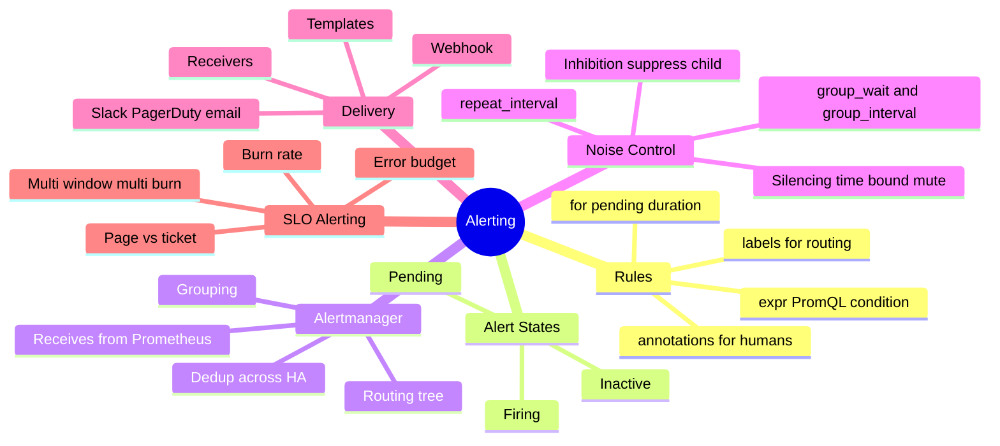
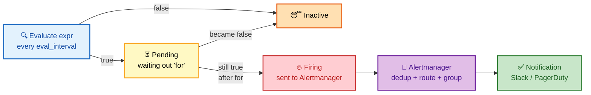
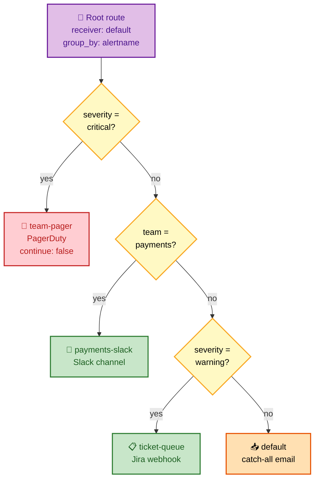

# SECTION 3: ALERTING

> **Scope:** How alerts fire and get delivered — alerting rules and the `for` clause, Alertmanager architecture, the routing tree, grouping, inhibition, silencing, receivers, HA dedup, and multi-burn-rate SLO alerts.

---

## Table of Contents

1. [Alerting Rules & the `for` Clause](#1-alerting-rules--the-for-clause)
2. [Prometheus vs Alertmanager — Division of Labor](#2-prometheus-vs-alertmanager--division-of-labor)
3. [The Routing Tree](#3-the-routing-tree)
4. [Grouping](#4-grouping)
5. [Inhibition & Silencing](#5-inhibition--silencing)
6. [Receivers & Notification Pipeline](#6-receivers--notification-pipeline)
7. [Multi-Burn-Rate SLO Alerts](#7-multi-burn-rate-slo-alerts)
8. [Interview Questions & Answers](#interview-questions--answers)
9. [Troubleshooting Scenarios](#troubleshooting-scenarios)
10. [Documentation Links](#documentation-links)

---

## 🗺️ Visual Overview

**In one line:** Prometheus *evaluates* alert expressions and pushes firing alerts to Alertmanager;
Alertmanager *routes* them through a tree, groups related ones, suppresses noise via inhibition and
silences, deduplicates across HA pairs, and delivers to receivers.

**Mind map — the whole section at a glance:**



**Alert lifecycle — inactive to firing to delivered** (blue = eval, yellow = pending, red = firing, green = delivered):



**The routing tree — how one alert finds its receiver** (purple = route nodes, green = matched receiver, red = critical path):



> 🧠 **Memory hooks (mnemonics):**
> - **Two brains:** *Prometheus decides, Alertmanager delivers.* Rules live in Prometheus; routing,
>   grouping, and silencing live in Alertmanager.
> - **`for` = "prove it":** the `for` clause makes an alert stay true for a duration before firing —
>   "**for** a while, not just a blip." Kills flapping.
> - **Inhibit vs silence:** **inhibit** = *automatic* (a parent alert mutes children by rule);
>   **silence** = *manual* (a human mutes a matcher for a time window during maintenance).
> - **Grouping timers:** **`group_wait`** (hold the *first* batch), **`group_interval`** (add *new*
>   members), **`repeat_interval`** (re-page if *still* firing). "Wait, add, repeat."

---

## 1. Alerting Rules & the `for` Clause

> 🎯 **Interview weight: High** — the `for` clause and pending/firing states are must-knows.

**In one line:** An alerting rule is a PromQL expression plus a `for` duration; when the expression
returns any series continuously for `for`, each result series becomes a **firing alert** carrying its
labels (for routing) and annotations (for humans).

```yaml
# rules/alerts.yml
groups:
  - name: availability
    rules:
      - alert: HighErrorRate
        expr: |
          sum by (job) (rate(http_requests_total{status=~"5.."}[5m]))
            / sum by (job) (rate(http_requests_total[5m])) > 0.05
        for: 10m                         # must hold 10m before firing
        labels:
          severity: critical             # drives routing in Alertmanager
          team: payments
        annotations:
          summary: "High 5xx rate on {{ $labels.job }}"
          description: "{{ $labels.job }} error ratio is {{ $value | humanizePercentage }}"
```

**The three states of an alert:**

| State | Meaning |
|---|---|
| **Inactive** | Expression returns nothing |
| **Pending** | Expression is true but `for` hasn't elapsed yet — **not** sent to Alertmanager |
| **Firing** | True continuously for `for` — sent to Alertmanager on every eval |

**Why `for` matters:** it debounces transient spikes. A 30s blip of errors shouldn't page anyone; `for:
10m` demands the condition *persist* before it's real. The trade-off is detection latency — the alert
fires `for` seconds *after* the problem starts, so critical fast-burn alerts use short `for`.

> 💡 **Labels route, annotations inform.** Alertmanager only ever routes/groups on **labels**;
> annotations (`summary`, `description`, runbook links) are for the human reading the page. Put
> `severity`/`team` in labels, prose in annotations.

⚠️ **`for` resets on any gap.** If the expression returns *no* series for even one evaluation during
the pending window, the timer restarts from zero. A flapping condition can stay pending forever and
never page — sometimes a bug, sometimes desired.

---

## 2. Prometheus vs Alertmanager — Division of Labor

> 🎯 **Interview weight: High** — "why two components?" is a favorite architecture question.

**In one line:** Prometheus **evaluates** rules and knows nothing about Slack/PagerDuty; Alertmanager
**receives** firing alerts and owns all the delivery logic — routing, grouping, dedup, inhibition,
silencing, and receiver integrations.

| Concern | Prometheus | Alertmanager |
|---|---|---|
| Evaluate PromQL alert expr | ✅ | ❌ |
| Track pending/firing (`for`) | ✅ | ❌ |
| Routing to teams | ❌ | ✅ |
| Grouping related alerts | ❌ | ✅ |
| Dedup across HA Prometheis | ❌ | ✅ |
| Inhibition & silencing | ❌ | ✅ |
| Send to Slack/PagerDuty/email | ❌ | ✅ |

**The wire protocol:** Prometheus **pushes** the full set of currently-firing alerts to Alertmanager's
`/api/v2/alerts` **every evaluation interval** (not once per state change). Alertmanager treats this as
the source of truth and figures out what's new, ongoing, or resolved. This repeated-push design is why
Alertmanager (not Prometheus) can deduplicate: two HA Prometheis both push the same alerts, and
Alertmanager collapses them.

```yaml
# prometheus.yml — pointing at an HA Alertmanager cluster
alerting:
  alertmanagers:
    - static_configs:
        - targets: ["am-1:9093", "am-2:9093", "am-3:9093"]
```

> 🔍 **Why decouple?** So multiple Prometheus servers (HA, sharded, federated) can share one alert
> delivery layer with consistent routing/silencing, and so delivery logic evolves independently of the
> scrape/eval engine.

---

## 3. The Routing Tree

> 🎯 **Interview weight: Very High** — you will likely trace an alert through a routing tree live.

**In one line:** The routing tree is a hierarchy of `match`/`matchers` rules; each firing alert enters
at the root and walks down, and the **first matching leaf** (respecting `continue`) picks the receiver
and grouping.

```yaml
# alertmanager.yml
route:
  receiver: default-email          # root: catch-all
  group_by: ['alertname', 'cluster']
  group_wait: 30s
  group_interval: 5m
  repeat_interval: 4h
  routes:
    - matchers: [ severity="critical" ]
      receiver: pagerduty
      continue: false              # stop here; don't also email
    - matchers: [ team="payments" ]
      receiver: payments-slack
      group_by: ['alertname', 'service']   # override grouping for this subtree
    - matchers: [ severity="warning" ]
      receiver: jira-tickets
```

**Matching semantics — the rules that trip people up:**

- **First match wins** among sibling routes, but matching then **descends into that node's child
  routes** too.
- **`continue: true`** lets an alert *also* be evaluated by subsequent sibling routes — used to send
  one alert to multiple receivers (page *and* log).
- **Child routes inherit** `group_by`, timers, and receiver from the parent unless overridden.
- A route with no matchers under the root is the **catch-all** — always have one so nothing is silently
  dropped.

> 💡 **Trace mnemonic:** start at root → find first child whose matchers all match → if that child has
> its own children, recurse → the deepest matching node's receiver wins. `continue` is the only thing
> that lets an alert hit more than one branch.

⚠️ **Order-sensitive:** put the most specific/critical routes first. If a broad `severity="warning"`
route precedes a specific `team="payments"` one and both match, the warning route can capture it first
(unless `continue`). Read top-to-bottom like a firewall ruleset.

---

## 4. Grouping

> 🎯 **Interview weight: High** — grouping is *the* answer to "how do you avoid alert storms?"

**In one line:** Grouping batches alerts sharing the `group_by` labels into a **single notification**,
so one bad deploy that trips 200 pods sends *one* grouped page instead of 200.

**The three timers that govern a group:**

| Timer | Controls | Typical |
|---|---|---|
| `group_wait` | How long to wait after the **first** alert in a new group before sending (lets siblings arrive) | 30s |
| `group_interval` | Minimum gap before sending an **update** when *new* alerts join an existing group | 5m |
| `repeat_interval` | How often to **re-send** a still-firing group (nag cadence) | 4h |

**Worked example:** a node dies, 50 pods on it start alerting. With `group_by: ['cluster']` and
`group_wait: 30s`, Alertmanager holds the first alert 30s, collects the other 49, and sends **one**
notification: "50 alerts in cluster prod." As more pods on the same node fail over the next minutes,
`group_interval` batches those into periodic updates. If the node stays down, `repeat_interval` re-pages
every 4h so it's not forgotten.

```yaml
route:
  group_by: ['alertname', 'cluster', 'namespace']   # what defines "the same incident"
  group_wait: 30s
  group_interval: 5m
  repeat_interval: 4h
```

> ⚠️ **`group_by: ['...']` choice is a design decision.** Too coarse (`['cluster']`) merges unrelated
> incidents into one confusing page; too fine (`['instance']`) recreates the storm. Group by what
> makes alerts *the same actionable incident*. `group_by: ['...']` with `'...'` = special value
> groups **all** alerts of a route into one notification.

---

## 5. Inhibition & Silencing

> 🎯 **Interview weight: High** — the inhibit-vs-silence distinction is a classic differentiator.

**In one line:** **Inhibition** automatically suppresses a *dependent* alert when a *higher-level* one
is firing (rule-based); **silencing** manually mutes matching alerts for a bounded time window
(human-initiated, e.g., maintenance).

**Inhibition** — "if the whole cluster is down, don't also page me for every service in it":

```yaml
inhibit_rules:
  - source_matchers: [ severity="critical", alertname="ClusterDown" ]
    target_matchers: [ severity="warning" ]
    equal: ['cluster']        # only inhibit targets sharing the same cluster label
```

The `equal` clause is essential: it scopes inhibition to alerts sharing the listed label values — a
`ClusterDown` in `prod` inhibits only `prod` warnings, not `staging`.

**Silencing** — a human mutes alerts during a planned change:

```bash
amtool silence add \
  alertname="HighErrorRate" cluster="prod" \
  --duration=2h \
  --comment="DB maintenance window - ticket OPS-1234" \
  --author="oncall@corp"
```

| | Inhibition | Silencing |
|---|---|---|
| Trigger | Another **alert** firing | A **human** action |
| Duration | As long as the source fires | Fixed time window |
| Use case | Dependency suppression (cascade) | Maintenance, known issues |
| Config | `inhibit_rules` (static) | API/UI/`amtool` (dynamic) |

> 💡 Silences are matched by labels and are **time-bounded** — they auto-expire, which is the whole
> point (a silence that never expires is how real alerts get missed). Always set a duration + comment.

---

## 6. Receivers & Notification Pipeline

> 🎯 **Interview weight: Medium** — know the common receivers and HA dedup.

**In one line:** A **receiver** is a named delivery target (Slack, PagerDuty, email, webhook, etc.);
the notification pipeline dedups, groups, and renders a template, then dispatches to the receiver's
integration.

```yaml
receivers:
  - name: pagerduty
    pagerduty_configs:
      - routing_key: "<integration-key>"
        severity: "{{ .CommonLabels.severity }}"
  - name: payments-slack
    slack_configs:
      - api_url: "<webhook-url>"
        channel: "#payments-alerts"
        title: "{{ .CommonAnnotations.summary }}"
        text: "{{ range .Alerts }}{{ .Annotations.description }}\n{{ end }}"
  - name: jira-tickets
    webhook_configs:
      - url: "http://jira-bridge:8080/create"
```

**HA deduplication:** in an Alertmanager **cluster** (3 nodes gossiping over a mesh), all nodes receive
the same alerts from all Prometheis, but they coordinate via a gossip protocol so **exactly one**
notification is sent per group. Each node waits a small, position-based delay; the first to send tells
the others (via gossip) that it's handled, suppressing duplicates. This is why you run
*Alertmanager* in a cluster but *Prometheus* as independent replicas.

> ⚠️ A common outage: running two Alertmanagers **not** clustered (no `--cluster.peer` flags) → both
> send every notification → duplicate pages. HA Alertmanager *requires* the gossip mesh to dedup.

---

## 7. Multi-Burn-Rate SLO Alerts

> 🎯 **Interview weight: Very High (senior/SRE)** — the modern, Google-SRE-book alerting pattern.

**In one line:** Instead of alerting on a raw error-rate threshold, you alert on **how fast you're
burning your error budget** across multiple time windows — a fast window to catch acute outages and a
slow window to catch chronic degradation — which cuts both false pages and missed slow burns.

**Error budget basics:** a 99.9% availability SLO allows **0.1%** errors — that's your **error budget**.
**Burn rate** = how many times faster than "sustainable" you're consuming it. Burn rate 1 = you'll
exactly exhaust the budget over the SLO window (e.g., 30d); burn rate 14.4 = you'd exhaust a month's
budget in ~2 days.

**Why multiple windows + rates:**

| Scenario | Single-threshold problem | Multi-burn-rate fix |
|---|---|---|
| Brief total outage | 5% threshold may not trip in 5m avg | Fast window (5m) + high burn (14.4) pages instantly |
| Slow 0.2% chronic errors | Never crosses a 5% line | Slow window (1h/6h) + low burn (3) tickets it |
| Flaky metric | Fires and resolves repeatedly | Require **both** a long and short window to agree |

**The canonical two-tier rules:**

```yaml
groups:
  - name: slo-burn
    rules:
      # FAST BURN → page: budget for 30d gone in ~2 days
      - alert: ErrorBudgetFastBurn
        expr: |
          (
            sum(rate(http_requests_total{status=~"5.."}[5m]))
              / sum(rate(http_requests_total[5m]))
          ) > (14.4 * 0.001)
          and
          (
            sum(rate(http_requests_total{status=~"5.."}[1h]))
              / sum(rate(http_requests_total[1h]))
          ) > (14.4 * 0.001)
        for: 2m
        labels: { severity: critical }

      # SLOW BURN → ticket: chronic low-grade errors
      - alert: ErrorBudgetSlowBurn
        expr: |
          (
            sum(rate(http_requests_total{status=~"5.."}[30m]))
              / sum(rate(http_requests_total[30m]))
          ) > (3 * 0.001)
          and
          (
            sum(rate(http_requests_total{status=~"5.."}[6h]))
              / sum(rate(http_requests_total[6h]))
          ) > (3 * 0.001)
        for: 15m
        labels: { severity: warning }
```

The `0.001` is `1 - SLO` (0.1% budget for 99.9%). Each alert requires a **short AND long window** to
both exceed the burn threshold — the long window confirms it's real, the short window confirms it's
*still* happening (so it resolves quickly when fixed).

> 💡 **The payoff:** fast burn *pages* a human (acute), slow burn opens a *ticket* (chronic), and the
> two-window `and` keeps a single flaky spike from paging. This is the pattern to name when asked "how
> do you design good SLO alerts."

🔍 **Standard burn-rate/window pairs** (from the SRE workbook): 14.4×/(5m,1h) for the page,
6×/(30m,6h) and 3×/(2h,1d) for tickets — tuned so total budget-burn-to-alert is consistent.

---

## Interview Questions & Answers

**1. Why are Prometheus and Alertmanager separate components?**
**Crisp:** Prometheus evaluates alert expressions; Alertmanager owns delivery (routing, grouping,
dedup, silencing). **Internals:** Prometheus pushes the full firing set every eval interval to
Alertmanager, which makes dedup across HA replicas possible and lets many Prometheis share one delivery
layer. **Follow-up:** delivery logic (new receivers, routing changes) then evolves independently of the
scrape/eval engine.

**2. What does the `for` clause do and what's the trade-off?**
**Crisp:** it requires the alert expression to stay true continuously for a duration before firing,
debouncing blips. **Internals:** the alert sits in **Pending** during that window and isn't sent to
Alertmanager; any evaluation gap resets the timer. **Follow-up:** the cost is detection latency, so
fast-burn critical alerts use a short `for` while noisy warnings use a longer one.

**3. Explain grouping and the three timers.**
**Crisp:** grouping batches alerts sharing `group_by` labels into one notification. **Internals:**
`group_wait` holds the first alert so siblings arrive, `group_interval` paces updates when new members
join, `repeat_interval` re-sends a still-firing group. **Follow-up:** `group_by` granularity is a design
call — too coarse merges unrelated incidents, too fine recreates the storm.

**4. Inhibition vs silencing?**
**Crisp:** inhibition is automatic rule-based suppression of dependent alerts when a higher-level one
fires; silencing is a human muting matchers for a bounded time. **Internals:** inhibition's `equal`
scopes it to shared labels (e.g., same cluster); silences are label-matched and auto-expire.
**Follow-up:** you inhibit per-service warnings under a `ClusterDown`; you silence during planned
maintenance with a comment + duration.

**5. How does Alertmanager avoid duplicate pages when you run it HA?**
**Crisp:** Alertmanager nodes form a gossip cluster and coordinate so exactly one notification per group
is sent. **Internals:** each node applies a position-based delay and gossips "handled" to peers,
suppressing duplicates; Prometheus stays independent replicas, Alertmanager is the clustered part.
**Follow-up (failure mode):** forgetting `--cluster.peer` flags means uncoordinated nodes each send →
duplicate pages.

**6. How do labels vs annotations differ in an alerting rule?**
**Crisp:** labels drive routing/grouping/dedup; annotations are human-facing text. **Internals:**
Alertmanager only matches on labels; annotations (`summary`, runbook URL) render into the notification.
**Follow-up:** put `severity`/`team` in labels, prose and links in annotations — swapping them breaks
routing.

**7. Design a good SLO alert. Why not a static error-rate threshold?**
**Crisp:** use multi-burn-rate, multi-window alerts on error-budget consumption. **Internals:** a fast
window+high burn (14.4×/5m+1h) pages on acute outages, a slow window+low burn (3×/30m+6h) tickets
chronic errors, and the short-AND-long `and` prevents flaky single-spike pages. **Follow-up:** static
thresholds either page on harmless blips or miss slow 0.2% burns that still exhaust the budget.

**8. Prometheus restarts constantly during a deploy — why don't alerts flap?**
**Crisp:** `for` requires sustained truth, and Alertmanager grouping + `repeat_interval` smooth
delivery. **Internals:** transient pending alerts never reach Alertmanager, and even firing ones are
grouped into one notification rather than one-per-pod. **Follow-up:** inhibition suppresses dependent
child alerts during a known cluster-level event.

---

## Troubleshooting Scenarios

### Scenario 1: "Alert is Firing in Prometheus but no Slack message arrived."
**Symptom:** `/alerts` shows Firing; Slack silent.
**Investigation:** check Alertmanager `/#/alerts` — is it received? Any matching **silence**? Any
**inhibition**? Check `amtool config routes test severity=critical team=payments` to see which receiver
the labels route to.
**Plausible causes:** (1) an active silence matches the alert; (2) an inhibit rule suppresses it under a
higher alert; (3) routing sends it to a different/misconfigured receiver; (4) receiver webhook/API
returning errors (check Alertmanager logs).
**Fix:** expire the stray silence, correct the route matchers, or fix the receiver credentials.

---

### Scenario 2: "During an incident we got paged 300 times in 10 minutes."
**Symptom:** pager storm from one root cause (a node/AZ failure).
**Cause:** `group_by` too fine (e.g., `['instance']`) so every pod is its own notification; no
inhibition linking the node-level cause to the pod-level symptoms.
**Fix:** group by the incident dimension (`['alertname','cluster']`), add an inhibit rule so a
`NodeDown`/`ClusterDown` suppresses the per-pod warnings, and raise `group_wait` slightly to batch the
initial burst.

---

### Scenario 3: "Duplicate pages — every alert arrives twice."
**Symptom:** identical PagerDuty incidents, two of each.
**Cause:** two Alertmanagers running without clustering (missing gossip peer flags), so each delivers
independently.
**Fix:** cluster them with `--cluster.listen-address` / `--cluster.peer` so they gossip and dedup; the
two HA *Prometheis* pushing the same alerts is fine — dedup is Alertmanager's job.

---

## Documentation Links

| Topic | Link |
|---|---|
| Alerting rules | https://prometheus.io/docs/prometheus/latest/configuration/alerting_rules/ |
| Alertmanager overview | https://prometheus.io/docs/alerting/latest/alertmanager/ |
| Routing configuration | https://prometheus.io/docs/alerting/latest/configuration/#route |
| Inhibition | https://prometheus.io/docs/alerting/latest/configuration/#inhibit_rule |
| amtool (silences/routes) | https://github.com/prometheus/alertmanager#amtool |
| SLO / burn-rate alerting | https://sre.google/workbook/alerting-on-slos/ |
| HA Alertmanager | https://prometheus.io/docs/alerting/latest/alertmanager/#high-availability |

---

*Continue to [04-EXPORTERS-INSTRUMENTATION.md](./04-EXPORTERS-INSTRUMENTATION.md) for Section 4 (Exporters & Instrumentation).*
