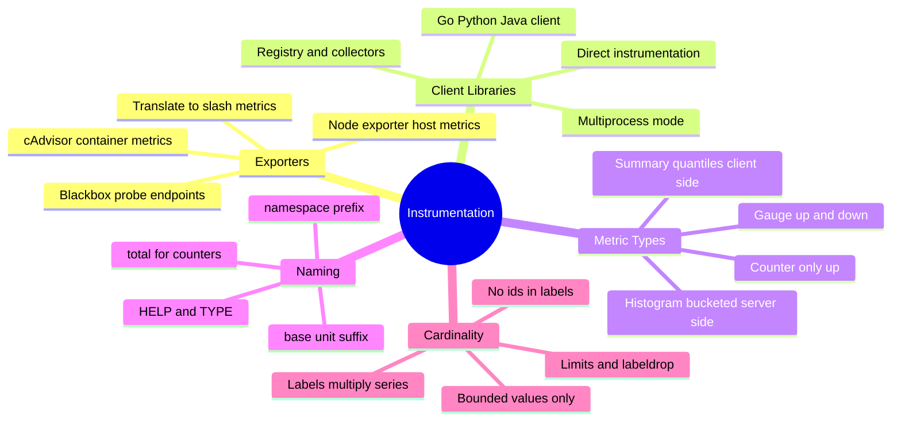
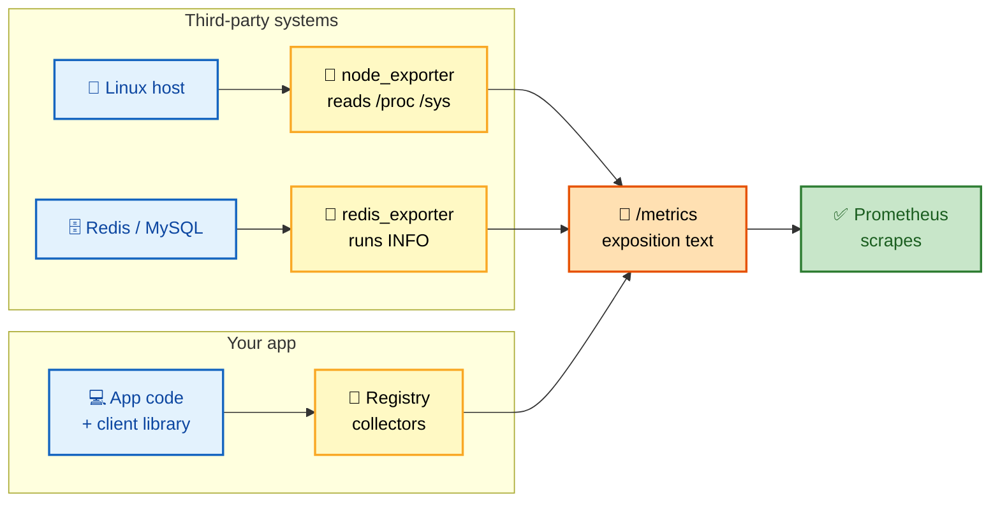
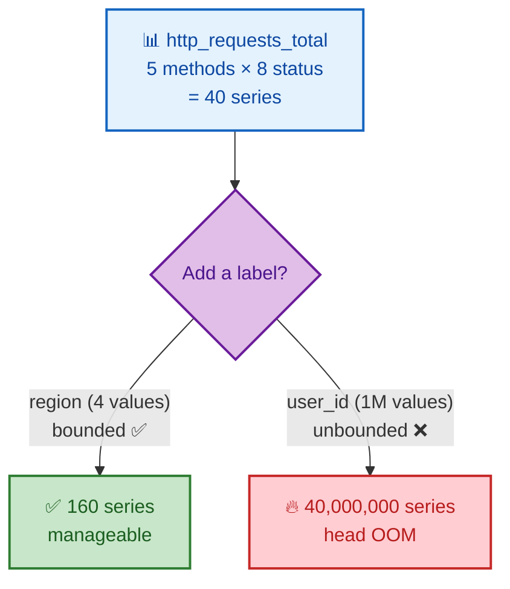

# SECTION 4: EXPORTERS & INSTRUMENTATION

> **Scope:** How metrics get *created* — exporters (node/blackbox/cAdvisor), client libraries, the four metric types (counter/gauge/histogram/summary), naming conventions, labels, and the cardinality explosion and how to prevent it.

---

## Table of Contents

1. [Exporters — The Adapter Pattern](#1-exporters--the-adapter-pattern)
2. [Node, Blackbox & cAdvisor Exporters](#2-node-blackbox--cadvisor-exporters)
3. [Client Libraries & Direct Instrumentation](#3-client-libraries--direct-instrumentation)
4. [The Four Metric Types](#4-the-four-metric-types)
5. [Naming Conventions & Labels](#5-naming-conventions--labels)
6. [Cardinality Explosion](#6-cardinality-explosion)
7. [Interview Questions & Answers](#interview-questions--answers)
8. [Troubleshooting Scenarios](#troubleshooting-scenarios)
9. [Documentation Links](#documentation-links)

---

## 🗺️ Visual Overview

**In one line:** Something must expose `/metrics` in the text format — either an **exporter** that
translates a third-party system's stats, or a **client library** embedded in your own app — and the
*type* and *labels* you choose there determine both what PromQL can compute and how much RAM the TSDB
burns.

**Mind map — the whole section at a glance:**



**Who exposes /metrics — exporter vs direct instrumentation** (blue = source, yellow = adapter, green = scrape target):



**Cardinality explosion — one bad label multiplies series** (green = safe, red = explosion):



> 🧠 **Memory hooks (mnemonics):**
> - **Four types — "Count, Gauge, spread with Histogram or Summary":** **Counter** only climbs,
>   **Gauge** goes both ways, **Histogram** buckets server-side, **Summary** quantiles client-side.
> - **`_total` = counter:** the `_total` suffix always marks a counter. See `_total`, think `rate()`.
> - **Exporter = translator:** an exporter speaks a system's native dialect (`/proc`, `INFO`, SNMP)
>   and *re-exposes* it as Prometheus text. "Adapter, not agent that pushes."
> - **Label = multiply:** every label value multiplies series count. "Labels multiply, values are
>   members of a small set."

---

## 1. Exporters — The Adapter Pattern

> 🎯 **Interview weight: Medium-High** — "how do you monitor something you can't modify?"

**In one line:** An **exporter** is a small sidecar process that reads a system's *native* stats
(`/proc`, a DB's `INFO`/`SHOW STATUS`, SNMP, an API) and re-exposes them on `/metrics` in the
Prometheus text format — an adapter that lets Prometheus's pull model reach systems that don't speak
Prometheus natively.

**Why exporters exist:** Prometheus only understands one thing — HTTP `GET /metrics` returning
exposition text. A Linux kernel, Redis, MySQL, a network switch — none of them speak that. The exporter
bridges the gap: Prometheus scrapes the *exporter*, and the exporter translates on demand.

```text
Redis  ──INFO──▶  redis_exporter  ──/metrics──▶  Prometheus scrapes
(native dialect)   (adapter)         (exposition text)
```

**Two deployment shapes:**

- **Sidecar/co-located** (node, redis, mysql exporters): runs next to the thing it observes, one
  exporter per instance. `instance` = the exporter's host:port.
- **Centralized/multi-target** (blackbox, snmp exporters): one exporter probes *many* targets; you pass
  the real target as a `?target=` param and use **relabeling** so `instance` reflects the probed target,
  not the exporter.

⚠️ The exporter itself is just another scrape target with its own `up` metric — if the exporter dies,
you lose visibility into whatever it was translating, so exporters need monitoring too.

---

## 2. Node, Blackbox & cAdvisor Exporters

> 🎯 **Interview weight: High** — these three are the ones you'll be asked about by name.

**In one line:** `node_exporter` = host/OS metrics, `blackbox_exporter` = external probing
(HTTP/TCP/ICMP/DNS from the outside), `cAdvisor` = per-container resource usage.

| Exporter | Reads | Key metrics | Answers |
|---|---|---|---|
| **node_exporter** | `/proc`, `/sys` | `node_cpu_seconds_total`, `node_memory_*`, `node_filesystem_*`, `node_load1` | "Is the host healthy?" |
| **blackbox_exporter** | Probes endpoints | `probe_success`, `probe_duration_seconds`, `probe_http_status_code`, `probe_ssl_earliest_cert_expiry` | "Is it reachable/up from outside?" |
| **cAdvisor** | cgroups, container runtime | `container_cpu_usage_seconds_total`, `container_memory_working_set_bytes` | "What's each container consuming?" |

**node_exporter** — the default host monitor. CPU is exposed as a **counter per mode** (`idle`, `user`,
`system`, `iowait`), so CPU *utilization* is derived, not stored:

```promql
# CPU utilization % per host (100% minus idle rate)
100 * (1 - avg by (instance) (rate(node_cpu_seconds_total{mode="idle"}[5m])))
```

**blackbox_exporter** — the multi-target pattern. It probes URLs you pass in; Prometheus relabels the
`?target=` param so the alert says *which site* is down, not "the exporter":

```yaml
  - job_name: "blackbox-http"
    metrics_path: /probe
    params:
      module: [http_2xx]
    static_configs:
      - targets:
          - https://example.com
          - https://api.internal/health
    relabel_configs:
      - source_labels: [__address__]
        target_label: __param_target      # pass the URL to the exporter
      - source_labels: [__param_target]
        target_label: instance             # label the series with the real URL
      - target_label: __address__
        replacement: blackbox:9115         # actually scrape the exporter
```

```promql
# Probe failing, or TLS cert expiring within 7 days
probe_success == 0
probe_ssl_earliest_cert_expiry - time() < 7 * 24 * 3600
```

**cAdvisor** — container metrics from cgroups. Note `container_memory_working_set_bytes` (not RSS) is
what the OOM killer and Kubernetes use for eviction decisions:

```promql
# Container CPU cores used
rate(container_cpu_usage_seconds_total{pod="checkout"}[5m])
# Working set approaching the limit
container_memory_working_set_bytes / container_spec_memory_limit_bytes > 0.9
```

> 💡 **Blackbox = "is it up from outside" (symptom); node/cAdvisor = "why" (cause).** Great alerting
> pairs a blackbox symptom alert with node/container cause metrics for the diagnosis.

---

## 3. Client Libraries & Direct Instrumentation

> 🎯 **Interview weight: Medium-High** — "how do you instrument your own service?"

**In one line:** For code you own, you skip the exporter and embed a **client library** (Go, Python,
Java, etc.) that maintains a **registry** of metric objects in memory and renders them to `/metrics`
on scrape — this is **direct instrumentation**.

```python
# Python client library — direct instrumentation
from prometheus_client import Counter, Histogram, start_http_server
import time

REQUESTS = Counter(
    "http_requests_total", "Total HTTP requests",
    ["method", "status"],                 # label names — keep BOUNDED
)
LATENCY = Histogram(
    "http_request_duration_seconds", "Request latency",
    buckets=[0.05, 0.1, 0.25, 0.5, 1, 2.5, 5],  # SLO-aligned buckets
)

@LATENCY.time()                            # times the block, fills buckets
def handle(request):
    REQUESTS.labels(method=request.method, status="200").inc()
    ...

start_http_server(8000)                    # exposes /metrics
```

**How it works under the hood:**
- Metric objects register into a **default registry** (a collector list).
- On each scrape, the HTTP handler iterates the registry, calls each collector, and serializes the
  current values to exposition text. **Values live in your process's memory** — a counter is just an
  atomic integer you increment.
- **No push**: the library never contacts Prometheus; it only answers scrapes (except the special
  Pushgateway case).

⚠️ **Multiprocess gotcha (Python/Gunicorn, PHP-FPM):** each worker process has its *own* registry, so a
scrape hits a random worker and sees only its counters. The fix is **multiprocess mode** (shared mmap
files aggregated at scrape time) — a very common real-world bug interviewers probe.

> 💡 Instrument at **boundaries**: inbound requests, outbound calls, queue operations, and business
> events. Don't instrument every function — you'll drown in cardinality and noise.

---

## 4. The Four Metric Types

> 🎯 **Interview weight: Very High** — choosing the right type is a core competency signal.

**In one line:** **Counter** (monotonic, only increases — rate it), **Gauge** (can go up or down — read
it directly), **Histogram** (buckets observations server-aggregatably), **Summary** (client-side
quantiles you can't aggregate).

| Type | Direction | Exposes | Query with | Example |
|---|---|---|---|---|
| **Counter** | Up only (resets to 0 on restart) | `x_total` | `rate()`, `increase()` | requests, errors, bytes sent |
| **Gauge** | Up & down | `x` | direct, `avg_over_time`, `delta` | temperature, queue depth, in-flight requests |
| **Histogram** | Observations → cumulative buckets | `x_bucket{le}`, `x_sum`, `x_count` | `histogram_quantile()` | request latency, payload size |
| **Summary** | Observations → client quantiles | `x{quantile}`, `x_sum`, `x_count` | read `quantile` directly | latency where you can't aggregate |

**Counter** — the workhorse. Never decreases (except reset), so you *always* `rate()` it, never read the
raw value:
```text
http_requests_total{status="200"} 84213     # meaningless alone; rate() it
```

**Gauge** — a snapshot you read directly:
```text
queue_depth 47
node_memory_MemAvailable_bytes 5.2e9
```

**Histogram vs Summary — the decision that matters** (recap from Section 2):

- **Histogram**: buckets are additive → you can `sum by (le)` across instances and compute *any*
  quantile at query time. Costs more series (one per bucket).
- **Summary**: quantiles computed in-client at scrape time → cheap series but **cannot be aggregated**
  (can't average percentiles) and quantiles are fixed at code-time.

> 🔍 **Default to histograms in distributed systems** — fleet-wide percentiles require additive
> buckets. Reach for summary only when a single instance's exact quantile matters and aggregation
> doesn't. **Native histograms** remove the "too many buckets" objection entirely.

⚠️ **Type is a contract, not enforced by storage.** The TSDB stores all of them as plain float series;
the `# TYPE` line and suffixes (`_total`, `_bucket`, `_sum`, `_count`) are *conventions* PromQL and
tooling rely on. Exposing a decreasing value as a counter silently breaks `rate()`.

---

## 5. Naming Conventions & Labels

> 🎯 **Interview weight: Medium** — clean naming signals maturity; violations cause subtle query bugs.

**In one line:** Metric names follow `namespace_subsystem_name_unit[_total]` using **base units**
(seconds, bytes — never milliseconds or megabytes), and labels carry the dimensions — with the hard
rule that label *values* must come from a small, bounded set.

**Naming rules:**

| Rule | Good | Bad |
|---|---|---|
| Base units | `_seconds`, `_bytes` | `_milliseconds`, `_mb` |
| Counter suffix | `http_requests_total` | `http_requests` |
| Namespace prefix | `node_`, `process_`, `app_` | bare `requests` |
| Describe the thing, not the query | `http_request_duration_seconds` | `p99_latency` |
| `# HELP` + `# TYPE` present | both lines | missing metadata |

**Base-unit discipline matters** because PromQL math assumes it: mixing seconds and milliseconds across
metrics produces silently wrong dashboards. Convert at the *display* layer (Grafana), store base units.

**Labels — the dimensions:**
- Automatically attached: `job`, `instance` (from the scrape config).
- Your labels split the metric: `method`, `status`, `route`, `region`.
- **Never** put unbounded/high-churn values in labels (next section).

> 💡 A metric name answers "*what*"; labels answer "*which one*". If you're tempted to encode a value
> *into the metric name* (`errors_payment`, `errors_shipping`), that's usually a label
> (`errors_total{service="payment"}`).

---

## 6. Cardinality Explosion

> 🎯 **Interview weight: Very High** — the #1 operational failure and a guaranteed senior question.

**In one line:** Total series = Σ over metrics of (product of each label's distinct values) × instances;
a single unbounded label (user id, request id, full URL) multiplies this into millions of series, each
holding an in-memory head chunk — which OOMs Prometheus.

**Why it's lethal (ties back to Section 1):** every **active series** costs memory *just to exist* (an
in-memory chunk + its label set in the head). Samples are cheap; *series* are expensive. Cardinality is
therefore the primary driver of Prometheus RAM, and unbounded labels are how you accidentally create
10⁶–10⁹ series.

**The offenders:**

| ❌ Never a label | Why | ✅ Instead |
|---|---|---|
| `user_id`, `customer_id` | Unbounded, grows forever | Aggregate; put id in logs/traces |
| `request_id`, `trace_id` | Unique per request | Traces (Jaeger/Tempo) |
| `email`, `session_token` | Unbounded + PII | Logs |
| full URL with query string | Near-infinite variants | `route` template: `/users/:id` |
| `timestamp`, epoch | New value every point | Never — that's the sample's job |
| raw error message | Free-text, unbounded | `error_type` enum |

**Prevention, in order of preference:**

1. **Design**: use templated routes (`/users/:id`), enum-ize error types, keep label values enumerable.
2. **`metric_relabel_configs` labeldrop/drop** (Section 4 defense): strip bad labels or drop whole
   metrics at scrape time.
   ```yaml
       metric_relabel_configs:
         - regex: "user_id|request_id|session"
           action: labeldrop
   ```
3. **`sample_limit`**: fail a scrape that returns too many series (blast-radius cap).
4. **Detect early**: monitor `prometheus_tsdb_head_series` and find offenders:
   ```promql
   topk(10, count by (__name__)({__name__=~".+"}))   # highest-cardinality metrics
   ```

**Diagnosing which *label* explodes** (via the TSDB status API or `promtool`):
```bash
promtool tsdb analyze /prometheus/data     # top series, label-value counts
# or the web UI: Status → TSDB Status → highest cardinality labels
```

⚠️ **The insidious part: it's often a well-meaning add.** "Let's add `user_id` so we can debug per-user"
seems reasonable but turns a 40-series metric into millions. The reviewer question is always: *"what's
the cardinality of this label — can you enumerate its values?"* If not, reject it.

> 💡 **Rule of thumb:** target < ~10 label values per label and keep total active series within your
> RAM budget (roughly a few KB of head memory per series). If a dimension is unbounded, it belongs in
> **logs** (searchable text) or **traces** (per-request), never in metric labels.

---

## Interview Questions & Answers

**1. What is an exporter and when do you need one?**
**Crisp:** an adapter that reads a system's native stats and re-exposes them as Prometheus text, used
when you can't modify the target to instrument it directly. **Internals:** Prometheus only scrapes
`/metrics`; the exporter translates `/proc`, `INFO`, SNMP, etc. on demand. **Follow-up:** multi-target
exporters (blackbox/snmp) probe many endpoints via `?target=` + relabeling so `instance` is the probed
thing, not the exporter.

**2. Explain the four metric types and when you'd use each.**
**Crisp:** counter (monotonic → rate it), gauge (bidirectional → read it), histogram (server-aggregatable
buckets), summary (client-side quantiles). **Internals:** all stored as float series; suffixes/`# TYPE`
are conventions PromQL relies on. **Follow-up:** histograms beat summaries in distributed systems
because buckets are additive across instances; summaries' quantiles can't be averaged.

**3. Counter vs gauge — how do you decide?**
**Crisp:** does it only ever go up (count of events, bytes)? counter. Can it go down (queue depth, temp,
in-flight)? gauge. **Internals:** counters reset to 0 on restart and are always queried via `rate()`;
gauges are read directly. **Follow-up:** exposing a value that can decrease as a counter silently
breaks `rate()` (it treats every dip as a reset).

**4. What is cardinality and why does it kill Prometheus?**
**Crisp:** the number of distinct series = product of label value counts × instances; each active series
holds an in-memory chunk, so high cardinality OOMs the head. **Internals:** samples are cheap, series
are expensive — RAM ≈ active_series × per-series overhead. **Follow-up:** unbounded labels (ids, URLs,
emails) are the cause; drop them with `labeldrop`, cap with `sample_limit`, and move the dimension to
logs/traces.

**5. Histogram vs summary — which and why for a multi-instance service?**
**Crisp:** histogram, because `sum by (le)` aggregates buckets across instances for a true fleet-wide
percentile. **Internals:** summaries compute quantiles per-instance client-side and percentiles can't be
averaged. **Follow-up:** native/sparse histograms fix the bucket-cardinality cost with dynamic
exponential buckets.

**6. A dev wants to add a `user_id` label "for debugging." What do you say?**
**Crisp:** reject it — `user_id` is unbounded and multiplies series into the millions, OOMing
Prometheus. **Internals:** that dimension belongs in logs (searchable) or traces (per-request), not
metrics. **Follow-up:** enforce with a `metric_relabel_configs` `labeldrop` and `sample_limit` as a
guardrail, and review label cardinality in PRs.

**7. Why base units, and what breaks if you don't?**
**Crisp:** store seconds and bytes so PromQL math and cross-metric comparisons stay consistent.
**Internals:** mixing ms and s (or MB and bytes) across metrics yields silently wrong dashboards and
alert thresholds. **Follow-up:** convert to human units at the display layer (Grafana), never in
storage.

**8. Your Python app's counters look too low / jump around after adding Gunicorn workers.**
**Crisp:** multiprocess mode isn't enabled — each worker has its own registry and a scrape hits one
random worker. **Internals:** the client library needs `prometheus_multiproc` shared mmap files that are
aggregated at scrape time. **Follow-up:** without it, counters appear to reset/vary per scrape depending
on which worker answered.

---

## Troubleshooting Scenarios

### Scenario 1: "After a release, Prometheus RAM tripled and it started OOMing."
**Symptom:** `prometheus_tsdb_head_series` steps up sharply right after a deploy.
**Investigation:**
```promql
topk(10, count by (__name__)({__name__=~".+"}))      # which metric exploded
count by (job)({__name__=~".+"})                     # which job contributes
```
**Cause:** the release added a high-cardinality label (request/trace/user id) to a hot metric.
**Fix:** `labeldrop` the offending label at scrape time, add `sample_limit`, and have the team move that
dimension to traces/logs. Confirm head series returns to baseline.

---

### Scenario 2: "blackbox alert says 'blackbox:9115 down' instead of which site is down."
**Symptom:** the `instance` label is the exporter, not the probed URL, so alerts are useless.
**Cause:** missing/incorrect relabeling — `__param_target` wasn't copied into `instance`.
**Fix:** add the standard blackbox relabel chain (`__address__` → `__param_target` → `instance`, then
point `__address__` at the exporter) so each series is labeled with the real target URL.

---

### Scenario 3: "p99 from our summary metric can't be aggregated across pods."
**Symptom:** averaging `{quantile="0.99"}` across instances gives nonsense during load.
**Cause:** the metric is a **summary** — quantiles are computed client-side per instance and are
mathematically non-averageable.
**Fix:** switch the instrumentation to a **histogram** with SLO-aligned buckets and compute
`histogram_quantile(0.99, sum by (le) (rate(..._bucket[5m])))`; or adopt native histograms.

---

## Documentation Links

| Topic | Link |
|---|---|
| Exporters list | https://prometheus.io/docs/instrumenting/exporters/ |
| node_exporter | https://github.com/prometheus/node_exporter |
| blackbox_exporter | https://github.com/prometheus/blackbox_exporter |
| cAdvisor | https://github.com/google/cadvisor |
| Metric types | https://prometheus.io/docs/concepts/metric_types/ |
| Instrumentation best practices | https://prometheus.io/docs/practices/instrumentation/ |
| Naming conventions | https://prometheus.io/docs/practices/naming/ |
| Cardinality / label advice | https://prometheus.io/docs/practices/naming/#labels |

---

*Continue to [05-GRAFANA.md](./05-GRAFANA.md) for Section 5 (Grafana).*
