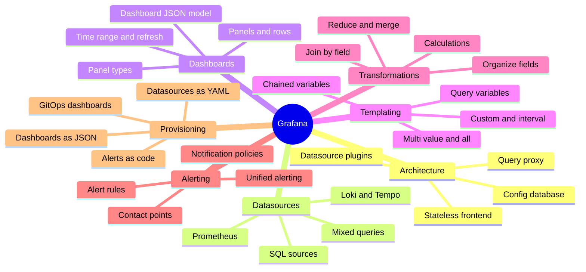
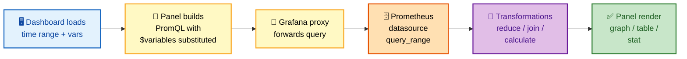
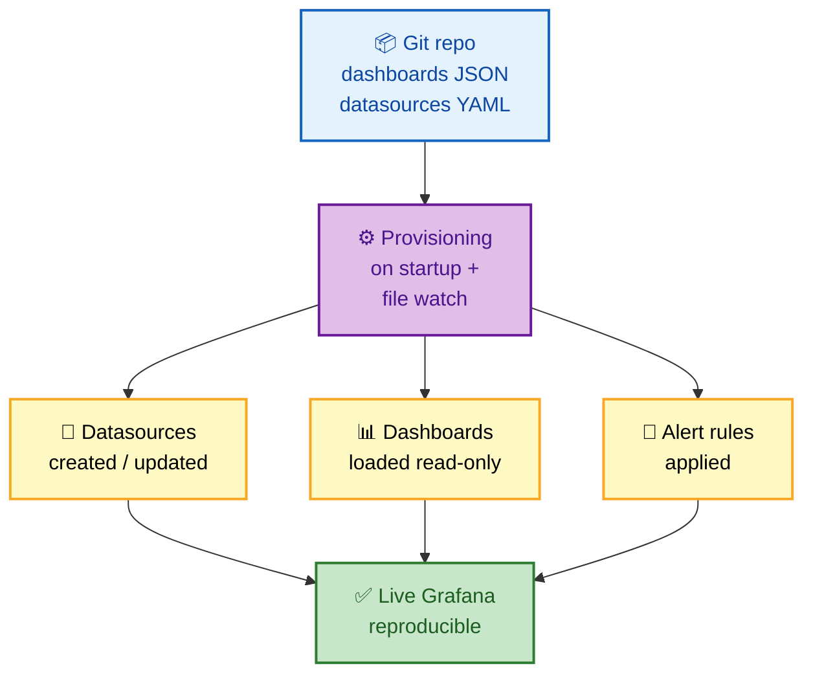

# SECTION 5: GRAFANA

> **Scope:** The visualization and alerting layer — Grafana's architecture, datasources, dashboards/panels, variables & templating, transformations, Grafana-managed alerting, and provisioning everything as code.

---

## Table of Contents

1. [Grafana Architecture](#1-grafana-architecture)
2. [Datasources](#2-datasources)
3. [Dashboards & Panels](#3-dashboards--panels)
4. [Variables & Templating](#4-variables--templating)
5. [Transformations](#5-transformations)
6. [Grafana Alerting](#6-grafana-alerting)
7. [Provisioning as Code](#7-provisioning-as-code)
8. [Interview Questions & Answers](#interview-questions--answers)
9. [Troubleshooting Scenarios](#troubleshooting-scenarios)
10. [Documentation Links](#documentation-links)

---

## 🗺️ Visual Overview

**In one line:** Grafana is a stateless query-and-render frontend — it holds **no metrics itself**,
issues PromQL (and other) queries to datasources on demand, renders the results into panels, and layers
templating, transformations, and its own alerting on top.

**Mind map — the whole section at a glance:**



**Query flow — dashboard load to rendered panel** (blue = request, yellow = query, orange = datasource, green = render):



**Provisioning as code — GitOps for dashboards** (blue = source, purple = provisioner, green = live):



> 🧠 **Memory hooks (mnemonics):**
> - **Grafana stores nothing:** it's a *window*, not a database. Metrics live in Prometheus; Grafana
>   just queries and paints. "No data in Grafana — it borrows."
> - **Variables = `$`:** template variables are `$name` / `${name}` — change one dropdown, re-query
>   every panel. "Dollar sign, dynamic dashboard."
> - **Transform after query:** transformations run **client-side on results**, after the datasource
>   responds. "Query fetches, transform reshapes."
> - **Provision = read-only:** provisioned dashboards/datasources are managed by files — the UI shows
>   them but edits belong in Git. "Files own it, UI reflects it."

---

## 1. Grafana Architecture

> 🎯 **Interview weight: Medium-High** — "where does Grafana store metrics?" (trick: it doesn't).

**In one line:** Grafana is a stateless Go web app: a small **config database** (SQLite/MySQL/Postgres)
holds dashboards, users, and settings — but **never time-series data** — while all metrics are fetched
live from datasources through Grafana's query proxy at render time.

**The components:**

| Component | Holds | Notes |
|---|---|---|
| Grafana server | Rendering, auth, query proxy | Stateless — scale horizontally behind an LB |
| Config DB | Dashboards (JSON), users, orgs, datasource defs | SQLite (single node) or Postgres/MySQL (HA) |
| Datasource plugins | How to query each backend | Prometheus, Loki, Tempo, SQL, CloudWatch, ... |
| Query proxy | Forwards panel queries to datasources | Keeps datasource creds server-side |

**Why "stateless" matters for interviews:** because Grafana stores no metrics, you can run N replicas
behind a load balancer as long as they share one config DB — the metrics always come fresh from
Prometheus. The only stateful piece is the config DB; SQLite works for one node, but HA needs an
external Postgres/MySQL.

> 💡 The **query proxy** is why panels don't need direct browser access to Prometheus: the browser asks
> Grafana, Grafana asks the datasource server-side. This keeps datasource credentials and network paths
> hidden from the client.

⚠️ Don't confuse Grafana's config DB with a metrics store. A common wrong answer is "Grafana stores the
dashboards' data" — it stores the *dashboard definitions*, and re-queries the datasource every refresh.

---

## 2. Datasources

> 🎯 **Interview weight: Medium** — know Prometheus config knobs and mixed datasources.

**In one line:** A **datasource** is a configured connection + query plugin; Prometheus is the canonical
one, but Grafana federates many (Loki for logs, Tempo for traces, SQL, CloudWatch) and can even mix
several in one dashboard or panel.

**Prometheus datasource — the settings that matter:**

```yaml
# provisioning/datasources/prometheus.yaml
apiVersion: 1
datasources:
  - name: Prometheus
    type: prometheus
    access: proxy                    # Grafana server queries it (not the browser)
    url: http://prometheus:9090
    isDefault: true
    jsonData:
      timeInterval: 15s              # match scrape interval → correct $__rate_interval
      httpMethod: POST               # POST allows large queries (long label lists)
      exemplarTraceIdDestinations:   # click a latency spike → jump to the trace
        - name: trace_id
          datasourceUid: tempo
```

- **`access: proxy` vs `direct`:** proxy (server-side) is standard and secure; direct (browser) is
  legacy and leaks the datasource URL/creds to clients.
- **`timeInterval`** should equal your scrape interval so Grafana's `$__rate_interval` picks a safe
  `rate()` window automatically.
- **Exemplars** let a histogram bucket carry a sample trace ID — click the p99 spike, jump to the exact
  trace in Tempo/Jaeger (metrics-to-traces correlation).

**Mixed datasources:** the special `-- Mixed --` datasource lets one panel query Prometheus *and* Loki,
so you can overlay a request-rate line (metrics) with error-log counts (logs) on the same time axis.

> 🔍 **The observability trio in Grafana:** **Prometheus** (metrics) + **Loki** (logs) + **Tempo**
> (traces), correlated by shared labels and exemplars — the "single pane of glass" answer.

---

## 3. Dashboards & Panels

> 🎯 **Interview weight: Medium** — the dashboard-as-JSON model and panel/query relationship.

**In one line:** A **dashboard** is a JSON document of **panels**; each panel owns one or more queries
(targets), a visualization type, and field/threshold options — and the whole dashboard is portable
because it's just that JSON.

**The hierarchy:**
```text
Dashboard (JSON)
├── time range + refresh + variables
├── Row (optional grouping)
│   ├── Panel  → query (PromQL) + viz type + options
│   └── Panel  → query + viz type + options
```

**Panel types you'll name in interviews:**

| Panel | Use |
|---|---|
| Time series | The default line/area graph over time |
| Stat / Gauge | Single current value (SLO %, uptime) |
| Bar gauge | Compare current values across series |
| Table | Raw series/label inspection, instant queries |
| Heatmap | Histogram distributions over time (latency heatmap) |
| State timeline | Up/down state over time |

**The dashboard JSON model** is the key portability concept: everything — panels, queries, variables,
thresholds — serializes to one JSON blob. That's what makes dashboards **shareable, version-controllable,
and provisionable** (Section 7). Grafana.com hosts thousands of community dashboards you import by ID,
which are just this JSON.

> 💡 Use **`$__rate_interval`** (not a hardcoded `[5m]`) in dashboard queries — Grafana computes a safe
> rate window from the panel's resolution and the datasource `timeInterval`, so graphs stay correct when
> you zoom in/out. Hardcoded windows break at high zoom.

⚠️ **Instant vs range in panels:** a "Stat" panel wants an **instant** query (one number now); a "Time
series" panel wants a **range** query (points over time). Setting the wrong one is why a stat panel
sometimes shows "No data" or a graph shows a flat single point.

---

## 4. Variables & Templating

> 🎯 **Interview weight: High** — templating is the most-asked Grafana skill.

**In one line:** **Template variables** (`$var`) turn a static dashboard into a reusable one — a
dropdown of values (often populated by a PromQL `label_values()` query) gets substituted into every
panel's query, so one dashboard serves every cluster/service/instance.

**Variable types:**

| Type | Source | Example |
|---|---|---|
| **Query** | PromQL `label_values()` | `$instance`, `$namespace` from live data |
| **Custom** | Hardcoded list | `$env = prod,staging,dev` |
| **Interval** | Time windows | `$rate = 1m,5m,10m` |
| **Datasource** | List of datasources | switch which Prometheus |
| **Textbox / Constant** | Free text / fixed | ad-hoc filters |

**Query variable populated from label values:**
```text
# Variable $namespace — its query:
label_values(kube_pod_info, namespace)

# Chained: $pod depends on $namespace
label_values(kube_pod_info{namespace="$namespace"}, pod)
```

**Using it in a panel:**
```promql
sum by (pod) (rate(container_cpu_usage_seconds_total{namespace="$namespace", pod=~"$pod"}[$__rate_interval]))
```

**Multi-value & "All" mechanics** — the subtle part:
- A multi-value variable renders as a **regex-anchored** list, so you must match with `=~`:
  `pod=~"$pod"` (not `pod="$pod"`). With `pod=a|b|c` expansion, `=` would never match.
- The **"All"** option can be a literal `.*` regex or an explicit expansion — configure the "custom
  all value" so it behaves predictably.
- **Chained (dependent) variables** re-query when their parent changes: pick `$namespace` → `$pod`
  repopulates to only that namespace's pods.

> 🔍 **Interview trap:** "why does my multi-select variable break the query?" — because multi-value
> expands to a regex alternation and the query used `=` instead of `=~`. This exact bug is a favorite.

> 💡 Templating is what makes **one** dashboard scale to a fleet: a single "Service Overview" with
> `$namespace`/`$service`/`$instance` dropdowns replaces hundreds of copy-pasted dashboards.

---

## 5. Transformations

> 🎯 **Interview weight: Low-Medium** — know what they are and that they run client-side.

**In one line:** **Transformations** reshape query *results* inside Grafana — after the datasource
responds — to join, reduce, rename, or compute fields, letting you build tables and derived values
without changing the underlying PromQL.

**Common transformations:**

| Transformation | Does |
|---|---|
| **Reduce** | Collapse a time series to one value (last/mean/max) — for tables/stats |
| **Merge** | Combine multiple series/results into one table |
| **Join by field** | SQL-style join of two queries on a shared label (e.g., `instance`) |
| **Organize fields** | Rename, reorder, hide columns |
| **Add field from calculation** | Derive a new column (e.g., `A / B` ratio) |
| **Filter by value / name** | Drop rows/series by condition |

**Canonical use:** build a **fleet table** — query A = CPU per instance, query B = memory per instance,
**Join by field** on `instance`, **Organize** to rename columns, **Add field from calculation** for a
"pressure" score. All without touching PromQL.

⚠️ **Transformations run in the browser on returned data** — they're not a substitute for a good query.
Reducing 100k points client-side to show one number is wasteful; do the aggregation in PromQL and use a
transformation only for the final reshape. Order matters: transformations apply top-to-bottom, each
consuming the previous output.

> 💡 Rule of thumb: **aggregate in PromQL, reshape in transformations.** If a transformation is doing
> heavy math over large result sets, push it back into the query.

---

## 6. Grafana Alerting

> 🎯 **Interview weight: Medium-High** — Grafana-managed vs datasource alerting is a common compare.

**In one line:** **Grafana Unified Alerting** lets you define alert rules *in Grafana* (evaluated by
Grafana against any datasource) with their own contact points and notification policies — an
alternative or complement to Prometheus's rule files + Alertmanager.

**Two models — know the trade-off:**

| | Prometheus + Alertmanager | Grafana-managed alerts |
|---|---|---|
| Rules live in | Prometheus rule files (YAML) | Grafana (UI or provisioned) |
| Evaluated by | Prometheus | Grafana |
| Works across datasources | No (Prometheus only) | Yes (mix Prometheus, Loki, SQL) |
| Routing/silencing | Alertmanager | Grafana notification policies (Alertmanager-compatible) |
| Best for | Pure Prometheus, GitOps rule files | Multi-datasource, teams living in Grafana |

**Grafana alert rule anatomy:** a **query** (e.g., PromQL) → an optional **reduce/math expression** →
a **condition** (threshold) → `for` (pending) → labels/annotations → **notification policy** routes it
to **contact points** (Slack, PagerDuty, email). The routing tree, grouping, inhibition, and silencing
concepts mirror Alertmanager (Section 3) — Grafana even embeds an Alertmanager-compatible model.

> 💡 **When to choose which:** keep alerting in **Prometheus/Alertmanager** for pure-metrics, GitOps,
> rule-file-as-code shops (alerts live with the code they watch). Use **Grafana alerting** when you need
> a single alert to span metrics + logs + SQL, or when the team already operates entirely in Grafana.

⚠️ Running *both* on the same conditions causes duplicate pages. Pick one owner per alert; a common
pattern is Prometheus/Alertmanager for infra SLOs and Grafana alerting for cross-signal/business alerts.

---

## 7. Provisioning as Code

> 🎯 **Interview weight: High** — "how do you avoid click-ops dashboards?" is a maturity signal.

**In one line:** **Provisioning** declares datasources, dashboards, and alert rules as version-controlled
files that Grafana loads on startup (and on file change), so your entire observability UI is reproducible
from Git instead of hand-clicked and lost on restart.

**Datasources as YAML** (shown in §2) and **dashboards as JSON via a provider:**

```yaml
# provisioning/dashboards/provider.yaml
apiVersion: 1
providers:
  - name: "team-dashboards"
    type: file
    disableDeletion: true
    updateIntervalSeconds: 30        # watch for file changes
    allowUiUpdates: false            # UI edits blocked → files are source of truth
    options:
      path: /var/lib/grafana/dashboards   # drop *.json here
      foldersFromFilesStructure: true
```

**The GitOps loop:**
1. Dashboards live as JSON in Git (exported from the UI or generated by **Grafonnet**/**jsonnet** or
   the Terraform Grafana provider).
2. CI syncs them into the provisioning path (ConfigMap in Kubernetes, e.g., via the `grafana`
   sidecar/operator).
3. Grafana loads them **read-only** — the UI reflects them but `allowUiUpdates: false` forces changes
   through Git review.

**Why this matters:**
- **Reproducible** — recreate an entire Grafana from scratch; nothing lives only in someone's browser.
- **Reviewable** — dashboard/alert changes go through PRs like code.
- **No drift** — restarts or new replicas get the identical set.

> 🔍 **The Kubernetes pattern:** dashboards as **ConfigMaps** labeled for the Grafana sidecar, which
> mounts them into the provisioning path — so `kubectl apply` ships a dashboard. This is the standard
> "dashboards as code" answer.

⚠️ **Provisioned ≠ editable-and-saved.** Editing a provisioned dashboard in the UI (if allowed) is lost
on the next sync. Treat the files as source of truth; use "Save As" to a non-provisioned folder only for
experiments.

---

## Interview Questions & Answers

**1. Where does Grafana store its metrics?**
**Crisp:** it doesn't — Grafana is stateless for metrics and queries datasources live at render time.
**Internals:** its config DB (SQLite/Postgres) holds dashboard JSON, users, and datasource definitions,
never time-series data. **Follow-up:** that's why you scale Grafana horizontally behind an LB with a
shared external DB, while Prometheus remains the metrics store.

**2. How do template variables make a dashboard reusable?**
**Crisp:** a `$var` dropdown (often from `label_values()`) is substituted into every panel's query, so
one dashboard serves any cluster/service. **Internals:** query variables run PromQL to populate options;
chained variables re-query when a parent changes. **Follow-up:** multi-value variables expand to a regex
alternation, so panels must match with `=~ "$var"`, not `=`.

**3. Why does my multi-select variable return "No data"?**
**Crisp:** multi-value expands to `a|b|c`, which only matches with a regex operator. **Internals:** the
panel used `label="$var"` (exact match) instead of `label=~"$var"`. **Follow-up:** also configure the
"All" value as `.*` (or explicit expansion) so selecting All behaves predictably.

**4. Prometheus/Alertmanager alerting vs Grafana-managed alerting — when each?**
**Crisp:** Prometheus rules for pure-metrics GitOps shops; Grafana alerting when an alert must span
metrics + logs + SQL or the team lives in Grafana. **Internals:** Prometheus evaluates rule files and
ships to Alertmanager; Grafana evaluates its own rules against any datasource with an Alertmanager-
compatible routing model. **Follow-up:** don't run both on the same condition — you'll get duplicate
pages.

**5. What is provisioning and why not just build dashboards in the UI?**
**Crisp:** provisioning declares datasources/dashboards/alerts as Git-tracked files loaded on startup,
making the whole UI reproducible and reviewable. **Internals:** a file provider watches a path and loads
dashboards read-only (`allowUiUpdates: false`), so Git is the source of truth. **Follow-up:** the
Kubernetes pattern ships dashboards as ConfigMaps that a Grafana sidecar mounts into the provisioning
path.

**6. What does `$__rate_interval` do and why prefer it over `[5m]`?**
**Crisp:** it computes a safe `rate()` window from the panel resolution and datasource scrape interval,
so graphs stay correct across zoom levels. **Internals:** a hardcoded `[5m]` can yield too few points
when zoomed in (gaps) or over-smooth when zoomed out. **Follow-up:** set the datasource `timeInterval`
to the scrape interval so `$__rate_interval` has the right floor.

**7. How do you correlate a latency spike to a specific trace in Grafana?**
**Crisp:** exemplars — a histogram bucket carries a sample trace ID, and clicking the spike jumps to the
trace in Tempo/Jaeger. **Internals:** configured via `exemplarTraceIdDestinations` on the Prometheus
datasource. **Follow-up:** this is the metrics→traces leg of the Prometheus+Loki+Tempo correlation
story.

---

## Troubleshooting Scenarios

### Scenario 1: "Dashboard shows 'No data' but the same query works in Prometheus UI."
**Symptom:** panel empty; Explore/Prometheus returns results.
**Investigation:** check the panel's datasource, the dashboard **time range**, and whether a **template
variable** resolved to an empty/invalid value; inspect the panel's "Query inspector" to see the actual
sent query with variables substituted.
**Plausible causes:** (1) a `$variable` is empty so the selector matches nothing; (2) exact-match `=`
used with a multi-value variable; (3) time range is outside the data's retention; (4) wrong datasource
selected.
**Fix:** use `=~"$var"`, give variables a valid default/"All", and confirm the time range and datasource.

---

### Scenario 2: "Grafana restarted and all our dashboards are gone."
**Symptom:** dashboards vanished after a pod restart.
**Cause:** dashboards were hand-created in the UI with an **SQLite** config DB on ephemeral storage (no
persistent volume), so the DB was wiped on restart.
**Fix:** persist the config DB (PVC) or move to external Postgres/MySQL, and **provision dashboards as
code** so they're recreated from Git regardless of DB state.

---

### Scenario 3: "We're getting paged twice for the same latency condition."
**Symptom:** duplicate notifications for one SLO breach.
**Cause:** the same condition is defined both as a Prometheus alert (→ Alertmanager) and as a
Grafana-managed alert.
**Fix:** pick a single owner per alert — keep infra SLOs in Prometheus/Alertmanager, or move it fully to
Grafana alerting — and remove the duplicate rule.

---

## Documentation Links

| Topic | Link |
|---|---|
| Grafana architecture/intro | https://grafana.com/docs/grafana/latest/fundamentals/ |
| Prometheus datasource | https://grafana.com/docs/grafana/latest/datasources/prometheus/ |
| Dashboards & panels | https://grafana.com/docs/grafana/latest/dashboards/ |
| Template variables | https://grafana.com/docs/grafana/latest/dashboards/variables/ |
| Transformations | https://grafana.com/docs/grafana/latest/panels-visualizations/query-transform-data/transform-data/ |
| Unified alerting | https://grafana.com/docs/grafana/latest/alerting/ |
| Provisioning | https://grafana.com/docs/grafana/latest/administration/provisioning/ |
| Exemplars | https://grafana.com/docs/grafana/latest/fundamentals/exemplars/ |

---

*Continue to [06-PRODUCTION-SCALING.md](./06-PRODUCTION-SCALING.md) for Section 6 (Production & Scaling).*
