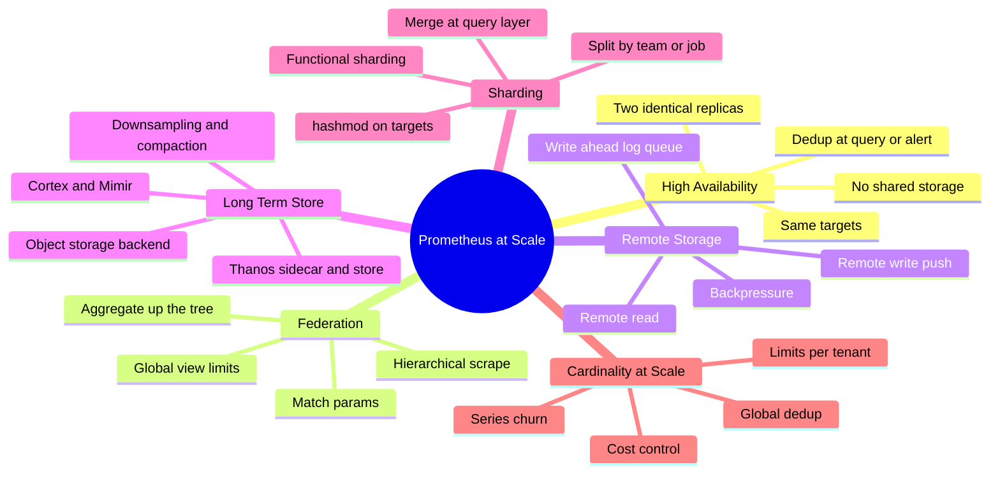
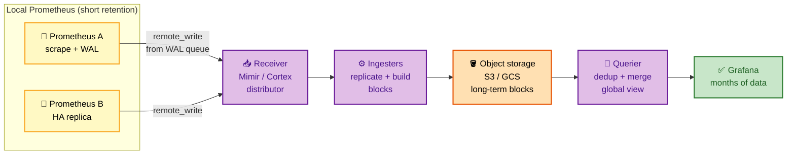
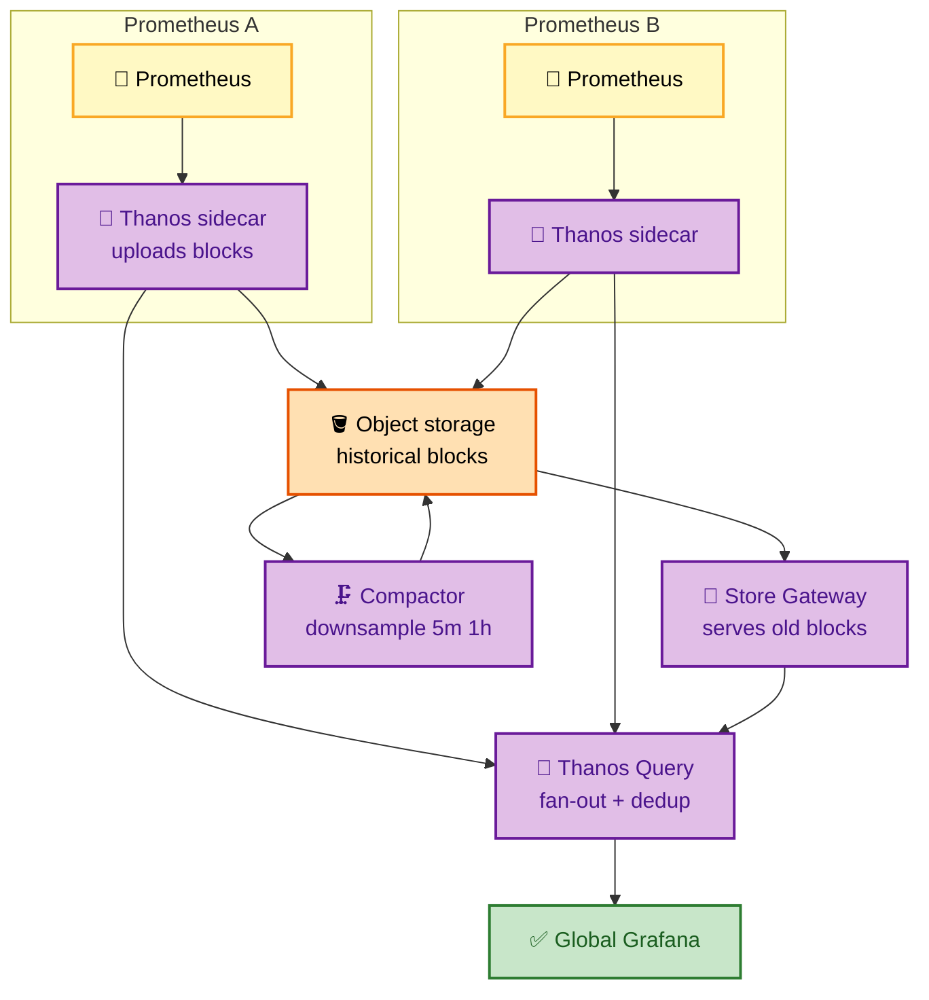

# SECTION 6: PRODUCTION & SCALING

> **Scope:** Running Prometheus at scale — HA pairs, federation, remote write/read, long-term storage (Thanos, Cortex, Mimir), sharding, high cardinality at scale, and troubleshooting a large deployment.

---

## Table of Contents

1. [High Availability Pairs](#1-high-availability-pairs)
2. [Federation](#2-federation)
3. [Remote Write & Remote Read](#3-remote-write--remote-read)
4. [Long-Term Storage: Thanos / Cortex / Mimir](#4-long-term-storage-thanos--cortex--mimir)
5. [Sharding](#5-sharding)
6. [High Cardinality at Scale](#6-high-cardinality-at-scale)
7. [Interview Questions & Answers](#interview-questions--answers)
8. [Troubleshooting Scenarios](#troubleshooting-scenarios)
9. [Documentation Links](#documentation-links)

---

## 🗺️ Visual Overview

**In one line:** A single Prometheus tops out on RAM (cardinality) and local disk (retention), so scaling
means running redundant replicas (HA), splitting targets across servers (sharding), and offloading data
to a horizontally-scalable, deduplicating long-term store (Thanos/Cortex/Mimir) via remote write.

**Mind map — the whole section at a glance:**



**Remote write to long-term storage — the scaling backbone** (yellow = local, purple = remote path, orange = object store, green = global query):



**Thanos sidecar architecture — global view over HA Prometheis** (yellow = prom, purple = thanos, orange = object store, green = query):



> 🧠 **Memory hooks (mnemonics):**
> - **HA = twins, not shared disk:** two identical Prometheis scraping the same targets; dedup happens
>   at the *query/alert* layer, never by sharing storage. "Clone the scraper, not the disk."
> - **Federate = zoom out:** a higher Prometheus scrapes *aggregated* series from lower ones — "parent
>   pulls the summary, not every series."
> - **Remote write = drain the WAL:** samples stream from the WAL to a remote queue — "the WAL feeds
>   the firehose."
> - **Thanos sidecar vs Mimir/Cortex push:** Thanos **reads blocks** from Prometheus (sidecar);
>   Mimir/Cortex **receive remote_write** (push). "Thanos pulls blocks, Mimir catches writes."

---

## 1. High Availability Pairs

> 🎯 **Interview weight: Very High** — "how do you make Prometheus HA?" is asked in nearly every SRE loop.

**In one line:** Prometheus HA means running **two (or more) identical replicas** that independently
scrape the *same* targets and evaluate the *same* rules — there is **no clustering or shared storage**;
redundancy comes from duplication, and deduplication happens above them.

**Why not shared storage / clustering?** The TSDB takes an exclusive lock and the WAL/index can't be
safely written by two processes — sharing a data dir corrupts it (Section 1). So Prometheus deliberately
has *no* built-in clustering. Each replica is a complete, independent copy.

**Where deduplication happens:**

| Layer | How dedup works |
|---|---|
| **Alerting** | Both replicas push the same alerts to a *clustered* Alertmanager, which dedups (Section 3) |
| **Querying** | A query layer (Thanos Query, Mimir, or a dedup proxy) merges the two replicas' near-identical series |

**The catch — replicas aren't byte-identical:** the two Prometheis scrape at slightly offset times, so
their samples have different timestamps. That's fine — Alertmanager dedup works on alert *identity*
(labels), and Thanos/Mimir dedup uses a `replica` external label to pick one series and fill gaps from
the other.

```yaml
# Each replica tags itself so the query layer can dedup
global:
  external_labels:
    cluster: prod-us-east
    replica: A          # the OTHER one is replica: B
```

> 💡 **The interview-perfect answer:** "Run ≥2 identical Prometheis (never shared storage). Dedup alerts
> via a clustered Alertmanager and dedup queries via Thanos/Mimir using a `replica` external label.
> Single-node Prometheus has no clustering by design — HA is redundancy plus upstream dedup."

⚠️ If you run two Prometheis but a *single, non-clustered* Alertmanager per replica, you get duplicate
pages. HA Prometheus **requires** a clustered Alertmanager to realize its benefit.

---

## 2. Federation

> 🎯 **Interview weight: Medium-High** — know what it's for *and* its limits.

**In one line:** **Federation** lets one Prometheus scrape a curated, usually *aggregated* subset of
series from other Prometheis via the `/federate` endpoint — building a hierarchical "global" view
without every server holding every series.

**Two flavors:**

- **Hierarchical federation:** a top-level ("global") Prometheus scrapes **aggregated** recording-rule
  series from many datacenter-level Prometheis. The global one sees `job:http_requests:rate5m` per DC,
  not every raw series.
- **Cross-service federation:** one Prometheus pulls a few specific series from another (e.g., pulling
  SLO metrics from a team's server).

```yaml
  - job_name: "federate"
    honor_labels: true                 # keep the source's labels (see §Section 1)
    metrics_path: /federate
    params:
      "match[]":                        # ONLY pull these — never scrape everything
        - '{__name__=~"job:.*"}'        # aggregated recording rules
        - 'up'
    static_configs:
      - targets: ["dc1-prom:9090", "dc2-prom:9090"]
```

**The hard limits — why federation is *not* long-term/global storage:**

- It's a **scrape**, so it inherits scrape timeouts and payload limits — pulling raw high-cardinality
  series will time out or OOM the parent.
- It only captures a **snapshot** at the parent's scrape interval, not full-resolution history.
- No deduplication or downsampling — it's a pull, not a storage system.

> 🔍 **Federation vs remote write:** federation is for *hierarchical aggregation* (pull the summary up);
> remote write is for *durable long-term/global storage* (stream everything to a scalable backend). When
> asked "how do you get a global multi-DC view for months," the answer is **remote write to
> Thanos/Mimir**, not federation.

⚠️ **Federation anti-pattern:** using `/federate` to copy *all* series to a central Prometheus. It
doesn't scale (the parent becomes a bigger single node with the same cardinality/retention limits) — use
a real long-term store instead.

---

## 3. Remote Write & Remote Read

> 🎯 **Interview weight: Very High** — the mechanism behind every scalable/long-term setup.

**In one line:** **Remote write** streams samples from Prometheus's WAL to an external system (Mimir,
Cortex, Thanos Receive, cloud TSDB) in near-real-time; **remote read** lets Prometheus query those
external stores for historical data it no longer holds locally.

**How remote write works (the important internals):**

- A **queue per remote endpoint** tails the **WAL** — as samples are written locally, they're also
  enqueued and shipped in compressed (Snappy/protobuf) batches over HTTP.
- **Sharding & backpressure:** the queue dynamically adjusts the number of parallel shards to keep up;
  if the remote is slow, the queue grows and applies backpressure. Persistent lag risks the WAL
  filling.
- It's **decoupled from scraping** — a slow remote endpoint doesn't block local scrapes (up to WAL
  limits), so local Prometheus stays healthy even if the backend hiccups.

```yaml
remote_write:
  - url: http://mimir:8080/api/v1/push
    queue_config:
      capacity: 10000            # per-shard in-memory buffer
      max_shards: 200            # parallelism ceiling
      max_samples_per_send: 2000
    write_relabel_configs:       # drop cheap/noisy metrics before shipping (cost control)
      - source_labels: [__name__]
        regex: "go_gc_.*"
        action: drop

remote_read:
  - url: http://mimir:8080/api/v1/read
    read_recent: false           # only hit remote for data beyond local retention
```

**Key design points:**

- **`write_relabel_configs`** is your cost lever — drop metrics you don't need long-term *before* they
  hit the (often per-sample-billed) backend.
- **Local retention shrinks** — once remote write is durable, local Prometheus only needs enough
  retention to survive a backend outage plus your longest alerting window (e.g., a few hours to days).
- **Remote read is queried sparingly** — set `read_recent: false` so local data serves recent queries
  and only historical ranges fan out to the remote.

> 💡 **The modern pattern:** thin, short-retention Prometheis do the scraping; **remote write** ships
> everything to a horizontally-scalable store (Mimir/Cortex/Thanos Receive) that owns dedup,
> long-term retention, downsampling, and the global query view.

⚠️ **WAL-based means gap-tolerant but not infinite.** A long backend outage lets the WAL grow until it
hits retention/disk limits, after which the oldest unshipped samples are lost. Alert on
`prometheus_remote_storage_samples_pending` / queue lag.

---

## 4. Long-Term Storage: Thanos / Cortex / Mimir

> 🎯 **Interview weight: Very High (senior/staff)** — the trade-off discussion is where staff interviews live.

**In one line:** These systems turn many local Prometheis into one durable, horizontally-scalable,
deduplicated metrics platform backed by **object storage** (S3/GCS) — differing mainly in *how data
gets in* (Thanos reads blocks via a sidecar; Cortex/Mimir receive remote_write) and their operational
model.

**Thanos — the "sidecar + object storage" model:**

| Component | Role |
|---|---|
| **Sidecar** | Runs next to each Prometheus; uploads its 2h blocks to object storage and serves recent data for queries |
| **Store Gateway** | Serves historical blocks *from* object storage to queries |
| **Query (Querier)** | Fan-out to all sidecars + store gateways, **deduplicates** HA replicas, merges into one view |
| **Compactor** | Compacts and **downsamples** blocks in object storage (raw → 5m → 1h) for fast long-range queries |
| **Receive** (optional) | Accepts remote_write (push model, like Mimir) instead of sidecar |

Thanos leans on Prometheus's **existing block format** — the sidecar just uploads blocks — so it's a
relatively thin, "bolt-on global view" over standard Prometheis.

**Cortex / Mimir — the "remote_write, multi-tenant" model:**

- Prometheis **remote_write** into a horizontally-sharded cluster of **distributors → ingesters** that
  build blocks and flush to object storage.
- **Mimir** (a Grafana Labs evolution of Cortex) is tuned for massive scale (billions of active series),
  strong **multi-tenancy** (per-tenant limits/isolation), and simpler operations than Cortex.
- Query path: **queriers** fan out to ingesters (recent) + store-gateway (historical) with dedup.

**The comparison interviewers want:**

| Dimension | Thanos | Cortex | Mimir |
|---|---|---|---|
| Ingestion | Sidecar reads blocks (also Receive) | remote_write | remote_write |
| Backend | Object storage | Object storage | Object storage |
| Multi-tenancy | Limited | Strong | Strong (first-class) |
| Ops complexity | Lower (bolt-on) | Higher | Moderate (Cortex-derived, streamlined) |
| Dedup of HA replicas | Yes (`replica` label) | Yes | Yes |
| Downsampling | Yes (Compactor) | Limited | Yes |
| Best for | Add global view to existing Prometheis | Legacy large multi-tenant | New large-scale multi-tenant |

**Common to all three:** object storage backend (cheap, durable, infinite), HA **deduplication**,
horizontal scale beyond a single node's RAM/disk, and a unified global query endpoint Grafana points at.

> 💡 **How to answer "Thanos vs Mimir?"** — *"Thanos if you already run many Prometheis and want a
> thin global/long-term view with minimal disruption (sidecar uploads blocks). Mimir if you're building
> a large, multi-tenant metrics platform from the start and want push-based remote_write with
> first-class tenancy and downsampling at billions of series. Both use object storage and dedup HA
> replicas — the split is sidecar-pull-blocks vs remote-write-push and tenancy needs."*

⚠️ **Downsampling is why long-range queries stay fast:** the compactor pre-aggregates raw data to 5m and
1h resolutions. A "last 1 year" dashboard reads 1h-downsampled blocks, not billions of raw points —
without downsampling, long-range queries are unusably slow.

---

## 5. Sharding

> 🎯 **Interview weight: High** — the answer to "a single Prometheus can't hold all our targets."

**In one line:** When targets/series exceed one server's capacity, you **shard** — split the scrape
workload across multiple Prometheis — either **functionally** (by team/job) or **by `hashmod`** (hash
targets into N buckets), then merge at the query layer (Thanos/Mimir).

**Two sharding strategies:**

**1. Functional sharding (preferred when it fits):** one Prometheus per team/domain/job. Simple, clear
ownership, natural blast-radius isolation. "Infra Prometheus, payments Prometheus, ..."

**2. Hash-based sharding (`hashmod`):** when one *job* alone is too big, hash its targets across N
servers so each scrapes ~1/N of them:

```yaml
# Shard 0 of 4 — each shard runs this with a different __tmp_shard value
  - job_name: "big-job"
    kubernetes_sd_configs: [ { role: pod } ]
    relabel_configs:
      - source_labels: [__address__]
        modulus: 4                       # number of shards
        target_label: __tmp_shard
        action: hashmod
      - source_labels: [__tmp_shard]
        regex: "0"                       # THIS shard keeps only bucket 0
        action: keep
```

Each of the 4 servers uses a different `regex` (0,1,2,3), so together they cover all targets with no
overlap. The **query layer merges** the shards back into one logical view.

> 🔍 **The distinction:** **sharding** splits the *write/scrape* load (each server owns a slice of
> targets); **HA replicas** duplicate the *same* slice for redundancy. Real large deployments do both:
> N shards × 2 replicas each, all remote-writing/deduped into Mimir/Thanos.

⚠️ **Sharding fragments the view** — no single Prometheus has the whole picture anymore, so
cross-shard queries and global alerts *require* the query layer (Thanos Query/Mimir). Don't shard until
you've first exhausted cardinality reduction; sharding adds real operational cost.

---

## 6. High Cardinality at Scale

> 🎯 **Interview weight: Very High** — cardinality is the recurring villain; at scale it needs *systemic* controls.

**In one line:** At platform scale, cardinality control shifts from "review PRs" to **enforced limits**
— per-tenant series caps, series-churn monitoring, `write_relabel_configs` at the remote-write boundary,
and dashboards that track the top cardinality contributors continuously.

**Cardinality problems that only appear at scale:**

- **Series churn:** in Kubernetes, every deploy creates new pod names → new `pod` label values → new
  series. Even bounded-looking labels churn constantly, inflating the head and the index. `metric_relabel`
  to normalize (drop pod hash suffixes) or rely on the store's handling of churn.
- **Aggregate cardinality across tenants:** one team's bad metric can starve a shared platform.
- **The index, not just the head:** at billions of series the *inverted index* size and postings
  intersections become the bottleneck, not just RAM.

**Systemic controls (the platform answer):**

| Control | Where | Effect |
|---|---|---|
| Per-tenant **series limits** | Mimir/Cortex limits | Reject a tenant's writes past N active series |
| `write_relabel_configs` drop | Prometheus remote_write | Never ship junk metrics to the backend |
| `sample_limit` / `label_limit` | Scrape config | Cap per-scrape blast radius |
| Cardinality dashboards | Grafana | Track top `__name__`/label offenders continuously |
| Relabel-normalize churn | `metric_relabel_configs` | Strip per-deploy suffixes from labels |

**Continuous detection query:**
```promql
# Top 10 metrics by series count — watch this dashboard
topk(10, count by (__name__)({__name__=~".+"}))
# Series churn: new series appearing per interval
sum(rate(prometheus_tsdb_head_series_created_total[5m]))
```

> 💡 **The scale mindset:** you can't manually police cardinality across hundreds of teams, so you
> **enforce** it — per-tenant limits that *reject* offending writes (with a clear error the team sees),
> plus `write_relabel` at the boundary and standing cardinality dashboards. Turn "please don't add
> user_id" into "the platform rejects it."

⚠️ **Cardinality is also your cloud bill.** Managed/long-term stores often price per active series or
per sample — an unbounded label isn't just an OOM risk, it's a direct cost multiplier. Cost reviews and
cardinality reviews are the same review at scale.

---

## Interview Questions & Answers

**1. How do you make Prometheus highly available?**
**Crisp:** run ≥2 identical replicas scraping the same targets with the same rules — no shared storage,
no clustering. **Internals:** the TSDB locks its data dir, so replicas are fully independent; dedup
happens above them (clustered Alertmanager for alerts, Thanos/Mimir `replica` label for queries).
**Follow-up:** replicas aren't byte-identical (offset scrape times), which is exactly what the dedup
layers reconcile.

**2. Federation vs remote write — when each?**
**Crisp:** federation pulls an *aggregated subset* up a hierarchy (snapshot); remote write streams
*everything* to a durable, scalable long-term store. **Internals:** federation is a scrape (inherits
timeouts/limits, no downsampling/dedup); remote write drains the WAL to Mimir/Cortex/Thanos with dedup
and retention. **Follow-up:** "global multi-DC view for months" = remote write, never federation.

**3. Walk me through remote write internals.**
**Crisp:** a per-endpoint queue tails the WAL and ships compressed batches over HTTP, dynamically
sharding for throughput with backpressure. **Internals:** it's decoupled from scraping, so a slow
backend doesn't block scrapes until the WAL fills; `write_relabel_configs` drops metrics before
shipping. **Follow-up (failure):** a long backend outage grows the WAL until retention/disk limits drop
the oldest unshipped samples — alert on pending-samples/queue lag.

**4. Thanos vs Cortex vs Mimir — how do you choose?**
**Crisp:** Thanos bolts a global/long-term view onto existing Prometheis via a block-uploading sidecar;
Cortex/Mimir ingest via remote_write with strong multi-tenancy, Mimir being the streamlined
large-scale successor. **Internals:** all use object storage + HA dedup; the split is sidecar-reads-blocks
(pull) vs remote_write (push) and tenancy/downsampling needs. **Follow-up:** downsampling (raw→5m→1h) via
the compactor is what keeps year-long queries fast.

**5. A single Prometheus can't scrape all our targets. What do you do?**
**Crisp:** shard — functionally (per team/job) first, then `hashmod` within a too-big job — and merge at
the query layer. **Internals:** `hashmod` on `__address__` with `modulus: N` + a per-shard `keep` regex
splits targets with no overlap. **Follow-up:** sharding fragments the view, so cross-shard queries and
global alerts need Thanos Query/Mimir; exhaust cardinality reduction before sharding.

**6. How do you control cardinality across a large multi-team platform?**
**Crisp:** enforce it — per-tenant series limits that reject offending writes, `write_relabel` at the
boundary, `sample_limit`, and standing cardinality dashboards. **Internals:** manual PR review doesn't
scale to hundreds of teams; the platform must reject unbounded labels with a clear error. **Follow-up:**
cardinality = cost (per-series/per-sample billing), so cardinality and cost reviews merge at scale.

**7. Why doesn't Prometheus just cluster and share storage for HA?**
**Crisp:** the TSDB takes an exclusive lock; two writers corrupt the WAL/index. **Internals:** the design
deliberately keeps single-node simplicity and pushes HA to duplication + upstream dedup. **Follow-up:**
this is why the scalable stores (Thanos/Mimir) exist — they provide the clustering/dedup Prometheus
intentionally omits.

**8. What's series churn and why does it hurt in Kubernetes?**
**Crisp:** every deploy creates new pod names → new label values → new series, inflating the head and
index even though instantaneous cardinality looks bounded. **Internals:** churn grows the WAL, the index,
and the number of head chunks created over time. **Follow-up:** normalize with `metric_relabel` (strip
per-deploy suffixes) and monitor `prometheus_tsdb_head_series_created_total`.

---

## Troubleshooting Scenarios

### Scenario 1: "Remote write is lagging and the WAL is growing dangerously."
**Symptom:** `prometheus_remote_storage_samples_pending` climbing; disk filling with WAL segments.
**Investigation:**
```promql
prometheus_remote_storage_samples_pending
rate(prometheus_remote_storage_samples_failed_total[5m])
prometheus_remote_storage_shards / prometheus_remote_storage_shards_max
```
**Plausible causes:** (1) the remote backend (Mimir/Cortex) is throttling or down; (2) `max_shards` too
low to keep up with sample volume; (3) network saturation.
**Fix:** raise `max_shards`/`capacity`, drop unneeded metrics via `write_relabel_configs` to cut volume,
and fix/scale the backend. If the WAL nears limits, you *will* lose the oldest unshipped data — this is
a page-now condition.

---

### Scenario 2: "Our global Grafana shows doubled values for some series."
**Symptom:** request-rate panels read 2× reality across the fleet.
**Cause:** the query layer isn't deduplicating HA replicas — both replica A and B's series are summed
because the `replica` external label isn't configured or dedup is off in Thanos Query/Mimir.
**Fix:** set distinct `external_labels: { replica: A|B }` on the pair and enable replica dedup in the
querier so it collapses the two into one series (filling gaps), instead of summing them.

---

### Scenario 3: "Long-range (1 year) dashboards time out; 1-hour dashboards are fine."
**Symptom:** short queries snappy, year-long queries hang or error.
**Cause:** no **downsampling** — the query reads billions of raw points from object storage.
**Fix:** ensure the Thanos **Compactor** (or Mimir's downsampling) is running and healthy so 5m/1h
resolutions exist; long-range panels then read downsampled blocks. Verify the compactor isn't crash-
looping (a single compactor per bucket, adequate resources).

---

## Documentation Links

| Topic | Link |
|---|---|
| HA & external labels | https://prometheus.io/docs/prometheus/latest/configuration/configuration/#external_labels |
| Federation | https://prometheus.io/docs/prometheus/latest/federation/ |
| Remote write/read | https://prometheus.io/docs/prometheus/latest/configuration/configuration/#remote_write |
| Remote write tuning | https://prometheus.io/docs/practices/remote_write/ |
| Thanos | https://thanos.io/tip/thanos/getting-started.md/ |
| Grafana Mimir | https://grafana.com/docs/mimir/latest/ |
| Cortex | https://cortexmetrics.io/docs/ |
| Managing cardinality | https://prometheus.io/docs/practices/naming/#labels |

---

*You've completed the Prometheus & Grafana track. Return to the [README index](./README.md) to review, or revisit [Section 1: Architecture](./01-PROMETHEUS-ARCHITECTURE.md) to reinforce the TSDB internals everything else builds on.*
