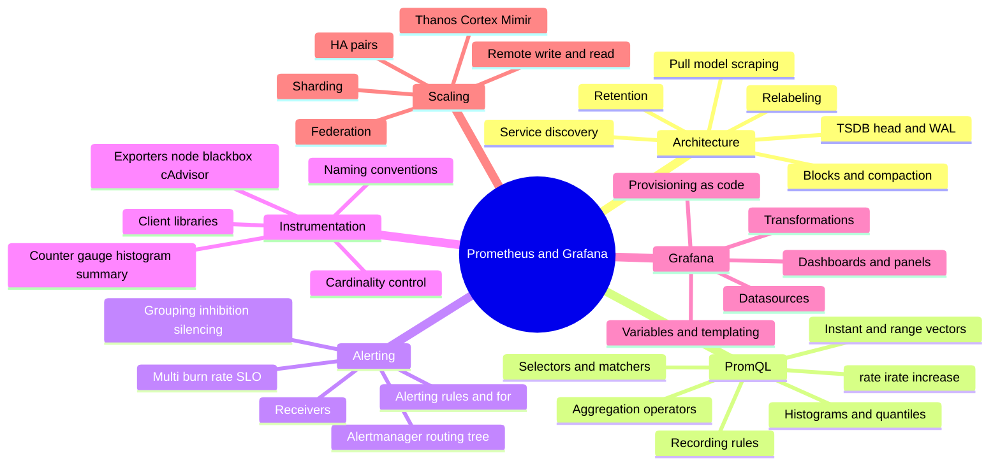

# Prometheus & Grafana — Deep Dive Interview Preparation

A complete, internals-first interview curriculum for **Prometheus** and **Grafana** aimed at SRE,
Platform Engineer, DevOps Engineer, Observability Engineer, and Staff/FAANG-level interviews. Every
section teaches from the mental model down to the on-disk bytes — the pull model, TSDB WAL/blocks,
PromQL `rate()` and histogram math, Alertmanager routing internals, cardinality economics, and the
Thanos/Cortex/Mimir scaling patterns — not surface-level "how to install" filler.

Each section file follows the same skeleton: a **Visual Overview** (mind map + colorful flow diagrams +
mnemonics), depth-first topics tagged with interview weight, annotated **real PromQL and YAML**,
interview-worthy **Q&A** (answer → internals → follow-up), **troubleshooting scenarios**, and links.

---

## 📚 Master Table of Contents

| # | Section | What it covers |
|---|---------|----------------|
| 1 | [Prometheus Architecture](01-PROMETHEUS-ARCHITECTURE.md) | Pull model, scrape loop, targets & relabeling, service discovery, the data model (metric name + labels + samples), TSDB internals (head, WAL, blocks, mmap chunks, compaction), retention |
| 2 | [PromQL](02-PROMQL.md) | Instant vs range vectors, selectors & matchers, `rate`/`irate`/`increase`, counter resets & extrapolation, aggregation operators, histograms & `histogram_quantile`, recording rules, query patterns |
| 3 | [Alerting](03-ALERTING.md) | Alerting rules & `for`, Alertmanager architecture, the routing tree, grouping, inhibition, silencing, receivers, dedup in HA, multi-burn-rate SLO alerts |
| 4 | [Exporters & Instrumentation](04-EXPORTERS-INSTRUMENTATION.md) | Node/blackbox/cAdvisor exporters, client libraries, the four metric types, naming conventions, labels, the cardinality explosion and how to prevent it |
| 5 | [Grafana](05-GRAFANA.md) | Architecture, datasources, dashboards/panels, variables & templating, transformations, Grafana-managed vs datasource alerting, provisioning as code |
| 6 | [Production & Scaling](06-PRODUCTION-SCALING.md) | HA pairs, federation, remote write/read, long-term storage (Thanos, Cortex, Mimir), sharding, high cardinality at scale, troubleshooting a large deployment |

---

## 🗺️ Repo-Wide Mind Map

---

## 🧭 Suggested Study Order

- **Start with Section 1** — the pull model and TSDB internals are the ground truth every other
  section references. Do not skip it; PromQL and scaling only make sense once you know how samples
  land on disk.
- **Section 2 (PromQL)** next — `rate()` extrapolation and histogram quantiles are the single most
  common "do you actually understand this" filter in observability interviews.
- **Section 4 (Instrumentation)** pairs naturally with 2 — you need the four metric types to reason
  about what a query is even summing, and cardinality is a recurring theme.
- **Section 3 (Alerting)** builds on 1, 2, 4 — you alert on PromQL expressions over instrumented
  metrics.
- **Section 5 (Grafana)** is the visualization/consumer layer; lighter on internals but heavy on
  templating and alerting-as-code.
- **Finish with Section 6 (Scaling)** — it assumes everything above and is where senior/staff
  interviews spend most of their time (HA, remote write, Thanos vs Mimir trade-offs, cardinality at
  scale).

> 💡 If you have one evening: read Section 1's TSDB internals and Section 2's `rate()`/histogram
> topics. Those two carry the highest interview weight of the entire folder.

---

*Begin with [Section 1: Prometheus Architecture](01-PROMETHEUS-ARCHITECTURE.md).*
