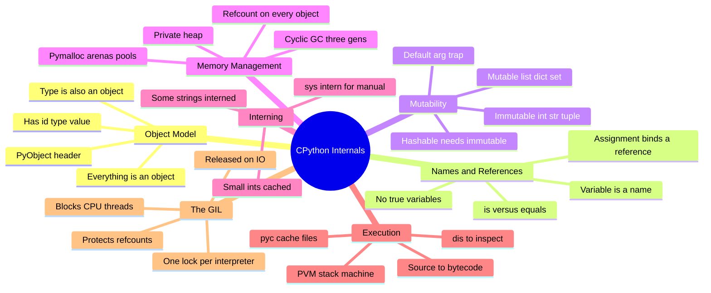
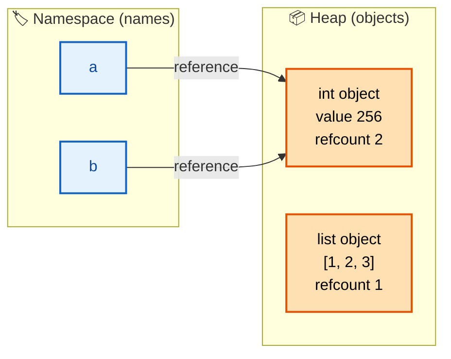
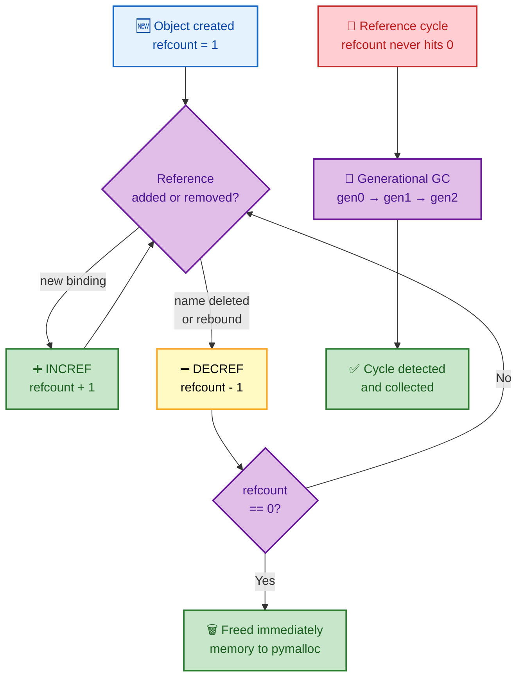
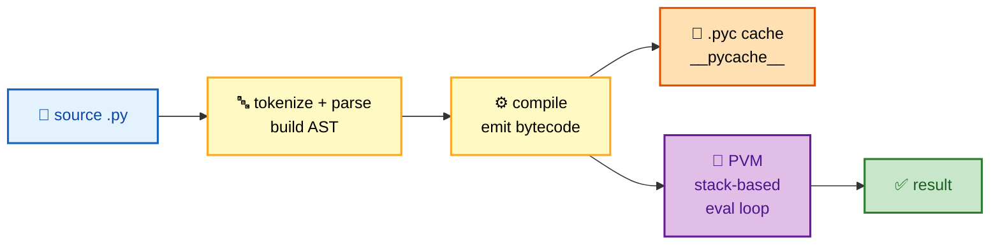
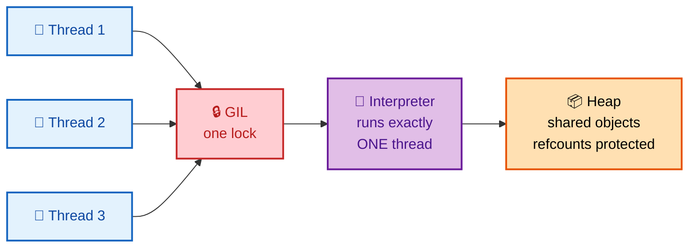

# SECTION 1: LANGUAGE INTERNALS

> **Scope:** How CPython actually represents and runs your code — the object/data model, names vs references, mutability, memory management and garbage collection, interning, bytecode/the PVM, and the Global Interpreter Lock. Nearly every Python interview "gotcha" is a consequence of the mechanics in this file.

---

## 🗺️ Visual Overview

**In one line:** In CPython **everything is an object on the heap**, a **variable is just a name bound to a reference**, memory is reclaimed by **reference counting + a cyclic collector**, and a single **GIL** ensures only one thread runs bytecode at a time.

**Mind map — the internals at a glance** (skim first, revisit last):



**Object & reference model — the single most important mental picture:**



**Memory lifecycle — refcount fast path + cyclic collector backstop:**



**Source to running code — the compile + execute pipeline:**



> 🧠 **Memory hooks (mnemonics):**
> - **Object identity triple:** *"Every object has an **I-T-V**"* → **I**d (address), **T**ype, **V**alue. `is` compares **Id**, `==` compares **V**alue.
> - **Names not boxes:** *"Python has name tags, not boxes."* Assignment ties a label to an object; it never copies the object.
> - **GC in one line:** *"Count first, sweep cycles later."* Refcounting frees most objects instantly; the generational collector exists only to catch reference cycles.
> - **GIL:** *"One lock, one runner."* Only one thread executes bytecode at a time.
> - **Interning:** *"Small ints and identifier-like strings are singletons."* `-5..256` and most literal identifiers are cached.

---

## 1. Everything Is an Object

> 🎯 **Interview weight: High** — the premise behind mutability, `is` vs `==`, duck typing, and why functions/classes can be passed around.

**In one line:** In Python there are no primitives — integers, strings, functions, classes, and modules are all **first-class objects** living on the heap, each carrying an identity, a type, and a value.

Every object has three things you can inspect:

| Property | Function | Meaning |
|----------|----------|---------|
| **Identity** | `id(x)` | Its address in memory (constant for the object's life) |
| **Type** | `type(x)` | Which class it is; the type is *itself* an object (`type(int) is type`) |
| **Value** | the data | The contents; may be mutable or immutable |

```python
x = 42
print(id(x), type(x))        # address, <class 'int'>
print(type(int))             # <class 'type'>  — int is an instance of type
print(isinstance(x, object)) # True — everything ultimately subclasses object
```

🔍 Because functions and classes are objects, you can store them in lists/dicts, pass them as arguments, and return them — the basis of **decorators**, **callbacks**, and **dispatch tables** used everywhere in automation tooling.

> 💡 **Interview tip:** When asked "is everything really an object?", prove it: `(5).__class__`, `"a".upper`, `def f(): pass; f.__name__`. Even a module has `__dict__`.

---

## 2. Names, References & Assignment

> 🎯 **Interview weight: High** — the root cause of the most common Python surprises (shared mutable state, `is` vs `==`, aliasing).

**In one line:** A variable is **not a box that holds a value** — it's a **name bound to a reference** to an object, so `a = b` makes two names point at the *same* object, never a copy.

```python
a = [1, 2, 3]
b = a            # b references the SAME list — no copy
b.append(4)
print(a)         # [1, 2, 3, 4]  — a sees it too (aliasing)

c = a[:]         # shallow copy — new list, same element objects
c.append(5)
print(a)         # unchanged
```

**Assignment semantics to memorize:**

- `name = obj` → **binds** `name` to `obj` (INCREF).
- Rebinding `name = other` → drops the old reference (DECREF), points at the new one.
- `del name` → removes the binding only; the object is freed *only* when its refcount hits 0.

### `is` vs `==`

| Operator | Compares | Use for |
|----------|----------|---------|
| `==` | **value** (calls `__eq__`) | "Are these equal?" — almost always what you want |
| `is` | **identity** (`id()`) | Only for singletons: `is None`, `is True`, `is False` |

```python
a = [1, 2]; b = [1, 2]
a == b   # True  — same value
a is b   # False — different objects

x = None
x is None   # ✅ correct
x == None   # ⚠️ works but wrong idiom — can be fooled by a custom __eq__
```

> ⚠️ **Gotcha:** `a is b` returning `True` for small ints/strings is an **interning artifact**, not a rule. Never use `is` to compare values — a favorite trap where `256 is 256` is `True` but `257 is 257` can be `False` across expressions.

---

## 3. Mutability

> 🎯 **Interview weight: High** — drives the mutable-default-argument bug, what can be a dict key, and copy semantics.

**In one line:** **Immutable** objects can never change value after creation (a "change" makes a new object); **mutable** objects can be modified in place, which means they can be shared and accidentally altered.

| Immutable | Mutable |
|-----------|---------|
| `int`, `float`, `bool`, `complex` | `list` |
| `str`, `bytes` | `dict` |
| `tuple`, `frozenset` | `set` |
| `None` | `bytearray`, most custom objects |

```python
s = "hello"
s += " world"   # does NOT mutate — builds a new str, rebinds s

t = (1, 2, 3)
# t[0] = 9      # TypeError — tuples are immutable
```

### The mutable default argument trap

```python
def add_host(host, registry=[]):   # ⚠️ list created ONCE at def time
    registry.append(host)
    return registry

add_host("web1")   # ['web1']
add_host("web2")   # ['web1', 'web2']  — surprise! same list reused
```

The default is evaluated **once** when the function object is created, and that single list persists across all calls. The fix:

```python
def add_host(host, registry=None):
    if registry is None:
        registry = []          # fresh list every call
    registry.append(host)
    return registry
```

> ⚠️ **Gotcha:** This is the single most-asked Python gotcha in DevOps interviews. Always use `None` as the sentinel for mutable defaults.

🔍 **Why it matters for hashing:** only **immutable (hashable)** objects can be dict keys or set members, because their hash must never change while they're stored. `hash(())` works; `hash([])` raises `TypeError`.

---

## 4. Memory Management & Garbage Collection

> 🎯 **Interview weight: High** — SRE-flavored questions on leaks, cyclic references, and tuning the collector.

**In one line:** CPython frees objects the instant their **reference count** drops to zero, and runs a separate **generational cyclic garbage collector** only to clean up reference cycles that refcounting alone can't reclaim.

### Reference counting (the fast path)

Every object has a `refcount`. Operations that create a reference **INCREF**; those that drop one **DECREF**. At zero, the object is deallocated immediately and its memory returns to the allocator.

```python
import sys
x = []
sys.getrefcount(x)   # e.g. 2 — one for x, one temporary for the argument
y = x
sys.getrefcount(x)   # 3 — y added a reference
```

**Pros:** deterministic, immediate cleanup (great for closing files/sockets). **Cons:** overhead on every operation, and **it cannot free cycles**.

### The cyclic garbage collector (the backstop)

Two objects referencing each other keep each other's refcount ≥ 1 forever:

```python
import gc
a = {}; b = {}
a['b'] = b; b['a'] = a   # cycle — refcounts never reach 0
del a, b                 # unreachable but NOT freed by refcounting
gc.collect()             # the cyclic collector reclaims them
```

The collector uses **three generations** (gen0, gen1, gen2). New objects start in gen0; survivors get promoted. Younger generations are scanned far more often — based on the observation that **most objects die young** (the generational hypothesis).

```python
import gc
gc.get_threshold()   # (700, 10, 10) default — gen0 runs after 700 net allocations
gc.get_count()       # current per-generation counts
gc.disable()         # sometimes done in latency-critical, cycle-free code paths
```

### pymalloc (the allocator)

CPython uses a specialized allocator for small objects (≤ 512 bytes): memory is organized into **arenas → pools → blocks** to avoid constantly asking the OS for memory and to reduce fragmentation.

> 💡 **Interview tip:** "How do you find a memory leak in a long-running Python service?" → Use `tracemalloc` to snapshot and diff allocations, check `gc.garbage` for uncollectable cycles, look for objects with `__del__` in cycles (historically these blocked collection), and watch for unbounded caches/growing module-level containers.

> ⚠️ **Gotcha:** Releasing Python objects does **not** always return memory to the OS — pymalloc may hold freed arenas. RSS staying flat after a spike is often normal, not a leak.

---

## 5. Interning & Object Caching

> 🎯 **Interview weight: Medium** — explains the confusing `is` results and a real micro-optimization.

**In one line:** CPython pre-creates and reuses a fixed pool of **small integers (−5 to 256)** and caches many **identifier-like strings**, so those specific objects are singletons shared everywhere.

```python
a = 256; b = 256
a is b       # True — both point at the cached int object

x = 257; y = 257
x is y       # often False — outside the cached range

s1 = "hello"; s2 = "hello"
s1 is s2     # usually True — compile-time interned literal

import sys
big = sys.intern("some/dynamic/string")   # force interning for fast identity compares
```

**Why strings get interned:** identifiers, dict keys, and names benefit from `is` comparison (pointer compare) instead of char-by-char `==`. Interning makes symbol tables and attribute lookups fast.

> 💡 **Interview tip:** The lesson is not "use `is` for ints/strings" — it's the opposite: *because* interning is an implementation detail that varies by version and context, **always compare values with `==`**.

---

## 6. Bytecode & the Python Virtual Machine

> 🎯 **Interview weight: Medium** — shows you understand Python is compiled-then-interpreted, not "just interpreted line by line."

**In one line:** CPython **compiles** your source to **bytecode** (`.pyc` files cached in `__pycache__`), then the **Python Virtual Machine** — a stack-based evaluation loop — executes that bytecode instruction by instruction.

**The pipeline:** source → tokenize → parse to AST → compile to bytecode → PVM executes.

```python
import dis

def add(a, b):
    return a + b

dis.dis(add)
#   LOAD_FAST   a
#   LOAD_FAST   b
#   BINARY_OP   + (add)
#   RETURN_VALUE
```

Key facts to state confidently:

- **`.pyc` files are a cache**, not compilation for speed of execution — they skip *re-parsing* on import, not interpretation.
- The PVM is a **stack machine**: operands are pushed/popped on an evaluation stack (`LOAD_FAST` pushes, `BINARY_OP` pops two and pushes the result).
- **CPython** is the reference implementation; alternatives include **PyPy** (JIT-compiled, much faster for long-running CPU code), **Jython** (JVM), and **IronPython** (.NET).

> 💡 **Interview tip:** "Is Python interpreted or compiled?" → *"Both. Source is compiled to bytecode, then the bytecode is interpreted by the PVM. The compile step is cached in `.pyc`."* That nuance separates senior candidates from juniors.

---

## 7. The Global Interpreter Lock (GIL)

> 🎯 **Interview weight: Very High** — the defining CPython limitation; expect deep follow-ups. Concurrency strategy lives in [04-CONCURRENCY](04-CONCURRENCY.md).

**In one line:** The GIL is a **single mutex per interpreter** that lets **only one thread execute Python bytecode at a time**, which makes threads useless for CPU-bound parallelism but fine for I/O-bound concurrency.



**Why it exists:** it makes **reference counting thread-safe cheaply**. Without the GIL, every INCREF/DECREF would need its own lock or atomic operation, slowing down single-threaded code (the common case). The GIL trades multi-core threading for simpler, faster single-thread execution and easy C-extension integration.

**When the GIL is released:**

- During **blocking I/O** (network, disk) — so threads *do* help I/O-bound workloads.
- Periodically, based on a **switch interval** (`sys.setswitchinterval`, default ~5 ms) to allow fairness.
- Inside many **C extensions** (NumPy heavy math) that explicitly drop it around long computations.

**When it hurts:** pure-Python **CPU-bound** work (parsing, hashing loops, number crunching) sees *zero* speedup from threads — they serialize on the GIL.

| Workload | Threads help? | Right tool |
|----------|---------------|------------|
| Network/disk I/O | ✅ Yes (GIL released on wait) | `threading`, `asyncio` |
| CPU-bound Python | ❌ No (serialized) | `multiprocessing`, C ext |
| CPU-bound in C (NumPy) | ✅ Often (ext releases GIL) | vectorized libs |

> ⚠️ **Gotcha:** "Add threads to speed up my CSV-crunching script" is a trap — with the GIL you get no speedup and *add* context-switch overhead. Use processes.

> 💡 **Interview tip (2024+):** Mention **PEP 703 / free-threaded CPython (3.13+ experimental `--disable-gil` build)** and the **per-interpreter GIL (PEP 684)** — showing awareness that the GIL is finally being unwound signals you follow the language's direction.

---

## Interview Questions & Answers

#### Q1: What's the difference between `is` and `==`, and why can `is` give surprising results?

**Answer:** `==` compares **value** via `__eq__`; `is` compares **identity** via `id()`. `is` is only correct for singletons (`None`, `True`, `False`).

**Internals:** small integers (−5..256) and many string literals are **interned**, so they're singletons and `is` *happens* to return `True`. Outside those ranges, equal values are distinct objects and `is` returns `False`. This is an implementation detail, not a guarantee.

**Follow-up — "So when do you use `is`?":** Only for `x is None` (and `True`/`False`). It's faster (pointer compare) and can't be fooled by a class overriding `__eq__`.

#### Q2: Explain the mutable default argument bug.

**Answer:** Default argument values are evaluated **once**, at function-definition time, and stored on the function object. A mutable default (like `[]` or `{}`) is therefore **shared across every call**, accumulating state.

**Internals:** the default lives in `func.__defaults__` — a single object reference reused on each call that doesn't pass the argument.

**Follow-up — "Fix it":** Use `None` as a sentinel and create the mutable object inside the body: `def f(x=None): x = [] if x is None else x`.

#### Q3: How does Python's garbage collection work?

**Answer:** Primarily **reference counting** — objects are freed the instant their refcount hits zero. A secondary **generational cyclic collector** reclaims reference cycles that refcounting can't.

**Internals:** three generations (gen0/1/2) with thresholds `(700, 10, 10)`; young objects are scanned most often (most objects die young). You can inspect/tune via the `gc` module and find leaks with `tracemalloc`.

**Follow-up — "Why both mechanisms?":** Refcounting is deterministic and immediate but cannot free cycles (A↔B keep each other alive); the cyclic collector is the backstop. Refcounting's cost is also *why the GIL exists* — to make INCREF/DECREF thread-safe cheaply.

#### Q4: Why does CPython have a GIL and what are its consequences?

**Answer:** The GIL is one mutex ensuring a single thread runs bytecode at a time. It makes reference counting thread-safe without per-object locks, keeping single-threaded code fast and C extensions simple.

**Internals:** it's released during blocking I/O and every ~5 ms switch interval, so I/O-bound threads run concurrently; CPU-bound Python threads serialize and gain nothing.

**Follow-up — "How do you get real parallelism?":** `multiprocessing` (separate interpreters, no shared GIL), C extensions that drop the GIL (NumPy), or the new free-threaded/per-interpreter builds (PEP 703/684).

#### Q5: What happens when you write `a = b = [1, 2, 3]` then `a.append(4)`?

**Answer:** Both `a` and `b` are names bound to the **same** list object, so `b` becomes `[1, 2, 3, 4]` too.

**Internals:** assignment binds names to references; there is no copy. Only an explicit copy (`b = a[:]`, `list(a)`, or `copy.deepcopy`) creates a new object.

**Follow-up — "Shallow vs deep copy?":** A shallow copy duplicates the container but shares the *element* objects; `copy.deepcopy` recursively copies everything (and handles cycles via a memo dict).

---

## ✅ Best Practices

- **Always use `==` for value comparison**; reserve `is` for `None`/`True`/`False`.
- **Never use a mutable default argument** — use `None` sentinels.
- **Prefer immutable types** (tuples, frozensets) for shared/constant data and dict keys.
- **Close resources deterministically** with `with` (leverages refcounting for prompt cleanup) rather than relying on the GC.
- **Profile memory with `tracemalloc`**, not guesswork; check `gc.garbage` for uncollectable cycles.
- **Don't reach for threads to speed up CPU work** — understand the GIL first.

## 📚 Documentation Links

- [Python Data Model](https://docs.python.org/3/reference/datamodel.html)
- [`gc` — Garbage Collector](https://docs.python.org/3/library/gc.html)
- [`sys` — interning, refcounts, switch interval](https://docs.python.org/3/library/sys.html)
- [`dis` — Bytecode disassembler](https://docs.python.org/3/library/dis.html)
- [PEP 703 — Making the GIL optional](https://peps.python.org/pep-0703/)

---

**[← Back to Python Index](README.md)** | **[Next: Data Structures →](02-DATA-STRUCTURES.md)**
