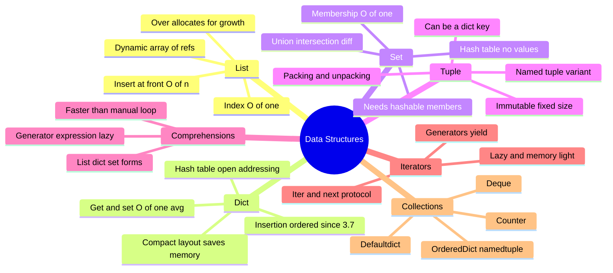
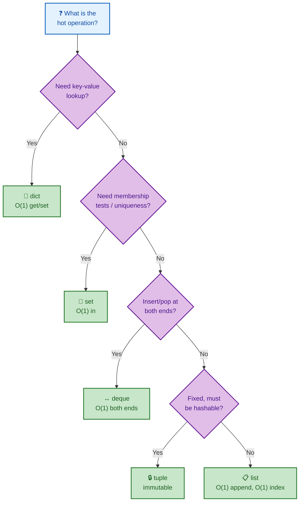
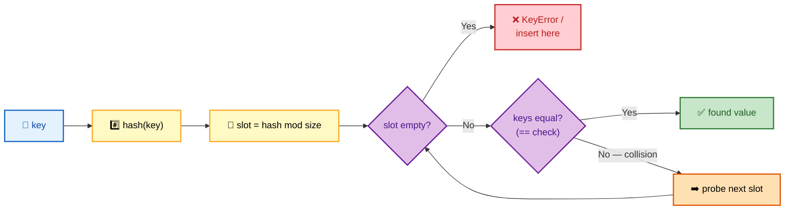
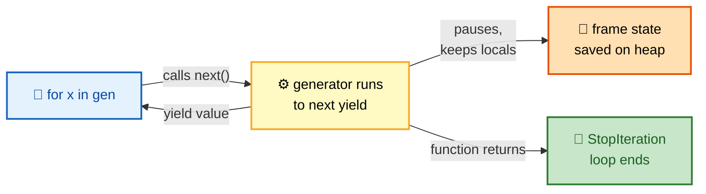

# SECTION 2: DATA STRUCTURES

> **Scope:** The built-in containers (`list`, `dict`, `set`, `tuple`) — their internal representation, Big-O complexity, and the hashing that powers dicts and sets — plus comprehensions, generators/iterators, and the `collections` module. This is the section every phone screen probes.

---

## 🗺️ Visual Overview

**In one line:** A `list` is a **dynamic array** of references, a `dict`/`set` is an **open-addressing hash table** giving amortized O(1) lookup, a `tuple` is an immutable fixed array, and **generators** let you iterate huge data with O(1) memory.

**Mind map — the containers at a glance** (skim first, revisit last):



**Big-O decision map — pick the container by the operation you do most:**



**How a dict find works — hash, probe, compare:**



> 🧠 **Memory hooks (mnemonics):**
> - **Container by need:** *"Look-up → dict, unique → set, ordered-mutable → list, frozen → tuple, ends → deque."*
> - **List front is slow:** *"Append is cheap, insert(0) is dear."* Front operations are O(n) — shift everything. Use `deque` for a queue.
> - **Hashable rule:** *"Only immutables carry a stable hash."* You can't use a list/dict/set as a dict key.
> - **Generators:** *"Lazy pulls, saved state"* — nothing computes until `next()`; O(1) memory over O(n).

---

## 1. List — Dynamic Array

> 🎯 **Interview weight: High** — the amortized-append and O(n)-front-insert questions are near-universal.

**In one line:** A Python `list` is a **contiguous array of pointers** to objects that **over-allocates** spare slots so `append` is amortized O(1), but inserting/deleting at the front is O(n) because every element must shift.

```python
servers = ['web1', 'web2', 'web3']
servers.append('web4')     # amortized O(1)
servers.insert(0, 'lb1')   # O(n) — shifts all elements right
servers[1:3]               # slicing builds a new list — O(k)
```

**Why append is amortized O(1):** when the backing array fills, CPython allocates a **larger** array (growth factor ~1.125x plus a constant) and copies references over. The occasional O(n) resize is spread across many O(1) appends.

| Operation | Complexity | Note |
|-----------|-----------|------|
| Index `lst[i]` | **O(1)** | direct pointer offset |
| `append` / `pop()` (end) | **O(1)** amortized | over-allocation |
| `insert(0, x)` / `pop(0)` | **O(n)** | shifts all elements — use `deque` |
| `x in lst` | **O(n)** | linear scan — use `set` for membership |
| Slice `lst[a:b]` | **O(k)** | copies k references |
| `sort()` | **O(n log n)** | Timsort (stable) |

> ⚠️ **Gotcha:** Using a list as a FIFO queue with `pop(0)` is O(n) per dequeue → O(n²) overall. Reach for `collections.deque` (O(1) both ends).

---

## 2. Dict — Hash Table

> 🎯 **Interview weight: Very High** — how dicts achieve O(1), collision handling, and insertion ordering are perennial.

**In one line:** A `dict` is an **open-addressing hash table** that maps keys to values in **amortized O(1)**, stores entries in **insertion order** (guaranteed since 3.7), and uses a **compact** two-array layout that saves memory.

**How lookup works:** hash the key → compute a slot → if occupied, compare keys with `==`; on collision, **probe** to another slot until a match or an empty slot is found.

```python
config = {'host': 'localhost', 'port': 8080}
config['timeout'] = 30            # O(1) average insert
config.get('missing', 'default')  # O(1), no KeyError
'host' in config                  # O(1) membership
```

**Collision handling:** CPython uses **open addressing with perturbation probing** (not separate chaining) — collided keys are stored in other slots of the same array, and a perturbation sequence spreads probes to avoid clustering.

**Resizing:** when the table is ~2/3 full (load factor), it grows and **rehashes** everything — an occasional O(n) cost amortized across inserts.

**Insertion ordering & compactness:** since 3.6/3.7, entries live in a dense **insertion-ordered array**, while the hash table itself holds **indices** into that array. This both preserves order and cuts memory ~20–25%.

| Operation | Average | Worst case |
|-----------|---------|-----------|
| `d[k]` get/set | **O(1)** | O(n) pathological collisions |
| `k in d` | **O(1)** | O(n) |
| `del d[k]` | **O(1)** | O(n) |
| Iterate | **O(n)** | O(n) |

> ⚠️ **Gotcha:** Dict keys must be **hashable and immutable**. A tuple of immutables works as a key; a list or dict does not (`TypeError: unhashable type`).

> 💡 **Interview tip:** "Average O(1)" comes with a caveat — a bad `__hash__` (e.g., always returning the same value) degrades to O(n). Real-world keys hash well, so O(1) holds.

---

## 3. Set — Hash Table Without Values

> 🎯 **Interview weight: Medium** — membership speed and set algebra for dedup/diff tasks.

**In one line:** A `set` is essentially a **dict with keys but no values** — a hash table giving **O(1) membership** and fast **union/intersection/difference**, ideal for de-duplication and comparing collections.

```python
active = {'host1', 'host2', 'host3'}
desired = {'host2', 'host3', 'host4'}

active & desired   # {'host2', 'host3'}  — intersection (still running)
active - desired   # {'host1'}           — to be removed
desired - active   # {'host4'}           — to be added
active | desired   # union
```

This pattern — **diffing current vs desired state with sets** — is the backbone of reconcilers, config drift detection, and "what changed?" tooling.

| Operation | Complexity |
|-----------|-----------|
| `x in s` | **O(1)** average |
| `add` / `remove` | **O(1)** average |
| `a & b`, `a | b`, `a - b` | **O(len)** |

> ⚠️ **Gotcha:** Set members must be hashable, just like dict keys. Use `frozenset` when you need a set that can itself be a dict key or set member.

---

## 4. Tuple — Immutable Sequence

> 🎯 **Interview weight: Medium** — immutability, hashability, and packing/unpacking.

**In one line:** A `tuple` is an **immutable, fixed-size array**, which makes it **hashable** (usable as a dict key), slightly lighter than a list, and a natural fit for fixed records and multiple return values.

```python
point = (10, 20)            # packing
x, y = point               # unpacking
coords = {(0, 0): 'origin'} # tuple as dict key — works because immutable

# multiple return values are just tuples
def minmax(xs): return min(xs), max(xs)
lo, hi = minmax([3, 1, 4])
```

**`namedtuple`** adds field names without losing tuple efficiency:

```python
from collections import namedtuple
Server = namedtuple('Server', ['name', 'ip', 'role'])
s = Server('web1', '10.0.0.1', 'web')
s.name, s.ip     # attribute access, still a tuple under the hood
```

> 💡 **Interview tip:** "List vs tuple — when?" → Tuple for **fixed, heterogeneous records** that shouldn't change and may need to be a key; list for **homogeneous, growable** collections.

---

## 5. Comprehensions

> 🎯 **Interview weight: Medium** — idiomatic Python and a subtle performance point.

**In one line:** Comprehensions build lists/dicts/sets in a **single expression** that runs **faster than an equivalent manual loop** (the append is optimized in C), while a **generator expression** does the same lazily with O(1) memory.

```python
squares   = [x**2 for x in range(10)]                 # list
by_name   = {s.name: s for s in servers}              # dict
uniq      = {s.role for s in servers}                 # set
lazy_sum  = sum(x**2 for x in range(10**6))           # generator expr — no list built
filtered  = [s for s in servers if s.role == 'web']   # with condition
```

**Why faster:** the interpreter uses specialized bytecode (`LIST_APPEND`) instead of looking up and calling `.append` each iteration.

> ⚠️ **Gotcha:** Don't over-nest. A triple-nested comprehension is unreadable — prefer a loop or a generator function. And a comprehension with side effects (calling a function for its effect) is an anti-pattern; use a plain loop.

---

## 6. Iterators & Generators

> 🎯 **Interview weight: High** — the memory-efficiency story every DevOps interviewer loves (processing huge logs).

**In one line:** An **iterator** implements `__iter__`/`__next__` and produces values one at a time; a **generator** is the easy way to write one using `yield`, pausing its frame between values so you can stream gigabytes with **O(1) memory**.

```python
def read_large_file(path):
    """Stream a multi-GB log without loading it into memory."""
    with open(path) as f:
        for line in f:          # the file object is itself an iterator
            yield line.rstrip()

for line in read_large_file('/var/log/syslog'):
    if 'ERROR' in line:
        print(line)             # O(1) memory regardless of file size
```

**The iterator protocol:**



- Calling a generator function returns a **generator object** (nothing runs yet).
- Each `next()` runs to the next `yield`, returns that value, and **freezes** local state.
- When the function returns, `StopIteration` is raised (the `for` loop handles it).

> ⚠️ **Gotcha:** A generator is **single-pass**. Once exhausted, iterating again yields nothing — you must recreate it. Also, a list comprehension `[...]` eagerly builds everything; use `(...)` for lazy streaming.

> 💡 **Interview tip:** "How do you process a 50 GB log file?" → A generator that yields lines (or a chunked read) keeps memory flat. This is the canonical DevOps answer.

---

## 7. The `collections` Module

> 🎯 **Interview weight: Medium** — knowing these signals fluency and saves reinventing wheels.

**In one line:** `collections` provides battle-tested specialized containers — `defaultdict`, `Counter`, `deque`, `OrderedDict`, `namedtuple` — that make common automation patterns concise and correct.

```python
from collections import defaultdict, Counter, deque

# defaultdict — no KeyError, auto-creates the default
by_role = defaultdict(list)
for s in servers:
    by_role[s.role].append(s.name)   # no need to check/init the key

# Counter — frequency counting in one line (great for log analysis)
status_counts = Counter(log.status_code for log in access_logs)
status_counts.most_common(3)         # top 3 status codes

# deque — O(1) appends/pops at both ends; ideal bounded buffer
recent = deque(maxlen=100)           # keeps only the last 100 items
recent.append(event)                 # auto-drops the oldest when full
```

| Type | Use it for |
|------|-----------|
| `defaultdict` | Grouping/accumulating without key-existence checks |
| `Counter` | Frequency counts, top-N (log status codes, error tallies) |
| `deque` | Queues, fixed-size rolling buffers, BFS |
| `namedtuple` | Lightweight immutable records with named fields |
| `OrderedDict` | Order-sensitive ops like `move_to_end` (dict is ordered but this adds methods) |

> 💡 **Interview tip:** "Count the top 5 IPs hitting an endpoint" → `Counter(ip for ... ).most_common(5)`. One line, and it shows you reach for the right tool.

---

## Interview Questions & Answers

#### Q1: How does a Python dict achieve O(1) lookup, and when does it degrade?

**Answer:** It's a hash table. The key is hashed to a slot; on collision it probes to other slots and compares with `==`. Average O(1) for get/set/delete.

**Internals:** CPython uses **open addressing with perturbation probing** and a **compact, insertion-ordered** layout (index array + dense entries array) that also preserves order and saves memory. It resizes and rehashes at ~2/3 load.

**Follow-up — "When is it O(n)?":** With a pathological `__hash__` that collides everything, all keys land in the same probe chain. Real-world keys hash well, so O(1) holds in practice.

#### Q2: Why is `list.insert(0, x)` slow and what's the fix?

**Answer:** A list is a contiguous array of pointers; inserting at the front must **shift every element** right — O(n). Repeated front-inserts/pops make a list-as-queue O(n²).

**Internals:** append is amortized O(1) because the array over-allocates; front ops get no such help.

**Follow-up — "Fix?":** Use `collections.deque`, which is O(1) at both ends (implemented as a doubly-linked list of blocks).

#### Q3: What can and cannot be a dict key?

**Answer:** Only **hashable** objects — which in practice means **immutable** ones (int, str, tuple-of-immutables, frozenset). Lists, dicts, and sets are unhashable and raise `TypeError`.

**Internals:** the dict needs a **stable hash** for the key's whole lifetime in the table; a mutable object's hash could change and break slot placement. That's why mutability and hashability are linked.

**Follow-up — "Custom objects?":** They're hashable by default (identity-based `__hash__`). If you override `__eq__`, you must also provide a consistent `__hash__`, or set it to `None` to make instances unhashable.

#### Q4: Generator vs list comprehension — when does it actually matter?

**Answer:** A list comprehension `[...]` builds the entire result in memory (O(n)); a generator expression `(...)` yields lazily (O(1) memory), computing each item on demand.

**Internals:** the generator saves its frame state at each `yield` and resumes on `next()`. It's single-pass.

**Follow-up — "Example where it's critical?":** Streaming a huge log: `sum(1 for line in f if 'ERROR' in line)` never materializes the file. A list version would try to hold everything.

#### Q5: You need to detect config drift between current and desired server sets. How?

**Answer:** Use set algebra. `to_add = desired - current`, `to_remove = current - desired`, `unchanged = current & desired`. Each is O(len) and reads like the intent.

**Internals:** sets are hash tables, so membership and these operations are near-linear and far faster than nested list comparisons (O(n²)).

**Follow-up — "If items aren't hashable?":** Make them hashable (convert dict records to frozen/namedtuples) or fall back to sorting + comparison; unhashable items can't go in a set.

---

## ✅ Best Practices

- **Choose the container by the hot operation** — dict/set for lookups, deque for queues, list for ordered growable data.
- **Use `set` for membership and dedup**, never a repeated `in list`.
- **Stream large data with generators**; don't load whole files into lists.
- **Reach for `collections`** (`defaultdict`, `Counter`, `deque`) instead of hand-rolling.
- **Keep dict keys immutable and well-hashing**; pair any custom `__eq__` with a matching `__hash__`.
- **Prefer comprehensions** over manual `append` loops for clarity and speed — but don't over-nest.

## 📚 Documentation Links

- [Built-in Types](https://docs.python.org/3/library/stdtypes.html)
- [`collections`](https://docs.python.org/3/library/collections.html)
- [TimeComplexity wiki (Big-O of operations)](https://wiki.python.org/moin/TimeComplexity)
- [Generators & the iterator protocol](https://docs.python.org/3/howto/functional.html)

---

**[← Prev: Language Internals](01-LANGUAGE-INTERNALS.md)** | **[Back to Index](README.md)** | **[Next: OOP & Functions →](03-OOP-AND-FUNCTIONS.md)**
