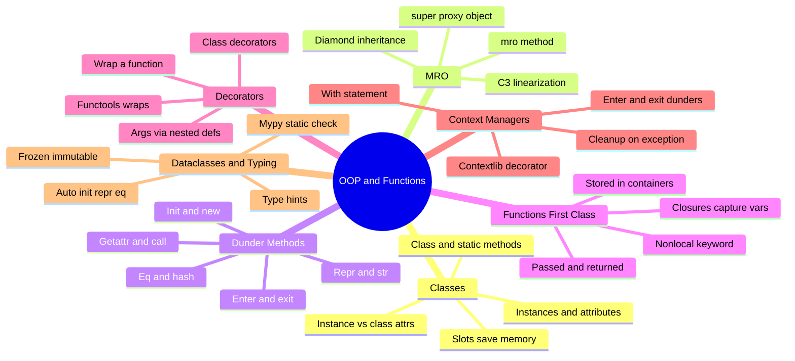
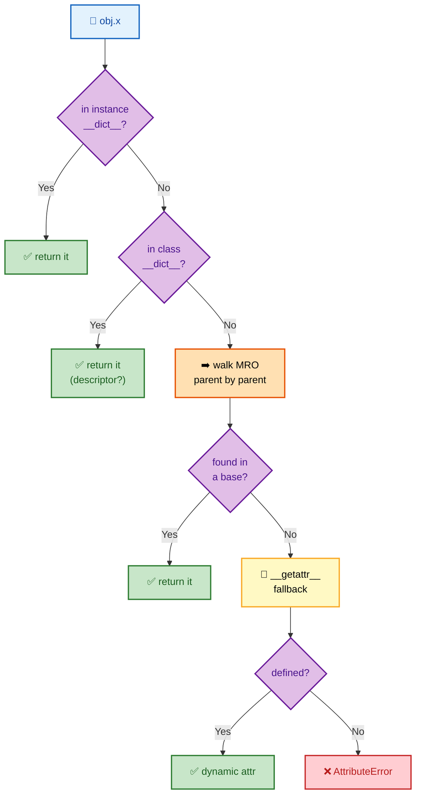
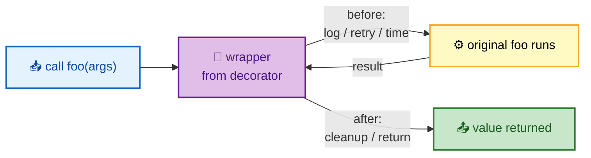
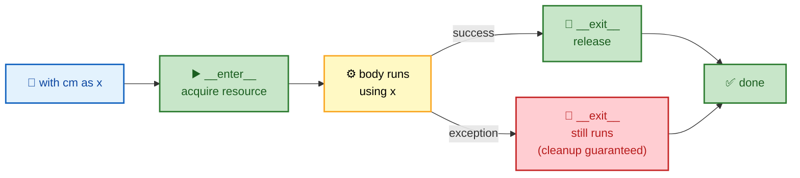

# SECTION 3: OOP & FUNCTIONS

> **Scope:** Classes and instances, method resolution order (MRO), dunder (magic) methods, first-class functions, closures, decorators, context managers, dataclasses, and type hints. These are the building blocks you'll compose into real automation tooling in [05-AUTOMATION-SCRIPTING](05-AUTOMATION-SCRIPTING.md).

---

## 🗺️ Visual Overview

**In one line:** Python's OOP is **attribute lookup through a chain of dicts** resolved by the **MRO**, its functions are **first-class objects** that can be wrapped by **decorators** and capture state in **closures**, and `with` + dunder methods give you deterministic resource handling.

**Mind map — the toolkit at a glance** (skim first, revisit last):



**Attribute lookup & MRO — where does `obj.x` come from?**



**Decorator wrapping — a function around a function:**



**Context manager lifecycle — enter, use, always exit:**



> 🧠 **Memory hooks (mnemonics):**
> - **Attribute order:** *"Instance, Class, Parents, `__getattr__`"* — the lookup walks that path.
> - **Decorator:** *"Gift-wrap the function"* — add behavior before/after without touching the original.
> - **Context manager:** *"Enter, use, exit"* — `__enter__` sets up, `__exit__` always tears down, even on exceptions.
> - **Closure:** *"A function that remembers"* — it captures the enclosing variables by reference.
> - **`super()`:** *"Next in line, not parent"* — `super()` follows the MRO, which in diamonds isn't simply the base class.

---

## 1. Classes, Attributes & `__slots__`

> 🎯 **Interview weight: Medium** — instance vs class attributes and the memory story behind `__slots__`.

**In one line:** An instance is mostly a **`__dict__`** mapping attribute names to values; the class holds shared attributes and methods, and `__slots__` replaces the per-instance dict with a fixed layout to save memory at scale.

```python
class Server:
    provider = "aws"                 # class attribute — shared by all instances

    def __init__(self, name, ip):
        self.name = name             # instance attributes — per object
        self.ip = ip

s = Server("web1", "10.0.0.1")
s.__dict__                           # {'name': 'web1', 'ip': '10.0.0.1'}
Server.provider                      # shared
```

**`__slots__`** — when you create millions of small objects, the per-instance `__dict__` is costly:

```python
class Point:
    __slots__ = ('x', 'y')           # no __dict__; fixed slots
    def __init__(self, x, y):
        self.x, self.y = x, y
```

This can cut memory ~40–50% and speed attribute access, at the cost of losing dynamic attribute assignment.

**Method types:**

| Decorator | First arg | Use for |
|-----------|-----------|---------|
| (none) | `self` | Normal instance behavior |
| `@classmethod` | `cls` | Alternative constructors, factory methods |
| `@staticmethod` | — | Utility grouped with the class, no state |

> 💡 **Interview tip:** Class attributes are shared — mutating a **mutable** class attribute (e.g., a list) from one instance affects all. This is the class-level twin of the mutable-default bug.

---

## 2. MRO & `super()`

> 🎯 **Interview weight: Medium-High** — the diamond-inheritance/`super()` question separates people who *use* inheritance from those who *understand* it.

**In one line:** Python resolves methods through the **MRO** — a single linear ordering of the class and all its ancestors computed by the **C3 linearization** algorithm — and `super()` calls the **next class in that MRO**, not necessarily the literal parent.

```python
class A:            pass
class B(A):         pass
class C(A):         pass
class D(B, C):      pass

D.__mro__   # (D, B, C, A, object) — C3 linearization, no duplicates
```

**Why C3 matters (the diamond):** with `D(B, C)` both inheriting from `A`, a naive depth-first search would hit `A` before `C`. C3 guarantees each class appears **once** and that subclasses precede their bases, so `super()` in `B` can correctly reach `C` before `A`. This makes **cooperative multiple inheritance** (mixins) work.

```python
class LoggingMixin:
    def save(self):
        print("log")
        super().save()      # calls the NEXT in MRO, enabling chaining
```

> ⚠️ **Gotcha:** `super()` does not mean "my parent" — it means "the next class in the MRO." In multiple inheritance that next class can be a *sibling*. Always call `super().__init__()` so cooperative chains aren't broken.

---

## 3. Dunder (Magic) Methods

> 🎯 **Interview weight: Medium** — how operators, printing, and protocols hook into your objects.

**In one line:** Dunder methods (`__init__`, `__repr__`, `__eq__`, `__enter__`, `__call__`, …) are the **hooks** the interpreter calls to implement construction, representation, operators, and protocols — implementing them makes your objects behave like built-ins.

| Dunder | Triggered by | Purpose |
|--------|-------------|---------|
| `__init__` | `Cls(...)` | Initialize a new instance |
| `__repr__` | `repr(x)`, REPL | Unambiguous debug string (implement this!) |
| `__str__` | `str(x)`, `print` | Human-friendly string |
| `__eq__` / `__hash__` | `==`, dict/set keys | Equality and hashability (define together) |
| `__enter__` / `__exit__` | `with` | Context manager protocol |
| `__iter__` / `__next__` | `for` | Iterator protocol |
| `__call__` | `x()` | Make an instance callable |
| `__getattr__` | missing attr | Dynamic attribute fallback |

```python
class Server:
    def __init__(self, name): self.name = name
    def __repr__(self):       return f"Server({self.name!r})"
    def __eq__(self, other):  return isinstance(other, Server) and self.name == other.name
    def __hash__(self):       return hash(self.name)   # required to stay hashable after __eq__
```

> ⚠️ **Gotcha:** Defining `__eq__` without `__hash__` makes instances **unhashable** (Python sets `__hash__` to `None`). If you want them usable as dict keys, define both consistently.

---

## 4. First-Class Functions & Closures

> 🎯 **Interview weight: Medium** — the prerequisite for decorators and callback-driven automation.

**In one line:** Functions are **objects** you can pass, return, and store; a **closure** is a nested function that **captures and remembers** variables from its enclosing scope even after that scope has returned.

```python
def make_retrier(max_attempts):
    def retry(fn):
        for attempt in range(max_attempts):      # captures max_attempts
            ...
    return retry                                  # closure over max_attempts

r = make_retrier(3)   # r "remembers" max_attempts=3
```

Closures capture **by reference**, not by value:

```python
# ⚠️ classic bug — all lambdas share the same i
fns = [lambda: i for i in range(3)]
[f() for f in fns]    # [2, 2, 2] — i is the final value

# ✅ bind per-iteration with a default argument
fns = [lambda i=i: i for i in range(3)]
[f() for f in fns]    # [0, 1, 2]
```

Use `nonlocal` to rebind a captured variable from the inner function:

```python
def counter():
    count = 0
    def inc():
        nonlocal count      # without this, count += 1 raises UnboundLocalError
        count += 1
        return count
    return inc
```

> 💡 **Interview tip:** The late-binding closure bug (`[2,2,2]`) is a favorite. Fix with a default-argument capture or `functools.partial`.

---

## 5. Decorators

> 🎯 **Interview weight: High** — the most-asked "intermediate" topic; retry/timing/caching decorators show up constantly in DevOps code.

**In one line:** A decorator is a **callable that takes a function and returns a replacement** (usually a wrapper), letting you inject cross-cutting behavior — logging, retries, timing, caching, auth — **without editing the wrapped function**.

```python
import functools, time

def retry(max_attempts=3, delay=1):
    """Retry a flaky operation — a real DevOps workhorse."""
    def decorator(func):
        @functools.wraps(func)                 # preserve name, docstring, signature
        def wrapper(*args, **kwargs):
            last_exc = None
            for attempt in range(max_attempts):
                try:
                    return func(*args, **kwargs)
                except Exception as e:
                    last_exc = e
                    time.sleep(delay)
            raise last_exc
        return wrapper
    return decorator

@retry(max_attempts=3, delay=2)
def call_flaky_api(): ...
```

**The three nesting levels explained:** `retry(...)` takes the *arguments* → returns `decorator` which takes the *function* → returns `wrapper` which takes the *call arguments*. A decorator **without** arguments needs only two levels.

**Why `functools.wraps` matters:** without it, the wrapper replaces the original's `__name__`, `__doc__`, and signature — breaking introspection, docs, and some frameworks.

**Built-in decorators worth naming:** `@property`, `@staticmethod`, `@classmethod`, `@functools.lru_cache` (memoization), `@functools.cached_property`.

```python
@functools.lru_cache(maxsize=128)
def expensive_lookup(key):        # results cached — repeated calls are O(1)
    ...
```

> ⚠️ **Gotcha:** Always use `@functools.wraps(func)` on your wrapper. Forgetting it is a common code-review catch.

---

## 6. Context Managers

> 🎯 **Interview weight: High** — deterministic cleanup is a reliability topic interviewers love.

**In one line:** A context manager guarantees **setup and teardown** around a block via `__enter__`/`__exit__` (or the `@contextmanager` decorator), so resources — files, locks, connections, temp state — are **always released, even on exceptions**.

```python
# Class-based
class SSHConnection:
    def __init__(self, host): self.host = host
    def __enter__(self):
        print(f"connect {self.host}")
        return self
    def __exit__(self, exc_type, exc_val, exc_tb):
        print(f"disconnect {self.host}")
        return False                # False → don't suppress exceptions

with SSHConnection("server1") as conn:
    ...                             # disconnect runs no matter what
```

```python
# Generator-based — less boilerplate
from contextlib import contextmanager
import os

@contextmanager
def temporary_env(key, value):
    original = os.environ.get(key)
    os.environ[key] = value
    try:
        yield                       # everything before yield = __enter__
    finally:
        if original is None:        # everything after = __exit__ (always runs)
            os.environ.pop(key, None)
        else:
            os.environ[key] = original
```

**`__exit__` return value:** return `False`/`None` to let exceptions propagate (the common case); return `True` to **suppress** the exception (rare, be deliberate).

> 💡 **Interview tip:** "Why `with open(...)` over manual `open`/`close`?" → `__exit__` closes the file even if the body raises, preventing descriptor leaks. The same pattern guards locks (`with lock:`) and DB transactions.

---

## 7. Dataclasses & Type Hints

> 🎯 **Interview weight: Medium** — modern idiomatic Python; dataclasses are everywhere in configs/records.

**In one line:** A `@dataclass` auto-generates `__init__`, `__repr__`, and `__eq__` from typed field declarations, and **type hints** enable static checking with `mypy` — catching bugs before runtime without affecting execution.

```python
from dataclasses import dataclass, field
from typing import Optional

@dataclass
class ServerConfig:
    name: str
    ip: str
    role: str
    ssh_user: str = "ubuntu"                       # defaults after non-defaults
    tags: list[str] = field(default_factory=list)  # mutable default done right

@dataclass(frozen=True)          # immutable + hashable — usable as a dict key
class Endpoint:
    host: str
    port: int
```

- `field(default_factory=list)` is the **correct** way to give a dataclass a mutable default (avoids the shared-list bug).
- `frozen=True` makes instances immutable and hashable.
- Type hints are **not enforced at runtime** — they're for tooling (`mypy`, IDEs) and documentation.

```python
def scale(name: str, replicas: int) -> bool:   # hints document the contract
    ...
```

> 💡 **Interview tip:** "Dataclass vs namedtuple vs dict?" → namedtuple = lightweight immutable tuple with names; dataclass = mutable-by-default record with methods and defaults; dict = dynamic, no fixed schema. Prefer dataclasses for structured records you'll add behavior to.

---

## Interview Questions & Answers

#### Q1: What does `super()` actually call in multiple inheritance?

**Answer:** The **next class in the MRO**, not the literal parent. In a diamond (`D(B, C)`), `super()` inside `B` can reach `C` before the shared base `A`.

**Internals:** the MRO is computed by **C3 linearization**, which guarantees each ancestor appears once and subclasses precede bases. `super()` is a proxy that dispatches to the next MRO entry relative to the current class.

**Follow-up — "Why call `super().__init__()` always?":** So cooperative multiple-inheritance chains (mixins) all get initialized; skipping it breaks the chain for siblings.

#### Q2: Walk me through writing a retry decorator with arguments.

**Answer:** Three nested functions: the outer takes decorator *args* (`max_attempts`), the middle takes the *function*, the inner `wrapper` takes the *call args* and implements the retry loop. Decorate the wrapper with `@functools.wraps(func)`.

**Internals:** `@retry(3)` first calls `retry(3)` to get `decorator`, then applies it to the function. Without arguments you'd only need two levels.

**Follow-up — "Why `functools.wraps`?":** It copies `__name__`, `__doc__`, `__wrapped__`, and signature so the wrapped function still introspects correctly.

#### Q3: How do context managers guarantee cleanup, and how do you write one quickly?

**Answer:** `__enter__` acquires the resource; `__exit__(exc_type, exc_val, tb)` runs **unconditionally** — on normal exit *and* on exception — so cleanup is guaranteed. The quick way is `@contextlib.contextmanager` with a `try/finally` around a single `yield`.

**Internals:** the `with` statement calls `__enter__`, binds its return to `as x`, runs the body, then calls `__exit__`. Returning `True` from `__exit__` suppresses the exception.

**Follow-up — "Real use?":** File handles, `threading.Lock`, DB transactions, temporarily setting env vars/working directory, and timing blocks.

#### Q4: What is a closure and what's the classic bug?

**Answer:** A closure is a nested function that captures variables from its enclosing scope by **reference**. The classic bug: creating lambdas in a loop all capture the *same* loop variable, so they all see its final value (`[2,2,2]`).

**Internals:** the free variable is looked up when the inner function *runs*, not when it's defined (late binding). Fix by binding per-iteration via a default argument (`lambda i=i: i`) or `functools.partial`.

**Follow-up — "`nonlocal`?":** Needed to *rebind* (not just read) an enclosing variable from the inner function; otherwise `count += 1` creates a new local and raises `UnboundLocalError`.

#### Q5: Why prefer a `@dataclass(frozen=True)` over a plain class for a config record?

**Answer:** It auto-generates `__init__`/`__repr__`/`__eq__`, enforces a typed schema, and `frozen=True` makes instances immutable and **hashable** — so they're safe to share and usable as dict keys.

**Internals:** the decorator synthesizes the dunder methods at class-creation time from the annotated fields; `frozen` overrides `__setattr__` to raise on mutation.

**Follow-up — "Mutable default field?":** Use `field(default_factory=list)` — a bare `[]` default raises `ValueError` in dataclasses precisely to prevent the shared-mutable bug.

---

## ✅ Best Practices

- **Always implement `__repr__`** for classes you'll debug; it makes logs and REPL sessions readable.
- **Define `__eq__` and `__hash__` together**, or leave both default.
- **Use `@functools.wraps`** on every decorator wrapper.
- **Manage every resource with `with`** — files, locks, connections, transactions.
- **Use dataclasses for structured records**; `field(default_factory=...)` for mutable defaults; `frozen=True` when immutability helps.
- **Add type hints and run `mypy`** — free bug-catching with no runtime cost.
- **Call `super().__init__()`** to keep cooperative inheritance working.

## 📚 Documentation Links

- [Classes & MRO](https://docs.python.org/3/tutorial/classes.html) · [`super()`](https://docs.python.org/3/library/functions.html#super)
- [`functools`](https://docs.python.org/3/library/functools.html) · [`contextlib`](https://docs.python.org/3/library/contextlib.html)
- [`dataclasses`](https://docs.python.org/3/library/dataclasses.html)
- [`typing`](https://docs.python.org/3/library/typing.html) · [Data model (dunders)](https://docs.python.org/3/reference/datamodel.html)

---

**[← Prev: Data Structures](02-DATA-STRUCTURES.md)** | **[Back to Index](README.md)** | **[Next: Concurrency →](04-CONCURRENCY.md)**
