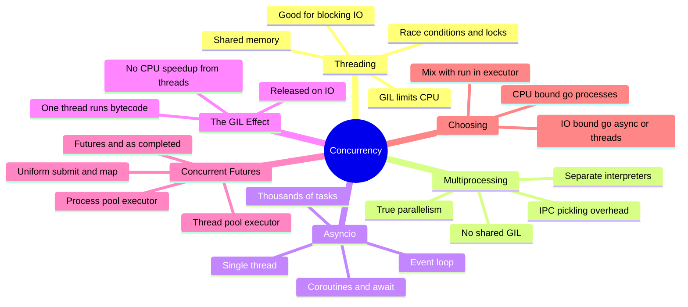
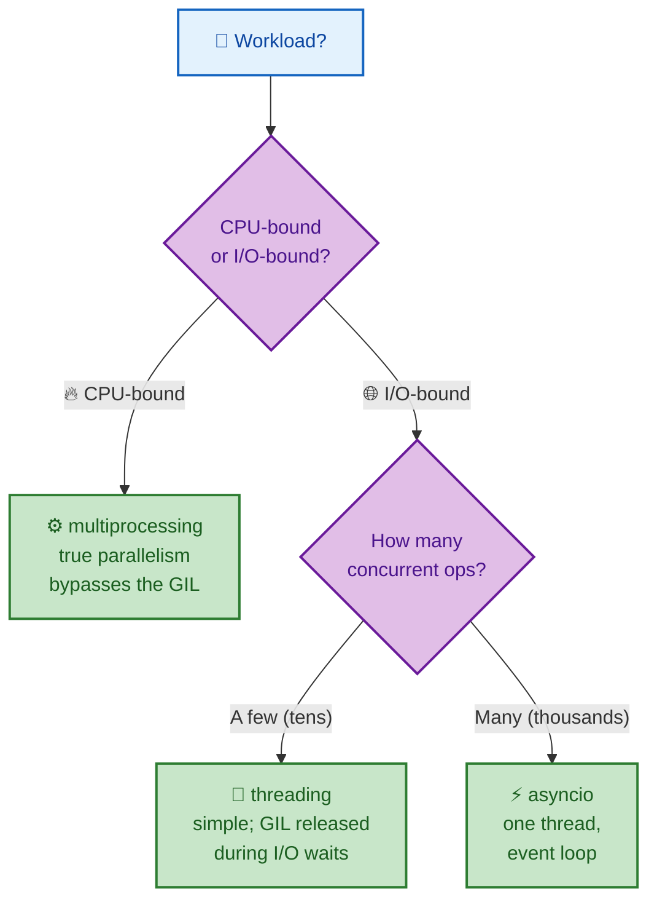
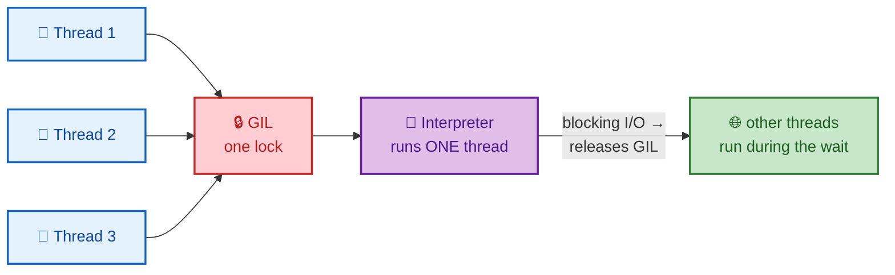
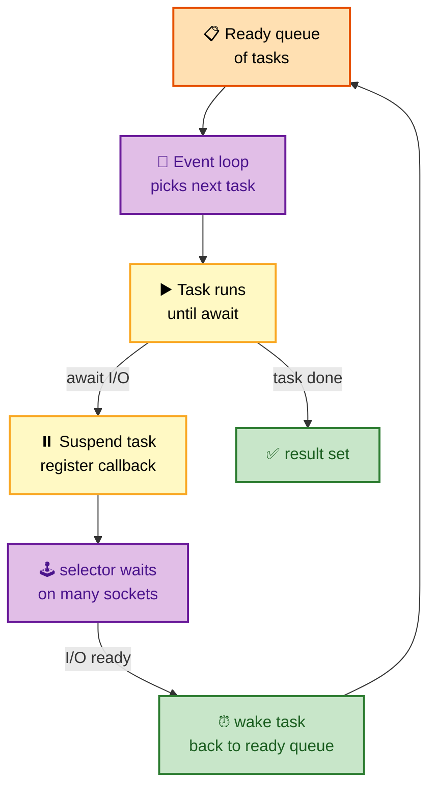
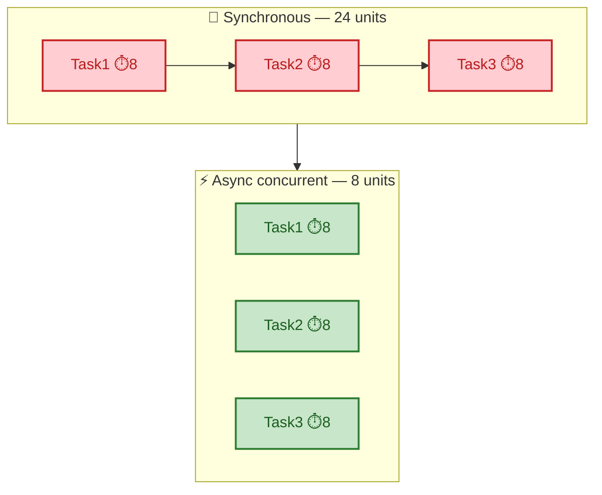

# SECTION 4: CONCURRENCY

> **Scope:** The single most-probed senior Python topic — threads vs processes vs async, how the **GIL** shapes every choice, the **asyncio** event loop and coroutines, **multiprocessing** for true parallelism, and the unified `concurrent.futures` API. Read [01-LANGUAGE-INTERNALS §7](01-LANGUAGE-INTERNALS.md) first for the GIL mechanics.

---

## 🗺️ Visual Overview

**In one line:** Because the **GIL serializes bytecode**, you pick concurrency by workload: **`multiprocessing`** for CPU-bound (true parallelism across cores), **`threading`** for a modest number of I/O-bound tasks, and **`asyncio`** for thousands of concurrent I/O operations on one thread.

**Mind map — the concurrency landscape** (skim first, revisit last):



**The decision tree — the highest-value diagram in this file:**



**The GIL & threads — why CPU threads don't scale:**



**asyncio event loop — cooperative single-thread scheduling:**



> 🧠 **Memory hooks (mnemonics):**
> - **The one-line rule:** *"CPU forks, I/O awaits."* CPU-bound → processes; I/O-bound → async/threads.
> - **GIL truth:** *"One lock, one runner"* — threads never speed up pure-Python CPU work.
> - **Async is cooperative:** *"No await, no switch."* A coroutine hogs the loop until it hits an `await`; a blocking call inside async freezes everything.
> - **Processes cost:** *"Parallel but pricey"* — separate memory + pickling for IPC; use for heavy CPU, not tiny tasks.

---

## 1. Threads vs Processes vs Async — The Core Trade-off

> 🎯 **Interview weight: Very High** — you must be able to pick and *justify* the model in seconds.

**In one line:** Threads share memory and are cheap but GIL-limited to one running at a time; processes get real parallel cores at the cost of memory and IPC; async runs thousands of tasks on one thread by cooperatively switching at `await` points.

| Model | Parallelism | Memory | Best for | Cost |
|-------|-------------|--------|----------|------|
| **threading** | ❌ (GIL) | Shared | Blocking I/O, few tasks | Races, locks, GIL for CPU |
| **multiprocessing** | ✅ Real | Separate | CPU-bound work | Fork/spawn + pickling IPC |
| **asyncio** | ❌ (1 thread) | Shared | Thousands of I/O ops | Needs async libs; no blocking calls |

**The mental model:**
- **Concurrency** = dealing with many things at once (structure). **Parallelism** = doing many things at once (execution). Async and threads give concurrency; only multiprocessing gives CPU parallelism in CPython.



> 💡 **Interview tip:** The async/threads win only appears for **I/O-bound** work (network, disk). For CPU-bound math, async and threads give *zero* speedup because of the GIL — use `multiprocessing`.

---

## 2. Threading

> 🎯 **Interview weight: High** — when threads help, and the race/lock story.

**In one line:** Threads run in the same process and share memory, so they're ideal for **blocking I/O** (the GIL is released during the wait) but require **locks** to avoid races on shared state and give **no speedup for CPU-bound** code.

```python
from concurrent.futures import ThreadPoolExecutor, as_completed

def configure(server):          # blocking SSH/HTTP work → GIL released on I/O
    ...

with ThreadPoolExecutor(max_workers=5) as pool:
    futures = {pool.submit(configure, s): s for s in servers}
    for fut in as_completed(futures):
        result = fut.result()
```

**Races & locks:** because threads share memory, `count += 1` is not atomic (load, add, store) and can interleave. Guard shared mutable state:

```python
import threading
lock = threading.Lock()
with lock:            # context manager acquires/releases
    shared_counter += 1
```

> ⚠️ **Gotcha:** Even though the GIL serializes bytecode, it does **not** make your multi-step operations atomic — a context switch can happen between bytecodes. You still need locks for read-modify-write on shared data.

---

## 3. Multiprocessing

> 🎯 **Interview weight: High** — the *only* way to get CPU parallelism in pure Python.

**In one line:** `multiprocessing` spawns **separate Python processes**, each with its own interpreter and GIL, so CPU-bound work runs **truly in parallel** across cores — at the cost of higher memory and **pickling** data for inter-process communication.

```python
from concurrent.futures import ProcessPoolExecutor

def crunch(chunk):              # pure-Python CPU work
    return sum(x * x for x in chunk)

with ProcessPoolExecutor(max_workers=4) as pool:
    results = list(pool.map(crunch, chunks))   # runs on 4 cores in parallel
```

**Key mechanics:**
- **start methods:** `fork` (fast, Unix — copy-on-write memory), `spawn` (default on Windows/macOS — fresh interpreter, must re-import), `forkserver`.
- **IPC:** arguments and return values are **pickled** and sent over a pipe/queue. Unpicklable objects (open sockets, lambdas) can't cross the boundary.
- **Shared state:** use `multiprocessing.Queue`, `Pipe`, or `Value`/`Array` in shared memory — you can't just share a normal variable.

| Concern | threading | multiprocessing |
|---------|-----------|-----------------|
| CPU parallel | ❌ | ✅ |
| Memory | shared | separate (higher) |
| Data sharing | direct | pickle/IPC |
| Startup cost | low | higher (spawn) |
| Crash isolation | shared fate | isolated |

> ⚠️ **Gotcha:** Passing large objects to workers is dominated by **pickling cost**. For tiny tasks, process overhead can make it *slower* than serial. Batch work into chunks.

---

## 4. Asyncio — The Event Loop

> 🎯 **Interview weight: Very High** — expect "how does the event loop work" and "what breaks async."

**In one line:** `asyncio` runs a single-threaded **event loop** that interleaves **coroutines**; each coroutine runs until it hits `await`, at which point it **yields control** back to the loop so another task can run — enabling thousands of concurrent I/O operations without threads.

```python
import asyncio, aiohttp

async def check_health(session, url):
    try:
        async with session.get(url, timeout=5) as resp:
            return url, resp.status
    except Exception as e:
        return url, str(e)

async def check_all(urls):
    async with aiohttp.ClientSession() as session:
        tasks = [check_health(session, u) for u in urls]
        return dict(await asyncio.gather(*tasks))   # all run concurrently

results = asyncio.run(check_all([
    "http://svc1/health", "http://svc2/health", "http://svc3/health",
]))
```

**How it actually works:**
- `async def` creates a **coroutine function**; calling it returns a coroutine object (nothing runs yet).
- `await` on an awaitable **suspends** the coroutine and hands control to the loop; the loop uses an OS **selector** (`epoll`/`kqueue`/IOCP) to watch many sockets at once and resumes the coroutine when its I/O is ready.
- `asyncio.gather(*tasks)` schedules tasks **concurrently** and collects results.

**Concurrency vs true parallelism:** it's still **one thread** — async gives concurrency, not CPU parallelism. It wins because most time in I/O work is *waiting*, and the loop fills that wait with other tasks.

> ⚠️ **Gotcha (the #1 async mistake):** Calling a **blocking** function (`time.sleep`, `requests.get`, heavy CPU) inside a coroutine **freezes the entire loop** — every other task stalls. Use `await asyncio.sleep(...)`, async libraries (`aiohttp`), or offload blocking work with `loop.run_in_executor(...)`.

```python
# Bridge blocking code into async without freezing the loop
result = await asyncio.get_event_loop().run_in_executor(None, blocking_fn, arg)
```

> 💡 **Interview tip:** "Why is my async code not faster?" → Usually a hidden blocking call, or the work is CPU-bound (async can't parallelize CPU). Async only helps overlap *waiting*.

---

## 5. `concurrent.futures` — One API for Both Pools

> 🎯 **Interview weight: Medium** — the clean, uniform way to parallelize without low-level thread/process code.

**In one line:** `concurrent.futures` gives a **uniform high-level interface** — `ThreadPoolExecutor` for I/O-bound and `ProcessPoolExecutor` for CPU-bound — with identical `submit`/`map`/`as_completed` semantics, so switching models is a one-line change.

```python
from concurrent.futures import ThreadPoolExecutor, ProcessPoolExecutor, as_completed

# I/O-bound: threads
with ThreadPoolExecutor(max_workers=10) as pool:
    futures = [pool.submit(fetch, url) for url in urls]
    for fut in as_completed(futures):     # yields as each completes
        handle(fut.result())              # .result() re-raises worker exceptions

# CPU-bound: swap one class name — processes
with ProcessPoolExecutor(max_workers=4) as pool:
    for result in pool.map(crunch, chunks):
        ...
```

- `submit` returns a **`Future`** — a handle to an eventual result; `.result()` blocks until done and **re-raises** any exception from the worker.
- `as_completed` yields futures in **completion order** (great for progress); `map` preserves **input order**.
- The `with` block calls `shutdown()` to wait for and clean up workers.

> 💡 **Interview tip:** This is the answer to "how would you parallelize N independent tasks cleanly?" — pick the executor by workload, submit futures, collect via `as_completed`. No manual thread management.

---

## Interview Questions & Answers

#### Q1: I have a CPU-bound script. Will adding threads speed it up? Why or why not?

**Answer:** No. The **GIL** allows only one thread to execute Python bytecode at a time, so CPU-bound threads serialize and you *add* context-switch overhead. Use `multiprocessing` (or `ProcessPoolExecutor`) for real parallelism across cores.

**Internals:** the GIL is released during blocking I/O and every ~5 ms, which is why threads help I/O but not CPU. Processes each have their own interpreter and GIL.

**Follow-up — "What if the CPU work is in NumPy?":** Many C extensions release the GIL around heavy computation, so threads *can* parallelize vectorized NumPy — but pure-Python loops cannot.

#### Q2: Explain how the asyncio event loop achieves concurrency on one thread.

**Answer:** Coroutines run until they hit `await`, which suspends them and returns control to the loop. The loop uses an OS selector (`epoll`/`kqueue`) to watch many sockets, and resumes each coroutine when its I/O is ready — overlapping all the *waiting*.

**Internals:** `async def` returns a coroutine; `await` yields to the scheduler; `gather` schedules tasks concurrently. It's cooperative multitasking — no preemption.

**Follow-up — "What breaks it?":** Any blocking call (`time.sleep`, `requests`, CPU loop) inside a coroutine freezes the whole loop. Use async libraries or `run_in_executor`.

#### Q3: threading vs multiprocessing vs asyncio — decision criteria?

**Answer:** CPU-bound → **multiprocessing** (bypasses the GIL). I/O-bound with a few tasks → **threading**. I/O-bound with thousands of concurrent ops → **asyncio**. The axis is CPU-bound vs I/O-bound, then scale.

**Internals:** threads/async share memory and are GIL-bound; processes have separate memory and pay pickling/IPC costs but achieve true parallelism.

**Follow-up — "Mix them?":** Yes — run blocking or CPU work from async via `loop.run_in_executor` with a thread or process pool, keeping the event loop responsive.

#### Q4: The GIL serializes bytecode — so do I still need locks in threaded code?

**Answer:** Yes. The GIL guarantees one thread runs bytecode at a time, but a context switch can occur **between** bytecodes, so multi-step operations like `x += 1` (load, add, store) can interleave and corrupt shared state. Guard shared mutable data with a `Lock`.

**Internals:** the switch interval (~5 ms) triggers thread handoff even mid-operation; only individual bytecodes are atomic, not your logical operations.

**Follow-up — "Which ops are atomic?":** A few single-bytecode ops (e.g., a simple `list.append`) are effectively atomic, but relying on that is fragile — use explicit locks.

#### Q5: Why might multiprocessing be *slower* than a serial loop?

**Answer:** Each task's arguments and results are **pickled** and shipped over IPC, and processes have spawn/fork startup cost. For many tiny tasks, this overhead dominates the actual work.

**Internals:** `spawn` re-imports the module and creates a fresh interpreter; large objects cost serialization time and memory.

**Follow-up — "Fix?":** **Chunk** the work so each process gets a substantial batch, minimize data crossing the boundary, and reuse a pool rather than spawning per task.

---

## ✅ Best Practices

- **Classify the workload first** (CPU-bound vs I/O-bound) — it dictates the model.
- **Never block the event loop** — use async libraries or `run_in_executor` for blocking/CPU work.
- **Use `concurrent.futures`** for clean pools; switch Thread↔Process by changing one class.
- **Always `.result()` futures** (or check exceptions) — worker errors are otherwise swallowed.
- **Guard shared mutable state with locks**; prefer immutable data or queues to avoid races.
- **Chunk multiprocessing work** to amortize pickling/startup overhead.
- **Set timeouts** on all network calls so one hung task can't stall the batch.

## 📚 Documentation Links

- [`asyncio`](https://docs.python.org/3/library/asyncio.html) · [`threading`](https://docs.python.org/3/library/threading.html)
- [`multiprocessing`](https://docs.python.org/3/library/multiprocessing.html) · [`concurrent.futures`](https://docs.python.org/3/library/concurrent.futures.html)
- [GIL explainer (Python wiki)](https://wiki.python.org/moin/GlobalInterpreterLock)
- [PEP 703 — free-threaded CPython](https://peps.python.org/pep-0703/)

---

**[← Prev: OOP & Functions](03-OOP-AND-FUNCTIONS.md)** | **[Back to Index](README.md)** | **[Next: Automation & Scripting →](05-AUTOMATION-SCRIPTING.md)**
