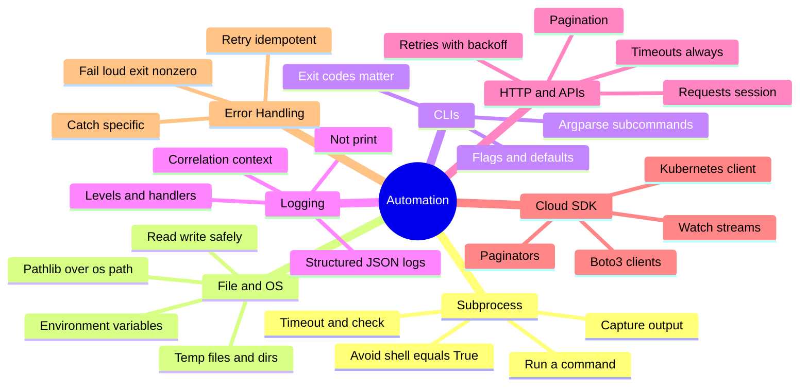
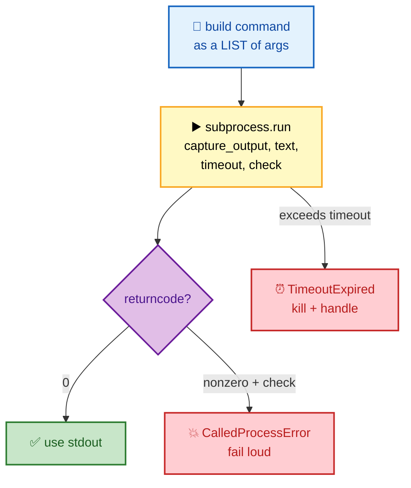
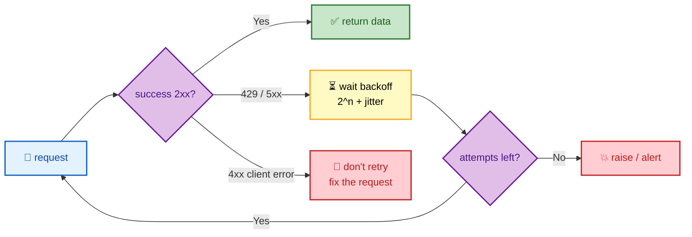

# SECTION 5: AUTOMATION & SCRIPTING

> **Scope:** The craft you'll actually be asked to whiteboard — shelling out with `subprocess`, file/OS operations, building CLIs with `argparse`, structured `logging`, calling HTTP APIs with `requests`, cloud SDK patterns (boto3, kubernetes-client), and robust error handling. This is where the internals from §1–4 turn into production tooling.

---

## 🗺️ Visual Overview

**In one line:** Good DevOps Python is **`subprocess` done safely**, **paths via `pathlib`**, **CLIs via `argparse`**, **`logging` not `print`**, **APIs with retries/pagination**, and **errors handled specifically** — reliable glue between systems.

**Mind map — the automation toolkit** (skim first, revisit last):



**Safe subprocess flow — the pattern that avoids injection and hangs:**



**API call with retry + backoff — resilient integration:**



> 🧠 **Memory hooks (mnemonics):**
> - **Subprocess safety:** *"List args, no shell."* Pass a list, avoid `shell=True`, always set a `timeout`.
> - **Paths:** *"`pathlib` over string glue."* `Path("/a") / "b"` beats `os.path.join` and `+`.
> - **Logging:** *"Log, don't print."* Levels + handlers + structure → searchable, filterable, production-ready.
> - **APIs:** *"Timeout, retry, paginate."* Never call a remote API without all three.
> - **Errors:** *"Catch narrow, fail loud."* Catch specific exceptions; exit nonzero so CI/orchestrators notice.

---

## 1. `subprocess` — Shelling Out Safely

> 🎯 **Interview weight: High** — the `shell=True` injection risk and hang-avoidance are classic senior checks.

**In one line:** Use `subprocess.run` with the command as a **list of arguments** (not a shell string), capture output with `capture_output=True, text=True`, and always set a **`timeout`** — this avoids shell-injection and hung processes.

```python
import subprocess

def run(cmd: list[str], timeout: int = 60) -> tuple[int, str, str]:
    """Run a command safely and return (rc, stdout, stderr)."""
    try:
        result = subprocess.run(
            cmd,                        # LIST, not a string → no shell parsing
            capture_output=True,
            text=True,                  # decode bytes → str
            timeout=timeout,
        )
        return result.returncode, result.stdout, result.stderr
    except subprocess.TimeoutExpired:
        return -1, "", "command timed out"

rc, out, err = run(["kubectl", "get", "pods", "-n", "prod"])
```

**Why not `shell=True`?** It passes your string to `/bin/sh`, so any interpolated user input can inject commands (`; rm -rf /`). With a list, arguments are passed directly to `execve` — no shell, no injection.

```python
# ⚠️ DANGEROUS — shell injection if `ns` is attacker-controlled
subprocess.run(f"kubectl get pods -n {ns}", shell=True)

# ✅ SAFE
subprocess.run(["kubectl", "get", "pods", "-n", ns])
```

**`check=True`** raises `CalledProcessError` on nonzero exit — use it when a failure should stop the script (fail loud). Omit it and inspect `returncode` when you want to handle failures yourself.

> ⚠️ **Gotcha:** Without a `timeout`, a hung child (e.g., an SSH waiting for a prompt) blocks your automation forever. Always bound it.

---

## 2. File & OS Operations with `pathlib`

> 🎯 **Interview weight: Medium** — modern, cross-platform file handling.

**In one line:** Prefer `pathlib.Path` for filesystem work — it's object-oriented, cross-platform, and composes paths with `/` — and use context managers so files close deterministically.

```python
from pathlib import Path

base = Path("/var/log/myapp")
base.mkdir(parents=True, exist_ok=True)          # like mkdir -p

for logfile in base.glob("*.log"):               # iterate matching files
    if logfile.stat().st_size > 10 * 1024**2:    # > 10 MB
        text = logfile.read_text()               # small files: one-shot read
        logfile.with_suffix(".log.old").write_text(text)

config = Path.home() / ".config" / "app.yaml"    # compose with /
if config.exists():
    data = config.read_text()
```

**Environment & temp files:**

```python
import os, tempfile

token = os.environ.get("API_TOKEN")              # .get → None if unset, no crash
if token is None:
    raise SystemExit("API_TOKEN not set")        # fail loud, nonzero exit

with tempfile.NamedTemporaryFile(mode="w", suffix=".json", delete=True) as tmp:
    tmp.write(payload)
    tmp.flush()                                  # auto-deleted on context exit
```

> 💡 **Interview tip:** `os.environ["X"]` raises `KeyError` if missing; `os.environ.get("X", default)` is safer for optional config. For required config, fail fast with a clear message.

---

## 3. Building CLIs with `argparse`

> 🎯 **Interview weight: Medium** — real tools have real interfaces; exit codes matter for automation.

**In one line:** `argparse` turns a script into a proper CLI with typed flags, subcommands, help text, and defaults — and pairing it with meaningful **exit codes** makes it composable in pipelines.

```python
import argparse, sys

def main() -> int:
    parser = argparse.ArgumentParser(description="Manage servers")
    sub = parser.add_subparsers(dest="command", required=True)

    scale = sub.add_parser("scale", help="scale a deployment")
    scale.add_argument("name")
    scale.add_argument("--replicas", type=int, default=3)
    scale.add_argument("--dry-run", action="store_true")

    args = parser.parse_args()

    if args.command == "scale":
        if args.dry_run:
            print(f"[dry-run] would scale {args.name} to {args.replicas}")
            return 0
        ok = do_scale(args.name, args.replicas)
        return 0 if ok else 1        # nonzero exit → CI/orchestrator sees failure

    return 0

if __name__ == "__main__":
    sys.exit(main())                 # propagate the exit code to the shell
```

> 💡 **Interview tip:** Return `0` on success and nonzero on failure, and `sys.exit(main())`. Automation, CI gates, and `&&` chains all rely on exit codes — a script that always exits 0 silently breaks pipelines.

---

## 4. Logging (Not `print`)

> 🎯 **Interview weight: Medium-High** — production readiness signal; observability interviewers probe this.

**In one line:** Use the `logging` module — with **levels**, **handlers**, and ideally **structured (JSON) output** — instead of `print`, so operators can filter by severity, route logs, and correlate them across a fleet.

```python
import logging

logging.basicConfig(
    level=logging.INFO,
    format="%(asctime)s %(levelname)s %(name)s %(message)s",
)
logger = logging.getLogger(__name__)

logger.info("configuring %s", server.name)       # lazy %-formatting
logger.warning("retrying after transient error")
logger.error("failed to reach %s", url, exc_info=True)  # include traceback
```

**Why not `print`?**

| `print` | `logging` |
|---------|-----------|
| No severity | Levels (DEBUG→CRITICAL) filter noise |
| Always stdout | Handlers route to file, syslog, stderr, network |
| No metadata | Timestamps, module, PID, custom fields |
| Can't disable | Configurable per-module |

**Structured logging** (JSON) makes logs machine-parseable for ELK/Loki/CloudWatch:

```python
import json, logging

class JsonFormatter(logging.Formatter):
    def format(self, record):
        return json.dumps({
            "ts": self.formatTime(record),
            "level": record.levelname,
            "msg": record.getMessage(),
            "logger": record.name,
        })
```

> ⚠️ **Gotcha:** Use `logger.info("x=%s", val)` (lazy formatting), not `logger.info(f"x={val}")` — the f-string is evaluated even when the level is disabled, wasting work in hot paths.

---

## 5. HTTP & APIs with `requests`

> 🎯 **Interview weight: High** — timeouts, retries, and pagination are the difference between a demo and production code.

**In one line:** Call APIs through a `requests.Session` with a mounted **retry adapter** (exponential backoff on 429/5xx), **always set a timeout**, and **paginate** — anything less is fragile against real networks.

```python
import requests
from requests.adapters import HTTPAdapter
from urllib3.util.retry import Retry

def make_session() -> requests.Session:
    session = requests.Session()
    retry = Retry(
        total=5,
        backoff_factor=0.5,                 # 0.5, 1, 2, 4, 8 s (+ jitter)
        status_forcelist=[429, 500, 502, 503, 504],
        allowed_methods=["GET", "POST"],
    )
    session.mount("https://", HTTPAdapter(max_retries=retry))
    return session

session = make_session()
resp = session.get("https://api.example.com/v1/nodes", timeout=(3, 10))  # (connect, read)
resp.raise_for_status()                     # turn 4xx/5xx into an exception
data = resp.json()
```

**Pagination** — never assume a single page:

```python
def fetch_all(session, url):
    while url:
        r = session.get(url, timeout=10)
        r.raise_for_status()
        page = r.json()
        yield from page["items"]            # stream items lazily (generator)
        url = page.get("next")              # follow the cursor until None
```

> ⚠️ **Gotcha:** A `requests` call **without `timeout`** can hang indefinitely if the server never responds — the default is no timeout. This is the #1 cause of stuck automation jobs.

---

## 6. Cloud SDK Patterns (boto3 & kubernetes-client)

> 🎯 **Interview weight: High** — paginators, client reuse, and watch streams are the real-world patterns.

**In one line:** With cloud SDKs, **reuse a single client**, **use paginators** (don't hand-roll `NextToken` loops), handle **`ClientError` specifically**, and for Kubernetes drive the API via the official client with **watch streams** for events.

### boto3 (AWS)

```python
import boto3
from botocore.exceptions import ClientError

ec2 = boto3.client("ec2", region_name="us-east-1")   # reuse this client

def find_instances(tag_key: str, tag_value: str) -> list[dict]:
    paginator = ec2.get_paginator("describe_instances")  # handles NextToken for you
    instances = []
    for page in paginator.paginate(
        Filters=[{"Name": f"tag:{tag_key}", "Values": [tag_value]}]
    ):
        for res in page["Reservations"]:
            for inst in res["Instances"]:
                tags = {t["Key"]: t["Value"] for t in inst.get("Tags", [])}
                instances.append({"id": inst["InstanceId"], "name": tags.get("Name")})
    return instances

def stop_by_tag(tag_key, tag_value):
    ids = [i["id"] for i in find_instances(tag_key, tag_value)]
    if ids:
        try:
            ec2.stop_instances(InstanceIds=ids)
        except ClientError as e:
            if e.response["Error"]["Code"] == "IncorrectInstanceState":
                pass                          # already stopping — idempotent
            else:
                raise
```

> 💡 **Interview tip:** Always use **paginators** (`get_paginator`) — AWS list APIs cap results per call (often 50–1000) and silently truncate if you ignore `NextToken`. Hand-rolled loops are the classic "missing half my instances" bug.

### kubernetes-client (Python)

```python
from kubernetes import client, config, watch
from kubernetes.client.rest import ApiException

# In-cluster (pod) or local kubeconfig — try in-cluster first
try:
    config.load_incluster_config()
except config.ConfigException:
    config.load_kube_config()

apps = client.AppsV1Api()
core = client.CoreV1Api()

def scale(name, replicas, ns="default"):
    try:
        apps.patch_namespaced_deployment_scale(
            name, ns, {"spec": {"replicas": replicas}}
        )
    except ApiException as e:
        if e.status == 404:
            raise SystemExit(f"deployment {name} not found")
        raise

# Watch stream — react to pod events in real time (controllers/operators)
w = watch.Watch()
for event in w.stream(core.list_namespaced_pod, namespace="prod", timeout_seconds=60):
    print(event["type"], event["object"].metadata.name)   # ADDED/MODIFIED/DELETED
```

> 💡 **Interview tip:** The **watch stream** is how controllers/operators work — you subscribe to resource changes and reconcile, rather than polling. Handle `404` (resource gone) and `409` (conflict) explicitly.

---

## 7. Error Handling & Resilience

> 🎯 **Interview weight: High** — SRE-flavored; how you handle partial failure defines production quality.

**In one line:** Catch **specific** exceptions (never bare `except:`), **retry only idempotent** operations with backoff, clean up with `try/finally` or `with`, and **fail loud** (nonzero exit, logged traceback) so orchestrators and humans notice.

```python
import logging
logger = logging.getLogger(__name__)

def deploy(service):
    try:
        artifact = build(service)              # may raise BuildError
        push(artifact)                         # may raise requests exceptions
    except BuildError as e:
        logger.error("build failed for %s: %s", service, e)
        raise                                  # re-raise — don't swallow
    except requests.Timeout:
        logger.warning("push timed out, will retry %s", service)
        retry_later(service)                   # idempotent → safe to retry
    finally:
        cleanup_workspace(service)             # always runs
```

**Rules:**
- **Catch narrowly:** `except ValueError:` not `except Exception:` — a bare/broad catch hides bugs (including `KeyboardInterrupt`, `SystemExit` with bare `except:`).
- **Retry only idempotent work:** re-running a `GET` or a `PUT` is safe; blindly retrying a non-idempotent `POST` can double-charge/double-provision.
- **Exponential backoff + jitter:** avoid retry storms that hammer a recovering service.
- **Fail loud:** log with `exc_info=True` and exit nonzero; silent failures are the worst outcome in automation.

> ⚠️ **Gotcha:** `except Exception: pass` is the single most dangerous line in DevOps scripts — it turns a crash into silent data loss or a half-provisioned system. If you must continue, log it.

---

## Interview Questions & Answers

#### Q1: Why is `subprocess.run(cmd, shell=True)` dangerous, and what's the safe form?

**Answer:** `shell=True` passes your string to `/bin/sh`, so any interpolated input can inject arbitrary commands (`; rm -rf /`). The safe form passes the command as a **list** — arguments go straight to `execve` with no shell parsing.

**Internals:** with a list, there's no shell metacharacter interpretation; with `shell=True` the whole string is re-tokenized by the shell.

**Follow-up — "When is `shell=True` acceptable?":** Only when you genuinely need shell features (pipes, globbing) *and* the command is fully static/trusted — and even then, prefer building the pipeline in Python.

#### Q2: What three things must every production API call have?

**Answer:** A **timeout** (so it can't hang forever), a **retry with exponential backoff** on transient errors (429/5xx), and **pagination** handling (don't assume one page). Plus `raise_for_status()` to surface HTTP errors.

**Internals:** `requests` defaults to *no* timeout; a `Retry` adapter mounted on a `Session` handles backoff; list APIs cap results and require following a cursor/`next` token.

**Follow-up — "Retry on 4xx?":** No — 4xx is a client error (bad request/auth); retrying won't help. Retry only 429 and 5xx.

#### Q3: `print` vs `logging` in automation — why does it matter?

**Answer:** `logging` gives severity **levels** (filter noise), pluggable **handlers** (file/syslog/stderr/network), and **metadata** (timestamp, module, PID). `print` is unstructured stdout you can't filter, route, or disable per-module.

**Internals:** loggers form a hierarchy; handlers and formatters (including JSON) attach centrally, so you change output routing without touching call sites.

**Follow-up — "Structured logging?":** Emit JSON so log aggregators (ELK/Loki/CloudWatch) can index fields and you can correlate across a fleet.

#### Q4: How do you list all EC2 instances/S3 objects when there are thousands?

**Answer:** Use the SDK's **paginator** (`ec2.get_paginator("describe_instances")`, `s3.get_paginator("list_objects_v2")`), which transparently follows `NextToken`/continuation tokens. Never rely on a single call — it truncates.

**Internals:** AWS list APIs return a bounded page plus a token; the paginator loops until the token is exhausted.

**Follow-up — "Memory for huge results?":** Process pages/items **lazily** (iterate the paginator, `yield` items) rather than accumulating everything in a list.

#### Q5: When is it safe to automatically retry an operation?

**Answer:** Only when it's **idempotent** — running it again yields the same result without side effects (most `GET`s, `PUT`s, `DELETE`s). Non-idempotent operations (a `POST` that creates/charges) can double-execute on retry.

**Internals:** pair retries with exponential backoff + jitter to avoid retry storms, and use idempotency keys where the API supports them.

**Follow-up — "Making a POST safe to retry?":** Send an **idempotency key** so the server deduplicates, or design the operation to be naturally idempotent (upsert by unique ID).

---

## ✅ Best Practices

- **`subprocess`:** list args, no `shell=True`, always a `timeout`, `check=True` when failure should stop.
- **Paths:** use `pathlib`; compose with `/`; read/write inside `with`.
- **Config:** `os.environ.get` for optional, fail-fast for required secrets — never hardcode.
- **CLIs:** `argparse` + meaningful exit codes + `sys.exit(main())`.
- **Logging over print;** levels, handlers, structured JSON; lazy `%`-formatting.
- **APIs:** Session + retry/backoff + timeout + pagination + `raise_for_status()`.
- **SDKs:** reuse clients, use paginators, handle `ClientError`/`ApiException` codes explicitly.
- **Errors:** catch specific, retry only idempotent, `try/finally` cleanup, fail loud (nonzero exit).

## 📚 Documentation Links

- [`subprocess`](https://docs.python.org/3/library/subprocess.html) · [`pathlib`](https://docs.python.org/3/library/pathlib.html) · [`argparse`](https://docs.python.org/3/library/argparse.html)
- [`logging` HOWTO](https://docs.python.org/3/howto/logging.html)
- [`requests`](https://requests.readthedocs.io/) · [urllib3 `Retry`](https://urllib3.readthedocs.io/en/stable/reference/urllib3.util.html)
- [boto3](https://boto3.amazonaws.com/v1/documentation/api/latest/index.html) · [Kubernetes Python client](https://github.com/kubernetes-client/python)

---

**[← Prev: Concurrency](04-CONCURRENCY.md)** | **[Back to Index](README.md)** | **[Next: Testing & Packaging →](06-TESTING-PACKAGING.md)**
