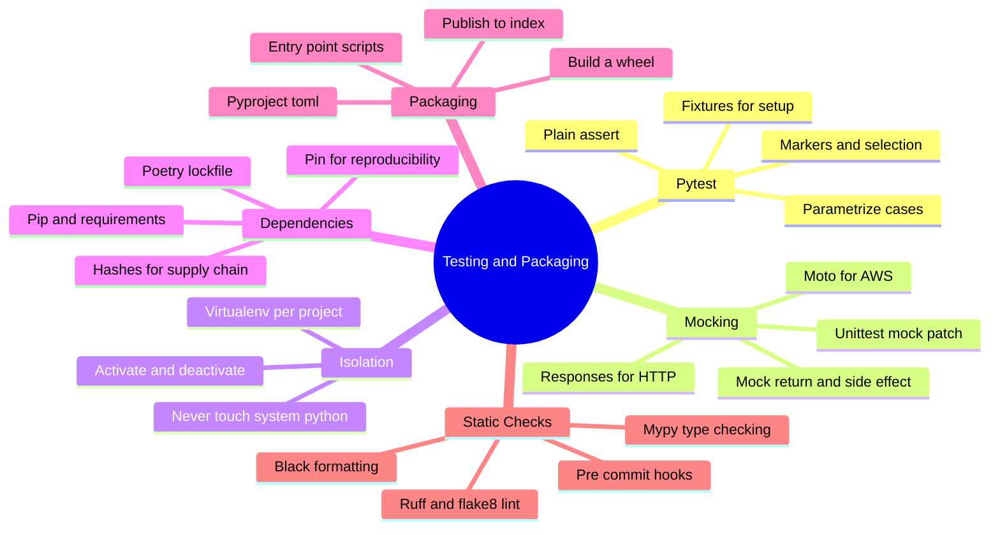
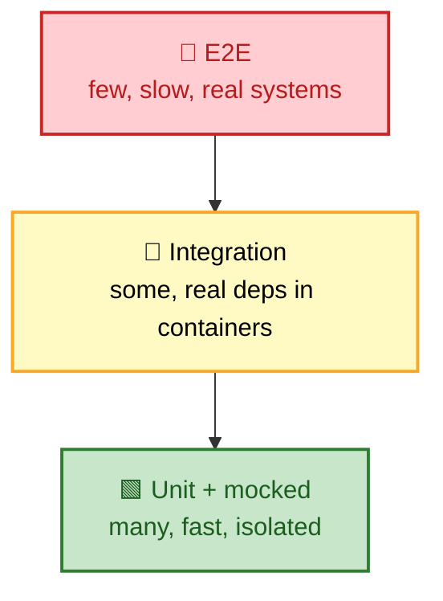
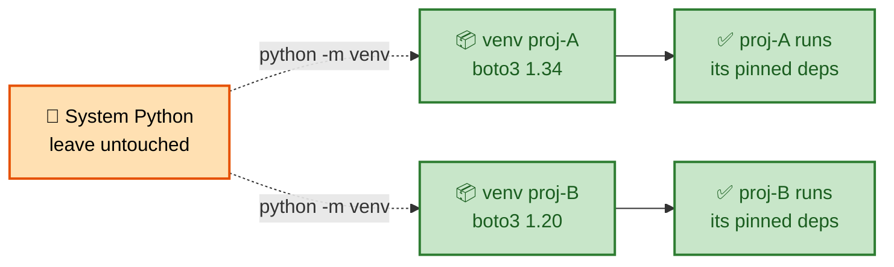

# SECTION 6: TESTING & PACKAGING

> **Scope:** Proving your automation works and shipping it reliably — `pytest` and fixtures, mocking/patching (including `moto` and `responses` for cloud/HTTP), virtual environments, `pip`/`poetry` dependency management, packaging, static type checking with `mypy`, and linting/formatting. This is the production-maturity signal in an interview.

---

## 🗺️ Visual Overview

**In one line:** Test with **pytest fixtures + assert**, isolate external systems with **mocks** (`unittest.mock`, `moto`, `responses`), isolate dependencies in **virtualenvs**, pin them with **pip/poetry**, catch type bugs with **mypy**, and enforce style with **ruff/black** — all wired into CI.

**Mind map — the quality toolkit** (skim first, revisit last):



**Test pyramid — where DevOps code lives:**



**Dependency isolation — why every project gets its own venv:**



> 🧠 **Memory hooks (mnemonics):**
> - **Mock the boundary:** *"Patch where it's used, not where it's defined."* `@patch("mymodule.requests.get")`, not `requests.get`.
> - **Fixtures:** *"Arrange once, reuse everywhere."* Fixtures provide setup/teardown; `yield` splits the two.
> - **Isolate always:** *"One venv per project, never the system Python."*
> - **Pin for repro:** *"Lockfiles make builds deterministic."*
> - **Types + lint = free bugs caught:** *"mypy before runtime, ruff before review."*

---

## 1. pytest — The Testing Framework

> 🎯 **Interview weight: Medium-High** — how you test *infrastructure* code (which touches external systems) is the real question.

**In one line:** `pytest` uses plain `assert` (with rich failure introspection), discovers `test_*` functions automatically, and scales from tiny unit tests to parametrized suites — no boilerplate `TestCase` classes required.

```python
# test_utils.py — pytest discovers test_* automatically
def parse_memory(s: str) -> int:
    units = {"Ki": 1024, "Mi": 1024**2, "Gi": 1024**3}
    for suffix, mult in units.items():
        if s.endswith(suffix):
            return int(s[:-2]) * mult
    return int(s)

def test_parse_memory_gibibytes():
    assert parse_memory("2Gi") == 2 * 1024**3   # plain assert; pytest shows the diff

def test_parse_memory_plain_bytes():
    assert parse_memory("512") == 512
```

**Parametrize** to cover many cases without duplication:

```python
import pytest

@pytest.mark.parametrize("value,expected", [
    ("1Ki", 1024),
    ("1Mi", 1024**2),
    ("1Gi", 1024**3),
    ("100", 100),
])
def test_parse_memory(value, expected):
    assert parse_memory(value) == expected
```

**Test exceptions** explicitly:

```python
def test_invalid_input_raises():
    with pytest.raises(ValueError):
        parse_memory("not-a-number")
```

> 💡 **Interview tip:** Run with `pytest -v --cov=. --cov-report=term-missing` to show coverage and which lines are untested. Mention that **coverage is a floor, not a goal** — 100% coverage with weak asserts proves nothing.

---

## 2. Fixtures — Reusable Setup/Teardown

> 🎯 **Interview weight: Medium** — fixtures are pytest's dependency-injection model.

**In one line:** A **fixture** is a function that provides a prepared object (config, temp dir, mock client) to tests via dependency injection, with `yield` cleanly separating setup from teardown, and **scopes** controlling how often it runs.

```python
import pytest

@pytest.fixture
def server_config():                         # setup
    from myapp import ServerConfig
    return ServerConfig(name="test", ip="10.0.0.1", role="web")

@pytest.fixture
def temp_workspace(tmp_path):                # tmp_path is a built-in fixture
    (tmp_path / "config.yaml").write_text("key: value")
    yield tmp_path                           # everything after yield = teardown
    # cleanup here if needed (tmp_path auto-removed)

def test_uses_config(server_config):         # inject by parameter name
    assert server_config.role == "web"
```

**Scopes** control lifetime — reuse expensive setup:

| Scope | Runs | Use for |
|-------|------|---------|
| `function` (default) | Every test | Isolated per-test state |
| `module` | Once per file | Shared read-only setup |
| `session` | Once per run | Expensive resources (containers, DB) |

```python
@pytest.fixture(scope="session")
def db_container():
    container = start_postgres()
    yield container
    container.stop()
```

Put shared fixtures in **`conftest.py`** — pytest auto-discovers them without imports.

> 💡 **Interview tip:** Built-in fixtures worth naming: `tmp_path` (temp dir), `monkeypatch` (patch env/attrs), `capsys` (capture stdout/stderr), `caplog` (assert on log records).

---

## 3. Mocking — Isolating External Systems

> 🎯 **Interview weight: High** — the crux of testing DevOps code: how do you test something that calls AWS/k8s/SSH without real infrastructure?

**In one line:** Replace external calls with **mocks** — `unittest.mock.patch` for arbitrary functions, **`moto`** to fake AWS, **`responses`** to fake HTTP — so tests are fast, deterministic, and don't touch real systems or cost money.

### `unittest.mock`

```python
from unittest.mock import Mock, patch
import subprocess

@patch("myapp.subprocess.run")               # patch WHERE it's used
def test_run_command_success(mock_run):
    mock_run.return_value = Mock(returncode=0, stdout="ok", stderr="")
    from myapp import run
    rc, out, err = run(["echo", "hi"])
    assert rc == 0 and out == "ok"
    mock_run.assert_called_once()            # verify the interaction

@patch("myapp.subprocess.run")
def test_run_command_timeout(mock_run):
    mock_run.side_effect = subprocess.TimeoutExpired("cmd", 60)  # raise on call
    from myapp import run
    rc, _, err = run(["sleep", "100"])
    assert rc == -1 and "timed out" in err.lower()
```

- `return_value` sets what the mock returns; `side_effect` raises an exception or returns successive values.
- `assert_called_once_with(...)` verifies the call happened with the right arguments.

> ⚠️ **Gotcha (the #1 mocking mistake):** Patch the name **where it's looked up**, not where it's defined. If `myapp` does `from subprocess import run`, patch `myapp.run`, not `subprocess.run`. Patching the wrong path silently does nothing.

### `moto` for AWS, `responses` for HTTP

```python
import boto3
from moto import mock_aws

@mock_aws                                    # fakes the whole AWS API in-memory
def test_s3_sync(tmp_path):
    s3 = boto3.client("s3", region_name="us-east-1")
    s3.create_bucket(Bucket="test-bucket")
    (tmp_path / "f.txt").write_text("hi")

    from myapp import sync_directory
    uploaded = sync_directory(str(tmp_path), "test-bucket")
    assert uploaded == 1
    assert "f.txt" in [o["Key"] for o in s3.list_objects_v2(Bucket="test-bucket")["Contents"]]
```

```python
import responses, requests

@responses.activate
def test_health_check():
    responses.add(responses.GET, "http://svc/health",
                  json={"status": "healthy"}, status=200)
    assert requests.get("http://svc/health").json()["status"] == "healthy"
```

> 💡 **Interview tip:** `moto`/`responses` let you assert on *behavior* (was the right API called with the right args?) without real credentials, network, or cost. This is how you unit-test cloud automation.

---

## 4. Virtual Environments — Dependency Isolation

> 🎯 **Interview weight: Medium** — the baseline hygiene every reviewer expects.

**In one line:** A **virtual environment** is a project-local Python with its own `site-packages`, so each project pins its own dependency versions without polluting the system Python or colliding with other projects.

```bash
python -m venv .venv              # create
source .venv/bin/activate         # activate (Unix);  .venv\Scripts\activate on Windows
pip install -r requirements.txt   # install into the isolated env
deactivate                        # leave it
```

**Why it matters:** two projects might need incompatible versions of the same library (boto3 1.34 vs 1.20). Without isolation, installing one breaks the other — and modifying the system Python can break OS tools that depend on it.

> ⚠️ **Gotcha:** Never `sudo pip install` into the system Python — you can break OS-managed tooling. Always work inside a venv (or use `pipx` for standalone CLI tools).

---

## 5. Dependency Management — pip & poetry

> 🎯 **Interview weight: Medium** — reproducible builds and supply-chain awareness.

**In one line:** **`pip` + `requirements.txt`** is the simple baseline; **`poetry`** (or `pip-tools`) adds a **lockfile** for fully reproducible, resolved dependency trees — essential for deterministic CI and production builds.

```bash
# pip baseline — pin exact versions for reproducibility
pip freeze > requirements.txt
pip install -r requirements.txt

# poetry — resolves + locks the full transitive tree
poetry add boto3                  # updates pyproject.toml + poetry.lock
poetry install                    # installs exactly from the lockfile
```

**Pinning strategy:**

| File | Purpose |
|------|---------|
| `pyproject.toml` (or `requirements.in`) | **Direct** deps with flexible ranges |
| `poetry.lock` / `requirements.txt` | **Resolved, pinned** full tree for reproducible installs |

**Supply-chain hygiene:** pin exact versions, use **hashes** (`pip install --require-hashes`) to detect tampering, and scan dependencies for CVEs (`pip-audit`, `safety`) in CI.

> 💡 **Interview tip:** "Why a lockfile?" → Without one, `pip install boto3` resolves different transitive versions on different days/machines, so "works on my machine" bugs creep in. A lockfile makes the build **deterministic**.

---

## 6. Packaging & Distribution

> 🎯 **Interview weight: Low-Medium** — enough to ship an internal tool as an installable package.

**In one line:** Modern packaging is driven by **`pyproject.toml`** — declare metadata, dependencies, and **entry-point scripts**, then build a **wheel** (`python -m build`) that others can `pip install`.

```toml
# pyproject.toml
[project]
name = "ops-tools"
version = "1.2.0"
dependencies = ["boto3>=1.30", "requests>=2.31"]

[project.scripts]
ops-scale = "ops_tools.cli:main"    # creates an `ops-scale` command on install

[build-system]
requires = ["hatchling"]
build-backend = "hatchling.build"
```

```bash
python -m build                     # produces dist/*.whl and *.tar.gz
pip install dist/ops_tools-1.2.0-py3-none-any.whl
ops-scale --help                    # the entry-point script is now on PATH
```

> 💡 **Interview tip:** The **`[project.scripts]`** entry point is how a Python package becomes a CLI command — the key detail when packaging internal automation tools for a team.

---

## 7. Type Checking & Linting

> 🎯 **Interview weight: Medium** — static analysis is free bug prevention; teams expect it in CI.

**In one line:** **`mypy`** statically checks type hints to catch whole classes of bugs before runtime, while **`ruff`/`flake8`** lint for errors and **`black`** auto-formats — all enforced via **pre-commit hooks** and CI so the codebase stays consistent.

```bash
mypy src/                 # static type checking against annotations
ruff check src/           # fast linter (replaces flake8 + many plugins)
black src/                # deterministic auto-formatting
```

```python
def scale(name: str, replicas: int) -> bool:   # hints let mypy verify callers
    ...

scale("web", "3")   # mypy error: Argument 2 has incompatible type "str"; expected "int"
```

**Wire it into `pre-commit`** so checks run before every commit:

```yaml
# .pre-commit-config.yaml
repos:
  - repo: https://github.com/astral-sh/ruff-pre-commit
    rev: v0.5.0
    hooks: [{id: ruff}, {id: ruff-format}]
  - repo: https://github.com/pre-commit/mirrors-mypy
    rev: v1.10.0
    hooks: [{id: mypy}]
```

> 💡 **Interview tip:** Type hints are **not enforced at runtime** (see [§3 typing](03-OOP-AND-FUNCTIONS.md)) — `mypy` is what makes them valuable by checking them statically. Mention gradual typing: you can adopt hints incrementally with `# type: ignore` escape hatches.

---

## Interview Questions & Answers

#### Q1: How do you unit-test code that calls AWS without touching real AWS?

**Answer:** Mock the boundary. Use **`moto`** (`@mock_aws`) to provide an in-memory fake of the AWS API, or `unittest.mock.patch` on the boto3 client. Tests run fast, deterministically, with no credentials or cost, and you can assert the right API calls were made.

**Internals:** `moto` intercepts boto3's HTTP calls and simulates service state in memory; `responses` does the same for arbitrary `requests` calls.

**Follow-up — "Integration vs unit?":** Unit tests mock external systems for speed; a smaller set of integration tests hits real services (or containers via testcontainers) to catch contract drift.

#### Q2: What's the most common mocking mistake?

**Answer:** Patching the name **where it's defined** instead of **where it's used**. If `myapp` does `from requests import get`, you must patch `myapp.get` — patching `requests.get` won't affect the already-imported reference.

**Internals:** `from x import y` binds `y` into the importing module's namespace; the mock must replace *that* binding.

**Follow-up — "Rule of thumb?":** "Patch where it's looked up." Trace how the code references the thing and patch that exact path.

#### Q3: `return_value` vs `side_effect` on a Mock?

**Answer:** `return_value` sets a fixed value the mock returns on every call. `side_effect` is more powerful — set it to an **exception** to make the mock raise, to a **function** to compute the return dynamically, or to an **iterable** to return successive values on successive calls.

**Internals:** if `side_effect` is set, it takes precedence; returning `mock.DEFAULT` from a side-effect function falls back to `return_value`.

**Follow-up — "Test a retry decorator?":** Set `side_effect=[Timeout(), Timeout(), Mock(status=200)]` so the first two calls fail and the third succeeds, then assert it was called three times.

#### Q4: Why does every project need its own virtualenv and a lockfile?

**Answer:** A **virtualenv** isolates each project's dependencies so incompatible versions don't collide and you never mutate the system Python. A **lockfile** pins the fully-resolved transitive tree so installs are **reproducible** across machines and time — eliminating "works on my machine."

**Internals:** a venv is a directory with its own `site-packages` and a pyvenv.cfg pointing at the base interpreter; the lockfile records exact resolved versions (and often hashes).

**Follow-up — "Supply-chain safety?":** Use hash-pinned installs (`--require-hashes`) and scan with `pip-audit`/`safety` in CI to catch known CVEs and tampering.

#### Q5: Type hints don't run at runtime — so what's the point?

**Answer:** They power **static analysis**. `mypy` checks them before the code ever runs, catching type mismatches, `None` misuse, and wrong signatures across the whole codebase — bugs that would otherwise surface in production. They also document contracts and improve IDE autocomplete.

**Internals:** hints are stored in `__annotations__` and ignored by the interpreter; `mypy`/`pyright` read them as a separate static pass.

**Follow-up — "Adopt gradually?":** Yes — add hints module by module; unchecked code is treated as `Any`, and `# type: ignore` is an escape hatch for edge cases.

---

## ✅ Best Practices

- **Mock external systems** (AWS via `moto`, HTTP via `responses`, subprocess via `patch`) — unit tests must be fast and offline.
- **Patch where the name is used**, not where it's defined.
- **Use fixtures** for setup/teardown; pick the right scope; share via `conftest.py`.
- **Parametrize** to cover edge cases without duplication; test exceptions with `pytest.raises`.
- **One virtualenv per project**; never `sudo pip` into system Python.
- **Commit a lockfile**; pin versions; scan deps for CVEs in CI.
- **Run `mypy` + `ruff` + `black` in pre-commit and CI** — consistency and bug-catching for free.
- **Treat coverage as a floor**, not a target; assert on behavior, not just execution.

## 📚 Documentation Links

- [pytest](https://docs.pytest.org/) · [`unittest.mock`](https://docs.python.org/3/library/unittest.mock.html)
- [moto](https://docs.getmoto.org/) · [responses](https://github.com/getsentry/responses)
- [venv](https://docs.python.org/3/library/venv.html) · [Poetry](https://python-poetry.org/docs/) · [pip](https://pip.pypa.io/)
- [Python Packaging Guide](https://packaging.python.org/) · [mypy](https://mypy.readthedocs.io/) · [ruff](https://docs.astral.sh/ruff/)

---

**[← Prev: Automation & Scripting](05-AUTOMATION-SCRIPTING.md)** | **[Back to Index](README.md)**
