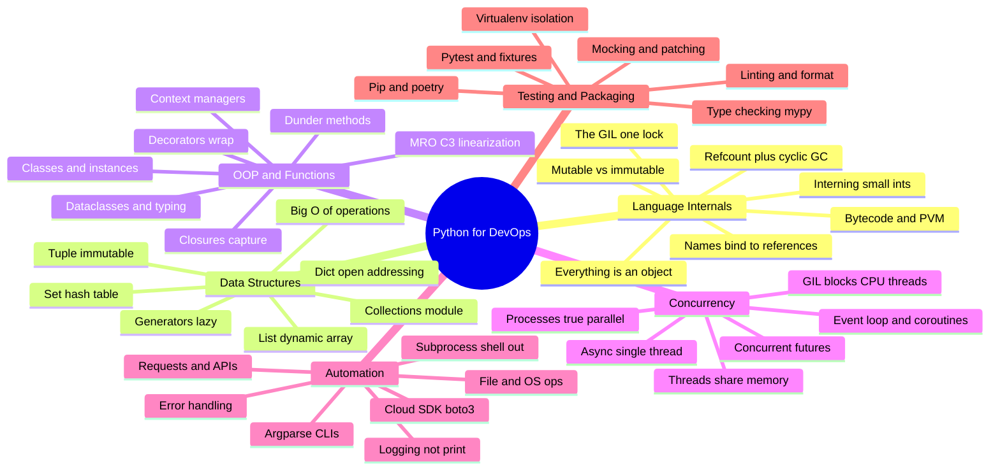

# Python for DevOps, SRE & Platform Engineering — Interview Prep

> **Language internals + automation depth for Senior DevOps, SRE, and Platform Engineer interviews.**
> This track is deliberately **not** about web frameworks (Django/Flask). It's about how CPython actually works under the hood and how you weaponize the language for automation, tooling, and reliable operations.

---

## 📚 Master Table of Contents

| # | Section | What it covers | Interview weight |
|---|---------|----------------|------------------|
| 01 | [Language Internals](01-LANGUAGE-INTERNALS.md) | Data model, objects vs references, mutability, memory management & GC, interning, CPython bytecode, the GIL | 🔴 High |
| 02 | [Data Structures](02-DATA-STRUCTURES.md) | list/dict/set/tuple internals & Big-O, hashing, comprehensions, generators/iterators, `collections` | 🔴 High |
| 03 | [OOP & Functions](03-OOP-AND-FUNCTIONS.md) | Classes, MRO, dunder methods, decorators, closures, context managers, dataclasses, typing | 🟡 Medium |
| 04 | [Concurrency](04-CONCURRENCY.md) | Threads vs processes vs async, GIL impact, asyncio event loop, multiprocessing, `concurrent.futures` | 🔴 High |
| 05 | [Automation & Scripting](05-AUTOMATION-SCRIPTING.md) | `subprocess`, file/OS ops, `argparse`, `logging`, `requests`/APIs, boto3 & k8s SDK patterns, error handling | 🔴 High |
| 06 | [Testing & Packaging](06-TESTING-PACKAGING.md) | pytest, mocking, fixtures, virtualenv/pip/poetry, packaging, type checking, linting | 🟡 Medium |

---

## 🗺️ Visual Overview

**In one line:** Master the object model and the GIL first (everything else is a consequence of those two), then layer data-structure complexity, the function/OOP toolkit, concurrency trade-offs, and finally the automation + testing craft that day-to-day DevOps work actually runs on.

**Mind map — the whole track at a glance** (skim first, revisit last):

**Suggested study order — dependencies flow left to right:**

```mermaid
flowchart LR
    A["🧬 01 Internals<br/>object model + GIL"] --> B["🗂️ 02 Data Structures<br/>Big-O + hashing"]
    B --> C["🏗️ 03 OOP + Functions<br/>decorators, dunders"]
    C --> D["⚡ 04 Concurrency<br/>threads/proc/async"]
    D --> E["🤖 05 Automation<br/>subprocess, SDKs"]
    E --> F["✅ 06 Testing + Packaging<br/>pytest, venv, mypy"]
    A:::start
    B:::proc
    C:::proc
    D:::ctrl
    E:::good
    F:::good

    classDef start fill:#e3f2fd,stroke:#1565c0,color:#0d47a1,stroke-width:2px;
    classDef proc  fill:#fff9c4,stroke:#f9a825,color:#000,stroke-width:2px;
    classDef good  fill:#c8e6c9,stroke:#2e7d32,color:#1b5e20,stroke-width:2px;
    classDef bad   fill:#ffcdd2,stroke:#c62828,color:#b71c1c,stroke-width:2px;
    classDef ctrl  fill:#e1bee7,stroke:#6a1b9a,color:#4a148c,stroke-width:2px;
    classDef store fill:#ffe0b2,stroke:#e65100,color:#000,stroke-width:2px;
```

> 🧠 **Memory hooks (mnemonics):**
> - **Two pillars:** *"Objects and the lock"* — almost every Python interview gotcha traces back to (1) everything is an object referenced by name, and (2) the GIL serializes bytecode.
> - **Concurrency pick:** *"CPU forks, I/O awaits"* → CPU-bound → `multiprocessing`; I/O-bound → `async`/threads.
> - **Mutability trap:** *"Immutable is safe, mutable is shared"* — default args, dict keys, and hashing all hinge on this.

---

## 🎯 How to use this track

1. **Start with [01-LANGUAGE-INTERNALS](01-LANGUAGE-INTERNALS.md)** — it's the foundation every "why does this happen?" answer builds on.
2. **Do [02-DATA-STRUCTURES](02-DATA-STRUCTURES.md)** for the Big-O and hashing questions that appear in every screen.
3. **Skim [03-OOP-AND-FUNCTIONS](03-OOP-AND-FUNCTIONS.md)** for decorators, context managers, and dataclasses — the automation building blocks.
4. **Study [04-CONCURRENCY](04-CONCURRENCY.md)** deeply — the GIL/async trade-off is the single most-asked senior topic.
5. **Practice [05-AUTOMATION-SCRIPTING](05-AUTOMATION-SCRIPTING.md)** — this is what you'll actually be asked to whiteboard.
6. **Finish with [06-TESTING-PACKAGING](06-TESTING-PACKAGING.md)** to show production maturity.

---

## 🔗 Related tracks in this repo

- [Linux](../linux/README.md) — processes, signals, filesystems that Python scripts drive
- [Docker](../docker/README.md) & [Kubernetes](../kubernetes/README.md) — where your Python automation runs
- [AWS](../aws/README.md) / [Azure](../azure/README.md) — the cloud SDKs your scripts call
- [CI/CD](../cicd/README.md) — pipelines that execute your Python tooling

---

**[← Back to Main README](../README.md)**
