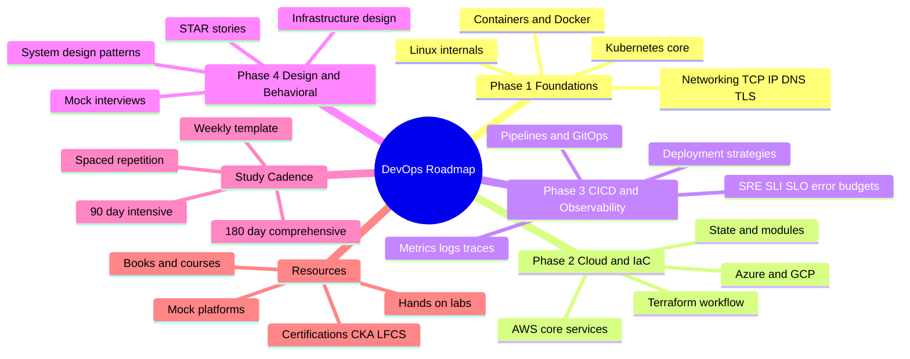
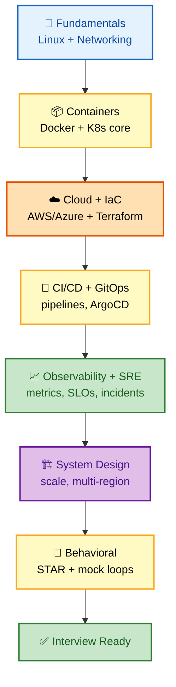
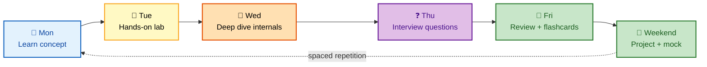

# Learning Roadmap - Complete Guide

> **90-Day and 180-Day Study Plans for Senior DevOps Engineer, SRE, and Platform Engineer roles at FAANG companies**

---

## 📋 Table of Contents

- [90-Day Intensive Plan](#90-day-intensive-plan)
- [180-Day Comprehensive Plan](#180-day-comprehensive-plan)
- [Weekly Study Template](#weekly-study-template)
- [Resources by Topic](#resources-by-topic)

---

## 🗺️ Visual Overview

**Mind map — the entire roadmap by phase and area** (skim first, revisit last):



**The recommended learning path — fundamentals to interview-ready** (follow the arrows):



**The weekly study loop — the rhythm that turns hours into retention:**



> 🧠 **Memory hooks (mnemonics):**
> - **4 phases = "FCCD"** → **F**oundations → **C**loud/IaC → **C**I·CD + Observability → **D**esign + Behavioral.
> - **90 = 4 × 3** — the intensive plan is four 3-week phases; **180 = double it** with certs (CKA, SAA) and depth.
> - **"Learn → Lab → Ask → Review"** — the weekly loop: Mon concept, Tue hands-on, Thu questions, Fri review.
> - **Break it to learn it** — the Tuesday rule: intentionally break things, then fix them.
> - **20/20/5** — the weekly targets: **20** hrs studied, **50** questions, **5** labs.

> 💡 **Tip:** Pick ONE plan (90-day if you're actively interviewing, 180-day if you have runway) and treat the weekly loop as the atomic unit — consistency of the loop matters more than which phase you're on.

---

## 90-Day Intensive Plan

### For Active Job Seekers

```
┌─────────────────────────────────────────────────────────────────┐
│                    90-DAY STUDY PLAN                             │
├─────────────────────────────────────────────────────────────────┤
│                                                                  │
│  PHASE 1: FOUNDATIONS (Weeks 1-3)                               │
│  ┌─────────────────────────────────────────────────────────┐    │
│  │                                                          │    │
│  │  Week 1: Linux & Networking                              │    │
│  │  □ Linux internals (processes, memory, filesystems)      │    │
│  │  □ Networking (TCP/IP, DNS, HTTP, TLS)                   │    │
│  │  □ Troubleshooting tools (ss, netstat, tcpdump)          │    │
│  │  □ Daily: 30 min hands-on labs                           │    │
│  │                                                          │    │
│  │  Week 2: Containers & Docker                             │    │
│  │  □ Container fundamentals (namespaces, cgroups)          │    │
│  │  □ Dockerfile best practices                             │    │
│  │  □ Docker networking and storage                         │    │
│  │  □ Multi-stage builds, security scanning                 │    │
│  │                                                          │    │
│  │  Week 3: Kubernetes Core                                 │    │
│  │  □ Architecture (control plane, nodes)                   │    │
│  │  □ Workloads (Pods, Deployments, StatefulSets)           │    │
│  │  □ Services and Ingress                                  │    │
│  │  □ ConfigMaps, Secrets, RBAC                             │    │
│  │                                                          │    │
│  └─────────────────────────────────────────────────────────┘    │
│                                                                  │
│  PHASE 2: CLOUD & IAC (Weeks 4-6)                               │
│  ┌─────────────────────────────────────────────────────────┐    │
│  │                                                          │    │
│  │  Week 4: AWS Core Services                               │    │
│  │  □ IAM (roles, policies, cross-account)                  │    │
│  │  □ VPC (subnets, NACLs, security groups)                 │    │
│  │  □ EC2, ECS, EKS                                         │    │
│  │  □ S3, RDS, ElastiCache                                  │    │
│  │                                                          │    │
│  │  Week 5: Azure/GCP (if targeting)                        │    │
│  │  □ Identity (Entra ID, IAM)                              │    │
│  │  □ Networking (VNet, VPC)                                │    │
│  │  □ Compute (AKS, GKE)                                    │    │
│  │  □ Managed services                                      │    │
│  │                                                          │    │
│  │  Week 6: Terraform                                       │    │
│  │  □ Core workflow (init, plan, apply)                     │    │
│  │  □ State management (remote, locking)                    │    │
│  │  □ Modules (design, versioning)                          │    │
│  │  □ Best practices for enterprise                         │    │
│  │                                                          │    │
│  └─────────────────────────────────────────────────────────┘    │
│                                                                  │
│  PHASE 3: CI/CD & OBSERVABILITY (Weeks 7-9)                     │
│  ┌─────────────────────────────────────────────────────────┐    │
│  │                                                          │    │
│  │  Week 7: CI/CD Pipelines                                 │    │
│  │  □ GitHub Actions / GitLab CI                            │    │
│  │  □ Pipeline security (OIDC, secrets)                     │    │
│  │  □ Deployment strategies (blue-green, canary)            │    │
│  │  □ GitOps (ArgoCD, Flux)                                 │    │
│  │                                                          │    │
│  │  Week 8: Observability                                   │    │
│  │  □ Metrics (Prometheus, Grafana)                         │    │
│  │  □ Logging (ELK, Loki)                                   │    │
│  │  □ Tracing (Jaeger, OpenTelemetry)                       │    │
│  │  □ Alerting best practices                               │    │
│  │                                                          │    │
│  │  Week 9: SRE Practices                                   │    │
│  │  □ SLI/SLO/SLA definitions                               │    │
│  │  □ Error budgets                                         │    │
│  │  □ Incident management                                   │    │
│  │  □ Capacity planning                                     │    │
│  │                                                          │    │
│  └─────────────────────────────────────────────────────────┘    │
│                                                                  │
│  PHASE 4: SYSTEM DESIGN & BEHAVIORAL (Weeks 10-12)              │
│  ┌─────────────────────────────────────────────────────────┐    │
│  │                                                          │    │
│  │  Week 10: System Design Fundamentals                     │    │
│  │  □ Scalability patterns                                  │    │
│  │  □ Database scaling (sharding, replication)              │    │
│  │  □ Caching strategies                                    │    │
│  │  □ Practice: 2 design problems                           │    │
│  │                                                          │    │
│  │  Week 11: Infrastructure Design                          │    │
│  │  □ Multi-region architectures                            │    │
│  │  □ CI/CD platform design                                 │    │
│  │  □ Observability platform design                         │    │
│  │  □ Practice: 2 design problems                           │    │
│  │                                                          │    │
│  │  Week 12: Behavioral Preparation                         │    │
│  │  □ STAR method mastery                                   │    │
│  │  □ Prepare 6-8 detailed stories                          │    │
│  │  □ Leadership principles (Amazon)                        │    │
│  │  □ Mock interviews (2-3 sessions)                        │    │
│  │                                                          │    │
│  └─────────────────────────────────────────────────────────┘    │
│                                                                  │
│  DAILY SCHEDULE (3-4 hours):                                    │
│  • 1 hour: Study/review materials                               │
│  • 1 hour: Hands-on practice                                    │
│  • 30 min: Interview questions practice                         │
│  • 30 min: Review and spaced repetition                         │
│                                                                  │
└─────────────────────────────────────────────────────────────────┘
```

---

## 180-Day Comprehensive Plan

### For Long-Term Preparation

```
┌─────────────────────────────────────────────────────────────────┐
│                    180-DAY STUDY PLAN                            │
├─────────────────────────────────────────────────────────────────┤
│                                                                  │
│  MONTHS 1-2: BUILD FOUNDATIONS                                  │
│  ┌─────────────────────────────────────────────────────────┐    │
│  │                                                          │    │
│  │  Linux (3 weeks)                                         │    │
│  │  • Complete LFCS curriculum                              │    │
│  │  • Performance tuning deep dive                          │    │
│  │  • Troubleshooting scenarios practice                    │    │
│  │                                                          │    │
│  │  Networking (2 weeks)                                    │    │
│  │  • OSI model deep understanding                          │    │
│  │  • Cloud networking specifics                            │    │
│  │  • Network troubleshooting                               │    │
│  │                                                          │    │
│  │  Containers (3 weeks)                                    │    │
│  │  • Docker certification prep                             │    │
│  │  • Container security                                    │    │
│  │  • Multi-architecture builds                             │    │
│  │                                                          │    │
│  └─────────────────────────────────────────────────────────┘    │
│                                                                  │
│  MONTHS 3-4: KUBERNETES & CLOUD                                 │
│  ┌─────────────────────────────────────────────────────────┐    │
│  │                                                          │    │
│  │  Kubernetes (6 weeks)                                    │    │
│  │  • CKA certification path                                │    │
│  │  • Kubernetes the Hard Way                               │    │
│  │  • Helm, Operators, Custom Controllers                   │    │
│  │  • Service Mesh (Istio)                                  │    │
│  │                                                          │    │
│  │  Cloud Platform (2 weeks)                                │    │
│  │  • AWS Solutions Architect path                          │    │
│  │  • Multi-account strategies                              │    │
│  │  • Well-Architected Framework                            │    │
│  │                                                          │    │
│  └─────────────────────────────────────────────────────────┘    │
│                                                                  │
│  MONTHS 5-6: ADVANCED TOPICS & INTERVIEW PREP                   │
│  ┌─────────────────────────────────────────────────────────┐    │
│  │                                                          │    │
│  │  Infrastructure as Code (2 weeks)                        │    │
│  │  • Terraform advanced patterns                           │    │
│  │  • Pulumi/CDK comparison                                 │    │
│  │  • GitOps workflows                                      │    │
│  │                                                          │    │
│  │  Observability & SRE (2 weeks)                           │    │
│  │  • Production observability stack                        │    │
│  │  • Incident response practice                            │    │
│  │  • Chaos engineering                                     │    │
│  │                                                          │    │
│  │  System Design (2 weeks)                                 │    │
│  │  • 10+ practice problems                                 │    │
│  │  • Mock design sessions                                  │    │
│  │                                                          │    │
│  │  Behavioral & Mock Interviews (2 weeks)                  │    │
│  │  • Story refinement                                      │    │
│  │  • 5+ mock interviews                                    │    │
│  │  • Feedback incorporation                                │    │
│  │                                                          │    │
│  └─────────────────────────────────────────────────────────┘    │
│                                                                  │
└─────────────────────────────────────────────────────────────────┘
```

---

## Weekly Study Template

```
┌─────────────────────────────────────────────────────────────────┐
│                    WEEKLY STUDY TEMPLATE                         │
├─────────────────────────────────────────────────────────────────┤
│                                                                  │
│  MONDAY - Concept Learning                                      │
│  □ Read documentation/book chapter                              │
│  □ Watch video tutorial                                         │
│  □ Take notes in your own words                                 │
│                                                                  │
│  TUESDAY - Hands-On Practice                                    │
│  □ Set up lab environment                                       │
│  □ Follow tutorial/workshop                                     │
│  □ Break things intentionally, fix them                         │
│                                                                  │
│  WEDNESDAY - Deep Dive                                          │
│  □ Read advanced documentation                                  │
│  □ Explore edge cases                                           │
│  □ Understand internals                                         │
│                                                                  │
│  THURSDAY - Interview Questions                                 │
│  □ Practice 10-15 questions from topic                          │
│  □ Write detailed answers                                       │
│  □ Review and refine                                            │
│                                                                  │
│  FRIDAY - Review & Consolidate                                  │
│  □ Summarize week's learning                                    │
│  □ Create flashcards for key concepts                           │
│  □ Identify gaps for next week                                  │
│                                                                  │
│  WEEKEND - Projects & Mock Practice                             │
│  □ Work on portfolio project                                    │
│  □ Mock interview practice                                      │
│  □ System design practice                                       │
│                                                                  │
└─────────────────────────────────────────────────────────────────┘
```

---

## Resources by Topic

### Core Technologies

| Topic | Resources |
|-------|-----------|
| **Linux** | LFCS Curriculum, Linux Performance by Brendan Gregg |
| **Docker** | Docker Deep Dive (Nigel Poulton), Play with Docker |
| **Kubernetes** | Kubernetes The Hard Way, CKA Course (KodeKloud) |
| **AWS** | AWS Well-Architected, Stephane Maarek courses |
| **Terraform** | HashiCorp Learn, Terraform Up & Running |

### Advanced Topics

| Topic | Resources |
|-------|-----------|
| **SRE** | Google SRE Book, SRE Workbook |
| **System Design** | System Design Primer, Designing Data-Intensive Applications |
| **Observability** | Distributed Systems Observability (O'Reilly) |

### Interview Prep

| Topic | Resources |
|-------|-----------|
| **Behavioral** | Amazon Leadership Principles, STAR Method guides |
| **Technical** | LeetCode (Easy/Medium), Exercism |
| **Mock Interviews** | Pramp, interviewing.io |

---

## Progress Tracker

```
Week: ____  Focus: ________________

□ Monday study completed
□ Tuesday hands-on completed
□ Wednesday deep dive completed
□ Thursday questions completed
□ Friday review completed
□ Weekend project/mock completed

Hours studied: ___/20
Questions practiced: ___/50
Labs completed: ___/5

Notes/Improvements for next week:
________________________________
________________________________
```

---

**[← Back to Main README](../README.md)**
