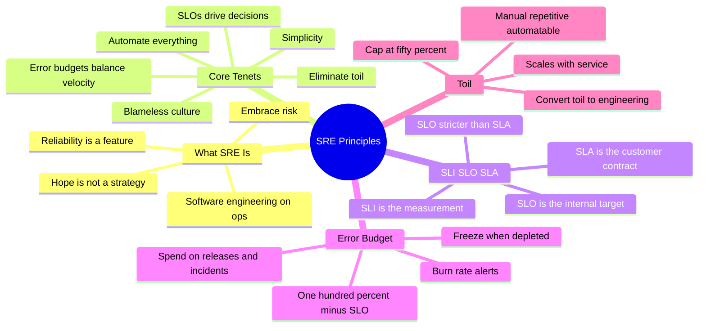
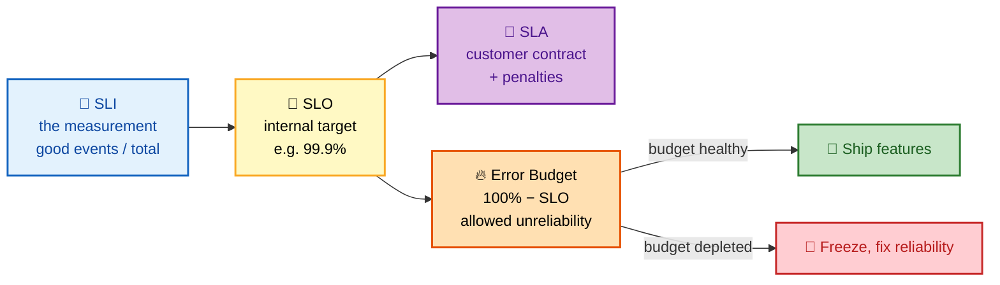
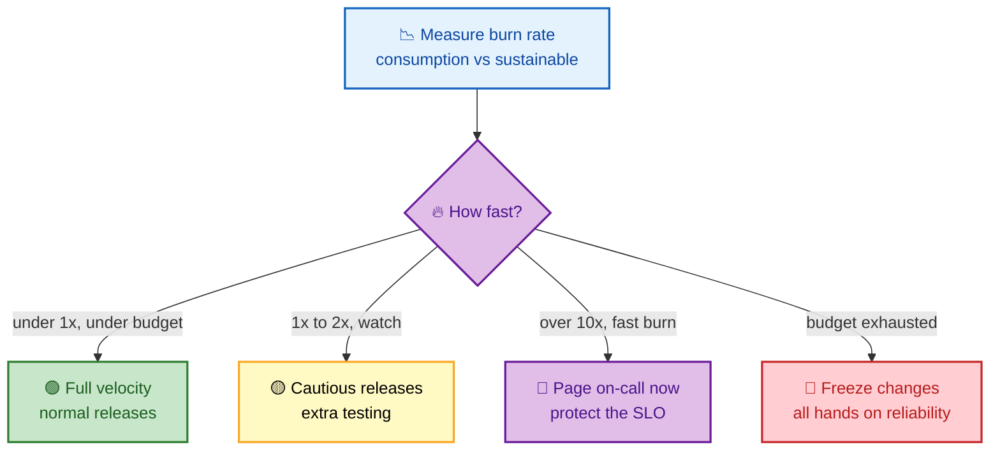

# SECTION 1: SRE PRINCIPLES — SLOs, Error Budgets & Toil

> **Scope:** What SRE actually is and how it differs from DevOps/Ops, Google's core tenets, the SLI → SLO → SLA hierarchy, availability math, error budgets and the error-budget policy, and the definition and control of toil. This is the philosophical + mathematical foundation every later section assumes.

---

## Subtopic Index
- [SRE vs DevOps vs Traditional Ops](#sre-vs-devops-vs-traditional-ops)
- [Google's SRE Tenets](#googles-sre-tenets)
- [SLI, SLO, SLA](#sli-slo-sla)
- [Availability Math (the nines)](#availability-math-the-nines)
- [Error Budgets](#error-budgets)
- [Error Budget Policy](#error-budget-policy)
- [Toil and the 50% Rule](#toil-and-the-50-rule)
- [Interview Questions & Answers](#interview-questions--answers)
- [Best Practices](#best-practices)
- [Documentation Links](#documentation-links)

---

## 🗺️ Visual Overview

**In one line:** SRE is *operations solved as a software-engineering problem* — you pick a reliability target (SLO), derive a budget for failure (error budget), and spend that budget to move fast while capping manual work (toil) so engineering time goes to automation.

**Mind map — the principles landscape at a glance** (skim first, revisit last):



**The SLI → SLO → SLA → error budget chain — the single most-tested SRE concept:**



**Error-budget burn-rate decision — how fast you spend drives the response:**



> 🧠 **Memory hooks (mnemonics):**
> - **SLI / SLO / SLA:** *Indicator → Objective → Agreement* — "**I** measure, **O** aim, **A** promise." Your **SLO is always ≥ stricter than your SLA** so you have headroom before breaching the contract.
> - **Error budget rule:** *"Budget green → ship; budget red → fix."* Error budget = 100% − SLO.
> - **Toil test:** *"Manual, Repetitive, Automatable, No-lasting-value, Scales-with-service"* → if it's **MRANS**, it's toil.
> - **SRE ≠ DevOps:** *"DevOps is the philosophy; SRE is one concrete implementation of it."* (Google's own framing: "class SRE implements interface DevOps.")

---

## SRE vs DevOps vs Traditional Ops

> 🎯 **Interview weight:** 🔥🔥🔥 Very High — the near-universal opener.

**In one line:** Traditional Ops keeps systems running by hand and reacts to fires; SRE engineers reliability with code, measurable targets, and error budgets — and DevOps is the broader cultural philosophy that SRE concretely implements.

| Dimension | Traditional Ops | SRE |
|---|---|---|
| Default approach | Manual processes | Automation-first |
| Posture | Reactive (firefighting) | Proactive (SLO-driven) |
| Mission | "Keep it running" | "Engineer reliability" |
| Skillset | Operations knowledge | Software + operations |
| Reliability | Undefined / aspirational | Measurable SLOs |
| Change | Change = risk to avoid | Change = *managed* risk |
| Team shape | Siloed from developers | Embedded with dev teams |

💡 **The clean soundbite:** *"DevOps says dev and ops shouldn't be siloed and everything should be automated and measured. SRE is a prescriptive implementation of that: it gives you the concrete artifacts — SLOs, error budgets, toil budgets, blameless postmortems — to make it real."* Google phrases it as **"class SRE implements interface DevOps."**

⚠️ **Trap:** Don't say SRE is "just ops with scripts." The differentiator is the **error budget** — a shared, data-driven contract that lets product and reliability teams *negotiate velocity* instead of arguing about it.

---

## Google's SRE Tenets

> 🎯 **Interview weight:** 🔥🔥 High — expect "name the SRE principles."

**In one line:** Seven repeating ideas — embrace risk, set SLOs, spend error budgets, kill toil, monitor symptoms, automate, and keep it simple.

| # | Tenet | What it means in practice |
|---|---|---|
| 1 | **Embrace risk** | 100% reliability is the wrong target — it's impossible and blocks all velocity. Pick the *right* unreliability. |
| 2 | **Service Level Objectives** | Reliability is a number you commit to and measure, not a vibe. |
| 3 | **Eliminate toil** | Automate repetitive manual work; cap toil at ≤ 50% of SRE time. |
| 4 | **Monitoring & observability** | Alert on **symptoms** users feel, not every internal cause. |
| 5 | **Automation** | Build self-healing systems; reduce humans in the loop. |
| 6 | **Release engineering** | Safe, repeatable deploys — canary, blue-green, instant rollback. |
| 7 | **Simplicity** | Actively remove complexity; it is the enemy of reliability. |

🔍 **Why "embrace risk" comes first:** Every other tenet flows from the admission that failure is allowed. Once failure has a *budget*, you can rationally trade it for feature speed — which is the whole point of SRE.

---

## SLI, SLO, SLA

> 🎯 **Interview weight:** 🔥🔥🔥 Very High — you *will* be asked to define and design these.

**In one line:** An **SLI** is what you measure, an **SLO** is the internal target you hold yourself to, and an **SLA** is the external promise (with penalties) — always looser than the SLO.

- **SLI (Service Level Indicator):** a carefully scoped metric of user-visible behavior, expressed as `good events / valid events`. Example: `2xx responses / all responses`.
- **SLO (Service Level Objective):** the target for an SLI over a window. Example: `99.9% availability over 30 rolling days`.
- **SLA (Service Level Agreement):** a contract with the customer including **consequences** (credits, penalties) if the objective is missed.

**Hierarchy:** `SLA (external promise) → SLO (internal, stricter target) → SLI (the measurement)`

**Common SLIs by service type:**

| Service type | Good SLIs |
|---|---|
| Request-driven (APIs, web) | Availability `2xx/all`, latency `requests < threshold / all`, quality |
| Data processing (pipelines/ETL) | Freshness, correctness `valid/total`, coverage `processed/expected` |
| Storage (DBs, object stores) | Durability `not lost / total`, throughput `bytes/sec` |

**Example SLO spec — Payment API, rolling 30 days:**

| SLO | SLI definition | Target |
|---|---|---|
| Availability | 2xx responses / all | 99.95% |
| Latency p50 | requests < 100ms | 99% |
| Latency p99 | requests < 500ms | 99% |
| Error rate | 5xx responses / all | < 0.1% |

```promql
# Availability SLI over the window
sum(rate(http_requests_total{code=~"2.."}[30d]))
/
sum(rate(http_requests_total[30d]))
```

💡 **Design tip:** A good SLI is **user-centric** (measures what the customer feels) and **binary-friendly** (each event is clearly good or bad). Measure at the point closest to the user — load balancer / edge — not deep inside a single microservice.

⚠️ **Gotcha:** Don't SLO *everything*. Too many SLOs dilute focus; pick the 2–4 that map to real user pain. And never set your SLO *equal* to your SLA — you need buffer to react before the contract breaks.

---

## Availability Math (the nines)

> 🎯 **Interview weight:** 🔥🔥🔥 Very High — the classic whiteboard calculation.

**In one line:** Each extra "nine" cuts allowed downtime by ~10×; memorize that 99.9% ≈ 43 min/month and 99.99% ≈ 4.3 min/month.

| Target | Monthly downtime | Daily downtime | Yearly downtime |
|---|---|---|---|
| 99% (two nines) | 7.3 hours | 14.4 minutes | 3.65 days |
| 99.9% (three nines) | 43.8 minutes | 1.44 minutes | 8.77 hours |
| 99.95% | 21.9 minutes | 43.2 seconds | 4.38 hours |
| 99.99% (four nines) | 4.38 minutes | 8.64 seconds | 52.6 minutes |
| 99.999% (five nines) | 26.3 seconds | 0.86 seconds | 5.26 minutes |

🧠 **How to derive it live:** 30-day month = `30 × 24 × 60 = 43,200 min`. Downtime allowed = `43,200 × (1 − SLO)`. For 99.9%: `43,200 × 0.001 = 43.2 min`. You can regenerate the whole table from that one formula.

⚠️ **Reality check:** Five nines (26 s/month) is effectively unachievable for anything with a human in the deploy path — it leaves no room for a single bad rollout. When a stakeholder demands "five nines," your job is to ask *"which specific SLI, and are you funding the redundancy that requires?"*

---

## Error Budgets

> 🎯 **Interview weight:** 🔥🔥🔥 Very High — the concept that defines SRE.

**In one line:** The error budget is `100% − SLO` — the amount of unreliability you're *allowed* to spend, which turns "reliability vs. velocity" from an argument into an arithmetic decision.

**Concept:**
- SLO = 99.9% availability → error budget = `0.1%`.
- 30-day window = 43,200 min → budget = `43,200 × 0.001 = 43.2 min` of allowed downtime/failure per month.
- You **spend** that 43.2 min on deployments, incidents, and maintenance. Under budget → ship features. Over budget → stop and fix.

```promql
# Error budget remaining (percentage)
(
  (1 - slo_target) * window_seconds
  - sum(error_seconds_total)
) / ((1 - slo_target) * window_seconds) * 100

# Burn rate: how fast we consume budget (>1 = unsustainable)
sum(rate(http_requests_total{code=~"5.."}[1h]))
/
sum(rate(http_requests_total[1h]))
/
(1 - 0.999)   # SLO target of 99.9%
```

**Burn rate intuition:** a burn rate of `1×` means you'll exactly exhaust the budget by the end of the window. `10×` means you'll burn a month's budget in ~3 days — page immediately. `0.5×` means you're comfortably under and can take more risk.

💡 **The unlock:** the error budget *aligns incentives*. Product wants features; SRE wants stability. The budget makes both accountable to the same number: if the budget is healthy, product gets to ship freely; if it's burnt, product *chooses* reliability work because that's what buys back velocity.

---

## Error Budget Policy

> 🎯 **Interview weight:** 🔥🔥 High — "what happens when the budget runs out?"

**In one line:** A pre-agreed, written policy that defines *automatic* actions at each budget threshold — so the decision is already made before the incident, not argued during it.

| Budget status | Action |
|---|---|
| > 50% remaining | Full velocity, normal releases |
| 25–50% remaining | Cautious releases, extra testing, more canary time |
| < 25% remaining | Freeze non-critical changes |
| Exhausted (0%) | **Change freeze** — all hands on reliability |

**When the budget is exhausted, the policy typically enforces:**
- Halt feature releases (only reliability fixes and P0 security ship).
- Mandatory blameless postmortems for budget-burning incidents.
- Dev team is pulled in to help with reliability work.

⚠️ **The policy must be signed off by product/leadership *in advance*.** Its entire value is that it removes the mid-incident negotiation — "we agreed three months ago that at 0% budget we freeze, so we freeze." Without executive buy-in, the freeze gets overridden and the budget becomes decorative.

🔍 **Escape hatch:** mature policies include a documented **override** (e.g., VP approval to ship during a freeze for a critical business reason) — but every override is logged and reviewed, keeping the pressure honest.

---

## Toil and the 50% Rule

> 🎯 **Interview weight:** 🔥🔥 High — "define toil" and "how do you manage it."

**In one line:** Toil is manual, repetitive, automatable work with no enduring value that scales linearly with the service — and SRE caps it at ≤ 50% of time so the other half builds automation that shrinks it.

**A task is toil if it is:**

| Property | Meaning |
|---|---|
| **Manual** | A human must run it |
| **Repetitive** | Done over and over, not a one-off |
| **Automatable** | A machine could do it |
| **No enduring value** | The service isn't permanently better afterward |
| **Scales with service** | Grows linearly with traffic/size — doesn't sub-linearize |
| **Reactive / interrupt-driven** | Often tactical, not strategic |

**The 50% rule:** Google caps operational/toil work at **≤ 50%** of an SRE's time; the remaining **≥ 50%** must go to engineering (automation, reliability projects). If a team exceeds 50% toil:
- Redirect engineering effort to reduce the toil source.
- Overflow tickets/ops load flow **back to the development team**.
- Escalate for headcount or capacity.

💡 **Not all manual work is toil.** Reading a design doc, a careful one-time migration, or investigating a novel outage is **overhead / engineering**, not toil — it has lasting value or is non-repetitive. Toil is specifically the *soul-crushing, automatable repetition*.

🧠 **Why cap it:** unbounded toil means the team scales headcount linearly with load, burns out, and never builds the automation that would break the cycle. The 50% cap is a *forcing function* to keep engineering the service instead of just running it.

---

## Interview Questions & Answers

### Q1: What is SRE and how does it differ from DevOps?

**Answer:** SRE applies software-engineering practices to operations problems — you define reliability with measurable SLOs, derive an error budget from them, and use that budget to balance feature velocity against stability while capping manual toil.

**Reasoning:** DevOps is a *philosophy* (break dev/ops silos, automate, measure); SRE is a *concrete implementation* of it — Google's "class SRE implements interface DevOps." The distinguishing artifact is the error budget: a shared number that makes the reliability-vs-velocity trade-off a data-driven decision rather than a turf war.

**Follow-up — "So is SRE just a rebranded ops team?"** No: the litmus test is whether the team has real SLOs, an enforced error-budget policy, and a ≥50% engineering time floor. Without those, it's ops with a new title.

---

### Q2: A team wants 99.999% availability. How do you respond?

**Answer:** I'd push back and reframe. Five nines is **26 seconds of downtime per month** — that leaves no room for a single human-in-the-loop deploy or one bad config push. I'd ask *which specific user-facing SLI* they mean, whether the business impact actually justifies it, and whether they'll fund the multi-region redundancy, automated failover, and progressive-delivery tooling it requires.

**Reasoning:** Availability cost is roughly exponential per nine while marginal user-perceived benefit shrinks. Most products are best served by 99.9–99.95% with a healthy error budget. The senior move is to convert a vanity number into a funded, scoped engineering decision.

**Follow-up — "Where does the downtime math come from?"** `43,200 min/month × (1 − SLO)`; 99.999% → `43,200 × 0.00001 ≈ 0.43 min ≈ 26 s`.

---

### Q3: Your error budget is exhausted mid-quarter but product has a major launch. What happens?

**Answer:** The pre-signed error-budget policy governs: at 0% budget we're in a change freeze — only reliability fixes ship. The launch waits until we've bought back budget by fixing the reliability issues that drained it, **unless** the documented override path is invoked (e.g., VP sign-off), which is logged and reviewed.

**Reasoning:** The policy's value is that this decision was made calmly *in advance* with leadership buy-in, so it can't be relitigated under launch pressure. Allowing ad-hoc overrides every quarter makes the budget meaningless.

**Follow-up — "How do you make the freeze palatable to product?"** Frame it as self-interest: reliability work *is* what restores the ability to ship fast; shipping on a burnt budget risks an outage that freezes them far longer.

---

### Q4: How do you calculate and use burn rate for alerting?

**Answer:** Burn rate = current error consumption ÷ sustainable consumption for the SLO window. A burn rate of 1× exactly exhausts the budget by window's end; 10× exhausts a 30-day budget in ~3 days. I set **multi-window, multi-burn-rate alerts**: a fast-burn alert (e.g., 14.4× over 1h) pages immediately, while a slow-burn alert (e.g., 3× over 6h) files a ticket.

**Reasoning:** Single-threshold alerting either pages too often (noisy) or too late (budget already gone). Multi-burn-rate balances fast detection of severe events against low noise for slow degradations — this is the Google SRE Workbook's recommended pattern (covered deeper in Section 3).

**Follow-up — "Why two windows per alert?"** The long window confirms the burn is sustained; the short window ensures the condition is *still* true right now, preventing alerts from lingering after the issue resolves.

---

### Q5: Give a concrete example of toil vs. engineering work.

**Answer:** **Toil:** manually restarting a service every time it OOMs, hand-editing configs for each new tenant, or clicking through a console to rotate a cert monthly. **Engineering:** building an operator that auto-restarts and root-causes the OOM, templating tenant onboarding, or automating cert rotation with cert-manager. The first scales linearly with the service and leaves nothing behind; the second is a one-time build with enduring value.

**Reasoning:** The toil test is MRANS — Manual, Repetitive, Automatable, No-lasting-value, Scales-with-service. If work fails that test (a novel outage investigation, a design review), it's valuable overhead, not toil.

**Follow-up — "What if you're at 80% toil?"** That's a red flag the team is under-resourced or the service is under-automated. The remedy: freeze new feature intake for the service, spend an engineering sprint automating the top toil source, and push overflow ops load back to the dev team per the 50% rule.

---

## Best Practices

- **Set SLOs from user pain, not internal convenience.** Measure at the edge, keep them few (2–4), and make each event unambiguously good or bad.
- **Always keep SLO stricter than SLA** so you get early warning before a contractual breach.
- **Write the error-budget policy before you need it** and get leadership sign-off — its value is that it removes mid-incident debate.
- **Alert on burn rate, not raw error count** — multi-window, multi-burn-rate to balance speed and noise.
- **Track toil explicitly** (survey or ticket tagging) and treat crossing 50% as a staffing/automation trigger, not a "work harder" signal.
- **Make reliability a feature with a backlog** — reliability work competes for priority using the error budget as its currency.

---

## Documentation Links

- [Google SRE Book — full text](https://sre.google/sre-book/table-of-contents/)
- [Google SRE Workbook — SLOs & error budgets](https://sre.google/workbook/table-of-contents/)
- [Implementing SLOs (SRE Workbook)](https://sre.google/workbook/implementing-slos/)
- [Eliminating Toil (SRE Book)](https://sre.google/sre-book/eliminating-toil/)

---

**[← Back to SRE Index](./README.md)** | **[Next: Reliability & Resilience →](./02-RELIABILITY.md)**
