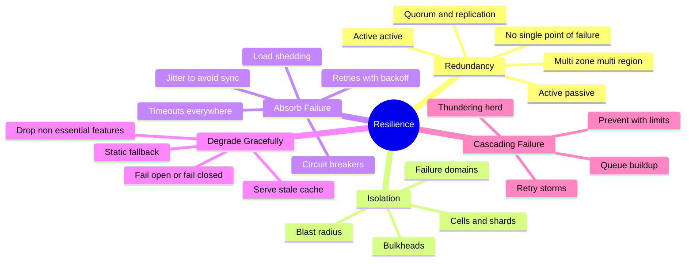
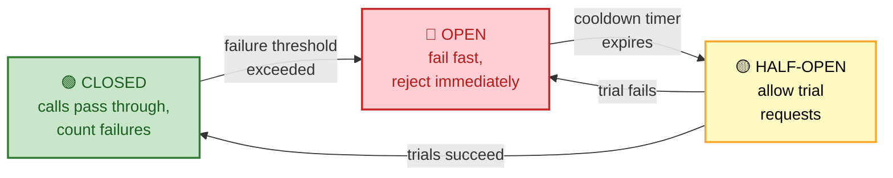
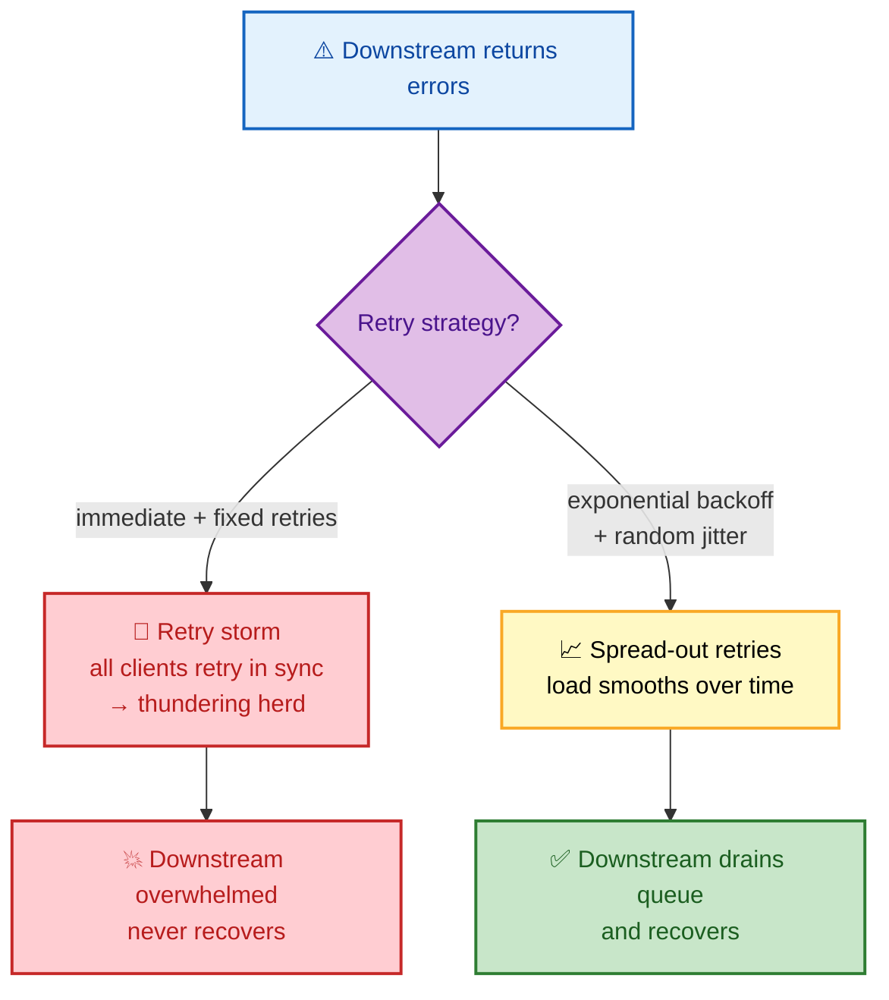

# SECTION 2: RELIABILITY & RESILIENCE PATTERNS

> **Scope:** How to build systems that keep working when parts of them fail — redundancy, failure domains and blast-radius containment, and the core resilience patterns interviewers probe: retries with backoff and jitter, circuit breakers, bulkheads, timeouts, load shedding, and graceful degradation. This is the "design for failure" section.

---

## Subtopic Index
- [Redundancy & Failure Domains](#redundancy--failure-domains)
- [Blast Radius & Isolation](#blast-radius--isolation)
- [Timeouts, Retries, Backoff & Jitter](#timeouts-retries-backoff--jitter)
- [Circuit Breakers](#circuit-breakers)
- [Bulkheads](#bulkheads)
- [Load Shedding & Rate Limiting](#load-shedding--rate-limiting)
- [Graceful Degradation](#graceful-degradation)
- [Cascading Failures](#cascading-failures)
- [Interview Questions & Answers](#interview-questions--answers)
- [Best Practices](#best-practices)
- [Documentation Links](#documentation-links)

---

## 🗺️ Visual Overview

**In one line:** Reliability is not "prevent all failure" — it's *contain* failure (redundancy + isolation) and *absorb* it (retries, circuit breakers, bulkheads, degradation) so a single component's death never takes the whole system down.

**Mind map — the resilience toolkit at a glance:**



**Circuit breaker state machine — the highest-value pattern diagram:**



**Retry with backoff + jitter vs. a retry storm — why jitter matters:**



> 🧠 **Memory hooks (mnemonics):**
> - **Resilience layers:** *"Redundancy, Isolate, Absorb, Degrade"* → **RIAD** — duplicate it, wall it off, soak up the failure, then shed features gracefully.
> - **Retry safely:** *"Timeout → Backoff → Jitter → Cap → Budget"* — never retry forever, never retry in sync, never retry non-idempotent writes blindly.
> - **Circuit breaker states:** **C**losed (healthy) → **O**pen (broken, fail fast) → **H**alf-open (testing) → back to **C**. "COH."
> - **Bulkhead:** think of a ship's watertight compartments — one flooded compartment doesn't sink the ship.

---

## Redundancy & Failure Domains

> 🎯 **Interview weight:** 🔥🔥🔥 Very High — foundational to every HA design.

**In one line:** Eliminate single points of failure by running redundant copies across independent **failure domains** (zones, regions, racks) so no single fault correlates across all of them.

**A failure domain is a boundary within which a single fault can take everything down.** The art is spreading replicas across domains that *don't share* the fault:

| Redundancy model | How it works | Trade-off |
|---|---|---|
| **Active-active** | All replicas serve traffic simultaneously | Best utilization + instant failover; needs conflict handling / statelessness |
| **Active-passive** | Standby takes over on primary failure | Simpler consistency; wasted standby capacity + failover lag |
| **N+1 / N+2** | Provision 1–2 spare units beyond peak need | Cheap insurance; must actually test failover |
| **Quorum (2f+1)** | Majority must agree (etcd, ZK, Raft) | Survives f failures; needs odd count across domains |

**Failure domain hierarchy (widen the blast wall as impact grows):** process → host → rack → **availability zone** → **region** → provider.

💡 **Multi-AZ is table stakes; multi-region is a deliberate cost/consistency decision.** Spreading across 3 AZs survives a datacenter fire cheaply. Going multi-region buys survival of a whole-region outage but forces you to confront async replication lag, data sovereignty, and cross-region latency.

⚠️ **Redundancy you never fail over to is theater.** The standby must be exercised (game days, forced failovers) or it will be misconfigured/stale exactly when you need it. "Have you tested failover in the last 90 days?" is a common senior follow-up.

---

## Blast Radius & Isolation

> 🎯 **Interview weight:** 🔥🔥🔥 Very High — "how do you limit the impact of a bad change?"

**In one line:** Blast radius is *how much breaks when one thing breaks*; you shrink it with cells, shards, and progressive rollout so a fault or bad deploy hits a small fraction of users, not everyone.

**Techniques to contain blast radius:**

| Technique | What it isolates |
|---|---|
| **Cell / shuffle-sharding** | Partition users into independent "cells"; one poisoned cell affects only its tenants |
| **Regional isolation** | A bad config in one region can't cascade to others |
| **Progressive/canary rollout** | New code reaches 1% → 10% → 100%; a bad deploy is caught at 1% |
| **Feature flags** | Kill a bad feature instantly without a redeploy |
| **Separate control/data planes** | A crashing control plane doesn't stop the data plane serving traffic |

🔍 **Shuffle sharding is the elegant version of cells.** Instead of assigning each tenant to one shard, assign them a *random combination* of workers. Two "noisy" tenants are very unlikely to share the *same* combination, so one bad tenant rarely takes down another. AWS uses this heavily in Route 53 and other services.

🧠 **The deploy-safety mantra:** *"Small blast radius + fast rollback."* If a change can only hurt 1% of traffic and you can revert in seconds, you can deploy fearlessly — which is exactly what preserves your error budget.

---

## Timeouts, Retries, Backoff & Jitter

> 🎯 **Interview weight:** 🔥🔥🔥 Very High — the most common "make this call resilient" question.

**In one line:** Every remote call needs a **timeout**; retries must use **exponential backoff + jitter** and a **retry budget**, and you must only auto-retry **idempotent** operations.

**The four rules of safe remote calls:**

1. **Timeout everything.** A call with no timeout is a resource leak waiting to become an outage — threads/connections pile up until the service exhausts them. Set timeouts *shorter* as you go deeper in the call chain so inner calls fail before outer ones give up.
2. **Exponential backoff.** Wait `base × 2^attempt` between retries (e.g., 100ms, 200ms, 400ms…) so you back off when the downstream is struggling.
3. **Add jitter.** Randomize the wait (`random(0, backoff)`) so thousands of clients don't all retry at the *same instant* and re-hammer the recovering service (a **retry storm / thundering herd**).
4. **Cap retries + use a retry budget.** Limit attempts (e.g., 3) and cap *total* retries across the fleet (e.g., retries ≤ 10% of requests) so retries can't multiply load during a brownout.

```text
Full jitter (AWS-recommended):
    sleep = random_between(0, min(cap, base * 2^attempt))
```

| Concept | Why it matters |
|---|---|
| **Idempotency** | Retrying a non-idempotent write (charge card, create order) can double-execute. Use idempotency keys or only retry GET/PUT/DELETE. |
| **Retry amplification** | If A retries B retries C, one user request becomes N³ downstream calls. Retry at **one layer**, not every layer. |
| **Retry budget** | A global cap ensures retries add at most X% load — prevents retries from turning a blip into a meltdown. |

⚠️ **The #1 self-inflicted outage:** retries *without* backoff/jitter during a partial failure. The downstream gets a little slow → clients time out → all retry instantly → downstream now gets 3× load → it dies completely. Backoff + jitter + retry budget breaks this loop.

---

## Circuit Breakers

> 🎯 **Interview weight:** 🔥🔥🔥 Very High — expect the state machine.

**In one line:** A circuit breaker stops calling a failing dependency ("fail fast") instead of piling up doomed, timing-out requests — protecting both the caller's resources and the struggling downstream.

**Three states:**

| State | Behavior | Transition |
|---|---|---|
| **Closed** (healthy) | Requests pass through; failures are counted | → Open when failure rate/count crosses threshold |
| **Open** (tripped) | Requests fail *immediately* without calling downstream | → Half-Open after a cooldown timer |
| **Half-Open** (testing) | A few trial requests are allowed through | → Closed if they succeed; → Open if they fail |

**Why it helps:** when a dependency is down, calling it just wastes threads on calls that will time out anyway — which can exhaust your own thread pool and take *you* down too. The breaker converts slow failures into fast failures, freeing resources and giving the downstream room to recover.

💡 **Pair it with a fallback.** When the breaker is Open, return a sensible default: cached data, a degraded response, or a queued write. A breaker without a fallback just turns "slow" into "instant error" — better, but a fallback turns it into "instant *acceptable* answer."

🔍 **Modern meshes do this for you.** Istio/Envoy, Resilience4j, and Polly implement breakers as config. Know the *concept* deeply — interviewers care that you understand thread-pool exhaustion and the half-open probe, not that you memorized a library's YAML.

---

## Bulkheads

> 🎯 **Interview weight:** 🔥🔥 High — often asked alongside circuit breakers.

**In one line:** Named after a ship's watertight compartments — isolate resources (thread pools, connection pools, queues) per dependency or tenant so one saturated resource can't sink the whole service.

**Without a bulkhead:** one slow dependency consumes *all* shared threads → every other feature stalls even though only one dependency is sick. **With a bulkhead:** each dependency gets its own bounded pool → a slow dependency exhausts only *its* pool, and the rest of the service keeps serving.

| Bulkhead type | Example |
|---|---|
| **Thread-pool isolation** | Separate worker pool per downstream call |
| **Connection-pool isolation** | Per-tenant DB connection caps |
| **Instance/cell isolation** | Dedicate fleets to tiers (free vs. paid) |
| **Queue isolation** | Separate queues so a backed-up topic doesn't block others |

🧠 **Bulkhead vs. circuit breaker:** the **bulkhead** *limits how much* one dependency can consume (resource walls); the **circuit breaker** *stops calling* a dependency that's failing (time-based tripping). They're complementary — use both.

---

## Load Shedding & Rate Limiting

> 🎯 **Interview weight:** 🔥🔥 High — "what do you do when you're over capacity?"

**In one line:** When demand exceeds capacity, deliberately **reject some requests** (load shedding) or **throttle** clients (rate limiting) so the system serves *most* requests well instead of failing *all* of them slowly.

- **Rate limiting** caps request *rate* per client/key (token bucket, leaky bucket) — protects against abuse and noisy neighbors, usually returns `429`.
- **Load shedding** drops requests when the *server itself* is saturated (high queue depth, CPU, latency) — sheds low-priority traffic first to protect the golden path.

| Technique | Trigger | Drops |
|---|---|---|
| Rate limiting | Per-client quota exceeded | That client's excess requests |
| Load shedding | Server saturation (queue/CPU) | Lowest-priority requests globally |
| Priority/QoS shedding | Saturation | Non-critical before critical (health checks & payments protected) |

⚠️ **Shed *early and cheaply*.** Reject at the edge before the request consumes expensive work. Shedding *after* a request has already done the DB query wastes the very capacity you're trying to protect.

💡 **Graceful > brutal:** a `503` with `Retry-After` plus a client that respects it beats a silent timeout. Combine shedding with backoff on the client side.

---

## Graceful Degradation

> 🎯 **Interview weight:** 🔥🔥 High — "how does your app behave when a dependency is down?"

**In one line:** Instead of failing completely when a non-critical dependency dies, drop or simplify that feature and keep the core experience alive — "degrade, don't die."

**Degradation strategies:**

| Strategy | Example |
|---|---|
| **Serve stale cache** | Recommendation service down → show last-known recommendations |
| **Drop non-essential features** | Personalization down → show generic homepage; core checkout still works |
| **Static fallback** | Dynamic pricing down → show cached/base price |
| **Read-only mode** | Write path degraded → still serve reads |
| **Queue-and-retry** | Downstream down → accept the request, queue it, process later |

**Fail-open vs. fail-closed** is a design choice with big consequences:
- **Fail-open:** on dependency failure, *allow* the action (e.g., a down feature-flag service defaults flags to "on"). Maximizes availability; risky for security-sensitive paths.
- **Fail-closed:** on failure, *deny* (e.g., an auth service down → reject the request). Maximizes safety; hurts availability.

🔍 **Pick per-path, not globally.** A down *auth* check should fail **closed** (never let unauthenticated users in). A down *recommendations* service should fail **open** (just hide recommendations). Interviewers love probing whether you apply the same rule everywhere — you shouldn't.

---

## Cascading Failures

> 🎯 **Interview weight:** 🔥🔥🔥 Very High — the "how did a small issue become a full outage?" scenario.

**In one line:** A cascading failure is when one component's failure overloads its neighbors, which fail and overload *their* neighbors — often driven by retry storms, queue buildup, or losing capacity that shifts load onto survivors.

**Common cascade triggers:**

| Trigger | Mechanism |
|---|---|
| **Retry storm** | Clients retry a blip in sync → 3–5× load → downstream dies |
| **Thundering herd** | Cache expires → all requests hit the DB at once |
| **Load redistribution** | One node dies → its load moves to survivors → they overload → die → repeat |
| **Queue buildup** | Consumers slow → queue grows → memory pressure → OOM |
| **Resource exhaustion** | Slow downstream → caller's threads all blocked → caller stops serving |

**Prevention toolkit (combine them):** timeouts + capped retries with backoff/jitter + retry budgets + circuit breakers + bulkheads + load shedding + autoscaling headroom + **request hedging done carefully**.

⚠️ **Recovery is harder than prevention.** Once cascading, the system often *stays* down even after the original trigger clears, because retries + queued backlog keep it pinned. Recovery usually requires **shedding load aggressively** (drop the backlog), sometimes a **cold restart / traffic drain**, then slowly ramping traffic back — not just "wait for it to fix itself."

🧠 **The core insight:** a healthy system running near capacity has no margin to absorb a shock. **Headroom is a resilience feature**, not waste — which is why capacity planning (Section 5) is a reliability topic, not just a cost topic.

---

## Interview Questions & Answers

### Q1: Walk me through making an unreliable downstream call resilient.

**Answer:** Layer four things. (1) A **timeout** tighter than the caller's own budget so I fail fast instead of leaking threads. (2) **Retries with exponential backoff + full jitter**, capped at ~3 attempts, and only for idempotent operations. (3) A **circuit breaker** so that if the downstream is broadly failing I stop calling it and fail fast into a fallback. (4) A **fallback** — cached/stale data or a degraded response — so the user still gets *something* useful.

**Reasoning:** Each layer handles a different failure mode: timeout bounds a single slow call, retries handle transient blips, the breaker handles sustained outages, and the fallback preserves UX. Backoff+jitter+retry budget specifically prevents my resilience mechanism from *causing* a retry storm.

**Follow-up — "Why not just retry aggressively?"** Aggressive synchronous retries during a partial failure multiply load and turn a brownout into a blackout — the classic self-inflicted cascade.

---

### Q2: Explain the circuit breaker states and why half-open exists.

**Answer:** **Closed** = normal, requests flow and failures are counted; cross a failure threshold and it trips to **Open** = reject immediately without calling downstream. After a cooldown it goes **Half-Open** = let a few trial requests through; if they succeed, close (recovered); if they fail, re-open.

**Reasoning:** Open state protects both sides — the caller stops wasting threads on doomed calls, and the downstream gets breathing room. **Half-open is the controlled probe:** it tests recovery with a trickle of traffic instead of slamming the downstream with full load the instant the timer expires (which would just re-trip it).

**Follow-up — "What trips it?"** Usually a rolling failure *rate* (e.g., >50% of the last N calls failed) rather than a raw count, so low-traffic services don't trip on a couple of errors.

---

### Q3: A single node failed and within minutes the whole service was down. What happened?

**Answer:** Classic **load redistribution cascade**. The failed node's traffic shifted onto the survivors, pushing them past capacity (no headroom). They slowed, timed out, and clients retried — adding more load. Survivors started failing, shifting *their* load onto even fewer nodes, and the cascade ran to completion.

**Reasoning:** The root problem was running near 100% capacity with no margin to absorb the lost node, amplified by retries without a budget. The fix is structural: maintain N+2 headroom so losing a node is absorbable, add retry budgets and circuit breakers, and load-shed to protect survivors.

**Follow-up — "How do you recover once it's cascaded?"** Shed load hard to drain the retry/queue backlog, possibly drain traffic and cold-start, then ramp traffic back gradually — the system won't self-heal while pinned by retries.

---

### Q4: When do you fail open vs. fail closed?

**Answer:** Per code path, based on the cost of a wrong answer. **Fail closed** for security/correctness-critical paths — if the auth or payment-authorization service is down, deny rather than risk letting in unauthenticated users or unpaid orders. **Fail open** for enhancement features — if recommendations or personalization is down, just hide it and serve the core experience.

**Reasoning:** Failing open maximizes availability but can violate safety; failing closed maximizes safety but hurts availability. The senior answer is that there's no universal choice — you map each dependency to the correct mode based on blast radius of a wrong decision.

**Follow-up — "A feature flag service is down — default on or off?"** Depends on the flag: a kill-switch for a risky feature should default *off* (fail safe); a flag gating a stable core feature can default *on* (fail open) so the site keeps working.

---

### Q5: What's the difference between a bulkhead and a circuit breaker, and why use both?

**Answer:** A **bulkhead** *limits how many resources* one dependency can consume — a dedicated, bounded thread/connection pool per downstream — so a slow dependency can't starve the rest of the service. A **circuit breaker** *stops calling* a dependency that's failing, converting slow failures into fast ones. Bulkhead is about resource *isolation*; breaker is about *tripping off* a bad dependency.

**Reasoning:** They cover different failure shapes. A dependency that's slow-but-succeeding won't trip a breaker (no errors) but *will* exhaust a shared pool — only the bulkhead saves you. A dependency that's hard-failing benefits from the breaker's fail-fast. Together they contain both slowness and failure.

**Follow-up — "Give a concrete bulkhead."** Netflix Hystrix historically gave each downstream its own thread pool; a hung call to one service could exhaust only its pool, leaving the rest of the app responsive.

---

## Best Practices

- **Design for failure by default** — assume every remote call can be slow, fail, or return garbage; wrap it (timeout + retry + breaker + fallback).
- **Spread replicas across independent failure domains** and *test failover regularly* — untested redundancy is fiction.
- **Keep blast radius small:** cells/shuffle-sharding + progressive rollout + feature flags so any single fault or bad deploy hits a fraction of users.
- **Retry at one layer only, with backoff, jitter, and a retry budget** — never at every layer, never non-idempotent writes.
- **Always pair breakers/shedding with a graceful fallback** so the user gets a degraded-but-useful result.
- **Maintain capacity headroom (N+1/N+2)** so losing a node is absorbable — headroom is resilience, not waste.
- **Choose fail-open vs. fail-closed per path**, defaulting security-critical paths to closed.

---

## Documentation Links

- [Google SRE Book — Addressing Cascading Failures](https://sre.google/sre-book/addressing-cascading-failures/)
- [Google SRE Book — Handling Overload](https://sre.google/sre-book/handling-overload/)
- [AWS — Exponential Backoff and Jitter](https://aws.amazon.com/blogs/architecture/exponential-backoff-and-jitter/)
- [AWS — Workload Isolation Using Shuffle Sharding](https://aws.amazon.com/builders-library/workload-isolation-using-shuffle-sharding/)
- [Resilience4j Documentation](https://resilience4j.readme.io/docs)

---

**[← Back: Principles](./01-PRINCIPLES.md)** | **[Next: Observability →](./03-OBSERVABILITY.md)**
