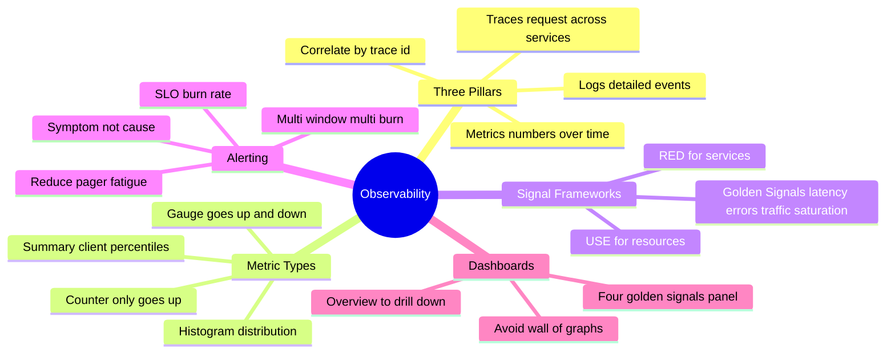
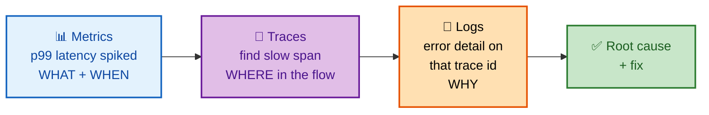
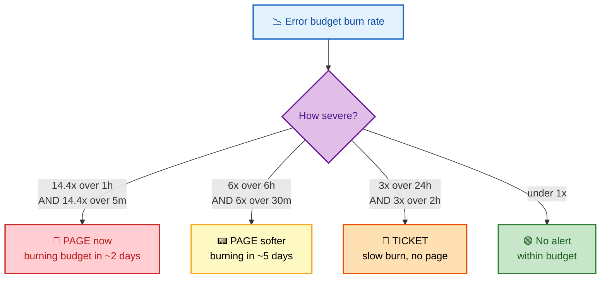

# SECTION 3: OBSERVABILITY — Metrics, Logs, Traces & SLO Alerting

> **Scope:** The three pillars (metrics, logs, traces) and how they correlate, the standard signal frameworks (Four Golden Signals, RED, USE), metric types and cardinality traps, SLO-based multi-burn-rate alerting, dashboards, and the difference between monitoring and true observability.

---

## Subtopic Index
- [Monitoring vs Observability](#monitoring-vs-observability)
- [The Three Pillars](#the-three-pillars)
- [Metrics & Metric Types](#metrics--metric-types)
- [The Signal Frameworks: Golden Signals, RED, USE](#the-signal-frameworks-golden-signals-red-use)
- [Logs](#logs)
- [Traces](#traces)
- [Cardinality](#cardinality)
- [SLO-Based Alerting (multi-burn-rate)](#slo-based-alerting-multi-burn-rate)
- [Dashboards](#dashboards)
- [Interview Questions & Answers](#interview-questions--answers)
- [Best Practices](#best-practices)
- [Documentation Links](#documentation-links)

---

## 🗺️ Visual Overview

**In one line:** Observability is the ability to answer *new* questions about your system from its outputs — you emit metrics (cheap trends), logs (rich detail), and traces (request flow), correlate them, and alert on user-facing symptoms via SLO burn rate.

**Mind map — the observability landscape:**



**How the three pillars correlate to answer "why is it slow?":**



**Multi-burn-rate SLO alerting — page fast for severe, ticket for slow:**



> 🧠 **Memory hooks (mnemonics):**
> - **Golden Signals (Google):** *"LETS Track"* → **L**atency, **E**rrors, **T**raffic, **S**aturation.
> - **RED = services (what users feel):** **R**ate, **E**rrors, **D**uration.
> - **USE = resources (what machines feel):** **U**tilization, **S**aturation, **E**rrors.
> - **Three pillars roles:** *Metrics = WHAT/WHEN, Traces = WHERE, Logs = WHY.*
> - **Alert rule:** *"Page on symptoms, not causes."* Page when users hurt, not when one CPU is busy.

---

## Monitoring vs Observability

> 🎯 **Interview weight:** 🔥🔥 High — a favorite framing question.

**In one line:** Monitoring answers *known* questions with pre-defined dashboards and alerts ("is CPU high?"); observability lets you ask *new, unanticipated* questions after the fact ("why are only Android users in Brazil seeing p99 spikes?").

| | Monitoring | Observability |
|---|---|---|
| Questions | Known-unknowns (pre-defined) | Unknown-unknowns (ad hoc) |
| Data | Aggregated metrics + alerts | High-cardinality, wide events |
| Use | "Is it broken?" | "Why is it broken, for whom?" |
| Example | Dashboard shows error rate up | Slice by user/region/version to find the failing cohort |

💡 **Observability is a property of the system** (can it be understood from outside?), while monitoring is an *activity* you do. High-cardinality, structured telemetry is what makes a system observable; a wall of static CPU graphs is just monitoring.

---

## The Three Pillars

> 🎯 **Interview weight:** 🔥🔥🔥 Very High — "name and contrast the three pillars."

**In one line:** Metrics = cheap numeric trends over time; Logs = detailed discrete events; Traces = the path of one request across services — and their power comes from *correlating* them via a shared trace/request ID.

| Pillar | What it is | Strength | Weakness |
|---|---|---|---|
| **Metrics** | Numeric time series (aggregated) | Cheap, fast, great for trends/alerts | No per-request detail; cardinality limits |
| **Logs** | Timestamped discrete events | Rich context, exact detail | Expensive at scale, noisy, hard to aggregate |
| **Traces** | End-to-end request across services | Shows *where* latency/errors occur in a flow | Sampling loses some requests; instrumentation cost |

🔍 **The correlation is the point.** A metric tells you p99 spiked at 14:32; a trace shows the slow span is the auth service; a log on that trace ID says "DB connection pool exhausted." Metrics → trace → log is the canonical debugging path, and OpenTelemetry exists to make all three share IDs.

---

## Metrics & Metric Types

> 🎯 **Interview weight:** 🔥🔥 High — Prometheus-flavored questions are common.

**In one line:** Four metric types — counters only go up, gauges go up and down, histograms bucket a distribution (enabling percentiles), and summaries compute percentiles client-side.

| Type | Behavior | Example | Use |
|---|---|---|---|
| **Counter** | Monotonically increases (reset on restart) | `http_requests_total` | Rates: `rate(...[5m])` |
| **Gauge** | Goes up and down | `memory_bytes`, `queue_depth` | Current state |
| **Histogram** | Buckets observations; server computes quantiles | `request_duration_seconds` | p50/p95/p99 latency |
| **Summary** | Client-side precomputed quantiles | `request_duration` summary | When you can't aggregate server-side |

```promql
# Request rate (per second, 5-min window)
rate(http_requests_total[5m])

# p99 latency from a histogram
histogram_quantile(0.99, sum(rate(http_request_duration_seconds_bucket[5m])) by (le))
```

⚠️ **Histogram vs. summary trap:** histogram quantiles are **aggregatable across instances** (you sum the buckets, then compute the quantile) — summaries are **not** (you can't average precomputed p99s). For fleet-wide latency SLOs, always use histograms.

---

## The Signal Frameworks: Golden Signals, RED, USE

> 🎯 **Interview weight:** 🔥🔥🔥 Very High — "what do you monitor on a new service?"

**In one line:** Three overlapping checklists — **Golden Signals** (Google's 4: latency, errors, traffic, saturation), **RED** for request-driven services, and **USE** for resources.

| Framework | Signals | Best for |
|---|---|---|
| **Four Golden Signals** | Latency, Errors, Traffic, Saturation | Any user-facing service (Google's default) |
| **RED** | Rate, Errors, Duration | Request-driven microservices |
| **USE** | Utilization, Saturation, Errors | Resources (CPU, disk, memory, queues) |

- **Latency:** measure *successful* and *failed* request latency separately — fast errors can hide slow successes.
- **Errors:** rate of failed requests (explicit 5xx, and *implicit* — wrong content, policy violations).
- **Traffic:** demand on the system (req/s, transactions/s).
- **Saturation:** how "full" the most constrained resource is — the leading indicator of impending trouble.

🧠 **RED and USE are complementary views of the same incident.** RED (service view) tells you *users are seeing errors*; USE (resource view) tells you *the DB connection pool is saturated*. You want both: RED to detect user pain, USE to explain it.

---

## Logs

> 🎯 **Interview weight:** 🔥 Medium-High — structured logging + levels.

**In one line:** Emit **structured (JSON) logs** with a trace ID, level, and context so they're machine-queryable, and keep production at INFO with the ability to enable DEBUG dynamically.

```json
{
  "timestamp": "2024-01-15T14:30:00Z",
  "level": "error",
  "service": "payment-api",
  "trace_id": "abc123",
  "user_id": "user-456",
  "message": "Payment failed",
  "error": "Card declined",
  "duration_ms": 1234
}
```

**Log levels:** `DEBUG → INFO → WARN → ERROR → FATAL`. Production runs at INFO+; enable DEBUG dynamically for a subset when investigating.

💡 **The trace_id field is the single most valuable log field** — it's the join key that stitches a log line to its metric spike and its trace span. Structured (not free-text) logs are what make logs aggregatable and alertable.

⚠️ **Logs are the most expensive pillar at scale.** Don't log every request body at INFO; sample high-volume logs, and never log secrets/PII. When cost explodes, the first lever is usually reducing log volume, not adding more.

---

## Traces

> 🎯 **Interview weight:** 🔥🔥 High — distributed tracing in microservices.

**In one line:** A **trace** is the full journey of one request; it's made of **spans** (individual operations) nested in a parent-child tree, connected across services by **context propagation** headers.

```text
Trace: one request
├── Span: API Gateway        ████████████████████████
│   ├── Span: Auth Service        ██████
│   └── Span: User Service             ████████
│       └── Span: Database                 ████
```

- **Span:** a single timed operation with start/end, attributes, and status.
- **Context propagation:** the trace context (`traceparent: 00-<trace-id>-<span-id>-01`) is passed in headers so downstream services attach their spans to the same trace.
- **Sampling:** you usually can't afford to trace 100% of requests — head-based (decide at ingress) or tail-based (decide after seeing the full trace, e.g., keep all errors/slow ones).

🔍 **Tail-based sampling is the senior answer** for "how do you trace cheaply without losing the interesting cases": sample a small % of *normal* traffic but keep *all* errors and slow traces, so your trace store is dense with the requests you actually need.

---

## Cardinality

> 🎯 **Interview weight:** 🔥🔥 High — a classic Prometheus scaling gotcha.

**In one line:** Cardinality is the number of unique label combinations on a metric; every unique combination is a separate time series, so high-cardinality labels (user ID, request ID, email) can explode memory and kill your metrics backend.

**Cardinality = product of label value counts.** A metric with `method` (5) × `status` (6) × `endpoint` (20) = 600 series — fine. Add `user_id` (1,000,000) and it's 600 million series — a "cardinality bomb."

| Safe as a metric label | Belongs in logs/traces instead |
|---|---|
| method, status code, endpoint template, region | user ID, request ID, email, full URL with IDs |

⚠️ **This is where metrics and logs divide.** Use **metrics** for bounded, low-cardinality dimensions you aggregate and alert on. Put **high-cardinality identifiers** (which user, which request) in **logs and traces**, joined back by trace ID. Putting a user ID in a Prometheus label is the textbook way to OOM your Prometheus.

---

## SLO-Based Alerting (multi-burn-rate)

> 🎯 **Interview weight:** 🔥🔥🔥 Very High — the modern answer to "how do you alert?"

**In one line:** Alert on **error-budget burn rate**, not static thresholds — page fast for severe fast burns and file tickets for slow burns, using **multi-window multi-burn-rate** rules to balance detection speed against false pages.

**Why not static thresholds?** "Alert if error rate > 1%" either pages on every harmless blip or misses a slow bleed. Burn-rate alerting ties the page directly to *SLO risk*: you only wake someone when the budget is genuinely in danger.

**Canonical multi-burn-rate config (Google SRE Workbook, 99.9% SLO):**

| Burn rate | Long window | Short window | Budget consumed if sustained | Action |
|---|---|---|---|---|
| 14.4× | 1 hour | 5 min | 2% in 1h | **Page** |
| 6× | 6 hours | 30 min | 5% in 6h | **Page** |
| 3× | 24 hours | 2 hours | 10% in 1 day | **Ticket** |
| 1× | 72 hours | 6 hours | slow bleed | Ticket / review |

**The two-window trick:** the **long window** confirms the burn is *sustained* (not a 1-minute blip); the **short window** confirms it's *still happening now* (so the alert auto-resolves when the issue clears). Both must fire.

🧠 **The whole point is to protect on-call sanity.** Multi-burn-rate pages loudly only for events that will actually exhaust the budget soon, and quietly files slow burns as tickets — cutting pager fatigue while still catching real risk. This is the #1 observability design question at SRE interviews.

---

## Dashboards

> 🎯 **Interview weight:** 🔥 Medium — "what's on your service dashboard?"

**In one line:** A good dashboard tells a story top-down — SLO/golden-signals overview first, then drill-down panels — not a "wall of 80 graphs" nobody reads during an incident.

**Structure:** overview row (SLO status + 4 golden signals) → per-dependency RED → resource USE → deploy/version annotations. Add **deploy markers** so you can instantly correlate a metric change with a release.

⚠️ **Anti-pattern:** the "wall of graphs" dashboard with every possible metric. In an incident, on-call needs the 4–6 signals that answer *"is it the app, a dependency, or a resource?"* — not 80 panels to scroll through. Design for the 3am on-call, not for completeness.

---

## Interview Questions & Answers

### Q1: How do you alert on SLOs without drowning on-call in pages?

**Answer:** Multi-window, multi-burn-rate alerting. I alert on *error-budget burn rate* rather than static error thresholds. A fast burn (e.g., 14.4× over 1h, confirmed by a 5-min short window) pages immediately because it'll exhaust a month's budget in ~2 days; a slow burn (3× over 24h) files a ticket instead of paging. Each alert pairs a long window (confirms it's sustained) with a short window (confirms it's still happening).

**Reasoning:** Static thresholds force a bad trade-off — sensitive enough to catch slow bleeds means noisy on blips. Burn rate ties every page to actual SLO risk and severity, so you page loudly for real danger and ticket quietly for slow degradations. That's the Google SRE Workbook pattern and it directly reduces pager fatigue.

**Follow-up — "Why the short window?"** So the alert auto-resolves: without it, the long window keeps the alert firing for an hour after the incident already cleared.

---

### Q2: Contrast RED, USE, and the Four Golden Signals.

**Answer:** **Four Golden Signals** (latency, errors, traffic, saturation) are Google's catch-all for any user-facing service. **RED** (Rate, Errors, Duration) is the service/request view — what users feel. **USE** (Utilization, Saturation, Errors) is the resource view — what a CPU, disk, or connection pool feels. They overlap heavily; RED ≈ golden signals minus saturation, USE ≈ the saturation/resource side.

**Reasoning:** You want both a request view and a resource view. RED tells you users are getting errors; USE explains it by showing the DB pool is saturated. Using only one leaves a blind spot — RED alone can't tell you *why*, USE alone can't tell you *who's hurting*.

**Follow-up — "New microservice, what do you instrument first?"** RED on every endpoint (rate, errors, p50/p99 duration) plus USE on its key resources — that's enough to define an SLO and debug most incidents.

---

### Q3: Your Prometheus is OOMing. What's the likely cause and fix?

**Answer:** Almost certainly a **cardinality explosion** — a label with unbounded values (user ID, request ID, full URL with IDs, email) multiplied out into millions of time series. The fix: find the offending metric (`topk` by series count / `count by (__name__)`), drop or relabel the high-cardinality label, and move that identifier into logs/traces where it belongs, joined back by trace ID.

**Reasoning:** Each unique label combination is a separate stored time series; Prometheus holds active series in memory. High-cardinality labels are the dominant cause of metrics-backend OOMs. Metrics are for bounded dimensions; per-entity identifiers go in logs/traces.

**Follow-up — "Where's the line?"** If a label can take more than a few hundred–thousand bounded values, it probably doesn't belong on a metric. Endpoint *templates* (`/users/:id`) are fine; raw paths with IDs are not.

---

### Q4: Walk me through debugging a p99 latency spike using all three pillars.

**Answer:** **Metrics** first: the dashboard shows p99 spiked at 14:32 and points to which service/endpoint. **Traces** next: I pull traces from that window and find the span that's eating the time — say the auth service's DB call. **Logs** last: I query logs for that trace ID and see "connection pool exhausted." Three pillars, three questions answered: what/when → where → why.

**Reasoning:** Each pillar is weakest where the next is strong. Metrics are cheap and great for *detecting* and localizing but have no per-request detail; traces show *where* in the flow; logs give the *exact* reason. The shared trace ID is what makes the hop between them instant.

**Follow-up — "What makes that hop possible?"** Consistent context propagation and putting the trace ID on every log line and metric exemplar — OpenTelemetry standardizes exactly this.

---

## Best Practices

- **Instrument RED on every endpoint and USE on every key resource** — that combination defines SLOs and explains incidents.
- **Alert on SLO burn rate, multi-window/multi-burn-rate** — page for fast burns, ticket for slow ones; page on symptoms, not causes.
- **Keep metric labels low-cardinality;** push user/request IDs to logs and traces, joined by trace ID.
- **Log structured JSON with a trace_id**, run production at INFO, sample high-volume logs, and never log secrets/PII.
- **Use histograms (not summaries) for latency SLOs** so quantiles aggregate across the fleet.
- **Tail-sample traces** to keep all errors/slow requests cheaply.
- **Design dashboards top-down for the 3am on-call**, with deploy annotations — not a wall of graphs.

---

## Documentation Links

- [Google SRE Workbook — Alerting on SLOs (multi-burn-rate)](https://sre.google/workbook/alerting-on-slos/)
- [Google SRE Book — Monitoring Distributed Systems (Golden Signals)](https://sre.google/sre-book/monitoring-distributed-systems/)
- [The RED Method (Weaveworks)](https://www.weave.works/blog/the-red-method-key-metrics-for-microservices-architecture/)
- [The USE Method (Brendan Gregg)](https://www.brendangregg.com/usemethod.html)
- [OpenTelemetry Documentation](https://opentelemetry.io/docs/)
- [Prometheus — Metric and label naming / cardinality](https://prometheus.io/docs/practices/naming/)

---

**[← Back: Reliability](./02-RELIABILITY.md)** | **[Next: Incident Management →](./04-INCIDENT-MANAGEMENT.md)**
