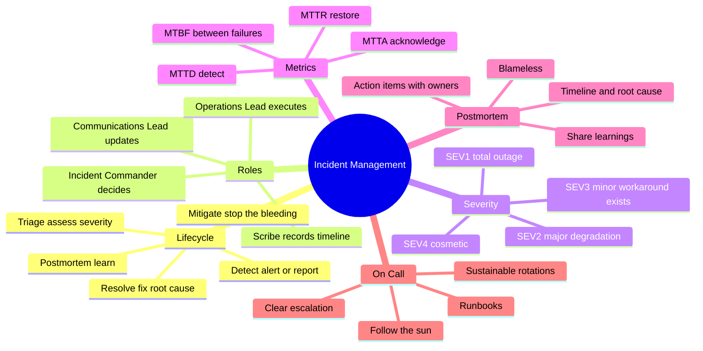
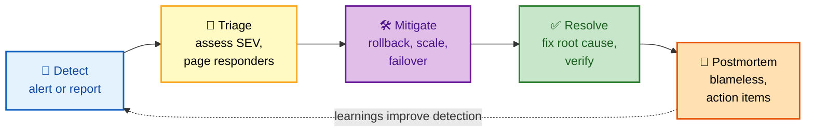
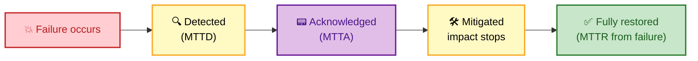

# SECTION 4: INCIDENT MANAGEMENT — On-Call, Command & Postmortems

> **Scope:** The full incident lifecycle (detect → triage → mitigate → resolve → postmortem), the Incident Command System and its roles, severity classification, the reliability metrics (MTTD/MTTA/MTTR/MTBF), blameless postmortems and action items, runbooks, and sustainable on-call practices.

---

## Subtopic Index
- [The Incident Lifecycle](#the-incident-lifecycle)
- [Incident Command System (roles)](#incident-command-system-roles)
- [Severity Levels](#severity-levels)
- [Reliability Metrics: MTTD, MTTA, MTTR, MTBF](#reliability-metrics-mttd-mtta-mttr-mtbf)
- [Blameless Postmortems](#blameless-postmortems)
- [Runbooks](#runbooks)
- [On-Call Best Practices](#on-call-best-practices)
- [Interview Questions & Answers](#interview-questions--answers)
- [Best Practices](#best-practices)
- [Documentation Links](#documentation-links)

---

## 🗺️ Visual Overview

**In one line:** Incident management is a *practiced process*, not improvisation — detect fast, assign a clear commander, **mitigate before you diagnose**, then run a blameless postmortem that turns the outage into permanent fixes and better detection.

**Mind map — the incident-management landscape:**



**The incident lifecycle — memorize this five-step flow (postmortem feeds detection back):**



**The MTTR timeline — where each metric measures:**



> 🧠 **Memory hooks (mnemonics):**
> - **Incident flow:** *"Detectives Triage Messy Real Postmortems"* → **D**etect → **T**riage → **M**itigate → **R**esolve → **P**ostmortem.
> - **Golden rule:** *"Mitigate first, diagnose later."* Stop user pain (roll back / fail over) before hunting root cause.
> - **The M metrics:** **MTT-D**etect, **MTT-A**cknowledge, **MTT-R**estore, **MTB**etween-**F**ailures. "Detect, Ack, Restore" is the incident triad; MTBF is the *frequency*.
> - **Blameless:** *"Blame the system, not the person."* People act reasonably given what they knew — fix the system that let the error through.

---

## The Incident Lifecycle

> 🎯 **Interview weight:** 🔥🔥🔥 Very High — "describe your incident process."

**In one line:** Five phases — detect, triage, mitigate, resolve, postmortem — with the non-negotiable principle that you **mitigate user impact before diagnosing root cause**.

| Phase | Goal | Key actions |
|---|---|---|
| **Detect** | Know something's wrong fast | Alert fires, customer report, or anomaly; low MTTD is the whole game |
| **Triage** (< 5 min) | Size it and staff it | Assess severity (SEV1–4), page the right responders, open an incident channel |
| **Establish roles** | One clear owner | Assign Incident Commander, Comms Lead, Ops Lead |
| **Mitigate** | Stop the bleeding | Rollback (if deploy), scale up (if capacity), failover (if regional) — **first**, investigate later |
| **Resolve** | Make it truly better | Fix root cause, verify, update status page |
| **Postmortem** (48–72h) | Learn permanently | Blameless review, root cause, action items with owners |

⚠️ **"Mitigate first" is the single most-tested judgment call.** If a bad deploy is causing errors, *roll it back now* — don't spend 40 minutes finding the exact bad line while users suffer. Root-cause analysis belongs in the resolution/postmortem phase, once the bleeding has stopped.

---

## Incident Command System (roles)

> 🎯 **Interview weight:** 🔥🔥 High — "who does what in a major incident?"

**In one line:** Borrowed from emergency services — one **Incident Commander** owns the incident and decisions (not the fixing), while specialized roles handle communication, hands-on work, and record-keeping so responders don't step on each other.

| Role | Owns | Does NOT do |
|---|---|---|
| **Incident Commander (IC)** | Coordination, decisions, delegation, declaring severity | Hands-on debugging (they'd lose the big picture) |
| **Operations / Ops Lead** | The actual technical mitigation and fixes | Talking to stakeholders |
| **Communications Lead** | Status page, stakeholder/exec updates, customer comms | Touching the system |
| **Scribe** | Timestamped timeline of actions/decisions | Making changes |

🔍 **The IC's job is to *not* touch the keyboard.** Their value is maintaining situational awareness, preventing conflicting changes, pulling in the right people, and making the call (roll back? escalate? declare SEV1?). The most common failure mode is the senior engineer trying to both command *and* fix — and losing the thread on both.

💡 For small incidents one person may wear several hats, but the *roles* still exist explicitly — "who is IC?" should have an unambiguous answer within minutes of any real incident.

---

## Severity Levels

> 🎯 **Interview weight:** 🔥🔥 High — severity drives response.

**In one line:** Severity classifies *impact* and dictates *response urgency and who's woken up* — SEV1 is all-hands "the world is on fire," SEV4 is a cosmetic ticket.

| Severity | Meaning | Response |
|---|---|---|
| **SEV1** | Critical: total outage, data loss, security breach | Immediate, all-hands, execs notified |
| **SEV2** | Major: significant degradation, partial outage | < 15 min, dedicated team |
| **SEV3** | Minor: degraded performance, workaround exists | < 4 hours / next business day |
| **SEV4** | Low: cosmetic, no customer impact | Normal ticket queue |

🧠 **Severity ≠ priority.** Severity is *how bad the impact is right now*; priority is *how urgently you work it*. They usually align, but a SEV3 affecting your biggest customer might get worked at SEV2 urgency. Define severity by customer impact, not by how hard the fix looks.

⚠️ **When in doubt, over-classify then downgrade.** It's cheaper to spin up a SEV2 response and stand it down than to under-call a real outage and lose 20 minutes gathering people.

---

## Reliability Metrics: MTTD, MTTA, MTTR, MTBF

> 🎯 **Interview weight:** 🔥🔥🔥 Very High — expect definitions and how to improve each.

**In one line:** Four metrics slice the failure timeline — **MTTD** (time to detect), **MTTA** (time to acknowledge), **MTTR** (mean time to restore), and **MTBF** (mean time between failures) — and improving reliability means shrinking the first three while growing the last.

| Metric | Measures | Improve by |
|---|---|---|
| **MTTD** (Detect) | Failure → detection | Better alerting/SLO burn-rate alerts, good observability |
| **MTTA** (Acknowledge) | Alert → human ack | Sane paging, clear on-call, no alert fatigue |
| **MTTR** (Restore/Repair) | Failure → service restored | Runbooks, fast rollback, automation, practice |
| **MTBF** (Between Failures) | Avg uptime between incidents | Fixing root causes, resilience patterns, fewer risky changes |

🔍 **"MTTR" is ambiguous — clarify it.** It can mean mean time to *restore* (impact stops), to *repair* (root cause fixed), or to *respond*. In SRE contexts, **time to restore service** (mitigate) is what matters most for users; say which you mean.

💡 **The biggest MTTR lever is fast, safe rollback.** If most incidents are deploy-related, "restore" often means "revert" — and a 30-second one-click rollback beats any amount of heroic debugging. This is why progressive delivery (Section 6) is also an incident-management topic.

🧠 **Availability connects them:** `Availability = MTBF / (MTBF + MTTR)`. You raise availability either by failing *less often* (↑MTBF) or *recovering faster* (↓MTTR) — and recovering faster is usually the cheaper, higher-leverage investment.

---

## Blameless Postmortems

> 🎯 **Interview weight:** 🔥🔥🔥 Very High — "what makes a good postmortem?"

**In one line:** A blameless postmortem assumes everyone acted reasonably with the information they had, and focuses on *what in the system* allowed the failure — because blaming people just teaches them to hide mistakes.

**Why blameless:** if people get punished for incidents, they stop reporting near-misses, hide mistakes, and act defensively — destroying the learning that prevents the *next* outage. Blameless culture trades individual blame for systemic improvement.

**Postmortem template:**

```markdown
## Incident Summary
- Duration: 2024-01-15 14:30–15:45 UTC (75 min)
- Severity: SEV2
- Impact: 15% of users saw 5xx errors
- Error Budget Consumed: 45 minutes

## Timeline
14:30 — Alert: error rate > 5%
14:35 — IC assigned, incident channel created
14:45 — Root cause identified: bad deploy
14:50 — Rollback initiated
15:45 — All systems normal

## Root Cause
A DB query in the new release had O(n²) complexity, causing
timeouts under production load.

## Contributing Factors
- Load testing didn't use production-scale data
- No query performance monitoring in staging
- Canary didn't catch the regression

## Action Items (each has an owner + due date + ticket)
- [ ] Add query-performance checks to staging (@alice)
- [ ] Production-scale load tests (@bob)
- [ ] Extend canary observation window (@carol)

## Lessons Learned
- Went well: fast detection, smooth rollback
- Went wrong: testing gap for large datasets
- Got lucky: low-traffic window
```

⚠️ **Action items without an owner, due date, and tracking ticket are theater.** The postmortem's *only* durable output is the set of fixes that actually ship. A pile of un-owned "we should…" bullets means the same incident recurs.

💡 **Include "where we got lucky."** Naming the luck (low traffic, someone happened to be online) surfaces latent risks that didn't bite *this* time but will next time — and those often become the highest-value action items.

---

## Runbooks

> 🎯 **Interview weight:** 🔥 Medium — "how does on-call know what to do?"

**In one line:** A runbook is a concise, tested, step-by-step guide for a specific alert or task, so a tired on-call engineer at 3am executes a known-good procedure instead of improvising.

**A good runbook links from the alert itself** and contains: what the alert means, how to confirm the impact, the safe mitigation steps (with exact commands), escalation criteria, and rollback instructions.

🔍 **The goal is to turn toil into automation over time.** A mature runbook step is often *"run this script"* — and the endgame is auto-remediation where the system fixes itself and the runbook just documents what it did. A runbook full of manual steps is a to-do list for automation.

⚠️ **Untested runbooks rot.** Commands go stale, paths change, permissions drift. Exercise them in game days; a runbook that fails at 3am is worse than none because it wastes precious minutes.

---

## On-Call Best Practices

> 🎯 **Interview weight:** 🔥🔥 High — sustainability + humane on-call.

**In one line:** On-call must be *sustainable* — reasonable rotation size, a hard cap on pages per shift, clear escalation, comp/time-off, and a relentless focus on killing the alerts that shouldn't page.

| Practice | Why |
|---|---|
| **Sustainable rotation** (6–8+ engineers) | Nobody is on-call too often; avoids burnout |
| **Page budget** (e.g., ≤ 2 pages/shift) | Each page should be actionable; more means fix alerts, not people |
| **Clear escalation path** | On-call always knows who to pull in and when |
| **Follow-the-sun** | Hand off across time zones so no one is paged overnight repeatedly |
| **Actionable alerts only** | Every page must need a human *now*; delete/tune the rest |
| **Compensation & recovery** | Comp time / pay, and no expectation of daytime work after a rough night |

🧠 **Alert fatigue is a reliability risk, not just a morale one.** When on-call gets 30 pages a shift, they start ignoring them — and miss the one that mattered. Ruthlessly tuning alerts (symptom-based, SLO burn-rate, auto-resolving) is core SRE work, not an afterthought.

💡 **Every page should be reviewed:** "Was this actionable? Could it have auto-remediated? Should it have paged at all?" Non-actionable pages get downgraded to tickets or automated away. On-call health is a leading indicator of system and team health.

---

## Interview Questions & Answers

### Q1: Walk me through how you handle a SEV1 outage.

**Answer:** Triage and declare SEV1 fast, then establish roles — an **Incident Commander** who coordinates (and stays off the keyboard), an Ops Lead doing the hands-on work, and a Comms Lead updating the status page and execs. Then **mitigate before diagnosing**: if it's a bad deploy, roll back; if capacity, scale; if regional, fail over — stop user pain first. Once stable, fix the root cause and verify. Within 48–72h, run a blameless postmortem with owned action items.

**Reasoning:** The two failure modes I'm avoiding are (1) chaos with no clear owner and conflicting changes, solved by the IC role, and (2) prolonging impact by debugging while users suffer, solved by "mitigate first." The postmortem closes the loop so it doesn't recur.

**Follow-up — "The IC is your best debugger — shouldn't they fix it?"** No — if the IC dives into the keyboard they lose situational awareness and the coordination that actually shortens the incident. Put them on Ops Lead *or* IC, never both.

---

### Q2: What makes a postmortem "good," and why blameless?

**Answer:** A good postmortem has a factual timeline, a real root cause (not "human error"), honest contributing factors including *where we got lucky*, and **action items with owners, due dates, and tickets**. Blameless means we assume everyone acted reasonably given what they knew and focus on the *system* that allowed the mistake.

**Reasoning:** Blame makes people hide incidents and near-misses, which kills the learning loop. The durable value of a postmortem is the shipped fixes and improved detection — un-owned action items mean the same outage returns. Naming the "luck" surfaces latent risks before they bite.

**Follow-up — "Someone pushed a bad config manually — isn't that their fault?"** The systemic question is *why did a single manual push to prod without review/canary even work?* Fix the guardrail (require review, canary, validation), not the person.

---

### Q3: Define MTTR and MTBF and tell me which you'd invest in.

**Answer:** **MTBF** = mean time *between* failures (how often things break); **MTTR** = mean time *to restore* (how long impact lasts). `Availability = MTBF / (MTBF + MTTR)`. For most teams I'd invest first in **lowering MTTR** — fast one-click rollback, good runbooks, practiced response — because it's usually cheaper and higher-leverage than eliminating every possible failure.

**Reasoning:** You can't prevent all failures (embrace risk), but you can make recovery near-instant. Cutting MTTR from 30 min to 3 min improves availability immediately across *all* incident types, whereas chasing MTBF is a long tail of individual root causes. Both matter, but recovery speed is the better first dollar.

**Follow-up — "When would you prioritize MTBF instead?"** When incidents are rare but catastrophic (data loss, security) — there, prevention dominates because fast recovery can't undo the damage.

---

### Q4: Your on-call is getting 25 pages a shift. What do you do?

**Answer:** Treat it as a reliability defect. I'd audit every alert for the last few weeks, classify each page as actionable or not, and attack the non-actionable majority: delete alerts on causes (not symptoms), convert slow-burn conditions to tickets, add auto-resolution, and fix or automate the top recurring toil sources. The target is every page being genuinely actionable and roughly ≤ 2 per shift.

**Reasoning:** 25 pages a shift guarantees alert fatigue — on-call starts ignoring pages and will miss the real one. Alert volume is a system smell: either the alerts are bad (page on symptoms via SLO burn rate instead) or the system is genuinely too fragile (fix the recurring root causes). Both are core SRE work, not "toughen up."

**Follow-up — "How do you decide if an alert should exist?"** If a human can't take a useful action *right now* in response, it shouldn't page — downgrade it to a ticket or dashboard, or automate the remediation.

---

## Best Practices

- **Mitigate before you diagnose** — roll back, scale, or fail over to stop user pain; root-cause later.
- **Assign a clear Incident Commander** who coordinates and stays off the keyboard.
- **Classify by customer impact**, over-classify when unsure, and let severity drive response urgency.
- **Run blameless postmortems** with owned, dated, tracked action items — and record "where we got lucky."
- **Optimize MTTR first** (fast rollback + runbooks + practice) for most services; invest in MTBF where failures are catastrophic.
- **Keep on-call sustainable and every alert actionable** — alert fatigue is a reliability risk; tune relentlessly toward SLO burn-rate paging.
- **Link tested runbooks from alerts** and drive their manual steps toward automation.

---

## Documentation Links

- [Google SRE Book — Managing Incidents](https://sre.google/sre-book/managing-incidents/)
- [Google SRE Book — Postmortem Culture: Learning from Failure](https://sre.google/sre-book/postmortem-culture/)
- [Google SRE Book — Being On-Call](https://sre.google/sre-book/being-on-call/)
- [PagerDuty Incident Response Docs](https://response.pagerduty.com/)
- [Atlassian Incident Management Handbook](https://www.atlassian.com/incident-management)

---

**[← Back: Observability](./03-OBSERVABILITY.md)** | **[Next: Capacity & Performance →](./05-CAPACITY-PERFORMANCE.md)**
