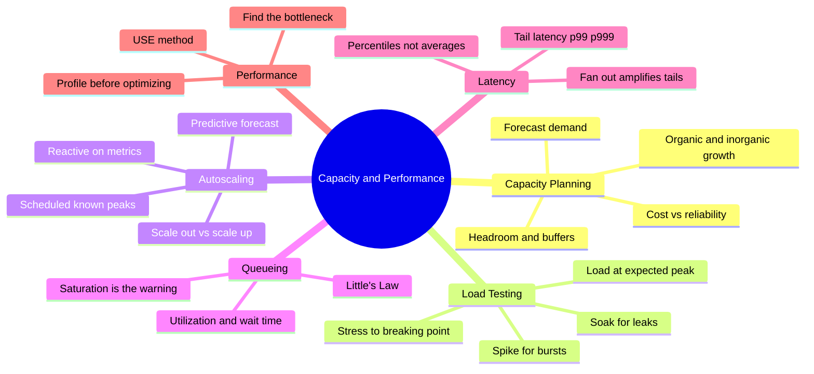
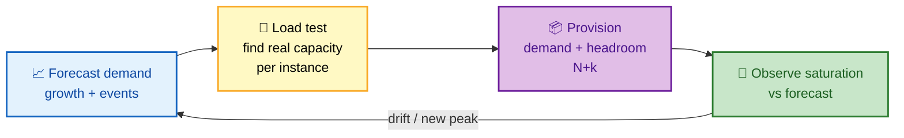
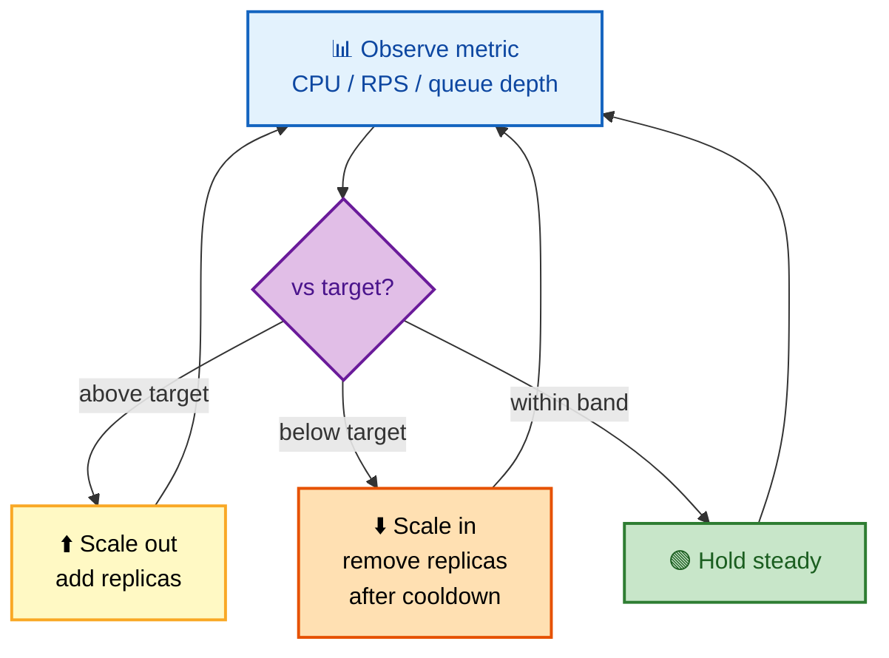

# SECTION 5: CAPACITY PLANNING & PERFORMANCE

> **Scope:** Forecasting demand and provisioning headroom, load and stress testing, autoscaling (reactive, scheduled, predictive), Little's Law and queueing intuition, tail latency and percentiles, saturation, and systematic performance analysis (USE method, profiling, bottleneck hunting).

---

## Subtopic Index
- [Capacity Planning](#capacity-planning)
- [Headroom & the N+k Rule](#headroom--the-nk-rule)
- [Load, Stress & Soak Testing](#load-stress--soak-testing)
- [Autoscaling](#autoscaling)
- [Little's Law & Queueing Intuition](#littles-law--queueing-intuition)
- [Tail Latency & Percentiles](#tail-latency--percentiles)
- [Performance Analysis](#performance-analysis)
- [Interview Questions & Answers](#interview-questions--answers)
- [Best Practices](#best-practices)
- [Documentation Links](#documentation-links)

---

## 🗺️ Visual Overview

**In one line:** Capacity planning is making sure you have *enough* resources — plus headroom to absorb spikes and failures — by forecasting demand, load-testing to find real limits, and autoscaling to track demand, while performance work hunts the bottleneck that caps throughput or inflates tail latency.

**Mind map — the capacity & performance landscape:**

**The capacity planning loop — forecast, test, provision, observe:**

**Reactive autoscaling loop — metric drives replica count:**

> 🧠 **Memory hooks (mnemonics):**
> - **Test types:** *"Load, Stress, Soak, Spike"* → **L**oad = expected peak, **S**tress = break it, **S**oak = run long (leaks), **S**pike = sudden burst.
> - **Headroom:** *"Provision for peak + one failure."* N+1/N+2 so losing a node/zone is absorbable.
> - **Little's Law:** *"L = λ × W"* → items in system = arrival rate × time in system. More arrivals *or* slower service = deeper queues.
> - **Latency:** *"Averages lie, tails bite."* Track p99/p99.9, never just the mean.
> - **Perf:** *"Measure, don't guess."* Profile to find the bottleneck before optimizing anything.

---

## Capacity Planning

> 🎯 **Interview weight:** 🔥🔥 High — "how do you plan capacity for a service?"

**In one line:** Forecast future demand (organic growth + known events), translate it into resource needs using measured per-unit capacity, and provision that *plus headroom* — balancing the cost of over-provisioning against the risk of running out.

**The process:**
1. **Forecast demand** — extrapolate organic growth trends and add *inorganic* jumps (launches, marketing, seasonal peaks like Black Friday).
2. **Measure per-unit capacity** — via load testing, how many req/s can one instance sustain at acceptable latency?
3. **Compute needed units** — `peak demand ÷ per-unit capacity`, then add headroom.
4. **Account for failure** — provision enough that losing a zone/node still serves peak.
5. **Re-forecast continuously** — compare actual saturation to plan and adjust.

| Demand type | Example | Handling |
|---|---|---|
| **Organic** | Steady user growth | Trend extrapolation |
| **Inorganic** | Product launch, Super Bowl ad | Explicit one-off provisioning + load test |
| **Seasonal** | Holiday shopping, tax season | Scheduled scale-up ahead of time |

💡 **Capacity planning is fundamentally a reliability topic, not just finance.** A service with zero headroom is one traffic spike or one failed node away from a cascading failure (Section 2). Headroom *is* resilience.

⚠️ **Plan for peak, not average.** Averages hide the spikes that actually break you. Size to peak-plus-failure, then use autoscaling to reclaim cost during the troughs.

---

## Headroom & the N+k Rule

> 🎯 **Interview weight:** 🔥🔥 High.

**In one line:** Always run with spare capacity (**headroom**) so you can absorb a sudden spike *and* the loss of a unit — commonly expressed as **N+1** (survive one failure) or **N+2** (survive one failure even during maintenance).

- **N** = units needed to serve peak.
- **N+1** = one spare; you survive a single node/zone failure at peak.
- **N+2** = survive a failure *while another unit is down for maintenance/upgrade*.

**Typical target utilization:** many teams aim to keep steady-state utilization around **50–70%** of capacity, leaving 30–50% headroom for spikes, failover load redistribution, and autoscaling lag.

🔍 **Why not run at 95%?** Because the moment a node dies, its traffic redistributes onto the survivors. If they're already at 95%, they tip over — the classic load-redistribution cascade. Headroom is the margin that lets the fleet *absorb* a lost node instead of collapsing.

🧠 **Autoscaling doesn't eliminate headroom — it reshapes it.** Scale-out isn't instant (boot + warmup + health checks), so you still need enough headroom to survive the *time it takes to scale*. This is why scaling thresholds are set below 100% (e.g., scale at 60–70% CPU).

---

## Load, Stress & Soak Testing

> 🎯 **Interview weight:** 🔥🔥 High — "how do you know your capacity?"

**In one line:** You can't plan capacity you haven't measured — load tests validate expected peak, stress tests find the breaking point, soak tests reveal leaks over time, and spike tests check sudden-burst behavior.

| Test | Goal | What it reveals |
|---|---|---|
| **Load test** | Sustain expected peak traffic | Does it meet SLOs at target load? |
| **Stress test** | Push until it breaks | The actual ceiling + *how* it fails (graceful vs. cascade) |
| **Soak / endurance** | Run at load for hours/days | Memory leaks, connection leaks, disk fill, slow degradation |
| **Spike test** | Sudden traffic jump | Autoscaling reaction time, cold-start behavior |

⚠️ **Test with production-scale data and realistic traffic shape.** A load test against an empty DB or with unrealistic cache hit rates lies — the O(n²) query that's fine on 1k rows melts on 10M. The postmortem in Section 4 is exactly this failure: load testing that didn't use production-scale data.

💡 **Stress testing's real value is learning *how* it breaks.** Does it shed load gracefully and stay partly up, or cascade into a total outage? That tells you whether your resilience patterns (load shedding, circuit breakers) actually work under pressure.

---

## Autoscaling

> 🎯 **Interview weight:** 🔥🔥🔥 Very High — expect trade-offs and failure modes.

**In one line:** Autoscaling tracks capacity to demand automatically — reactively on live metrics, on a schedule for known peaks, or predictively from forecasts — and you choose between scaling *out* (more instances) and scaling *up* (bigger instances).

| Type | Trigger | Best for |
|---|---|---|
| **Reactive** | Live metric crosses target (CPU, RPS, queue depth) | General-purpose; the default (HPA, ASG target tracking) |
| **Scheduled** | Time-based rule | Predictable peaks (business hours, known events) |
| **Predictive** | ML forecast of demand | Smooth known patterns; pre-warm before the spike |

**Scale out vs. scale up:**
- **Scale out (horizontal):** add more instances — near-unlimited, improves fault tolerance, needs statelessness/load balancing. The cloud-native default.
- **Scale up (vertical):** bigger instance — simpler, but has a ceiling, often needs a restart, and is a single point of failure.

⚠️ **Autoscaling failure modes interviewers love:**
- **Slow reaction / cold start:** scaling isn't instant; a sharp spike can outrun scale-out. Mitigate with headroom, pre-warming, and faster-booting images.
- **Scaling on the wrong metric:** CPU is a poor proxy for an I/O-bound or queue-driven workload — scale on **queue depth** or **RPS per replica** instead.
- **Flapping / thrashing:** aggressive thresholds scale in and out repeatedly — use cooldowns, stabilization windows, and asymmetric scale-up-fast/scale-in-slow.
- **Scaling into a downstream limit:** more app replicas hammer a DB with a fixed connection cap — you just moved the bottleneck.

🔍 **The senior insight:** autoscaling handles *variable* load but is **not a substitute for capacity planning**. It can't scale beyond your quota/limits, it lags sudden spikes, and it can push load onto a non-scalable downstream. You still need a baseline plan + headroom underneath it.

---

## Little's Law & Queueing Intuition

> 🎯 **Interview weight:** 🔥🔥 High — the math behind capacity.

**In one line:** **Little's Law** says `L = λ × W` — the average number of requests in the system equals arrival rate × average time in system — which explains why latency explodes as utilization approaches 100%.

- **L** = average number in the system (concurrency / queue depth)
- **λ** (lambda) = arrival rate (req/s)
- **W** = average time in system (latency incl. queue wait)

**The killer consequence:** as utilization (ρ) approaches 1 (100%), queue wait time grows **non-linearly** — roughly proportional to `1/(1−ρ)`. At 90% utilization, wait time is ~10× the service time; at 99% it's ~100×. This is why systems feel fine at 70% and fall off a cliff at 95%.

🧠 **This is the mathematical justification for headroom.** You keep utilization at 50–70% not to waste money but because the queueing curve goes vertical near saturation — a little more load past the knee causes a latency explosion, not a gentle slowdown.

💡 **Use it to size things:** if you must hold 1,000 concurrent requests (L) and each takes 200ms (W = 0.2s), Little's Law gives arrival rate `λ = L/W = 5,000 req/s` — a quick sanity check on whether your thread pools / connection pools are sized for the load.

---

## Tail Latency & Percentiles

> 🎯 **Interview weight:** 🔥🔥🔥 Very High — "why not use average latency?"

**In one line:** Averages hide the pain — you track **percentiles** (p50, p95, p99, p99.9) because a great average can still mean 1% of users have a terrible experience, and fan-out makes tail latency *worse*, not better.

**Why percentiles over averages:** an average of 100ms could be 99% of requests at 50ms and 1% at 5s. The mean looks fine; the p99 exposes the 5s tail that's driving customers away. **Measure what the slowest users feel.**

**Tail latency amplification (the fan-out trap):** if a request fans out to 100 backends and waits for all of them, the overall latency is driven by the *slowest* of the 100 — so even a p99 that's rare per-backend becomes *likely* per-request. With 100 parallel calls, the chance at least one hits the p99 tail is ~`1 − 0.99^100 ≈ 63%`.

| Mitigation | How it helps |
|---|---|
| **Request hedging** | Send a duplicate to a second replica after a short delay; take the first response |
| **Backup requests with cancellation** | Like hedging but cancel the loser to limit extra load |
| **Reduce fan-out / tighter timeouts** | Fewer parallel dependencies, or don't wait for stragglers |

⚠️ **The p99 of a service is the p50+ experience of its heaviest users.** Power users make more requests, so they hit your tail more often — the tail isn't a rare edge case, it's your best customers' *normal*.

---

## Performance Analysis

> 🎯 **Interview weight:** 🔥🔥 High — "a service is slow, how do you find why?"

**In one line:** Performance work is systematic bottleneck-hunting — apply the **USE method** to every resource, **profile before optimizing**, and fix the single constraining resource rather than guessing.

**USE method (Brendan Gregg):** for every resource (CPU, memory, disk, network, connection pools), check **U**tilization, **S**aturation, and **E**rrors. The resource that's saturated first is your bottleneck.

**The disciplined loop:**
1. **Define the target** (which SLI/percentile is bad).
2. **Measure** — profile (CPU flame graphs, DB slow-query logs, trace spans) to locate the *actual* bottleneck.
3. **Fix the one bottleneck** — there's always exactly one binding constraint at a time.
4. **Re-measure** — the bottleneck *moves* once you fix it; repeat.

⚠️ **"Premature optimization" and "guessing" are the two cardinal sins.** Optimizing code that isn't the bottleneck wastes effort and adds complexity. Always profile first — the slow part is frequently *not* where intuition says (often it's an N+1 query, a lock, or a downstream call, not your algorithm).

🔍 **Common bottlenecks, ranked by how often they're the real culprit:** database (N+1 queries, missing indexes, lock contention) → downstream/network calls → serialization/GC → CPU-bound code. Start where the traces point, not where your favorite optimization lives.

---

## Interview Questions & Answers

### Q1: Why do you keep utilization around 60–70% instead of running at 95%?

**Answer:** Two reasons, one queueing and one failure-related. **Queueing (Little's Law):** wait time scales like `1/(1−utilization)`, so near 100% a tiny load increase causes a non-linear latency explosion — systems feel fine at 70% and fall off a cliff past ~90%. **Failure:** when a node dies, its traffic redistributes to survivors; if they're already at 95%, they tip over into a cascade. Headroom is the margin that absorbs both spikes and failover load.

**Reasoning:** Capacity isn't just "don't run out" — it's "stay left of the queueing knee and survive losing a unit." That's why 50–70% steady-state with N+1/N+2 headroom is the norm, and why autoscale thresholds sit well below 100%.

**Follow-up — "Doesn't autoscaling let you run hotter?"** Only partly — scaling has lag (boot + warmup), so you still need enough headroom to survive the *time it takes to scale*.

---

### Q2: Why measure p99 instead of average latency, and what's tail amplification?

**Answer:** Averages hide the tail — 100ms mean could be 99% at 50ms and 1% at 5s, and that 1% is often your heaviest users (they make more requests, so they hit the tail more). **Tail amplification:** when one request fans out to N backends and waits for all, its latency tracks the *slowest* backend, so a per-backend p99 becomes a per-request near-certainty. With 100 parallel calls, ~63% of requests hit at least one p99 tail.

**Reasoning:** SLOs and user happiness live in the tail, not the mean. Fan-out architectures make this worse, which is why techniques like request hedging (send a backup after a delay, take the first answer) exist specifically to cut tail latency.

**Follow-up — "How does hedging not double your load?"** You only hedge a small fraction (after a delay past p95) and cancel the loser — a few % extra load to collapse the tail.

---

### Q3: How would you size and autoscale a new service?

**Answer:** First **load test** to find per-instance capacity at acceptable latency. Then **forecast peak demand** (organic growth + known events) and provision `peak ÷ per-instance + headroom` as a baseline (N+1/N+2). Layer **reactive autoscaling** on top, scaling on the *right* metric — RPS-per-replica or queue depth for I/O-bound work, not blind CPU — with cooldowns to prevent flapping and scale-up-fast/scale-in-slow asymmetry.

**Reasoning:** Autoscaling handles *variable* load but isn't a substitute for a baseline plan — it lags spikes, has quota ceilings, and can shove load onto a non-scalable downstream. A measured baseline + headroom underneath autoscaling is the robust combination.

**Follow-up — "It scaled out but the DB fell over — why?"** You scaled the stateless tier into a fixed downstream limit (DB connections). Autoscaling moved the bottleneck; you need connection pooling/limits and to scale the data tier deliberately.

---

### Q4: Explain Little's Law and one way you'd use it.

**Answer:** `L = λ × W` — average items in the system = arrival rate × time in system. I'd use it to sanity-check concurrency: if I need to hold 1,000 concurrent requests and each takes 200ms, arrival rate is `λ = L/W = 1000/0.2 = 5,000 req/s`, which tells me whether my thread/connection pools are sized right. It also explains the headroom rule — wait time blows up as utilization nears 1.

**Reasoning:** It's the simplest law that ties arrival rate, latency, and concurrency together, so it's the back-of-envelope tool for capacity sanity checks and for explaining *why* saturation causes latency cliffs.

**Follow-up — "What does it assume?"** A stable system (arrivals ≈ departures over the window); it's remarkably distribution-free, which is why it's so broadly useful.

---

## Best Practices

- **Plan to peak-plus-failure, not average**, and keep steady-state utilization ~50–70% for headroom.
- **Load/stress/soak/spike test with production-scale data** — you can't plan capacity you haven't measured, and stress tests reveal *how* you fail.
- **Autoscale on the right metric** (RPS/queue depth, not blind CPU), with cooldowns, stabilization windows, and scale-up-fast/scale-in-slow.
- **Don't treat autoscaling as a capacity plan** — it lags spikes, has quota ceilings, and can overwhelm non-scalable downstreams.
- **Track percentiles (p95/p99/p99.9), never just averages**, and use hedging/timeouts to tame tail latency in fan-out systems.
- **Profile before optimizing** — fix the one binding bottleneck (USE method), then re-measure because it moves.

---

## Documentation Links

- [Google SRE Book — Software Engineering in SRE / Capacity](https://sre.google/sre-book/software-engineering-in-sre/)
- [Google SRE Book — Handling Overload](https://sre.google/sre-book/handling-overload/)
- [The Tail at Scale (Dean & Barroso, CACM)](https://research.google/pubs/pub40801/)
- [The USE Method (Brendan Gregg)](https://www.brendangregg.com/usemethod.html)
- [Kubernetes Horizontal Pod Autoscaler](https://kubernetes.io/docs/tasks/run-application/horizontal-pod-autoscale/)

---

**[← Back: Incident Management](./04-INCIDENT-MANAGEMENT.md)** | **[Next: Release, Chaos & DR →](./06-PRACTICES.md)**
