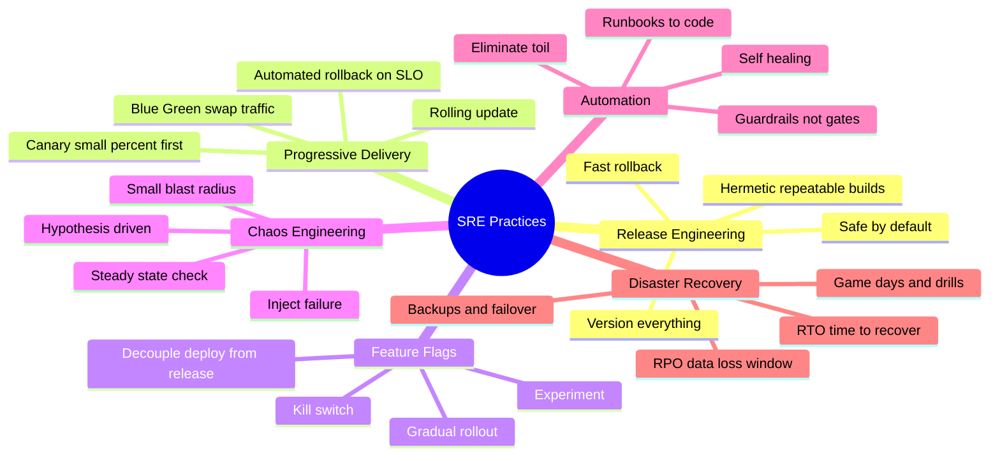
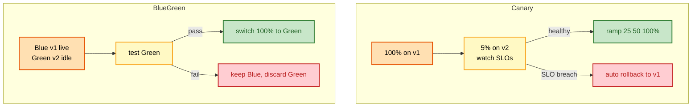
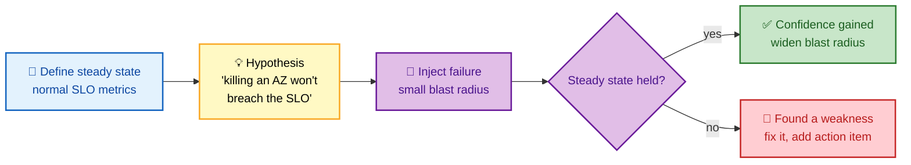

# SECTION 6: SRE PRACTICES — Release Engineering, Chaos & DR

> **Scope:** The operational practices that keep velocity high without burning the error budget — release engineering and progressive delivery (canary, blue-green, feature flags), chaos engineering, automation and eliminating toil, and disaster recovery with RTO/RPO and game days.

---

## Subtopic Index
- [Release Engineering](#release-engineering)
- [Progressive Delivery](#progressive-delivery)
- [Feature Flags](#feature-flags)
- [Chaos Engineering](#chaos-engineering)
- [Automation & Eliminating Toil](#automation--eliminating-toil)
- [Disaster Recovery: RTO & RPO](#disaster-recovery-rto--rpo)
- [Game Days](#game-days)
- [Interview Questions & Answers](#interview-questions--answers)
- [Best Practices](#best-practices)
- [Documentation Links](#documentation-links)

---

## 🗺️ Visual Overview

**In one line:** These are the practices that let you *change* a live system safely — ship in small, reversible increments (progressive delivery), prove resilience by injecting failure on purpose (chaos), automate away toil, and rehearse recovery (DR + game days) so real disasters are non-events.

**Mind map — the SRE practices landscape:**

**Deployment strategies compared — traffic flow during a release:**

**Chaos engineering loop — hypothesis, inject, observe, learn:**

> 🧠 **Memory hooks (mnemonics):**
> - **Progressive delivery:** *"Canary sings first"* → expose a *small* slice to new code before everyone; blue-green = two identical envs, flip the switch.
> - **Deploy ≠ release:** *feature flags* decouple *deploying* code (it's on the server, dark) from *releasing* it (users can see it).
> - **Chaos:** *"Break it on purpose, on a Tuesday, at noon"* — controlled failure during work hours beats a real 3am surprise.
> - **DR pair:** **RTO** = how long to *recover* (time); **RPO** = how much data you can *lose* (data). "R**T**O = **T**ime, R**P**O = **P**oints/data."

---

## Release Engineering

> 🎯 **Interview weight:** 🔥🔥 High — the discipline of shipping safely.

**In one line:** Release engineering makes deployments **repeatable, versioned, and reversible** — hermetic builds, everything in version control, safe-by-default rollout, and instant rollback — so shipping change is routine rather than risky.

**Core principles:**

| Principle | Meaning |
|---|---|
| **Hermetic, repeatable builds** | Same source → same artifact, every time; no hidden host dependencies |
| **Version everything** | Code, config, infra, and the pipeline itself are in source control |
| **Self-service & automated** | Developers ship via pipeline, not by hand-editing prod |
| **Safe by default** | Progressive rollout + health gates are the default path |
| **Fast, tested rollback** | Reverting is a one-click, well-rehearsed operation |

💡 **The link to error budgets:** release engineering is *how you spend the budget wisely*. Small, reversible, health-gated releases mean each change risks only a sliver of budget and can be undone before it drains more — which is what lets you keep shipping.

⚠️ **Rollback must be first-class and practiced.** "We can roll forward with a hotfix" is not a rollback strategy — under incident pressure you want a button that reverts to the last known-good version in seconds. If rollback is scary or untested, your MTTR (Section 4) is at its mercy.

---

## Progressive Delivery

> 🎯 **Interview weight:** 🔥🔥🔥 Very High — canary vs. blue-green is a staple question.

**In one line:** Roll out change *gradually* and watch SLOs at each step so a bad version is caught while it affects a tiny fraction of traffic — the practical embodiment of "small blast radius + fast rollback."

| Strategy | How it works | Pros | Cons |
|---|---|---|---|
| **Rolling update** | Replace instances a few at a time | Simple, no extra capacity | Both versions live at once; slow rollback |
| **Canary** | Send 1–5% to new version, watch SLOs, then ramp | Catches bad releases at tiny blast radius; SLO-gated auto-rollback | Needs good metrics + traffic splitting |
| **Blue-green** | Two identical envs; test idle "green," then flip 100% | Instant switch *and* instant rollback (flip back) | Doubles infra cost; DB schema must be compatible |

**Canary is the SRE default** because it *quantifies* risk: you expose the new version to a small, real slice of traffic and let your SLO/burn-rate alerts (Section 3) decide automatically whether to promote or roll back.

🔍 **The hard part of both is state/schema.** Blue-green and canary assume the new version can coexist with the old against the *same database*. That forces **backward-compatible, expand-then-contract schema migrations** (add column → deploy code that writes both → backfill → switch reads → drop old) — the most common gotcha interviewers probe.

🧠 **Automate the rollback decision.** The power move is wiring canary analysis to SLIs: if the canary's error rate or latency exceeds the baseline by a threshold, the rollout tooling (Argo Rollouts, Flagger, Spinnaker) rolls back *without a human*. That's what makes progressive delivery scale.

---

## Feature Flags

> 🎯 **Interview weight:** 🔥🔥 High — "how do you decouple deploy from release?"

**In one line:** A feature flag is a runtime switch that lets you **deploy code dark** and turn a feature on/off (or ramp it per-cohort) without redeploying — decoupling the *deploy* (code on the server) from the *release* (users can use it).

**What flags buy you:**
- **Kill switch:** instantly disable a misbehaving feature without a rollback/redeploy.
- **Gradual rollout:** enable for 1% → 10% → 100%, or for internal users first.
- **Targeting/experimentation:** enable per user segment, region, or A/B test cohort.
- **Trunk-based development:** merge incomplete work behind an off flag, avoiding long-lived branches.

⚠️ **Flags are debt if you don't retire them.** Stale flags accumulate into a combinatorial mess of untested code paths. Every flag needs an owner and an expiry — "remove the flag" is part of shipping the feature, not optional cleanup.

💡 **Kill switches shine during incidents:** if a new feature is burning the error budget, flipping its flag off is faster and safer than a full deploy rollback and doesn't revert unrelated changes shipped in the same release.

---

## Chaos Engineering

> 🎯 **Interview weight:** 🔥🔥🔥 Very High — "what is it and how do you do it safely?"

**In one line:** Chaos engineering is the *disciplined* practice of injecting real failures into a system to verify it tolerates them **before** those failures happen for real — hypothesis-driven experiments with a controlled blast radius, run during work hours.

**The scientific loop:**
1. **Define steady state** — the normal SLO/metrics that mean "healthy" (e.g., p99 < 300ms, error rate < 0.1%).
2. **Hypothesize** — "if we kill an AZ, steady state will hold" (we *expect* resilience).
3. **Inject failure** with a **small blast radius** — kill instances, add latency, drop network, exhaust CPU.
4. **Observe** — did steady state hold? If yes, widen the experiment. If no, you found a real weakness to fix.

**Common experiments:** terminate random instances (Netflix Chaos Monkey), inject network latency/partitions, fail a dependency, exhaust disk/CPU, simulate a zone/region outage.

🔍 **Do it in production, carefully.** Staging doesn't have production's traffic, data, or scale, so it can't surface production's failure modes. Mature chaos runs in prod with a tight blast radius, automated abort (stop if steady state breaks), and always during business hours when everyone's awake.

🧠 **Chaos engineering *validates* the resilience patterns from Section 2.** You can *claim* your circuit breakers, retries, and multi-AZ failover work — chaos is how you *prove* it. Finding a broken failover on a calm Tuesday is infinitely cheaper than discovering it during a real regional outage at 3am.

⚠️ **Prerequisites matter.** Don't run chaos on a system with no observability, no rollback, and no resilience patterns — you'll just cause an outage and learn nothing new. Chaos is for *verifying* resilience you believe you have, not a substitute for building it.

---

## Automation & Eliminating Toil

> 🎯 **Interview weight:** 🔥🔥 High — ties back to the 50% toil rule (Section 1).

**In one line:** The SRE endgame is systems that **heal and operate themselves** — you climb a ladder from manual runbook → scripted step → fully automated response → self-healing system, converting toil into engineering.

**The automation ladder:**

| Rung | State | Example |
|---|---|---|
| 1. Manual | Human follows a runbook | On-call reads docs and types commands |
| 2. Documented script | Human runs a known script | `./mitigate.sh` from the runbook |
| 3. Automated trigger | System runs the script on an event | Alert triggers auto-remediation |
| 4. Self-healing | System detects, decides, and fixes itself | Pod fails health check → auto-restarted/rescheduled; ASG replaces unhealthy node |

💡 **Automate for judgment, not just speed.** The best automation encodes the *decision* an expert would make (e.g., "if error rate spikes within 10 min of a deploy, auto-rollback"), removing both the toil *and* the slow, error-prone 3am human judgment.

⚠️ **Automation needs guardrails, not just power.** Automated remediation that's wrong can amplify an incident (auto-scaling into a downstream limit, auto-rolling-back a good deploy). Build in rate limits, circuit breakers on the automation itself, and a clear manual override — "guardrails, not gates."

🔍 **Prioritize by toil × frequency.** Automate the most *frequent* toil first for the biggest time payback, and the most *error-prone* toil for the biggest reliability payback. Track toil (Section 1) so you know which source to attack.

---

## Disaster Recovery: RTO & RPO

> 🎯 **Interview weight:** 🔥🔥🔥 Very High — RTO/RPO definitions + strategy trade-offs.

**In one line:** Disaster recovery is planning for the *big* failure (region loss, data corruption), quantified by **RTO** (how fast you must recover) and **RPO** (how much data you can afford to lose) — and cheaper RTO/RPO costs exponentially more.

| Term | Question it answers | Driven by |
|---|---|---|
| **RTO** (Recovery Time Objective) | "How long can we be down?" | Failover speed, automation, standby readiness |
| **RPO** (Recovery Point Objective) | "How much data can we lose?" | Backup/replication frequency |

**DR strategy tiers (cost rises as RTO/RPO shrink):**

| Strategy | RTO / RPO | How |
|---|---|---|
| **Backup & restore** | Hours / hours | Restore from backups into new infra |
| **Pilot light** | ~10s of min / minutes | Core (DB) always running; spin up the rest on failover |
| **Warm standby** | Minutes / seconds | Scaled-down full copy running; scale it up on failover |
| **Hot standby / multi-site active-active** | ~Zero / ~zero | Full capacity live in multiple regions; just shift traffic |

🧠 **RTO is time, RPO is data.** RPO of 5 minutes means you replicate/back up at least every 5 minutes, accepting up to 5 minutes of lost data on failure. RTO of 1 hour means everything — detection, decision, failover, verification — must complete within an hour. Set both from *business* impact, not engineering preference.

⚠️ **A backup you've never restored is Schrödinger's backup** — it's simultaneously working and broken until you test a restore. Untested DR is the most common catastrophic gap: teams discover their backups are corrupt/incomplete *during* the disaster.

---

## Game Days

> 🎯 **Interview weight:** 🔥🔥 High — "how do you know your DR/runbooks actually work?"

**In one line:** A game day is a *scheduled, scoped rehearsal* of a failure — trigger a realistic incident (or DR failover) on purpose and have the team respond for real — to validate runbooks, DR plans, tooling, and human coordination before a genuine crisis.

**What game days validate that nothing else can:**
- **Runbooks are accurate** and the commands still work.
- **DR/failover actually completes** within RTO, and backups actually restore within RPO.
- **Humans know their roles** (IC, comms, ops) and the escalation paths work.
- **Tooling and access** (dashboards, break-glass creds, deploy/rollback) function under pressure.

💡 **Game days find the gaps postmortems would otherwise find the expensive way.** Every gap discovered on a planned Tuesday is a real 3am incident you *didn't* have. They also build the muscle memory that shrinks MTTR for real events.

🔍 **Run them like real incidents** — same tooling, same roles, same comms — and produce a mini-postmortem with action items. The failure to prepare *is* the thing you're testing; treating it as a drill with fake stakes defeats the purpose.

---

## Interview Questions & Answers

### Q1: Compare canary and blue-green deployments. When would you pick each?

**Answer:** **Canary** sends a small slice (1–5%) of real traffic to the new version, watches SLOs, and ramps up (or auto-rolls-back) based on the metrics — so it quantifies risk against real traffic at a tiny blast radius. **Blue-green** runs two identical environments, tests the idle "green," then flips 100% of traffic at once, with instant rollback by flipping back. I pick **canary** when I have good metrics and want gradual, SLO-gated risk exposure (the default); **blue-green** when I need an atomic cutover with instant revert and can afford double infrastructure.

**Reasoning:** Canary trades a bit of complexity (traffic splitting + analysis) for the best risk quantification; blue-green trades cost (2× infra) for switch/rollback speed. Both require the new version to coexist with the old against the same database — forcing backward-compatible, expand-then-contract schema changes.

**Follow-up — "What's the shared gotcha?"** Database schema: both strategies run old and new code simultaneously, so migrations must be backward-compatible (add-then-backfill-then-drop), never a breaking rename in one step.

---

### Q2: What is chaos engineering and how do you do it *without* causing an outage?

**Answer:** It's injecting controlled failures to verify the system tolerates them before they happen for real. Safety comes from the method: define **steady state** (healthy SLO metrics), form a **hypothesis** ("killing a node won't breach the SLO"), inject failure with a **small blast radius**, and **automatically abort** if steady state breaks. Run it in production during business hours with everyone available — and only on systems that already have observability, rollback, and resilience patterns to validate.

**Reasoning:** The goal is *verifying* resilience you believe you have, not gambling. Small blast radius + automated abort + business-hours timing converts a potential outage into a bounded experiment. Prod is required because staging lacks real traffic/scale/data.

**Follow-up — "Why not just do it in staging?"** Staging can't reproduce production's failure modes (traffic shape, data volume, real dependencies), so passing in staging proves little about prod resilience.

---

### Q3: Explain RTO and RPO and how they drive DR architecture.

**Answer:** **RTO** = maximum acceptable *time* to recover (downtime budget); **RPO** = maximum acceptable *data loss* window. They set the DR tier: backup-and-restore gives hours/hours cheaply; pilot light and warm standby give minutes; hot standby / multi-site active-active gives near-zero for both but costs the most. RPO drives replication/backup frequency; RTO drives how much standby you keep warm and how automated failover is.

**Reasoning:** Cost scales inversely with RTO/RPO, so you set them from *business* impact per service, not blanket. A payments ledger needs near-zero RPO (can't lose transactions); an analytics batch can tolerate hours. Architecture follows the numbers.

**Follow-up — "You have backups and a documented DR plan — are you safe?"** Not until you've *tested a restore and run a game-day failover*. Untested backups are frequently corrupt or incomplete, and teams discover it during the real disaster.

---

### Q4: What's the difference between deploying and releasing, and why does it matter?

**Answer:** **Deploying** puts the code on the server (it can be present but dark); **releasing** exposes it to users. **Feature flags** decouple the two — you deploy behind an off flag, then turn it on gradually or per-cohort without another deploy. It matters because it shrinks blast radius (release to 1% first), gives an instant kill switch during incidents, and enables trunk-based development by merging incomplete work behind flags.

**Reasoning:** Coupling deploy and release means every user-facing change is an all-or-nothing deploy event. Decoupling turns "release" into a low-risk, reversible runtime decision — the same "small blast radius + fast rollback" philosophy, applied at the feature level.

**Follow-up — "Downside of flags?"** They're debt: stale flags create untested code-path combinations. Every flag needs an owner and an expiry, and removing it is part of finishing the feature.

---

### Q5: How do you decide what to automate?

**Answer:** Prioritize by **toil × frequency**: automate the most frequent toil first for the biggest time savings, and the most error-prone toil for the biggest reliability gain. I climb the ladder — manual runbook → scripted step → event-triggered automation → self-healing — and build guardrails (rate limits, override, abort conditions) into any automated remediation so it can't amplify an incident.

**Reasoning:** This directly serves the 50% toil rule: converting the heaviest toil sources into engineering is what keeps the team under the toil cap and frees time for reliability work. Guardrails matter because wrong automation (auto-scaling into a downstream limit, auto-reverting a good deploy) can make incidents worse.

**Follow-up — "When should a human stay in the loop?"** For irreversible or high-blast-radius actions (data deletion, full failover) — automate the *detection and preparation*, but keep a human approval gate on the destructive step.

---

## Best Practices

- **Make rollback first-class and rehearsed** — a one-click revert to last-known-good is your biggest MTTR lever.
- **Default to progressive delivery (canary), SLO-gated with automated rollback** — expose bad releases at a tiny blast radius.
- **Keep schema migrations backward-compatible** (expand → migrate → contract) so old and new code coexist during rollout.
- **Decouple deploy from release with feature flags**, and give every flag an owner and an expiry.
- **Practice chaos engineering** (hypothesis-driven, small blast radius, auto-abort, in prod during work hours) to *prove* resilience.
- **Automate toil up the ladder toward self-healing**, with guardrails and manual overrides on destructive actions.
- **Set RTO/RPO from business impact and test DR with restores and game days** — untested backups and untested failover are the classic catastrophic gap.

---

## Documentation Links

- [Google SRE Book — Release Engineering](https://sre.google/sre-book/release-engineering/)
- [Google SRE Workbook — Canarying Releases](https://sre.google/workbook/canarying-releases/)
- [Principles of Chaos Engineering](https://principlesofchaos.org/)
- [AWS — Disaster Recovery Strategies (RTO/RPO)](https://docs.aws.amazon.com/whitepapers/latest/disaster-recovery-workloads-on-aws/disaster-recovery-options-in-the-cloud.html)
- [Argo Rollouts (progressive delivery)](https://argoproj.github.io/argo-rollouts/)

---

**[← Back: Capacity & Performance](./05-CAPACITY-PERFORMANCE.md)** | **[Back to SRE Index →](./README.md)**
