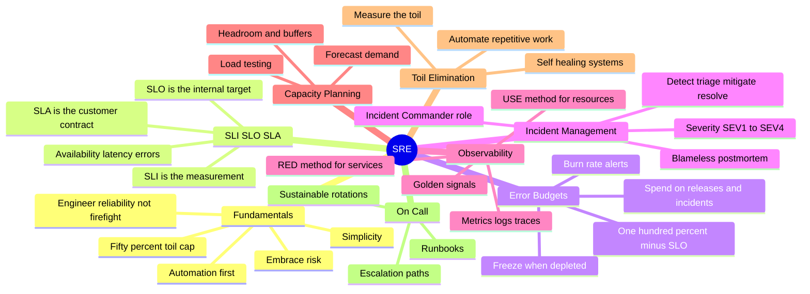
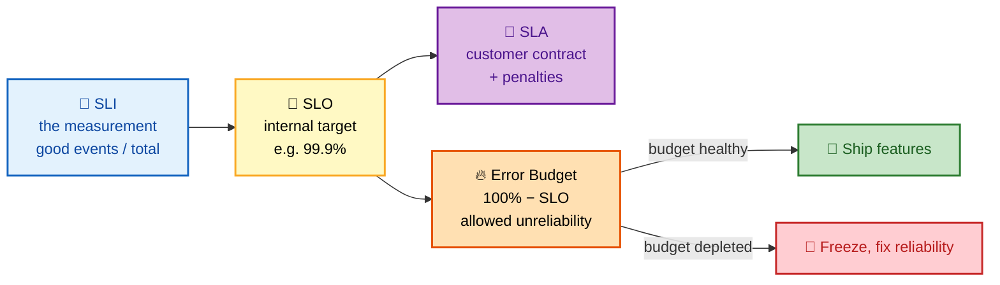
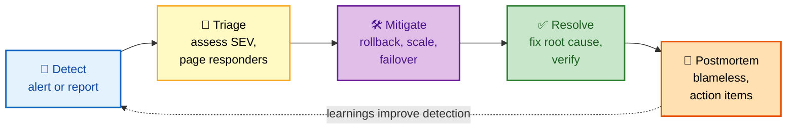
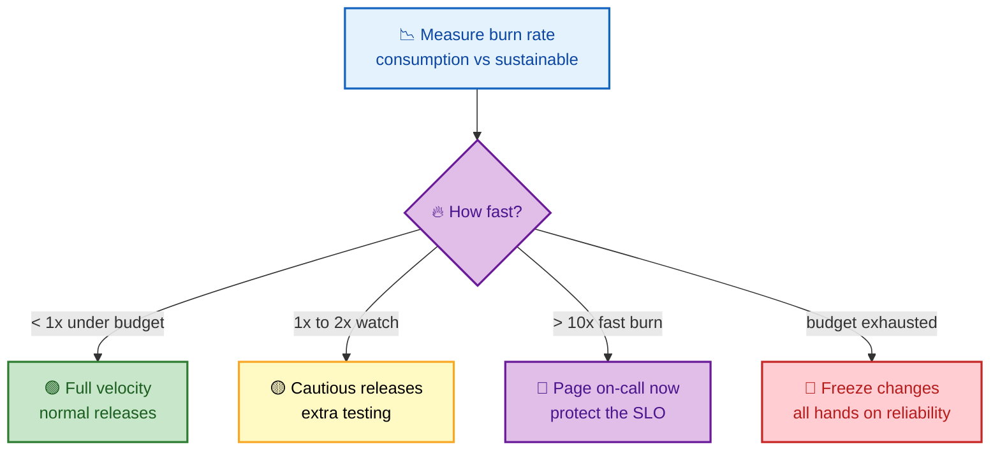

# SRE Interview Questions - Complete Guide

> **200+ SRE Interview Questions for Senior Site Reliability Engineer roles at FAANG companies**

---

## 📋 Table of Contents

- [SRE Fundamentals](#sre-fundamentals)
- [SLI/SLO/SLA](#slislosla)
- [Error Budgets](#error-budgets)
- [Incident Management](#incident-management)
- [Observability](#observability)
- [Capacity Planning](#capacity-planning)
- [Toil Elimination](#toil-elimination)
- [On-Call Best Practices](#on-call-best-practices)

---

## 🗺️ Visual Overview

**Mind map — the whole SRE domain at a glance** (skim this first, revisit it last):



**The SLI → SLO → SLA → error budget relationship** (the single most-tested SRE concept):



**The incident lifecycle — memorize this five-step flow** (postmortem feeds detection back):



**Error budget burn-rate decision** (how fast you're spending the budget drives the response):



> 🧠 **Memory hooks (mnemonics):**
> - **SLI / SLO / SLA:** *Indicator → Objective → Agreement* — "**I** measure, **O** aim, **A** promise." Strictness order: your **SLO is always ≥ (stricter than) your SLA** so you have headroom before breaching the contract.
> - **Golden Signals (Google):** *"LETS Track"* → **L**atency, **E**rrors, **T**raffic, **S**aturation.
> - **RED = services (what users feel):** **R**ate, **E**rrors, **D**uration.
> - **USE = resources (what machines feel):** **U**tilization, **S**aturation, **E**rrors.
> - **Error budget rule:** *"Budget green → ship; budget red → fix."* Error budget = 100% − SLO.
> - **Incident flow:** *"Detectives Triage Messy Real Postmortems"* → **D**etect → **T**riage → **M**itigate → **R**esolve → **P**ostmortem.

---

## SRE Fundamentals

### 🟢 Basic Questions

#### Q1: What is SRE and how does it differ from traditional Ops?

**Basic Answer:**
SRE applies software engineering practices to operations. Focus on automation, reliability targets (SLOs), error budgets, and treating operations as a software problem. Traditional Ops focuses on manual processes and reactive firefighting.

**Advanced Answer:**

```
┌─────────────────────────────────────────────────────────────────┐
│                    SRE vs TRADITIONAL OPS                        │
├─────────────────────────────────────────────────────────────────┤
│                                                                  │
│  TRADITIONAL OPS              │  SRE                            │
│  ─────────────────────────────┼───────────────────────────────  │
│  Manual processes             │  Automation-first               │
│  Reactive (firefighting)      │  Proactive (SLO-driven)         │
│  "Keep it running"            │  "Engineer reliability"         │
│  Operations knowledge         │  Software + operations          │
│  Undefined reliability        │  Measurable SLOs                │
│  Change = risk                │  Change = managed risk          │
│  Siloed from development      │  Embedded with dev teams        │
│                                                                  │
│  SRE PRINCIPLES:                                                │
│  ┌─────────────────────────────────────────────────────────┐    │
│  │                                                          │    │
│  │  1. Embrace Risk                                         │    │
│  │     • 100% reliability is impossible and undesirable     │    │
│  │     • Balance reliability with feature velocity          │    │
│  │                                                          │    │
│  │  2. Service Level Objectives (SLOs)                      │    │
│  │     • Measurable reliability targets                     │    │
│  │     • Data-driven decision making                        │    │
│  │                                                          │    │
│  │  3. Eliminate Toil                                       │    │
│  │     • Automate repetitive manual work                    │    │
│  │     • Cap toil at 50% of time                            │    │
│  │                                                          │    │
│  │  4. Monitoring & Observability                           │    │
│  │     • Metrics, logs, traces                              │    │
│  │     • Alerting on symptoms, not causes                   │    │
│  │                                                          │    │
│  │  5. Automation                                           │    │
│  │     • Self-healing systems                               │    │
│  │     • Reduce human intervention                          │    │
│  │                                                          │    │
│  │  6. Release Engineering                                  │    │
│  │     • Safe deployments (canary, blue-green)              │    │
│  │     • Rollback capability                                │    │
│  │                                                          │    │
│  │  7. Simplicity                                           │    │
│  │     • Remove unnecessary complexity                      │    │
│  │     • Technical debt management                          │    │
│  │                                                          │    │
│  └─────────────────────────────────────────────────────────┘    │
│                                                                  │
│  GOOGLE'S 50% RULE:                                             │
│  ┌─────────────────────────────────────────────────────────┐    │
│  │                                                          │    │
│  │  SRE Time Allocation:                                    │    │
│  │  ┌────────────────────────────────────────────────────┐  │    │
│  │  │ Toil/Ops Work │ Engineering Work                  │  │    │
│  │  │     ≤50%      │        ≥50%                       │  │    │
│  │  └────────────────────────────────────────────────────┘  │    │
│  │                                                          │    │
│  │  If ops > 50%:                                           │    │
│  │  • Redirect engineering to reduce toil                   │    │
│  │  • Send excess tickets to development team               │    │
│  │  • Escalate capacity/headcount needs                     │    │
│  │                                                          │    │
│  └─────────────────────────────────────────────────────────┘    │
│                                                                  │
└─────────────────────────────────────────────────────────────────┘
```

---

## SLI/SLO/SLA

### 🟡 Intermediate Questions

#### Q2: Explain SLI, SLO, and SLA. How do you define them for a service?

**Basic Answer:**
- **SLI (Service Level Indicator)**: A metric that measures service behavior (e.g., latency, error rate)
- **SLO (Service Level Objective)**: A target value for an SLI (e.g., 99.9% availability)
- **SLA (Service Level Agreement)**: A contract with customers including consequences for missing targets

**Advanced Answer:**

```
┌─────────────────────────────────────────────────────────────────┐
│                    SLI / SLO / SLA                               │
├─────────────────────────────────────────────────────────────────┤
│                                                                  │
│  HIERARCHY:                                                     │
│  ┌─────────────────────────────────────────────────────────┐    │
│  │                                                          │    │
│  │  SLA (External Promise to Customers)                     │    │
│  │  └── SLO (Internal Target)                               │    │
│  │      └── SLI (Measurement)                               │    │
│  │                                                          │    │
│  │  Example:                                                │    │
│  │  SLA: "99.9% monthly availability or credit"             │    │
│  │  SLO: "99.95% availability" (more strict than SLA)       │    │
│  │  SLI: "successful_requests / total_requests"             │    │
│  │                                                          │    │
│  └─────────────────────────────────────────────────────────┘    │
│                                                                  │
│  COMMON SLIs BY TYPE:                                           │
│  ┌─────────────────────────────────────────────────────────┐    │
│  │                                                          │    │
│  │  REQUEST-DRIVEN (APIs, Web)                              │    │
│  │  • Availability: successful_requests / total_requests    │    │
│  │  • Latency: requests < threshold / total_requests        │    │
│  │  • Quality: requests without degradation / total         │    │
│  │                                                          │    │
│  │  DATA PROCESSING (Pipelines, ETL)                        │    │
│  │  • Freshness: time since last successful update          │    │
│  │  • Correctness: valid records / total records            │    │
│  │  • Coverage: records processed / records expected        │    │
│  │                                                          │    │
│  │  STORAGE (Databases, Object Storage)                     │    │
│  │  • Durability: data not lost / total data                │    │
│  │  • Throughput: bytes served / time                       │    │
│  │                                                          │    │
│  └─────────────────────────────────────────────────────────┘    │
│                                                                  │
│  SLO SPECIFICATION EXAMPLE:                                     │
│  ┌─────────────────────────────────────────────────────────┐    │
│  │                                                          │    │
│  │  Service: Payment API                                    │    │
│  │  Window: Rolling 30 days                                 │    │
│  │                                                          │    │
│  │  ┌─────────────────────────────────────────────────────┐ │    │
│  │  │ SLO Name        │ SLI Definition       │ Target     │ │    │
│  │  ├─────────────────┼──────────────────────┼────────────┤ │    │
│  │  │ Availability    │ 2xx responses / all  │ 99.95%     │ │    │
│  │  │ Latency (p50)   │ requests < 100ms     │ 99%        │ │    │
│  │  │ Latency (p99)   │ requests < 500ms     │ 99%        │ │    │
│  │  │ Error Rate      │ 5xx responses / all  │ < 0.1%     │ │    │
│  │  └─────────────────────────────────────────────────────┘ │    │
│  │                                                          │    │
│  │  Prometheus Query for Availability SLI:                  │    │
│  │  sum(rate(http_requests_total{code=~"2.."}[30d]))       │    │
│  │  /                                                       │    │
│  │  sum(rate(http_requests_total[30d]))                     │    │
│  │                                                          │    │
│  └─────────────────────────────────────────────────────────┘    │
│                                                                  │
│  SLO MATH:                                                      │
│  ┌─────────────────────────────────────────────────────────┐    │
│  │                                                          │    │
│  │  Target    │ Monthly Downtime │ Daily Downtime          │    │
│  │  ──────────┼──────────────────┼─────────────────────────│    │
│  │  99%       │ 7.3 hours        │ 14.4 minutes            │    │
│  │  99.9%     │ 43.8 minutes     │ 1.44 minutes            │    │
│  │  99.95%    │ 21.9 minutes     │ 43.2 seconds            │    │
│  │  99.99%    │ 4.38 minutes     │ 8.64 seconds            │    │
│  │  99.999%   │ 26.3 seconds     │ 0.86 seconds            │    │
│  │                                                          │    │
│  └─────────────────────────────────────────────────────────┘    │
│                                                                  │
└─────────────────────────────────────────────────────────────────┘
```

---

## Error Budgets

### 🔴 Advanced Questions

#### Q3: How do error budgets work and how do you use them to balance reliability and velocity?

**Basic Answer:**
Error budget = allowed unreliability (e.g., 99.9% SLO = 0.1% error budget). When budget is healthy, prioritize feature development. When depleted, focus on reliability work.

**Advanced Answer:**

```
┌─────────────────────────────────────────────────────────────────┐
│                    ERROR BUDGET                                  │
├─────────────────────────────────────────────────────────────────┤
│                                                                  │
│  CONCEPT:                                                       │
│  ┌─────────────────────────────────────────────────────────┐    │
│  │                                                          │    │
│  │  SLO Target: 99.9% availability                          │    │
│  │  Error Budget: 100% - 99.9% = 0.1%                       │    │
│  │                                                          │    │
│  │  30-day window:                                          │    │
│  │  Total minutes: 30 × 24 × 60 = 43,200 minutes            │    │
│  │  Error budget: 43,200 × 0.001 = 43.2 minutes             │    │
│  │                                                          │    │
│  │  You can "spend" 43.2 minutes of downtime per month      │    │
│  │  on deployments, incidents, maintenance, etc.            │    │
│  │                                                          │    │
│  └─────────────────────────────────────────────────────────┘    │
│                                                                  │
│  ERROR BUDGET POLICY:                                           │
│  ┌─────────────────────────────────────────────────────────┐    │
│  │                                                          │    │
│  │  Budget Status      │ Action                             │    │
│  │  ───────────────────┼────────────────────────────────────│    │
│  │  > 50% remaining    │ Full velocity, normal releases     │    │
│  │  25-50% remaining   │ Cautious releases, extra testing   │    │
│  │  < 25% remaining    │ Freeze non-critical changes        │    │
│  │  Exhausted (0%)     │ All hands on reliability           │    │
│  │                                                          │    │
│  │  Budget consumption triggers:                            │    │
│  │  • Halt feature releases                                 │    │
│  │  • Mandatory blameless postmortem                        │    │
│  │  • Dev team helps with reliability work                  │    │
│  │                                                          │    │
│  └─────────────────────────────────────────────────────────┘    │
│                                                                  │
│  VISUALIZATION:                                                 │
│  ┌─────────────────────────────────────────────────────────┐    │
│  │                                                          │    │
│  │  Error Budget Burn-Down (30-day window)                  │    │
│  │                                                          │    │
│  │  100% ┤                                                  │    │
│  │       │ ○ Budget Start                                   │    │
│  │   80% ┤   ╲                                              │    │
│  │       │    ╲  ← Deployment (5 min outage)                │    │
│  │   60% ┤     ╲______                                      │    │
│  │       │            ╲  ← Incident (15 min)                │    │
│  │   40% ┤             ╲___                                 │    │
│  │       │                 ╲                                │    │
│  │   20% ┤                  ╲                               │    │
│  │       │                   ╲  ← Freeze deployments!       │    │
│  │    0% ┼─────────────────────────────────────────────     │    │
│  │       Day 1              Day 15              Day 30      │    │
│  │                                                          │    │
│  └─────────────────────────────────────────────────────────┘    │
│                                                                  │
│  PROMETHEUS ERROR BUDGET QUERY:                                 │
│  ┌─────────────────────────────────────────────────────────┐    │
│  │                                                          │    │
│  │  # Error budget remaining (percentage)                   │    │
│  │  (                                                       │    │
│  │    (1 - slo_target) * window_seconds                     │    │
│  │    -                                                     │    │
│  │    sum(error_seconds_total)                              │    │
│  │  ) / ((1 - slo_target) * window_seconds) * 100           │    │
│  │                                                          │    │
│  │  # Burn rate (how fast we're consuming budget)           │    │
│  │  sum(rate(http_requests_total{code=~"5.."}[1h]))        │    │
│  │  /                                                       │    │
│  │  sum(rate(http_requests_total[1h]))                      │    │
│  │  /                                                       │    │
│  │  (1 - 0.999)  # SLO target of 99.9%                      │    │
│  │                                                          │    │
│  │  # Burn rate > 1 means consuming budget faster than      │    │
│  │  # sustainable over the SLO window                       │    │
│  │                                                          │    │
│  └─────────────────────────────────────────────────────────┘    │
│                                                                  │
└─────────────────────────────────────────────────────────────────┘
```

---

## Incident Management

### 🔴 Advanced Questions

#### Q4: Describe your incident management process. What makes a good postmortem?

**Basic Answer:**
Incident management includes detection, triage, mitigation, resolution, and postmortem. Good postmortems are blameless, focus on systemic issues, have actionable items, and share learnings.

**Advanced Answer:**

```
┌─────────────────────────────────────────────────────────────────┐
│                    INCIDENT MANAGEMENT                           │
├─────────────────────────────────────────────────────────────────┤
│                                                                  │
│  INCIDENT LIFECYCLE:                                            │
│  ┌─────────────────────────────────────────────────────────┐    │
│  │                                                          │    │
│  │  Detection                                               │    │
│  │      │  • Alert fires                                    │    │
│  │      │  • Customer report                                │    │
│  │      │  • Monitoring anomaly                             │    │
│  │      ▼                                                   │    │
│  │  Triage (< 5 min)                                        │    │
│  │      │  • Assess severity (SEV1-4)                       │    │
│  │      │  • Page appropriate responders                    │    │
│  │      │  • Open incident channel                          │    │
│  │      ▼                                                   │    │
│  │  Roles Established                                       │    │
│  │      │  • Incident Commander (IC)                        │    │
│  │      │  • Communications Lead                            │    │
│  │      │  • Operations Lead                                │    │
│  │      ▼                                                   │    │
│  │  Mitigation                                              │    │
│  │      │  • Rollback if deployment-related                 │    │
│  │      │  • Scale up if capacity issue                     │    │
│  │      │  • Failover if regional issue                     │    │
│  │      │  • Mitigate first, investigate later              │    │
│  │      ▼                                                   │    │
│  │  Resolution                                              │    │
│  │      │  • Fix root cause                                 │    │
│  │      │  • Verify fix                                     │    │
│  │      │  • Update status page                             │    │
│  │      ▼                                                   │    │
│  │  Postmortem (within 48-72 hours)                         │    │
│  │      • Blameless review                                  │    │
│  │      • Root cause analysis                               │    │
│  │      • Action items                                      │    │
│  │                                                          │    │
│  └─────────────────────────────────────────────────────────┘    │
│                                                                  │
│  SEVERITY LEVELS:                                               │
│  ┌─────────────────────────────────────────────────────────┐    │
│  │                                                          │    │
│  │  SEV1 │ Critical: Total outage, data loss, security      │    │
│  │       │ Response: Immediate, all-hands, exec notified    │    │
│  │  ─────┼──────────────────────────────────────────────────│    │
│  │  SEV2 │ Major: Significant degradation, partial outage   │    │
│  │       │ Response: < 15 min, dedicated team               │    │
│  │  ─────┼──────────────────────────────────────────────────│    │
│  │  SEV3 │ Minor: Performance degradation, workaround exists│    │
│  │       │ Response: < 4 hours, next business day           │    │
│  │  ─────┼──────────────────────────────────────────────────│    │
│  │  SEV4 │ Low: Minor issue, cosmetic, no customer impact   │    │
│  │       │ Response: Normal ticket queue                    │    │
│  │                                                          │    │
│  └─────────────────────────────────────────────────────────┘    │
│                                                                  │
│  BLAMELESS POSTMORTEM TEMPLATE:                                 │
│  ┌─────────────────────────────────────────────────────────┐    │
│  │                                                          │    │
│  │  ## Incident Summary                                     │    │
│  │  - Duration: 2024-01-15 14:30 - 15:45 UTC (75 min)       │    │
│  │  - Severity: SEV2                                        │    │
│  │  - Impact: 15% of users saw 5xx errors                   │    │
│  │  - Error Budget Consumed: 45 minutes                     │    │
│  │                                                          │    │
│  │  ## Timeline                                             │    │
│  │  14:30 - Alert: Error rate > 5%                          │    │
│  │  14:35 - IC assigned, incident channel created           │    │
│  │  14:45 - Root cause identified: bad deploy               │    │
│  │  14:50 - Rollback initiated                              │    │
│  │  15:45 - All systems normal                              │    │
│  │                                                          │    │
│  │  ## Root Cause                                           │    │
│  │  A database query in the new release had O(n²)           │    │
│  │  complexity, causing timeouts under production load.     │    │
│  │                                                          │    │
│  │  ## Contributing Factors                                 │    │
│  │  - Load testing didn't use production-scale data         │    │
│  │  - No query performance monitoring in staging            │    │
│  │  - Canary deployment didn't catch the regression         │    │
│  │                                                          │    │
│  │  ## Action Items                                         │    │
│  │  - [ ] Add query performance to staging (Owner: @alice)  │    │
│  │  - [ ] Implement production-scale load tests (@bob)      │    │
│  │  - [ ] Extend canary observation window (@carol)         │    │
│  │                                                          │    │
│  │  ## Lessons Learned                                      │    │
│  │  - What went well: Fast detection, smooth rollback       │    │
│  │  - What went wrong: Testing gap for large datasets       │    │
│  │  - Where we got lucky: Low-traffic window                │    │
│  │                                                          │    │
│  └─────────────────────────────────────────────────────────┘    │
│                                                                  │
└─────────────────────────────────────────────────────────────────┘
```

---

## Observability

### 🟡 Intermediate Questions

#### Q5: What is observability? How do you implement the three pillars?

**Basic Answer:**
Observability is the ability to understand system state from external outputs. Three pillars: Metrics (what's happening), Logs (detailed events), Traces (request flow).

**Advanced Answer:**

```
┌─────────────────────────────────────────────────────────────────┐
│                    OBSERVABILITY PILLARS                         │
├─────────────────────────────────────────────────────────────────┤
│                                                                  │
│  ┌─────────────────────────────────────────────────────────┐    │
│  │                   THREE PILLARS                          │    │
│  │                                                          │    │
│  │  ┌──────────┐   ┌──────────┐   ┌──────────┐             │    │
│  │  │ METRICS  │   │  LOGS    │   │ TRACES   │             │    │
│  │  │          │   │          │   │          │             │    │
│  │  │ Numbers  │   │ Events   │   │ Requests │             │    │
│  │  │ over time│   │ in detail│   │ across   │             │    │
│  │  │          │   │          │   │ services │             │    │
│  │  └────┬─────┘   └────┬─────┘   └────┬─────┘             │    │
│  │       │              │              │                    │    │
│  │       └──────────────┼──────────────┘                    │    │
│  │                      │                                   │    │
│  │              ┌───────▼───────┐                           │    │
│  │              │  Correlation  │                           │    │
│  │              │   by time,    │                           │    │
│  │              │  trace ID,    │                           │    │
│  │              │  request ID   │                           │    │
│  │              └───────────────┘                           │    │
│  │                                                          │    │
│  └─────────────────────────────────────────────────────────┘    │
│                                                                  │
│  METRICS (Prometheus/Grafana):                                  │
│  ┌─────────────────────────────────────────────────────────┐    │
│  │                                                          │    │
│  │  Types:                                                  │    │
│  │  • Counter: Cumulative (requests_total)                  │    │
│  │  • Gauge: Current value (memory_bytes)                   │    │
│  │  • Histogram: Distribution (request_duration_seconds)    │    │
│  │  • Summary: Pre-calculated percentiles                   │    │
│  │                                                          │    │
│  │  RED Method (Request-focused):                           │    │
│  │  • Rate: requests per second                             │    │
│  │  • Errors: failed requests per second                    │    │
│  │  • Duration: latency percentiles                         │    │
│  │                                                          │    │
│  │  USE Method (Resource-focused):                          │    │
│  │  • Utilization: % time resource is busy                  │    │
│  │  • Saturation: degree of queuing                         │    │
│  │  • Errors: error count                                   │    │
│  │                                                          │    │
│  │  Example:                                                │    │
│  │  http_requests_total{method="GET",status="200"} 12345    │    │
│  │  http_request_duration_seconds_bucket{le="0.1"} 9876     │    │
│  │                                                          │    │
│  └─────────────────────────────────────────────────────────┘    │
│                                                                  │
│  LOGS (ELK/Loki):                                               │
│  ┌─────────────────────────────────────────────────────────┐    │
│  │                                                          │    │
│  │  Structured Logging Best Practices:                      │    │
│  │  {                                                       │    │
│  │    "timestamp": "2024-01-15T14:30:00Z",                  │    │
│  │    "level": "error",                                     │    │
│  │    "service": "payment-api",                             │    │
│  │    "trace_id": "abc123",                                 │    │
│  │    "user_id": "user-456",                                │    │
│  │    "message": "Payment failed",                          │    │
│  │    "error": "Card declined",                             │    │
│  │    "duration_ms": 1234                                   │    │
│  │  }                                                       │    │
│  │                                                          │    │
│  │  Log Levels:                                             │    │
│  │  DEBUG → INFO → WARN → ERROR → FATAL                     │    │
│  │                                                          │    │
│  │  Production: INFO and above                              │    │
│  │  Debugging: Enable DEBUG dynamically                     │    │
│  │                                                          │    │
│  └─────────────────────────────────────────────────────────┘    │
│                                                                  │
│  TRACES (Jaeger/Zipkin):                                        │
│  ┌─────────────────────────────────────────────────────────┐    │
│  │                                                          │    │
│  │  Trace: Full journey of a request                        │    │
│  │  ├── Span: Single operation                              │    │
│  │  │   ├── Span: Child operation                           │    │
│  │  │   └── Span: Child operation                           │    │
│  │  └── Span: Another operation                             │    │
│  │                                                          │    │
│  │  Visual:                                                 │    │
│  │  ┌─────────────────────────────────────────────────────┐ │    │
│  │  │ API Gateway  ████████████████████████████████        │ │    │
│  │  │ Auth Service      ██████                             │ │    │
│  │  │ User Service           ████████                      │ │    │
│  │  │ Database                    ████                     │ │    │
│  │  └─────────────────────────────────────────────────────┘ │    │
│  │    0ms      50ms     100ms    150ms    200ms             │    │
│  │                                                          │    │
│  │  Context Propagation Headers:                            │    │
│  │  traceparent: 00-abc123-def456-01                        │    │
│  │  tracestate: vendor=value                                │    │
│  │                                                          │    │
│  └─────────────────────────────────────────────────────────┘    │
│                                                                  │
└─────────────────────────────────────────────────────────────────┘
```

---

## 📚 Documentation Links

- [Google SRE Book](https://sre.google/sre-book/table-of-contents/)
- [Google SRE Workbook](https://sre.google/workbook/table-of-contents/)
- [OpenTelemetry](https://opentelemetry.io/docs/)
- [Prometheus Best Practices](https://prometheus.io/docs/practices/)

---

**[← Back to Main README](../README.md)** | **[Next: Behavioral →](../behavioral/README.md)**
