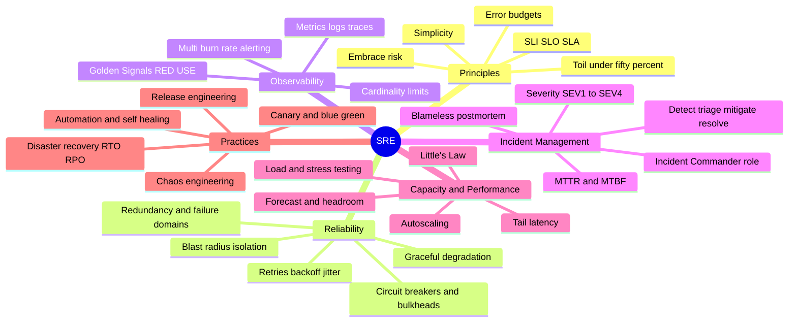
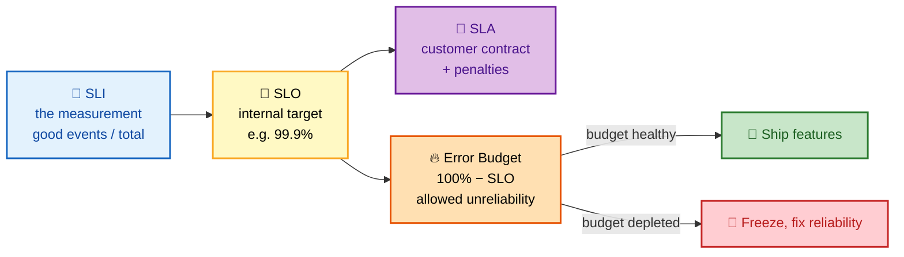
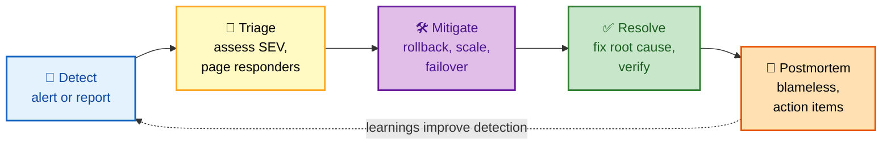

# SRE — Deep Dive Interview Preparation

> **Scope:** Site Reliability Engineering for Senior SRE, DevOps, and Platform Engineer roles at FAANG-level bars — SLOs and error budgets, resilience patterns, observability and SLO alerting, incident management, capacity and performance, and the release/chaos/DR practices that keep velocity high.

This guide is split **section-wise** so each file is a focused, interview-ready study unit. Start at Section 1 and go in order — each section builds the mental model the next one assumes.

---

## 📚 Master Table of Contents

| # | Section | What it covers | Interview weight |
|---|---|---|---|
| 01 | [Principles & Error Budgets](./01-PRINCIPLES.md) | SRE vs DevOps vs Ops, Google's tenets, SLI/SLO/SLA, availability math, error budgets & policy, toil & the 50% rule | 🔥🔥🔥 Very High |
| 02 | [Reliability & Resilience](./02-RELIABILITY.md) | Redundancy & failure domains, blast radius, timeouts/retries/backoff/jitter, circuit breakers, bulkheads, load shedding, graceful degradation, cascading failure | 🔥🔥🔥 Very High |
| 03 | [Observability](./03-OBSERVABILITY.md) | Three pillars, metric types & cardinality, Golden Signals/RED/USE, logs & traces, SLO multi-burn-rate alerting, dashboards | 🔥🔥🔥 Very High |
| 04 | [Incident Management](./04-INCIDENT-MANAGEMENT.md) | Incident lifecycle, command roles, severity, MTTD/MTTA/MTTR/MTBF, blameless postmortems, runbooks, on-call | 🔥🔥🔥 Very High |
| 05 | [Capacity & Performance](./05-CAPACITY-PERFORMANCE.md) | Capacity planning, headroom/N+k, load & stress testing, autoscaling, Little's Law, tail latency, performance analysis | 🔥🔥 High |
| 06 | [Practices: Release, Chaos & DR](./06-PRACTICES.md) | Release engineering, canary/blue-green, feature flags, chaos engineering, automation, RTO/RPO, game days | 🔥🔥 High |

---

## 🧭 Suggested Study Order

1. **Principles (01)** — you can't reason about anything else until SLI/SLO/SLA, error budgets, and toil are automatic. This is the vocabulary the whole field speaks in.
2. **Reliability (02)** — the "design for failure" patterns (retries, circuit breakers, bulkheads, blast radius) that everything operational depends on.
3. **Observability (03)** — you can't run what you can't see; the three pillars and SLO burn-rate alerting are high-frequency questions.
4. **Incident Management (04)** — how you respond when reliability fails; command roles, "mitigate first," and blameless postmortems are near-universal.
5. **Capacity & Performance (05)** — the math (Little's Law, percentiles, headroom) behind keeping systems fast and unsaturated.
6. **Practices (06)** — release engineering, chaos, and DR tie it together; revisit last since they reference every prior section.

---

## 🗺️ Repo-Wide Visual Overview

**Mind map — the entire SRE domain at a glance** (skim first, revisit last):

**The SLI → SLO → SLA → error budget chain — the single most-tested SRE concept:**

**The incident lifecycle — the five-step flow that connects reliability to learning:**

> 🧠 **One-line mental model:** *"SRE turns reliability into a number (SLO), gives failure a budget (error budget), spends that budget to move fast, and engineers away the toil and the fires."* Say that and you've framed the entire discipline.

---

## 🧠 Repo-Wide Memory Hooks

> - **SLI / SLO / SLA:** *"I measure, O aim, A promise"* — SLO is always stricter than SLA.
> - **Error budget:** *"Budget green → ship; budget red → fix."* Error budget = 100% − SLO.
> - **Golden Signals:** *"LETS Track"* → Latency, Errors, Traffic, Saturation. **RED** = services; **USE** = resources.
> - **Incident flow:** *"Detectives Triage Messy Real Postmortems"* → Detect → Triage → Mitigate → Resolve → Postmortem. Golden rule: **mitigate first, diagnose later.**
> - **Resilience:** *"Redundancy, Isolate, Absorb, Degrade"* (RIAD). Circuit breaker states: **C**losed → **O**pen → **H**alf-open.
> - **DR pair:** R**T**O = **T**ime to recover; R**P**O = data (**P**oints) you can lose.
> - **Toil:** cap at ≤ 50%; the other half engineers it away.

---

## How to Use This Guide

- Each section opens with a **Visual Overview** (mind map + colorful diagrams + mnemonics) — use it to prime before and to review after.
- Topics carry an **Interview weight** tag and an **In one line** summary so you can triage what to memorize.
- Every section ends with an **Interview Questions & Answers** block (crisp answer → reasoning → follow-up), plus best practices and official docs.

---

## 📚 Documentation Links

- [Google SRE Book — full text](https://sre.google/sre-book/table-of-contents/)
- [Google SRE Workbook](https://sre.google/workbook/table-of-contents/)
- [Implementing SLOs (SRE Workbook)](https://sre.google/workbook/implementing-slos/)
- [Alerting on SLOs — multi-burn-rate (SRE Workbook)](https://sre.google/workbook/alerting-on-slos/)
- [OpenTelemetry](https://opentelemetry.io/docs/)
- [Principles of Chaos Engineering](https://principlesofchaos.org/)

---

**[← Back to Main README](../README.md)** | **[Start: Principles & Error Budgets →](./01-PRINCIPLES.md)** | **[Next Domain: Behavioral →](../behavioral/README.md)**
